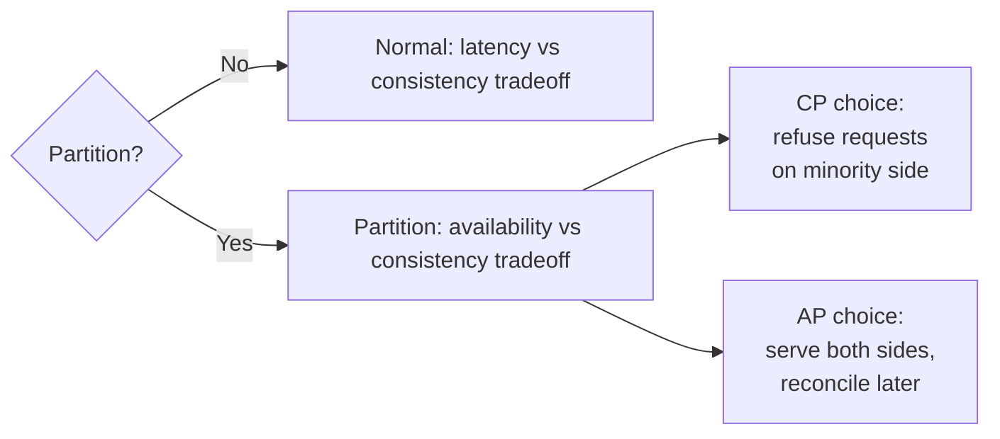
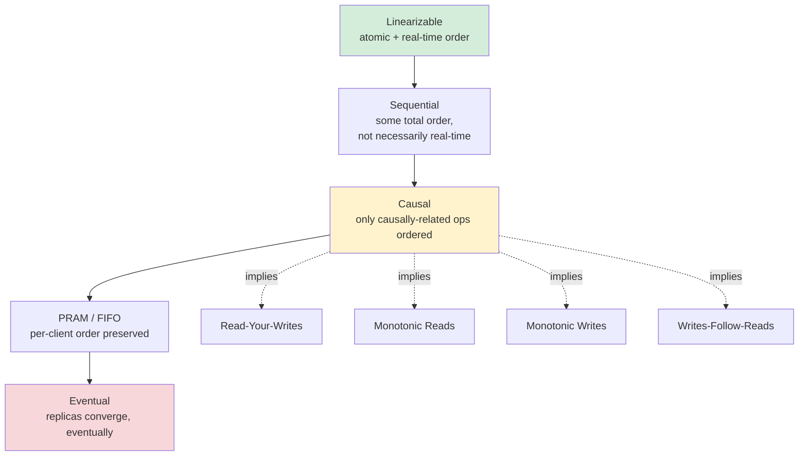
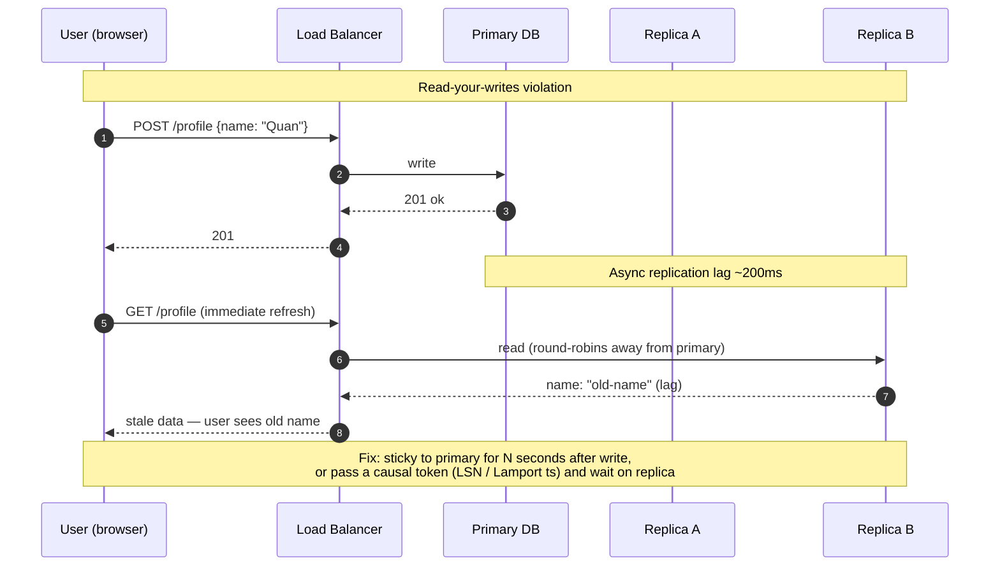

# CAP, PACELC, and Consistency Models — Strong, Eventual, Causal, Linearizable

**Date:** 2026-04-24 | **Updated:** 2026-04-24
**Tags:** `system-design` `foundations` `consistency` `cap-theorem` `distributed-systems`

## Table of Contents

- [Summary](#summary)
- [Why This Matters](#why-this-matters)
- [The CAP Theorem — What It Actually Says vs Folklore](#the-cap-theorem--what-it-actually-says-vs-folklore)
  - [The Formal Statement](#the-formal-statement)
  - [What CAP Does Not Say](#what-cap-does-not-say)
- [The P in CAP Is Not Optional](#the-p-in-cap-is-not-optional)
- [PACELC — The Latency Half CAP Ignores](#pacelc--the-latency-half-cap-ignores)
- [Consistency Models Hierarchy](#consistency-models-hierarchy)
  - [Linearizability](#linearizability)
  - [Sequential Consistency](#sequential-consistency)
  - [Causal Consistency](#causal-consistency)
  - [Eventual Consistency](#eventual-consistency)
  - [Session Guarantees — The Middle Ground You Actually Want](#session-guarantees--the-middle-ground-you-actually-want)
- [Isolation vs Consistency — Stop Conflating Them](#isolation-vs-consistency--stop-conflating-them)
- [Real-World Systems Mapped](#real-world-systems-mapped)
- [Picking a Model For Your Feature](#picking-a-model-for-your-feature)
- [Common Misconceptions](#common-misconceptions)
- [Design-Review Phrases That Actually Work](#design-review-phrases-that-actually-work)
- [Related](#related)
- [References](#references)

## Summary

CAP says that during a network partition a distributed system must choose between refusing requests (C) or serving possibly stale ones (A); it says nothing about the non-partition case. **PACELC** fills that gap: even when the network is healthy (E), you still trade latency (L) against consistency (C). **Consistency models** are the actual vocabulary that matters day-to-day — linearizable, sequential, causal, and eventual form a hierarchy, and the session guarantees (read-your-writes, monotonic reads, monotonic writes, writes-follow-reads) are what you usually really need.

## Why This Matters

In a design review someone will say "we'll use Cassandra for high availability" or "let's use DynamoDB because it's eventually consistent." Both sentences are almost meaningless without the vocabulary below. The goal of this doc is not to teach you what "eventual consistency" means — you already know roughly — but to give you the precise words to:

- Reject "CA systems" as a category (there is no such thing in a partitionable network).
- Challenge "we need strong consistency" when the requirement is actually read-your-writes.
- Articulate _which_ of the four anomalies a proposed design allows, instead of waving at "stale reads."
- Separate isolation (transaction semantics) from consistency (single-object replication semantics) so nobody conflates Serializable with Linearizable.

If you can do that in a design review you're operating a tier above people who just chant CAP.

## The CAP Theorem — What It Actually Says vs Folklore

The folk version ("pick two of three") is wrong enough to actively mislead. The formal version is narrower and more useful.

### The Formal Statement

Proved by Gilbert and Lynch (2002) as a formalization of Brewer's conjecture. For an asynchronous network model, you cannot simultaneously guarantee all three of:

| Property | Definition |
|----------|------------|
| **Consistency (C)** | Every read returns the result of the most recent write — specifically, **linearizability** (more on that below). |
| **Availability (A)** | Every request to a non-failing node returns a non-error response in finite time. |
| **Partition tolerance (P)** | The system continues to operate despite arbitrary message loss between nodes. |

The actual theorem is: **when a partition occurs, you must choose between C and A.** That's it. During normal operation the theorem says nothing.

### What CAP Does Not Say

- It does not say "pick 2 of 3 forever." The choice is only forced during a partition.
- It does not classify your database. "Cassandra is AP" is a simplification — Cassandra can be tuned from AP-ish to strongly-consistent-ish per query via `QUORUM` / `LOCAL_QUORUM` / `ALL`.
- It does not mean "CA systems" exist. A single-node RDBMS is not a CAP-CA system; it's a system that does not face partitions because it is not distributed. The moment you add a replica, P is back on the table.
- It says nothing about latency. A system that returns the right answer after 30 seconds is still "available" under CAP's definition. This is the gap PACELC fills.
- "Consistency" in CAP is linearizability — the strongest single-object model. It is not the same "C" as ACID's Consistency (invariant preservation), which is a different concept entirely.

## The P in CAP Is Not Optional

In any system with more than one node connected by a network, partitions will happen. Kernel bugs, GC pauses, bad switches, VPC route flaps, kernel livelocks, a cross-AZ link flapping — all look like partitions to your distributed state. You do not get to "choose P." You choose how to behave when P fires.

Framing:
- **CP systems** (Spanner, etcd, ZooKeeper, MongoDB majority writes, Postgres sync replication): sacrifice availability during partition. Minority partition stops taking writes; clients see errors or timeouts until the partition heals.
- **AP systems** (Cassandra with `ONE`, DynamoDB eventual reads, Riak, Dynamo-style stores): sacrifice consistency during partition. Both sides keep serving; you get divergence, and you reconcile via LWW, vector clocks, CRDTs, or app-level merge.

Neither is "better." They're different answers to "what do we owe the user when the cluster fractures?"

## PACELC — The Latency Half CAP Ignores

PACELC is Daniel Abadi's extension (2010/2012) and is far more useful than raw CAP in design reviews because it covers the 99.9% of time when the network is healthy:

> **If partitioned (P): choose Availability or Consistency (A/C). Else (E): choose Latency or Consistency (L/C).**

Every distributed store you care about slots in cleanly:

| System | Partition behavior | Normal-ops behavior | Shorthand |
|--------|--------------------|---------------------|-----------|
| Spanner (TrueTime) | CP | PC (consistency over latency — commit wait) | **PC/EC** |
| etcd, ZooKeeper | CP | PC | **PC/EC** |
| DynamoDB (default) | AP | EL (low latency eventual reads) | **PA/EL** |
| Cassandra (`ONE`) | AP | EL | **PA/EL** |
| Cassandra (`QUORUM`) | CP-ish | PC | **PC/EC** |
| MongoDB (majority) | CP | PC | **PC/EC** |
| MongoDB (local reads) | AP | EL | **PA/EL** |
| Postgres sync replica | CP | PC | **PC/EC** |
| Postgres async replica | AP-ish | EL | **PA/EL** |
| Riak, Voldemort | AP | EL | **PA/EL** |

The useful insight: **the EL/EC axis is where the interesting product trade-offs live.** Partitions are rare. Latency is every request. A system that's "strongly consistent" but takes 200ms per write because it needs a cross-region quorum is a latency disaster for an API that could have tolerated stale reads.

## Consistency Models Hierarchy

Consistency models are an ordering from strongest (simplest to reason about, most expensive) to weakest (cheapest, most anomalies). You want the weakest model that still lets you build the feature correctly.

### Linearizability

Also called **strong consistency**, **atomic consistency**, or **external consistency**. The gold standard.

Informal: the system behaves as if there is one copy of the data, and every operation appears to take effect at a single instant between its invocation and its response. If operation A completes before operation B starts (in wall-clock real time), every observer agrees A happened before B.

Concrete: if you `POST /order` and get 201, a subsequent `GET /orders/:id` from _any_ client anywhere in the world must see the order. No exceptions.

Cost: usually one round-trip to a quorum, often cross-region. Google Spanner uses TrueTime to make this globally linearizable at ~10ms commit-wait overhead. Most systems that claim "strong consistency" provide linearizability only within a region or only for a single key.

When to demand it: uniqueness constraints, leader election, distributed locks, financial ledger line-items, anything with "this must be atomic across the cluster."

### Sequential Consistency

Weaker than linearizable: there's still a single total order of operations that all clients agree on, but that order is not required to respect real-time. If client A's write completes at 10:00:00 and client B's read at 10:00:01 can be placed _before_ A's write in the global order, that's legal under sequential — and illegal under linearizable.

In practice, almost nobody designs for exactly "sequential" — you either pay for linearizable or accept something weaker like causal. Sequential mainly shows up in memory-model literature (Lamport's original).

### Causal Consistency

Operations that are _causally related_ (A happened-before B in the Lamport/vector-clock sense) are observed in that order by all nodes. Concurrent, unrelated operations can be seen in different orders by different observers.

Example: if user posts a comment, then edits it, every replica must show the edit only after the original post. But if user Alice posts and user Bob (unrelated) posts at the same time, different viewers can see them in different orders — that's fine.

Causal is the strongest model you can have **while remaining available during a partition** (proved by Attiya, Ellis, Morrison et al.). It's what COPS, Bayou, and modern CRDT-based systems (Redis CRDTs, AntidoteDB) offer.

### Eventual Consistency

The baseline: if writes stop, all replicas eventually converge to the same value. No ordering guarantee, no bound on "eventually." In a steady-state system under load, "eventually" is usually milliseconds; during incidents it can be hours.

Eventual alone is too weak for most features. You want at least the session guarantees below layered on top.

### Session Guarantees — The Middle Ground You Actually Want

From the 1994 Bayou paper. These are per-session (per-client) guarantees you can add on top of eventual consistency that kill the most jarring anomalies without the cost of full linearizability:

| Guarantee | Kills the anomaly of... | You notice when it's missing because... |
|-----------|-------------------------|------------------------------------------|
| **Read Your Writes (RYW)** | Writing something then not seeing it in the next read | User updates profile, refreshes, sees old name |
| **Monotonic Reads** | Successive reads moving backwards in time | Reload the feed, newest tweet disappears |
| **Monotonic Writes** | Writes from same client reordered | Update profile twice; final state is the earlier write |
| **Writes Follow Reads** | Write that depends on a read being applied before that read everywhere | Reply to a tweet appears before the tweet on another replica |

**The practical punchline:** when someone in a design review says "we need strong consistency," nine times out of ten what they actually need is read-your-writes plus monotonic reads, scoped to a single user's session. That's achievable with sticky routing, read-from-primary-after-write, or a causal token — no quorum writes required.

## Isolation vs Consistency — Stop Conflating Them

These are orthogonal axes and conflating them is the #1 mistake in design reviews.

- **Isolation** (ACID's I) is about **transactions on one node or one logical database**: what anomalies can occur when multiple transactions run concurrently. Levels: Read Uncommitted, Read Committed, Repeatable Read, Snapshot Isolation, Serializable.
- **Consistency models** (this doc) are about **reads and writes across replicas in a distributed system**: what ordering observers agree on.

The strongest combined guarantee is **strict serializable = serializable isolation + linearizable**. Spanner and CockroachDB offer this. Most systems do not — for instance:

- PostgreSQL on a primary: Serializable isolation, but async replicas give eventual (non-linearizable) reads.
- MongoDB with `majority` read/write concern: linearizable-ish single-document, but multi-document transactions are snapshot isolation only.
- DynamoDB: configurable per-item linearizable reads, but no cross-item serializable transactions without DynamoDB Transactions, which is its own constrained API.

**Rule for design reviews:** when someone says "we need ACID" ask "on which scope?" Single row, single document, single partition, cross-shard, cross-region? Each scope has a different price.

See [ACID vs BASE and Isolation Levels in Practice](../data-consistency/acid-vs-base-and-isolation-levels.md) (planned) and the database-side deep dive in [Storage and MVCC](../../database/engine-internals/storage-and-mvcc.md) for the transaction-isolation half of this picture.

## Real-World Systems Mapped

A reference table to keep in your head. "Tunable" means per-query or per-client.

| System | Default consistency | Tunable? | Partition behavior | PACELC |
|--------|---------------------|----------|--------------------|--------|
| **PostgreSQL (single primary)** | Serializable on primary; async replicas lag | Yes (`synchronous_commit`, sync standbys) | CP if sync, AP-ish if async | PC/EC or PA/EL |
| **PostgreSQL logical replica** | Eventual | Yes (wait-for-LSN) | AP-ish | PA/EL |
| **MySQL (semi-sync)** | Up to semi-sync | Yes (group replication for stronger) | CP-ish | PC/EC |
| **Google Spanner** | External consistency (strict serializable, global) | No (it's the point) | CP | PC/EC |
| **CockroachDB** | Serializable + linearizable (per range) | No | CP | PC/EC |
| **MongoDB** | Depends on read/write concern | Yes — `w: majority` + `linearizable` reads are strong | CP when majority | PC/EC (majority) or PA/EL (local) |
| **Cassandra** | Eventual (`ONE`) | Yes — `QUORUM`, `ALL`, `LOCAL_QUORUM`, `SERIAL` (LWT) | AP by default | PA/EL default; PC/EC at quorum |
| **DynamoDB** | Eventual reads by default | Yes — `ConsistentRead: true` for strongly consistent single-item | AP | PA/EL |
| **DynamoDB Global Tables** | Eventual across regions | No — last-writer-wins | AP | PA/EL |
| **etcd / ZooKeeper** | Linearizable (Raft / ZAB) | No | CP | PC/EC |
| **Redis (single node)** | Strong (single node) | N/A | N/A (not distributed) | — |
| **Redis Cluster / Sentinel** | Eventual across replicas | Yes (`WAIT`) | AP (replicas can serve stale) | PA/EL |
| **S3** | Read-after-write strong consistency (since 2020) | No | CP-ish | PC/EC |
| **Kafka** | Linearizable per partition (with `acks=all` + `min.insync.replicas`) | Yes | CP per partition | PC/EC |

Two implications:

1. **There are no pure "AP" or "CP" systems in production** — everything modern is tunable. Your database choice is less about CAP and more about the cost/ergonomics of the tuning it exposes.
2. **Per-operation tuning beats per-database choice.** A single service will read some keys strongly, other keys eventually. Design your API to _name_ which it needs, not pick one globally.

## Picking a Model For Your Feature

Translating requirements to models. Memorize this table.

| When the requirements doc says... | You probably need... | Cheap implementation |
|-----------------------------------|----------------------|----------------------|
| "Must be unique across the system" (usernames, slugs, order IDs) | **Linearizable** single-key CAS | Primary-only write + unique index, or DynamoDB conditional put |
| "Must not double-charge / double-spend" | **Linearizable** + idempotency key | Ledger on CP store + idempotency table |
| "Inventory must never oversell" | **Linearizable** decrement or serializable transaction | Primary-only stock counter with CAS |
| "Leader election / distributed lock" | **Linearizable** with fencing tokens | etcd / ZooKeeper / Consul |
| "User must see their own writes immediately" | **Read-your-writes** (session guarantee) | Route reads to primary for N seconds after write, or pass causal token |
| "Feed refresh should not go backwards" | **Monotonic reads** | Sticky to a replica or pass `last_seen_lsn` |
| "Chat message order must make sense" | **Causal** (per conversation) | Partition by conversation ID; vector clock or per-conversation sequence |
| "Dashboard / analytics / counts / leaderboard" | **Eventual** | Async replica or OLAP store; stamp "as of" |
| "Search index" | **Eventual** (sometimes seconds-bounded) | CDC → Elasticsearch |
| "Cross-region active-active with low latency" | **Eventual** + CRDTs or LWW | Dynamo Global Tables, Cassandra multi-DC, Redis CRDT |
| "Global uniqueness, active-active" | You can't have all three cheaply. Pick one: regional sharding, global CP store (Spanner), or app-level reservation protocol | — |

**The question to drill on in a review:** _What goes wrong if this read is 500ms stale? What goes wrong if it's 5 seconds stale?_ If the answer is "nothing user-visible," you don't need strong consistency. If the answer is "we double-charge," you do.

## Common Misconceptions

- **"CAP forces you to pick two."** No — CAP forces a C-or-A choice _only during a partition_. Outside that, PACELC's L-vs-C trade is the one you actually make every day.
- **"We have ACID so we don't need to worry about consistency models."** ACID is single-node semantics. The moment you add a replica or shard, consistency models re-enter regardless of your isolation level.
- **"Eventually consistent = broken."** Every read from your mobile app's cache is eventually consistent. The question is always _bounded by how much staleness_ and _with what session guarantees._
- **"Strong consistency = linearizable."** Colloquially yes, formally "strong" is vague. Prefer the precise word. Linearizable is single-object real-time; strict-serializable is multi-object + real-time.
- **"We'll use Cassandra because it's AP and we need high availability."** Cassandra with `QUORUM` reads/writes behaves as CP during partitions of the minority side; with `LOCAL_QUORUM` you only get regional strength. The AP label without the consistency level attached is meaningless.
- **"2PC gives us consistency across services."** It gives you atomicity at the cost of availability — any participant down blocks all others. Sagas and the transactional outbox are what production actually uses. See [Distributed Transactions](../data-consistency/distributed-transactions.md) (planned).
- **"DynamoDB is eventually consistent."** Default reads are eventual; `ConsistentRead: true` on a single item gives linearizable reads on that item. Cross-item is a different story.
- **"Spanner is magic and gives you everything."** Spanner gives external consistency globally, but the price is **commit wait** (~7ms in-region, more cross-region). You pay in latency what you buy in consistency.
- **"Read-your-writes needs strong consistency."** No — it's a per-session property. Sticky routing to the primary for a few seconds after a write implements it over an otherwise eventually-consistent system.

## Design-Review Phrases That Actually Work

What to say instead of "we need strong consistency":

- "The uniqueness check needs linearizability on the username key. Everything else on the user object can be eventual."
- "This is a PA/EL decision: we'll serve from the nearest replica and accept up to ~1s of staleness. During a cross-region partition, both regions keep writing under LWW."
- "Read-your-writes is sufficient here. We'll stamp the response with the write's LSN and have the client pass it back; the replica blocks until it's caught up."
- "We need causal consistency scoped to a conversation, not global. Partition by conversation ID."
- "The failure mode under a partition is: minority side returns 503, majority keeps serving. We accept that as an SLO cost; alternative is accepting divergence which breaks the ledger invariant."
- "That's an isolation-level concern, not a replication-consistency concern. Snapshot isolation on the primary is enough; we don't need linearizable reads."

## Related

- [Replication Patterns — Primary-Replica, Multi-Primary, Quorum](../scalability/replication-patterns.md) — the mechanics that produce the consistency behaviors described here.
- [Databases as a Component — SQL, NoSQL, NewSQL, and Picking One](../building-blocks/databases-as-a-component.md) — which category of store exposes which consistency knobs.
- [PostgreSQL Storage and MVCC](../../database/engine-internals/storage-and-mvcc.md) — single-node transaction isolation underneath the distributed picture.
- [Database Replication Operations](../../database/operations/replication.md) — the primary/replica plumbing that creates PA/EL behavior in Postgres.
- [TCP Deep Dive](../../networking/transport/tcp-deep-dive.md) — the network layer where partitions actually originate.

## References

- Seth Gilbert and Nancy Lynch, ["Brewer's Conjecture and the Feasibility of Consistent, Available, Partition-Tolerant Web Services"](https://www.comp.nus.edu.sg/~gilbert/pubs/BrewersConjecture-SigAct.pdf) (2002) — the formal CAP proof.
- Daniel Abadi, ["Consistency Tradeoffs in Modern Distributed Database System Design"](https://www.cs.umd.edu/~abadi/papers/abadi-pacelc.pdf) (IEEE Computer, 2012) — the PACELC paper.
- Martin Kleppmann, _Designing Data-Intensive Applications_, chapters 5 (Replication) and 9 (Consistency and Consensus) — the canonical modern reference.
- Martin Kleppmann, ["Please stop calling databases CP or AP"](https://martin.kleppmann.com/2015/05/11/please-stop-calling-databases-cp-or-ap.html) (2015) — why the "CAP category" framing is misleading.
- Werner Vogels, ["Eventually Consistent"](https://www.allthingsdistributed.com/2008/12/eventually_consistent.html) (2008) — original articulation of session guarantees in the Amazon context.
- Terry et al., ["Session Guarantees for Weakly Consistent Replicated Data"](https://www.microsoft.com/en-us/research/wp-content/uploads/2016/02/bayou-pdis-94.pdf) (Bayou, 1994) — the four session guarantees.
- James Corbett et al., ["Spanner: Google's Globally-Distributed Database"](https://research.google/pubs/spanner-googles-globally-distributed-database-2/) (OSDI 2012) — TrueTime and external consistency at global scale.
- AWS Builders' Library, ["Challenges with distributed systems"](https://aws.amazon.com/builders-library/challenges-with-distributed-systems/) — partitions, gray failures, and what AP looks like in practice at AWS.
- Jepsen analyses — [jepsen.io/analyses](https://jepsen.io/analyses) — empirical tests of what consistency guarantees real databases actually provide under partition and load.
- Peter Bailis, ["Linearizability versus Serializability"](http://www.bailis.org/blog/linearizability-versus-serializability/) — the isolation-vs-consistency distinction, with a clean hierarchy diagram.
