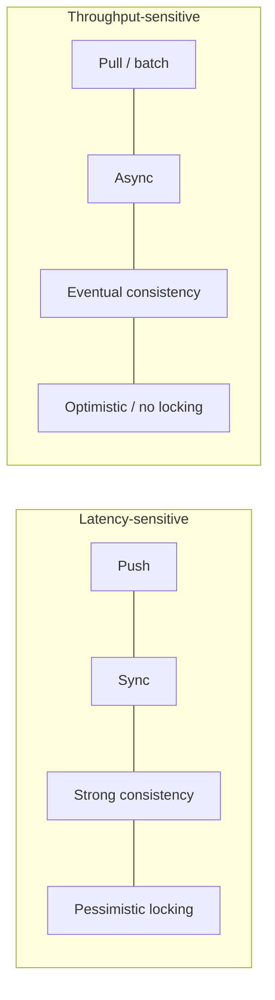

# Core Trade-offs Catalog — The Axes Every Design Must Resolve

**Date:** 2026-04-26 | **Updated:** 2026-04-26
**Tags:** `system-design` `foundations` `trade-offs` `mental-model`

## Table of Contents

- [Summary](#summary)
- [Overview](#overview)
- [Concurrency vs Parallelism](#concurrency-vs-parallelism)
- [Push vs Pull](#push-vs-pull)
- [Stateful vs Stateless](#stateful-vs-stateless)
- [Strong vs Eventual Consistency](#strong-vs-eventual-consistency)
- [Sync vs Async](#sync-vs-async)
- [Latency vs Throughput](#latency-vs-throughput)
- [Normalization vs Denormalization](#normalization-vs-denormalization)
- [Monolith vs Microservices](#monolith-vs-microservices)
- [Optimistic vs Pessimistic Locking](#optimistic-vs-pessimistic-locking)
- [AP vs CP Under Partition](#ap-vs-cp-under-partition)
- [Bottom Line — Rules of Thumb](#bottom-line--rules-of-thumb)
- [Anti-Patterns](#anti-patterns)
- [A Final Heuristic — Defaults Before Optimizations](#a-final-heuristic--defaults-before-optimizations)
- [Related](#related)
- [References](#references)

## Summary

Every system design problem ultimately reduces to a small set of recurring trade-offs. You will not invent new axes; you will rediscover the same ones in different costumes. The job of an experienced designer is to **recognize which axis is in play, articulate the trade-off precisely, and pick the side that fits the workload**, then defend that choice with concrete numbers or examples. This document is a one-page mental cheat sheet covering the ten axes that show up in practically every system design discussion: concurrency vs parallelism, push vs pull, stateful vs stateless, strong vs eventual consistency, sync vs async, latency vs throughput, normalization vs denormalization, monolith vs microservices, optimistic vs pessimistic locking, and AP vs CP under partition. Each section gives you the cue to spot the trade-off, the actual mechanics of what is being traded, a short script for explaining it, and concrete production examples on both sides.

## Overview

Trade-offs are not problems; they are **constraints made explicit**. The CAP theorem does not tell you what to build — it tells you that under partition you must choose. The same is true of every axis in this catalog. The skill is in matching the axis to the workload:

- **Read-heavy product catalog?** Denormalization wins.
- **Bank transfer?** Strong consistency, pessimistic locking, sync RPC.
- **IoT telemetry firehose?** Async, eventual consistency, throughput-optimized.
- **Real-time leaderboard?** Push (over WebSockets/SSE), in-memory state, AP.

Most production systems combine many points on these axes simultaneously — strong consistency in the orders table, eventual consistency in the search index, push for chat, pull for analytics. **Designs are mosaics, not monoliths.** What follows is the mosaic's color palette.

**How to use this document in an interview or design review:**

1. **Read the workload first.** What are the QPS, latency targets, write/read ratio, partition count, geographic footprint, and consistency requirements? The axes you should emphasize fall out of these numbers.
2. **Name the axis explicitly.** "This is a sync vs async trade-off" is a stronger sentence than "we'll just use a queue."
3. **Articulate the trade.** The "How to articulate" section in each axis below is the script — the side you don't pick costs you something specific, and you should be able to name it.
4. **Pick the side, with justification grounded in the workload.** Defaults are fine when stated as defaults: "I'll start stateless because the request shape doesn't need session affinity, and we can revisit if WebSocket affinity becomes necessary."
5. **Identify the seams where the system flips sides.** Almost every nontrivial system is CP at the system of record and AP at the edges; sync at the user boundary and async internally. These seams are where the most important design decisions live.

These clusters are tendencies, not laws. Real systems mix them. A real-time game server is push, sync, eventual (game state diverges briefly across regions), and stateful — that combination contradicts the simple latency-cluster but is correct for the workload. The clusters give you a starting point; the workload tells you where to deviate.

## Concurrency vs Parallelism

**When you see X:**

- "We need to handle 10,000 simultaneous connections" → concurrency.
- "We need to crunch 1 TB of logs in 10 minutes" → parallelism.
- A single thread serving thousands of WebSocket clients via an event loop → concurrency.
- A MapReduce job split across 200 workers → parallelism.

**The trade-off:**

Concurrency is about **structuring** a program so multiple tasks make progress, possibly on a single core, by interleaving on I/O waits. Parallelism is about **executing** multiple tasks at the same instant on multiple cores or machines. Concurrency reduces idle time and improves responsiveness for I/O-bound work; parallelism reduces wall-clock time for CPU-bound work. Concurrency-without-parallelism (Node.js event loop, Python asyncio) is cheap to scale on connections but bounded by a single core's CPU. Parallelism-without-concurrency (a thread pool that blocks per task) is throughput-friendly for compute but wastes cores on I/O waits. Real systems blend both: Go goroutines, Java virtual threads, Erlang processes, Tokio runtimes — concurrent task abstractions scheduled across multiple OS threads.

**How to articulate:**

> "This is I/O-bound — most of the wall-clock time is spent waiting on the network, not burning CPU. So we want concurrency: an event loop or virtual threads that let one OS thread juggle many in-flight requests. Adding more cores buys us nothing if the threads are mostly blocked. Conversely, if this were CPU-bound — encoding video, running ML inference — we'd lean on parallelism: thread pools, multi-process workers, or distributed map-reduce."

**Example designs:**

- **Concurrency:** Nginx (event-driven), Node.js, Go HTTP servers, Netty, Tokio, Erlang/Elixir telecom switches, modern databases' connection pools.
- **Parallelism:** Spark, Hadoop MapReduce, FFmpeg with `-threads`, NumPy/BLAS, GPU inference, parallel `psql` `\copy`.
- **Both:** Kafka brokers (concurrent network handlers + parallel partition processing), Postgres (one backend process per connection, parallel query execution within a query).

**Practical numbers to keep in mind:**

- A modern Linux box can hold **hundreds of thousands of TCP connections** with an event loop, and only a few thousand with thread-per-connection (each OS thread has ~1 MB stack overhead).
- A CPU-bound task on 8 cores hits a **hard ceiling at ~8× the single-core throughput** — Amdahl's Law says any sequential portion caps the speedup quickly.
- Java virtual threads (JEP 444, Java 21) let you treat I/O-bound code as if threads were free — under the hood the runtime parks them on a small carrier thread pool.

See: [Sync vs Async](#sync-vs-async), and Java's evolution from threads-per-request to virtual threads (Project Loom, JEP 444).

## Push vs Pull

**When you see X:**

- "Notify users immediately when X happens" → push.
- "Periodically check for updates" → pull.
- WebSockets, Server-Sent Events, webhooks, mobile push → push.
- Cron jobs, polling APIs, RSS, Kafka consumer `poll()` loops → pull.

**The trade-off:**

Push delivers events at the moment they happen — low latency, but the producer must know consumers, manage subscriptions, handle backpressure, and tolerate slow or dead consumers. Pull lets the consumer set its own pace — simple, decoupled, naturally backpressured, but introduces polling latency and wasted requests when nothing has changed. Push optimizes for **freshness**; pull optimizes for **producer simplicity and consumer control**. Hybrid designs (long polling, Kafka's pull-with-fetch-wait, GitHub webhooks with reconciliation pulls) try to capture both.

**How to articulate:**

> "Push gives us sub-second freshness but burdens the server with connection state, fan-out, and slow-consumer handling. Pull is dead-simple — consumers ask when ready — but wastes requests when nothing changed and adds a polling-interval latency floor. For our chat app, push is the clear answer: users won't tolerate a 30-second polling delay. For our analytics warehouse, pull is fine — overnight ETL doesn't need millisecond freshness."

**Example designs:**

- **Push:** Slack/Discord WebSockets, Apple Push Notification Service, Firebase Cloud Messaging, GitHub/Stripe webhooks, server-sent events for live dashboards, MQTT for IoT.
- **Pull:** Prometheus scraping, Kafka consumers (deliberately pull-based for backpressure), cron-driven RSS readers, REST polling, Git fetches.
- **Hybrid:** Long polling (HTTP), Kafka `fetch.max.wait.ms`, GitHub webhooks plus reconciliation API calls, AWS SQS long polling.

**Why Kafka chose pull deliberately:**

Kafka's original LinkedIn paper documents a conscious decision to make consumers pull rather than have brokers push. The reasoning: pull lets each consumer set its own pace, naturally backpressures slow consumers, and lets a consumer batch fetches at its own rhythm. A push-based broker would have to track per-consumer state, manage flow control, and either drop or buffer for slow consumers. The cost of pull is a small idle latency, mitigated by long-poll semantics (`fetch.max.wait.ms`).

**Why webhooks are popular but fragile:**

Webhooks are push from server to server: GitHub, Stripe, and others post events to your endpoint. Easy to integrate, but every well-engineered webhook integration also has a **reconciliation pull** path because webhooks can be lost (your endpoint was down, the network blipped, the payload was rejected). Stripe's recommended pattern: rely on webhooks for low-latency reactions, but periodically pull the events list to fill any gaps.

See [Push vs Pull Architecture](../communication/push-vs-pull-architecture.md) for the full deep dive.

## Stateful vs Stateless

**When you see X:**

- "Session must survive across requests" → stateful (or externalized state).
- "Any instance can serve any request" → stateless.
- A WebSocket server holding open connections → stateful.
- An HTTP API that reads JWTs and looks up data per request → stateless.

**The trade-off:**

Stateful services keep data in memory between requests — fast access, but they cannot be moved, scaled, or restarted without losing or migrating that state. Stateless services keep nothing locally; every request carries enough context (or fetches it from a shared store) to be served by any instance. Stateless services scale horizontally trivially — spin up another pod, the load balancer routes to it, done. Stateful services need sticky routing, state migration, replication, or careful sharding. Most "stateless" services are really stateless **at the application tier** while pushing state down into databases, caches, and session stores — a useful architectural pattern, not a magical absence of state.

**How to articulate:**

> "If we make the API stateless, we get free horizontal scaling: every instance is identical and the load balancer doesn't care which it picks. State lives in Redis and Postgres. The cost is one extra network hop per request to fetch session data — usually fine. We'd only go stateful at the app tier if that hop becomes the bottleneck, like for a real-time game server holding 60 Hz physics state per match."

**Example designs:**

- **Stateless:** REST APIs behind load balancers, AWS Lambda, Kubernetes Deployments, Twelve-Factor app services, JWT-authenticated microservices.
- **Stateful:** Kafka brokers (own their partition log), Redis primaries, PostgreSQL, game servers, video conference SFUs, WebSocket gateways with subscription state, Kubernetes StatefulSets.
- **Externalized state pattern:** Stateless app pods + Redis session store + Postgres + S3 — the dominant SaaS pattern.

**The hidden state in "stateless" services:**

Even an app declared "stateless" usually has caches, connection pools, JIT-warmed hot paths, prepared statements, and DNS-resolved addresses. These don't break correctness — any instance can serve any request — but they affect performance and cold-start behavior. Lambda cold starts and Kubernetes pod startup latency are the modern manifestation: stateless does not mean "free to recreate."

**StatefulSet-specific concerns:**

Kubernetes StatefulSets give pods stable identities (`pod-0`, `pod-1`), stable storage (PersistentVolumeClaims that follow the pod), and ordered rollouts. They exist precisely because stateful services like Postgres, Kafka, and ZooKeeper need them. Operating a StatefulSet is meaningfully harder than a Deployment — backups, rolling upgrades, and disaster recovery all become first-class concerns.

See [Horizontal vs Vertical Scaling](../scalability/horizontal-vs-vertical-scaling.md) for how stateless design enables horizontal scale.

## Strong vs Eventual Consistency

**When you see X:**

- "Read your writes" / "linearizable" / "serializable" → strong.
- "Best-effort, converges eventually" / "stale reads OK" → eventual.
- A bank ledger, an inventory counter for limited stock, a unique-username check → strong.
- Twitter timeline, product reviews, like counts, search index → eventual.

**The trade-off:**

Strong consistency guarantees that every read returns the latest committed write — every observer sees the same sequence of operations. Achieving this across replicas requires consensus or coordination on the write path: a quorum, a leader round-trip, or distributed locking. The cost is **latency** (extra round trips) and **availability under partition** (the minority side cannot serve writes). Eventual consistency lets replicas diverge briefly and converge later — writes are accepted locally and propagated asynchronously, so reads can be stale but the system stays available and fast. Within "eventual" there are useful sub-models: read-your-writes, monotonic reads, causal consistency — each strictly weaker than linearizability but stronger than "anything goes."

**How to articulate:**

> "Strong consistency means every read sees the latest write — at the cost of a coordination round-trip on every write and reduced availability under partition. Eventual consistency means writes commit locally and propagate in the background — fast and partition-tolerant, but readers can see stale data for some convergence window. We pick strong for money and inventory because incorrect answers cost real dollars. We pick eventual for like counts and search indexes because being one second stale is invisible to users and the throughput gain is enormous."

**Example designs:**

- **Strong:** Postgres (default), Spanner, CockroachDB, etcd, ZooKeeper, DynamoDB strongly-consistent reads, single-leader replication with synchronous commit.
- **Eventual:** DNS, S3 (now strongly consistent for read-after-write since 2020, but historically the textbook example), Cassandra default, Riak, DynamoDB default reads, CDN caches, Elasticsearch indexes, CRDTs.
- **Tunable:** Cassandra `CONSISTENCY ONE/QUORUM/ALL`, DynamoDB `ConsistentRead`, MongoDB read/write concerns.

**The useful sub-models inside "eventual":**

"Eventually consistent" is too vague to be a contract. Vogels' taxonomy gives you stronger sub-models:

- **Read-your-writes** — a session sees its own writes (often via session affinity or write-fence tokens).
- **Monotonic reads** — successive reads in a session never go backwards in time.
- **Causal consistency** — if A happens-before B, every observer sees A before B; concurrent writes can appear in any order.
- **Bounded staleness** — reads are at most `t` seconds (or `n` versions) behind the leader.

Most "eventual" production systems actually deliver one of these stronger guarantees, and the bound matters: "stale by ms" is invisible, "stale by minutes" is a bug.

See [CAP and Consistency Models](./cap-and-consistency-models.md) and [ACID vs BASE and Isolation Levels](../data-consistency/acid-vs-base-and-isolation-levels.md).

## Sync vs Async

**When you see X:**

- "Caller blocks until response" → sync.
- "Fire-and-forget, callback, or message queue" → async.
- A REST `POST /payment` that returns 200 with the charge result → sync.
- An order placed, charged later via Stripe webhook → async.

**The trade-off:**

Synchronous communication ties the caller's lifetime to the callee's response — simple to reason about, immediate result, but the caller is **only as available and fast as its slowest dependency**. A chain of N synchronous calls multiplies tail latency and failure probability. Asynchronous communication decouples caller and callee via a queue, event, or callback — the caller returns immediately and processing happens in the background. Async buys throughput, fault isolation, and burst smoothing at the cost of programming complexity (correlation IDs, idempotency, retries, dead-letter queues, eventual consistency at the user-visible boundary).

**How to articulate:**

> "Sync is simpler and gives the user an immediate answer, but it couples our availability to every downstream service in the chain. If the email service is down, sync would block the checkout. By making email async — drop a message on Kafka, return 200 — checkout stays available even if email is degraded. The trade-off is we now need a workflow: idempotent consumers, retry logic, a dead-letter queue, and a way to surface failures back to the user."

**Example designs:**

- **Sync:** REST/gRPC request-response, classic SOAP, GraphQL queries, database queries, RPC.
- **Async:** Kafka, RabbitMQ, AWS SQS/SNS, Google Pub/Sub, Celery, Sidekiq, AWS Step Functions, webhooks, event sourcing, CQRS read-side projections.
- **Hybrid:** "Accepted-202" pattern (sync acknowledgment, async work), GraphQL subscriptions, server-sent events for progress.

**The latency-availability math:**

If service A calls B sync, and B has 99.9% availability, A's availability is also bounded by 99.9% on that path. Stack five hops, each at 99.9%: combined availability is `0.999^5 ≈ 99.5%` — that's an extra ~22 minutes of downtime per month, just from composition. Async with retries breaks the multiplication by decoupling lifetimes.

**The async-correctness tax:**

Every async pattern introduces correctness obligations the sync version handled implicitly:

- **Idempotency** — consumers may see a message twice; deduplicate.
- **Ordering** — Kafka preserves per-partition order, not global; design accordingly.
- **Failure visibility** — a sync caller knows immediately that the call failed; an async producer needs DLQs, alerting, and reconciliation.
- **End-to-end latency monitoring** — distributed tracing across queue boundaries (W3C Trace Context, OpenTelemetry) is mandatory.

See [Sync vs Async Communication](../communication/sync-vs-async-communication.md).

## Latency vs Throughput

**When you see X:**

- "p99 must be under 50ms" → latency-optimized.
- "We must process 1 million events per second" → throughput-optimized.
- A real-time bidding system → latency.
- An overnight ETL job → throughput.

**The trade-off:**

Latency is **how long one operation takes**. Throughput is **how many operations finish per unit time**. They are related but not the same — and the techniques that improve one often hurt the other. Batching, buffering, and pipelining boost throughput by amortizing overhead across many operations, but add latency to any individual operation. Conversely, low-latency systems serve every request immediately, never wait to fill a batch, and accept lower hardware utilization. Queueing theory makes this precise: under heavy load, throughput rises but tail latency explodes (Little's Law plus the M/M/1 latency curve). The honest framing is "latency at what throughput?"

**How to articulate:**

> "These are different objectives. Latency is wall-clock time for one operation; throughput is operations per second. To raise throughput we batch — reading 1000 events from Kafka in one fetch, writing 500 rows in one INSERT. That amortizes per-call overhead but means each individual event waits for the batch to fill. For a low-latency request path we do the opposite: never batch, never queue, keep utilization below 70% so queues don't form. Most systems have separate hot paths for each — synchronous user requests on the latency path, batch jobs on the throughput path."

**Example designs:**

- **Latency-optimized:** CDNs, in-memory caches (Redis), single-digit-ms RPC paths, HFT systems, ad bidding (RTB), DNS resolvers.
- **Throughput-optimized:** Kafka, Spark, batch ETL, MapReduce, columnar warehouses (BigQuery, Snowflake), bulk inserts (`COPY`), GPU training pipelines.
- **Both at once (carefully):** ScyllaDB, Cassandra (per-shard low latency, cluster-wide high throughput), modern Postgres with batched commits.

**Little's Law in one line:**

`L = λW` — the average number of items in a queue equals arrival rate times time-in-system. Practically: at high utilization, small increases in load produce nonlinear latency growth. Above ~70-80% utilization, queues form and tail latency explodes; this is why latency-sensitive systems run with intentional headroom.

**Tail latency dominates at scale:**

Jeff Dean's "The Tail at Scale" paper makes the point precisely: if a request fans out to 100 servers and each has p99 of 100ms, the **fan-out p99** is essentially guaranteed to be over 100ms — because the slowest of 100 dominates. Latency budgets must account for fan-out, hedged requests, and the long tail of any single component.

**Concrete techniques on each side:**

- For latency: keep hot data in memory (Redis), avoid network hops (colocate services), use connection pooling and HTTP/2 multiplexing, employ CDNs and edge caches, set conservative timeouts, use hedged requests (Dean's paper), and stay below 70% utilization.
- For throughput: batch writes, use bulk APIs (Postgres `COPY`, S3 multipart, DynamoDB `BatchWriteItem`), pipeline operations, use columnar formats (Parquet, ORC), leverage parallel processing frameworks, and run hardware at high utilization.

The two are not opposites — they're orthogonal axes — but optimizations for one frequently sacrifice the other, and you have to know which one you're paying for.

See: Little's Law `L = λW` and the universal scalability law for the math.

## Normalization vs Denormalization

**When you see X:**

- "Single source of truth, no duplication" → normalized.
- "Pre-computed for fast reads, accept duplication" → denormalized.
- 3NF relational schema with foreign keys → normalized.
- A `user_feed_item` row containing the author's name copied in → denormalized.

**The trade-off:**

Normalization eliminates redundancy: each fact lives in one place. Updates are cheap (one row), storage is minimal, integrity is enforced by foreign keys. But reads require joins — sometimes many — which become expensive at scale. Denormalization duplicates data so reads can be served from a single row, document, or partition without joins. Reads get fast and predictable, scale-out becomes possible, and queries can be served from a single shard. The cost is **write amplification** (every change updates many copies), **storage cost**, and **the burden of keeping copies in sync** — usually via CDC, event-driven projections, or scheduled rebuilds. Normalize for OLTP write-heavy systems with complex relations; denormalize for read-heavy product surfaces and analytics.

**How to articulate:**

> "Normalization gives us one source of truth and cheap updates, but reads need joins. At our scale, joins across user, post, comment, like across a sharded database are unworkable. So for the timeline read path we denormalize: the feed_item row carries the author's name, avatar URL, and like count. Writes get more expensive — when a user changes their name we have to fan out updates — but reads now hit a single partition with no joins. We use CDC (Debezium) to keep the denormalized copies in sync."

**Example designs:**

- **Normalized:** Classic OLTP — Postgres/MySQL with 3NF schemas, ERP systems, financial ledgers, anywhere data integrity beats read speed.
- **Denormalized:** Cassandra (one table per query pattern), Twitter's home timeline (precomputed fan-out), Elasticsearch indexes, materialized views, BigQuery star schemas, Redis cached aggregates.
- **Both, intentionally:** Postgres normalized OLTP + materialized views for reporting + Elasticsearch for search + Redis for hot reads — the typical SaaS data plane.

**The CDC bridge:**

Debezium, Maxwell, and AWS DMS read the database's write-ahead log (Postgres logical replication, MySQL binlog) and emit change events to Kafka. Downstream consumers update Elasticsearch, Redis, materialized views, or other denormalized stores. This is the modern shape of "normalize the writes, denormalize the reads" — the source of truth stays in one place, and derived stores are rebuildable from the log.

**Single-table design in DynamoDB:**

DynamoDB takes denormalization to the extreme: one table holds many entity types, with composite keys engineered so that the access patterns each map to a single partition lookup. Rick Houlihan's talks document this as the dominant DynamoDB pattern at scale — it's the opposite of relational thinking, and it's correct for the workloads DynamoDB targets.

## Monolith vs Microservices

**When you see X:**

- "One deployable, one repo, one database" → monolith.
- "Many small services, each owned by one team, deployed independently" → microservices.

**The trade-off:**

Monoliths are simpler — one process, in-process function calls, one database transaction, one deploy. Refactoring across module boundaries is cheap (it's just moving code). Operational footprint is small; observability is easy. The cost shows up at scale: large teams stepping on each other in one codebase, deploys that lock everyone, and parts of the system needing different scaling, languages, or release cadences. Microservices solve those by carving the system into independent units with their own data, runtime, and lifecycle. The cost is enormous **distributed-systems overhead**: network failures between every component, distributed tracing, schema versioning, eventual consistency where transactions used to live, and a platform team to keep the substrate healthy. The pragmatic path most teams converge on is **modular monolith first, extract services when team or scaling pressure forces it** — the "monolith first" advice from Sam Newman and Martin Fowler.

**How to articulate:**

> "Monolith means one process, one database, one deploy — fast iteration, easy refactors, ACID transactions. Microservices give independent scaling, language choice, and team autonomy, but every in-process function call becomes a network call with retries, timeouts, and partial failure. Microservices pay for themselves only when team or scaling friction inside the monolith is large. Three engineers and one product? Monolith. Fifty engineers across ten product areas with different scaling profiles? Carve it up — but go modular monolith first and extract along genuine seams."

**Example designs:**

- **Monolith:** Basecamp, Shopify (still mostly a Ruby monolith at huge scale), Stack Overflow, GitHub (originally), most early-stage SaaS.
- **Microservices:** Netflix, Uber, Amazon (since the famous Bezos memo), Spotify, modern enterprise estates.
- **Modular monolith:** Shopify's pods/components, the architecture Martin Fowler recommends as a default starting point.

**Conway's Law as a forcing function:**

"Organizations design systems that mirror their communication structures." Microservices succeed when teams are small, autonomous, and own their service end-to-end. Microservices imposed on a single team with shared on-call create overhead without autonomy. The architecture and the org chart need to match — pick the architecture that fits the org you have or are willing to build.

**The "you must be this tall to ride" list for microservices:**

Sam Newman's checklist: rapid provisioning, basic monitoring, rapid deployment, observability, and a culture of operational ownership. Without those, microservices amplify pain. With them, microservices scale teams and systems independently. Most early-stage organizations don't clear this bar and shouldn't pretend.

## Optimistic vs Pessimistic Locking

**When you see X:**

- "SELECT FOR UPDATE", row locks, distributed locks → pessimistic.
- "version" / "etag" / CAS / "expected previous value" → optimistic.

**The trade-off:**

Pessimistic locking assumes conflict is likely — acquire a lock before reading, hold it until commit, and serialize concurrent writers. Correct but expensive: contention causes blocking, lock waits, and risk of deadlock; long transactions block others; distributed locks need fencing tokens to be safe under network partitions and GC pauses. Optimistic concurrency control assumes conflict is rare — read with a version, do your work without locking, and on commit check that the version hasn't changed (compare-and-swap). If unchanged, commit; if changed, abort and retry. Excellent throughput when conflicts are rare; pathological under high contention because every retry races again. Choose pessimistic for hot rows with predictable contention (account balance during a flash sale); choose optimistic for typical web CRUD where two people rarely edit the same row at once.

**How to articulate:**

> "Optimistic locking adds a `version` column. Read returns version 7; on update we say `WHERE version = 7` and bump it. If someone else updated in between, our update affects 0 rows and we retry. Pessimistic locking takes a row lock — `SELECT ... FOR UPDATE` — so the second writer blocks until we commit. Optimistic is cheaper on the happy path and avoids holding locks across application logic, which matters for distributed systems. Pessimistic is the right default when contention is high and retries are wasteful — like a popular product's stock counter during launch."

**Example designs:**

- **Pessimistic:** Postgres `SELECT FOR UPDATE`, MySQL InnoDB row locks, Redis-backed Redlock (with fencing), ZooKeeper ephemeral locks, two-phase locking schedulers.
- **Optimistic:** HTTP `If-Match`/ETag, DynamoDB `ConditionExpression`, Kafka idempotent producers, JPA `@Version`, Git, CRDTs (in spirit).
- **Mixed:** Spanner (pessimistic for strong consistency, optimistic snapshot reads), CockroachDB (serializable with optimistic execution and pessimistic where required).

**Why distributed locks need fencing tokens:**

Martin Kleppmann's well-known critique of Redlock points out that any distributed lock without a monotonic fencing token is unsafe under GC pauses, network delays, or clock skew: the lock holder can pause for 30 seconds, the lock expires, another client acquires it, and now both believe they hold it. The fix: every lock acquisition emits a strictly increasing token; the protected resource rejects writes carrying an older token. ZooKeeper sequence numbers and etcd lease revisions provide this naturally; ad-hoc Redis locks usually do not.

**MVCC as the modern compromise:**

PostgreSQL, Oracle, MySQL InnoDB, and Spanner all use multi-version concurrency control: readers don't block writers and writers don't block readers because each transaction sees a snapshot. This is neither pure pessimistic nor pure optimistic — it's snapshot isolation with serialization-level checks at commit. Most application-level lock contention you'd worry about disappears when the database does the right thing here.

**Contention math:**

Optimistic locking's expected retry rate scales with the number of concurrent writers on the same row. With N concurrent writers and uniform timing, roughly `1 - 1/N` of attempts retry. At N=2 that's 50% retry on conflict; at N=10 it's 90%. This is why hot-row contention pathologically degrades with optimistic CC and why pessimistic locks (which serialize cleanly, with bounded queueing) become attractive there. Sharding the hot row (Stripe's approach for hot accounts: shard a counter into N sub-counters and sum on read) is often a better answer than either lock strategy.

## AP vs CP Under Partition

**When you see X:**

- "Stay available even during a network split, accept stale data" → AP.
- "Refuse writes on the minority side rather than serve stale data" → CP.

**The trade-off:**

Brewer's CAP theorem says: under a network **P**artition, you must choose between **C**onsistency and **A**vailability. There is no "CA" system in the real world because partitions are real. AP systems keep accepting reads and writes on both sides of the split — fast and available, but the two sides diverge and must be reconciled later (last-write-wins, vector clocks, CRDTs, application-level merge). CP systems halt writes on the minority side until quorum is restored — every committed write is correct, but availability drops on the partitioned side. The PACELC extension matters: even **without** a partition, you trade latency against consistency on every write. The framing "you must choose" is too binary in practice — most systems offer per-operation tunability. But the core point holds: you cannot have linearizability and full availability under partition simultaneously.

**How to articulate:**

> "Under a network partition we must choose: keep accepting writes on both sides and reconcile later — that's AP, fast and always-available — or refuse writes on the minority side until quorum returns — that's CP, correct but unavailable for the partitioned clients. For shopping cart contents, AP wins: a brief inconsistency is invisible, and unavailability would cost real revenue. For the orders table that records purchases, CP wins: a duplicate or lost order is unrecoverable, and a five-minute write outage is recoverable. Most production systems mix: CP for the system of record, AP for caches, search, and derived views."

**Example designs:**

- **AP:** Cassandra, DynamoDB (default), Riak, DNS, Elasticsearch search side, CRDT stores (Redis enterprise CRDTs, Automerge).
- **CP:** Spanner, CockroachDB, etcd, ZooKeeper, single-leader Postgres with synchronous replicas, HBase, MongoDB (with majority write concern).
- **Tunable:** Cassandra (`CONSISTENCY` per query), DynamoDB (`ConsistentRead`), MongoDB (read/write concerns), Riak (N/W/R parameters).

**PACELC — what CAP misses:**

Daniel Abadi's PACELC says: under **P**artition, choose **A** or **C**; **E**lse (no partition), choose between **L**atency and **C**onsistency on every write. This is the more useful daily framing — partitions are rare, but the latency-vs-consistency choice is on every single write. A "PA/EL" system (DynamoDB by default) optimizes for availability under partition and latency in normal operation. A "PC/EC" system (Spanner) optimizes for consistency under partition and consistency in normal operation, paying the latency cost.

**The "12-9s" misconception:**

People sometimes claim "we want strong consistency *and* full availability." Under partition, you literally cannot have both. The honest framing is: how often will partitions happen, how long will they last, and what is the cost of unavailability versus the cost of inconsistency? A well-engineered single-region system in a hyperscaler datacenter sees partitions rarely; a multi-region system sees them more often. Pick the side whose failure mode is recoverable in your domain.

**The cost-of-error asymmetry:**

For most domains the costs of the two failure modes are dramatically asymmetric. A duplicated banking transaction is unrecoverable without manual reconciliation; a five-minute write outage is annoying but recoverable. Conversely, a 200ms shopping-cart inconsistency is invisible; a 30-second cart unavailability is a measurable conversion drop. **Match the side to the recoverable failure mode**, not to abstract preferences. This is the single most important framing for any AP/CP decision.

**Spanner's TrueTime as a pragmatic answer:**

Google Spanner provides external consistency (a stronger guarantee than linearizability) globally by using GPS- and atomic-clock-synchronized time bounds. It pays an explicit `commit-wait` of typically 7ms to ensure timestamps don't overlap. This is the modern proof that "CP and low-latency at global scale" is achievable — but only with hardware nobody else has, and at engineering complexity nobody else wants.

See [CAP and Consistency Models](./cap-and-consistency-models.md) for the formal theorem and PACELC extension.

## Bottom Line — Rules of Thumb

| Axis | Default for OLTP system of record | Default for read-heavy product surface | Default for analytics / batch |
|------|------------------------------------|----------------------------------------|--------------------------------|
| Concurrency vs Parallelism | Concurrency (I/O-bound) | Concurrency + caching | Parallelism (CPU/data-bound) |
| Push vs Pull | Pull (request-response) | Push for live UI, pull otherwise | Pull (scheduled jobs) |
| Stateful vs Stateless | Stateless app + stateful DB | Stateless + cache | Stateful workers (Spark) |
| Strong vs Eventual | Strong | Eventual w/ read-your-writes | Eventual / batch-snapshot |
| Sync vs Async | Sync for the user-facing path | Sync read, async writes | Async / batch |
| Latency vs Throughput | Latency on user requests | Latency | Throughput |
| Normalization | Normalize | Denormalize for the read path | Denormalize (star schema) |
| Architecture | Modular monolith → extract on pain | Monolith with edge caches | Pipeline of stage-specific services |
| Locking | Optimistic by default, pessimistic on hot rows | Optimistic | None (immutable batches) |
| AP vs CP under partition | CP | AP for caches/search, CP for source | AP (eventually-consistent warehouse) |

A few rules that hold across nearly every design:

1. **Stateless tier + stateful store is the default web architecture** — don't fight it without reason.
2. **Strong consistency belongs in the system of record; eventual consistency belongs everywhere else.**
3. **Async by default for cross-service communication; sync only when the user is waiting for the answer.**
4. **Denormalize on read paths, normalize on write paths.** CDC bridges the two.
5. **Optimistic locking unless you can show the contention is high enough to need pessimistic.**
6. **Choose CP for money, AP for content.**
7. **Concurrency for I/O-bound, parallelism for CPU-bound** — and most modern runtimes give you both.
8. **Push for human-perceptible freshness, pull for everything else.** Hybrid (long-poll, webhook + reconciliation) when both matter.
9. **Plan for utilization under 70%** on latency-sensitive paths — queues form fast above that.
10. **Modular monolith first; extract microservices when team or scaling pressure demands it**, not before.

## Anti-Patterns

These are recurring failure modes where someone picked the wrong side or, worse, didn't realize there was a choice.

- **Sync chains across many microservices.** Every hop multiplies tail latency and failure probability. If your call graph is 6 services deep on the user-facing path, you have 6× the partial-failure surface; the system's availability is the product of each service's availability. Fix: collapse hops, switch to async where the user doesn't need to wait, or rethink service boundaries.
- **Distributed monolith.** Microservices that share a database, must be deployed together, and call each other synchronously in cycles. You took on every operational cost of distributed systems and kept every coupling cost of the monolith. Fix: actually carve along data ownership lines, or recombine.
- **The retry storm.** A downstream service slows down, every caller retries, multiplying load on the already-stressed service. Fix: exponential backoff with jitter, circuit breakers, retry budgets, and bounded concurrency at every client.
- **"Eventually consistent" used as a synonym for "we didn't think about consistency."** Eventual consistency is a contract: bounded convergence time, monotonic reads, causal ordering. If you can't articulate the bound, you're not eventually consistent — you're just buggy.
- **Denormalizing without a sync mechanism.** Copies drift. CDC, event-sourced projections, or scheduled rebuilds are not optional.
- **Premature microservices.** Carving up a system before there's team or scaling pressure produces a distributed monolith — all the operational cost of microservices, none of the benefits.
- **Pessimistic locking across a network round trip.** A two-second app-side computation while holding a database row lock will wreck a busy system. Either keep locks short or use optimistic CAS.
- **Push without backpressure.** A producer that fans out to consumers without caring about consumer speed will OOM the slow consumer or melt the queue. Push systems need flow control: credits, slowdown signals, drop policies.
- **Strong consistency on a hot path that doesn't need it.** Quorum reads on a global product catalog burn latency for invisible benefit. Cache aggressively; refresh on write.
- **AP system used for money.** "We chose Cassandra for everything." If `account_balance` is in an eventually-consistent store, you will have lost or duplicated money before the year is out.
- **Stateful WebSocket gateway behind a round-robin load balancer.** Without sticky sessions or a proper subscription layer (Redis pub/sub, NATS, dedicated gateway), reconnects bounce around and break delivery.
- **"Latency vs throughput" debated without numbers.** "Fast" is not a target. p50, p95, p99 latency at peak QPS — those are targets.
- **Cache invalidation as an afterthought.** Phil Karlton's joke ("there are only two hard things in computer science: cache invalidation and naming things") survives because it's true. Pick a strategy: write-through, write-behind, TTL, or event-driven invalidation via CDC. "We'll figure out invalidation later" is how you end up serving last week's prices on Black Friday.
- **Synchronous schema migrations on a hot table.** A `ALTER TABLE` that takes a strong lock on a table with thousands of QPS is an outage. Use online schema change tools (pg_repack, gh-ost, pt-online-schema-change), expand-then-contract migrations, and dual-writes during cutover.

## Related

- [CAP and Consistency Models](./cap-and-consistency-models.md) — formal CAP statement, PACELC, and the consistency-model hierarchy
- [Horizontal vs Vertical Scaling](../scalability/horizontal-vs-vertical-scaling.md) — the scale-out story that depends on stateless design
- [Sync vs Async Communication](../communication/sync-vs-async-communication.md) — deep dive on the sync/async axis with concrete patterns
- [Push vs Pull Architecture](../communication/push-vs-pull-architecture.md) — full coverage of push/pull including hybrid designs
- [ACID vs BASE and Isolation Levels](../data-consistency/acid-vs-base-and-isolation-levels.md) — the consistency story at the database level
- [Consensus — Raft and Paxos at a Conceptual Level](../data-consistency/consensus-raft-and-paxos.md) — what strong consistency actually costs

## A Final Heuristic — Defaults Before Optimizations

When in doubt, start from these defaults and explicitly justify any deviation:

- **Stateless app tier, stateful database, Redis cache.** This is the SaaS default for a reason.
- **Postgres as the system of record.** Strong consistency, MVCC, mature operations. Reach for distributed databases (Spanner, CockroachDB) only when single-region Postgres genuinely runs out.
- **Sync REST/gRPC for the user-facing path; async via Kafka/SQS for cross-service workflows.**
- **Optimistic locking with `version` columns; pessimistic only on demonstrably hot rows.**
- **Modular monolith, CI/CD pipeline that deploys it many times a day.** Extract services when team or scaling pressure forces the issue.
- **CP for money, identity, and inventory; AP for content, search, and analytics.**
- **Cache aggressively at the read tier; invalidate via CDC or TTL.**
- **Plan for p99 at peak QPS, not average at average load.**

Optimizations come after these defaults stop working. Most startup-stage systems never need to deviate; most scaling problems are the deviations being introduced too early.

## References

- Martin Kleppmann, *Designing Data-Intensive Applications* (O'Reilly, 2017) — chapters 1–2 frame essentially every axis in this catalog; the entire book is the long-form expansion of this cheat sheet
- Eric Brewer, ["Towards Robust Distributed Systems" (PODC 2000 keynote)](https://www.cs.berkeley.edu/~brewer/cs262b-2004/PODC-keynote.pdf) — the original CAP conjecture
- Seth Gilbert and Nancy Lynch, ["Brewer's Conjecture and the Feasibility of Consistent, Available, Partition-Tolerant Web Services" (2002)](https://groups.csail.mit.edu/tds/papers/Gilbert/Brewer2.pdf) — the formal proof of the CAP theorem
- Werner Vogels, ["Eventually Consistent"](https://queue.acm.org/detail.cfm?id=1466448) (ACM Queue, 2008) — the canonical taxonomy of eventual-consistency sub-models from the AWS CTO
- Werner Vogels, ["Eventually Consistent — Revisited"](https://www.allthingsdistributed.com/2008/12/eventually_consistent.html) (All Things Distributed, 2008) — the blog version with the original definitions of read-your-writes, monotonic reads, and bounded staleness
- Daniel Abadi, ["Consistency Tradeoffs in Modern Distributed Database System Design" (PACELC paper, IEEE Computer 2012)](https://www.cs.umd.edu/~abadi/papers/abadi-pacelc.pdf) — the latency-vs-consistency extension to CAP
- Pat Helland, ["Life Beyond Distributed Transactions"](https://queue.acm.org/detail.cfm?id=3025012) (ACM Queue, 2016) — classic essay on why you denormalize and what you give up
- Sam Newman, *Building Microservices* (O'Reilly, 2nd ed. 2021) — the practitioner's guide to when and how to extract services, including the operational prerequisites
- Martin Fowler, ["MonolithFirst"](https://martinfowler.com/bliki/MonolithFirst.html) and ["Microservice Trade-Offs"](https://martinfowler.com/articles/microservice-trade-offs.html) — the practical case for not premature-microservicing
- Rob Pike, ["Concurrency Is Not Parallelism"](https://go.dev/blog/waza-talk) (Go Blog, 2013) — the clearest articulation of the concurrency/parallelism distinction
- Jeffrey Dean and Luiz André Barroso, ["The Tail at Scale"](https://research.google/pubs/the-tail-at-scale/) (CACM, 2013) — why p99 latency matters and how fan-out makes it worse
- Martin Kleppmann, ["How to do distributed locking"](https://martin.kleppmann.com/2016/02/08/how-to-do-distributed-locking.html) (2016) — the fencing-token argument and why naive Redlock is unsafe
