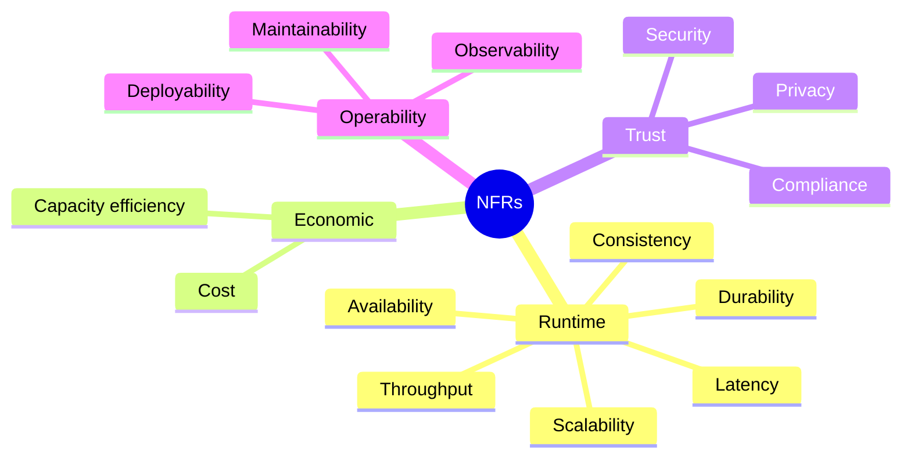
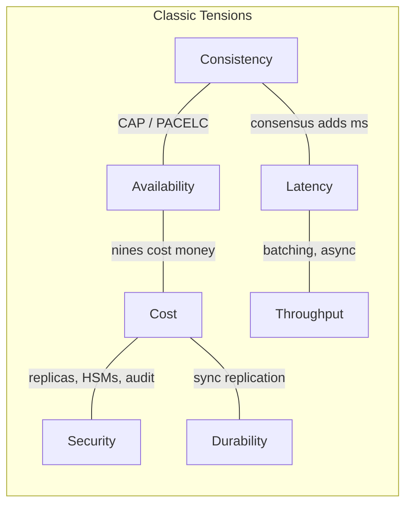

# Non-Functional Requirements Checklist — Scalability, Availability, Durability, Cost

**Date:** 2026-04-24 | **Updated:** 2026-04-24
**Tags:** `system-design` `foundations` `nfr` `requirements` `architecture`

## Table of Contents

- [Summary](#summary)
- [Why NFRs Get Skipped — and Why That Burns You](#why-nfrs-get-skipped--and-why-that-burns-you)
- [The NFR Taxonomy](#the-nfr-taxonomy)
  - [Scalability](#scalability)
  - [Availability](#availability)
  - [Durability](#durability)
  - [Consistency](#consistency)
  - [Latency](#latency)
  - [Throughput](#throughput)
  - [Cost](#cost)
  - [Security](#security)
  - [Maintainability](#maintainability)
  - [Observability](#observability)
  - [Compliance](#compliance)
- [How to Elicit NFRs](#how-to-elicit-nfrs)
- [Trade-off Articulation](#trade-off-articulation)
- [What "Scale" Actually Means Per Dimension](#what-scale-actually-means-per-dimension)
- [The NFR Doc Template](#the-nfr-doc-template)
- [Red Flags](#red-flags)
- [Related](#related)
- [References](#references)

## Summary

Non-functional requirements (NFRs) describe _how_ a system must behave — its scalability, availability, durability, latency, cost envelope, and operational qualities — as opposed to _what_ it must do. They are the properties that decide whether a design survives contact with production, and they are almost always the ones that get under-specified. This doc gives you a working taxonomy, an elicitation playbook, a reusable doc template, and a red-flag list you can apply to a design review next week.

## Why NFRs Get Skipped — and Why That Burns You

NFRs get skipped for structural reasons, not because engineers are lazy:

- **Product writes functional specs.** A PRD describes features; it rarely specifies "p99 < 200ms at 5k RPS." The quality attributes fall through the cracks between product and engineering.
- **They feel negotiable until they aren't.** "We'll figure out scale later" works right up until the first traffic spike, the first regulator audit, or the first regional outage.
- **They constrain solutions.** Naming a concrete availability target (99.95%) forces you out of single-AZ designs. Teams avoid the conversation because the answer gets expensive.
- **They are cross-cutting.** No single feature owns latency or cost. Nobody feels accountable, so nobody writes it down.

What this costs you in practice:

- **Architecture rewrites.** A service designed for 100 RPS does not gracefully stretch to 10k RPS. The second you discover the target was always 10k, you're rebuilding.
- **Surprise bills.** "Scale up the database" sounds free until the cross-AZ transfer costs land.
- **Outage post-mortems that end in "we never agreed on the SLO."** If you never defined availability, you cannot argue the incident exceeded it.
- **Rejected launches.** Security, compliance, or SRE teams block launches because NFRs were never codified and now can't be met.

The fix is upfront: write the NFRs into the design doc, get sign-off, make the trade-offs visible.

## The NFR Taxonomy

Below is a working taxonomy. It is not exhaustive — ISO/IEC 25010 defines eight top-level product quality characteristics with many sub-characteristics — but it covers the ones that matter for backend systems most of the time.



### Scalability

**What it means.** The system can absorb more load — more users, requests, data, connections, regions — without requiring a rewrite. Usually split into:

- **Vertical** (bigger box) — simple, bounded by hardware.
- **Horizontal** (more boxes) — harder, requires statelessness, partitioning, or consensus.

**How to elicit.** Ask for growth curves, not steady state. "What does traffic look like at 10x today? 100x?" "What does _usage_ look like — more users doing the same thing, or the same users doing more?" Ask specifically about read/write skew, hot keys, fan-out patterns.

**Common numbers / SLAs.** Rarely a single number — usually a **headroom** target: "must handle 3x current peak without re-architecture," or **a specific RPS/QPS ceiling** the architecture commits to.

**Who cares.** Product (can we launch in a new market?), SRE (can I add capacity on Black Friday?), Finance (what does that cost?).

**Typical trade-off.** Horizontal scalability often costs consistency (CAP), adds operational complexity (partitioning, rebalancing), and increases per-request latency (network hops, coordination).

### Availability

**What it means.** The probability the system is up and serving requests over some measurement window. Typically expressed as "nines":

| Availability | Downtime / year | Downtime / 30 days |
|--------------|-----------------|--------------------|
| 99% (2 nines) | ~3.65 days | ~7.2 hours |
| 99.9% (3 nines) | ~8.76 hours | ~43.2 minutes |
| 99.95% | ~4.38 hours | ~21.6 minutes |
| 99.99% (4 nines) | ~52.6 minutes | ~4.3 minutes |
| 99.999% (5 nines) | ~5.26 minutes | ~26 seconds |

**How to elicit.** "What's the cost of 1 minute of downtime? 1 hour?" "Is there a maintenance window, or is this 24/7?" "Can we degrade (read-only, cached) or must we fully fail?" Be careful: stakeholders will ask for five nines because it sounds responsible. Push back with the cost delta.

**Common SLAs.** Internal services: 99.9%. Customer-facing APIs: 99.95%. Critical payment paths: 99.99%. Note that these are the **SLO** (your internal target); the **SLA** (the contractual promise) is usually one nine looser.

**Who cares.** Customers, SRE, contracts/legal, incident response.

**Typical trade-off.** Each additional nine roughly doubles cost (redundancy, multi-region, extra testing). Availability also trades against consistency (CAP) and often against deployment velocity (more gating).

### Durability

**What it means.** Data, once committed, is not lost. Usually expressed as a probability of not losing an object over a year — e.g., S3's "eleven nines" (99.999999999%) of object durability.

**How to elicit.** "What is the impact of losing the last 10 seconds of writes? The last 1 hour? The last day?" "Do we need point-in-time recovery? How far back?" The answers define your RPO (Recovery Point Objective) and backup cadence.

**Common numbers.** Object storage: 11 nines. Databases: backup-derived — a 1-hour RPO means hourly snapshots plus WAL shipping. Financial/medical: often 0 RPO, which forces synchronous replication.

**Who cares.** Compliance, finance, customers with their data in your system, disaster recovery.

**Typical trade-off.** Durability vs write latency (synchronous replication slows every write). Durability vs cost (more replicas, cross-region storage, cold-tier archives).

### Consistency

**What it means.** Whether reads reflect the latest writes, and whether different clients see the same order of events. Ranges from strong/linearizable → sequential → causal → read-your-writes → eventual.

**How to elicit.** "If a user updates their profile and immediately reads it, must they see the new value?" "Do two users looking at the same resource at the same second need to see the same data?" "How stale is 'too stale'?" Consistency questions sound abstract until you ground them in scenarios.

**Common numbers.** Rarely numeric. Usually expressed as a tier (strong, bounded staleness with a max lag window, eventual) per-operation. Bounded staleness SLAs like "max 5 seconds of replication lag" are common.

**Who cares.** Database owners, product (UX implications), financial/inventory correctness.

**Typical trade-off.** CAP: during a partition, you choose consistency or availability, not both. Even without partitions, strong consistency costs latency (consensus rounds).

### Latency

**What it means.** Time from request to response. Always report **percentiles**, never averages — averages hide tail latency that dominates user experience.

**How to elicit.** "What's the user-visible budget for this action?" "Is this a synchronous API call, a page load, or a background job?" "What's upstream doing — is this 1 of 10 sequential calls in a page render?" Decompose the end-to-end budget into per-hop budgets.

**Common numbers.**

| Operation | Typical target |
|-----------|---------------|
| Interactive web API (p95) | < 200–500 ms |
| Interactive web API (p99) | < 1 s |
| Search/autocomplete (p95) | < 100 ms |
| Background job (p95) | seconds–minutes, business-defined |
| Real-time (gaming, trading) | < 50 ms p99 |

**Who cares.** Product, UX, conversion metrics, SEO (Core Web Vitals for web).

**Typical trade-off.** Lower latency → more caching, more replicas close to users, more memory, more cost. Latency also trades against throughput at saturation (Little's Law).

### Throughput

**What it means.** Volume of work per unit time — RPS, QPS, events/sec, GB/sec. Usually expressed as **sustained** and **peak**.

**How to elicit.** "What's the steady-state traffic? What's peak? How peaky — 2x, 10x, 100x steady?" "Are there bursty events — flash sales, scheduled jobs, a fan-out from an upstream?" "What batch jobs run against the same system and when?"

**Common numbers.** Specific per-system. Always ask for both ingestion rate and processing rate — a queue is only useful if the consumers can eventually catch up.

**Who cares.** SRE, capacity planning, finance (throughput → cost).

**Typical trade-off.** High throughput often means batching or async processing, which hurts per-request latency. Also trades against consistency (batch writes, eventual indexing).

### Cost

**What it means.** Total cost to build, run, and evolve the system. Usually split into:

- **CapEx / build cost** — engineering time to ship.
- **OpEx / run cost** — infrastructure, licenses, third-party services, on-call.
- **Unit economics** — cost per request, per user, per GB stored. This is the one finance actually cares about.

**How to elicit.** "What's the cost budget — total, or per-user, or per-request?" "Is this a profit center, a cost center, or a loss-leader?" "What's the expected margin?" Financial teams rarely volunteer numbers; ask directly.

**Common numbers.** Context-specific. Useful frames: "< $X per 1,000 requests," "< $Y per MAU," "infra < Z% of revenue."

**Who cares.** Finance, leadership, product (pricing).

**Typical trade-off.** Nearly every other NFR lever moves cost. The useful framing: for each proposed architecture, show **$/unit at 1x, 10x, 100x scale**. Non-linear cost curves are the surprise that kills business cases.

### Security

**What it means.** Confidentiality, integrity, and availability of data and operations. In practice: authn, authz, encryption in-transit and at-rest, secret management, input validation, auditability, tenant isolation.

**How to elicit.** "What's the threat model? Who are we defending against — external attackers, malicious tenants, insiders?" "What data classifications flow through this?" "What's the blast radius of a credential compromise?"

**Common SLAs.** Not latency-like numbers. More like "all PII encrypted at rest with customer-managed keys," "audit log retained 7 years," "no production access without MFA and JIT approval."

**Who cares.** Security team, compliance, legal, customers, regulators.

**Typical trade-off.** Security vs developer velocity (more approvals, more friction). Security vs cost (HSMs, dedicated tenancy, audit infrastructure). Security vs latency (deep inspection, WAFs, mTLS handshakes).

### Maintainability

**What it means.** How easily the system can be modified, extended, and debugged. Covers modularity, testability, code health, documentation, onboarding time.

**How to elicit.** "How many engineers will own this in 2 years?" "What's the expected rate of change?" "Will this outlive its original authors?" Hard to quantify, but easy to recognize when absent.

**Common numbers.** Proxy metrics: change lead time, mean time to recover, code coverage, deploy frequency (DORA metrics). Often specified as "must meet org DORA baseline."

**Who cares.** Engineering leadership, the team that inherits this in 2 years.

**Typical trade-off.** Maintainability vs time-to-first-version. Over-engineering for maintainability hurts velocity; under-engineering creates tech debt tax.

### Observability

**What it means.** The ability to understand the system's internal state from outputs — logs, metrics, traces, events. Not the same as monitoring: observability lets you answer _new_ questions without shipping new code.

**How to elicit.** "What does 'working correctly' look like as a metric?" "What's the first dashboard an on-call engineer will open at 3am?" "How do we debug a slow request across 5 services?"

**Common numbers.** "100% of requests traced," "log retention 30 days hot / 1 year cold," "p95 query time on metrics < 2s," "all critical user journeys have SLOs with alerts."

**Who cares.** SRE, on-call engineers, support, product analytics.

**Typical trade-off.** Observability vs cost (storing metrics and traces is expensive at high cardinality). Observability vs latency (synchronous trace export adds overhead; sampling loses detail).

### Compliance

**What it means.** Adherence to regulatory and contractual requirements — GDPR, HIPAA, PCI DSS, SOC 2, regional data residency, industry-specific rules.

**How to elicit.** "What regulations apply? What customer contracts have specific requirements?" "Do we have data residency obligations — must data stay in a region?" "What audits do we undergo?" Treat this as a **hard constraint**, not a preference.

**Common SLAs.** "All PHI in HIPAA-compliant region," "PCI scope limited to the payments service," "SOC 2 Type II annually," "GDPR data deletion within 30 days of request."

**Who cares.** Legal, compliance, sales (enterprise deals), customers in regulated industries.

**Typical trade-off.** Compliance usually removes options (can't use service X, must use region Y). Rarely optional; usually ends up constraining architecture more than any performance NFR.

## How to Elicit NFRs

NFRs don't arrive in a PRD. You have to mine them. Bring this list to kickoff:

**Usage & growth**

- What's current scale (users, RPS, data size)? What's the 1-year, 3-year projection?
- Is growth steady or event-driven? Seasonal? Viral?
- Read/write ratio? Any hot paths (top 1% of keys taking 50% of traffic)?

**Service expectations**

- What availability target — stated as "X% over 30 days"?
- What latency budget for the top 3 user-facing operations, at p95 and p99?
- What happens when the system is down — graceful degradation, full outage, silent failure? Which is acceptable?

**Data**

- What is the RPO (how much recent data can we lose)?
- What is the RTO (how long to recover)?
- Retention? Deletion obligations? Backup strategy implied by RPO?

**Consistency & correctness**

- For each core operation: read-your-writes? Strong? Eventual? Staleness bound?
- What happens on conflicting writes — last-write-wins, merge, reject?

**Cost**

- Budget — absolute, per-unit, or as a % of revenue?
- Is this a cost-center (minimize) or growth-driver (invest)?

**Security & compliance**

- Data classifications in scope?
- Regulations that apply?
- Threat model — who are we defending against?

**Operations**

- Who runs this in production — same team or central SRE?
- Deployment cadence — continuous, weekly, monthly?
- On-call expectations — 24/7, business hours, best-effort?

**Reading between the lines of functional specs.** NFRs hide inside feature descriptions. Learn to translate:

| Functional spec says | NFR it implies |
|----------------------|----------------|
| "Users can upload large files" | Throughput, object storage durability, upload resume, multipart |
| "Real-time collaboration" | Low latency (< 100ms), presence state, CRDT or OT consistency model |
| "Works globally" | Multi-region, data residency (compliance), latency to the edge |
| "Handles Black Friday traffic" | Peak throughput target, auto-scaling, degradation strategy |
| "Enterprise customers" | SSO, audit logs, SOC 2, 99.9%+ availability, data deletion SLAs |
| "Free tier" | Per-user cost ceiling, abuse controls, rate limiting |

If product won't give numbers, give them ranges and force a choice: "99.5%, 99.9%, or 99.95%? Each tier roughly doubles cost."

## Trade-off Articulation

NFRs almost always conflict. The architect's job is not to satisfy all of them — it's to surface the trade-offs and get explicit sign-off on the chosen point.



Classic trade-off triangles to name explicitly in design docs:

- **Consistency vs latency** (PACELC, not just CAP). Even without partitions, stronger consistency buys coordination round-trips. Name the consistency tier per operation.
- **Cost vs durability.** Each added "nine" of durability adds replicas, cross-region transfer, and cold storage. Surface the $/GB/month delta.
- **Latency vs throughput.** At saturation, Little's Law (L = λW) guarantees queueing. Either add capacity (cost) or accept latency degradation. Name the saturation point.
- **Availability vs consistency** (CAP during partitions). Name what the system does when the primary region is unreachable: go read-only? fail? serve stale?
- **Security vs velocity.** More gates = slower deploys. Name the controls and their friction cost.
- **Maintainability vs time-to-market.** Early simplicity can become later debt. Name the refactor triggers.

How to surface these in writing:

```markdown
## Trade-offs Accepted

- **Consistency tier: read-your-writes for user profile, eventual (<5s) for feed.**
  Rationale: feed latency is the dominant UX factor; eventual consistency halves
  the per-request cost and enables cross-region read replicas.
  Explicitly rejected: strong consistency on feed (would require global consensus;
  p99 latency would exceed 400ms).

- **Availability: 99.95% single-region, not 99.99% multi-region.**
  Rationale: multi-region would add ~$X/month and 6 weeks of build time, for
  ~4 minutes/month less downtime. Finance approved the lower target.
  Revisit trigger: when enterprise contracts demand 99.99% uptime SLA.
```

This kind of stanza is the single most valuable thing you can put in a design doc.

## What "Scale" Actually Means Per Dimension

"We need to scale" is not an NFR. It's an argument starter. Pin it to a dimension:

| Dimension | What it measures | Typical units | What breaks first |
|-----------|------------------|---------------|-------------------|
| **Reads** | Query volume | RPS, QPS | CPU, index cache, connection pool |
| **Writes** | Mutation volume | Writes/sec | WAL, replication lag, lock contention |
| **Connections** | Concurrent clients | Open TCP / WebSocket / DB connections | File descriptors, memory, connection pool |
| **Data size** | Stored volume | GB, TB, PB | Storage cost, backup time, index size, query plans |
| **Users** | Active identities | DAU, MAU, concurrent | Per-user state, fan-out, notifications |
| **Regions** | Geographic footprint | Count of deployment regions | Data residency, replication topology, ops overhead |
| **Tenants** | Isolation boundaries | Customer count, workspace count | Noisy neighbors, blast radius, per-tenant overhead |
| **Fan-out** | Downstream calls per request | Avg / p99 child calls | Tail latency, thundering herds |
| **Events** | Streaming volume | Events/sec, GB/sec | Partitions, consumer lag, replay cost |

When someone says "scale 10x," ask: **on which dimension?** A system might scale reads 100x trivially (add read replicas, cache) while writes are 10x-hard and tenant count is architecturally capped at whatever the noisy-neighbor strategy tolerates.

This prevents the most common NFR argument: two engineers both agree the system "needs to scale" but are solving for different axes.

## The NFR Doc Template

Drop this into the design doc, fill each section, get sign-off. If a section is genuinely N/A, write "N/A — rationale." Don't leave it blank.

```markdown
## Non-Functional Requirements

### Scale

| Dimension | Current | 1-year target | 3-year target | Notes |
|-----------|---------|---------------|---------------|-------|
| Peak RPS | | | | |
| Writes/sec | | | | |
| Concurrent connections | | | | |
| Data size (TB) | | | | |
| MAU | | | | |
| Regions | | | | |

### Availability

- **SLO:** <x%> over rolling 30 days
- **SLA (external):** <y%> (if applicable)
- **Error budget:** <minutes/month>
- **Graceful degradation:** [describe — read-only, cached, feature flags off]
- **Maintenance windows:** [none / scheduled weekly / …]

### Latency

| Operation | p50 | p95 | p99 | Budget rationale |
|-----------|-----|-----|-----|------------------|
| <critical op 1> | | | | |
| <critical op 2> | | | | |

### Throughput

- **Steady state:** <RPS>
- **Peak:** <RPS>, peak/steady ratio
- **Bursty events:** [flash sales, cron, fan-outs]

### Durability & Recovery

- **RPO:** <minutes/hours of acceptable data loss>
- **RTO:** <time to recover>
- **Backup cadence:** <frequency, retention, restore test cadence>
- **Multi-region:** [active-active / active-passive / single-region]

### Consistency

| Operation | Consistency tier | Staleness budget |
|-----------|------------------|------------------|
| <op> | strong / read-your-writes / bounded / eventual | <seconds> |

### Security

- **Data classifications:** [PII, PHI, PCI, confidential, public]
- **Authn:** [mechanism]
- **Authz:** [model — RBAC, ABAC, per-tenant]
- **Encryption:** in-transit (TLS x.y), at-rest (KMS / CMK)
- **Secrets:** [vault / KMS / rotation policy]
- **Threat model reference:** [link]

### Compliance

- **Regulations:** [GDPR, HIPAA, PCI DSS, SOC 2, …]
- **Data residency:** [regions]
- **Retention / deletion:** [policy]
- **Audit requirements:** [log retention, access reviews]

### Cost

- **Budget envelope:** [$/month, or $/unit]
- **Unit economics target:** [$ per 1k requests, per MAU, per GB]
- **Cost model at 1x / 10x / 100x:** [non-linear points called out]

### Observability

- **Logs:** [retention, structured fields, PII handling]
- **Metrics:** [RED/USE per service, cardinality budget]
- **Traces:** [sampling rate, retention]
- **SLIs tracked:** [list backing the SLOs above]
- **Alerts:** [critical paths with on-call routing]

### Maintainability

- **Owning team:** [team, on-call rotation]
- **Deploy cadence:** [continuous / weekly / …]
- **Test coverage target:** [%]
- **Supported runtime / language versions:** [policy]

### Trade-offs Accepted

- <named trade-off>: <what we chose, what we rejected, why, revisit trigger>
- <named trade-off>: …

### Out of Scope

- <NFR we explicitly are not meeting in this version, and what triggers revisiting>
```

The **Trade-offs Accepted** and **Out of Scope** sections are the ones reviewers will come back to later. Write them like you're leaving a note for your future self in a post-mortem.

## Red Flags

Patterns that should make you stop and push back during design review:

**Vague NFRs.** "Fast," "scalable," "highly available," "secure." If it doesn't have a number, a scenario, or a measurable criterion, it isn't an NFR — it's a feeling. Rewrite with: a metric, a target value, and a measurement window.

**Contradictory NFRs.** "99.99% availability and strong consistency and single-region and < $1k/month." At least one of those is going to give. Flag it and force a ranking.

**NFRs that beg a specific implementation.** "We need to use Kafka for observability." That's a _solution_, not a requirement. What's the actual need — replayable event stream? 30-day retention? Multi-consumer fan-out? Specify the property, not the tool.

**Unmeasurable SLOs.** "Page loads should feel fast" without a latency percentile and budget. Either commit to a number or admit it's not an SLO.

**Copy-pasted nines.** 99.99% availability quoted by a team with one production region, no load balancer, and no game-days. Availability targets imply architectural commitments; if the architecture can't support the number, the number is fiction.

**NFRs without owners.** Who watches the SLO? Who is paged when cost exceeds budget? Who approves changes that affect durability? Every NFR needs an owner; otherwise it's aspirational.

**NFRs without revisit triggers.** "We'll stay single-region until…" until what? Name the trigger — contract value, latency complaint volume, cross-region customer percentage — so future-you knows when to reopen the decision.

**Availability and durability conflated.** "The database needs to be 99.99% available" does not say anything about whether data can be lost. Separately specify availability (uptime), durability (no data loss), and recoverability (how fast after an incident).

**Cost as an afterthought.** If cost isn't in the NFR doc, the finance team will add it later — retroactively, in the form of budget cuts during the next downturn. Bake it in from day one with unit economics, not just total spend.

**Compliance mentioned once, never operationalized.** "We're SOC 2 compliant" in a design doc doesn't mean anything without the specific controls that map to specific architecture decisions. Name the controls, not the framework.

**No explicit trade-off stanza.** A design doc with no trade-offs section is either dishonest or hiding the design decisions. Trade-offs always exist; surface them.

## Related

- [SLA, SLO, SLI, and Availability Math](sla-slo-sli-and-availability.md) — turning availability NFRs into measurable objectives and error budgets
- [Back-of-the-Envelope Capacity Estimation](back-of-the-envelope.md) — translating scale NFRs into rough infrastructure sizing
- [Designing for Failure — Blast Radius and Graceful Degradation](../building-blocks/designing-for-failure.md) — operationalizing availability NFRs
- [Horizontal Scaling Patterns](../scalability/horizontal-scaling-patterns.md) — when scalability NFRs drive specific architectural choices
- [Database Consistency Models](../../database/polyglot/consistency-models.md) — how consistency NFRs map to storage choices
- [Networking Fundamentals — Latency Budgets](../../networking/transport/latency-budgets.md) — wire-level contributions to latency NFRs

## References

- [AWS Well-Architected Framework](https://docs.aws.amazon.com/wellarchitected/latest/framework/welcome.html) — six pillars (Operational Excellence, Security, Reliability, Performance Efficiency, Cost Optimization, Sustainability) each mapping to NFR categories
- [Microsoft Azure Well-Architected Framework](https://learn.microsoft.com/en-us/azure/well-architected/) — five pillars (Reliability, Security, Cost Optimization, Operational Excellence, Performance Efficiency) with detailed trade-off guides
- [Google Cloud Architecture Framework](https://cloud.google.com/architecture/framework) — system design, operational excellence, security, reliability, cost, and performance perspectives
- [ISO/IEC 25010:2023 — Systems and software Quality Requirements and Evaluation (SQuaRE)](https://www.iso.org/standard/78176.html) — the formal product quality model: Functional Suitability, Performance Efficiency, Compatibility, Interaction Capability, Reliability, Security, Maintainability, Flexibility, Safety
- Bass, Clements, Kazman — _Software Architecture in Practice_ (4th ed., Addison-Wesley) — quality attribute scenarios and the canonical tactics-for-quality-attributes catalog
- Richards, Ford — _Fundamentals of Software Architecture_ (O'Reilly) — architectural characteristics, trade-off analysis, and the "architecture as trade-offs" framing
- [Martin Fowler — Non-Functional Requirements (bliki)](https://martinfowler.com/bliki/NonFunctionalRequirement.html) — short, opinionated note arguing the term is misleading and proposing "operational" or "cross-functional" requirements instead
- [Google SRE Book — Chapter 4: Service Level Objectives](https://sre.google/sre-book/service-level-objectives/) — how to turn availability and latency NFRs into SLIs, SLOs, and error budgets
