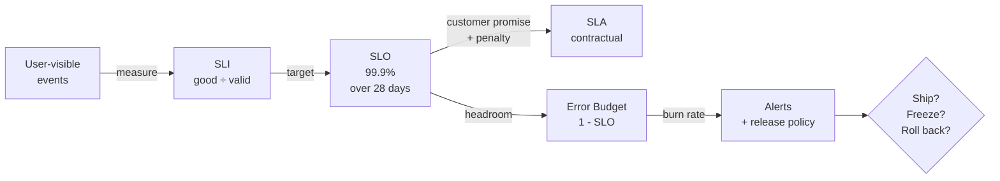
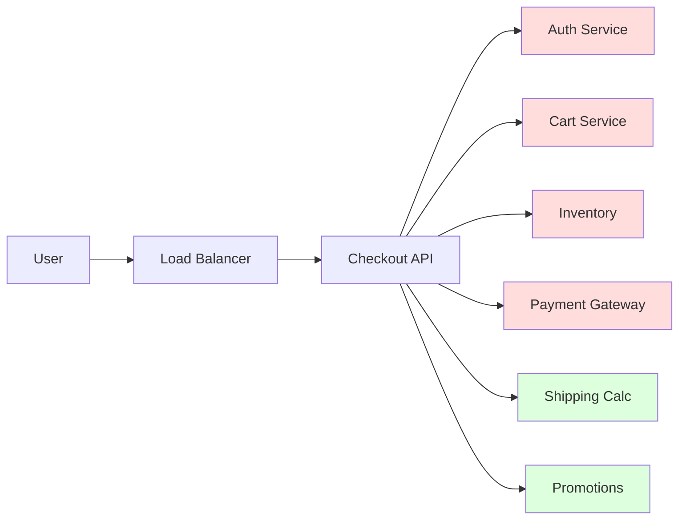
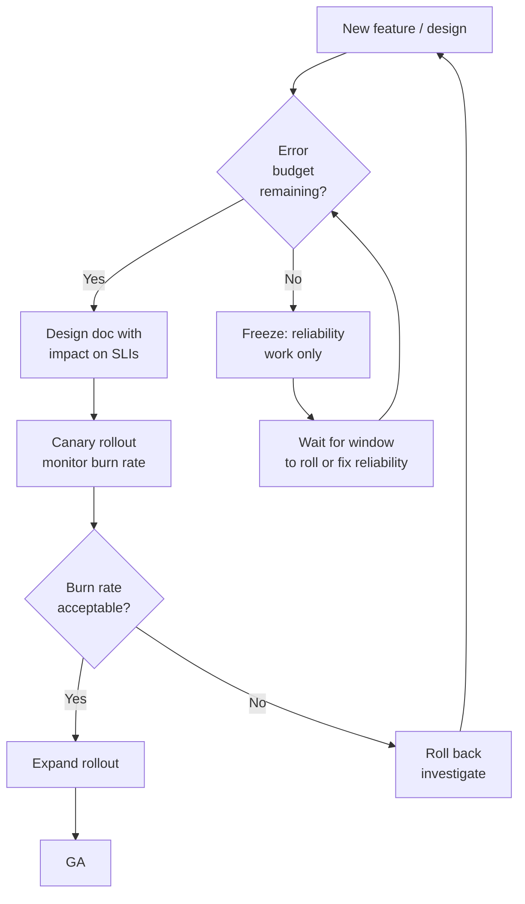

# SLA, SLO, SLI, and the Math of Availability — Error Budgets and Composition

**Date:** 2026-04-24 | **Updated:** 2026-04-24
**Tags:** `system-design` `foundations` `reliability` `slo` `error-budget`

## Table of Contents

- [Summary](#summary)
- [Why This Matters](#why-this-matters)
- [SLI vs SLO vs SLA — The Hierarchy](#sli-vs-slo-vs-sla--the-hierarchy)
  - [Service Level Indicator (SLI)](#service-level-indicator-sli)
  - [Service Level Objective (SLO)](#service-level-objective-slo)
  - [Service Level Agreement (SLA)](#service-level-agreement-sla)
  - [Contractual vs Internal](#contractual-vs-internal)
- [The Nines Table](#the-nines-table)
- [Good SLIs — The "What Fraction of Events Were Good" Model](#good-slis--the-what-fraction-of-events-were-good-model)
  - [Availability SLI](#availability-sli)
  - [Latency SLI](#latency-sli)
  - [Quality / Freshness SLI](#quality--freshness-sli)
  - [Picking the Right Event](#picking-the-right-event)
- [Composing Availability](#composing-availability)
  - [Serial Composition — Multiply](#serial-composition--multiply)
  - [Parallel (Redundant) Composition](#parallel-redundant-composition)
  - [Graceful Degradation — The Middle Path](#graceful-degradation--the-middle-path)
  - [Worked Example — A Checkout Flow](#worked-example--a-checkout-flow)
- [Error Budgets — The Engineering Contract](#error-budgets--the-engineering-contract)
  - [Budget Math](#budget-math)
  - [Burn Rate — The Key Concept](#burn-rate--the-key-concept)
  - [Multi-Window, Multi-Burn-Rate Alerts](#multi-window-multi-burn-rate-alerts)
- [When to Spend the Budget](#when-to-spend-the-budget)
- [Common Anti-Patterns](#common-anti-patterns)
- [SLO-Driven Engineering in Practice](#slo-driven-engineering-in-practice)
- [A Design-Doc-Ready SLO Template](#a-design-doc-ready-slo-template)
- [Related](#related)
- [References](#references)

## Summary

An **SLI** is a number you measure, an **SLO** is the target you set on it, and an **SLA** is what you owe a customer (with consequences) when you miss. The space between 100% and your SLO is an **error budget** — a currency that lets you ship risk on purpose and know when to stop. Getting this stack right turns reliability from a vibe into a lever you can pull in design reviews.

## Why This Matters

"Highly available" is a marketing word. For engineers it is a number, and the number drives architecture:

- **99.9% vs 99.99%** is not a nuance. It is the difference between a single-region deployment and a multi-region active/active one — an order of magnitude in both downtime budget and cost.
- **SLOs make trade-offs negotiable.** "Can we ship faster?" becomes "yes, while the error budget has room — once it is burned, we freeze."
- **SLOs push complexity to where it actually pays off.** If the dependency graph says the system can't physically meet a 99.99% target because one component caps at 99.9%, you either loosen the SLO, fix the component, or make it non-critical through degradation. No amount of heroics changes the math.
- **Alerts rooted in SLOs** are the single best cure for pager fatigue. You stop paging on CPU and start paging on "we will burn the month's budget in 6 hours at this rate."

Google's SRE practice was built on the observation that 100% is the wrong reliability target for almost everything — it is unachievable, unaffordable, and indistinguishable from 99.99% after a few network hops to the user. SLOs let you pick a target on purpose.

## SLI vs SLO vs SLA — The Hierarchy



### Service Level Indicator (SLI)

A quantitative measurement of service health, almost always shaped as:

```text
SLI = good_events / valid_events
```

Expressed as a ratio in `[0, 1]`. Key properties:

- **Event-based.** Each event is classified as good, bad, or invalid (discard invalids — e.g. 4xx from clearly malformed requests).
- **User-visible.** Measure what the user feels, not what a server introspects. CPU% is not an SLI.
- **Monotonic with quality.** Higher is always better.

### Service Level Objective (SLO)

A target for the SLI over a time window.

```text
SLO = (SLI target, measurement window, aggregation)
    = (99.9%,       28 days,           percentage of good events)
```

SLOs are **internal**. They are the reliability goal your team holds itself to, typically **tighter than the SLA** so you have buffer before contractual trouble.

### Service Level Agreement (SLA)

The contract you sign with a customer. An SLA is an SLO **plus consequences** — service credits, refunds, exit rights. SLAs are usually **looser** than the internal SLO:

```text
SLA:  99.9% monthly uptime → 10% credit if breached, 25% if <99.0%
SLO:  99.95% monthly        ← internal, tighter, what engineering actually targets
SLI:  successful_HTTP_requests / total_HTTP_requests
```

The gap between SLO and SLA is your **safety margin**: you want to be alerted and react long before the SLA is at risk.

### Contractual vs Internal

| Layer | Audience | Stake | Typical tightness |
|-------|----------|-------|-------------------|
| **SLI** | Engineers | The measurement itself | Raw metric |
| **SLO** | Engineering + Product | Engineering credibility, release velocity | Tight (99.95–99.99%) |
| **SLA** | Lawyers + Customers | Money, retention | Loose (99.0–99.9%) |

Many services you operate will have SLOs but **no SLA** — that's fine. Not every internal service owes someone money. Every service should still have SLOs.

## The Nines Table

Memorize this. You will reach for it in design reviews.

```text
Availability   Downtime/year   Downtime/28d     Downtime/week    Downtime/day
-----------    -------------   --------------   --------------   --------------
90%            36.5 days       67.2 hours       16.8 hours       2.4 hours
99%            3.65 days       6.72 hours       1.68 hours       14.4 minutes
99.5%          1.83 days       3.36 hours       50.4 minutes     7.2 minutes
99.9%          8.77 hours      40.3 minutes     10.1 minutes     1.44 minutes
99.95%         4.38 hours      20.2 minutes     5.04 minutes     43.2 seconds
99.99%         52.6 minutes    4.03 minutes     1.01 minutes     8.64 seconds
99.999%        5.26 minutes    24.2 seconds     6.05 seconds     864 ms
99.9999%       31.6 seconds    2.42 seconds     605 ms           86.4 ms
```

Some operational intuitions baked into this table:

- **99.9% gives you ~43 minutes per month.** That is one medium-sized incident and you are done.
- **99.99% gives you ~4 minutes per month.** A single deploy rollback eats most of it. You cannot hit this without automation, multi-zone/region, and tested failover.
- **Each extra nine is ~10× harder** — roughly an order of magnitude more investment (redundancy, automation, review rigor). "Add a nine" is never a free ask.
- **99.999% is pager territory with zero slack.** A 30-second blip in a month gets you there. Usually only infrastructure (DNS, routing, control planes) earns this.

Rule of thumb: set the SLO exactly as tight as the business actually needs. Over-tightening is expensive; under-tightening destroys trust.

## Good SLIs — The "What Fraction of Events Were Good" Model

Every useful SLI has the same shape:

```text
SLI = count(good events in window) / count(valid events in window)
```

Pick events at the right layer (user-visible, usually), classify each as good or bad, discard what is not a meaningful interaction.

### Availability SLI

The canonical one:

```text
availability_sli = successful_requests / valid_requests

where:
  valid_requests    = HTTP requests with a non-excluded path/method
  successful_requests = valid_requests with status in {200..399, 401, 403, 404}
                        AND within timeout
```

Note the subtlety: **4xx is usually the client's fault**, not the server's. `401/403/404/422` typically should not count as bad. `429` is a policy decision — it does usually count as a user-visible failure.

For a stateful system, the SLI might be closer to:

```text
availability_sli = minutes_with_successful_probe / total_minutes
```

Prefer the request-based one whenever you have the data.

### Latency SLI

Latency SLIs are still ratios — "fraction of requests fast enough":

```text
latency_sli = requests_under_threshold / valid_requests

example:
  latency_sli = count(requests where latency <= 300ms)
              / count(valid_requests)

SLO: latency_sli >= 99.0% over 28 days
```

This is much better than "p99 latency < 300ms" as an SLO because:

- It composes with availability into a single **"good events"** count.
- It is naturally tied to an error budget (1% of requests may exceed 300ms).
- You can have **multiple latency SLOs** at different thresholds — e.g. 95% under 200ms AND 99% under 1s — which describes the latency distribution far better than a single percentile.

### Quality / Freshness SLI

For pipelines, search, feeds, recommendations:

```text
freshness_sli = events_with_data_newer_than_5min / valid_events
quality_sli   = responses_with_full_result_set / valid_responses
correctness_sli = requests_returning_correct_result / valid_requests
```

Freshness is crucial for replicated systems (read replicas, CDC pipelines, search indices). A "healthy" service returning stale data can be worse than a 500.

### Picking the Right Event

Diagnostic questions when choosing an SLI:

1. **Who is the user?** An end user, an internal service, a scheduled job?
2. **What is the user-visible unit of work?** An HTTP request? A Kafka message consumed? A batch job finishing by 09:00?
3. **What does "good" mean for that unit?** Returned successfully, under X ms, with data fresher than Y seconds, with no silent data loss.
4. **Can you measure it cheaply and consistently?** If you need a distributed trace to know, it is probably the wrong SLI or the wrong instrumentation.

## Composing Availability

Systems are graphs. Your SLO is bounded by the graph.

### Serial Composition — Multiply

When request path `A → B → C` requires **all three** to succeed:

```text
A_avail × B_avail × C_avail = end_to_end_avail
```

```python
# Serial availability
a = 0.999     # 99.9%
b = 0.999     # 99.9%
c = 0.999     # 99.9%

end_to_end = a * b * c
# = 0.997002999...
# ~ 99.7% — already below 99.9%
```

**Key insight:** chaining N services each at `p` availability gives you `p^N`. Three nines across three hops is only 99.7%. This is why microservice fan-out gets punished: every added dependency lowers your ceiling.

| Hops at 99.9% each | End-to-end |
|-------------------|------------|
| 1 | 99.9% |
| 2 | 99.80% |
| 3 | 99.70% |
| 5 | 99.50% |
| 10 | 99.00% |

If your target is 99.95% and you have three critical serial dependencies, each one must be at least `(0.9995)^(1/3) ≈ 99.983%`. That is often infeasible, which pushes you toward redundancy or graceful degradation.

### Parallel (Redundant) Composition

When two replicas `A1` and `A2` can each serve the request, and the system is up if **either** is up:

```text
unavail(A) = unavail(A1) × unavail(A2)
avail(A)   = 1 - unavail(A)
           = 1 - (1 - a1) × (1 - a2)
```

```python
# Two replicas at 99% each in parallel
a1 = 0.99
a2 = 0.99

unavail = (1 - a1) * (1 - a2)  # 0.0001
avail = 1 - unavail             # 0.9999 → 99.99%
```

Two 99% components behind a load balancer give you 99.99% — **as long as failures are independent**. This is the big caveat:

- Same-rack, same-power, same-AZ → correlated failures. Multiplication lies.
- Same deploy, same bug, same config → correlated failures. Multiplication lies.
- Different regions, independent deploys, no shared control plane → closer to independent.

A good mental model: **parallelism only gives you availability if the failure modes are uncorrelated**. One of the biggest sources of production surprises is discovering that "independent" replicas share a dependency (DNS, an auth service, a feature flag system).

### Graceful Degradation — The Middle Path

Most real services are neither pure-serial nor pure-parallel. They have **critical** and **non-critical** dependencies.

```text
end_to_end_avail = critical_path_avail
                   × (avail contribution from optional features)
```

If a feature is optional — e.g. "show personalized recommendations on the homepage" — a failure there should degrade the experience, not the SLI. Define "good" accordingly:

```text
good_homepage_response = returns shell + primary content within 500ms
                         (personalization optional)
```

Now the recommendations service being down does not burn your homepage SLO. This is the architectural payoff for degrading gracefully — it buys you availability on paper because you redefined what "good" means.

### Worked Example — A Checkout Flow

Imagine an e-commerce checkout:



Availabilities (made up, but plausible):

| Service | Availability | Critical? |
|---------|--------------|-----------|
| Load Balancer | 99.99% | Yes |
| Checkout API | 99.95% | Yes |
| Auth | 99.95% | Yes |
| Cart | 99.95% | Yes |
| Inventory | 99.9% | Yes |
| Payment | 99.9% | Yes |
| Shipping | 99.5% | **No** — fall back to flat rate |
| Promotions | 99.0% | **No** — skip if down |

Critical-path availability (serial):

```python
crit = 0.9999 * 0.9995 * 0.9995 * 0.9995 * 0.999 * 0.999
#    ≈ 0.9968
#    ≈ 99.68%
```

That is **below** a naive "99.9% checkout" target. Your options:

1. Add redundancy to the weak links (two independent payment gateways, multi-AZ inventory).
2. Relax the SLO to match physics (99.5% is honest here).
3. Move Shipping/Promotions out of the critical path — done already.
4. Add request-level fallbacks (cache the last known inventory count; use it if inventory service times out).

This is the conversation an SLO forces. Without it, you discover in the postmortem that the system never could have hit the target.

## Error Budgets — The Engineering Contract

If the SLO is 99.9%, then **0.1% of events are allowed to be bad**. That 0.1% is the error budget.

### Budget Math

```text
error_budget = 1 - SLO
             = 0.001                      # for 99.9%

for 28-day window with 1000 req/sec:
  total_valid_requests = 1000 × 86400 × 28
                       = 2,419,200,000
  budget_requests      = 0.001 × 2,419,200,000
                       = 2,419,200 bad requests allowed
```

Or in time-based terms for a 99.9% monthly SLO: roughly **43 minutes of downtime per month**.

The budget is a currency. You spend it on:

- **Planned maintenance** (deploys, DB upgrades, schema migrations)
- **Risky launches** (new feature, new region)
- **Experiments** (canaries, A/B tests that touch latency)
- **Unplanned incidents** (they are going to happen)

Two cultural consequences:

- **If the budget is full, ship more.** Velocity is not the enemy of reliability — operating above the SLO is. Use the headroom.
- **If the budget is empty, stop.** Feature freezes, reliability work only, until the burn window rolls forward.

### Burn Rate — The Key Concept

Burn rate is how fast you are consuming the budget relative to linear spend.

```text
burn_rate = (error_rate_in_window) / (1 - SLO)

interpretation:
  burn_rate = 1   → on track to exactly exhaust budget by end of window
  burn_rate = 2   → burning 2× normal, budget lasts half the window
  burn_rate = 14.4 → will burn 100% of the month's budget in 2 hours
```

The magic number **14.4** comes from Google's SRE Workbook: at 14.4× burn rate, you exhaust a 30-day budget in exactly 2 hours. It is the standard threshold for a fast-burn page.

```python
# 28-day SLO of 99.9% → budget = 0.1% of requests
SLO = 0.999
budget_fraction = 1 - SLO  # 0.001

# Suppose in the last 1 hour, error rate is 2%
recent_error_rate = 0.02
burn_rate = recent_error_rate / budget_fraction
# = 0.02 / 0.001
# = 20.0

# Hours until full budget burn if this rate continues:
window_hours = 28 * 24
hours_to_exhaust = window_hours / burn_rate
# = 672 / 20
# = 33.6 hours
# Budget will be gone in under a day and a half.
```

### Multi-Window, Multi-Burn-Rate Alerts

A single threshold is a bad alert. The standard pattern (Google SRE Workbook, Chapter 5) is **two-condition, two-window**:

```text
FAST burn  — page:
    (burn_rate over last 1h   > 14.4)
  AND (burn_rate over last 5m  > 14.4)

SLOW burn — ticket:
    (burn_rate over last 6h   > 6)
  AND (burn_rate over last 30m > 6)
```

Why two windows?

- The **long window** catches the real trend (not noise).
- The **short window** ensures the alert resolves quickly once the problem is fixed — it stops paging as soon as the short-window burn rate drops.

Typical alert set (Google defaults):

| Alert | Long window | Short window | Burn rate threshold | Budget consumed to trigger |
|-------|-------------|--------------|---------------------|-----------------------------|
| Fast burn (page) | 1h | 5m | 14.4 | 2% |
| Medium burn (page) | 6h | 30m | 6 | 5% |
| Slow burn (ticket) | 3d | 6h | 1 | 10% |

This layered approach gives you sub-hour response to real incidents and avoids paging for slow, recoverable drift.

## When to Spend the Budget

The error budget is **meant to be spent**. A team that never touches its budget is over-engineering reliability at the cost of velocity — and the SLO is probably wrong.

Decision table:

| Budget state | Release stance | Typical actions |
|--------------|----------------|------------------|
| > 75% remaining | Green — ship aggressively | New features, experiments, canaries to wider populations |
| 25–75% remaining | Yellow — ship carefully | Standard change management, smaller canary steps |
| 0–25% remaining | Red — caution | Only urgent/reliability changes, slower rollouts, more review |
| < 0% (exhausted) | **Freeze** | No feature launches; only rollbacks, hotfixes, reliability work until window rolls |

The freeze is the sharp end. It means Product doesn't get to override Engineering on release decisions for the rest of the window. This is the whole point — SLOs move the argument from "trust me" to "here is the number." A credible SLO process requires that leadership has agreed, **in writing, in advance**, to honor the freeze.

Flip side: if you are chronically at full budget, your SLO is too loose. Tighten it.

## Common Anti-Patterns

- **Averaging availability** — "We had 99.5% on Monday and 100% the rest of the week, so we're fine." No. If you missed the SLO in the window, you missed it. Average of nines is not nines.
- **Ignoring dependency chains** — Setting a 99.99% SLO on a service that depends serially on a 99.9% provider. The math forbids it. Negotiate the provider's SLO or loosen your own.
- **SLA without SLO** — Signing a contract promising 99.9% with no internal measurement and no tighter internal goal. Guaranteed miss.
- **SLO without SLI** — Declaring "99.95% availability" with no agreed-upon definition of a successful request. Every incident becomes a debate about the denominator.
- **Instrumenting the server, not the user** — Measuring success at the load balancer when the user sees timeouts. Your SLI should match user pain.
- **Fixed-threshold alerting on raw errors** — "Page when error rate > 1%" is divorced from your budget. Use burn-rate alerts.
- **Counting 4xx as failures** — Mostly wrong. User errors are not service failures; filter them out of the denominator or out of the numerator as the logic dictates.
- **Too many SLOs** — Ten SLOs means no SLOs. Pick 2–4 per service: availability, latency, maybe freshness, maybe correctness.
- **SLOs with no window** — "99.9% available" over what? A day? A quarter? The window is the SLO.
- **Measuring the 100% target** — Designing for 100% uptime. It is impossible (network), expensive (infrastructure), and wasted (the user's last mile is 99% at best).
- **Credit-only SLAs as reliability targets** — The SLA's teeth are in the credits. The SLO's teeth are in the engineering freeze. Don't conflate them.

## SLO-Driven Engineering in Practice

The workflow, once this is in place:



Concrete things you'll do differently:

- **Design docs include an SLO section.** What SLIs does the feature affect? Does it introduce a new critical dependency? What is the expected burn?
- **Postmortems quantify budget impact.** "This incident burned 35% of the monthly budget in 2.1 hours."
- **Launch readiness checks include budget status.** You can't GA a feature when the budget is red.
- **Alerts route to owners by SLO**, not by metric. The on-call gets "checkout availability SLO is at 2× burn rate," not "CPU > 80% on pod foo-7."
- **Reliability work gets prioritized by SLO pressure.** Services chronically eating budget get investment; services swimming in budget get left alone.

## A Design-Doc-Ready SLO Template

Drop this into a design doc, fill it in, and you have a defensible reliability position:

```text
Service: checkout-api

SLIs
  1. Availability:
       good   = HTTP 2xx, 3xx, 401, 403, 404 within 1s
       valid  = all HTTP requests excluding health/metrics paths
       SLI    = good / valid
  2. Latency:
       good   = request latency ≤ 300ms
       valid  = all HTTP requests excluding health/metrics paths
       SLI    = good / valid

SLOs (rolling 28-day window)
  - Availability SLI ≥ 99.95%
  - Latency SLI     ≥ 99.0%

Error budgets
  - Availability: 0.05% → ~20 minutes/28 days
  - Latency:     1.0%  → up to 1% of requests may exceed 300ms

Alerts
  - Page: burn_rate(1h) > 14.4 AND burn_rate(5m) > 14.4
  - Page: burn_rate(6h) > 6    AND burn_rate(30m) > 6
  - Ticket: burn_rate(3d) > 1   AND burn_rate(6h) > 1

Release policy
  - Budget > 25% remaining: standard rollout
  - Budget ≤ 25% remaining: only reliability changes, slower canaries
  - Budget exhausted:        freeze feature launches until window rolls

Dependencies (critical path)
  - auth-service   (SLO 99.95%)
  - cart-service   (SLO 99.95%)
  - inventory      (SLO 99.9%)
  - payment-gw     (external SLA 99.9%)
  Theoretical max end-to-end availability (serial):
    0.9995 × 0.9995 × 0.999 × 0.999 = 99.70%
  Therefore our 99.95% SLO requires graceful degradation on at least one critical
  dependency (see: inventory cache fallback, payment retry with secondary gateway).
```

That is enough structure to argue about in a review, measure against in prod, and hand to an on-call rotation without further decoration.

## Related

- [Back-of-Envelope Estimation — Latency Numbers, QPS Math, and Capacity Planning](back-of-envelope-estimation.md) — the numeric foundation; latency SLOs depend on knowing the base distribution
- [CAP, PACELC, and Consistency Models](cap-and-consistency-models.md) — availability under partition is a CAP choice that directly caps your SLO
- [Non-Functional Requirements Checklist](non-functional-requirements.md) — SLOs are the quantitative half of NFRs
- [Monitoring and Alerting — RED, USE, and the Four Golden Signals](../performance-observability/monitoring-red-use-golden-signals.md) — golden signals are where your SLIs come from
- [Performance Budgets and Latency Analysis](../performance-observability/performance-budgets-and-latency.md) — tail latency math that latency SLIs codify
- [Multi-Region Architectures](../reliability/multi-region-architectures.md) — the usual answer when a single-region SLO is physically unreachable
- [Kubernetes Cluster Architecture](../../kubernetes/core-concepts/cluster-architecture.md) — what "control plane availability" means under the hood

## References

- [Google SRE Book — Chapter 4: Service Level Objectives](https://sre.google/sre-book/service-level-objectives/) — the canonical treatment of SLIs/SLOs/SLAs
- [Google SRE Workbook — Chapter 2: Implementing SLOs](https://sre.google/workbook/implementing-slos/) — practical how-to, including event-ratio SLIs and window selection
- [Google SRE Workbook — Chapter 5: Alerting on SLOs](https://sre.google/workbook/alerting-on-slos/) — multi-window, multi-burn-rate alert derivations and the 14.4 figure
- [Google CRE Life Lessons — SLOs & SLIs for Everyone](https://cloud.google.com/blog/products/gcp/available-or-not-that-is-the-question-cre-life-lessons) — accessible introduction to the philosophy
- [Alex Hidalgo — *Implementing Service Level Objectives* (O'Reilly, 2020)](https://www.oreilly.com/library/view/implementing-service-level/9781492076803/) — book-length treatment; event-based SLIs, multi-burn-rate alerts
- [Datadog — SLO documentation](https://docs.datadoghq.com/service_management/service_level_objectives/) — event-based and metric-based SLO configuration in practice
- [Honeycomb — SLOs and burn alerts](https://docs.honeycomb.io/notify/alert/slos/) — production burn-rate alerting implementation
- [AWS SLA references](https://aws.amazon.com/legal/service-level-agreements/) — examples of real contractual SLAs (EC2, S3, DynamoDB) to contrast with internal SLOs
