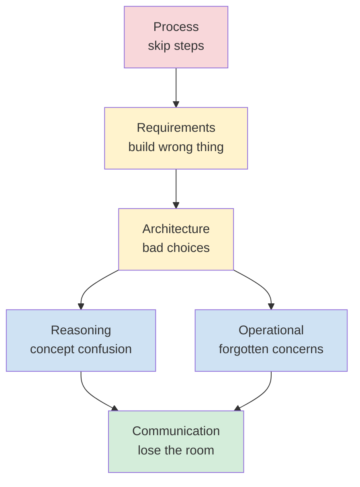

# Common Anti-Patterns in System Design Interviews — What Loses Candidates Points

**Date:** 2026-05-02 | **Updated:** 2026-05-02
**Tags:** `system-design` `interview` `anti-patterns` `framework`

## Table of Contents

- [Summary](#summary)
- [Why This Matters](#why-this-matters)
- [Overview — How Anti-Patterns Cluster](#overview--how-anti-patterns-cluster)
- [Process Anti-Patterns — Skipping Steps](#process-anti-patterns--skipping-steps)
  - [1. Failing to Ask Clarifying Questions](#1-failing-to-ask-clarifying-questions)
  - [2. Premature Detail — Jumping to Cassandra and Bloom Filters](#2-premature-detail--jumping-to-cassandra-and-bloom-filters)
  - [3. Drawing All the Boxes Before Doing Capacity Math](#3-drawing-all-the-boxes-before-doing-capacity-math)
  - [4. Skipping API Design](#4-skipping-api-design)
  - [5. Database-First Mindset](#5-database-first-mindset)
  - [6. Writing Pseudocode When the Interviewer Wanted a Diagram](#6-writing-pseudocode-when-the-interviewer-wanted-a-diagram)
- [Requirements Anti-Patterns — Building the Wrong Thing](#requirements-anti-patterns--building-the-wrong-thing)
  - [7. Ignoring NFRs](#7-ignoring-nfrs)
  - [8. Missing Capacity Estimation](#8-missing-capacity-estimation)
- [Architecture Anti-Patterns — Bad Engineering Choices](#architecture-anti-patterns--bad-engineering-choices)
  - [9. Resume-Driven Design](#9-resume-driven-design)
  - [10. Hand-Waving at Scale](#10-hand-waving-at-scale)
  - [11. Single Point of Failure Missed](#11-single-point-of-failure-missed)
  - [12. Reaching for Microservices When a Monolith Suffices](#12-reaching-for-microservices-when-a-monolith-suffices)
  - [13. Distributed Transactions Casually Proposed](#13-distributed-transactions-casually-proposed)
  - [14. Overreliance on Caching as a Design Fix](#14-overreliance-on-caching-as-a-design-fix)
- [Reasoning Anti-Patterns — Confusing the Concepts](#reasoning-anti-patterns--confusing-the-concepts)
  - [15. Confusing Strong Consistency with Strong Durability](#15-confusing-strong-consistency-with-strong-durability)
  - [16. Treating Eventual Consistency as Automatic Correctness](#16-treating-eventual-consistency-as-automatic-correctness)
  - [17. Stating Trade-offs Without Picking a Side](#17-stating-trade-offs-without-picking-a-side)
- [Operational Anti-Patterns — The Forgotten Concerns](#operational-anti-patterns--the-forgotten-concerns)
  - [18. Missing Read/Write Path Discussion](#18-missing-readwrite-path-discussion)
  - [19. Skipping Failure Scenarios](#19-skipping-failure-scenarios)
  - [20. Missing Back-Pressure and Overload Behavior](#20-missing-back-pressure-and-overload-behavior)
  - [21. Ignoring Observability](#21-ignoring-observability)
  - [22. Skipping Security Entirely](#22-skipping-security-entirely)
- [Communication Anti-Patterns — Losing the Room](#communication-anti-patterns--losing-the-room)
  - [23. Talking Too Much, Listening Too Little](#23-talking-too-much-listening-too-little)
  - [24. Not Reaching the Bottlenecks Discussion](#24-not-reaching-the-bottlenecks-discussion)
- [How to Recover Mid-Interview](#how-to-recover-mid-interview)
- [Anti-Pattern Self-Audit Checklist](#anti-pattern-self-audit-checklist)
- [Related](#related)
- [References](#references)

## Summary

System design interviews are graded on the visibility of your reasoning, not on the prettiness of the final diagram. The candidates who fail rarely fail because they don't know any technology — they fail because they skip steps, name technologies before requirements, hand-wave at scale, confuse adjacent concepts (consistency vs durability, eventual consistency vs correctness), and forget to defend the system against failure. This doc enumerates the 24 most reliable anti-patterns that show up in mock and real loops, organized by category, each with a concrete example of what it looks like, why it costs points, and the corrected version. The accompanying ["How to recover mid-interview"](#how-to-recover-mid-interview) section gives you a verbal protocol for un-doing damage when you catch yourself in one of these traps with 20 minutes left on the clock.

## Why This Matters

Anti-patterns are negative space for the [6-Step Framework](./six-step-framework.md). The framework tells you what to do; this catalog tells you what not to do — and more usefully, names each failure mode so you can detect it in the moment. Two specific reasons this list pays off:

1. **Pattern recognition is faster than process.** Under interview pressure, "am I about to over-spec the database?" is easier to ask yourself than "am I executing Step 4 properly?" Naming the trap makes it possible to dodge it.
2. **Most no-hire signals are anti-patterns, not knowledge gaps.** Interviewers rarely write "didn't know about consistent hashing." They write "jumped straight to architecture without confirming requirements," "named Kafka with no justification," "didn't compute QPS," "no failure-mode discussion." Those are all on this list.

If you finish a mock and your reviewer's notes match three or more entries below, you have a reproducible problem to drill — not a vague "be more rigorous" comment.

## Overview — How Anti-Patterns Cluster

The 24 anti-patterns sort into six categories. The clusters matter because anti-patterns rarely appear alone — if you're missing capacity estimation (Requirements), you almost certainly hand-wave at scale (Architecture) and don't reach the bottlenecks discussion (Communication). Fix the root cluster and three or four downstream symptoms disappear with it.

The grading impact is roughly: Process anti-patterns cost you the framing signal (the interviewer never sees you think structurally). Requirements anti-patterns cost you the rigor signal (you can't justify any later decision). Architecture and Reasoning anti-patterns cost you the seniority signal (you sound like someone who has read about systems but not run them). Operational and Communication anti-patterns cost you the production-readiness signal (you can build it but not own it).

## Process Anti-Patterns — Skipping Steps

### 1. Failing to Ask Clarifying Questions

**What it looks like:** The interviewer says "Design Twitter" and the candidate says "OK, so we'll need a database for users, a database for tweets..." within 30 seconds. No questions about scale, target users, feature scope, or what "Twitter" even means in this conversation.

**Why it costs points:** Senior engineers do not start building until they know what they're building. The interviewer is testing whether you can resist the urge to architect a familiar shape and instead make the problem concrete. Skipping the questions reads as "I'll build the version of Twitter I memorized" — which is not a hire signal.

**Corrected version:** Spend 3–5 minutes (yes, that long) on questions. Cluster them: scope ("public timeline only or also DMs? media uploads?"), scale ("how many DAU are we targeting? read:write ratio?"), constraints ("global or single-region? mobile-first?"), and out-of-scope ("are we doing search? recommendations?"). Write the answers on the board — they are now your contract.

**Worked example.** Prompt: "Design a chat system." Bad open: "OK, so we'll have a WebSocket server, a message store, and a notification service." Good open: "A few questions before I sketch. (1) 1:1 only, group chat, or both — and if groups, what's the cap? (2) Are we storing message history forever, or do messages expire? (3) Do we need read receipts and typing indicators? (4) Roughly how many DAU and what's the average messages-per-user-per-day? (5) Mobile-first with offline support, or web-only? (6) Is end-to-end encryption a requirement or out of scope?" Each of those answers eliminates a category of design — group caps drive the fan-out strategy, message expiry drives the storage tier choice, E2EE drives whether server-side search is even possible. Asking them up front is cheaper than rebuilding the design in minute 35.

### 2. Premature Detail — Jumping to Cassandra and Bloom Filters

**What it looks like:** Within five minutes, the candidate has named Cassandra, Kafka, Redis, Bloom filters, consistent hashing, and CRDTs. There are no boxes on the board yet. Requirements have not been confirmed.

**Why it costs points:** Specific technology names are appropriate at Step 4 (data model) and Step 6 (deep dives), not Step 1. Naming Cassandra before you know the QPS or consistency requirement looks like résumé-flexing rather than reasoning. The interviewer's mental note is "candidate jumped to a familiar tool without justifying it."

**Corrected version:** Name **categories** first, then specific technologies once a constraint forces the choice. "I need a key-value store with high write throughput and tunable consistency" is a Step 4 sentence. "I'll use Cassandra because the write rate is 200K/s and we need multi-region writes with tunable consistency" is a Step 6 sentence. The category-then-instance pattern is the legible version of the same decision.

### 3. Drawing All the Boxes Before Doing Capacity Math

**What it looks like:** A complete architecture diagram with load balancer, API tier, cache, database, queue, and worker tier — drawn before any QPS or storage estimate exists. When asked "how big is this?", the candidate retrofits numbers to justify the diagram.

**Why it costs points:** The shape of the system is determined by the numbers. 100 QPS with 1 GB of data is a single VM. 1M QPS with 1 PB of data is a different system. Drawing the latter when the requirement was the former is over-engineering; drawing the former when the requirement was the latter is under-engineering. The math has to come first or the boxes are arbitrary.

**Corrected version:** Reserve five minutes after requirements and before HLD for [back-of-envelope estimation](../foundations/back-of-envelope-estimation.md). Compute peak QPS, storage at year 5, and bandwidth. Say out loud which number drives which architectural choice ("50 GB fits in a single Postgres primary, so I'm not sharding at year 1; I'll note where the line is").

### 4. Skipping API Design

**What it looks like:** The candidate goes from requirements directly to "we'll have a service that..." without specifying any endpoints, request shapes, or response codes.

**Why it costs points:** The API is the contract that the rest of the system serves. Without it, the data model is under-specified (what fields are returned?), the storage choice is under-specified (what's the access pattern?), and the failure modes are under-specified (what does the client see when X breaks?). Senior interviewers will ask "what does the call look like?" within 10 minutes — better that you preempt the question.

**Corrected version:** Sketch 3–5 endpoints with verb, path, request body, response body, and idempotency story. Even on a whiteboard: `POST /tweets {body, media_url} -> 201 {id, created_at}` is enough. Call out idempotency keys, pagination shape, and error codes for the hot paths.

### 5. Database-First Mindset

**What it looks like:** The first artifact on the board is a schema. Tables, columns, foreign keys — before any discussion of access patterns, traffic shape, or read/write ratio.

**Why it costs points:** Schema is a function of access patterns; access patterns are a function of the API; the API is a function of the requirements. Starting at schema means you've inverted the dependency graph — your tables will be normalized for some imaginary reporting use case rather than shaped for the actual hot read.

**Corrected version:** Schema is Step 4, after Step 3 (API). When you sketch a table, immediately name the dominant access pattern it serves: "tweets keyed by tweet_id, partitioned by user_id because the dominant read is `GET /users/:id/tweets`." If you can't name the access pattern, the schema is premature.

### 6. Writing Pseudocode When the Interviewer Wanted a Diagram

**What it looks like:** The candidate writes a `function processTweet(tweet) { ... }` block on the whiteboard, complete with for-loops and if-statements, when the interviewer was waiting for boxes-and-arrows.

**Why it costs points:** System design interviews are about component boundaries, data flow, and trade-offs — not algorithms. Pseudocode signals "I'm a coding-interview candidate trying to system-design," which is the wrong frame. A diagram with named protocols (HTTP, gRPC, RESP, libpq) and named queues (Kafka, SQS) communicates more in 30 seconds than 50 lines of code.

**Corrected version:** When you feel the urge to write code, draw a sequence diagram instead. Numbered arrows between components ("1. client → API: POST /tweet; 2. API → DB: INSERT; 3. API → Kafka: publish event; 4. fanout-worker → Redis: write to follower timelines") carry the same information in interview-appropriate form.

## Requirements Anti-Patterns — Building the Wrong Thing

### 7. Ignoring NFRs

**What it looks like:** The candidate lists functional requirements ("users can post, follow, like") but never names a latency target, availability target, durability target, or consistency requirement. The interviewer asks "what's our p99?" mid-design and the candidate freezes.

**Why it costs points:** Functional requirements tell you what to build; non-functional requirements tell you how to build it. A 50ms p99 read latency picks one architecture; a 500ms target picks a much simpler one. A 99.99% availability target ($\sim$52 minutes downtime/year) requires multi-AZ; 99.9% ($\sim$8.7 hours/year) does not. Without the NFRs, every architectural choice is unfalsifiable.

**Corrected version:** Pin down the NFR shortlist in Step 1: latency p50/p99 for reads and writes, availability target, durability target (RPO/RTO), consistency model on the hot path, and rough scale. See [Non-Functional Requirements](../foundations/non-functional-requirements.md) and [SLA/SLO/SLI](../foundations/sla-slo-sli-and-availability.md). Ask the interviewer to confirm; their nudges in this step are worth gold.

### 8. Missing Capacity Estimation

**What it looks like:** No QPS computed. No storage estimate. No bandwidth estimate. The candidate says "it's a lot of traffic" and moves on.

**Why it costs points:** "A lot" is not a number. Whether you need to shard depends on whether the dataset is 50 GB or 50 TB. Whether you need a CDN depends on whether the egress is 100 Mbps or 100 Gbps. Whether you need consistent hashing depends on whether the cache fits on one node or spans 200. Skipping the math means every later decision is uncalibrated.

**Corrected version:** Compute three numbers in five minutes: peak QPS (DAU × actions-per-user-per-day × peak-multiplier ÷ 86400), storage at year 5 (records/day × bytes/record × 365 × 5 × replication-factor), and peak bandwidth (peak QPS × payload bytes). Round to one significant figure — order of magnitude is what matters. Then explicitly use each number to justify a downstream decision.

**Worked example.** Prompt: "Design Instagram for 500M DAU." Sloppy answer: "It's huge, so we need everything sharded and a CDN." Calibrated answer: "500M DAU, average 5 photo views and 0.1 uploads per user per day. View QPS = 500M × 5 / 86400 ≈ 29K average, peak ~150K with a 5x multiplier. Upload QPS ≈ 580 average, peak ~3K. Photo storage: 500M × 0.1 uploads × 500 KB × 365 × 5 × 3-replica = ~140 PB at year 5. Peak read bandwidth = 150K × 500 KB ≈ 75 GB/s — that's a CDN problem, not an origin problem. The numbers force three decisions: object storage tier (S3-class), aggressive CDN with high cache hit ratio, and photo-write path that's not the same service as the photo-read path." Five minutes of math, three locked decisions.

## Architecture Anti-Patterns — Bad Engineering Choices

### 9. Resume-Driven Design

**What it looks like:** Kafka, Kubernetes, Cassandra, Elasticsearch, gRPC, and Redis all appear in the diagram for a system serving 100 QPS. When asked why Kafka, the candidate says "it's good for events." When asked why Cassandra, "it scales horizontally."

**Why it costs points:** Each named technology should solve a problem you have demonstrated you have. Kafka for 100 QPS is over-engineering by a factor of $10^{4}$; the answer was Postgres LISTEN/NOTIFY or just a synchronous call. Naming impressive tools without a triggering constraint is the opposite of a seniority signal — senior engineers reach for the simplest thing that meets the requirement.

**Corrected version:** For every technology you name, articulate the trigger: "the write fan-out is 10 million notifications/minute, which exceeds what a synchronous fan-out can sustain, so I'm introducing Kafka to decouple producers from consumers and absorb burst." If you can't name the trigger, you don't need the tool. See [Resume-driven development](https://en.wikipedia.org/wiki/Resume-driven_development) for the canonical anti-pattern.

**Worked example.** A candidate proposes "Kafka + Flink + Cassandra + Elasticsearch" for a TODO-list app. The interviewer's mental model is: this person can't tell the difference between a 100-RPS CRUD service and a 100K-RPS analytics pipeline. The corrected pitch: "It's a CRUD app with a few thousand users. Postgres handles the data. The web tier is a single service behind a load balancer. If we ever need full-text search across notes, we'd add Postgres `tsvector` first and only graduate to Elasticsearch when we hit ranking or faceting requirements Postgres can't serve. Total moving parts: web tier, database, cache. Three components, not eight."

### 10. Hand-Waving at Scale

**What it looks like:** When asked how the system handles 10x growth, the candidate says "it scales horizontally" and moves on.

**Why it costs points:** "Scales horizontally" is a claim, not an analysis. Horizontal scaling requires a partitioning strategy (what's the partition key? how do you handle hot partitions?), a load-balancing strategy (round-robin? least-loaded? consistent hashing?), and a state-management strategy (stateless tier? sticky sessions? distributed cache?). Skipping the math leaves all of those unanswered.

**Corrected version:** Show the math. "At 10x, peak QPS goes from 50K to 500K. A single API instance handles 5K RPS, so we need ~100 instances behind the L7 LB. The Postgres primary saturates at ~30K writes/s — at 10x writes (200K), we partition by user_id into 8 shards, each handling ~25K." Numbers convert hand-waving into engineering.

**Worked example.** Interviewer: "What if traffic 10x's overnight?" Bad answer: "We auto-scale." Good answer: "Three things would need to absorb the spike. First, the API tier — it's stateless, so the auto-scaler adds capacity in 60-90 seconds based on CPU; the gap is bridged by the L7 LB's queue. Second, the cache — Redis cluster scales by adding shards, but rebalancing costs ~5 minutes of degraded hit rate, so I'd over-provision to 3x baseline rather than scale on demand. Third, the database write path — that doesn't elastically scale, so the deep-dive question is whether 10x writes exceeds the primary's ceiling. At 5K writes/s baseline, 10x is 50K writes/s, which exceeds a single primary; we'd shard ahead of the spike or shed non-critical writes (analytics events) to a queue and apply lazily."

### 11. Single Point of Failure Missed

**What it looks like:** The diagram shows one load balancer, one cache, or one database primary. When asked about HA, the candidate says "we have a load balancer for the API tier" — apparently unaware the LB itself is a single box.

**Why it costs points:** The load balancer, the DNS, the configuration service, and the database primary are all SPOF candidates. Missing them means the system has 99.9% availability where the design claimed 99.99%. Failure-mode reasoning is one of the highest-weighted rubric items; missing the most basic SPOFs caps you at "junior."

**Corrected version:** Walk the diagram and ask "what dies when this box dies?" for every box. LB → multiple LBs behind anycast or DNS round-robin. Cache → cluster with replication. DB primary → primary + replica with automated failover. Configuration → quorum store (etcd, ZooKeeper). Then call out the residual SPOFs you accept ("we have a single region for v1; multi-region is out of scope but I'll flag the failure mode").

**Worked example.** A common candidate diagram: `Client → [LB] → [API × 3] → [Redis] → [Postgres primary] → [Postgres replica]`. Looks redundant. It isn't — the LB is one box, Redis is one box, and the Postgres primary is one box. Three SPOFs in a five-component diagram. The corrected version: `Client → DNS (anycast across regions) → [LB pair, active-active] → [API × N] → [Redis cluster, 3-shard with 1 replica each] → [Postgres primary + sync replica with auto-failover] → [Postgres async replicas for reads]`. Now the only residual SPOF is the region itself, which you flag as accepted scope.

### 12. Reaching for Microservices When a Monolith Suffices

**What it looks like:** A 100 QPS internal tool gets a 12-service architecture with API gateway, service mesh, distributed tracing, and per-service databases. The candidate says it "decouples concerns."

**Why it costs points:** Microservices buy independent deploy cadence and team autonomy at the cost of distributed-system complexity (network failures, partial deploys, distributed transactions, cross-service tracing). For 100 QPS with one team, you've imported all the cost and none of the benefit. Senior interviewers see this as a signal you don't understand the trade-off.

**Corrected version:** Default to a modular monolith. Split out a service when (a) the team boundary requires independent deploy, (b) the scale requires independent scaling, or (c) the technology requires a different runtime. Articulate the trigger. "I'd start as a single service and extract the media-processing path when the CPU profile diverges from the API tier." See [Martin Fowler on MonolithFirst](https://martinfowler.com/bliki/MonolithFirst.html).

**Worked example.** Prompt: "Design an internal ticketing system for a 50-engineer company." A microservices answer with auth-service, ticket-service, notification-service, search-service, and audit-service is over-built. The right answer: a single Spring Boot or Rails app with five well-named modules behind one database; a single deploy pipeline; one observability stack. Total operational footprint: one process per region. When the company hits 500 engineers and three teams own different parts of the workflow, *then* extract — and the modular boundaries you established on day one make the extraction cheap.

### 13. Distributed Transactions Casually Proposed

**What it looks like:** "We'll use a 2PC across the order service, the inventory service, and the payment service to keep them consistent." No mention of latency cost, blocking-on-coordinator failure, or operational overhead.

**Why it costs points:** 2PC blocks all participants on the coordinator and roughly doubles latency. It locks resources for the duration of the transaction, which serializes throughput. In partial-failure modes (coordinator crash mid-protocol), participants are stuck holding locks indefinitely. Naming 2PC without naming these costs reads as "I learned the name but never operated it."

**Corrected version:** Default to the saga pattern with compensating actions. "Order service writes the order in `pending` state, calls inventory; on success, calls payment; on payment failure, runs the inventory-release compensation. The trade-off is that observers can see partial state — we accept eventual consistency on the cross-service view in exchange for availability and bounded latency." If you do propose 2PC, name the latency hit and the blocking failure mode out loud.

**Worked example.** Prompt: "Design Uber's ride-matching." Bad answer: "We'll 2PC across the rider service, the driver service, and the trip service to atomically reserve the driver and create the trip." Good answer: "I'm going to use a state machine on the trip aggregate as the single source of truth. The trip transitions `requested → matched → accepted → in_progress → completed`. The driver service is a read-model fed by trip events; matching is an idempotent operation keyed by `(trip_id, driver_id)`. If the driver-claim fails after the rider-charge auth, we issue a compensation that voids the auth — the rider sees a 'no driver available' message, not a charged card. The cost is that the trip aggregate is the bottleneck for that rider; we shard by `rider_id` so it scales horizontally."

### 14. Overreliance on Caching as a Design Fix

**What it looks like:** Every performance problem the interviewer raises gets answered with "we'll add a cache." Hot DB partition? Cache. Slow API? Cache. Expensive computation? Cache.

**Why it costs points:** Cache is a band-aid for a missing scale-out story. It papers over the real architecture (sharding, read replicas, denormalization, async pre-computation) without addressing the underlying cost. Cache also introduces its own failure modes: thundering herd on cold start, stale reads on update, cache stampede on TTL expiry, hit-rate cliffs when working set exceeds capacity.

**Corrected version:** Cache is a layer, not a strategy. Use it explicitly to (a) reduce read load on a downstream that has a known capacity ceiling, (b) reduce latency by serving from RAM, or (c) reduce egress cost. For each cache, name the consistency model (write-through? write-back? TTL?), the staleness budget, the eviction policy, and the cold-start behavior. If you can't, you're hand-waving.

**Worked example.** A candidate proposes Redis in front of a single Postgres primary to "handle the load." The interviewer pushes: what's the hit ratio? What's the cold-start behavior? What happens when the cache loses a node? The candidate has no answers. The actual fix isn't "more cache" — it's read replicas (which handle the load with linearizable-on-leader semantics) plus a cache only for the truly hot keys (top 1% of access). Senior framing: "I'm using read replicas as the primary horizontal scaling for reads; cache is reserved for the long-tail latency wins on the hottest 5% of keys with a 10-second TTL. If the cache cluster fails entirely, the replicas absorb the read load with elevated p99 but no errors — that's the graceful degradation story."

## Reasoning Anti-Patterns — Confusing the Concepts

### 15. Confusing Strong Consistency with Strong Durability

**What it looks like:** "We need strong consistency, so I'll use Postgres with synchronous replication." Or: "We need strong durability, so I'll use Spanner." The candidate is using the words interchangeably.

**Why it costs points:** They're orthogonal. **Consistency** is about reads observing the most recent write (linearizability, sequential consistency, etc.). **Durability** is about writes surviving crashes (fsync to disk, replication to N replicas before ack). A system can be strongly consistent and weakly durable (everything in RAM, replicated synchronously) or weakly consistent and strongly durable (writes ack after fsync to one replica, async replication elsewhere). Conflating them shows you haven't internalized either concept.

**Corrected version:** Name the two axes separately. "On the write path, durability requires fsync + replication to a quorum before ack — RPO of zero on single-AZ failure. Consistency on the read path requires we route reads to the leader or use a read-quorum that overlaps with the write-quorum — that gives linearizable reads at the cost of higher read latency." See [CAP and Consistency Models](../foundations/cap-and-consistency-models.md).

**Worked example.** A bank ledger: durability is "every committed write survives the loss of any single node" (achieved by quorum replication + fsync). Consistency is "two readers asked simultaneously will see the same balance" (achieved by routing reads to the leader, or a snapshot-isolation read across replicas). A system can be Postgres with synchronous replication (strong on both), Cassandra with `QUORUM` writes and `ONE` reads (durable but stale reads possible), or Redis without persistence (consistent within a session but loses everything on crash). The right architecture is the one where the consistency *and* durability targets are met independently — confusing them lets you ship a system that passes one test and fails the other.

### 16. Treating Eventual Consistency as Automatic Correctness

**What it looks like:** "We'll use eventual consistency for the user profile cache." When asked what happens if a user reads their own stale profile right after updating it, the candidate hand-waves: "it'll converge."

**Why it costs points:** Eventual consistency means convergence, not correctness. "It'll converge" doesn't answer "what does the user see in the meantime?" — and for read-your-own-writes scenarios, the answer is often "the wrong thing." Real systems use session consistency, monotonic reads, or read-your-writes guarantees layered on top of eventual consistency to handle the cases where convergence-eventually isn't good enough.

**Corrected version:** When you propose eventual consistency, name the staleness budget and the user-visible failure mode. "The follower-feed is eventually consistent with a 30-second budget under steady state; under partition, the user might see a 5-minute-old feed. For the user's *own* posts, we route reads to the leader or use a sticky read-your-writes session token to mask the inconsistency on the most likely confusion path."

**Worked example.** Prompt: "Design a distributed counter for video view counts." Naive answer: "Eventually consistent counter, increment in any region, gossip to converge." Problem: a creator who refreshes their dashboard immediately after a viral spike sees the count *go down* as different regions report partially. The fix: monotonically increasing per-region counters with a read-time aggregator that always returns max-of-regions for the user's session, plus a server-truth counter that lags by ~30s but never decreases. The user-visible guarantee is "view counts are monotonically non-decreasing within a session, accurate within 30s of server truth." That's a real correctness statement; "eventually consistent" alone wasn't.

### 17. Stating Trade-offs Without Picking a Side

**What it looks like:** "We could use SQL or NoSQL, both have trade-offs." Then the candidate moves on without picking either, or picks one without naming why.

**Why it costs points:** Naming the trade-off without committing is half a signal. The interviewer is testing whether you can decide under uncertainty, not whether you can list options. "It depends" without naming the dependency is the worst version — it sounds humble but reads as "I don't know what variables would tip it."

**Corrected version:** "I'm picking Postgres over Cassandra because (a) our scale fits a single primary at year 5, (b) the access pattern is relational with multi-table joins, and (c) the team has Postgres operational experience. The cost is that if write throughput grows past ~30K/s sustained, we'll need to shard or migrate — I'd flag that as the v2 conversation." Pick. Justify. Name the cost.

**Worked example.** Bad answer to "push or pull for the news feed?": "Both have trade-offs — push has lower read latency but higher write fan-out, pull is the opposite." Good answer: "I'm picking hybrid: push for users with < 10K followers (covers 99% of users, gets sub-second feed reads), pull-on-read for celebrity accounts (>10K followers) to avoid the fan-out blast radius. The cost is added complexity in the read path — we have to merge the pushed timeline with the pulled celebrity posts at read time. I accept that complexity in exchange for bounded write amplification on viral posts."

## Operational Anti-Patterns — The Forgotten Concerns

### 18. Missing Read/Write Path Discussion

**What it looks like:** The architecture diagram is complete but nobody has walked through what happens when a user posts a tweet, end to end. The candidate has drawn boxes but not animated them.

**Why it costs points:** The diagram is a static structure; the read/write path is the lifecycle. Senior reviewers grade on the lifecycle because that's where most failure modes live. Without it, the interviewer can't tell whether you understand how the system actually behaves under traffic.

**Corrected version:** For each major operation (tweet creation, feed read, search), narrate the path: "Client sends `POST /tweets`. L7 LB routes to API instance. API validates, writes to Postgres primary (synchronous WAL replication to one replica before ack). API publishes a `tweet_created` event to Kafka. Fanout worker consumes, looks up followers, writes timeline entries to Redis. Response returns to client with 201 + tweet_id. p99 target: 200ms." That paragraph carries more signal than the diagram alone.

### 19. Skipping Failure Scenarios

**What it looks like:** The happy path is fully specified; the candidate never asks "what happens when the cache dies?" or "what happens when the queue backs up?"

**Why it costs points:** Production systems spend most of their lives in some kind of degraded state. Designing only for the happy path means the system has no defined behavior for the cases it will spend most of its time in. Failure-mode reasoning is one of the most reliable hire signals.

**Corrected version:** For each component, ask "what happens when this dies?" and articulate the answer: detection (health check fails after 3 misses), failover (leader election promotes the replica), recovery (replica catches up from WAL), client impact (5-second window of elevated p99 during failover). Name the dependencies that *don't* have a failover and call them out as accepted risk.

**Worked example.** For a payment system, walk through three failures in 90 seconds: (1) Payment provider API times out — circuit breaker opens after 5 consecutive failures, in-flight requests fall back to the secondary provider, the user sees a 2-second extra latency but the charge succeeds. (2) Postgres primary loses its disk — sync replica is promoted within 30s, the in-flight transaction returns 503 and the client retries with the original idempotency key, the second attempt succeeds against the new primary. (3) Kafka topic for receipt-emails backs up — receipts are delayed but not lost; user-visible impact is "receipt arrives in 5 minutes instead of 5 seconds." Three named failure modes, three named user impacts. That's the production-readiness signal.

### 20. Missing Back-Pressure and Overload Behavior

**What it looks like:** When traffic exceeds capacity, the candidate's system has no defined behavior. There's no rate limiter, no admission control, no shedding policy, no circuit breaker.

**Why it costs points:** Systems without back-pressure cascade. A slow downstream causes upstream queues to grow, which causes upstream memory pressure, which causes the upstream to slow further, which compounds. Real systems use rate limiting at ingress, circuit breakers between services, bounded queues with shedding, and bulkheads to isolate failure domains.

**Corrected version:** Name the overload protections explicitly. "Ingress rate limiter at the L7 LB caps at 110% of nominal capacity per source IP. Inter-service calls go through a circuit breaker that opens after 50% error rate over 10s and probes with 1% traffic for recovery. Worker queues are bounded at 10K items per instance with oldest-first shedding when full. The user-visible behavior under overload is HTTP 429 with `Retry-After`, not a slow response."

**Worked example.** A flash-sale system gets 50x normal load when a sale opens. Without back-pressure, every layer queues, latency rises into multi-second territory, mobile clients time out, users retry, and the system collapses. With back-pressure: the L7 LB sheds 80% of incoming traffic with 503 + `Retry-After: 30`; the API tier sees its normal capacity; the inventory service is protected by per-SKU semaphores so one viral SKU can't starve the others; the order-confirmation queue is bounded and overflow returns "we're at capacity, try again in 30 seconds" to the user. The system stays up. Some users wait. Nobody's payment is silently lost.

### 21. Ignoring Observability

**What it looks like:** The candidate finishes the design and the interviewer asks "how do you know it's working?" — silence, then "we'll add monitoring later."

**Why it costs points:** Observability (metrics, logs, traces) is part of the design, not a bolt-on. It dictates the cardinality of identifiers, the schema of structured logs, the propagation of trace context through async boundaries, and the cost of the metrics pipeline. Saying "we'll add it later" is the same as saying "I'll fix the foundation after the house is built."

**Corrected version:** For the hot paths, name the SLIs ("request latency p50/p99, error rate, saturation as queue depth"), the SLOs ("99.9% of reads under 200ms over 30 days"), and the alert thresholds ("page when 5-minute error rate > 1% or burn rate > 14.4x"). Note where trace propagation is required (across the Kafka boundary via headers). See [SLA/SLO/SLI](../foundations/sla-slo-sli-and-availability.md).

**Worked example.** For an e-commerce checkout: SLIs are checkout-completion-rate, p99 checkout latency, payment-provider error rate, and inventory-reservation conflict rate. SLOs are 99.95% completion over 28 days, p99 < 3s, payment errors < 0.5%. Alert thresholds: page on burn rate > 14.4x for 1h or > 6x for 6h (multi-window burn-rate alerting from the SRE workbook). Trace propagation runs across the Kafka boundary via W3C `traceparent` headers so a single checkout maps to one trace from API to payment provider to receipt-email-worker.

### 22. Skipping Security Entirely

**What it looks like:** No mention of authentication, authorization, transport encryption, secrets management, input validation, or rate limiting on auth endpoints.

**Why it costs points:** Security is a baseline expectation in any production system. Missing it entirely signals you don't think of security as part of design. For systems handling user data or payments, this can be a hard no-hire signal at senior levels.

**Corrected version:** In Step 1, identify the security-sensitive paths (auth, payment, PII access). In Step 5/6, name the controls: TLS 1.3 in transit, KMS-backed encryption at rest, OAuth2/OIDC for user auth with short-lived JWTs, mutual TLS for service-to-service, secrets in a vault (not env vars), input validation at every trust boundary, rate limiting on auth endpoints, and an audit log for sensitive operations. Two minutes of named controls is enough — the signal is that you considered it.

**Worked example.** For a healthcare records system, the security paragraph at the end of the design: "PHI in transit uses TLS 1.3 with mTLS between services; PHI at rest uses per-tenant KMS-managed keys with envelope encryption. Access control is RBAC with break-glass audit; every read of a PHI record emits an audit event to an append-only log with 7-year retention. Auth is SAML for clinicians, OAuth2 for patients, with WebAuthn for the second factor. Rate limits on `/login` are 5/minute/IP plus account lockout after 10 failed attempts. Input validation is schema-driven at the API gateway. We're HIPAA-aligned, not HIPAA-certified — that's a compliance audit step out of scope here." Ninety seconds. Ten controls. Done.

## Communication Anti-Patterns — Losing the Room

### 23. Talking Too Much, Listening Too Little

**What it looks like:** The candidate monologues for 10 minutes, ignoring the interviewer's nudges. When the interviewer says "so about the data model..." the candidate says "yeah, getting there" and continues on the previous topic.

**Why it costs points:** The interviewer's nudges are the most valuable signal in the room — they're telling you where to spend the remaining time. Ignoring them either means you didn't hear (bad) or you're locked into a script (worse). Either way, you've lost the partnership the interview is supposed to demonstrate.

**Corrected version:** Pause every 3–5 minutes. Ask "any direction you want me to dig deeper on?" or "want me to keep going on data model or pivot to the failure modes?" Treat the interviewer as a senior collaborator who's seen this loop a thousand times and knows where the interesting trade-offs are. When they nudge, follow.

**Worked example.** A candidate finishes sketching the HLD. Instead of rushing into deep dives, they say: "That's the high-level picture. Three places I see worth deep-diving: the fan-out path on writes, the read consistency on the user's own posts, and the cold-start behavior of the cache after a deploy. Which is most interesting to you, or is there something else you'd rather poke at?" The interviewer nods and picks one. Now the candidate is solving the problem the interviewer wanted to test, not the problem the candidate guessed at.

### 24. Not Reaching the Bottlenecks Discussion

**What it looks like:** The candidate spends 45 minutes on requirements and HLD, runs out of time, and never gets to deep dives. The interviewer never sees how the candidate reasons about hot paths, scaling cliffs, or failure modes.

**Why it costs points:** Steps 1–5 are table stakes; Step 6 (deep dives) is where the seniority signal is densest. A candidate who never reaches it is, by default, capped at "mid-level signal strong, senior signal absent." It's a self-inflicted ceiling.

**Corrected version:** Time-box ruthlessly. Requirements: 5 min. Estimates: 5 min. API: 5 min. Data Model: 5 min. HLD: 10 min. Deep Dives: 15+ min. If you're 30 minutes in and still on HLD, you're behind — say "let me lock the HLD here and pivot to bottlenecks" out loud. The verbalized course-correction is itself a signal.

**Worked example.** A candidate is 35 minutes into a 60-minute interview, mid-HLD, with the load balancer and API tier still being discussed. The wrong move is to keep going on HLD until time runs out. The right move is: "Let me freeze the HLD here — there are two bottlenecks I want to make sure we discuss with the time we have. The hot-key problem on the redirect cache, and the write-burst behavior when a viral URL spikes. Which one would you like me to start with?" That single sentence converts a "ran out of time" no-hire into a "drove the conversation to the interesting part" hire.

## How to Recover Mid-Interview

You will, at some point, catch yourself in one of these traps with 20 minutes left on the clock. The protocol below is how to recover without losing the rest of the interview to remediation. The key insight: **naming the mistake out loud is itself a recovery signal**. Senior engineers catch themselves, course-correct, and continue. Pretending you didn't notice is worse than the original mistake.

**Step 1 — Acknowledge.** "I want to pause — I just realized I jumped to a database choice without doing capacity math. Let me back up." This is a 10-second sentence. The interviewer's mental note flips from "candidate skipped a step" to "candidate caught themselves and corrected."

**Step 2 — Triage.** Decide whether the mistake is recoverable in the remaining time. If you skipped capacity math at minute 5 and you're at minute 20, recovery is cheap. If you skipped requirements and you're at minute 35, recovery is expensive — instead of redoing the whole thing, name the assumption you implicitly made and ask the interviewer to confirm.

**Step 3 — Patch and continue.** Compute the missing artifact at the speed appropriate to its remaining value. If you skipped QPS, take 90 seconds and compute it now; don't redo the architecture, but check whether the existing design holds. If it doesn't, name the gap explicitly: "the existing design assumed 10K QPS implicitly; if it's actually 100K, we'd need to revisit the cache topology — let me note that as a follow-up."

**Step 4 — Adjust the remainder.** With less time, prioritize the highest-signal remaining steps. Skip exhaustive API enumeration and write 2 endpoints instead of 5. Skip exhaustive trade-off enumeration and pick the 2 most impactful. Skip the lower-priority deep dive and go directly to the bottleneck the interviewer cares about. Time pressure is real; tell the interviewer "I'm going to focus on X because it's the highest-risk decision — happy to come back to Y if there's time."

**Anti-pattern recovery cheat sheet:**

| Trap | Recovery sentence |
|------|-------------------|
| Premature detail | "Let me pull back from the implementation and confirm what we're building." |
| No NFRs | "Before I go further, can I lock in the latency, availability, and consistency targets?" |
| No capacity math | "I want to take 90 seconds and compute QPS, storage, and bandwidth — that should validate or invalidate the choices I just made." |
| Database-first | "I jumped to schema; let me back up and write the API contract first, then the schema follows." |
| SPOF missed | "I have a single LB drawn — let me update that to a pair behind anycast and walk through the failure modes." |
| Trade-off without commitment | "I named both options without picking. I'm picking X because Y, accepting Z." |
| Ignored nudge | "You asked about data model a minute ago and I kept going — let me pivot back to that now." |
| No bottleneck discussion | "I'm going to lock the HLD here and spend the remaining time on the two bottlenecks I'm most worried about." |

The recovery protocol is roughly 60 seconds of conversation. The cost of using it is small; the cost of not using it is the rest of the interview.

## Anti-Pattern Self-Audit Checklist

Before you commit to your final design in the wrap-up, run this checklist mentally:

- [ ] Did I ask clarifying questions before drawing anything?
- [ ] Did I write functional and non-functional requirements?
- [ ] Did I compute QPS, storage, and bandwidth?
- [ ] Did I sketch 3–5 API endpoints with shapes?
- [ ] Did I define the schema after the API, not before?
- [ ] Are there any single-instance components in my diagram (LB, DB, cache)?
- [ ] Did I name a category before each specific technology?
- [ ] Did I narrate at least one read path and one write path end-to-end?
- [ ] For each named technology, did I name the triggering constraint?
- [ ] Did I commit to a side on each named trade-off?
- [ ] Did I name failure modes for the top 3 components?
- [ ] Did I name back-pressure / overload behavior?
- [ ] Did I distinguish consistency from durability?
- [ ] Did I name the staleness budget for each eventually-consistent path?
- [ ] Did I name the SLI/SLO for the hot path?
- [ ] Did I name auth, transport encryption, and rate limiting?
- [ ] Did I reach the bottleneck discussion?
- [ ] Did I respond to every interviewer nudge?

If three or more are unchecked, that's where to spend the next 60 seconds.

A candidate who runs this audit silently in the last few minutes of every interview — and verbally addresses the gaps that matter — converts a borderline performance into a strong one. The audit itself takes less than a minute; the recovery for any single gap takes 60–90 seconds. Even patching two gaps in the wrap-up window flips the interviewer's notes from "ran out of steam" to "self-corrected and closed the loop."

## Related

- [The 6-Step System Design Framework](./six-step-framework.md) — the positive-space version of this catalog; what to do at each step rather than what not to do.
- [Trade-off Articulation and Bottleneck Analysis](./tradeoff-articulation-and-bottlenecks.md) — the verbal templates for turning unstated assumptions into named, defended decisions.
- [Back-of-Envelope Estimation](../foundations/back-of-envelope-estimation.md) — the numerical toolkit that defuses the "skipped capacity math" anti-pattern.
- [Non-Functional Requirements](../foundations/non-functional-requirements.md) — the NFR shortlist that prevents the "ignored NFRs" anti-pattern.
- [SLA/SLO/SLI and Availability Math](../foundations/sla-slo-sli-and-availability.md) — the availability vocabulary that prevents hand-waving at uptime targets.
- [CAP, PACELC, and Consistency Models](../foundations/cap-and-consistency-models.md) — the consistency vocabulary that prevents conflating consistency with durability.
- [Core Trade-offs Catalog](../foundations/core-tradeoffs-catalog.md) — the canonical list of axes you can name in any decision.

## References

- Alex Xu, _[System Design Interview — An Insider's Guide](https://www.amazon.com/System-Design-Interview-insiders-Second/dp/B08CMF2CQF)_ (2020) — Volumes 1 and 2 model the structured approach; the implicit lesson in every chapter is which steps not to skip.
- Donne Martin, [system-design-primer](https://github.com/donnemartin/system-design-primer) — the "How to approach a system design interview question" section frames the same anti-patterns from the prescriptive side.
- Hello Interview, [hellointerview.com/learn/system-design](https://www.hellointerview.com/learn/system-design) — graded mock examples that surface the most common candidate failure modes; useful for calibrating what "good" sounds like.
- Educative.io, [Grokking the System Design Interview](https://www.educative.io/courses/grokking-the-system-design-interview) — case-by-case treatment that highlights where candidates typically over-engineer or under-specify.
- John Ousterhout, _[A Philosophy of Software Design](https://web.stanford.edu/~ouster/cgi-bin/aphilosophyofsoftwaredesign.php)_ — the chapter on complexity and the chapter on "tactical tornado" engineering map directly to several anti-patterns above (especially resume-driven design and premature detail).
- Google SRE Book, _[Site Reliability Engineering](https://sre.google/sre-book/table-of-contents/)_ — chapters on monitoring, overload, and cascading failures supply the operational vocabulary that prevents the "missing back-pressure" and "ignoring observability" anti-patterns.
- Werner Vogels, _[10 Lessons from 10 Years of AWS](https://www.allthingsdistributed.com/2016/03/10-lessons-from-10-years-of-aws.html)_ — Lesson 2 ("Expect the unexpected") and Lesson 7 ("Build evolvable systems") are the production-mindset rebuttals to the over-engineering and microservices-first anti-patterns.
- Martin Fowler, [MonolithFirst](https://martinfowler.com/bliki/MonolithFirst.html) — the canonical defense against the "reach for microservices" anti-pattern.
- Martin Kleppmann, _Designing Data-Intensive Applications_ — Chapters 5 (Replication), 7 (Transactions), and 9 (Consistency and Consensus) supply the conceptual rigor that prevents conflating consistency with durability or treating eventual consistency as correctness.
