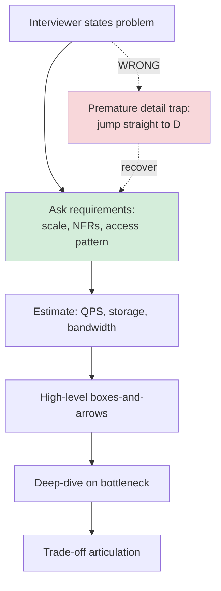

# Common Anti-Patterns in System Design Interviews

**Date:** 2026-04-26 | **Updated:** 2026-04-26
**Tags:** `system-design` `interview` `anti-patterns`

## Table of Contents

- [Summary](#summary)
- [Overview](#overview)
- [1. Premature Detail — Diving Into LSM Internals Before Agreeing on Requirements](#1-premature-detail--diving-into-lsm-internals-before-agreeing-on-requirements)
- [2. Resume-Driven Design — Kafka Because Portfolio, Not Because Need](#2-resume-driven-design--kafka-because-portfolio-not-because-need)
- [3. Ignoring NFRs — Skipping Consistency, Availability, Durability](#3-ignoring-nfrs--skipping-consistency-availability-durability)
- [4. Hand-Waving at Scale — No Estimates, No Sharding Plan When QPS Demands It](#4-hand-waving-at-scale--no-estimates-no-sharding-plan-when-qps-demands-it)
- [5. No Trade-Off Articulation — Just Listing Components](#5-no-trade-off-articulation--just-listing-components)
- [6. Over-Engineering for a Hypothetical 100x](#6-over-engineering-for-a-hypothetical-100x)
- [7. Drawing Boxes Without Naming Protocols or Sync vs Async](#7-drawing-boxes-without-naming-protocols-or-sync-vs-async)
- [8. Accepting the First Solution Without Challenging It](#8-accepting-the-first-solution-without-challenging-it)
- [9. No Bottleneck Identification](#9-no-bottleneck-identification)
- [10. Missing the Obvious Sharding Strategy](#10-missing-the-obvious-sharding-strategy)
- [How to Self-Diagnose Mid-Interview](#how-to-self-diagnose-mid-interview)
- [Recovery Phrases](#recovery-phrases)
- [Related](#related)
- [References](#references)

## Summary

System design interviews are scored less on the final architecture and more on how you reason. Ten failure modes account for the bulk of weak performances: jumping into low-level details before requirements are pinned down, picking trendy components for resume reasons, ignoring non-functional requirements (NFRs), refusing to do back-of-envelope math, listing components without articulating trade-offs, over-engineering for traffic that doesn't exist, drawing boxes without labeling the wires, accepting the first idea, never naming the bottleneck, and missing the natural sharding key. Each one has a recognizable shape, a recognizable interviewer reaction, and a short phrase you can use to redirect mid-interview.

## Overview

A system design interview is a structured conversation, not a monologue. The interviewer is checking five things, in roughly this order:

1. Can you elicit and prioritize **requirements** (functional + NFRs)?
2. Can you do **back-of-envelope estimation** to size the problem?
3. Can you produce a **high-level design** with named components, protocols, and data flow?
4. Can you identify the **bottleneck** and **deep-dive** into one or two of them?
5. Can you articulate **trade-offs** instead of asserting choices as if they were obvious?

Each anti-pattern in this doc breaks one of those five dimensions. The structure for each section below is identical — _what it looks like_, _why interviewers penalize it_, _how to redirect mid-interview_ — because that is the loop you actually need to run on yourself in real time. You are not trying to never fall into these traps; you are trying to notice within a minute that you have, name it, and pull yourself out without losing the room.

The cross-reference doc that pairs with this one is [Six-Step Framework](./six-step-framework.md) — that's the positive shape. This doc is the negative space.

## 1. Premature Detail — Diving Into LSM Internals Before Agreeing on Requirements

### What it looks like

Interviewer: "Design a URL shortener."

Candidate, two minutes in: "So I'd use RocksDB underneath because LSM trees give us better write amplification than B-trees for this workload, and we can tune the level multiplier..."

The candidate hasn't asked a single requirements question. They haven't established read/write ratio, scale, latency budgets, or whether expiration matters. They went straight to a layer of detail that may not even be the bottleneck.

### Why interviewers penalize it

It signals four bad things at once:

- You don't have a process for tackling ambiguous problems. You pattern-matched on the keyword "URL shortener" and started reciting.
- You're optimizing the wrong layer. The storage engine is rarely the limiting factor in a URL shortener — the cache hit ratio, the ID-generation scheme, and the redirect path latency are.
- You've foreclosed conversation. The interviewer wanted to test how you handle ambiguity, and you removed the ambiguity by force.
- You may be hiding shallow knowledge behind one impressive-sounding fact. Senior interviewers will deliberately probe deeper to test whether you actually understand LSM internals or just memorized a phrase.

### How to redirect mid-interview

The moment you notice you're describing an implementation detail and the whiteboard doesn't have a single labeled box yet, stop and say:

> "Let me back up — I jumped a level. Before I pick a storage engine, can I confirm a few things about scale and access pattern? My choice depends on read:write ratio and whether keys are uniform-hashed or hot-keyed."

This costs you 30 seconds and recovers the structure of the interview. The interviewer will almost always say "yes, good — let's do that."

A useful rule of thumb: in the first 5-7 minutes, every sentence you say should be either a question, a confirmed requirement, or a back-of-envelope number. If a sentence is about implementation (data structures, storage engines, GC tuning, replication protocols), you've jumped levels and should self-correct.



## 2. Resume-Driven Design — Kafka Because Portfolio, Not Because Need

### What it looks like

For any problem that has events, the candidate inserts Kafka. For any problem that has lookups, they insert Redis. For anything stateful, they insert Cassandra. The choice is not justified by the requirements — it is justified by the candidate's familiarity with the tool.

You can spot this when the candidate cannot answer "why Kafka and not SQS, or even just an in-memory queue?" with anything other than "Kafka is more scalable" (a non-answer; scalable along which axis, against what budget?).

### Why interviewers penalize it

A senior engineer's job is to choose the **smallest, simplest** component that meets the requirement. Reaching for Kafka when a notification fanout to ten thousand subscribers per second would be perfectly served by SQS or even Redis Streams reveals that the candidate confuses _impressive-sounding_ with _appropriate_. Kafka is operationally heavy: ZooKeeper or KRaft, partition rebalancing, consumer-group coordination, retention tuning. Choosing it when you don't need it imposes real cost on whoever has to run it.

It also signals that the candidate hasn't internalized the cost-vs-benefit habit, which is the entire job of staff-plus engineering. They'll end up architecting maintenance burden into systems that didn't need it.

### How to redirect mid-interview

When you notice you've named a heavy component, immediately pre-empt:

> "I picked Kafka here, but let me justify that against a simpler option. The reason I want a real log and not just SQS is durable replay for downstream consumers — if the analytics pipeline goes down for six hours, I need to be able to catch up. If we don't need replay, SQS is cheaper to run. Do you want me to design for replayability or not?"

That single move turns "I reached for the trendy thing" into "I made a deliberate choice with a stated condition." The interviewer can either confirm replayability is needed (vindicating Kafka) or push back (giving you a chance to downsize gracefully).

A short cheat-sheet for the most resume-driven choices:

| Common reach | Lighter alternative | When the heavy choice is justified |
|---|---|---|
| Kafka | SQS, Redis Streams, RabbitMQ | Need durable replay, multi-consumer fan-out, >100K msg/s sustained |
| Cassandra | Postgres + read replicas | Need multi-region active-active writes, >50K writes/s, schema-flexible |
| Elasticsearch | Postgres `tsvector` / `pg_trgm` | Need ranking, tokenization control, faceting at scale |
| Kubernetes | ECS, Cloud Run, plain EC2 + ASG | Need workload portability, complex pod-to-pod networking |
| gRPC | REST/JSON | Need streaming, strict typing, polyglot internal services |
| Kafka Streams / Flink | Cron + SQL | Need windowed aggregations under 1s freshness |

## 3. Ignoring NFRs — Skipping Consistency, Availability, Durability

### What it looks like

Candidate produces a clean architecture diagram, walks through the request path, and finishes — never having said the words "consistency," "availability," "durability," "latency budget," or "RTO/RPO." When the interviewer asks "what happens if the primary database fails?" the candidate freezes.

Or: the candidate says "we'll use a database" without specifying whether they need linearizable reads, read-your-writes, or eventual consistency. They never mention what happens during a network partition.

### Why interviewers penalize it

NFRs are usually the actual hard part of any design. Two systems with the same boxes-and-arrows diagram can have wildly different complexity once you specify "must survive an AZ failure with zero data loss" versus "best-effort, eventual is fine." The interviewer is specifically looking for whether you know to ask:

- What's the consistency requirement (linearizable / RYW / causal / eventual)?
- What's the availability target (three nines, four, five)?
- What's the durability target (zero RPO, seconds, minutes)?
- What's the latency budget (p50, p99)?
- What's the failure scope you must survive (single node, AZ, region)?

Without those, the rest of the design is unanchored. See [CAP and Consistency Models](../foundations/cap-and-consistency-models.md) and [Core Trade-offs Catalog](../foundations/core-tradeoffs-catalog.md) for the vocabulary.

### How to redirect mid-interview

If you've drawn boxes and haven't named NFRs, pause and say:

> "Before I deep-dive on any one component, let me pin down the NFRs so I can justify my choices. I'm assuming p99 read latency under 100ms, four nines availability, zero data loss for orders, and we must tolerate a single-AZ failure. Let me know which of those are wrong and we'll adjust."

Even if you guess one of them wrong, you've shown you know to ask. That's what they're scoring.

A quick template for stating NFRs:

```text
NFRs (proposed — please correct any that are wrong):
- Read latency: p50 < 50ms, p99 < 200ms
- Write latency: p99 < 500ms
- Availability: 99.95% (≈4.4 hours downtime/year)
- Durability: zero RPO for orders, RPO < 5 min for analytics
- Consistency: strong on order writes, eventual on feed reads acceptable
- Failure scope: survive single AZ failure with automatic failover
- Scale horizon: design for 10x current load before re-architecture
```

Writing those six bullets on the whiteboard before drawing any boxes is one of the most reliable signals of a senior candidate.

## 4. Hand-Waving at Scale — No Estimates, No Sharding Plan When QPS Demands It

### What it looks like

Interviewer: "Assume 500M daily active users."

Candidate: "Right, so it's a large-scale system. I'd put a load balancer in front, and then horizontally scale the application servers, and we'd shard the database."

There are no numbers. Not "500M DAU implies roughly 50K-100K QPS at peak assuming a 10x peak-to-average ratio." Not "with 200 bytes per row that's 100GB/day, ~36TB/year." Not "at 50K QPS reads, a single Postgres primary tops out around 10-20K QPS for OLTP, so we need at least 4-8 shards."

### Why interviewers penalize it

The whole point of giving you a scale number is to test whether you can translate it into design pressure. The handwave reveals you can't, and that everything that follows ("we'd shard," "we'd cache") is incantation, not reasoning. Senior interviewers immediately push: "How many shards? Sharded by what key? What's the storage per shard?" If you can't answer, the design collapses.

The estimate also drives the entire rest of the conversation:

- Below ~5K QPS: a single beefy Postgres primary plus read replicas may be enough.
- 5K-50K QPS: you're sharding, and now you must pick a key.
- 50K-500K QPS: you're sharding _and_ aggressively caching, and probably picking a different storage engine for hot paths.
- 500K+ QPS: you're partitioning across regions, accepting eventual consistency for some reads, and rethinking the read path entirely.

You cannot pick the right answer without the number. See [Back-of-Envelope Estimation](../foundations/back-of-envelope-estimation.md).

### How to redirect mid-interview

The moment you notice you've said "large scale" without a number, do the math out loud, even roughly:

> "Let me size this. 500M DAU, average user does 20 actions a day, so 10B actions/day. Divide by 86400 seconds: ~115K average QPS, peak maybe 3-4x that, call it 400K QPS. At that QPS a single primary won't cut it, so I'm going to shard. Now let me pick a shard key."

Even if your numbers are off by 2x, you've shown the move. The interviewer cares about the move, not the third significant digit.

Useful constants to memorize so you can do this quickly:

| Constant | Value | Use |
|---|---|---|
| Seconds per day | 86,400 (~10^5) | Convert daily counts to QPS |
| Peak-to-average traffic ratio | 2-5x typical, 10x for consumer apps | Convert average QPS to peak |
| Single Postgres primary OLTP ceiling | ~10-20K QPS | Decide whether to shard |
| Single Redis instance | ~100K ops/s, ~10GB RAM economical | Cache sizing |
| Single Kafka broker | ~100K-1M msg/s depending on size | Topic partitioning |
| Cross-AZ network latency | ~1-2 ms | Sync-replication budget |
| Cross-region (intra-continent) | ~30-80 ms | Multi-region quorum cost |
| HDD seek | ~10 ms | Why we cache |
| SSD random read | ~100 µs | Storage assumptions |
| RAM access | ~100 ns | Cache value |

## 5. No Trade-Off Articulation — Just Listing Components

### What it looks like

"For the cache, I'll use Redis. For the queue, I'll use Kafka. For the database, I'll use Postgres. For the search, I'll use Elasticsearch."

Each choice may be defensible in isolation, but the candidate has not said _why_ each one beats the alternatives, _what they give up_ by choosing it, or _under what condition the choice would flip_. It's a parts list, not a design.

### Why interviewers penalize it

Engineering is the discipline of trade-offs, and at staff-plus level, articulating the trade-off is the deliverable. "Postgres" is not a design decision; "Postgres because we need transactional integrity on the orders table and we accept the operational cost of running a managed RDS Postgres versus DynamoDB, which would be cheaper to operate but requires us to model the relationships ourselves" is a design decision.

Listing components without trade-offs also reveals that the candidate may have memorized one-line answers ("use Redis for caching") without understanding the second-order question ("when would you _not_ use Redis?").

### How to redirect mid-interview

Adopt this template explicitly: **"I'll use X because Y, accepting Z, and the alternative would be W which we'd switch to if Q changed."**

> "I'll use Postgres for the orders table because we need ACID and the team knows it; I accept that horizontal write scaling beyond a few shards gets painful; the alternative is CockroachDB, which I'd choose if we needed multi-region active-active writes — but the requirements say single-region active-passive, so Postgres wins."

Every major component gets that sentence. See [Trade-off Articulation and Bottlenecks](./tradeoff-articulation-and-bottlenecks.md).

## 6. Over-Engineering for a Hypothetical 100x

### What it looks like

The problem is "design a side project for 1K users." The candidate produces a design with multi-region replication, a service mesh, event sourcing with CQRS, three caching layers, and a Kafka backbone. They justify every piece with "what if we 100x?"

Or: the requirements say 10K QPS and the candidate designs for 10M, adding two extra layers of indirection that aren't needed and hiding the actual bottleneck under premature complexity.

### Why interviewers penalize it

This is the mirror image of anti-pattern #4. Where hand-waving at scale fails to design for the load, over-engineering designs for load that doesn't exist. Both fail the same underlying skill: matching design effort to requirements.

Senior interviewers especially hate this because shipping over-built systems is one of the most expensive failure modes in industry. It costs months of build time, multiplies operational surface area, and creates technical debt around abstractions whose original justification ("what if we 100x") never materializes. The right design accommodates 5-10x growth without rebuild and explicitly defers anything beyond that.

### How to redirect mid-interview

If you've added a component "in case we scale," state the trigger condition for it explicitly:

> "I'm starting with a single primary plus two read replicas, which handles 10x the stated load. I'm explicitly _not_ sharding now — sharding adds operational complexity and re-sharding is painful. The trigger to shard is when sustained write QPS hits ~70% of primary capacity, around 50K writes/sec for our hardware. Until then, vertical scaling is cheaper."

This shows you _know_ the next step but are deferring it intentionally, which is the staff-engineer move.

## 7. Drawing Boxes Without Naming Protocols or Sync vs Async

### What it looks like

The whiteboard fills with rectangles connected by arrows. None of the arrows are labeled. There's no indication of whether "Service A → Service B" is a synchronous HTTP call, an async message, a gRPC stream, a database query, or a Kafka publish. There's no indication of whether the call is blocking, what timeout it has, or what happens on failure.

When the interviewer asks "what happens if Service B is down?" the candidate has to invent an answer because the diagram doesn't encode it.

### Why interviewers penalize it

The arrows are where the failure modes live. Sync vs async is one of the highest-leverage design decisions in any distributed system because it determines:

- Failure coupling (sync calls propagate failures; async calls don't)
- Latency budget (sync stacks compose; async stacks don't add latency to the user path)
- Backpressure semantics
- Retry and idempotency requirements
- Whether you need a queue, an outbox, a saga

A diagram without labeled wires is not a distributed-systems design — it's a static org chart. Interviewers reading hundreds of designs use the labeled arrows as a fast filter for "this candidate actually thinks about distributed systems" versus "this candidate draws boxes."

### How to redirect mid-interview

Before you move on from any diagram, do an arrow pass and label every edge:

> "Let me label these. Client → API Gateway: HTTPS sync. Gateway → Order Service: gRPC sync, 200ms timeout. Order Service → Payment Service: gRPC sync, 1s timeout, 1 retry with idempotency key. Order Service → Inventory: async via Kafka, at-least-once, idempotent consumer. Order Service → Notification: async via SQS, fire-and-forget."

That single sweep elevates the design two levels. It also forces you to face decisions you were silently dodging — like "do I _really_ want notification on the sync path?"

## 8. Accepting the First Solution Without Challenging It

### What it looks like

Candidate proposes a design. Interviewer says "okay." Candidate moves on. There's no self-critique, no "here's where this falls down," no "here are two alternatives I considered." The candidate behaves as if the first idea must be the right one.

Or worse: the interviewer pushes back ("what if writes spike 10x?"), the candidate immediately abandons the design and pivots to a different architecture without defending or evolving the original.

### Why interviewers penalize it

Senior engineers are paid to **stress their own designs**. The interviewer wants to see you walk through the failure modes, the edge cases, the second-order effects — without being asked. A candidate who proposes a design and then says, unprompted, "let me pressure-test this — what happens if the cache is cold, if the primary fails over, if a hot key emerges?" — that candidate is doing the senior-engineer move.

Also, immediately abandoning your design under pressure reveals you didn't have conviction in it; you guessed. The right move under pressure is to defend, evolve, or concede with a stated reason — not to pivot wholesale.

### How to redirect mid-interview

Build a habit: after proposing any non-trivial component, spend 30 seconds attacking it.

> "That's my proposed design. Let me stress it. Failure mode 1: cache stampede on a hot key — mitigated by request coalescing. Failure mode 2: replication lag during a write spike — mitigated by read-from-primary on user's own writes. Failure mode 3: the queue backs up — we need an alarm at 80% capacity and we either auto-scale consumers or shed load. Anything else you want me to attack?"

Under pushback, the move is: _restate the constraint, evaluate whether the design still holds, evolve it minimally if needed_ — not panic-pivot.

## 9. No Bottleneck Identification

### What it looks like

The candidate has produced a design with ten components. The interviewer says "deep-dive on one — your choice." The candidate picks the most familiar one (often "the database") rather than the actual bottleneck. Or they refuse to pick at all, treating every component as equally critical.

Or: they finish the design without ever saying the words "the bottleneck here is X." There's no statement of which component limits throughput, latency, or availability.

### Why interviewers penalize it

Identifying the bottleneck is the core skill of system design. Every system has one — that's why it's called a bottleneck. The senior move is to say, _before being asked_, "the bottleneck in this design is the write path on the orders table — everything else has 10x more headroom — so that's where we deep-dive." A candidate who doesn't do this is treating all components as undifferentiated, which means they don't understand how load actually flows through systems.

The bottleneck is also where the interesting engineering lives. The interviewer wants to see you reason about how to relieve it: shard, cache, replicate, batch, denormalize, change the data model. If you can't name the bottleneck, you can't have that conversation.

### How to redirect mid-interview

Before any deep-dive, name the bottleneck out loud:

> "Looking at the design, the bottleneck is the write path — at 50K writes/sec a single primary won't hold. Reads are easy: cache plus replicas absorb them. So the deep-dive that matters is how we shard or partition the write path. Do you want me to walk through that?"

Even if the interviewer wanted to deep-dive somewhere else, you've shown you can identify where the load pressure is. See [Trade-off Articulation and Bottlenecks](./tradeoff-articulation-and-bottlenecks.md).

## 10. Missing the Obvious Sharding Strategy

### What it looks like

Candidate says "we'll shard the database" and stops there. No shard key. No discussion of whether the chosen key produces hot partitions. No mention of resharding strategy.

Or: they pick a shard key that _seems_ obvious but creates hot partitions — sharding a chat app by `user_id` when 90% of messages flow through 1% of users (celebrities, support bots), or sharding a time-series workload by `timestamp` (every write goes to the newest shard).

### Why interviewers penalize it

Sharding is one of the topics where surface-level knowledge fails fastest. "We'll shard" is not a plan; the shard key choice is _the_ plan, because it determines:

- Whether load distributes evenly (uniform-random key) or hot-spots (skewed key)
- Whether common queries can be answered from a single shard (good) or fan out to all shards (bad)
- Whether re-sharding requires data movement (most schemes) or is free (consistent hashing with virtual nodes)
- Whether transactions can stay single-shard (cheap) or must go cross-shard (2PC, sagas)

For most problem types there's an "obvious" shard key that the candidate should converge on within 60 seconds — `tweet_id` for tweets (uniform), `user_id` for user data (with hot-user mitigation), `(user_id, conversation_id)` for chat, `(metric_name, time_bucket)` for time-series. Missing this is a strong negative signal.

### How to redirect mid-interview

Before you say "we'll shard," lock down the shard key explicitly:

> "I'll shard by `user_id` using consistent hashing with virtual nodes. That gives even distribution for typical users; for celebrity hot users with >10x average load I'll layer a per-user write coalescing buffer plus a fan-out-on-read pattern for their followers. Re-sharding adds nodes by virtual-node redistribution; data movement is bounded to ~K/N where N is the cluster size."

You've named the key, the structure (consistent hashing), the hot-key mitigation, and the resharding cost. That's a complete sharding answer.

## How to Self-Diagnose Mid-Interview

You will fall into at least one of these traps in any given interview. The skill is recognizing it within ~60 seconds and pulling out. Here's a self-checklist to run silently every few minutes:

| Question | If "no", you are in anti-pattern... |
|----------|-------------------------------------|
| Have I confirmed the functional requirements with the interviewer? | #1 (premature detail) |
| Have I stated the consistency, availability, durability, and latency targets? | #3 (ignoring NFRs) |
| Have I done a back-of-envelope estimate with actual numbers? | #4 (hand-waving) |
| Are my arrows labeled with protocol and sync/async? | #7 (unlabeled boxes) |
| For each major component, have I said the trade-off out loud? | #5 (no trade-offs) |
| Have I named the bottleneck before deep-diving? | #9 (no bottleneck) |
| If I'm sharding, have I named the key, the distribution, and the hot-key mitigation? | #10 (sharding handwave) |
| Have I proactively attacked my own design before being asked? | #8 (first-solution acceptance) |
| Am I justifying any heavy component with "what if we 100x"? | #6 (over-engineering) |
| Could I justify each component against a simpler alternative? | #2 (resume-driven) |

A senior candidate runs this checklist roughly every 5 minutes during the interview. A junior candidate runs it once at the end and spends the last 10 minutes patching gaps under pressure.

## Recovery Phrases

Memorize these. When you catch yourself in an anti-pattern, the phrase is the bridge back.

| Anti-pattern | Recovery phrase |
|---|---|
| Premature detail | "Let me back up — before I pick a storage engine, can I confirm a few things about scale and access pattern?" |
| Resume-driven design | "I picked X here, but let me justify it against the simpler alternative Y. The reason for X is..." |
| Ignoring NFRs | "Before I deep-dive, let me pin down the NFRs so my choices are anchored. I'm assuming p99 latency under...availability...durability..." |
| Hand-waving at scale | "Let me size this. [DAU] × [actions/day] / 86400 ≈ [QPS]. At that QPS we need..." |
| No trade-offs | "I'll use X because Y, accepting Z, and the alternative is W which we'd switch to if Q changed." |
| Over-engineering | "I'm explicitly _not_ adding [component] now. The trigger to add it is when [metric] crosses [threshold]." |
| Unlabeled boxes | "Let me do an arrow pass. Each edge: protocol, sync/async, timeout, retry, failure behavior." |
| Accepting first solution | "Let me stress this design. Failure mode 1... mitigation. Failure mode 2... mitigation." |
| No bottleneck | "The bottleneck here is [component] — everything else has 10x headroom — so that's where we deep-dive." |
| Sharding handwave | "I'll shard by [key] using [scheme], handling hot keys via [mitigation], with resharding cost bounded to [bound]." |

These phrases are not magic incantations; they are the verbal shape of the senior-engineer move. Saying them forces you to actually do the move.

## Related

- [Six-Step Framework for System Design Interviews](./six-step-framework.md) — the positive process this doc inverts.
- [Trade-off Articulation and Bottlenecks](./tradeoff-articulation-and-bottlenecks.md) — deep-dive on anti-patterns #5 and #9.
- [Core Trade-offs Catalog](../foundations/core-tradeoffs-catalog.md) — the vocabulary needed to escape anti-patterns #3 and #5.
- [Back-of-Envelope Estimation](../foundations/back-of-envelope-estimation.md) — the math that escapes anti-pattern #4.
- [CAP and Consistency Models](../foundations/cap-and-consistency-models.md) — the NFR vocabulary for anti-pattern #3.

## References

- Alex Xu, _System Design Interview — An Insider's Guide, Volume 1_ (2020) — the four-step framework (clarify, high-level, deep-dive, wrap-up) that frames most of the anti-patterns above as deviations from process.
- Alex Xu, _System Design Interview, Volume 2_ (2022) — extended worked examples that illustrate trade-off articulation and bottleneck identification at scale.
- ByteByteGo blog, ["System Design Interview Tips"](https://blog.bytebytego.com/) — Alex Xu's running series on interview anti-patterns, especially the "common mistakes" recurring posts.
- Hello Interview, ["The System Design Interview Rubric"](https://www.hellointerview.com/learn/system-design/in-a-hurry/delivery) — Evan King's explicit rubric breaking scoring into Requirements, High-Level Design, Deep Dives, and Trade-offs; calls out hand-waving and component-listing as primary failure modes.
- Donne Martin, ["The System Design Primer"](https://github.com/donnemartin/system-design-primer) — open-source reference covering estimation, consistency models, and the canonical sharding patterns whose absence drives anti-pattern #10.
- Gayle Laakmann McDowell, _Cracking the Coding Interview_ (6th ed., 2015) — Chapter 9 (System Design and Scalability) lays out the "step-by-step approach" whose violations map directly onto anti-patterns #1, #4, and #9.
- Martin Kleppmann, _Designing Data-Intensive Applications_ (2017) — the canonical reference for the NFR vocabulary (Chapter 1) and partitioning strategies (Chapter 6) needed to avoid anti-patterns #3 and #10.
- Sandeep Kanabar, _The System Design Interview Handbook_ (self-published, 2021) — practitioner-oriented framing of the trade-off articulation skill, with particular emphasis on naming the bottleneck before the interviewer asks.
