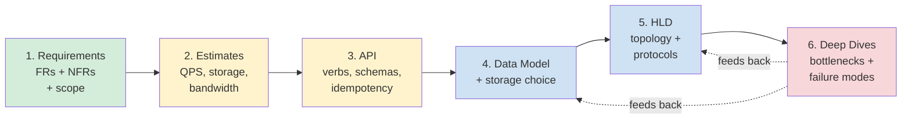
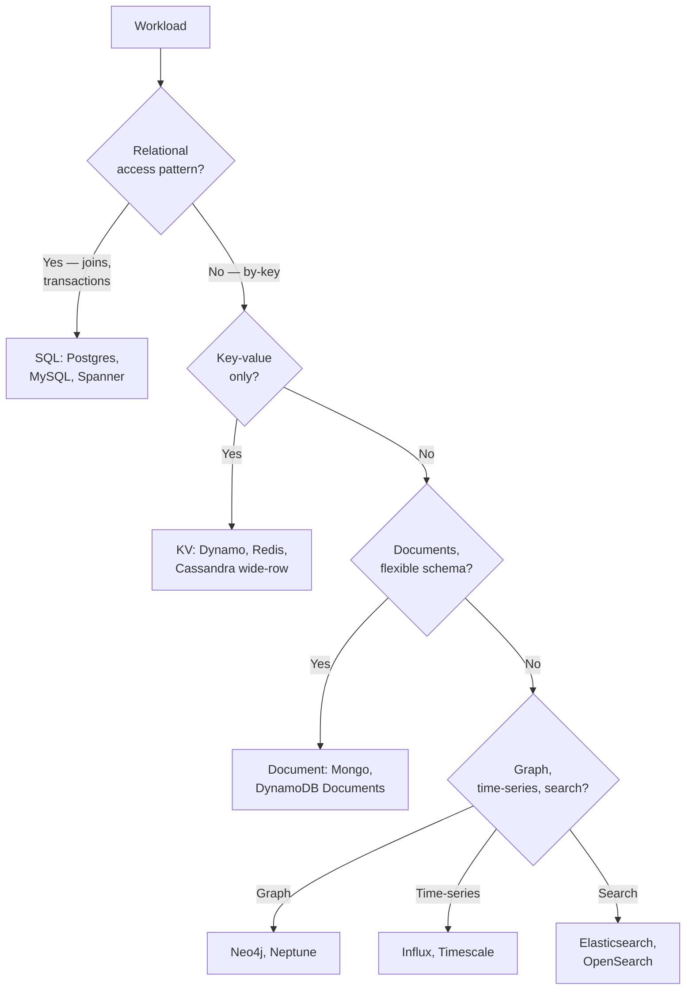
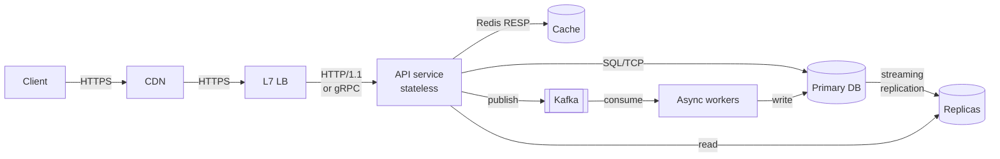
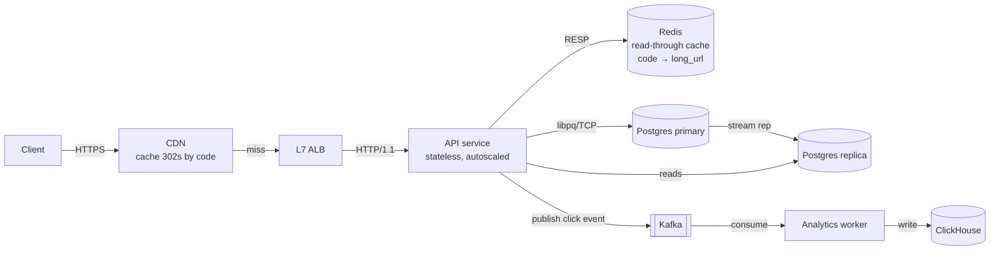

# The 6-Step System Design Framework — Requirements → Estimates → API → Data Model → HLD → Deep Dives

**Date:** 2026-04-26 | **Updated:** 2026-04-26
**Tags:** `system-design` `interview` `framework` `methodology`

## Table of Contents

- [Summary](#summary)
- [Why This Matters](#why-this-matters)
- [Overview — Why Six Steps and Not Five or Eight](#overview--why-six-steps-and-not-five-or-eight)
- [The Six Steps in Depth](#the-six-steps-in-depth)
  - [Step 1 — Requirements: Functional, Non-Functional, and Out-of-Scope](#step-1--requirements-functional-non-functional-and-out-of-scope)
  - [Step 2 — Back-of-Envelope Estimates](#step-2--back-of-envelope-estimates)
  - [Step 3 — API Design](#step-3--api-design)
  - [Step 4 — Data Model and Storage Choice](#step-4--data-model-and-storage-choice)
  - [Step 5 — High-Level Design](#step-5--high-level-design)
  - [Step 6 — Deep Dives](#step-6--deep-dives)
- [Time Allocation — 45-Minute vs 60-Minute Splits](#time-allocation--45-minute-vs-60-minute-splits)
- [Walkthrough Example — URL Shortener Through All Six Steps](#walkthrough-example--url-shortener-through-all-six-steps)
- [Trade-offs as a Continuous Thread](#trade-offs-as-a-continuous-thread)
- [Anti-Patterns That Tank the Signal](#anti-patterns-that-tank-the-signal)
- [What Interviewers Actually Evaluate](#what-interviewers-actually-evaluate)
- [Phrases That Earn Points in Each Step](#phrases-that-earn-points-in-each-step)
- [Related](#related)
- [References](#references)

## Summary

A system design interview is a 45–60 minute working session, not a quiz. The candidates who do well follow a discipline that goes **Requirements → Estimates → API → Data Model → High-Level Design → Deep Dives**, in that order, and visibly trade off at every step. Each phase produces an artifact the next phase depends on: requirements drive estimates; estimates drive the data store class; the API shape constrains the data model; the data model and traffic shape pick the topology; the topology exposes the bottlenecks the deep dives have to defend. The interviewer is reading for **structured thinking**, not memorized blueprints — your job is to make the reasoning visible, not to land on the "correct" architecture.

## Why This Matters

Two candidates can produce the same final whiteboard diagram and one gets a hire signal while the other gets a no-hire. The difference is almost never the boxes; it's the order they appeared, the questions asked before each box was drawn, and the trade-offs named when alternatives were rejected. The 6-step framework exists because:

- **Without a framework, time evaporates.** A typical first-time candidate spends 15 minutes redrawing boxes, 10 minutes on a deep dive into a non-bottleneck, and never confirms requirements. The interviewer has nothing to grade except the final picture.
- **The framework forces named decisions.** Each step demands a concrete artifact (a list of NFRs, a QPS number, a request schema, a table, a topology, a bottleneck defense). Anything missing is a visible gap in your reasoning — to you, not just to the interviewer.
- **It mirrors real design reviews.** Senior engineers do not start at HLD. They start with "what are we even building," "how big is it," "what does the call look like." Doing this in the interview is itself the signal.
- **It produces trade-off opportunities at every step.** A framework where every step has 2–3 viable alternatives gives you 12–18 places to verbalize a decision. That density of reasoning is what separates a hire from a strong-hire.

If you can run this loop tightly under time pressure, the actual architecture you land on becomes secondary — interviewers will follow you anywhere because the path is legible.

## Overview — Why Six Steps and Not Five or Eight

There are popular variants. Alex Xu's _System Design Interview_ uses a four-step ("Understand the problem → High-level design → Design deep dive → Wrap up"). Hello Interview uses five. Donne Martin's primer is open-ended. The six-step shape used here is a synthesis chosen because it isolates the two steps candidates most often skip: **Estimates** (skipped because it feels like math homework) and **API design** (skipped because candidates jump straight to boxes-and-arrows). Pulling them out as named, numbered steps forces them onto the whiteboard.



The dotted feedback arrows matter: deep dives often surface a constraint that invalidates a data-model choice or an HLD assumption. A confident candidate goes back and updates the earlier artifact rather than papering over the conflict. That visible revision is itself a positive signal.

## The Six Steps in Depth

### Step 1 — Requirements: Functional, Non-Functional, and Out-of-Scope

**Goal:** make the problem concrete enough that two engineers would build the same thing.

You produce three lists on the board:

| List | Contents | Example (URL shortener) |
|------|----------|--------------------------|
| **Functional Requirements (FRs)** | Verbs the system supports — what users can do | Create short URL from long URL; redirect short URL to long URL; (maybe) custom alias; (maybe) analytics |
| **Non-Functional Requirements (NFRs)** | Properties the system must have — what it costs to be wrong | 100ms p99 redirect; 99.99% availability; URLs never collide; reads dominate writes 100:1 |
| **Out of Scope** | Things you explicitly will not solve | User auth, billing, abuse detection, link expiration UI, SEO crawl protection |

The interviewer rarely volunteers all of these. You ask. Useful starter questions:

- "Who are the users — humans, services, or both?"
- "Read-heavy or write-heavy? Roughly what ratio?"
- "What's the latency target on the hot path?"
- "What's the availability target — three nines, four nines?"
- "Are we global or single-region day one?"
- "Anything we can defer — auth, abuse, billing?"

**Output:** a written list of 3–5 FRs, 4–6 NFRs, 2–4 out-of-scope items. **You do not move on until the interviewer agrees with the list.**

**Where candidates stumble:** treating NFRs as decoration. "Highly available, low latency, scalable" written without numbers is meaningless and earns zero credit. Concrete numbers (99.99%, 100ms p99, 1B URLs, 10k QPS reads) are what later steps depend on. Skip the numbers and Step 2 has nothing to compute against.

### Step 2 — Back-of-Envelope Estimates

**Goal:** turn the NFRs into numbers that constrain technology choices.

Three families of estimate matter:

1. **Traffic** — peak QPS for the dominant operations. Distinguish read QPS from write QPS; the ratio drives caching and replication strategy.
2. **Storage** — total bytes at year 1 and year 5; per-record size × record count × retention.
3. **Bandwidth** — egress for the hot path; cache hit ratio × payload size × QPS.

Use round numbers. The point is order-of-magnitude correctness, not precision. The classic powers of ten matter: 1 KB row × 1B rows = 1 TB; 10k QPS × 1 KB response = 10 MB/s = 80 Mbps; cross an order of magnitude and the answer changes (single node vs sharded, in-memory vs SSD, single region vs multi).

**Where candidates stumble:**

- **Skipping it entirely** because "I'm not good at mental math." This is the single most damaging skip — every later trade-off is now uncalibrated.
- **Computing in a vacuum** — producing a number without saying what it implies. "10k QPS" is a number; "10k QPS exceeds a single Postgres primary, so we need a cache layer or sharding" is a decision.
- **Confusing daily and per-second.** 100M DAU is not 100M QPS. Use a peak-over-average factor (typically 2–4×) when converting from daily to per-second.

See [Back-of-Envelope Estimation](../foundations/back-of-envelope-estimation.md) for the full numerical toolkit (Jeff Dean latency numbers, the powers-of-two table, the QPS-to-storage funnel).

**Output:** 4–6 numbers on the board, each with a one-line implication.

### Step 3 — API Design

**Goal:** specify the contract before designing the implementation.

Two reasons this comes before the data model:

1. **The API shape constrains the data model.** A `GET /shorturls/{code}` endpoint that must return in 50ms forbids a join-heavy schema; a `POST /shorturls` with idempotency keys forces a uniqueness column.
2. **The API exposes hidden requirements.** Writing the actual request/response schema makes you confront pagination, error codes, versioning, and idempotency — questions that quietly reshape the rest of the design.

A minimum viable API spec includes:

- **Verb + path** (REST) or **method name** (RPC/gRPC).
- **Request body / params** with types.
- **Response shape** with a 2xx and at least one named error.
- **Idempotency strategy** for non-GET endpoints.
- **Pagination model** for list endpoints.
- **Auth posture** (or a note that auth is out of scope).

You do not need to write a full OpenAPI spec — three to five endpoints with the above attributes is enough.

**Where candidates stumble:**

- **Hand-waving the API.** "We'll have a create endpoint and a redirect endpoint" without schemas. Now Step 4 is unconstrained.
- **REST-by-default reflex.** REST is fine, but a streaming feed wants WebSockets/SSE; a service-to-service hot path wants gRPC. Naming the protocol earns a point.
- **Forgetting idempotency.** A `POST` that creates a resource without an idempotency key turns retries into duplicates. Saying the word "idempotency key" once is a free signal.

### Step 4 — Data Model and Storage Choice

**Goal:** pick the storage class and lay out the schema.

The decision tree is shorter than candidates fear:



Then sketch the schema:

- **For SQL:** tables with PK, important columns, foreign keys, and indexes. Note which queries hit which index.
- **For KV:** the partition key, the sort key (if any), the value shape.
- **For document stores:** the embedded vs referenced choice for related data.

Always name the **primary access patterns** alongside the schema. "Lookup by short_code" → that's the partition key. "List my URLs ordered by created_at" → that's a secondary index. Schema without access patterns is decoration.

**Where candidates stumble:**

- **Defaulting to Postgres or DynamoDB without justification.** Either can be right; saying _why_ is the signal.
- **Drawing tables but no indexes.** Every query in the API spec must hit an index on the data model — otherwise you have an O(N) scan you haven't accounted for.
- **Conflating schema and storage.** A `users` table with a JSONB column is still in Postgres; a "schemaless" requirement does not automatically mean MongoDB.

See [CAP, PACELC, and Consistency Models](../foundations/cap-and-consistency-models.md) for picking the consistency knobs your storage exposes.

### Step 5 — High-Level Design

**Goal:** the topology — the boxes and the arrows between them, with **named protocols and named components**.

A useful HLD has these zones:

- **Edge:** DNS, CDN, load balancer, TLS termination.
- **API tier:** stateless app servers behind the LB.
- **Caching tier:** Redis/Memcached, with explicit cache strategy (read-through, write-through, cache-aside).
- **Data tier:** primary DB, replicas, search index, object store.
- **Async tier:** queues (SQS, Kafka), workers, schedulers.
- **Cross-cutting:** auth, observability (metrics, logs, traces), rate limiting.



**The two non-negotiables:**

1. **Name every protocol** — HTTPS, gRPC, RESP, JDBC, AMQP, Kafka protocol. "An arrow" without a protocol is a missed point.
2. **Name every component category** — "load balancer" is fine; "ALB / Envoy / NGINX" is better; "load balancer (L7, with health checks and TLS termination)" is best.

**Where candidates stumble:**

- **Boxes without protocols.** Drawing arrows but never saying "this is gRPC" or "this is async via Kafka."
- **Centralized monolith disguised as microservices.** Six boxes that all share one Postgres are not really six services. Either commit to the monolith (fine) or split the data layer.
- **Premature microservices.** A URL shortener has one bounded context; splitting it into "writer-service" and "reader-service" is overengineering unless the QPS asymmetry justifies it.
- **No async path when the workload demands it.** Analytics, notifications, search indexing, audit logs — all should be off the synchronous request path.

### Step 6 — Deep Dives

**Goal:** defend the design under stress. Pick 2–3 bottlenecks the interviewer cares about and show how they don't break.

A deep dive is a contract: you pick a component, name its **failure modes**, and show the **mitigation**. Common deep dives:

- **Hot key / celebrity problem.** One short URL is 90% of traffic. Defense: per-key cache TTL, request coalescing, optionally a read-replica or edge cache.
- **Database scaling.** Single primary saturates writes. Defense: vertical scale → read replicas → sharding by key, with the resharding story sketched.
- **Cache failure.** Cache cluster down or cold. Defense: thundering herd protection (request coalescing / single-flight), graceful degradation to DB with a circuit breaker.
- **Cross-region failover.** Region-level outage. Defense: multi-region active-passive, DNS failover, RPO/RTO numbers.
- **Idempotency under retry storms.** Defense: idempotency keys with a TTL'd dedup table.
- **Race conditions on uniqueness** (custom alias, username, slug). Defense: unique index + conditional insert; or distributed lock; or a counter service.

The shape of a good deep dive is always the same:

1. **State the failure mode** ("the leader DB will saturate at ~5k writes/sec").
2. **State the symptom** ("p99 spikes, then errors at the API tier").
3. **Propose a mitigation** ("shard by short_code hash, 8 shards, with a re-sharding plan").
4. **Name the trade-off** ("we lose cross-shard transactions; we gain horizontal write throughput").

**Where candidates stumble:**

- **Deep-diving the wrong thing.** Spending 10 minutes on JWT structure when the actual bottleneck is the redirect cache. Read the interviewer — they will steer you.
- **Fixing without naming a failure mode first.** "We'll add a cache" is not a deep dive; "the DB saturates at X QPS, so we add a read-through cache with 95% hit rate, reducing DB load to Y" is.
- **Ignoring the trade-off.** Every fix has a cost. Sharding loses joins. Replication loses consistency. Caching loses freshness. Naming the cost is the signal.

## Time Allocation — 45-Minute vs 60-Minute Splits

Time discipline is what makes the framework work under pressure. Two reference splits:

| Step | 45-min interview | 60-min interview | Notes |
|------|------------------|------------------|-------|
| 1. Requirements | 5 min | 6–8 min | Hard cap; if you can't get FRs/NFRs in 8 min, ask the interviewer to nudge |
| 2. Estimates | 3–5 min | 5–7 min | Numbers + implication, not a math show |
| 3. API | 4–5 min | 5–7 min | Three endpoints with schemas is enough |
| 4. Data Model | 4–5 min | 5–7 min | Schema + indexes + access patterns |
| 5. HLD | 8–10 min | 10–12 min | Boxes, arrows, protocols, named components |
| 6. Deep Dives | 15–18 min | 20–25 min | The longest phase by design — this is where signal density peaks |
| Buffer / wrap | 2–3 min | 3–5 min | Summarize, list what you skipped |

**The 80/20 rule of timing:** if Steps 1–4 take more than 50% of the interview, you will not have time for the deep dives, which are the highest-signal phase. Practice running through Steps 1–4 in 20 minutes flat so that 60-minute interviews get 25 minutes of deep dive and 45-minute interviews get 18.

**Bail-out heuristic:** if at the 30-minute mark of a 45-minute interview you are still on Step 4, tell the interviewer "I want to make sure we get to deep dives — let me sketch the HLD quickly and pick the top two failure modes." Naming the time pressure is itself a positive signal.

## Walkthrough Example — URL Shortener Through All Six Steps

Concrete run-through, the way it would actually appear on a whiteboard. See [Design URL Shortener](../case-studies/basic/design-url-shortener.md) for the case study with full diagrams.

**Minute 0–5 — Requirements**

FRs:
- Create short URL from long URL.
- Redirect short URL to long URL.
- (Stretch) custom alias.

NFRs:
- 100M new URLs/year, 10:1 read:write ratio at peak, so ~3 short URLs/sec write average, ~10× peak = ~30 wps; redirects ~300 rps average, ~3000 rps peak.
- 100ms p99 redirect.
- 99.99% availability for redirects (writes can be 99.9%).
- URLs never collide; never reused.

Out of scope: auth, billing, abuse detection, expiry UI.

**Minute 5–10 — Estimates**

- Storage: 100M URLs × 500 bytes/row × 5 years = ~250 GB. Single Postgres handles it.
- Read QPS peak: ~3000 rps. Single Postgres can do this if the path is a PK lookup, but cache is cheaper at p99.
- Write QPS peak: ~30 wps. Trivial.
- Bandwidth: 3000 rps × 1 KB redirect response = ~3 MB/s = 24 Mbps. CDN-cacheable.

Implication: a single Postgres + Redis + a thin API tier is enough. No sharding day one.

**Minute 10–15 — API**

```
POST /shorturls
  body: { long_url: string, custom_alias?: string }
  headers: Idempotency-Key: <uuid>
  201: { short_code: string, short_url: string }
  409: { error: "alias taken" }

GET /{short_code}
  302 → long_url
  404: not found
```

Idempotency key is required; same key + same body = same response, different body = 422.

**Minute 15–20 — Data Model**

Single table:

```
shorturls
  short_code   varchar(8) PRIMARY KEY     -- base62 of a counter or hash
  long_url     text NOT NULL
  created_at   timestamptz NOT NULL DEFAULT now()
  created_by   uuid NULL                  -- nullable, auth out of scope
  idempotency_key uuid NULL UNIQUE
```

Access patterns:
- `GET by short_code` → PK lookup, O(1).
- `INSERT with conditional uniqueness` → unique index on `short_code`, unique index on `idempotency_key`.

Storage: Postgres. Justification: relational integrity for the uniqueness constraint, cheap at this scale.

**Minute 20–30 — HLD**



Protocols named, components named, async analytics path off the hot read.

**Minute 30–45 — Deep Dives**

_Deep dive 1: short-code generation race._
- Failure mode: two writers pick the same code.
- Mitigation: a counter service (Redis `INCR` or a Postgres sequence), encoded base62. Or random 8-char with `INSERT ... ON CONFLICT DO NOTHING` and retry on conflict. Trade-off: counter is dense and predictable (enumeration risk); random is sparse and harder to enumerate but needs collision retries.

_Deep dive 2: hot-key redirect._
- Failure mode: viral URL gets 50k rps, redis hot-shards.
- Mitigation: CDN caches the 302 by short_code with a short TTL (60s); request coalescing in the API for cache misses; per-shortcode in-process LRU on the API tier as a final layer. Trade-off: stale redirects for up to TTL — acceptable because long_url is immutable in our model.

_Deep dive 3: cross-region availability._
- Failure mode: primary region down.
- Mitigation: read-only failover region with async replica; writes pause during regional failure (we said 99.99% on reads, only 99.9% on writes). RPO ~seconds, RTO ~minutes via DNS failover.

**Minute 45–48 — Wrap**

"In scope I covered: write path with idempotency, read path with caching, async analytics, three failure modes. Out of scope I'd flag for follow-up: abuse detection, custom domains, expiry, link analytics dashboards, GDPR deletion."

## Trade-offs as a Continuous Thread

Trade-offs are not a phase. They are something you say out loud at every step.

| Step | Trade-off you should name |
|------|---------------------------|
| 1. Requirements | "Strong consistency on write vs availability on read — I'll prioritize availability on read because redirects are 99.99% but creates can be 99.9%." |
| 2. Estimates | "If reads grow to 100k QPS, single Postgres is out and we add a read-replica fan-out — but we don't need that day one." |
| 3. API | "REST keeps it cacheable and simple; gRPC would cut serialization cost but loses CDN cacheability for redirects." |
| 4. Data Model | "Postgres for uniqueness guarantees; DynamoDB would scale flatter but conditional writes are noisier than `UNIQUE`." |
| 5. HLD | "Cache-aside vs read-through: I'm picking read-through to centralize the staleness story." |
| 6. Deep Dives | "Sharding loses cross-shard transactions, but at this scale we don't have any. Cost accepted." |

The pattern: **(option A) vs (option B); chose A because (constraint from earlier step); cost accepted is (specific limitation).** That sentence template, repeated 8–10 times across the interview, is the bulk of the signal.

See [Trade-off Articulation and Bottlenecks](./tradeoff-articulation-and-bottlenecks.md) for the deeper drill on _how_ to verbalize a trade-off without sounding like you're hedging.

## Anti-Patterns That Tank the Signal

Patterns that cost you the interview, in rough order of frequency:

- **Skipping requirements** — drawing boxes before confirming what's being built. The interviewer cannot grade a design that is solving a different problem.
- **Skipping NFRs specifically** — collecting FRs but no numbers, no SLOs, no scale targets. Step 2 is now ungrounded.
- **Jumping to HLD before estimates** — drawing an architecture before knowing whether the workload fits one node or needs 100. The architecture is unjustified.
- **Boxes without protocols** — drawing 12 components connected by anonymous arrows. "What protocol is that?" is a question you should never need to be asked.
- **Naming Kafka without saying why** — invoking a brand instead of a property. Kafka because you need partitioned, durable, replayable log semantics is a reason; "we'll use Kafka" is not.
- **Premature deep-diving** — going 10 minutes into a single component before sketching the rest of the system. Now there is no system; there is a deep dive into a vacuum.
- **Solving the wrong scale** — a Twitter-fanout solution for a problem that's 100 QPS, or vice versa. Estimates exist to prevent this; skipping Step 2 causes it.
- **Refusing to commit** — saying "we could do A, or B, or C" without picking one. Pick one, name the cost, and move. You can revisit.
- **Drawing six microservices for a one-bounded-context problem** — splitting reads and writes into separate services for a workload that has a 10:1 read ratio but otherwise no domain split. Premature.
- **Ignoring failure modes entirely** — a happy-path design with no answer to "what happens when Redis falls over." Reliability is half of a senior signal.
- **Memorizing the answer** — pattern-matching to a textbook design instead of deriving from this problem's constraints. Interviewers can hear the difference; the give-aways are skipping Step 1 ("yeah, it's the standard setup") and refusing to update the design when an estimate contradicts it.

See [Common Anti-Patterns](./common-anti-patterns.md) for the full taxonomy with examples of each.

## What Interviewers Actually Evaluate

The grading rubric most large-company loops use, paraphrased:

| Signal | What it looks like | What it doesn't look like |
|--------|--------------------|----------------------------|
| **Structured thinking** | Visible framework, named steps, ordered decisions | "Let me just start drawing and see where this goes" |
| **Requirements rigor** | Asks for numbers; gets agreement on FRs/NFRs before sketching | Builds Twitter when the interviewer asked for a paste-bin |
| **Calibrated estimates** | Order-of-magnitude correct; named implications | Skipped, or computed without using the result |
| **Trade-off articulation** | 8–10 named trade-offs, each with a chosen side and a cost | "It depends" or "we could do either" without commitment |
| **Failure-mode reasoning** | Names what breaks, picks defenses, names the cost of each | Happy-path design with no degradation story |
| **Communication** | Drives the conversation; surfaces uncertainty; asks for nudges | Goes silent; answers only when prompted |
| **Adaptability** | Updates the design when a deep dive contradicts an earlier choice | Defends the original sketch even when it's been falsified |

**What interviewers do _not_ care about** (as much as candidates fear):

- Whether you picked the "right" database. Either Postgres or DynamoDB can be correct for almost any case study; the signal is the reasoning.
- Whether you've memorized a specific paper or system. Mentioning Spanner once is fine; quoting the OSDI 2012 paper at length is bait you don't need to take.
- Drawing pretty diagrams. Boxes and arrows are fine — clarity beats aesthetics.
- Writing more than 3–5 endpoints. The API step is about shape, not exhaustiveness.

The condensed rubric: **did this candidate make their reasoning visible at every step, name a trade-off at every choice, and react to new information?** If yes, the architecture is almost incidental.

## Phrases That Earn Points in Each Step

Concrete language that signals seniority:

- **Step 1:** "Before I sketch anything, can I confirm — what's the read:write ratio? And what's the latency target on the hot path?"
- **Step 2:** "100M URLs at 500 bytes is 50 GB at year 1, 250 GB at year 5 — that fits in a single Postgres primary, so I won't shard up front, but I'll note where the line is."
- **Step 3:** "POST is non-idempotent by default, so I'll require an `Idempotency-Key` header and store it for 24 hours — same key + same body returns the cached response, different body returns 422."
- **Step 4:** "The dominant access pattern is lookup by short_code, so that's my partition key. Listing by user is rare and out of scope, so I won't index for it."
- **Step 5:** "The CDN caches 302s by short_code with a 60-second TTL — that absorbs viral spikes. Behind it, an L7 ALB hits a stateless API tier; the API talks Redis (RESP) for reads and Postgres (libpq) for writes."
- **Step 6:** "The failure mode I'm most worried about is the hot-key redirect — one viral URL becoming 90% of traffic. The mitigation is a three-layer cache: CDN, Redis, in-process LRU. The cost is up to 60 seconds of staleness, which is acceptable because long_url is immutable."

## Related

- [Trade-off Articulation and Bottlenecks](./tradeoff-articulation-and-bottlenecks.md) — how to verbalize the (option A) vs (option B); chose A because... pattern at speed.
- [Common Anti-Patterns](./common-anti-patterns.md) — the full taxonomy of mistakes that cost the interview.
- [Back-of-Envelope Estimation](../foundations/back-of-envelope-estimation.md) — the numerical toolkit that makes Step 2 work.
- [Design URL Shortener](../case-studies/basic/design-url-shortener.md) — the full case study used in the walkthrough above.
- [CAP, PACELC, and Consistency Models](../foundations/cap-and-consistency-models.md) — the consistency vocabulary you'll need for Step 4 and Step 6 trade-offs.

## References

- Alex Xu, _System Design Interview — An Insider's Guide_, Volume 1 (2020) — the canonical four-step structure that this six-step framework expands.
- Alex Xu, _System Design Interview_, Volume 2 (2022) — case studies that exercise the framework on harder problems (proximity service, Google Drive, S3).
- Donne Martin, [system-design-primer](https://github.com/donnemartin/system-design-primer) — the open-source bible; the "How to approach a system design interview question" section maps directly to Steps 1–6.
- ByteByteGo blog (Alex Xu and team), [bytebytego.com/blog](https://bytebytego.com/blog) — short, illustrated breakdowns of individual components that fill in HLD details.
- Hello Interview, [hellointerview.com/learn/system-design](https://www.hellointerview.com/learn/system-design) — explicit framework guidance and graded mock examples; close cousin of the structure here.
- Pramp / Exponent system design tracks — peer-mock platforms that surface where candidates stall (typically Steps 1, 2, and 6).
- Gaurav Sen, [System Design YouTube playlist](https://www.youtube.com/c/GauravSensei) — narrated walkthroughs of common case studies; useful to internalize the verbal cadence of trade-off articulation.
- Martin Kleppmann, _Designing Data-Intensive Applications_ — not interview-specific, but every Step 4 and Step 6 trade-off ultimately traces back to a chapter here.
