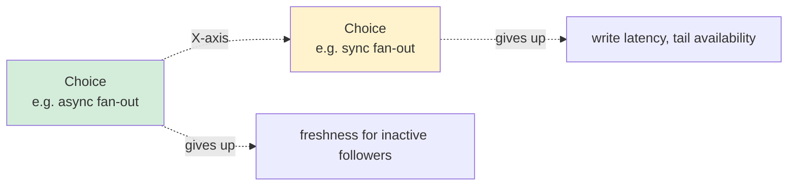
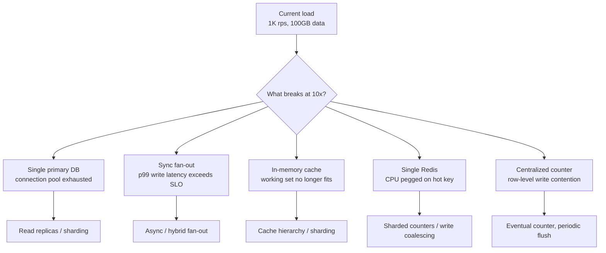
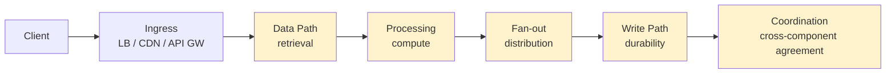
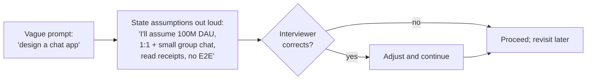
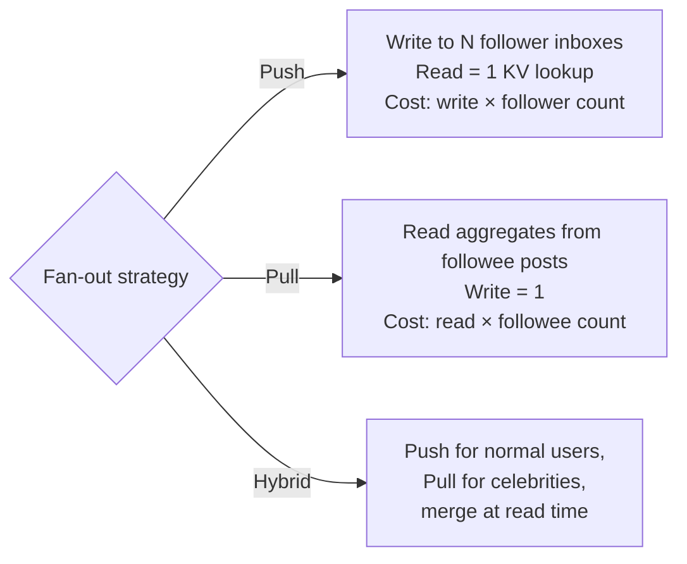

# Trade-off Articulation and Bottleneck Analysis

**Date:** 2026-04-26 | **Updated:** 2026-04-26
**Tags:** `system-design` `interview` `trade-offs` `bottlenecks`

## Table of Contents

- [Summary](#summary)
- [Why This Matters](#why-this-matters)
- [The X-Axis of Every Trade-off](#the-x-axis-of-every-trade-off)
- [The "What Breaks at 10x?" Drill](#the-what-breaks-at-10x-drill)
- [Bottleneck Taxonomy — A Systematic Walk](#bottleneck-taxonomy--a-systematic-walk)
  - [1. Data Path](#1-data-path)
  - [2. Processing](#2-processing)
  - [3. Fan-out](#3-fan-out)
  - [4. Write Path](#4-write-path)
  - [5. Coordination](#5-coordination)
- [Trade-off Vocabulary You Must Own](#trade-off-vocabulary-you-must-own)
- [Reasoning Under Uncertainty — Stating Assumptions](#reasoning-under-uncertainty--stating-assumptions)
- [When to Revisit a Decision Later in the Interview](#when-to-revisit-a-decision-later-in-the-interview)
- [Articulation Templates](#articulation-templates)
- [Worked Examples](#worked-examples)
  - [URL Shortener](#url-shortener)
  - [News Feed](#news-feed)
  - [Payment Processing](#payment-processing)
- [Anti-Patterns](#anti-patterns)
- [Related](#related)
- [References](#references)

## Summary

The single highest-value signal in a system-design interview is **explicit trade-off articulation**: naming both sides of the X-axis, stating which side you chose, and saying what you accept as a cost. "It depends" without naming the axis is a failure mode — it sounds humble but reads as "I don't know what the variables are." The second-highest signal is **systematic bottleneck analysis**: walking the request path (ingress → data → processing → fan-out → write → coordination) and asking "what breaks at 10x?" at each layer. This doc gives you the vocabulary, the templates, and three worked examples (URL shortener, news feed, payments) for how to reason out loud in a way that demonstrates senior judgment.

## Why This Matters

The interviewer is not testing whether you know the right answer. There is no right answer to "design Twitter." They are testing whether you can:

1. **Identify the axis** a decision lives on (consistency vs availability, latency vs throughput, cost vs durability, complexity vs flexibility, push vs pull, cache vs storage).
2. **Pick a side** and say so out loud, with a reason tied to a stated requirement.
3. **Name the cost** of that pick — what you give up, who notices, and when.
4. **Spot where it breaks** when load grows 10x, 100x, or geography changes.
5. **Revisit** the decision when later constraints invalidate it, instead of defending it for ego.

A candidate who whiteboards a beautiful architecture and never says "we chose X over Y because Z, accepting W" looks like someone who memorized a reference design. A candidate who says "we're going to start with synchronous fan-out for write simplicity, but I want to flag that this caps us at ~5K followers — we'll revisit when we talk about celebrity accounts" looks like someone who has shipped real systems. The latter wins the loop.

## The X-Axis of Every Trade-off

Every architectural decision sits on an axis with two named ends. **You don't have a trade-off until you can name the axis.** Saying "it depends" without naming the X-axis is failure — it tells the interviewer the variables are invisible to you.

The minimum articulation is three sentences:

1. "The axis here is **A vs B**."
2. "I'm choosing **A** because **<requirement>**."
3. "This costs us **<the B-side property>**, which is acceptable because **<context>**."

Common axes the interviewer expects you to recognize on sight:

| Axis | A end | B end | Lives in |
|------|-------|-------|----------|
| CAP under partition | Consistency | Availability | Distributed databases |
| PACELC normal ops | Consistency | Latency | Replicated reads |
| Latency vs throughput | Per-request fast | Aggregate throughput | Batch/stream pipelines |
| Cost vs durability | Cheap | Multi-region replicated | Storage tiers |
| Complexity vs flexibility | Simple/rigid | Configurable/flexible | API design, schemas |
| Push vs pull | Server pushes (write fan-out) | Client pulls (read fan-out) | Feeds, notifications |
| Cache vs source-of-truth | Fast/stale | Slow/correct | Read paths |
| Sync vs async | Immediate result | Decoupled, retry-able | Workflows |
| Strong vs weak typing | Compile-time safety | Runtime flexibility | Schemas, API contracts |
| Build vs buy | Owned IP, ops cost | Vendor lock-in, lower TCO | Component selection |
| Normalize vs denormalize | Write-optimal, join-heavy | Read-optimal, redundant | Schema design |
| Centralize vs federate | Single source of truth | Local autonomy | Identity, config, data |

If you cannot place a decision on one of these axes, you are not making an engineering trade-off — you are making a preference.

## The "What Breaks at 10x?" Drill

The cheapest, most powerful tool for finding bottlenecks is to take your current sketch and ask: **"What is the first thing that breaks if every number on this whiteboard multiplies by 10?"**

Run the drill systematically. Walk top-to-bottom of the diagram and at each component say:

- **Throughput**: at 10x rps, does this still fit in one box's CPU/IOPS/network budget?
- **Storage**: at 10x data, does the working set still fit in RAM/SSD/the largest available instance?
- **Fan-out**: at 10x followers/subscribers/replicas, does any single producer drown?
- **Tail latency**: at 10x concurrency, where do queues form? p99 is where systems die first.
- **Coordination**: at 10x participants, does any Paxos/Raft/2PC quorum become impractical?
- **Operational**: at 10x deploys/operators/regions, who can reason about this?

You don't have to fix every 10x problem on the spot. You score points just by **flagging** them: "At 10x, our single-region Redis becomes the bottleneck — I'd address this with consistent hashing and a sharded cluster, but I want to keep the v1 simple." This signals you see the cliff without driving off it.

The 100x drill is for staff/principal levels: it usually surfaces architectural problems (single global counter, monolithic schema, single write region) that no amount of vertical scaling fixes.

## Bottleneck Taxonomy — A Systematic Walk

Don't search for bottlenecks randomly. Walk the request lifecycle in order, the same way every time. Each layer has its own failure modes.

### 1. Data Path

How requests retrieve data. Bottlenecks here usually look like **read amplification** or **cache misses**.

- **Hot keys**: one celebrity, one trending product, one viral object swamping a single shard. Mitigations: replicate hot keys across shards, client-side per-key fan-out, request collapsing, cache the hot tail explicitly.
- **N+1 queries**: a list endpoint that issues one DB call per item. Mitigations: batching, JOIN, dataloader pattern.
- **Working set vs RAM**: when the actively-read corpus exceeds memory, latency cliffs from microseconds to milliseconds (RAM → SSD) or milliseconds to hundreds (SSD → cross-region). Mitigations: cache hierarchy, partition cold data to colder tiers.
- **Cross-region reads**: 60–200ms RTT will dominate any read budget. Mitigations: regional replicas, edge caches.
- **Connection pool exhaustion**: sneaky and common — your DB has 200 connections, you have 50 app pods × 20 connections = 1000 demanded. Mitigations: pgBouncer / RDS Proxy / pooling layer, lower per-pod pool size.

### 2. Processing

The CPU/memory/IO work between getting data and producing a response.

- **CPU-bound encoding/serialization**: JSON serialization can be 30–50% of latency on hot paths. Mitigations: protobuf/avro, response shape pruning, edge caching the encoded form.
- **Synchronous external calls**: one slow downstream call sets your p99. Mitigations: hedged requests, timeouts shorter than upstream's SLO, circuit breakers, async + cached fallbacks.
- **GC pauses / event-loop blocks**: large heaps and long-running tasks block all in-flight requests on the same instance. Mitigations: smaller instances at higher count, off-heap storage, work-stealing schedulers.
- **Algorithmic blow-ups**: O(n²) on a list that grows 10x grows 100x. Mitigations: bounded inputs, pre-computation, server-side pagination.

### 3. Fan-out

Anywhere one event must be delivered to many destinations: feeds, notifications, replicas, cache invalidations, search index updates.

- **Celebrity problem**: one user with 100M followers triggers 100M writes. Mitigations: hybrid push/pull (push to active followers, pull for celebrities), bounded delivery queues, eventual delivery with retry.
- **Thundering herd on cache miss**: a hot key's TTL expires and 10K requests stampede the origin simultaneously. Mitigations: stale-while-revalidate, single-flight locks, jittered TTLs, cache warmup.
- **Broadcast amplification**: a cluster of 100 nodes that gossips state — each event becomes 100 messages. Mitigations: hierarchical gossip, leader-based broadcast, consistent hashing instead of full replication.
- **Webhook fan-out**: one event delivered to N customer webhooks; one slow customer slows the whole queue. Mitigations: per-customer queues, dead-letter queues, isolation by tenant.

### 4. Write Path

Where state mutates. The write path is usually the global throughput ceiling.

- **Single primary write throughput**: one Postgres primary tops out around 10–50K writes/s before WAL flush, replication lag, or vacuum thrash. Mitigations: shard, aggregate writes, push high-volume writes to a different store.
- **Hot row / hot partition**: every write goes to one row (counter, leaderboard top entry) or one Kafka partition. Mitigations: sharded counters with periodic aggregation, key-shaping (random suffix), consistent hashing with virtual nodes.
- **Index write amplification**: each write must update N indexes, so write cost = base × index count. Mitigations: drop unused indexes, use covering indexes selectively, accept lag in async secondary indexes.
- **Sync replication wait**: every commit waits for a quorum across regions. Mitigations: async replication, regional write rings, accept windowed loss for non-critical writes.
- **Write-ahead log size / vacuum**: silent killer. Long-running transactions block vacuum, table bloats, IO climbs. Mitigations: aggressive timeouts on app-side transactions, monitor bloat, separate OLTP from analytics.

### 5. Coordination

Anywhere multiple components must agree: leader election, distributed locks, transactions, schema migrations, rolling deploys.

- **Quorum size**: 5-node Raft tolerates 2 failures but every commit waits for 3 acks. Mitigations: keep quorums small (3 or 5), use witness nodes, don't put quorum members across slow links.
- **2PC across services**: any participant down blocks all others. Mitigations: sagas, transactional outbox, idempotency keys, compensation.
- **Cross-region consensus**: Spanner-style requires TrueTime + commit wait. Mitigations: regional partitioning of data, eventual cross-region.
- **Schema/config rollout**: changing a schema across 1000 nodes atomically is impossible. Mitigations: backward-compatible changes, expand-then-contract migrations, feature flags.
- **Lock-step versioning**: client and server must deploy together. Mitigations: API versioning, additive-only changes, decouple deploy cadence.

For each component on your whiteboard, ask which of these five layers it sits in and which failure modes apply. This is faster and more thorough than ad-hoc poking.

## Trade-off Vocabulary You Must Own

A senior signal is using these phrases as if they were native. Memorize them.

- **Consistency vs availability** — "Under partition we choose AP for the timeline cache; the source-of-truth ledger stays CP."
- **Latency vs throughput** — "Batching 10ms of writes into one fsync improves throughput 10x but adds 5ms of p50 write latency."
- **Cost vs durability** — "11 nines on S3 Standard costs ~$0.023/GB; one-zone IA is ~$0.018 with 9 nines and a region-failure exposure."
- **Complexity vs flexibility** — "A schema-on-write Postgres table is rigid but lets every consumer trust the contract; schema-on-read in S3 + Athena is flexible but pushes validation to every consumer."
- **Push vs pull** — "Push fan-out is fast for readers but expensive for celebrity writers; pull is the opposite. We hybridize."
- **Sync vs async** — "Sync gives the user a definitive answer at the cost of coupling availability; async gives the system independence at the cost of needing reconciliation UX."
- **Read-optimal vs write-optimal** — "Denormalizing the post + author into the feed entry trades 3x storage for one round-trip reads."
- **Strong vs eventual consistency** — "Inventory needs linearizable decrement; the public 'in-stock' badge can be eventual."
- **Coupled vs decoupled deploy** — "Sharing the protobuf schema couples client/server deploys; emitting JSON via a versioned envelope decouples them at the cost of validation cost."
- **Build vs buy** — "Self-hosting Kafka costs us 2 SREs; MSK costs the SRE budget plus 30% premium and locks us to AWS."
- **Generality vs simplicity** — "A configurable rules engine handles every case at the cost of nobody being able to debug it on Friday at 2 a.m."
- **Tail latency vs mean** — "Median is fine; the p99.9 doubles under retry storms because the request fan-out is 50."
- **Hot vs cold path** — "The hot path is the 1% of requests that drive 80% of load — it must be cached, sharded, and observable."

When you reach for one of these phrases naturally during a design, you sound like an engineer. When you describe the same idea in vague words, you sound like a textbook reader.

## Reasoning Under Uncertainty — Stating Assumptions

Most interview prompts are deliberately under-specified. The mistake is to either freeze ("I need more requirements") or dive in silently. The professional move is to **state assumptions explicitly, mark them as assumptions, and proceed**. Then revisit if the interviewer corrects you.

Templates for assumption-naming:

- "I'm going to assume **<scale>** for the back-of-envelope; tell me if it's actually 10x larger."
- "I'll assume **<feature scope>** is in scope for v1 — group chat yes, encryption no — please correct me."
- "I'm assuming the read:write ratio is roughly 100:1 like most consumer products; if this is more write-heavy I'll revisit."
- "I'll assume **<failure tolerance>**: single-region, multi-AZ. If we need cross-region active-active that changes my data layer."
- "I'm picking **eventual consistency** for the feed because users tolerate ~1s lag; I'd revisit for a payments timeline."

The interviewer's job is to challenge your assumptions, not to feed you answers. Stating them invites that challenge. Hiding them looks like overconfidence and hides exactly the reasoning the interviewer wants to see.

## When to Revisit a Decision Later in the Interview

Senior signal: **proactively revisit** earlier decisions when later constraints invalidate them. Junior signal: defending an earlier decision because changing it feels like admitting error.

Common triggers to revisit:

| Trigger | Decision to revisit |
|---------|---------------------|
| Interviewer drops "and we have celebrities with 100M followers" | Sync fan-out → hybrid push/pull |
| "And the team also serves Asia and Europe" | Single-region → multi-region; sync writes → async or regional partitioning |
| "And we need to handle financial settlements" | Eventual → strong consistency on the ledger |
| "And we want sub-100ms p99 reads" | Cross-AZ DB reads → cache layer or read replicas |
| "And we're a 5-person team" | Microservices → monolith or modular monolith |
| "And our compliance requires immutability + audit" | Mutable rows → append-only event log + projections |
| Bottleneck drill surfaces a 10x problem | Whatever you sketched is no longer adequate |
| You realize an assumption was wrong | The decision built on that assumption |

Phrases that signal mature revisiting:

- "Earlier I chose **X** assuming **Y**. Now that we know **Z**, I want to revisit that — I'd actually reach for **X'** because…"
- "I want to mark this as a v1-only choice. At ~10x scale we'd need to redo it; I'd plan for that migration by…"
- "Two boxes ago I waved at consistency. Coming back: this specific table needs linearizable single-row writes; this other table can be eventual."

Revisiting is not weakness; it is the loop the actual job runs in. Demonstrating it on the whiteboard is the strongest possible signal that you have shipped systems that survived contact with reality.

## Articulation Templates

Memorize these and adapt the slots. They make the trade-off explicit, which is the entire signal.

**The core template:**

> "We chose **X** because **Y**, accepting **Z**. We'd revisit if **W**."

**Examples in the wild:**

- "We chose **async write fan-out** because **timeline reads must stay <50ms p99**, accepting **eventual delivery for inactive followers (~minutes lag)**. We'd revisit if **delivery SLA tightens or message volume drops below the queue overhead**."
- "We chose **a single Postgres primary** because **the team is small and write volume is ~5K/s**, accepting **a hard cap around 50K/s and single-region failure exposure**. We'd revisit at **80% of write throughput or when we add a second region**."
- "We chose **last-writer-wins** on **user profile fields** because **conflicts are rare and the user can re-edit**, accepting **silent loss of one conflicting write**. We'd revisit for **fields where loss is unacceptable** (e.g., balance — that goes on a CRDT or a CP store)."
- "We chose **read-from-replica with a causal token** because **we need read-your-writes within a session but not global linearizability**, accepting **~10ms of token-wait on writes**. We'd revisit if **cross-session ordering becomes a requirement**."

**Bottleneck call-out template:**

> "The bottleneck I see at **<scale point>** is **<component>** — specifically **<the failure mode>**. The mitigation is **<approach>**. I'd defer it to **v2** because **<v1 reasoning>**."

**Uncertainty template:**

> "I'm not sure whether **A** or **B** is right here without knowing **<the missing requirement>**. If it's **<case 1>** I'd pick **A** because…; if it's **<case 2>** I'd pick **B** because… What's your sense?"

The third template is the legitimate use of "it depends" — by naming both sides of the dependency.

## Worked Examples

Three canonical interview prompts run through the framework. The point is the **shape of the reasoning**, not the specific answers.

### URL Shortener

**Functional:** create short URL → long URL mapping; redirect on GET.
**Non-functional (assumed, stated out loud):** 100M URLs created/year, 10B redirects/year (~317/s avg, ~5K/s peak), <50ms p99 redirect latency, 99.95% availability.

**Trade-offs to articulate:**

| Decision | X-axis | Choice | Cost | Revisit if |
|----------|--------|--------|------|-----------|
| ID generation | Centralized counter vs distributed | **Distributed** (base62 of random 64-bit + collision check) | Tiny collision probability, requires uniqueness check on write | Need predictable / sequential IDs |
| Storage | SQL vs KV | **KV (DynamoDB / Cassandra)** — workload is point reads on a key | Lose ad-hoc query power | Need analytics / search on URLs |
| Consistency | Strong vs eventual on read | **Eventual** — a redirect that 404s for 1s after creation is acceptable | Brief read-your-writes gap | Required for paid SLA tiers |
| Cache | None vs CDN vs in-app | **CDN edge cache** with TTL — redirects are heavily skewed (Zipf) | Stale entries possible if URL is deleted/rotated | Need per-redirect analytics |
| Analytics | Sync counter vs async log | **Async event log → batch aggregator** | Counts are minutes-stale | Need real-time abuse detection |

**10x drill:** at 50K rps redirect peak, the single bottleneck is the cache. CDN handles it. At 100x (500K rps), origin DB becomes the bottleneck on cache misses for cold-tail URLs — solved by sharding by short-code prefix. Cold-tail working set may exceed RAM at 100x — accept the SSD latency floor or add a second cache tier.

**Articulation example:** "I'm choosing eventual consistency for the redirect lookup because users tolerate a one-second creation gap, which lets me cache aggressively at the edge — but I want to flag that for the abuse-takedown path I want a fast cache invalidation channel, otherwise we have to wait for TTL to expire when blocking a malicious URL."

### News Feed

**Functional:** users follow others; timeline shows posts from followed users in reverse-chrono with engagement signals.
**Non-functional:** 200M DAU, avg 200 follows, p99 timeline load <200ms, posts rate ~10K/s, reads 100x writes.

**The headline trade-off — push vs pull fan-out** lives on the X-axis "write cost vs read cost":

**Trade-offs:**

| Decision | X-axis | Choice | Cost | Revisit if |
|----------|--------|--------|------|-----------|
| Fan-out | Push vs pull | **Hybrid** — push for users with <10K followers, pull for celebrities; merge at read | Code complexity; merge step adds ~10ms read | Follower distribution flattens (no celebrities) |
| Timeline storage | DB vs cache | **Redis sorted set per user, capped at ~1000 entries** | Cold timelines need rebuild from posts table; storage cost | Need full historical timeline on demand |
| Ranking | Sync at read vs precomputed | **Light ranking sync, deep ranking offline** | Two systems to maintain | Latency for ranked feed becomes binding |
| Consistency | Strong vs eventual | **Eventual** — a post showing 30s late on inactive timelines is fine | Inactive followers get late delivery | A use case requires guaranteed ordering globally |
| Engagement counters | Centralized vs sharded | **Sharded counter with periodic aggregation** | Counters are seconds-stale | Real-time sub-second counts needed |

**Bottleneck walk:**
- *Data path*: timeline read = Redis ZRANGE — fine. Hot post read pulls from CDN.
- *Processing*: ranking is the long pole; offload to async worker.
- *Fan-out*: celebrity problem is the headline issue, hence hybrid.
- *Write path*: post write = 1 to posts table + 1 to outbox. Fan-out worker drains outbox; backpressure on celebrity is bounded queue + skip on overflow (pull will fill in).
- *Coordination*: none required at the feed layer — it's all eventual.

**Articulation example:** "I'm choosing hybrid fan-out because pure push breaks at celebrities and pure pull breaks at active users with 200 followees. The cost is a merge step at read time and two code paths. I'd revisit if our follower distribution flattens — for a Slack-like product where everyone follows ~50 people, pure push is simpler and I'd pick that."

### Payment Processing

**Functional:** charge a customer's card, record the result, idempotent against retries.
**Non-functional:** 10K txns/s peak, **zero double-charges** (correctness is the entire point), p99 <2s end-to-end, audit log for 7 years.

**The headline trade-off here is correctness vs availability** — payments lives on the CP side of CAP without negotiation. But many sub-decisions still trade off:

| Decision | X-axis | Choice | Cost | Revisit if |
|----------|--------|--------|------|-----------|
| Idempotency | Optional vs required | **Required idempotency key on every charge call** | Storage cost for keys (TTL'd) | Never — non-negotiable |
| Ledger consistency | Eventual vs strong | **Strong (linearizable)** — ledger entries must agree across replicas | Cross-region writes pay commit-wait latency | Never on the ledger; auxiliary projections can be eventual |
| Provider call | Sync vs async | **Sync with timeout + idempotent retry** | Tail latency tied to provider | Provider offers async webhook with strong delivery |
| Transactions | 2PC vs saga | **Saga** — debit, call provider, credit; compensate on failure | Complexity of compensation logic; brief inconsistency window | Provider supports atomic commit (almost never) |
| Audit log | Same store vs separate | **Separate append-only store (S3 + Glacier or WORM)** | Two stores to keep in sync | Compliance requires single-store proof |
| Read path | From ledger vs from projection | **Eventual projection for dashboards; ledger for financial truth** | Dashboards may lag | Real-time financial reporting required |

**Bottleneck walk:**
- *Coordination* dominates here: every charge is essentially a distributed transaction against an external provider. Saga + idempotency + outbox is the canonical pattern.
- *Write path*: ledger writes are the global throughput cap. Sharding by account works; cross-account transfers require careful coordination (typically pessimistic lock on lower-id account, then higher).
- *Tail latency*: provider call is the long pole. Hedged requests **don't apply** here — duplicate charges. Use one call with a long timeout + idempotency on retry.

**Articulation example:** "Payments is one of the few places where I refuse to trade correctness for anything. The ledger is CP under partition: minority-side accounts cannot accept charges. We accept that as a feature, not a bug — the alternative is silently double-charging. The latency budget is what we negotiate, not the consistency guarantee. I'd flag the saga pattern as the main complexity cost: every step needs a tested compensation path, which roughly doubles the engineering effort vs a 2PC fantasy that wouldn't actually work because the card network isn't a 2PC participant."

## Anti-Patterns

The interviewer is listening for these failure modes. Avoiding them is a large part of the signal.

- **"It depends" without naming the X-axis.** This sounds humble and reads as confused. *Fix:* always name both ends of the axis, then optionally say which way you'd lean given typical context.
- **Claiming both ends of an axis simultaneously.** "Strongly consistent and highly available" — under partition you cannot have both, so either you don't understand the axis or you are bluffing. *Fix:* state which side, scoped to which component.
- **Ignoring non-functional requirements.** Drawing a beautiful architecture without ever mentioning latency, throughput, durability, or cost makes the architecture meaningless — every decision depends on those numbers.
- **Decisions without reasons.** "I'd use Cassandra here." Why? "Because it scales." So does every database. *Fix:* tie the choice to a stated requirement.
- **Defending an earlier decision after constraints change.** Junior signal. *Fix:* explicitly revisit and replace.
- **Hand-waving at "we'll cache that".** Caching is not free. Where does invalidation happen? What's the TTL? What happens on miss? *Fix:* treat the cache as a real component with its own bottleneck profile.
- **Flat scaling answer.** "We'll just add more servers." For what bottleneck? Many bottlenecks (single primary, hot key, cross-region quorum) are not solved by horizontal scale. *Fix:* identify which dimension scales horizontally and which doesn't.
- **Skipping the bottleneck walk.** Drawing the diagram and never asking "where does this break?" leaves the entire 10x signal on the table.
- **Presenting microservices as a default.** Microservices are an organizational scaling tool with massive operational cost. For a 5-person team they are usually wrong. *Fix:* tie service boundaries to actual independent deployment / scaling / team needs.
- **Confusing "we used X at $previous-job" with "X is right here."** Familiarity bias. *Fix:* state requirements first, derive choice second.
- **Treating "consistency" as one knob.** Consistency models are a hierarchy and most use cases need session guarantees, not linearizability. *Fix:* see [CAP and consistency models](../foundations/cap-and-consistency-models.md).
- **Premature optimization.** Designing for 100x at v1 with a 5-person team is its own anti-pattern; it ships nothing. *Fix:* design v1 simply, flag the 10x cliffs explicitly, name the migration path.
- **Reaching for buzzwords without naming the trade-off.** "We'll use Kafka." For what? At what cost? "We'll use service mesh." Why does the system need that? *Fix:* every component name comes paired with the requirement it satisfies and the cost it adds.

## Related

- [Six-Step Framework for System Design Interviews](./six-step-framework.md) — the procedural scaffold inside which trade-off articulation happens.
- [Common Anti-Patterns in System Design Interviews](./common-anti-patterns.md) — broader catalog of behaviors to avoid; this doc focuses on the trade-off subset.
- [Core Trade-offs Catalog](../foundations/core-tradeoffs-catalog.md) — the canonical list of axes with deeper treatment of each.
- [CAP, PACELC, and Consistency Models](../foundations/cap-and-consistency-models.md) — vocabulary for the consistency/availability/latency triangle.
- [Replication Patterns](../scalability/replication-patterns.md) — the mechanics behind the read-path / write-path / fan-out trade-offs.

## References

- Alex Xu, _System Design Interview — An Insider's Guide_ (Volumes 1 & 2) — chapters on back-of-envelope estimation, news-feed system, URL shortener, and payment system are the canonical interview-shaped framings.
- ByteByteGo, [System Design Newsletter / YouTube channel](https://bytebytego.com/) — regular 10-minute deep-dives on individual trade-offs (push vs pull, sync vs async, hot key mitigation).
- Hello Interview, [_System Design in a Hurry_](https://www.hellointerview.com/learn/system-design/in-a-hurry/introduction) — Evan King's interviewer-perspective playbook; the "non-functional requirements" and "deep dives" sections are particularly aligned with this doc's articulation framing.
- Donne Martin, [_The System Design Primer_](https://github.com/donnemartin/system-design-primer) — open-source compendium of building blocks and worked examples, useful for vocabulary and reference architectures.
- Pat Helland, ["Life Beyond Distributed Transactions: An Apostate's Opinion"](https://queue.acm.org/detail.cfm?id=3025012) (CIDR 2007 / ACM Queue 2016) — the trade-off masterclass: why scale forces you to abandon distributed transactions and what vocabulary (entities, activities, sub-transactions) replaces them. Required reading for understanding why "just use 2PC" is a non-answer.
- Pat Helland, ["Immutability Changes Everything"](https://queue.acm.org/detail.cfm?id=2884038) — companion piece on the immutability/append-only trade-off space.
- Werner Vogels, ["Eventually Consistent"](https://www.allthingsdistributed.com/2008/12/eventually_consistent.html) — the original articulation of eventual consistency as an explicit trade-off rather than a flaw.
- Martin Kleppmann, _Designing Data-Intensive Applications_ — chapters 1 (reliability/scalability/maintainability) and 12 (the future of data systems) are the deep treatment of the trade-off axes named here.
- Jeff Dean and Luiz Barroso, ["The Tail at Scale"](https://research.google/pubs/the-tail-at-scale/) (CACM 2013) — why p99 latency is the bottleneck signal that matters at scale, with the techniques (hedged requests, tied requests, micro-partitioning) that mitigate it.
