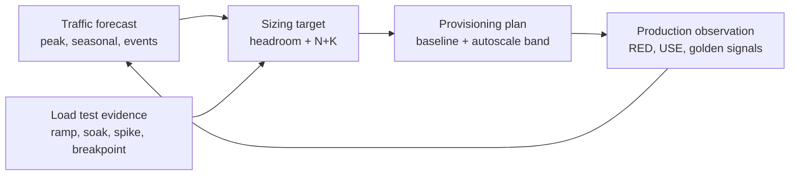
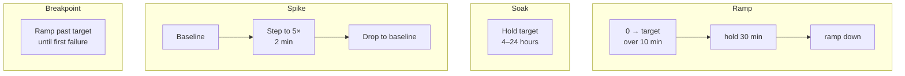
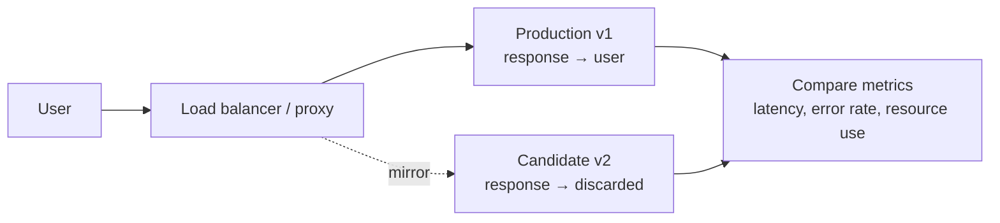
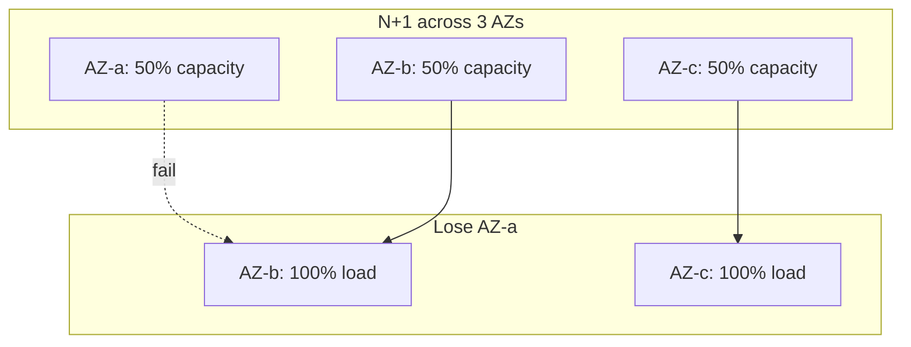

# Capacity Planning and Load Testing

**Date:** 2026-04-26 | **Updated:** 2026-04-26
**Tags:** `system-design` `performance` `capacity-planning` `load-testing`

## Table of Contents

- [Summary](#summary)
- [Overview](#overview)
- [Key Concepts](#key-concepts)
  - [Little's Law — L = λW](#littles-law--l--w)
  - [Headroom Planning — Why 50–70% Target Utilization](#headroom-planning--why-5070-target-utilization)
  - [Load Test Shapes — Ramp, Soak, Spike, Breakpoint](#load-test-shapes--ramp-soak-spike-breakpoint)
  - [Open vs Closed Model Load Testing](#open-vs-closed-model-load-testing)
  - [Coordinated Omission and wrk2](#coordinated-omission-and-wrk2)
  - [Production Shadowing — Mirror Traffic](#production-shadowing--mirror-traffic)
  - [Traffic Forecasting from Historical Metrics](#traffic-forecasting-from-historical-metrics)
  - [Capacity for Failure Scenarios — N+1 and N+2](#capacity-for-failure-scenarios--n1-and-n2)
  - [Autoscaling vs Over-Provisioning](#autoscaling-vs-over-provisioning)
  - [Peak-Hour vs Steady-State](#peak-hour-vs-steady-state)
- [Trade-offs](#trade-offs)
- [Code Examples](#code-examples)
  - [k6 Ramp Script](#k6-ramp-script)
  - [Gatling Spike Scenario](#gatling-spike-scenario)
  - [Little's Law Sanity Calculation](#littles-law-sanity-calculation)
- [Real-World Uses](#real-world-uses)
- [Anti-Patterns](#anti-patterns)
- [Related](#related)
- [References](#references)

## Summary

Capacity planning is the discipline of sizing a system so it survives **realistic peak load plus a failure** without breaking SLOs. Load testing is how you generate evidence — not opinions — about what your system actually does under pressure. The two go together: you forecast traffic, derive a target capacity with headroom, then validate it with load shapes (ramp, soak, spike, breakpoint) that exercise the right failure modes. **Little's Law** (L = λW) gives you the math to translate throughput and latency into concurrency and connection-pool sizing. **Open vs closed-model** load testing decides whether your test even resembles real users; closed models silently mask tail latency. **Coordinated omission** is the trap that makes naive load tools lie about p99. Production shadowing, N+1/N+2 redundancy math, and autoscaling-with-warm-up round out the practitioner's toolkit. This doc covers the math, the test shapes, the tools (k6, Gatling, Locust, JMeter, wrk2), and the anti-patterns that make capacity plans look fine on paper and explode on Black Friday.

## Overview

Capacity planning is not "how many servers do we need?" — it is "how do we know we will survive the worst plausible Tuesday afternoon plus the loss of an availability zone?" The output is a sized fleet, an autoscaling policy, a failure-tolerant topology, and a load-test report that justifies all three.

Three forces drive sizing decisions:

1. **Demand** — forecasted traffic at peak, including marketing events, seasonal lifts, and viral spikes.
2. **Service curve** — how latency and error rate change as utilization climbs. This curve is non-linear: it rises slowly until ~70%, then explodes.
3. **Failure budget** — the system must survive the loss of N nodes, an entire AZ, or a region while still meeting SLOs.

Everything else — load shapes, instrumentation, autoscaling — is in service of measuring or controlling those three. Skip the math and you ship a system that runs at 95% utilization on Tuesday and falls over the moment someone sneezes on Wednesday.



The loop is what matters. A capacity plan that does not feed back from production observation is a one-time guess, not a discipline.

## Key Concepts

### Little's Law — L = λW

Little's Law is the single most useful equation in capacity planning. For any stable queueing system in steady state:

```text
L = λ × W

  L = average number of items in the system (concurrency, queue depth)
  λ = arrival rate (requests per second)
  W = average time an item spends in the system (latency, seconds)
```

It holds for **any** stable system regardless of arrival distribution, service distribution, or scheduling discipline. It gives you four practical tools:

1. **Connection-pool sizing.** If your service handles 2,000 RPS at 50 ms average latency, you need `2000 × 0.050 = 100` concurrent in-flight requests on average. Pool size at p99 latency (say 250 ms) is `2000 × 0.250 = 500`. Size for p99, not average.
2. **Thread-pool sizing for blocking I/O.** Same math. If you have 200 worker threads and each request blocks 100 ms, your ceiling is `200 / 0.1 = 2000 RPS`. Past that, requests queue, latency rises, and Little's Law starts pointing at a number bigger than your pool — that is your overload signal.
3. **Sanity-checking load tests.** If a tool claims it sent 5,000 RPS at 200 ms latency through 100 virtual users, Little's Law says the maximum throughput at 200 ms latency with 100 concurrency is `100 / 0.2 = 500 RPS`. Either the tool is lying or the latency is. Almost always the tool is using a **closed model** and silently throttled.
4. **Cross-validating production metrics.** Pick any 60-second window. Multiply RPS by mean latency. Compare to in-flight request gauges. Mismatch means your latency or throughput metric is broken.

### Headroom Planning — Why 50–70% Target Utilization

Latency vs utilization is not linear. From queueing theory, an M/M/1 queue's mean response time is `W = 1 / (μ - λ)`, where `μ` is service rate and `λ` is arrival rate. Define utilization `ρ = λ/μ`:

```text
ρ = 0.50  →  response time = 2 × service time
ρ = 0.70  →  response time = 3.3 × service time
ρ = 0.80  →  response time = 5 × service time
ρ = 0.90  →  response time = 10 × service time
ρ = 0.95  →  response time = 20 × service time
ρ = 0.99  →  response time = 100 × service time
```

The hockey stick is real. Worse, real systems are not M/M/1 — bursts, GC pauses, and tail-amplifying fan-out make the curve steeper. A fleet "sitting comfortably at 80%" is one autoscaling delay, one GC pause, or one slow-pod-eviction away from a latency spike that triggers retries that drive utilization to 100% — the **metastable failure** trap.

Practical headroom rules of thumb:

- **CPU at 50–60% steady-state**, headroom for bursts and failover.
- **Memory at 60–70%** with a hard ceiling well under OOMKill.
- **Disk I/O at 50%** because tail-latency on disk is brutal.
- **Network at 50%**, especially for ingress.
- **Database connections at 70%** of pool, with the rest reserved for surges and admin.
- **Thread / event-loop saturation at 70%**.

The headroom is not waste. It is the difference between "absorbed the spike" and "page everyone".

### Load Test Shapes — Ramp, Soak, Spike, Breakpoint

A single load shape only answers a single question. Run several.

**Ramp (load test).** Increase load linearly from zero to target over 5–30 minutes, hold at target for 10–60 minutes, ramp down. Reveals the steady-state behavior at expected peak. Most "did we hit the SLO?" reports come from ramp tests.

**Soak (endurance test).** Hold target load for 4–24 hours. Reveals slow failures: memory leaks, file-descriptor exhaustion, cache eviction storms, log-volume blowups, certificate refresh bugs, connection-pool fragmentation. A 30-minute ramp test will not surface any of these.

**Spike test.** Step from baseline to 2–10× peak instantly, hold for 1–5 minutes, drop. Reveals autoscaler latency, cold-start storms, connection-pool exhaustion, downstream-queue pile-up. This is the test that predicts whether your Black Friday will be Black.

**Breakpoint (stress test).** Ramp slowly past the design target until something breaks. The point is not the breaking point itself — it is *what* breaks first and *how*. Does the database CPU saturate, or does the connection pool exhaust first? Does the system fail open (return 503s fast) or fail closed (queue forever)? Does it recover when load drops?



Run all four against the same system before you call it production-ready.

### Open vs Closed Model Load Testing

This is the distinction that decides whether your numbers mean anything.

**Closed model.** Fixed pool of `N` virtual users. Each user sends a request, **waits for the response**, sleeps a think-time, repeats. Throughput is bounded by `N / (response_time + think_time)`. JMeter's default thread group, Locust's default user, k6's vu-based tests with no `executor: 'constant-arrival-rate'` — all default to closed model.

**Open model.** Requests arrive at a target **rate** (e.g. 1,000 RPS) regardless of how slow the server is. New requests pile up if the server slows down. wrk2's `-R` flag, k6's `constant-arrival-rate` and `ramping-arrival-rate`, Gatling's `injectOpen(constantUsersPerSec)` — all open model.

Real users behave **open**. They click a link; they do not wait politely for the previous user to be served. The traffic arriving at your front door is governed by user actions, not by your server's response time.

The Schroeder/Wierman/Harchol-Balter paper ("Open Versus Closed: A Cautionary Tale", NSDI 2006) showed empirically that the two models produce **dramatically different** results for the same system, and that closed-model tests systematically underreport tail latency. When the server slows down, closed-model load throttles itself — the "users" are stuck waiting and stop generating new requests. Tail latency stays artificially low. You ship; production users are not virtual; tail latency surprises you.

**Rule:** unless you are deliberately modelling a system with a fixed concurrent population (e.g. a desktop app with exactly 50 connected users), use the open model.

### Coordinated Omission and wrk2

Gil Tene's "coordinated omission" is the second trap. Many load tools record latency starting *when the request is sent*, not *when it should have been sent*. If the server stalls for 1 second and the tool was supposed to send 1,000 RPS during that second, a naive tool either:

- Sends nothing during the stall, then resumes — losing 1,000 samples that *should have shown 1 second of latency*; or
- Sends them all back-to-back after the stall, recording each as a fast request — because it measures from "I just sent it" forward.

Either way the recorded latency distribution **omits** the stall. The reported p99 looks fine. Production p99 is awful.

**wrk2** (Tene's fork of wrk) was the first widely-used tool that fixed this with a `-R` (target rate) flag and HDR Histogram-based latency that includes "scheduled-but-not-yet-sent" time. k6, Gatling, and modern Locust have followed. JMeter and old wrk are still vulnerable if misconfigured.

Sanity check: if you run a load test and your reported latency at 5× target load looks identical to latency at 1× target load, something is omitting samples. Healthy systems get slower under load.

### Production Shadowing — Mirror Traffic

Synthetic load tests, no matter how careful, cannot replicate production traffic. Real traffic has long-tail URL distributions, weird user-agents, malformed payloads, and request shapes you would never write into a script.

**Production shadowing** (a.k.a. **traffic mirroring**, **dark launch**, **shadow traffic**) sends a copy of live production requests to a candidate system in parallel. The shadow's responses are discarded; only the production system's response goes back to users.



Tools and patterns:

- **Envoy `request_mirror_policies`**, **NGINX `mirror`**, **AWS VPC Traffic Mirroring**, **GoReplay**, **Diffy** (Twitter's response-comparison tool).
- Apply at the LB layer or the service-mesh layer.
- Mirror at sampled rate (1–10%) before going to 100% to avoid doubling downstream load.
- Watch out for **non-idempotent mutations** — shadowed `POST /payments` will charge the customer twice unless the candidate writes to a separate database or uses dry-run mode.

Shadow tests answer the question synthetic tests cannot: *will the new version handle the requests we are actually getting today*?

### Traffic Forecasting from Historical Metrics

Capacity planning needs a number for "expected peak". Pull it from history, not gut feel.

Steps:

1. **Gather time-series**. RPS, p50/p99 latency, error rate, CPU per pod, RAM per pod — at 1-minute resolution for 90+ days. Prometheus, CloudWatch, Datadog, whatever.
2. **Decompose**. Use STL (Seasonal-Trend-Loess) or similar to separate trend, weekly seasonality, and daily seasonality. `statsmodels.tsa.seasonal_decompose` or Prophet are common.
3. **Identify drivers**. Marketing campaigns, product launches, holidays, sports events, the New York lunch hour. Annotate the time series with known events.
4. **Fit a forecast**. Linear-trend + seasonality is often enough. ARIMA, Prophet, or Holt-Winters work for richer patterns.
5. **Add a safety multiplier**. Forecast peak × 1.5 to 2.0 is a typical planning target. Black Friday and product launches need 3–5× because past peaks underestimate the next one.

```text
peak_RPS_target = max(observed_peak_90d, forecast_peak_90d) × safety_factor

safety_factor:
  1.5 — steady-state services
  2.0 — services with marketing-driven spikes
  3.0+ — Black-Friday / launch-day systems
  5.0  — first launch with no history
```

Forecasting is the input to sizing. Without it you end up sizing for last week's average traffic and getting blindsided by next week's peak.

### Capacity for Failure Scenarios — N+1 and N+2

Capacity is not "enough to serve peak". It is "enough to serve peak after losing K nodes / racks / zones / regions".

**N+1.** Provision N+1 capacity-units where any single one can fail. If each unit serves S requests per second and you need P RPS at peak:

```text
N    = ceil(P / S)              # nodes needed at peak
N+1  = N + 1                    # tolerate single node loss
util = P / ((N+1) × S)          # steady-state utilization
```

Concrete: peak 10,000 RPS, each node serves 2,000 RPS. `N = 5`, `N+1 = 6`. Steady-state utilization = `10000 / 12000 = 83%` per node. Lose one node, the remaining five each serve 2,000 RPS = 100% — still meeting peak, but with zero headroom. So you actually want N+1 sized so the post-failure utilization stays inside the headroom band:

```text
post_failure_util_target = 0.7
units_required = ceil(P / (S × post_failure_util_target × (N - 1) / N))
```

**N+2.** Tolerate two simultaneous failures. Common when:

- Planned maintenance is happening on one node when an unplanned failure hits another.
- AZ-level redundancy: lose one AZ entirely while another node has an unrelated failure.
- High-SLA services where double-failure probability over a year is non-negligible.

For a 3-AZ deployment with N+2 across AZs, each AZ holds enough capacity to serve **all traffic alone**. Costs 3× a single-AZ deployment. This is the price of "survives losing any AZ at peak with no degradation".



In the example above, each AZ runs at 67% steady-state. Losing one pushes the survivors to 100%. Sized for survival, not comfort.

### Autoscaling vs Over-Provisioning

Two models, both valid, often combined.

**Over-provisioning.** Run the fleet at the size needed for peak + headroom + N+K, all the time. Predictable, simple, expensive. Best when:

- Traffic is roughly constant (B2B SaaS during business hours).
- Cold starts are slow (JVM, large container images, model loading).
- Cost of being under-provisioned for one minute exceeds the cost of being over-provisioned all day.

**Autoscaling.** Run baseline capacity, scale out under load. Cheaper at the average, riskier at the spike. Best when:

- Traffic varies > 3× across the day.
- Cold-start latency is acceptable.
- You can predict scale events (scheduled scaling) or absorb the latency of reactive scaling.

Real systems usually do both: a **floor** of always-on capacity (over-provisioned for steady-state and for the first wave of any spike) plus a **ceiling** of autoscaling capacity (for predictable peaks and unpredictable surges).

**Autoscaling pitfalls:**

- **Cold start** — new pods take 30–300 seconds to be useful. By the time they are ready, the spike is over or has already broken the existing fleet.
- **Scale-up vs scale-out signals** — CPU is a lagging indicator. Better: queue depth, in-flight requests, p99 latency, accept-rate.
- **Thrashing** — scale-up and scale-down hysteresis must be asymmetric. Scale up fast, scale down slow.
- **Downstream pressure** — autoscaling the web tier can crush a non-autoscaling database. Set explicit dependency limits.
- **Warm-up** — JIT-compiled, cache-cold pods serve at fractional throughput for the first few minutes. Capacity plans must account for "useful" capacity, not "running" capacity.

### Peak-Hour vs Steady-State

A 24-hour service typically has:

- **Steady-state** — overnight, weekend, off-peak. Low traffic, low utilization, plenty of headroom.
- **Daily peak** — 9–11am and 2–4pm in the busiest user time zone for B2B; 8–10pm for B2C entertainment.
- **Weekly peak** — Monday morning for B2B; Sunday evening for B2C.
- **Seasonal peak** — Q4 for retail, tax season for finance, exam season for ed-tech, Super Bowl Sunday for delivery.
- **Event peak** — product launches, marketing campaigns, viral moments, news cycles.

Plan capacity against the **highest plausible peak** in the planning horizon, not against an average. A system sized for the daily average will be at 5× utilization during the daily peak — already broken — let alone seasonal.

The metric "average utilization across the fleet across the day" is a vanity metric. The metric that matters is "p99 utilization on the hottest pod during peak hour on a representative bad day".

## Trade-offs

| Dimension | Choice A | Choice B | Trade-off |
|-----------|----------|----------|-----------|
| Provisioning | Over-provision | Autoscale | Predictability vs cost; over-provision wins on cold-start-heavy stacks |
| Load model | Closed | Open | Open is realistic for user-facing systems; closed only for fixed-population apps |
| Test shape | Ramp only | Ramp + soak + spike + breakpoint | Single shape misses memory leaks, autoscaler latency, and meta-stable failure |
| Headroom target | High utilization (cheap) | Low utilization (resilient) | 70% is the practical sweet spot for most stateless services; databases want lower |
| Forecast window | Short (last 7d) | Long (last 90d + seasonal) | Short windows miss seasonality; long windows lag novel events |
| Redundancy | N+1 | N+2 | N+2 doubles cost vs N+1 for marginal added safety; depends on failure probabilities |
| Mirror traffic | Off | On | Mirror catches what synthetic tests cannot, at the cost of double downstream load and mutation hazards |
| Latency tool | wrk / JMeter (default) | wrk2 / k6 / Gatling (CO-correct) | CO-correct is mandatory for any latency-SLO claim |
| Scaling signal | CPU | Queue depth / in-flight / p99 | CPU lags; queue-based signals scale earlier and avoid thrashing |
| Test environment | Synthetic | Production shadow | Shadow is the only way to be sure; synthetic is faster to iterate on |

## Code Examples

### k6 Ramp Script

A k6 script using the **open-model** `ramping-arrival-rate` executor — the only k6 executor that resists coordinated omission and matches real user arrival patterns:

```javascript
// loadtest/ramp.js
// Run: k6 run --out json=results.json loadtest/ramp.js
import http from 'k6/http';
import { check, sleep } from 'k6';
import { Trend } from 'k6/metrics';

const apiLatency = new Trend('api_latency_ms', true);

export const options = {
  thresholds: {
    // Hard SLOs — k6 exits non-zero if breached
    http_req_failed: ['rate<0.01'],         // < 1% errors
    http_req_duration: ['p(99)<500'],       // p99 < 500 ms
    api_latency_ms: ['p(95)<250'],
  },
  scenarios: {
    ramp: {
      executor: 'ramping-arrival-rate',     // OPEN model
      startRate: 10,                        // 10 RPS
      timeUnit: '1s',
      preAllocatedVUs: 200,                 // headroom for slow responses
      maxVUs: 1000,
      stages: [
        { target: 100,  duration: '2m' },   // warm-up
        { target: 1000, duration: '5m' },   // ramp to target
        { target: 1000, duration: '20m' },  // hold at peak
        { target: 0,    duration: '2m' },   // cool down
      ],
    },
  },
};

export default function () {
  const res = http.get('https://api.example.com/v1/products?limit=20', {
    headers: { 'Accept': 'application/json' },
    tags: { endpoint: 'product_list' },
  });

  apiLatency.add(res.timings.duration);

  check(res, {
    'status is 200': (r) => r.status === 200,
    'has body': (r) => r.body && r.body.length > 0,
  });
}
```

Notes:

- `ramping-arrival-rate` enforces target RPS regardless of response latency — coordinated-omission-resistant.
- `preAllocatedVUs` must exceed the worst-case concurrency from Little's Law: `RPS × p99_latency_seconds`.
- `thresholds` are the contract; CI fails the build if breached.

### Gatling Spike Scenario

A Gatling Scala scenario for a **spike test** — instantaneous step from baseline to 5× peak:

```scala
// src/test/scala/loadtest/SpikeSimulation.scala
package loadtest

import io.gatling.core.Predef._
import io.gatling.http.Predef._
import scala.concurrent.duration._

class SpikeSimulation extends Simulation {

  val httpProtocol = http
    .baseUrl("https://api.example.com")
    .acceptHeader("application/json")
    .userAgentHeader("gatling-spike-test")

  val checkout = scenario("CheckoutFlow")
    .exec(http("list_products").get("/v1/products?limit=20").check(status.is(200)))
    .pause(500.millis, 1500.millis)
    .exec(http("get_cart").get("/v1/cart").check(status.is(200)))
    .pause(500.millis)
    .exec(http("submit_order").post("/v1/orders")
      .body(StringBody("""{"productId":"sku-123","qty":1}""")).asJson
      .check(status.in(200, 201)))

  setUp(
    checkout.inject(
      constantUsersPerSec(200).during(5.minutes),     // baseline
      atOnceUsers(2000),                              // SPIKE: instant 10× burst
      constantUsersPerSec(1000).during(2.minutes),    // sustained 5× elevated
      constantUsersPerSec(200).during(5.minutes)      // recovery — does it return to baseline?
    )
  )
  .protocols(httpProtocol)
  .assertions(
    global.responseTime.percentile4.lt(1000),         // p99 < 1s during spike
    global.failedRequests.percent.lt(2),              // < 2% errors total
    forAll.responseTime.percentile3.lt(500)           // p95 < 500ms per scenario step
  )
}
```

Notes:

- `atOnceUsers(2000)` is the spike — Gatling's open-model injection.
- The recovery window is part of the test: a system that scales but never scales back is also broken.
- Assertions enforce SLOs even during the spike — the test fails if p99 exceeds 1 s.

### Little's Law Sanity Calculation

A simple Python script that turns observed traffic and latency into pool-size and node-count requirements:

```python
# scripts/capacity_calc.py
"""
Capacity sanity check using Little's Law and headroom rules.

Run:  python capacity_calc.py
"""
from dataclasses import dataclass
from math import ceil

@dataclass
class Service:
    name: str
    peak_rps: float
    p99_latency_s: float
    per_node_max_rps: float
    target_utilization: float = 0.70   # 70% headroom rule
    redundancy: int = 1                # N+1 by default

def sizing(svc: Service) -> dict:
    # Concurrency at peak — drives connection / thread pool size
    peak_concurrency = svc.peak_rps * svc.p99_latency_s

    # Pool sizing — round up + 25% slack
    pool_size = ceil(peak_concurrency * 1.25)

    # Nodes needed at design utilization
    effective_per_node = svc.per_node_max_rps * svc.target_utilization
    n_nodes = ceil(svc.peak_rps / effective_per_node)

    # N+K redundancy
    total_nodes = n_nodes + svc.redundancy

    # Post-failure utilization — what each survivor sees if K nodes die
    survivors = total_nodes - svc.redundancy
    post_failure_util = svc.peak_rps / (survivors * svc.per_node_max_rps)

    return {
        "service": svc.name,
        "peak_concurrency": round(peak_concurrency, 1),
        "recommended_pool_size": pool_size,
        "min_nodes_at_target_util": n_nodes,
        "total_nodes_with_redundancy": total_nodes,
        "post_failure_utilization": round(post_failure_util, 2),
        "headroom_ok": post_failure_util <= 0.95,
    }

if __name__ == "__main__":
    services = [
        Service("checkout-api",      peak_rps=2000,  p99_latency_s=0.250, per_node_max_rps=400),
        Service("product-search",    peak_rps=8000,  p99_latency_s=0.080, per_node_max_rps=1500),
        Service("payment-processor", peak_rps=300,   p99_latency_s=1.200, per_node_max_rps=80, redundancy=2),
    ]
    for s in services:
        result = sizing(s)
        print(f"{result['service']:>22}: "
              f"pool={result['recommended_pool_size']:>4}  "
              f"nodes={result['total_nodes_with_redundancy']:>3}  "
              f"post-fail-util={result['post_failure_utilization']:.0%}  "
              f"{'OK' if result['headroom_ok'] else 'TIGHT'}")
```

Sample output:

```text
        checkout-api: pool= 625  nodes=  8  post-fail-util= 71%  OK
      product-search: pool= 800  nodes=  9  post-fail-util= 67%  OK
   payment-processor: pool= 450  nodes=  7  post-fail-util= 75%  OK
```

The model is intentionally simple. The point is to make the assumptions visible: peak RPS, p99 latency, per-node throughput, target utilization, redundancy. Change one and watch every downstream number move.

## Real-World Uses

| System | Capacity-planning practice |
|--------|----------------------------|
| **Netflix** | Open-source **NDBench** for stateful workload testing; production traffic shadowing across regions; Chaos Monkey to validate post-failure capacity; FIT (Failure Injection Testing) for spike+failure combos |
| **Amazon retail** | Multi-month Black Friday rehearsals; game-day exercises with full-stack failovers; AZ-level N+2 for peak season; pre-warming of caches and connection pools |
| **Google SRE** | Capacity planning chapter (SRE Book ch.18) — non-abstract reliability, demand forecasting, allocation across cells, regular load tests |
| **Stripe** | Continuous load testing in pre-prod; circuit-breaker capacity isolation; documented practice of running prod at < 50% peak utilization to absorb spikes |
| **Uber** | Open-sourced **Hailstorm** and **uForwarder**; load tests through the full mobile-to-edge-to-service path; per-city peak forecasting |
| **Shopify** | Annual BFCM (Black Friday/Cyber Monday) load tests at 5×+ peak; "resiliency week"; pod-level CPU caps to prevent noisy-neighbor capacity drain |
| **Cloudflare** | Capacity per PoP based on regional traffic forecasts; BGP withdrawal rehearsals to validate failover capacity |
| **GitHub** | Documented soak tests around major releases; production shadow for new git protocols before cutover |
| **Spotify** | Squad-level capacity ownership; load testing as part of every service's CD pipeline |

## Anti-Patterns

**Closed-model load tests masking tail latency.** A 50-VU JMeter test reports p99 of 200 ms. Production rolls out, real users see p99 of 4 s. The test's 50 VUs were politely waiting for slow responses, never piling up the way real arriving traffic does. Symptom: load-test latency curve looks flat across load levels. Fix: switch to open-model arrival-rate (k6 ramping-arrival-rate, Gatling `injectOpen`, wrk2 `-R`).

**Black-Friday capacity sized from average traffic.** "Average daily RPS is 1,200, so we provision for 2,000 to be safe." Black Friday peak is 18,000 RPS. The system collapses at 09:00:30. Symptom: capacity plan that uses `mean()` or even `p95()` of historical traffic. Fix: size from observed peak × safety multiplier × N+K, with explicit annotations for marketing events.

**Autoscaling without warm-up budget.** Spike arrives. Autoscaler triggers. Pods take 90 seconds to start, 60 more to JIT-warm, 30 more to fill caches. By the time they are useful, the spike has been smashing existing pods for 3 minutes. Existing pods are already over capacity, retries amplify load, the system is in a metastable failure that new pods cannot escape. Fix: maintain a baseline floor that absorbs the first wave; pre-warm pods (synthetic traffic post-start); use scheduled scaling for predictable peaks; alarm on "scale-up triggered" so humans can intervene.

**Single-shape load testing.** "We ran a 30-minute ramp test, p99 was good, ship it." Memory leak surfaces at hour 3 in production. Spike test was never run, so cold-start storm is unknown. Fix: ramp + soak + spike + breakpoint, every release cycle for tier-1 services.

**Shadow traffic causing duplicate writes.** Engineer enables traffic mirror to candidate v2. Candidate processes mirrored `POST /payments`. Customer is charged twice. Fix: mirror only idempotent reads, or route candidate writes to a separate store, or run candidate in dry-run mode with side-effect suppression. Always assume mirror traffic is destructive until proven otherwise.

**Treating CPU% as the only autoscaling signal.** CPU lags. By the time CPU is at 85%, queue depth is at 10,000 and latency is exploding. Fix: scale on leading indicators — in-flight requests, queue depth, p99 latency, error rate — and use CPU as a backstop.

**"We tested at 1× peak so we are good."** 1× is the *expected* peak. The point of load testing is to know what happens at 2×, 5×, and at the failure point. Fix: every load-test plan must include breakpoint runs, even if you do not plan to operate there.

**Forgetting downstream capacity.** Web tier scales to 10× under load. Database connection pool stays at 200. Web pods stampede the database, every request times out, every retry fans out, the database is now the bottleneck and the autoscaling did nothing useful. Fix: capacity-plan the entire dependency graph; document downstream limits as autoscaler ceilings.

**Capacity planning without observability.** "We sized for 5,000 RPS." Fine — but RPS of *what*? `GET /healthz` is not the same as `POST /checkout`. Without per-endpoint, per-payload-size metrics, capacity plans collapse on any traffic-mix shift. Fix: make capacity targets endpoint-aware and tie them to RED/USE dashboards.

**Soak tests skipped because "they take too long".** Memory leaks, FD leaks, log-volume blowups, certificate-expiry bugs all surface only after hours of steady operation. A 30-minute test will never see them. Fix: run a weekly 24-hour soak in a pre-prod environment; budget the time.

## Related

- [Performance Budgets and Latency](./performance-budgets-and-latency.md) — SLOs, percentiles, latency budgets, and tail amplification; the targets that capacity planning is sized to meet
- [Monitoring — RED, USE, and Golden Signals](./monitoring-red-use-golden-signals.md) — the production observability that feeds the forecasting loop and validates load-test predictions
- [Horizontal vs Vertical Scaling and Statelessness](../scalability/horizontal-vs-vertical-and-stateless.md) — the scaling primitives that capacity plans operate on; statelessness is what makes autoscaling viable
- [Multi-Region Architectures](../reliability/multi-region-architectures.md) — region-level redundancy math and the cross-region failover scenarios that drive N+K capacity decisions
- [Backpressure, Bulkheads, and Circuit Breakers](../scalability/backpressure-bulkhead-circuit-breaker.md) — load-shedding patterns that protect capacity when forecasts are wrong
- [Chaos Engineering and Game Days](../reliability/chaos-engineering-and-game-days.md) — capacity validation under deliberate failure injection

## References

- [k6 Documentation — Test Types and Executors](https://grafana.com/docs/k6/latest/testing-guides/test-types/) — official guidance on ramp, soak, spike, breakpoint, and stress tests; arrival-rate executors for open-model testing
- [Gatling Documentation — Injection Profiles](https://docs.gatling.io/reference/script/core/injection/) — open- and closed-model injection patterns, spike and ramp DSL
- [wrk2 — A Constant Throughput, Correct Latency Recording Variant of wrk](https://github.com/giltene/wrk2) — Gil Tene's coordinated-omission-correct fork of wrk; the README is the canonical explanation of CO
- Bianca Schroeder, Adam Wierman, Mor Harchol-Balter, ["Open Versus Closed: A Cautionary Tale" (NSDI 2006)](https://www.usenix.org/legacy/event/nsdi06/tech/full_papers/schroeder/schroeder.pdf) — the empirical paper showing closed-model load tests systematically misrepresent system behavior
- Betsy Beyer et al., ["Site Reliability Engineering" — Chapter 18, Software Engineering in SRE](https://sre.google/sre-book/software-engineering-in-sre/) and ["Capacity Planning" chapters](https://sre.google/workbook/implementing-slos/) — Google's operational practice for demand forecasting, allocation, and load testing
- John D. C. Little, ["A Proof for the Queuing Formula: L = λW" (1961)](https://www.jstor.org/stable/167570) — the original Little's Law paper; the modern restatement is in any queueing theory text
- Gil Tene, ["How NOT to Measure Latency"](https://www.youtube.com/watch?v=lJ8ydIuPFeU) — talk explaining coordinated omission, HDR Histogram, and why your latency numbers are probably wrong
- [Locust Documentation](https://docs.locust.io/) and [JMeter User Manual](https://jmeter.apache.org/usermanual/index.html) — the other two widely-used tools; both support open-model testing with care
- Marc Brooker, ["Metastable Failures in Distributed Systems"](https://brooker.co.za/blog/2021/10/22/metastable.html) — why systems running at high utilization can collapse permanently; capacity headroom is the prevention
- [Envoy Request Mirroring](https://www.envoyproxy.io/docs/envoy/latest/configuration/http/http_filters/router_filter#config-http-filters-router-shadow) — production-grade traffic mirroring for shadow testing
