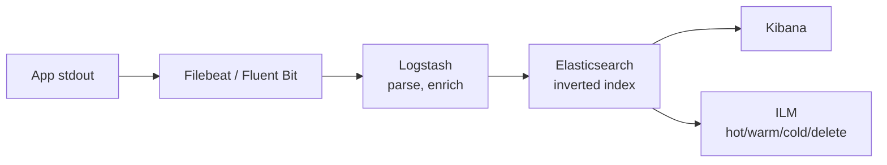
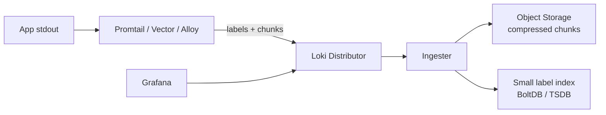
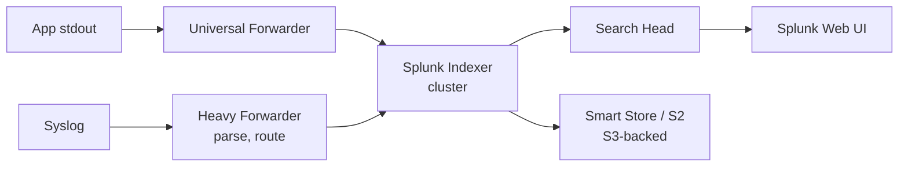

# Log Aggregation and Structured Logging

**Date:** 2026-04-26 | **Updated:** 2026-04-26
**Tags:** `system-design` `observability` `logging`

## Table of Contents

- [Summary](#summary)
- [Overview — ELK / Loki / Splunk Decision Tree](#overview--elk--loki--splunk-decision-tree)
  - [ELK / Elastic Stack](#elk--elastic-stack)
  - [Loki — Index Only Labels](#loki--index-only-labels)
  - [Splunk — Commercial Heavyweight](#splunk--commercial-heavyweight)
  - [Decision Tree](#decision-tree)
- [Key Concepts](#key-concepts)
  - [Structured Logs — JSON Lines vs Plain Text](#structured-logs--json-lines-vs-plain-text)
  - [Label Cardinality and Field Cardinality](#label-cardinality-and-field-cardinality)
  - [Correlation IDs Across Services](#correlation-ids-across-services)
  - [Log Shipping — Filebeat, Fluentd, Vector, OTel Collector](#log-shipping--filebeat-fluentd-vector-otel-collector)
  - [Log-to-Metric Conversion](#log-to-metric-conversion)
  - [Retention Tiering — Hot, Warm, Cold, Frozen](#retention-tiering--hot-warm-cold-frozen)
  - [Redaction at Source for PII](#redaction-at-source-for-pii)
- [Trade-offs — Cost, Query Power, Cardinality](#trade-offs--cost-query-power-cardinality)
- [Code Examples](#code-examples)
  - [JSON Log Line — A Disciplined Schema](#json-log-line--a-disciplined-schema)
  - [Vector Pipeline — Parse, Redact, Route, Convert](#vector-pipeline--parse-redact-route-convert)
  - [Loki Label Strategy](#loki-label-strategy)
  - [OTel Collector — Logs Pipeline](#otel-collector--logs-pipeline)
- [Real-World Uses](#real-world-uses)
- [Anti-Patterns](#anti-patterns)
- [Related](#related)
- [References](#references)

## Summary

Log aggregation is the unsexy backbone of debugging at scale. The moment you have more than one process emitting logs, `tail -f` stops working and you need a pipeline that ships, parses, indexes, queries, retains, and eventually deletes log lines from many sources. The three dominant architectures — **ELK** (Elasticsearch + Logstash + Kibana), **Grafana Loki**, and **Splunk** — make very different bets about what to index and what to scan. ELK indexes every field for fast arbitrary search at high storage cost. Loki indexes only labels and grep-scans the rest, trading query speed for cheap storage. Splunk is a commercial superset with deep query power and matching pricing. On top of any of these you need **structured JSON logs**, **bounded cardinality**, **correlation IDs** that join logs to traces and metrics, **redaction at source** so PII never touches storage, and **retention tiering** that keeps recent logs hot and ancient logs in object storage. This doc covers the decision tree, the operational concepts, the worst anti-patterns (logging full request/response bodies, logging PII, treating logs as an event store), and concrete pipeline examples in Vector, OTel Collector, and Loki.

## Overview — ELK / Loki / Splunk Decision Tree

The first architectural choice is what you index. Every other constraint — cost, query speed, retention, cardinality budget — falls out of that decision.

### ELK / Elastic Stack

The Elastic Stack — historically "ELK" for **E**lasticsearch + **L**ogstash + **K**ibana, now "Elastic Stack" because Beats and Fleet joined the family — indexes log content into an inverted index. Every field becomes searchable in roughly constant time regardless of corpus size.



- **Strength:** ad-hoc full-text search across structured and unstructured fields is fast and expressive.
- **Cost:** the index is typically **2–5x the size of the raw logs**. CPU and RAM for indexing dominate the cluster budget.
- **Cardinality risk:** Elasticsearch maps every JSON key to a field. A poorly disciplined producer can cause a **mapping explosion** — thousands of unique fields per index, blowing up heap and crashing the cluster.
- **ILM (Index Lifecycle Management)** moves indices through hot → warm → cold → frozen → delete phases on age and size triggers, and is the only way to keep a long-running stack from becoming insolvent.

### Loki — Index Only Labels

Grafana Loki was designed in explicit opposition to ELK's "index everything" model. It indexes only a small set of **labels** per stream (typically `app`, `env`, `namespace`, `pod`, `cluster`) and stores the actual log lines as compressed chunks in object storage (S3, GCS, Azure Blob).



- **Strength:** **storage cost is roughly the cost of the raw compressed logs in S3.** A 100 GB/day workload that costs five-figures per month in ELK can cost three figures in Loki.
- **Weakness:** queries that aren't selective on labels degrade to a parallel grep over chunks. A query like `{app="api"} |= "user_id=12345"` is fine; `{env="prod"} |= "12345"` reads everything.
- **Hard rule:** labels must be **low cardinality**. `request_id` as a label is a fatal mistake — it creates one stream per request and overwhelms the ingester.

### Splunk — Commercial Heavyweight

Splunk is the original log-aggregation product, predating ELK. It indexes events with both schema-on-read (SPL — Search Processing Language) and rich field extraction.



- **Strength:** the most powerful search and analytics language in the space, mature alerting, and a deep ecosystem of apps for compliance, security (Splunk Enterprise Security), and ITOps.
- **Weakness:** licensing has historically been priced on **GB indexed per day**, which can punish high-volume workloads brutally. Newer SVC/workload pricing softens this but rarely beats Loki on raw cost.
- **Where it wins:** regulated enterprises that need an auditable, single-vendor, fully-supported logging stack and that can absorb the licensing.

### Decision Tree

```text
1. Are you in a regulated enterprise with budget and compliance pressure
   that values a single supported vendor?
   → Splunk (or Splunk Cloud).

2. Do operators run mostly known queries selective on a few labels
   (service, env, namespace, pod) and want the lowest storage cost?
   → Loki.

3. Do operators need ad-hoc, exploratory full-text search across every
   field, with rich aggregations on log content?
   → ELK / Elastic Stack (or a managed equivalent like Elastic Cloud,
     OpenSearch, AWS OpenSearch Service).

4. Is the workload small (< 10 GB/day) and do you already run
   Kubernetes + Grafana?
   → Loki by default; revisit if queries become unselective.

5. Do you have one or more existing observability vendors (Datadog,
   New Relic, Honeycomb, Chronosphere)?
   → Use the vendor's logs product for consistency unless cost
     forces you off; revisit at significant scale.
```

## Key Concepts

### Structured Logs — JSON Lines vs Plain Text

A log line is structured when it is machine-parseable without a regex. The de facto standard is **JSON Lines** (JSONL / NDJSON) — one JSON object per line, no nested newlines.

Plain-text logs:

```text
2026-04-26T10:14:22.103Z INFO  api-server  Got request from 10.1.2.3 user 47 method GET path /v1/orders/9921
```

The parsing cost is real. Every downstream consumer needs a regex (or grok pattern) per format, those patterns drift, and one truncated line breaks the parser for the rest of the file.

Structured equivalent:

```json
{"timestamp":"2026-04-26T10:14:22.103Z","level":"INFO","service":"api-server","msg":"request received","client_ip":"10.1.2.3","user_id":47,"method":"GET","path":"/v1/orders/9921","trace_id":"4bf92f3577b34da6a3ce929d0e0e4736","span_id":"00f067aa0ba902b7"}
```

The structured form survives schema changes, supports filtering on any field, joins cleanly to traces by `trace_id`, and removes parsing as an operational concern. Every modern logging library (Logback + logstash-logback-encoder for Java, pino for Node, structlog/loguru for Python, slog for Go, tracing-subscriber for Rust) emits JSONL natively.

A few discipline rules:

- **One field per concept.** `user_id` always means the same thing across all services.
- **Stable types.** Don't emit `user_id` as a string in one service and an integer in another — Elasticsearch will reject one of them on mapping conflict.
- **No nested unbounded objects.** Logging an entire request body inflates the index and risks cardinality explosions.
- **Keep messages short and human.** The `msg` field is for an operator skim; the structured fields are for filtering.

### Label Cardinality and Field Cardinality

Cardinality is the silent killer of every logging stack.

- In **Loki**, the **label set** identifies a stream. Every unique combination of label values creates a new stream with its own chunks and index entry. A label with millions of distinct values (`request_id`, `user_id`, `email`) will multiply your stream count by that factor, flatten the ingester, and produce per-query latency that scales with stream count, not data volume. The Loki recommendation is **fewer than ~10 labels** per stream and each label below ~10,000 distinct values across the cluster.
- In **Elasticsearch**, every JSON key under a dynamic mapping becomes a field. The danger is **mapping explosion**: a producer that puts variable user-controlled keys into the log object (`{"params": {"user_42": "..."}}`) will cause the field count to grow without bound. Once you cross `index.mapping.total_fields.limit` (default 1000), writes start failing. Long before that, query latency, segment merges, and heap pressure suffer.
- In **Splunk**, fields are extracted at search time, so cardinality affects search performance but not indexing storage as directly. It still affects accelerated data models and tsidx growth.

The rule of thumb: **high-cardinality identifiers go in the log body as a regular field, not as a label/dimension.** A `request_id` is filterable inside a stream; it must not be a stream selector.

### Correlation IDs Across Services

A single user request typically hits a load balancer, a gateway, three services, a queue, a worker, and a database. To debug it as one event you need a **correlation ID** propagated across every hop.

Two correlation IDs matter:

- **Request ID / correlation ID** — a UUID generated at the edge (gateway, ingress, BFF) and passed in a header (`X-Request-Id`, `X-Correlation-Id`). Useful for joining logs across services that don't yet emit traces.
- **Trace ID and span ID** — the W3C Trace Context standard (`traceparent` header) propagates a 128-bit trace ID and 64-bit span ID through every service. OpenTelemetry SDKs do this automatically.

A modern setup logs both:

```json
{
  "trace_id": "4bf92f3577b34da6a3ce929d0e0e4736",
  "span_id": "00f067aa0ba902b7",
  "request_id": "01HXQ8Z7K6P2E0W5N9V3M4Q1Y2",
  "service": "checkout",
  "msg": "applied promo code"
}
```

In Grafana, this enables a one-click jump from a trace span to its logs, and from a log line to its full trace. In ELK + Jaeger or Splunk + a trace backend the same join works once both stores share the trace ID column.

### Log Shipping — Filebeat, Fluentd, Vector, OTel Collector

The shipper reads logs from disk, container runtime, or stdin and forwards them to the aggregator. Five names dominate:

- **Filebeat** — lightweight Go agent in the Elastic family. Pairs with Logstash or Elasticsearch. Battle-tested, opinionated for the Elastic ecosystem.
- **Fluentd / Fluent Bit** — CNCF projects. Fluentd is Ruby + plugins, flexible and slightly heavier; **Fluent Bit** is C, much smaller, and is the default in many Kubernetes log pipelines (EKS, GKE).
- **Vector** — Rust agent from Datadog, designed as a unified pipeline for logs, metrics, and traces with a programmable VRL (Vector Remap Language) for in-flight transformation. Strong on performance and predictable resource use.
- **OpenTelemetry Collector** — the vendor-neutral CNCF project that handles logs, metrics, and traces in one binary. Same receiver/processor/exporter model across all three signals. Increasingly the default for greenfield setups.
- **Promtail / Grafana Alloy** — Loki's first-party shipper (Promtail) is being superseded by **Grafana Alloy**, a unified collector that speaks Prometheus, Loki, and OTel.

The choice criteria:

- Single ecosystem (Elastic, Datadog, Grafana) → use the vendor's preferred shipper.
- Mixed sinks or vendor-neutrality → **OTel Collector** or **Vector**.
- Resource-constrained edges (containers with tight CPU/RAM) → Fluent Bit or Vector.

### Log-to-Metric Conversion

Some signals you'd naively log are better expressed as metrics. Counting `ERROR` lines per service per minute is a metric, not a query. Most modern shippers can derive metrics from log streams in flight:

- **Vector** — `log_to_metric` transform.
- **OTel Collector** — `logstometricsprocessor` and `transformprocessor`.
- **Promtail** — pipeline `metrics` stage.
- **Logstash** — `metrics` filter.

The pattern is to keep raw logs in cold-cheap storage (Loki/S3) and emit a small, low-cardinality metric series (Prometheus, OTLP) for dashboards and alerts.

### Retention Tiering — Hot, Warm, Cold, Frozen

You cannot afford to keep all logs hot. Retention tiering is mandatory for any stack that runs longer than a quarter.

| Tier | Storage | Latency | Typical age | Use case |
|------|---------|---------|-------------|----------|
| Hot | Local SSD on the indexer | < 1 s | 0–7 days | Live debugging, alerting |
| Warm | Local SSD or high-tier block | 1–10 s | 7–30 days | Recent incident review |
| Cold | Cheap block or object storage | 10 s – minutes | 30–180 days | Compliance queries, audits |
| Frozen / Archive | S3 Glacier, GCS Archive | hours | 180 days – 7 years | Regulatory hold |

Each stack expresses this differently:

- **Elasticsearch ILM**: explicit `hot`, `warm`, `cold`, `frozen`, `delete` phases triggered by age, size, or doc count, with searchable snapshots for cold/frozen.
- **Loki**: native S3 backend means everything past the ingester window is already on object storage; tiering is mostly retention rules and the boltdb-shipper / TSDB index design.
- **Splunk**: hot → warm → cold → frozen buckets, with **SmartStore / S2** offloading warm buckets to S3.

Always pair tiering with a **delete** stage. Compliance regimes (GDPR right to be forgotten, healthcare retention rules) often *require* deletion past a certain age, not just demotion.

### Redaction at Source for PII

The non-negotiable rule: **PII must never reach the aggregator in plaintext.** If a credit card number lands in Elasticsearch, you have a breach to disclose, an index to scrub, and possibly a regulatory fine. Scrubbing post-hoc is unreliable; the only safe place to redact is at the source or at the very first hop.

Three layers of defense:

1. **At the application** — logging libraries with field-level filters (logback `MaskingPatternLayout`, pino redaction, structlog processors). The library never serializes the raw value.
2. **At the shipper** — Vector's `redact` transform, OTel Collector's `transformprocessor` with regex/SHA replacement, Fluent Bit's `record_modifier`.
3. **At ingest** — Logstash/Logstash-equivalent regex masking before the indexer.

Common PII patterns to redact:

- Email addresses, phone numbers (E.164 and national formats), national IDs (SSN, CPF, etc).
- Credit card numbers (PAN — Luhn-checked).
- API keys, JWT bearer tokens, session cookies, OAuth refresh tokens.
- Passwords (anywhere they shouldn't be — they should never be logged at all).
- IP addresses, in jurisdictions where they are PII (EU under GDPR for natural persons).

Redaction strategies:

- **Drop the field.** Cheapest. Use when the field has no debugging value redacted.
- **Hash with a salt.** Lets you correlate occurrences of the same value across logs without revealing it. Use a per-environment salt rotated periodically.
- **Tokenize.** Replace with a stable opaque token; keep the mapping in a secured vault for narrow legal/audit access.

## Trade-offs — Cost, Query Power, Cardinality

| Axis | ELK | Loki | Splunk |
|------|-----|------|--------|
| Index strategy | Inverted index of every field | Labels only; chunks scanned | Inverted index + tsidx |
| Storage cost / GB raw | High (2–5x raw) | Low (1–1.3x raw, S3-backed) | High (license + storage) |
| Ad-hoc full-text query | Excellent | Poor unless label-selective | Excellent |
| Aggregations on log content | Excellent (Aggregations API) | Limited (LogQL aggregations) | Excellent (SPL) |
| Mapping/cardinality safety | Risk: mapping explosion | Risk: stream cardinality | Risk: tsidx growth |
| Retention tiering maturity | ILM, frozen tier | S3 native | SmartStore |
| Operational complexity | High (cluster, shards, ILM) | Low–medium | Medium (managed easier) |
| Best when | Search-heavy debug + analytics | Cost-sensitive + label-driven | Enterprise + compliance |

A useful mental model: **ELK is a database for logs. Loki is a filesystem for logs with a label index in front.** Both are correct designs; they make different bets about query patterns.

## Code Examples

### JSON Log Line — A Disciplined Schema

```json
{
  "timestamp": "2026-04-26T10:14:22.103Z",
  "level": "INFO",
  "service": "checkout-api",
  "env": "prod",
  "version": "2026.04.18-3",
  "host": "checkout-api-7b9d-xq4lz",
  "trace_id": "4bf92f3577b34da6a3ce929d0e0e4736",
  "span_id": "00f067aa0ba902b7",
  "request_id": "01HXQ8Z7K6P2E0W5N9V3M4Q1Y2",
  "user_id_hash": "sha256:1f4b...c9",
  "method": "POST",
  "route": "/v1/checkout",
  "status": 201,
  "duration_ms": 142,
  "msg": "checkout completed"
}
```

Keys to notice:

- `service`, `env`, `version`, `host` are stable low-cardinality dimensions — good Loki labels.
- `route` is a templated path (`/v1/checkout`), not the raw URL with IDs in it. The raw `path` would be high cardinality.
- `user_id_hash` is the hashed user ID; the cleartext `user_id` never enters the pipeline.
- `trace_id` and `span_id` enable trace ↔ logs joins.
- `msg` is short and human; structured fields carry the data.

### Vector Pipeline — Parse, Redact, Route, Convert

```toml
# vector.toml — illustrative, not production-tuned

[sources.app_logs]
type = "kubernetes_logs"
extra_field_selector = "metadata.namespace=prod"

[transforms.parse_json]
type = "remap"
inputs = ["app_logs"]
source = '''
. = parse_json!(.message) ?? .
.observed_at = now()
'''

[transforms.redact_pii]
type = "remap"
inputs = ["parse_json"]
source = '''
# Drop request bodies entirely
del(.request_body)
del(.response_body)

# Hash user identifiers
if exists(.user_id) {
  .user_id_hash = "sha256:" + sha2(to_string!(.user_id), variant: "SHA-256")
  del(.user_id)
}

# Mask credit-card-like numbers in any string field
.msg = redact(string!(.msg), filters: ["pattern"], redactor: "full",
              patterns: [r'\b(?:\d[ -]*?){13,19}\b'])

# Drop authorization headers
if exists(.headers.authorization) { del(.headers.authorization) }
'''

[transforms.errors_metric]
type = "log_to_metric"
inputs = ["redact_pii"]
metrics = [
  { type = "counter", field = "level", name = "log_events_total",
    tags = { service = "{{service}}", level = "{{level}}", env = "{{env}}" } }
]

[sinks.loki]
type = "loki"
inputs = ["redact_pii"]
endpoint = "https://loki.observability.svc:3100"
labels = { service = "{{service}}", env = "{{env}}", level = "{{level}}" }
encoding.codec = "json"
out_of_order_action = "accept"

[sinks.prom]
type = "prometheus_exporter"
inputs = ["errors_metric"]
address = "0.0.0.0:9598"
```

The pipeline parses the raw container log line into JSON, drops bodies and headers that shouldn't reach storage, hashes user IDs, redacts PAN-like patterns, derives a counter metric for `log_events_total{level=…}`, and ships only the cleaned event to Loki. The metric goes to Prometheus alongside.

### Loki Label Strategy

```yaml
# Loki label discipline — what to label, what NOT to label

# Good labels — bounded, stable, query-shaping
labels:
  cluster: prod-eu-west-1   # ~5 values
  namespace: checkout       # ~50 values
  app: checkout-api         # ~hundreds across cluster
  level: INFO|WARN|ERROR    # 5 values
  env: prod                 # 3 values

# Forbidden labels — high cardinality
forbidden:
  request_id: <UUID per request>   # millions/day → cluster killer
  user_id: <per user>              # cardinality = MAU
  trace_id: <per trace>            # millions/day
  path: /v1/orders/9921            # unbounded; use templated `route` instead
  ip: <client IP>                  # unbounded
```

Query patterns that work well with this label set:

```logql
# Error rate per app over 5 minutes
sum by (app) (rate({env="prod", level="ERROR"}[5m]))

# Find a specific request_id within a service stream
{env="prod", app="checkout-api"} |= "01HXQ8Z7K6P2E0W5N9V3M4Q1Y2"

# Tail a single pod
{env="prod", app="checkout-api", cluster="prod-eu-west-1"}
```

The `request_id` is filtered with `|=` *inside* a labeled stream — fine. As a label it would be catastrophic.

### OTel Collector — Logs Pipeline

```yaml
# otel-collector-config.yaml
receivers:
  filelog:
    include: [/var/log/pods/*/*/*.log]
    operators:
      - type: container
      - type: json_parser
        parse_from: body
      - type: time_parser
        parse_from: attributes.timestamp
        layout: '%Y-%m-%dT%H:%M:%S.%LZ'

processors:
  resource:
    attributes:
      - key: deployment.environment
        from_attribute: env
        action: upsert
  transform:
    log_statements:
      - context: log
        statements:
          - delete_key(attributes, "request_body")
          - delete_key(attributes, "authorization")
          - replace_pattern(body, "\\b(?:\\d[ -]*?){13,19}\\b", "[REDACTED-PAN]")
  batch:
    timeout: 5s
    send_batch_size: 4096

exporters:
  loki:
    endpoint: https://loki.observability.svc:3100/loki/api/v1/push
    default_labels_enabled:
      exporter: false
      job: true
  otlphttp/elastic:
    endpoint: https://es.observability.svc:9200
    headers:
      Authorization: "ApiKey ${ELASTIC_API_KEY}"

service:
  pipelines:
    logs:
      receivers: [filelog]
      processors: [resource, transform, batch]
      exporters: [loki, otlphttp/elastic]
```

Same shape as the Vector pipeline — receive, transform/redact, batch, export — but vendor-neutral and reusable for metrics and traces.

## Real-World Uses

- **Kubernetes operators** typically run **Fluent Bit or Grafana Alloy as a DaemonSet**, scrape every pod's stdout/stderr, attach pod/namespace/cluster labels, and ship to Loki, Elasticsearch, or a managed vendor.
- **Grafana Labs** dogfoods Loki at multi-petabyte scale across all their internal services; their public engineering posts are a good reference for label discipline.
- **Cloudflare** publishes detailed pipelines using their internal log platform — heavy redaction at edge, structured event schemas, and trace-ID linking across HTTP, DNS, and Workers.
- **Netflix** historically built Mantis and now relies on a combination of structured logging plus event streams; the conceptual split (logs for unstructured debug, events/metrics for structured telemetry) is widely copied.
- **Banks and healthcare providers** lean on Splunk for compliance logging — write-once buckets, signed indexers, audit-trail queries with role-based access.
- **CI/CD platforms (GitHub Actions, GitLab, CircleCI)** ship per-job logs to object storage and load them on demand into a viewer; this is a low-cost variant of the Loki philosophy.
- **AWS OpenSearch Service** and **Azure Monitor Logs** are the managed cloud equivalents of ELK; **Google Cloud Logging** is closer to Splunk in features with a Loki-like cost model.

## Anti-Patterns

- **Logging full request and response bodies.** Inflates index size by orders of magnitude, leaks secrets and PII, and produces fields with unbounded structure. If you need it for debug, gate it behind a per-request flag, sample, and never enable in production by default.
- **Logging PII at all.** Names, emails, phone numbers, addresses, government IDs, payment data — all should be redacted, hashed, or omitted at the source. "We'll scrub it later" is how breaches happen.
- **Treating logs as an event store.** Logs are best-effort, lossy, append-only text. They are not a reliable substitute for Kafka, an outbox, or a transactional event log. Critical events (orders placed, payments authorized) belong in a durable event store; logs are for *operational* observability of those events.
- **Logging at DEBUG in production.** Volume explodes 10–100x; cost and query latency follow. Use sampling or per-request elevation if you need DEBUG occasionally.
- **High-cardinality labels in Loki / Prometheus / metrics.** `request_id`, `user_id`, `email`, `trace_id` as labels will collapse the system. They belong in the log line, not the index.
- **Mapping explosion in Elasticsearch.** Logging dynamic keys (`{"params": {"key_per_request": …}}`) without a strict mapping. Use `flatten` with a max depth, or convert to a `key`/`value` array.
- **No retention policy.** Indices live forever, the cluster grows until something fails. ILM/retention rules must be configured day one.
- **Logging the same event from every layer.** A request logged by gateway, BFF, service, and worker quadruples cost without quadrupling insight. Pick one layer of truth per concern.
- **Stringly-typed JSON.** `"status": "200"` in one service and `"status": 200` in another will cause mapping conflicts in Elasticsearch and inconsistent filters everywhere.
- **No correlation ID.** Without a `trace_id` or `request_id`, joining logs across services becomes a manual archeology project.
- **Logging from inside hot loops.** A `log.info` per row in a 10-million-row job will dominate latency and overwhelm the shipper. Aggregate, sample, or emit a metric instead.
- **Synchronous logging on the request path.** Use async appenders or a ring buffer; never let log shipping back-pressure the application.

## Related

- [Tracing, Metrics, and Logs — The Three Pillars](./tracing-metrics-logs.md) — how logs fit alongside traces and metrics, and where each signal is the right tool
- [Monitoring — RED, USE, and the Four Golden Signals](./monitoring-red-use-golden-signals.md) — the metrics-first complement to log aggregation, including when to convert logs to metrics
- [Designing a Monitoring & Alerting System (Case Study)](../case-studies/async/design-monitoring-alerting.md) — full system design pulling logs, metrics, traces, and alerting into one architecture
- [Distributed Tracing with OpenTelemetry](../../tracing/opentelemetry.md) _(planned)_ — trace context propagation that powers the `trace_id`/`span_id` fields in structured logs

## References

- [Grafana Loki — Label best practices](https://grafana.com/docs/loki/latest/get-started/labels/) — the canonical guidance on what to label and what to leave unlabeled
- [Grafana Loki — Architecture and components](https://grafana.com/docs/loki/latest/get-started/architecture/) — distributor/ingester/querier model, chunks, and the small label index
- [Elasticsearch — Index Lifecycle Management (ILM)](https://www.elastic.co/guide/en/elasticsearch/reference/current/index-lifecycle-management.html) — hot/warm/cold/frozen/delete phases and policy authoring
- [Elasticsearch — Mapping explosion and field limits](https://www.elastic.co/guide/en/elasticsearch/reference/current/mapping.html#mapping-limit-settings) — what `index.mapping.total_fields.limit` controls and why
- [Vector documentation](https://vector.dev/docs/) — sources, transforms (including `remap`/VRL and `log_to_metric`), and sinks for unified pipelines
- [OpenTelemetry — Logs Data Model and Collector](https://opentelemetry.io/docs/specs/otel/logs/) — the vendor-neutral specification and the Collector logs pipeline
- [W3C Trace Context Specification](https://www.w3.org/TR/trace-context/) — the `traceparent`/`tracestate` headers that carry correlation IDs across services
- [Splunk — SmartStore and indexer architecture](https://docs.splunk.com/Documentation/Splunk/latest/Indexer/AboutSmartStore) — how Splunk separates compute and storage by tiering warm buckets to S3
- [Fluent Bit documentation](https://docs.fluentbit.io/) — the C-based shipper that dominates Kubernetes log forwarding
- [Grafana Alloy](https://grafana.com/docs/alloy/latest/) — the unified collector that supersedes Promtail and speaks Prometheus, Loki, and OTel
