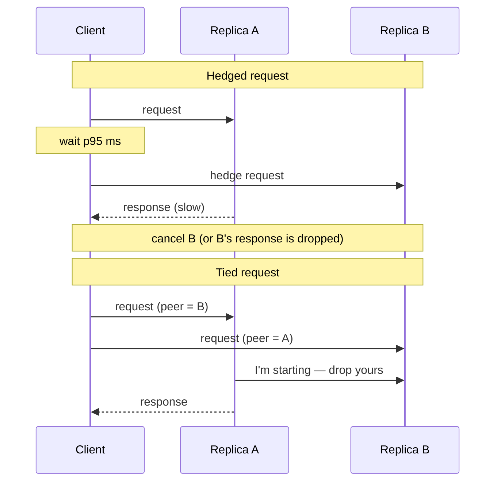

# Performance Budgets and Latency — Tail Latency and Coordinated Omission

**Date:** 2026-04-26 | **Updated:** 2026-04-26
**Tags:** `system-design` `performance` `latency` `observability`

## Table of Contents

- [Summary](#summary)
- [Why Averages Lie](#why-averages-lie)
- [Percentiles — p50, p95, p99, p99.9](#percentiles--p50-p95-p99-p999)
- [Tail Amplification at Fan-Out N](#tail-amplification-at-fan-out-n)
- [Coordinated Omission — The Measurement Bug That Hides Tails](#coordinated-omission--the-measurement-bug-that-hides-tails)
- [HdrHistogram — Recording Latencies Without Lying](#hdrhistogram--recording-latencies-without-lying)
- [Hedged Requests and Tied Requests](#hedged-requests-and-tied-requests)
- [Request-Bound vs Handler-Time](#request-bound-vs-handler-time)
- [Latency SLO Sizing Math](#latency-slo-sizing-math)
- [Percentile Composition Is Not Additive](#percentile-composition-is-not-additive)
- [Trade-offs](#trade-offs)
- [Code Examples](#code-examples)
  - [HdrHistogram Usage in Python](#hdrhistogram-usage-in-python)
  - [Fan-Out Latency Simulation](#fan-out-latency-simulation)
- [Real-World Uses](#real-world-uses)
- [Anti-Patterns](#anti-patterns)
- [Related](#related)
- [References](#references)

## Summary

The single most common mistake in performance engineering is reasoning about latency with averages. Real systems have **multimodal, heavy-tailed** latency distributions — a fast path for cache hits, a slow path for cold lookups, a glacial path for GC pauses, lock contention, retries, or queue saturation. The average tells you nothing about the worst experience your users have. Worse, when a user request fans out to N backends, the user sees the **slowest** of N — so a 1-in-100 backend slowdown becomes a near-certainty at fan-out 100. This doc covers the percentile vocabulary you need (p50/p95/p99/p99.9), why p99 dominates fan-out systems (Dean & Barroso, "The Tail at Scale"), the **coordinated omission** bug that makes most load-test results worthless (Gil Tene's critique), how HdrHistogram fixes it, hedged and tied requests as countermeasures, and the math for sizing latency SLOs without fooling yourself.

## Why Averages Lie

Imagine a service whose response time is measured for 1,000 requests:

- 990 of them complete in 5 ms.
- 10 of them complete in 2,000 ms (a stop-the-world GC, a slow disk seek, a retry).

Mean latency: `(990 × 5 + 10 × 2000) / 1000 = 24.95 ms`. Median: 5 ms.

Neither number describes what users experienced. **990 users got 5 ms, and 10 users got 2 seconds.** The mean is a meaningless number sitting between two clusters that no individual ever saw. This is what "multimodal distribution" means in practice.

```text
count
 ^
 |  ###############
 |  ###############        <-- fast path (cache hit)
 |  ###############
 |  ###############
 |
 |                                              ##  <-- slow path (GC, retry)
 |                                              ##
 +--+--+--+--+--+--+--+--+--+--+--+--+--+--+--> latency
   0  5 10                                  2000 ms
                       ^
                       mean ≈ 25 ms (describes nobody)
```

Real production latency distributions are almost always shaped like this:

- A **fast mode** for the happy path.
- A **secondary mode** for cache miss, cold connection, or contended lock.
- A **long tail** stretching out to seconds — driven by GC, scheduler preemption, network microbursts, retries, deadline-bound timeouts, kernel page-cache eviction, queueing under load.

When you see "average response time", treat it as a smell. Ask for the histogram or the percentiles.

## Percentiles — p50, p95, p99, p99.9

A **percentile** `pX` is the value below which `X%` of observations fall. For latency:

- **p50 (median)** — half the users experienced this latency or less. It is essentially "the typical user".
- **p95** — 95% of users were faster than this; the slowest 5% were slower.
- **p99** — 1% of users were slower. At 1,000 requests/sec, that's **600 users per minute** experiencing this latency or worse.
- **p99.9** — 1 in 1,000 users. At Twitter or YouTube scale this is millions of users per day.
- **p99.99** — 1 in 10,000. The realm where pathological GC, kernel scheduling, and hardware faults dominate.

```text
percentile        what it tells you                       at 1k QPS, # of users / hour
-----------       --------------------------------       -----------------------------
p50               typical user                            1.8M happy users
p95               edge of normal                          180,000 users at this or worse
p99               your noisy-neighbor / GC zone            36,000 users at this or worse
p99.9             pathology — heap dump, kernel stalls       3,600 users
p99.99            black-swan land                              360 users
```

A useful mental model from Amazon: **the p99 is your service's actual personality**. The p50 is what your dashboards show; the p99 is what your angry users tweet about.

## Tail Amplification at Fan-Out N

This is the single most important result in modern latency engineering. From Jeff Dean and Luiz Barroso, ["The Tail at Scale"](https://research.google/pubs/the-tail-at-scale/) (CACM 2013):

> "If a server typically responds in 10 ms but with 1% probability takes more than one second, and a user request must wait for all 100 servers in parallel to return, then 63% of user requests will take more than one second."

The math: if each subrequest independently has probability `p` of being **fast** (below some threshold), the probability that **all N** subrequests are fast is `p^N`. So the probability that **at least one is slow** is `1 - p^N`.

| Per-backend p99 slow rate | Fan-out N | Probability the user sees the slow tail |
|----|----|----|
| 1% | 1 | 1% |
| 1% | 10 | 9.6% |
| 1% | 50 | 39.5% |
| 1% | 100 | 63.4% |
| 1% | 500 | 99.3% |
| 0.1% | 100 | 9.5% |
| 0.1% | 1000 | 63.2% |

```mermaid
graph TD
    U[User request] --> R[Root / aggregator]
    R --> S1[Backend 1]
    R --> S2[Backend 2]
    R --> S3[Backend 3]
    R --> Sn[Backend ... N]
    S1 --> R2[Wait for ALL]
    S2 --> R2
    S3 --> R2
    Sn --> R2
    R2 --> U2[User sees<br/>max(S1..SN)]
```

The user-visible latency is the **maximum** of N backend latencies, not the average. This is why **p99 of a single backend determines p50 of a high-fanout request**. If your search query touches 100 shards, and each shard has p99 = 1 s, your p50 user query is more than 1 s. The mean of each shard could be 10 ms; it doesn't matter.

**Implication:** in any fan-out architecture (search, sharded reads, microservice graphs, scatter-gather joins), the only latency number that matters is the **tail** of the leaf services. Improving p50 is irrelevant; you must improve p99 — or design around it (see hedged requests below).

## Coordinated Omission — The Measurement Bug That Hides Tails

Coordinated omission is a measurement error that causes nearly every naive load test to **dramatically understate** tail latency. Identified and named by Gil Tene (creator of HdrHistogram and Azul Zing), the failure mode looks like this:

```pseudocode
// Broken load-test loop (DO NOT WRITE THIS)
for each request:
  start = now()
  send_request()
  wait_for_response()
  duration = now() - start
  histogram.record(duration)
  sleep(target_interval - duration)   // try to maintain rate
```

The bug: when the server stalls for 10 seconds, the load generator stalls too. It records **one** 10-second sample, then resumes — but it has silently skipped sending the 10,000 requests that *should* have been issued during the stall. Those 10,000 requests, which would all have observed 10-second-class queueing latency, are never recorded.

```text
intended schedule:   |||||||||||||||||||||||||||||||||
                     0  1  2  3  4  5  6  7  8  9 10 s

server stalls:       <----------- 10s stall ------------->
recorded by loop:    |                                     |
                     0                                     10 s
                     ^                                     ^
                     one big sample                        resumes here

reality (what users see if they had been sending requests during the stall):
                     |||||| every queued request observes
                     ||||||  multi-second wait, all dropped
                     ||||||  from the histogram
```

The histogram now reports p99 of "a few-ms most of the time", with one outlier at 10 s — the long-running queue is **invisible**. Tene's talk ["How NOT to Measure Latency"](https://www.youtube.com/watch?v=lJ8ydIuPFeU) shows real-world examples where coordinated omission hides 4 orders of magnitude of tail latency.

**The fixes:**

1. **Decouple load generation from response timing.** Schedule requests at fixed wall-clock times; do not sleep based on response time. If a request was due at `t = 5.0 s` and finally completed at `t = 8.0 s`, record its latency as **3 seconds**, not as the time from send to receive.
2. **Compensate retroactively.** When a sample is X times the expected interval, synthesize the missing samples in the histogram (HdrHistogram does this with `recordValueWithExpectedInterval`).
3. **Use open-loop load generators.** Tools like wrk2, k6 (with constant-arrival-rate executors), and Vegeta drive a fixed request rate independent of response time. Closed-loop tools like Apache Bench, JMeter (default config), and naive Locust scripts will lie to you.

A mental model: a load generator that respects coordinated omission acts like a queue of users arriving at fixed intervals at a deli counter. If the deli is closed for 10 minutes, it does not mean 10 minutes of zero customers — it means 10 minutes of customers piling up, and every one of them experiences at least the wait they accumulated in the queue.

## HdrHistogram — Recording Latencies Without Lying

HdrHistogram (High Dynamic Range Histogram), by Gil Tene, is the de-facto standard for recording latency in performance-sensitive systems. It addresses three problems naive recording fails on:

1. **Range** — latency spans 9 orders of magnitude (10 ns → 10 s). A linear bucket array is wasteful; a log-linear scheme keeps constant **relative precision** (e.g. always within 0.1%) at any magnitude.
2. **Memory** — fixed-size bucket arrays at modest precision (3 significant digits) cover nanoseconds-to-hours in a few KB.
3. **Coordinated omission** — the API exposes `recordValueWithExpectedInterval(value, expectedInterval)` which back-fills synthetic samples when a single sample exceeds the expected service interval.

Implementations exist for Java (the original), Go, Rust, Python, C, .NET, and most other ecosystems. Critical operations:

- `record_value(v)` — add a single observation.
- `record_corrected_value(v, expected_interval)` — record while compensating for coordinated omission.
- `value_at_percentile(p)` — query a percentile from the recorded data.
- Merge two histograms losslessly across processes/machines.

It is the only histogram type you should use for latency in production. Rolling your own with linear buckets, with average-of-bucket-midpoint queries, or with a fixed-percentile sketch is almost always wrong.

## Hedged Requests and Tied Requests

If you cannot make every backend fast at p99, you can make the **fan-out** itself robust to tail outliers. From Dean & Barroso's same paper:

### Hedged Requests

Send the request to **one** backend. After the **p95** has elapsed without a response, send a duplicate to a second replica. Take whichever returns first; cancel the other.

- Cost: <5% extra requests (only the slow tail triggers the second request).
- Benefit: the user-visible p99 collapses toward the p95.
- Trade: idempotence required (the work might run twice); cancellation must actually free server resources, or you've made things worse under load.

### Tied Requests

Send the request to **two** replicas immediately, but tell each replica which other replica also has the request. When one starts processing, it tells the other to drop it. The "tie" is broken by whichever queue empties first.

- Cost: ~2x request load on the network, but minimal extra CPU because cancellation usually wins before processing starts.
- Benefit: removes queueing delay completely from the tail; the user gets the latency of whichever replica had the shortest queue.
- Used in Google's BigTable client and several Spanner read paths.



### Backup Requests with Cross-Server Cancellation

A more aggressive variant: send to N replicas, take the first response, cancel the rest. Costly under load but powerful for low-volume, latency-critical paths.

## Request-Bound vs Handler-Time

Two distinct numbers get conflated and shouldn't be:

- **Request-bound latency** (a.k.a. wall-clock or end-to-end): time from when the request was *issued* (or *should have been issued*, in the coordinated-omission-correct sense) to when the response was *fully consumed by the client*. Includes network, queueing, processing, and response transit. **This is what users experience.**
- **Handler time** (a.k.a. service time, processing time): time the server spent actively processing the request, from `accept()` to `respond()`. Does **not** include client-side queueing or network.

Why the distinction matters:

- A handler with p99 = 5 ms can produce request-bound p99 = 2 s under load if requests are queued behind a saturated worker pool (Little's Law: queue length = arrival rate × wait time).
- Server-side instrumentation typically reports handler time. Client-side or RUM (Real User Monitoring) data reports request-bound. **They diverge dramatically under load.**
- An SLO of "p99 < 100 ms" is meaningless without specifying which clock. A handler-time SLO is gameable; a request-bound SLO captures user experience.

Always ask: *whose clock?* and *measured where?* In distributed traces, the root span is the only span that captures end-to-end latency; any leaf span is handler-time only.

## Latency SLO Sizing Math

When sizing latency SLOs, the dominant constraint is fan-out and per-component error budgets.

**Per-call budget under fan-out:** if the user-visible p99 SLO is `T` and the request fans out sequentially through `K` services on the critical path, each service's p99 budget is roughly `T / K`. A 200 ms p99 SLO with 5 sequential RPCs leaves **40 ms p99 per hop** — including network, queueing, and processing. This is brutal at any reasonable scale.

**Parallel fan-out budget:** if `N` calls fan out *in parallel* and the result waits on **all** of them, the user sees `max` of N samples. To hit user-visible p99 of T, each backend needs roughly `pX < T` where `X = (1 - 0.01)^(1/N) × 100`.

| User-visible target | Fan-out N | Required per-backend percentile |
|----|----|----|
| p99 | 10 | p99.9 |
| p99 | 100 | p99.99 |
| p99 | 1000 | p99.999 |

Translation: if you want **p99 < 200 ms** on a query that scatters to 100 shards, **every shard's p99.99** must be below 200 ms. p99.99 is exactly where pathological tails live (GC, kernel jitter, retries). This is why hedged/tied requests are mandatory above ~50-way fan-out.

**Error budgets compose:** if your service has a 99.9% availability SLO and depends on 5 services each at 99.9%, your effective worst-case availability is `0.999^5 ≈ 99.5%`. The same principle applies to latency budgets — every layer below you costs slack.

## Percentile Composition Is Not Additive

A subtle and frequent error: people compute the p99 of a multi-stage pipeline by summing the p99 of each stage.

> "p99 of stage A is 10 ms, p99 of stage B is 20 ms, so p99 of A then B is 30 ms."

This is **wrong** unless the slow events in A and B are perfectly correlated. In general:

- The p99 of a sum of independent random variables is **less** than the sum of the p99s, because slow A and slow B rarely co-occur.
- The p50 of a sum is approximately the sum of the p50s only when distributions are reasonably symmetric — and latency distributions are *not* symmetric.

**You cannot algebraically combine percentiles.** To compose latencies of two stages, you must either:

1. Combine the **histograms** by sampling, or
2. Combine the **raw measurements** of end-to-end latency directly.

Equally wrong: averaging averages across heterogeneous traffic ("the average p99 across all endpoints is X"). The correct number is the p99 of the merged dataset, which requires keeping the histograms (or using HdrHistogram's lossless merge), not the summary statistics.

## Trade-offs

| Decision | Improves | Costs |
|----|----|----|
| Add hedged requests | User-visible p99 → p95 | ~5% extra backend load; idempotence required |
| Add tied requests | Tail eliminated | ~2x request RPCs; protocol complexity |
| Drop fan-out (replicate, denormalize) | Avoid tail amplification | Storage cost, write amplification, consistency complexity |
| Track p99.9 instead of p99 | Captures real pathology | Needs HdrHistogram-grade precision; noisy at low traffic |
| Open-loop load testing | Honest tail measurement | Must scale generator; cannot reuse bash/curl loops |
| HdrHistogram everywhere | Lossless percentiles | A few KB per metric; integration cost |
| Strict per-hop SLOs | Predictable budgets | Easy to game with handler-time clocks |

## Code Examples

### HdrHistogram Usage in Python

The `hdrh` library (`pip install hdrh`) provides the canonical Python implementation.

```python
"""
HdrHistogram — recording latencies with coordinated-omission compensation.

Demonstrates the pitfall: a naive loop hides the tail; the corrected
recording surfaces it.
"""
from __future__ import annotations

import time
from hdrh.histogram import HdrHistogram

# Range: 1 microsecond .. 60 seconds, with 3 significant digits of precision
LOWEST_DISCERNIBLE_USEC = 1
HIGHEST_TRACKABLE_USEC = 60 * 1_000_000
SIGNIFICANT_FIGURES = 3


def make_histogram() -> HdrHistogram:
    return HdrHistogram(
        LOWEST_DISCERNIBLE_USEC,
        HIGHEST_TRACKABLE_USEC,
        SIGNIFICANT_FIGURES,
    )


def measure_naive(workload, iterations: int) -> HdrHistogram:
    """The wrong way: records only what the loop observes."""
    h = make_histogram()
    for _ in range(iterations):
        start = time.perf_counter_ns()
        workload()
        elapsed_usec = (time.perf_counter_ns() - start) // 1_000
        h.record_value(elapsed_usec)
    return h


def measure_corrected(workload, iterations: int, expected_interval_usec: int) -> HdrHistogram:
    """The right way: compensate for coordinated omission.

    If a single observation is N times the expected interval, HdrHistogram
    synthesizes the missing samples that would have piled up during the stall.
    """
    h = make_histogram()
    for _ in range(iterations):
        start = time.perf_counter_ns()
        workload()
        elapsed_usec = (time.perf_counter_ns() - start) // 1_000
        h.record_corrected_value(elapsed_usec, expected_interval_usec)
    return h


def report(h: HdrHistogram, label: str) -> None:
    print(f"\n{label}")
    for p in (50.0, 95.0, 99.0, 99.9, 99.99, 100.0):
        print(f"  p{p:<6} = {h.get_value_at_percentile(p) / 1000:>10.3f} ms")
    print(f"  total samples = {h.get_total_count()}")


if __name__ == "__main__":
    # Simulate a service with rare 500 ms stalls
    import random

    def jittery_call() -> None:
        if random.random() < 0.001:  # 0.1% of calls stall
            time.sleep(0.5)
        else:
            time.sleep(0.001)  # 1 ms typical

    EXPECTED_INTERVAL_USEC = 1_000  # we intend to issue requests every 1 ms

    naive = measure_naive(jittery_call, iterations=5_000)
    corrected = measure_corrected(jittery_call, iterations=5_000, expected_interval_usec=EXPECTED_INTERVAL_USEC)

    report(naive, "Naive (coordinated omission)")
    report(corrected, "Corrected (compensated)")
```

The corrected histogram reports a far worse p99.9 than the naive one — because the naive loop "missed" the queue of requests that would have built up during each 500 ms stall.

### Fan-Out Latency Simulation

```python
"""
Fan-out tail amplification — Monte Carlo of the Dean & Barroso result.

Each backend has a heavy-tailed latency distribution. The user request
fans out to N backends in parallel and sees max(latency_i). We compute
the user-visible p50, p95, p99 as a function of N.
"""
from __future__ import annotations

import random
from statistics import quantiles


def sample_backend_latency_ms() -> float:
    """Bimodal: 99% fast, 1% slow."""
    if random.random() < 0.01:
        # Slow tail: log-normal ~ 100..2000 ms
        return random.lognormvariate(mu=6.0, sigma=0.5)
    return random.gauss(mu=10.0, sigma=2.0)


def user_request_latency_ms(fanout: int) -> float:
    """User waits for ALL N parallel backends — sees the max."""
    return max(sample_backend_latency_ms() for _ in range(fanout))


def percentiles(samples: list[float], ps: tuple[float, ...]) -> dict[float, float]:
    sorted_s = sorted(samples)
    n = len(sorted_s)
    return {p: sorted_s[min(n - 1, int(p / 100 * n))] for p in ps}


def simulate(fanout: int, trials: int = 50_000) -> dict[float, float]:
    samples = [user_request_latency_ms(fanout) for _ in range(trials)]
    return percentiles(samples, ps=(50.0, 95.0, 99.0, 99.9))


if __name__ == "__main__":
    print(f"{'N':>4}  {'p50':>10}  {'p95':>10}  {'p99':>10}  {'p99.9':>10}")
    for n in (1, 5, 10, 50, 100, 500):
        ps = simulate(n)
        print(
            f"{n:>4}  "
            f"{ps[50.0]:>8.1f} ms  "
            f"{ps[95.0]:>8.1f} ms  "
            f"{ps[99.0]:>8.1f} ms  "
            f"{ps[99.9]:>8.1f} ms"
        )
```

Running this prints something like:

```text
   N         p50         p95         p99       p99.9
   1     10.1 ms     13.3 ms    430.5 ms   1100.0 ms
   5     11.6 ms    230.0 ms    700.0 ms   1300.0 ms
  10     13.0 ms    420.0 ms    900.0 ms   1500.0 ms
  50     22.0 ms    700.0 ms   1100.0 ms   1700.0 ms
 100     38.0 ms    850.0 ms   1200.0 ms   1900.0 ms
 500    150.0 ms   1100.0 ms   1500.0 ms   2200.0 ms
```

The p50 of the user request **degrades steadily with N**. By N = 100, the typical user is seeing the slow tail of a single backend. This is what "the tail at scale" looks like.

## Real-World Uses

- **Google search and Bigtable** — the original setting for hedged and tied requests; backup-with-cancel reduced p99 by 30-40% in published numbers.
- **Cassandra speculative retry** — `speculative_retry: 99.0PERCENTILE` triggers a hedge to another replica when the primary exceeds its p99 budget; documented in the Cassandra read path.
- **Amazon DynamoDB** and **AWS Aurora** — internal SLOs are written in terms of p99/p99.9; client SDKs implement adaptive retry budgets with hedging.
- **HdrHistogram in Netflix, Twitter, LinkedIn** — adopted across JVM-heavy infra; Netflix's Atlas and Twitter's Finagle both use HdrHistogram-style summaries.
- **gRPC and Envoy** — provide bucket-based histograms that are Prometheus-compatible but limited; teams that need p99.9-class precision route through HdrHistogram and export quantiles directly.
- **wrk2, k6 (constant-arrival-rate), Vegeta** — open-loop load generators that respect coordinated omission. Apache Bench (`ab`) and the default JMeter configuration do not.

## Anti-Patterns

### Reporting Mean Latency

If your dashboards show mean response time, your dashboards lie. The mean is dominated by the tail in heavy-tailed distributions — a single 30-second request raises the mean of a million 1 ms requests by 30 µs while telling you nothing about the user who waited 30 seconds. Always show p50/p95/p99 (and p99.9 at scale).

### Averaging Averages

Computing "average p99 across all endpoints" is mathematically meaningless. The p99 of two endpoints' merged traffic is not the average of their p99s — it depends on the relative volumes. The fix: keep the histograms, merge them losslessly (HdrHistogram does this), and query p99 from the merged result.

### Ignoring p99.9 at High Fan-Out

Service teams optimize p99 because that's their dashboard. But the orchestrator three layers up has a fan-out of 200 — and the user-visible p99 is sensitive to the leaf p99.99, not the leaf p99. You need to *budget for the percentile your callers will see*, which depends on how the system composes.

### Closed-Loop Load Tests

`for i in $(seq 1 N); do curl ...; done` is not a load test. It is a sequential trickle that is silent during stalls and produces wildly optimistic tail numbers. Use open-loop generators (wrk2, k6 constant-arrival-rate, Vegeta) that emit at a fixed rate independent of response time.

### Bucket Histograms with Linear Buckets

Linear-bucketed histograms (`[0,10), [10,20), [20,30) ...`) waste resolution at the small end and lose precision at the large end. Latency spans many orders of magnitude — use HdrHistogram or a log-linear sketch (DDSketch, t-digest with caveats).

### Sampling Out the Tail

"We sample 1% of traces to save money" is the right call for tracing volume — but if your sampler is uniform, the slow tail is sampled at 1%, and you'll lose the detail you actually care about. Use **tail-based sampling**: keep all slow traces, sample fast ones. Datadog, Tempo, and most production tracing stacks support this.

### "p99 of the Last Five Minutes"

Quantiles cannot be averaged across windows the way means can. Reporting a 5-minute p99 of 1-minute p99s is wrong. Either keep raw histograms per minute and merge them, or compute the p99 over the raw measurements in the 5-minute window directly.

### Trusting `time` Around the Whole Process

`time ./loadtest` measures wall-clock, not per-request latency. A user-perceived latency story requires per-request timing recorded into a histogram, not aggregate elapsed time of a benchmark.

## Related

- [Tracing, Metrics, and Logs — Three Pillars Done Right](./tracing-metrics-logs.md) _(planned)_ — where percentile metrics fit alongside distributed traces and structured logs; tail-based sampling for slow-trace retention
- [Capacity Planning and Load Testing](./capacity-planning-and-load-testing.md) _(planned)_ — open-loop load generation, headroom math, the relationship between utilization and queueing latency (Little's Law)
- [Retry Strategies — Backoff, Jitter, Hedging, Budgets](../reliability/retry-strategies.md) _(planned)_ — hedged requests as a reliability mechanism; how retry budgets prevent retry storms from amplifying tails
- [Replication Patterns — Primary-Replica, Multi-Primary, Quorum](../scalability/replication-patterns.md) _(planned)_ — replication enables hedged/tied reads; quorum reads naturally pay tail costs
- [Consensus — Raft and Paxos at a Conceptual Level](../data-consistency/consensus-raft-and-paxos.md) — quorum writes inherit max-of-N tail behavior on the critical path

## References

- Jeffrey Dean and Luiz André Barroso, ["The Tail at Scale"](https://research.google/pubs/the-tail-at-scale/), Communications of the ACM, February 2013 — the canonical paper on tail amplification, hedged requests, and tied requests at Google scale.
- Gil Tene, ["How NOT to Measure Latency"](https://www.youtube.com/watch?v=lJ8ydIuPFeU) (Strange Loop talk) — the talk that named coordinated omission and shows real-world cases where tools lie by 4 orders of magnitude.
- [HdrHistogram — High Dynamic Range Histogram](https://github.com/HdrHistogram/HdrHistogram) — the canonical implementation, with API docs and the `recordCorrectedValue` family for coordinated-omission compensation.
- Betsy Beyer et al. (eds.), ["Site Reliability Engineering: How Google Runs Production Systems"](https://sre.google/sre-book/service-level-objectives/) — chapter "Service Level Objectives" formalizes percentile-based SLOs and error budgets.
- Brendan Gregg, ["Systems Performance: Enterprise and the Cloud" (2nd ed.)](https://www.brendangregg.com/sysperfbook.html) — chapters on USE method, latency distributions, and frequency-trail visualization.
- Theo Schlossnagle, ["The Problem with Percentiles — Aggregation Brings Aggravation"](https://www.circonus.com/2018/11/the-problem-with-percentiles-aggregation-brings-aggravation/) — why you cannot average percentiles across windows or services.
- [wrk2 — A Constant-Throughput, Coordinated-Omission-Correcting HTTP Load Tester](https://github.com/giltene/wrk2) — Tene's fork of wrk, the reference open-loop generator.
- Heinrich Hartmann, ["Statistics for Engineers"](https://www.heinrichhartmann.com/posts/statistics-for-engineers/) — practical guide to percentile math, histograms, and what NOT to compute about them.
