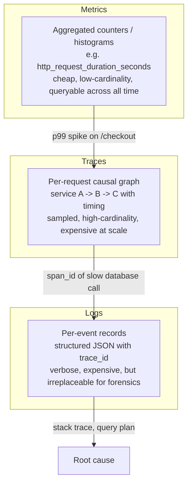
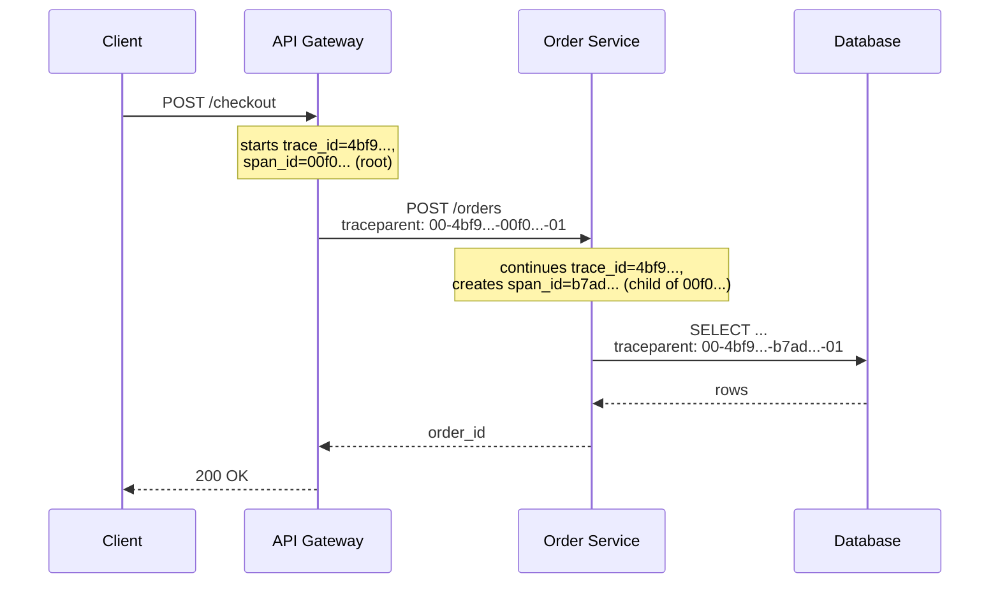
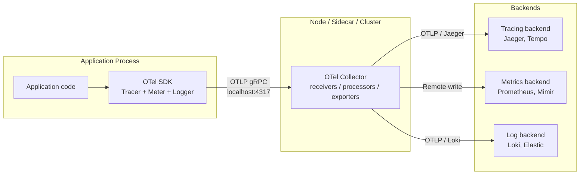

# Distributed Tracing, Metrics, and Logs — The Three Pillars

**Date:** 2026-04-26 | **Updated:** 2026-04-26
**Tags:** `system-design` `observability` `opentelemetry` `tracing`

## Table of Contents

- [Summary](#summary)
- [Overview — The Three Pillars and Why They Need Each Other](#overview--the-three-pillars-and-why-they-need-each-other)
- [Key Concepts](#key-concepts)
  - [Trace and Span Model](#trace-and-span-model)
  - [W3C Trace Context Propagation](#w3c-trace-context-propagation)
  - [Metrics — Counters, Gauges, Histograms](#metrics--counters-gauges-histograms)
  - [Cardinality Traps](#cardinality-traps)
  - [Logs — Structured Fields and Correlation](#logs--structured-fields-and-correlation)
  - [Span Events vs Logs](#span-events-vs-logs)
  - [OTLP and the Collector Model](#otlp-and-the-collector-model)
- [Trade-offs — Sampling, Cost, and Fidelity](#trade-offs--sampling-cost-and-fidelity)
  - [Head-Based Sampling](#head-based-sampling)
  - [Tail-Based Sampling](#tail-based-sampling)
  - [Probabilistic vs Rate-Limiting vs Adaptive](#probabilistic-vs-rate-limiting-vs-adaptive)
  - [Cost Model](#cost-model)
- [Code Examples](#code-examples)
  - [OpenTelemetry Python Instrumentation](#opentelemetry-python-instrumentation)
  - [Manual W3C `traceparent` Propagation](#manual-w3c-traceparent-propagation)
  - [Metric Cardinality — Right and Wrong](#metric-cardinality--right-and-wrong)
- [Real-World Uses](#real-world-uses)
- [Anti-Patterns](#anti-patterns)
- [Comparison with Older Systems — Zipkin and Jaeger](#comparison-with-older-systems--zipkin-and-jaeger)
- [Related](#related)
- [References](#references)

## Summary

Observability rests on three signals: **traces** (causally-linked spans across services), **metrics** (numeric time series for rates, gauges, and distributions), and **logs** (timestamped, ideally structured event records). The 2010s-era idea of "three pillars" treated them as separate systems with separate vendors. The modern model — codified by **OpenTelemetry (OTel)** — treats them as one data model with shared identifiers (`trace_id`, `span_id`, resource attributes) so a single click pivots from a slow trace to the metric showing that endpoint's p99 to the structured logs emitted during that exact span. This doc covers OTel's data model, W3C `traceparent` propagation, the cardinality traps that destroy time-series databases, head- vs tail-based sampling, OTLP, the SDK + Collector architecture, and how all of this evolved out of Zipkin and Jaeger.

## Overview — The Three Pillars and Why They Need Each Other

A request flows through a distributed system. Something is wrong. The user reports `p99 = 4 seconds, expected 200 ms`. You need to answer three questions:

1. **What's broken right now?** — a quantitative view, aggregated across all requests. **Metrics**.
2. **Where is the latency?** — a per-request view showing which service or downstream call took the time. **Traces**.
3. **Why did this specific request fail?** — a free-form record of what the code actually did and saw. **Logs**.



Each pillar answers a different question; together they cover the loop **detect → narrow → diagnose**. The crucial property is that they share identifiers. Every log emitted during a span carries that span's `trace_id` and `span_id`. Every metric exemplar can point to a representative trace. This is **correlation**, and it is what turns three disconnected feeds into one observability system.

OpenTelemetry is the project — under the CNCF since 2019 — that defines the unified specification for all three signals. It is the merger of OpenTracing (tracing API) and OpenCensus (metrics + tracing). The point is **vendor neutrality**: instrument once with OTel, then export to Jaeger, Tempo, Honeycomb, Datadog, New Relic, or your own backend, without re-instrumenting application code.

## Key Concepts

### Trace and Span Model

A **trace** is the directed acyclic graph (DAG) of causally-related work for a single logical operation — typically one user request as it crosses services, queues, and async tasks. Each unit of work is a **span**.

A span has:

- **`trace_id`** — 16 bytes, identical across every span in the same trace.
- **`span_id`** — 8 bytes, unique to this span.
- **`parent_span_id`** — links to the span that caused this one. The root span has none.
- **`name`** — the operation, e.g. `HTTP GET /api/orders`, `db.query`, `redis.get`.
- **start time and end time** — wall-clock timestamps, nanosecond precision.
- **`attributes`** — typed key-value tags about *what* happened: `http.status_code=200`, `db.system=postgresql`, `user.tier=enterprise`. Standardized via OTel **semantic conventions**.
- **`status`** — `Ok`, `Error`, or `Unset`.
- **`events`** — timestamped points within the span (see [Span Events vs Logs](#span-events-vs-logs)).
- **`links`** — references to other spans in *different* traces (used for batch jobs that fan in).
- **`resource`** — attributes about the *emitting process*: `service.name`, `service.version`, `host.name`, `k8s.pod.name`. Set once per process, not per span.

```text
Trace 9af1...

[ root span: HTTP POST /checkout ]                                500 ms
  ├── [ auth.verify_token ]                              5 ms
  ├── [ cart.fetch ]                                            120 ms
  │     └── [ db.query SELECT * FROM cart_items ]               110 ms
  ├── [ inventory.check ]                                                  80 ms
  │     └── [ http POST inventory-svc/reserve ]                            75 ms
  └── [ payment.charge ]                                                                280 ms
        └── [ http POST stripe/charges ]                                                270 ms
```

The root span's duration is the user-facing latency. The waterfall of children shows where time was spent. **The single most useful artifact in any incident.**

### W3C Trace Context Propagation

For a trace to span service boundaries, the upstream context must travel with the request. **W3C Trace Context** (Recommendation, Feb 2020) standardizes this with two HTTP headers:

```text
traceparent: 00-4bf92f3577b34da6a3ce929d0e0e4736-00f067aa0ba902b7-01
             ^  ^                                ^                ^
             │  │                                │                └─ trace flags (01 = sampled)
             │  │                                └─ parent span_id (8 bytes hex)
             │  └─ trace_id (16 bytes hex)
             └─ version (00)

tracestate: vendor1=opaqueValue,vendor2=otherValue
```

`traceparent` carries the IDs the next service needs to continue the trace. `tracestate` is a vendor-extensible key-value list — it lets multiple tracing systems coexist without overwriting each other.

Before W3C Trace Context, every vendor invented its own headers: Zipkin used `X-B3-TraceId` / `X-B3-SpanId` (the "B3" headers), Jaeger used `uber-trace-id`, Datadog used `x-datadog-trace-id`, AWS X-Ray used `X-Amzn-Trace-Id`. A request crossing systems with different conventions would simply lose its context. W3C Trace Context fixed this — every modern SDK emits and accepts `traceparent` by default.



Propagation is the responsibility of the **instrumentation** layer — typically auto-instrumentation libraries that hook HTTP clients/servers, gRPC, Kafka, and database drivers. You should almost never set `traceparent` by hand; let the SDK do it.

### Metrics — Counters, Gauges, Histograms

OTel metrics distinguish three core **instruments**:

- **Counter** — monotonically increasing value. `http.server.requests`, `bytes.sent`. Backends compute rates from the deltas. Never decreases (use `UpDownCounter` if it can).
- **Gauge** — instantaneous value. `process.memory.usage`, `queue.depth`, `cpu.utilization`. Sampled at each export interval.
- **Histogram** — distribution of recorded values. `http.server.duration`, `db.query.duration`. Each measurement is bucketed; you can compute p50, p95, p99 server-side.

Two histogram flavors:

- **Explicit-bucket histograms** — fixed bucket boundaries (e.g. `[5, 10, 25, 50, 100, 250, 500, 1000, 2500, 5000, 10000]` ms). Cheap, but quantile accuracy depends on bucket choice.
- **Exponential histograms** (a.k.a. native histograms in Prometheus) — bucket boundaries are powers of a base, automatically scaled. Compact, accurate quantiles across a wide range. Newer, becoming default in OTel SDKs.

A metric data point has:

- **name** — e.g. `http.server.duration`.
- **value(s)** — for histograms, count + sum + bucket counts.
- **attributes** — labels: `http.method`, `http.route`, `http.status_code`. *This is where careers are ended.* See cardinality.
- **timestamp** and **start_timestamp** (for cumulative counters).
- **resource** — same as for spans: `service.name`, `host.name`, etc.

### Cardinality Traps

A **time series** is uniquely identified by `(metric_name, all attribute key-value pairs, resource attributes)`. Every distinct combination is a *new* time series. Time-series databases (Prometheus, Mimir, VictoriaMetrics, InfluxDB, M3) cost money roughly linearly in **active series count**.

The trap: a label that takes many distinct values multiplies the series count by that many.

```text
http.server.duration{
  method="GET",          # 5 values
  route="/api/orders",   # 100 values
  status_code="200",     # 5 values
  user_id="u_4f8a..."    # 50 MILLION values  <-- DEATH
}
```

5 × 100 × 5 × 50,000,000 = 125 **billion** series, each with its own histogram buckets. Your Prometheus instance OOMs in minutes; your vendor bill quadruples in a day. This is the single most common observability disaster.

**Rules of thumb:**

| Acceptable label values | Unacceptable label values |
|---|---|
| HTTP method (~5) | user_id |
| HTTP route template `/api/orders/{id}` (10s–100s) | full URL with query params |
| Status code (~10) | trace_id |
| Region / AZ (~10s) | request_id |
| Tenant *bucket* (free / pro / enterprise) | individual customer email |
| Service version (a few at a time) | timestamp / minute |

If you need per-user analysis, that is a job for **traces with attributes** (sampled, indexed differently) or **logs** (full-text indexed) — not metrics.

OTel SDKs offer **views** to drop or rename attributes before export, which is a useful safety net when you can't fix the instrumentation immediately.

### Logs — Structured Fields and Correlation

A modern log line is a JSON object — never a free-form string. It has:

```json
{
  "timestamp": "2026-04-26T14:31:09.481Z",
  "severity": "ERROR",
  "service.name": "order-service",
  "service.version": "2.14.3",
  "trace_id": "4bf92f3577b34da6a3ce929d0e0e4736",
  "span_id": "00f067aa0ba902b7",
  "message": "payment authorization failed",
  "user.tier": "enterprise",
  "order.id": "o_7d3f...",
  "payment.gateway": "stripe",
  "error.type": "card_declined",
  "error.code": "insufficient_funds"
}
```

Three things matter:

1. **Structured fields**, not interpolated strings. `"user u_4f8a logged in from 10.0.0.1"` is unsearchable; `{user.id, source.ip}` is.
2. **`trace_id` and `span_id`** included on every line emitted during a span. This is what makes a log feed *correlated* — you can pivot from a slow trace directly to the logs that occurred during that trace.
3. **Resource attributes** (`service.name`, `service.version`, region, k8s pod) attached, ideally at the agent layer so application code stays simple.

OTel's logs API is, by design, a thin bridge over existing logging libraries (Python `logging`, Java SLF4J, JS `pino`, etc.). It does not try to replace them — it just provides a way to *attach* the active trace context and ship logs through the same Collector pipeline as traces and metrics.

### Span Events vs Logs

A **span event** is a timestamped, attribute-tagged note attached to a span:

```python
span.add_event("cache_miss", attributes={"key": "user:123", "size_bytes": 4096})
```

It looks like a log line and feels like a log line. **The difference is intent.** A span event lives inside the trace, is bounded by the span's lifetime, and travels with it through tail-based samplers. A log is independent — it has its own pipeline, its own retention, its own indexing.

Use **span events** for things that describe the lifecycle of *this specific operation* and that you'd want to see in the trace UI: cache hit/miss, retry attempt, validation failure, payload size at a checkpoint.

Use **logs** for things that need full-text search across *all* requests, large volumes (per-record audit logs, debug verbose), or events that don't belong to any single span (background jobs, GC events, startup).

When in doubt: span events for narrow, structured, in-trace context; logs for broad, searchable, out-of-trace records.

### OTLP and the Collector Model

**OTLP (OpenTelemetry Protocol)** is the wire format for all three signals — a Protobuf-defined gRPC and HTTP/JSON spec. Every modern backend speaks OTLP natively (Tempo, Jaeger 1.35+, Honeycomb, Grafana Cloud, Datadog, New Relic, Splunk, etc.) so you can switch vendors by changing one endpoint.

The architecture has two halves:



The **SDK** runs in your app: creates spans, records metrics, batches data, exports to a Collector via OTLP.

The **Collector** is a vendor-neutral binary deployed as a sidecar, a node-level agent (DaemonSet on Kubernetes), or a centralized gateway. It has **receivers** (OTLP, Prometheus, Jaeger, Zipkin, Kafka, ...), **processors** (batch, filter, sample, redact, enrich with k8s metadata), and **exporters** (every major backend). This is where you wire up tail-based sampling, drop noisy attributes, redact PII, route per-tenant.

The benefit is enormous: an SRE can change sampling rate, redact a label, or swap vendors by editing a Collector config — without redeploying every application. The application stays unchanged.

## Trade-offs — Sampling, Cost, and Fidelity

100% trace ingestion at scale is rarely possible. A 10k-RPS service emitting 50 spans per request emits **half a million spans per second** — at $0.50 per million spans (typical SaaS pricing) that is **$22k per day**. Sampling is not optional.

### Head-Based Sampling

Decide whether to keep the trace **at the root span**, before any work happens. Propagate the decision through `traceparent`'s flags byte (`-01` = sampled, `-00` = not sampled). All downstream services follow the upstream decision.

- **Pros:** simple, low-overhead, decentralized, no buffering. Works with vanilla SDKs.
- **Cons:** decision is made before you know whether the trace is interesting. Errors and slow requests are sampled at the same rate as healthy ones — exactly the opposite of what you want.

Common implementations:

- **Always-on / always-off** — for testing.
- **Probabilistic (e.g. 1%)** — keeps a uniform random sample.
- **Rate-limiting** (e.g. 100 traces/sec/service) — caps cost regardless of traffic.
- **Parent-based** — child services respect the upstream decision; only the root decides.

### Tail-Based Sampling

Buffer all spans for a trace for a few seconds *after* the root finishes, then decide whether to keep it based on the *complete* trace. Done in the **Collector**, not in the SDK.

```text
Policies: "keep if any span has error=true,
          OR root duration > 1 s,
          OR random 5%, capped at 1k traces/min/service"
```

- **Pros:** you can keep 100% of errors and slow requests while sampling normal traffic at 1%. Best signal-to-cost ratio for incident response.
- **Cons:** buffering memory and complexity. A trace's spans must all reach the *same* Collector instance — this requires consistent trace_id-based load balancing in front of the Collector tier (the OTel Collector has a `loadbalancing` exporter for exactly this).

Production teams typically run **tail-based sampling** for traces and **probabilistic + always-on for errors** for logs.

### Probabilistic vs Rate-Limiting vs Adaptive

- **Probabilistic** scales with traffic — 1% of 10 RPS is 0.1 traces/sec; 1% of 10k RPS is 100 traces/sec. Costs scale linearly.
- **Rate-limiting** caps cost but can starve low-traffic endpoints (one trace/minute means rare endpoints are invisible).
- **Adaptive** combines them — guarantee at least N traces/min per endpoint, cap at M traces/min total. Most production samplers (Jaeger remote sampler, AWS X-Ray) are adaptive.

### Cost Model

| Signal | Volume driver | Compression | Retention norm | Notable cost trap |
|---|---|---|---|---|
| Metrics | active series count × scrape interval | columnar, very good | 13 months (capacity planning) | high-cardinality labels |
| Traces | RPS × spans/request × sampling rate | OTLP Protobuf, decent | 7–30 days | unsampled debug envs |
| Logs | bytes × ingest rate | gzip / Zstd | 7–90 days hot, longer cold | unstructured stack traces, debug-level in production |

Spend roughly tracks: **logs > metrics > traces** in raw bytes. But cardinality makes metrics suddenly catastrophic; lack of structure makes logs slow to query; lack of sampling makes traces explode. Each pillar has a different failure mode.

## Code Examples

### OpenTelemetry Python Instrumentation

A minimal Python service exporting traces and metrics to a local Collector:

```python
# pip install opentelemetry-distro opentelemetry-exporter-otlp \
#             opentelemetry-instrumentation-flask \
#             opentelemetry-instrumentation-requests
import logging
from flask import Flask, request
import requests

from opentelemetry import trace, metrics
from opentelemetry.sdk.resources import Resource
from opentelemetry.sdk.trace import TracerProvider
from opentelemetry.sdk.trace.export import BatchSpanProcessor
from opentelemetry.sdk.metrics import MeterProvider
from opentelemetry.sdk.metrics.export import PeriodicExportingMetricReader
from opentelemetry.exporter.otlp.proto.grpc.trace_exporter import OTLPSpanExporter
from opentelemetry.exporter.otlp.proto.grpc.metric_exporter import OTLPMetricExporter
from opentelemetry.instrumentation.flask import FlaskInstrumentor
from opentelemetry.instrumentation.requests import RequestsInstrumentor
from opentelemetry.instrumentation.logging import LoggingInstrumentor

# 1. Resource — attached to every span, metric, and log
resource = Resource.create({
    "service.name": "order-service",
    "service.version": "2.14.3",
    "deployment.environment": "production",
})

# 2. Traces — OTLP export to local Collector at localhost:4317
trace.set_tracer_provider(TracerProvider(resource=resource))
trace.get_tracer_provider().add_span_processor(
    BatchSpanProcessor(OTLPSpanExporter(endpoint="localhost:4317", insecure=True))
)

# 3. Metrics — periodic export every 30 s
metrics.set_meter_provider(MeterProvider(
    resource=resource,
    metric_readers=[PeriodicExportingMetricReader(
        OTLPMetricExporter(endpoint="localhost:4317", insecure=True),
        export_interval_millis=30_000,
    )],
))

# 4. Logs — inject trace_id / span_id into stdlib logging
LoggingInstrumentor().instrument(set_logging_format=True)
logging.basicConfig(level=logging.INFO)

# 5. Auto-instrument Flask and the requests library
app = Flask(__name__)
FlaskInstrumentor().instrument_app(app)
RequestsInstrumentor().instrument()

tracer = trace.get_tracer(__name__)
meter = metrics.get_meter(__name__)

# Custom counter and histogram
checkout_counter = meter.create_counter(
    "orders.checkout.attempts",
    description="Total checkout attempts, labeled by tier and outcome",
)
checkout_duration = meter.create_histogram(
    "orders.checkout.duration_ms",
    unit="ms",
    description="Checkout end-to-end latency",
)

@app.route("/checkout", methods=["POST"])
def checkout():
    tier = request.json.get("tier", "free")  # bucketed, low cardinality
    with tracer.start_as_current_span("checkout") as span:
        span.set_attribute("user.tier", tier)
        # do NOT: span.set_attribute("user.id", user_id) on the metric path
        try:
            inv = requests.post("http://inventory-svc/reserve",
                                json=request.json, timeout=2).json()
            span.add_event("inventory_reserved", {"items": len(inv["items"])})
            outcome = "ok"
            return {"status": "ok", "order_id": inv["order_id"]}, 200
        except Exception as exc:
            span.record_exception(exc)
            span.set_status(trace.Status(trace.StatusCode.ERROR))
            outcome = "error"
            return {"error": str(exc)}, 500
        finally:
            checkout_counter.add(1, {"tier": tier, "outcome": outcome})
            # checkout_duration is recorded by the instrumentation; you could record explicitly
```

Notes:

- **Resource** is set once per process. Every span/metric/log inherits `service.name` and friends.
- **`BatchSpanProcessor`** batches and exports asynchronously — does not block the request path.
- **Auto-instrumentation** for Flask + `requests` injects/extracts `traceparent` automatically. Application code never touches the header.
- **`LoggingInstrumentor`** patches `logging.LogRecord` so `%(otelTraceID)s` and `%(otelSpanID)s` are available in log formatters, giving you cross-pillar correlation for free.
- The custom counter labels are **bucketed** (`tier`, `outcome`) — never `user.id` or `order.id`.

### Manual W3C `traceparent` Propagation

When you can't use auto-instrumentation (e.g. a custom transport, a queue with a non-standard message envelope), you propagate manually:

```python
from opentelemetry import trace
from opentelemetry.propagate import inject, extract
from opentelemetry.context import attach, detach

tracer = trace.get_tracer(__name__)

# Producer side — inject context into outgoing message headers
def publish(message: dict, headers: dict):
    with tracer.start_as_current_span("kafka.publish") as span:
        span.set_attribute("messaging.system", "kafka")
        span.set_attribute("messaging.destination", "orders.v1")
        # inject() writes traceparent (and tracestate) into headers
        inject(headers)
        kafka_producer.send("orders.v1", value=message, headers=list(headers.items()))

# Consumer side — extract upstream context, start a child span linked to it
def consume(record):
    headers = dict(record.headers)
    ctx = extract(headers)             # parses traceparent into a Context
    token = attach(ctx)
    try:
        with tracer.start_as_current_span("kafka.consume") as span:
            span.set_attribute("messaging.system", "kafka")
            span.set_attribute("messaging.destination", "orders.v1")
            handle(record.value)
    finally:
        detach(token)
```

The headers on the wire look like:

```text
traceparent: 00-4bf92f3577b34da6a3ce929d0e0e4736-00f067aa0ba902b7-01
tracestate: my-vendor=key1:val1
```

The producer span and consumer span share the same `trace_id`, with the consumer's `parent_span_id` pointing to the producer's `span_id` — even though they ran in different processes minutes apart.

### Metric Cardinality — Right and Wrong

```python
# DEATH — unbounded user_id label
order_total = meter.create_histogram("orders.total_usd")

def record_order(order):
    order_total.record(order.total, {
        "user_id": order.user_id,        # ~50M values
        "product_sku": order.sku,        # ~500k values
        "country": order.country,        # ~200 values
    })
    # series count: 50M * 500k * 200 = 5 quadrillion. RIP.

# OK — bucketed, low-cardinality labels
def record_order_ok(order):
    order_total.record(order.total, {
        "tier": order.user_tier,                        # ~3 values
        "category": order.product_category,             # ~50 values
        "region": order.country_region,                 # ~10 values
    })
    # series count: 3 * 50 * 10 = 1500. Fine.

# For the per-user view, use traces with attributes (sampled, indexed by trace backend)
# or logs (search engine), not metrics.
def record_order_with_trace(order):
    span = trace.get_current_span()
    span.set_attribute("user.id", order.user_id)        # OK on a span
    span.set_attribute("order.id", order.id)
    span.set_attribute("order.total_usd", order.total)
    record_order_ok(order)
```

The mental model: **metric labels = facets you'd put on a dashboard's group-by**. If a label has more than ~1000 distinct values, it does not belong on a metric.

## Real-World Uses

- **Google Dapper** (2010) — the original paper that defined trace, span, annotation, and baggage. Sampled at <1% per request, ran across every Google service, was the basis for Zipkin and Jaeger.
- **Uber Jaeger** — production tracer at Uber from ~2015; one of the OpenTracing reference implementations; donated to CNCF; now reads OTLP natively.
- **Twitter Zipkin** — the original open-source tracer (2012), based on Dapper; introduced the B3 propagation headers; still widely deployed but in maintenance mode.
- **Honeycomb** — built its product around the insight that **wide events** with high-cardinality attributes (request_id, user_id, build_id) are more valuable than pre-aggregated metrics. Strongly influenced OTel's attribute-rich span model.
- **Grafana stack (Tempo + Mimir + Loki)** — Tempo for traces, Mimir for metrics, Loki for logs, all OTLP-native. Correlates the three via shared `trace_id`.
- **Datadog APM** — full-stack proprietary observability; recently switched to OTel SDKs as the recommended instrumentation path.
- **AWS X-Ray** — AWS-native tracer; supports OTel via the AWS Distro for OpenTelemetry (ADOT).
- **Stripe Sorbet** and similar internal platforms — heavy use of structured logs with `request_id` correlation, trace context per request, and cardinality discipline on metrics.

## Anti-Patterns

- **`user_id` or `request_id` as a metric label.** The single fastest way to bankrupt your observability budget. Put it on a span attribute or a log field.
- **Free-form log strings.** `"user 4f8a logged in from 10.0.0.1 at 14:31"` is unsearchable. Emit JSON.
- **Logging instead of tracing.** "I'll just log entry/exit of every function" reinvents tracing badly — without causal links, without timing, without sampling. Use spans.
- **Tracing instead of metrics.** Computing "p99 latency last 24h" by aggregating sampled traces gives you the wrong answer. Use a histogram metric.
- **Head-based sampling at 1% in production.** You will sample away every error you care about. Use tail-based sampling, or at minimum always-sample-on-error.
- **Forgetting to propagate `traceparent` across queues.** Async work breaks the trace. Inject context into message headers.
- **Service mesh tracing without app-level spans.** Envoy/Istio create spans for the network hops, but your application logic shows up as a black box in the middle. Instrument both layers.
- **Leaving debug-level logs on in production.** A 10× volume increase for marginal value. Use sampling, dynamic levels, or per-request debug toggles.
- **Treating logs, metrics, and traces as three separate vendors.** You will pay three times and never correlate. Pick OTLP-native, share `trace_id` across pillars.
- **Cardinality discovery in production.** A new label silently quadruples your series count and you find out from the bill. Run cardinality limit checks in CI; alert on series count growth.

## Comparison with Older Systems — Zipkin and Jaeger

| Aspect | Zipkin (2012) | Jaeger (2015) | OpenTelemetry (2019+) |
|---|---|---|---|
| Origin | Twitter | Uber | CNCF (merger of OpenTracing + OpenCensus) |
| Scope | Tracing only | Tracing only | Traces, metrics, logs |
| Propagation headers | B3 (`X-B3-*`) | Uber (`uber-trace-id`) + B3 | W3C `traceparent` (default), B3, Jaeger compatible |
| Wire format | Thrift, then HTTP/JSON | Thrift, gRPC | OTLP (Protobuf over gRPC/HTTP) |
| Sampling | Head-based, in client | Head-based with remote config; tail in collector | Head + tail (Collector), pluggable |
| Storage | Cassandra, ES, MySQL | Cassandra, ES, Badger, ScyllaDB | Backend-agnostic (OTLP to anything) |
| Spec | Code-first, no formal spec | Code-first | Formal specs at opentelemetry.io |
| Vendor neutrality | Yes (open source) | Yes (CNCF graduated) | Explicit goal: instrument once, export anywhere |
| Status (2026) | Maintenance | Active; OTLP-native ingest since 1.35 | Industry standard |

The trajectory is clear: OTel **is the modern API and wire format**. Jaeger and Zipkin still exist as backends — you can run a Jaeger server and feed it OTLP today — but no new project should pick a Jaeger or Zipkin client SDK over OTel.

What didn't change: the **data model**. Trace, span, parent_id, attributes — these are direct descendants of Dapper. OTel's contribution was unifying the API, the protocol, and the metrics/logs story around that data model so a single instrumentation library covers all three pillars.

## Related

- [Performance Budgets and Latency](./performance-budgets-and-latency.md) — where the latency targets that traces measure against come from
- [Monitoring — RED, USE, and the Four Golden Signals](./monitoring-red-use-golden-signals.md) — the standard metric taxonomies you build histograms and counters around
- [Log Aggregation and Structured Logging](./log-aggregation-and-structured-logging.md) — the third pillar in depth: pipelines, indexing, retention, and PII handling
- [Designing a Time-Series Database](../case-studies/distributed-infra/design-time-series-database.md) — how the storage that holds your metrics actually works under the hood; why cardinality is fundamentally expensive

## References

- [OpenTelemetry Specification](https://opentelemetry.io/docs/specs/otel/) — the canonical source of truth for the OTel data model, API, SDK, and semantic conventions
- [W3C Trace Context Recommendation](https://www.w3.org/TR/trace-context/) — `traceparent` and `tracestate` header formats; the standard every modern tracer implements
- [OTLP Specification](https://opentelemetry.io/docs/specs/otlp/) — the wire format for OTel, Protobuf over gRPC and HTTP
- [OpenTelemetry Semantic Conventions](https://opentelemetry.io/docs/specs/semconv/) — standardized attribute names (`http.*`, `db.*`, `messaging.*`, `k8s.*`) so dashboards work across services
- Benjamin H. Sigelman et al., ["Dapper, a Large-Scale Distributed Systems Tracing Infrastructure" (Google, 2010)](https://research.google/pubs/dapper-a-large-scale-distributed-systems-tracing-infrastructure/) — the foundational tracing paper that defined the model
- Charity Majors, ["The Cost of Cardinality" / Honeycomb blog on observability and cardinality](https://www.honeycomb.io/blog/observability-cardinality) — why high-cardinality attributes belong on traces, not metrics
- [Jaeger documentation](https://www.jaegertracing.io/docs/) — production tracing backend, OTLP-native since 1.35
- [Zipkin documentation and B3 propagation spec](https://github.com/openzipkin/b3-propagation) — the predecessor format still seen in the wild
- [The OpenTelemetry Collector](https://opentelemetry.io/docs/collector/) — receivers, processors (including tail-based sampling), and exporters; the vendor-neutral data plane
