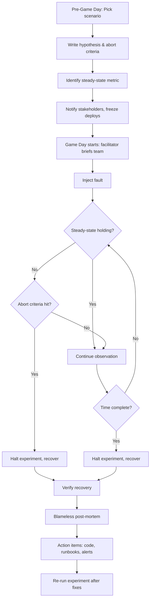

# Chaos Engineering and Game Days — Verifying Resilience Through Controlled Failure

**Date:** 2026-04-25 | **Updated:** 2026-04-25
**Tags:** `system-design` `reliability` `chaos-engineering` `game-days` `resilience`

## Table of Contents

- [Summary](#summary)
- [Why Chaos Engineering](#why-chaos-engineering)
- [The Principles of Chaos](#the-principles-of-chaos)
- [Steady-State Definition](#steady-state-definition)
- [Hypothesis-Driven Experiments](#hypothesis-driven-experiments)
- [Blast Radius Containment](#blast-radius-containment)
- [Game Day Structure](#game-day-structure)
- [What to Simulate First](#what-to-simulate-first)
  - [Dependency Failure and Slow Dependency](#dependency-failure-and-slow-dependency)
  - [Single-Instance Kill](#single-instance-kill)
  - [AZ and Region Outages](#az-and-region-outages)
  - [Resource Exhaustion](#resource-exhaustion)
  - [Network and Time Faults](#network-and-time-faults)
- [Tools](#tools)
- [Chaos Experiments vs Game Days](#chaos-experiments-vs-game-days)
- [Tabletop Exercises](#tabletop-exercises)
- [Observability Prerequisites](#observability-prerequisites)
- [Cultural Prerequisites](#cultural-prerequisites)
- [Common Findings From First Game Days](#common-findings-from-first-game-days)
- [Anti-Patterns](#anti-patterns)
- [A Concrete First Game Day Plan](#a-concrete-first-game-day-plan)
- [Related](#related)
- [References](#references)

## Summary

Chaos engineering is the discipline of injecting controlled failures into a system to **verify** that it behaves the way you designed it to. Game days are the human-facing version: a facilitated exercise where engineers practice responding to a scripted incident, with real (or simulated) faults injected into a real environment. Both exist for the same reason — resilience that has only been *designed* but never *exercised* is a hypothesis, not a property. This doc covers the principles, the experiment lifecycle, what to simulate in priority order, the tooling landscape, and the cultural and observability prerequisites without which chaos work is just expensive damage.

## Why Chaos Engineering

Distributed systems fail in ways their designers did not predict. Architecture diagrams show happy paths; production reveals long tails. The expensive lesson is that confidence in resilience requires **verification**, not design intent.

A few framings that help:

- **Failures are continuous, not discrete.** A dependency does not flip from "up" to "down" — it gets slow, returns 500s for one shard, drops one connection in fifty. These gray failures are what take systems out, and they are exactly the failures that escape unit tests.
- **The cost asymmetry is brutal.** A failure mode discovered in a controlled experiment costs an engineer-hour. The same failure mode discovered at 3am during a real outage costs an SLO breach, a customer-trust hit, and a multi-day post-mortem.
- **You cannot reason your way to resilience.** Hardware fails, deploys roll back, dependencies time out, certificates expire, clocks skew, queues back up. The only way to know whether your retry budget, circuit breaker, fallback, or autoscaler actually works is to make it run.
- **Untested code paths rot.** The fallback you wrote two years ago and never exercised? It calls a deprecated API. The runbook for "primary database failover"? It points to a Confluence page that 404s. Chaos surfaces this rot before customers do.

Chaos engineering is not about breaking things for fun. It is about **shifting the discovery of failure modes left** — from real incidents into controlled experiments where the blast radius is bounded and the on-call rotation is awake.

## The Principles of Chaos

The canonical reference is [principlesofchaos.org](https://principlesofchaos.org/). The five principles are worth reading in full, but in summary:

1. **Build a hypothesis around steady-state behavior.** Define what "normal" looks like in measurable terms before you break anything.
2. **Vary real-world events.** Inject failures that actually happen in production: instance death, dependency timeouts, network partitions, certificate expiry. Don't simulate cosmic-ray bit flips when you have never tested losing a database replica.
3. **Run experiments in production.** Eventually. Staging environments do not have real traffic, real data shape, real load patterns, or real dependency latency distributions. Start in staging, but the goal is production.
4. **Automate experiments to run continuously.** A chaos experiment you run once tells you the system was resilient on Tuesday. A chaos experiment that runs every deploy tells you the system *stays* resilient.
5. **Minimize blast radius.** Start with the smallest possible scope and only expand once previous scopes were green. This is the single rule that separates chaos engineering from outages.

## Steady-State Definition

A steady-state metric is the answer to the question: **"how do we know the system is working from a customer's perspective?"**

It is *not*:

- "The dashboard is green" (dashboards lag and lie)
- "All pods are Running" (pods can be Running and useless)
- "CPU is under 80%" (CPU has nothing to do with whether checkouts succeed)

It *is*:

- "p99 latency on `POST /orders` is under 300ms"
- "Successful checkout rate is above 99.5%"
- "Search results return within 1.5s for 99% of queries"
- "Login success rate is above 99.9%"

Three properties matter:

- **Customer-facing.** Tied to a behavior a user actually performs.
- **Quantitative.** A number with a threshold, not a vibe.
- **Continuously measurable.** You can compute it in a 1-minute or 5-minute window without exporting CSVs.

Without a steady-state metric, you cannot tell whether your experiment proved anything. You injected a fault, the dashboard wiggled, you stopped the experiment — what did you learn? Nothing falsifiable. If you cannot draw a line on a chart and say "if it crosses this, the hypothesis is wrong," you do not have an experiment.

## Hypothesis-Driven Experiments

A chaos experiment is shaped exactly like a scientific experiment.

```text
Hypothesis: If we kill 1 of 3 replicas of the orders service,
            p99 latency on POST /orders stays under 500ms
            and the success rate stays above 99.5%
            within 60 seconds of the kill.

Method:    Kubectl delete a single pod, observe for 5 minutes.

Abort if:  Success rate drops below 95%
           OR p99 latency exceeds 2s for more than 60 seconds
           OR error budget for the day is exhausted.

Result:    Observed p99 spiked to 1.4s for 90 seconds, success
           rate dipped to 97.2% during the new pod's startup.
           Hypothesis FALSIFIED — startup probe was too lenient,
           traffic routed to a not-yet-warm pod.
```

Two things this gives you:

- **A falsifiable claim.** You can be wrong, which means you can learn. "We are resilient" is not falsifiable. "p99 stays under 500ms when one replica dies" is.
- **A pre-committed abort criterion.** Before injecting the fault, you decide what bad enough looks like. This prevents the very human urge to "let it run another minute and see" while customers are getting 500s.

Avoid running experiments without a hypothesis. "Let's just kill some pods and see what happens" is observation, not experimentation. It is fine for exploration, but call it that and don't pretend you proved anything.

## Blast Radius Containment

Blast radius is the population of users, requests, or resources affected by an experiment. The whole point of chaos engineering is that the blast radius is **bounded and chosen**.

Layered containment:

1. **One canary pod / one shard / one tenant first.** If your system has natural isolation boundaries, use them.
2. **Single AZ before multi-AZ.** A region-wide experiment is the last step of a long ladder, not the first rung.
3. **Off-peak before peak.** Run the first iteration when an outage is cheap, not at 11am Monday.
4. **Internal traffic before customer traffic.** Synthetic probes and internal users absorb the first rounds.
5. **One percent of traffic before ten percent before all.** If you have a feature-flag or traffic-splitting layer, use it for chaos targeting.

Expansion rule: only widen the blast radius after the previous scope has been green for at least one full experiment cycle. If you skip a rung and it breaks, you have just caused a real incident.

A useful mental model: every chaos experiment has an explicit kill switch and a maximum duration. If you cannot answer "how do I stop this in 30 seconds?" do not start.

## Game Day Structure

A game day is a scheduled, facilitated exercise where a team practices responding to a failure scenario. It is to chaos engineering what a fire drill is to a sprinkler system: humans practicing the response, not just hardware being tested.



The components of a game day plan:

- **Scenario.** Plain-English description: "Primary Postgres replica fails over to standby."
- **Hypothesis.** Falsifiable statement about steady state.
- **Run book.** Step-by-step injection and recovery commands.
- **Roles.** Facilitator, on-call responder(s), observer(s), scribe.
- **Communication plan.** Who is told this is a drill (responders should *not* be told everything in advance — that defeats the point).
- **Abort criteria.** Pre-agreed thresholds at which the facilitator halts.
- **Recovery procedure.** How to make sure the system is back to normal before declaring done.
- **Post-mortem.** Blameless review within 48 hours: what went well, what surprised us, what action items.

Cadence varies. Mature teams run small chaos experiments continuously and one full game day per quarter on a high-impact scenario.

## What to Simulate First

Priority is determined by **how often this failure happens in real outages** vs. **how cheaply you can test it**. Order from highest leverage to lowest:

### Dependency Failure and Slow Dependency

By far the most common real outage shape: a downstream API, database, or queue starts timing out, returning 5xx, or — worse — getting slow but still responding. Gray failure is the killer because retries amplify it.

Things to test:

- Hard failure: dependency returns 500/connection refused.
- Soft failure: dependency returns 200 but with 10x normal latency.
- Partial failure: dependency works for 90% of requests, fails for 10%.
- Slow then fast recovery: induce 5 minutes of degradation, then restore. Watch the retry storm.

What you are validating: timeouts, retry budgets, circuit breakers, fallback paths, queue backpressure.

### Single-Instance Kill

The Chaos Monkey original. Pick one instance / pod / VM and kill it.

What you are validating: load balancer health checks, replica count headroom, leader-election speed, in-flight request handling, autoscaler response.

### AZ and Region Outages

AZ-level: drop network connectivity to one AZ, or terminate all instances in one AZ.

Region-level: rare to test live in production for a single team — typically tabletop or run in a non-prod region. The exercise is whether your DR plan and traffic-failover actually work end to end.

What you are validating: cross-AZ replication, cross-region failover, DNS failover, data-plane vs. control-plane separation.

### Resource Exhaustion

- **Disk fill.** Logs, dumps, temp files. What happens when `/var/log` is at 100%? Does the app crash, hang, or degrade gracefully?
- **OOM.** Memory pressure on a host. Does the OOM killer take the right process?
- **CPU starvation.** A noisy neighbor consumes all CPU. Does latency degrade gracefully, or do timeouts cascade?
- **File descriptor exhaustion.** Common cause of "everything works locally but fails under load."

### Network and Time Faults

- **DNS failure.** What happens when your service cannot resolve `db.internal`? Many systems fail in surprising ways here, especially with short DNS TTLs.
- **Certificate expiry.** Clock-forward your test environment past a certificate's `notAfter`. Does the service fail closed, fail open, or page someone?
- **Clock skew.** Drift one node's clock. JWTs, distributed locks, ordered logs all care.
- **Latency injection / packet loss.** Use ToxiProxy or `tc` to inject 200ms latency or 5% packet loss.

A starter priority list for a service that has never run chaos:

1. Kill one pod under load.
2. Inject 5s timeout into the most critical downstream call.
3. Inject 30% packet loss between service and its database.
4. Fill `/tmp` to 100%.
5. Block DNS for 30 seconds.

If any of those takes the system down past abort criteria, you have your first quarter of work.

## Tools

| Tool | Domain | Notes |
| --- | --- | --- |
| **Chaos Monkey / Simian Army** | EC2 / generic | Netflix originals. Simian Army added Latency Monkey, Conformity Monkey, Janitor Monkey, Chaos Gorilla (AZ-level), Chaos Kong (region-level). Largely superseded by Spinnaker-integrated tooling. |
| **AWS Fault Injection Simulator (AWS FIS)** | AWS | Managed service, hooks into EC2, ECS, EKS, RDS, networking. Built-in scenarios for AZ failure, instance termination, API throttling. |
| **Gremlin** | SaaS, multi-cloud | Commercial. Strong UI, large attack catalog (resource, state, network), good RBAC and blast-radius controls. |
| **Litmus** | Kubernetes | CNCF project. Experiments as CRDs. Catalog of pod, node, network, application-level chaos. Good GitOps fit. |
| **Chaos Mesh** | Kubernetes | CNCF project (PingCAP origin). CRD-driven. Strong network and time chaos. Often paired with TiDB / distributed databases. |
| **Pumba** | Docker | Lightweight, container-level chaos. Good for local dev / single-host. |
| **ToxiProxy** | TCP proxy | Shopify. Sit between app and dependency, inject latency, bandwidth limits, slow close, peek/slice. The Swiss army knife of dependency chaos. Excellent for local dev and integration tests. |
| **`tc` / `iptables`** | Linux | Built-in network shaping. Free, works anywhere, ugly syntax. Underlies many of the above. |

A pragmatic stack for a small team on Kubernetes: ToxiProxy for app-level dependency chaos in tests, Chaos Mesh or Litmus for cluster-level experiments, and a quarterly facilitated game day using whichever tool runs the scenario you actually want.

Example Litmus pod-delete experiment manifest:

```yaml
apiVersion: litmuschaos.io/v1alpha1
kind: ChaosEngine
metadata:
  name: orders-pod-delete
  namespace: orders
spec:
  appinfo:
    appns: orders
    applabel: "app=orders-api"
    appkind: deployment
  chaosServiceAccount: litmus-admin
  experiments:
    - name: pod-delete
      spec:
        components:
          env:
            - name: TOTAL_CHAOS_DURATION
              value: "60"
            - name: CHAOS_INTERVAL
              value: "20"
            - name: PODS_AFFECTED_PERCENTAGE
              value: "33"   # blast radius: one of three replicas
            - name: FORCE
              value: "false"  # graceful, not SIGKILL
        probe:
          - name: orders-steady-state
            type: httpProbe
            mode: Continuous
            runProperties:
              probeTimeout: 2
              interval: 5
              retry: 1
              stopOnFailure: true   # abort criterion
            httpProbe/inputs:
              url: "http://orders-probe.orders.svc/healthz/checkout"
              method:
                get:
                  criteria: "=="
                  responseCode: "200"
```

Example Gremlin attack config (illustrative — real config uses their CLI/API):

```yaml
attack:
  type: latency
  target:
    type: kubernetes
    selector:
      namespace: orders
      labels:
        app: orders-api
      percentage: 33          # blast radius
  args:
    delay_ms: 200
    jitter_ms: 50
    egress_port: 5432         # Postgres only
  length_seconds: 300
  abort:
    on_metric:
      query: "sum(rate(http_requests_total{code=~\"5..\"}[1m]))"
      threshold: 5
```

## Chaos Experiments vs Game Days

The two are related but distinct.

| | Chaos Experiment | Game Day |
| --- | --- | --- |
| **Driven by** | Automation, on a schedule or per deploy | Humans, on a calendar |
| **Frequency** | Continuous to daily | Monthly to quarterly |
| **Goal** | Verify a specific resilience property | Practice human response, surface organizational gaps |
| **Output** | Pass/fail signal, regression detection | Findings about runbooks, alerts, ownership, communication |
| **Surprise factor** | None — fully scripted | Some — responders may be told only that "a game day is happening today" |
| **Failure cost** | Bounded, automated rollback | Bounded, human-supervised rollback |

You want both. Continuous chaos experiments catch regressions in resilience properties. Game days catch the things that no automated check can: a stale runbook, an alert that pages the wrong on-call, a dependency nobody documented, a coordination breakdown between teams.

## Tabletop Exercises

A tabletop exercise is a game day with **no fault injection**. The team gathers around a table (or a video call) and walks through a scenario verbally:

> "It is 10am on a Tuesday. PagerDuty fires: us-east-1 is unreachable from your monitoring vendor. Your primary database is in us-east-1. Customer reports start in #incidents. Walk me through what you do, in order, with names and commands."

Tabletops are the right starting point for:

- **Disaster recovery / region-failover plans.** Testing them live is dangerous and expensive.
- **Scenarios with regulatory or customer impact** where even a controlled live test is too risky.
- **New teams or new on-call rotations** practicing roles before injecting real faults.
- **Cross-team scenarios** where coordination is the unknown, not the technology.

Outputs are the same as a game day: action items, runbook updates, alert improvements. Often the gaps a tabletop surfaces are organizational ("we did not know who decides to declare a region failover") and would not have shown up in a tooling-driven experiment anyway.

## Observability Prerequisites

Chaos engineering without observability is vandalism. If you cannot answer these questions in real time, do not run experiments:

- What is my steady-state metric **right now**? (Live, not delayed.)
- Is it inside or outside the threshold I set?
- Which service / endpoint / dependency / shard is responsible?
- Did this start when the experiment started?
- Is the system recovering after I aborted?

The minimum viable observability stack for chaos work:

- **Metrics:** Prometheus / Cloud-native equivalent, with histograms (not just averages) on latency.
- **Distributed tracing:** OpenTelemetry, with a sampling strategy that catches errors and slow requests.
- **Structured logs:** correlation IDs, request IDs, deployment SHAs.
- **A live dashboard for the steady-state metric** that the facilitator can watch during the experiment.
- **Alerting** that pages someone when steady-state breaches thresholds even outside experiments.

If your monitoring is "I'll SSH in and look at logs," chaos work is premature. Build the observability first. (See the Tier 7 observability docs.)

## Cultural Prerequisites

Chaos engineering is at least as much organizational as technical.

- **Blame-free post-mortems.** If engineers fear being blamed for findings, they will hide them, and game days become theater. Adopt the SRE / Etsy-style blameless post-mortem norm: humans are not the root cause; systems and processes are.
- **Leadership buy-in.** Game days take engineer-hours and (very rarely) cause minor customer-visible blips. Without explicit leadership endorsement, the first time chaos work causes a tiny incident, it gets killed.
- **On-call ownership.** Teams must own the services they break. Chaos run by a central reliability team on services owned by other teams creates resentment and does not change behavior. Run chaos *with* product teams, on services *they* own, against SLOs *they* signed.
- **Action item discipline.** A game day produces 5–15 action items. If those rot in a backlog, you wasted the exercise. Track them, prioritize them, close the loop.

A useful test: can a junior engineer on the team file a post-mortem that names a specific senior engineer's commit as the trigger, without anyone losing their composure? If yes, you are ready. If no, fix the culture first.

## Common Findings From First Game Days

Almost every team's first game day surfaces some subset of:

- **Runbooks are wrong.** The commands work in dev, the credentials are stale, the URL is from 2022, the steps assume a prior step that nobody does anymore.
- **Alerts page the wrong person.** The on-call rotation in PagerDuty has not been updated since the team reorg. Or the alert routes to a Slack channel that nobody monitors at 3am.
- **Hidden dependencies.** "I didn't know we called that service." A lookup table, an analytics pipeline, a shared library that hits an undocumented endpoint. The dependency map in your head is incomplete.
- **Retry storms.** Service A retries Service B with no backoff. Service B retries Service C the same way. A 5-second blip becomes a 5-minute outage because everyone is hammering at once.
- **Cascading timeouts.** Service A has a 30s timeout, Service B has a 10s timeout, Service C takes 5s. When C gets slow, B times out, A retries, the queue fills, the world burns. Timeout budgets must shrink as you go deeper, not grow.
- **Health checks lie.** The endpoint returns 200 even when the database connection pool is exhausted. The pod is `Ready` but cannot serve real requests.
- **Graceful shutdown is fictional.** SIGTERM is sent, the process exits in 2ms, in-flight requests are dropped. Or SIGTERM is sent and the process hangs for 30 seconds, getting SIGKILLed mid-shutdown.
- **Nobody knows who decides.** "Should we fail over the region?" — silence. Decision authority is undefined.

The first game day is rarely about whether the system is resilient. It is about discovering which of these you have, so you can fix them before the system *needs* to be resilient.

## Anti-Patterns

- **Chaos in production without observability.** You cannot tell if you broke something, so you do not learn anything, and may not even notice when you should have aborted.
- **No blast-radius containment.** Killing all replicas of a service "to see what happens" is not chaos engineering, it is an outage you scheduled.
- **No abort plan.** If your only stop button is "wait for the experiment to finish on its own," you are not in control.
- **"We'll do chaos when we're stable."** You will never be stable enough by that definition. Production is always changing. Chaos is how you stay stable, not a reward for being stable.
- **Measuring without a hypothesis.** "Let's see what happens" produces stories, not learnings. Always pre-commit to a falsifiable claim and an abort criterion.
- **Chaos as a one-time event.** A single quarterly game day is better than nothing, but resilience is not a checkbox. The system you tested in Q1 is not the system you have in Q3 — every deploy is a potential regression in resilience properties.
- **Chaos run by a central team against unwilling product teams.** This is reliability theater. The team that owns the service must own the chaos.
- **Skipping the post-mortem.** The experiment is the easy part. The value is in the action items. Without follow-through, you have spent engineer-hours to learn something and then forgotten it.
- **Confusing failure injection with progress.** Successfully killing a pod is not a win. Killing a pod, watching steady-state, falsifying a hypothesis, fixing the gap, and re-running is a win.

## A Concrete First Game Day Plan

For a team that has never run a game day, here is a starter run book.

```markdown
# Game Day: Orders API Replica Loss

## Scenario
At 14:00 UTC on Wednesday, we will terminate one of the three
running pods of `orders-api` in the `prod-us-east-1` cluster
during normal weekday traffic.

## Hypothesis
- p99 latency on `POST /orders` stays under 500ms throughout.
- Success rate (2xx + intentional 4xx) stays above 99.5%.
- A new pod is `Ready` and serving traffic within 90 seconds.

## Steady-State Metric
`histogram_quantile(0.99, sum(rate(http_request_duration_seconds_bucket
  {service="orders-api", route="POST /orders"}[1m])) by (le))`
  observed on the "Orders Live" Grafana dashboard.

## Abort Criteria (any one)
- Success rate drops below 95% for 60s.
- p99 latency exceeds 2s for 60s.
- Any P1 alert fires from a non-orders service (collateral damage).
- Facilitator's judgement.

## Roles
- Facilitator: <name> — runs the experiment, watches the dashboard,
  has the kill switch.
- Responder: <name> (current on-call) — NOT told the exact time;
  treats this as a real page if alerts fire.
- Observer: <name> — takes notes, captures timestamps.
- Scribe: <name> — drafts the post-mortem.

## Communication
- #incidents is muted for this drill (or a `[GAMEDAY]` prefix is used).
- Customer Support is notified beforehand: "minor latency may occur 14:00–14:15 UTC."
- Deploy freeze on `orders-*` services from 13:30 to 15:00 UTC.

## Procedure
1. 13:55 — Facilitator confirms steady-state is green for 10 prior minutes.
2. 14:00 — `kubectl -n orders delete pod <one-pod> --grace-period=30`
3. 14:00–14:05 — Observe steady-state. Do not intervene unless abort criteria hit.
4. 14:05 — Verify three replicas are again `Ready`.
5. 14:10 — Verify steady-state has returned to baseline for 5 minutes.
6. 14:15 — Declare end of game day.

## Recovery
If aborted: scale up to 4 replicas immediately, page secondary on-call,
declare a real incident, follow normal incident process.

## Post-Mortem
- Within 48 hours.
- Blameless format.
- Required outputs: timeline, what we learned, action items with owners
  and dates.
- Re-run the same scenario after action items close.
```

This is the smallest meaningful game day. From here, expand the blast radius (two replicas, then an AZ), then move to dependency chaos (timeout, then latency injection, then partial failure), and eventually to multi-team scenarios.

## Related

- [Disaster Recovery](./disaster-recovery.md)
- [Failure Modes and Fault Tolerance](./failure-modes-and-fault-tolerance.md)
- [Multi-Region Architectures](./multi-region-architectures.md)
- [Retry Strategies](./retry-strategies.md)

## References

- **Principles of Chaos Engineering.** [https://principlesofchaos.org/](https://principlesofchaos.org/) — the canonical short statement of the discipline.
- **Netflix Tech Blog — The Netflix Simian Army.** [https://netflixtechblog.com/the-netflix-simian-army-16e57fbab116](https://netflixtechblog.com/the-netflix-simian-army-16e57fbab116) — origin of Chaos Monkey and the broader Simian Army.
- **Netflix Tech Blog — Chaos Engineering Upgraded.** [https://netflixtechblog.com/chaos-engineering-upgraded-878d341f15fa](https://netflixtechblog.com/chaos-engineering-upgraded-878d341f15fa) — evolution toward ChAP and continuous experimentation.
- **AWS Fault Injection Service — User Guide.** [https://docs.aws.amazon.com/fis/latest/userguide/what-is.html](https://docs.aws.amazon.com/fis/latest/userguide/what-is.html) — managed chaos service across AWS resources.
- **Gremlin — Documentation.** [https://www.gremlin.com/docs/](https://www.gremlin.com/docs/) — commercial chaos platform; useful catalog of attack types and safety controls.
- **Chaos Mesh — Documentation.** [https://chaos-mesh.org/docs/](https://chaos-mesh.org/docs/) — CNCF Kubernetes-native chaos platform.
- **Litmus — Documentation.** [https://docs.litmuschaos.io/](https://docs.litmuschaos.io/) — CNCF chaos engineering framework with a public ChaosHub.
- **Google SRE Book — Chapter 33: Lessons Learned from Other Industries / Disaster Role-Playing (Wheel of Misfortune).** [https://sre.google/sre-book/disaster-role-playing/](https://sre.google/sre-book/disaster-role-playing/) — Google's tabletop / role-playing exercise practice.
- **Casey Rosenthal & Nora Jones — *Chaos Engineering: System Resiliency in Practice* (O'Reilly, 2020).** Successor to the earlier *Chaos Engineering* report; deepest single book on the discipline including game day patterns and case studies.
- **ToxiProxy.** [https://github.com/Shopify/toxiproxy](https://github.com/Shopify/toxiproxy) — Shopify's TCP-level fault injection proxy, widely used for dependency chaos in tests.
