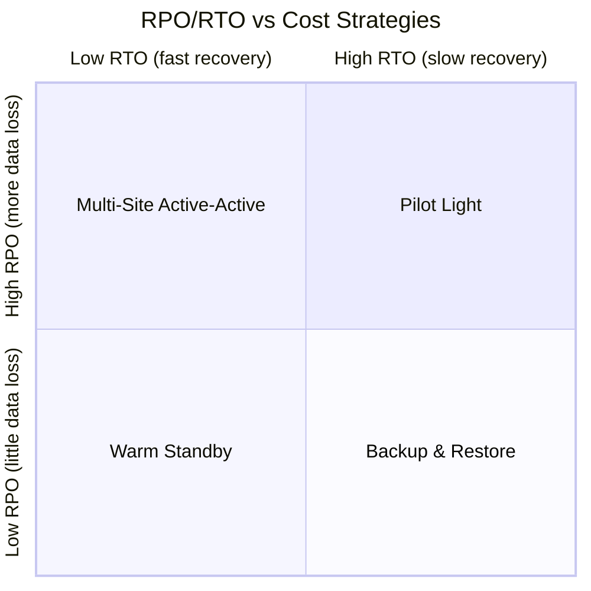
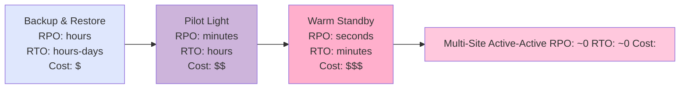

# Disaster Recovery — RPO, RTO, and Backup Strategies

**Date:** 2026-04-25 | **Updated:** 2026-04-25
**Tags:** `system-design` `reliability` `disaster-recovery` `rpo` `rto` `backups`

## Table of Contents

- [Summary](#summary)
- [DR Is Not HA](#dr-is-not-ha)
- [The Two Numbers: RPO and RTO](#the-two-numbers-rpo-and-rto)
  - [RPO — Recovery Point Objective](#rpo--recovery-point-objective)
  - [RTO — Recovery Time Objective](#rto--recovery-time-objective)
  - [Cost vs Objective Tradeoff](#cost-vs-objective-tradeoff)
- [DR Strategies (AWS Naming)](#dr-strategies-aws-naming)
  - [Backup & Restore](#backup--restore)
  - [Pilot Light](#pilot-light)
  - [Warm Standby](#warm-standby)
  - [Multi-Site Active-Active](#multi-site-active-active)
- [Backup Types and Cadence](#backup-types-and-cadence)
- [Backup Storage — Where, Not Just What](#backup-storage--where-not-just-what)
- [Test Restores — Untested Backup Is No Backup](#test-restores--untested-backup-is-no-backup)
- [Database-Specific DR](#database-specific-dr)
- [Application State DR — Everything That's Not the DB](#application-state-dr--everything-thats-not-the-db)
- [DR Runbook Essentials](#dr-runbook-essentials)
- [Tabletop Exercises and Live DR Drills](#tabletop-exercises-and-live-dr-drills)
- [Cross-Region Strategies](#cross-region-strategies)
- [Compliance Drivers](#compliance-drivers)
- [Anti-Patterns](#anti-patterns)
- [Related](#related)
- [References](#references)

## Summary

Disaster recovery is the discipline of surviving events that take out an entire region, account, or dataset — not the small failures HA already handles. Two numbers drive every architectural and budget decision: **RPO** (how much data you can lose) and **RTO** (how long you can be down). Those numbers map cleanly onto four canonical strategies — Backup & Restore, Pilot Light, Warm Standby, and Multi-Site Active-Active — each with predictable cost, complexity, and recovery characteristics. Backups themselves are only half of the work; the harder half is storing them somewhere a ransomware or account-compromise event can't reach, and **proving** through periodic restores that they actually work.

## DR Is Not HA

These two are routinely conflated in design reviews. They solve different problems.

| Concern | High Availability | Disaster Recovery |
|---------|-------------------|-------------------|
| Failure domain | Node, rack, AZ | Region, provider, account, dataset |
| Typical mechanism | Redundancy within a region (multi-AZ, replicas, autoscaling) | Replication and recovery across regions/providers |
| Recovery target | Seconds, automatic | Minutes to days, often human-driven |
| Triggering event | Hardware fault, OS crash, AZ outage | Region outage, ransomware, accidental `DROP TABLE`, datacenter fire, account takeover, regulatory takedown |
| Cost driver | Replica count and headroom | Idle capacity in DR site + storage + drill cost |

A multi-AZ Postgres deployment is HA. It survives a single AZ failure. It does **not** survive:

- An engineer running `DELETE FROM users` without a `WHERE`.
- Ransomware encrypting the primary and the synchronous replica.
- Your AWS account being compromised and all snapshots wiped.
- `us-east-1` going down for 14 hours (it has happened, more than once).

DR is what survives those. If your "DR plan" is "we have a multi-AZ RDS instance," you do not have a DR plan.

## The Two Numbers: RPO and RTO

### RPO — Recovery Point Objective

**How much data can you afford to lose, measured in time?**

If your RPO is 1 hour, you accept losing up to one hour of writes after a disaster. RPO is determined by:

- The replication or backup interval to the DR target.
- The replication lag at the moment of disaster.
- For backup-based recovery: the time since the last successful backup.

RPO ≈ 0 requires synchronous cross-region replication, which costs latency on every write and is rarely worth it outside finance, payments, and ledger systems.

### RTO — Recovery Time Objective

**How long can the system be unavailable before the impact is unacceptable?**

RTO includes:

- Time to detect and declare a disaster (often the longest part — humans hesitate).
- Time to provision DR infrastructure if it isn't pre-warmed.
- Time to restore data to the DR site.
- Time to cut traffic over (DNS TTLs, client caches, certificate provisioning).
- Time to validate the DR site is actually serving correct results.

A "4 hour RTO" with 60-second TTL DNS, pre-provisioned warm standby, and a tested runbook is realistic. A "4 hour RTO" with cold backups in the same region and a runbook nobody has read in 18 months is fiction.

### Cost vs Objective Tradeoff



Tighter RPO/RTO means more idle capacity, more replication bandwidth, and more operational burden. Map the numbers to actual business cost:

| RPO | RTO | Suggested Strategy | Relative Cost |
|-----|-----|--------------------|---------------|
| Hours | Hours–days | Backup & Restore | $ |
| Minutes | Hours | Pilot Light | $$ |
| Seconds | Minutes | Warm Standby | $$$ |
| ~0 | ~0 | Multi-Site Active-Active | $$$$ |

Pick the row your business actually needs, not the one that sounds most impressive. A marketing site with a 6-hour RTO and 24-hour RPO is fine. A trading engine with the same numbers is bankrupt.

## DR Strategies (AWS Naming)



### Backup & Restore

Periodic backups stored in a separate region. No infrastructure runs in the DR site until disaster strikes — you provision from infrastructure-as-code at recovery time and restore data from backup.

- **RPO**: as long as your backup interval (typically hours).
- **RTO**: hours to days — depends on how fast you can stand up infra and how big the dataset is.
- **Use it for**: internal tools, marketing sites, anything where a multi-hour outage is annoying but not existential.
- **Watch out for**: restore time scales with data size. A 5 TB Postgres restore from S3 can take many hours even with parallelism.

### Pilot Light

Core data is continuously replicated to the DR region. Critical infrastructure — databases, identity, networking — is **already running** but at minimum size. Application tier is dormant or scaled to zero. On disaster, scale up the app tier, point traffic at it.

- **RPO**: minutes (limited by async replication lag).
- **RTO**: hours (mostly app tier scale-up and traffic cutover).
- **Use it for**: revenue-generating services where minutes of data loss is fine but a multi-hour outage is not.

### Warm Standby

A scaled-down but **fully functional** copy of the production stack runs continuously in the DR region. It serves no production traffic but is healthy and current. On disaster, scale up and cut over.

- **RPO**: seconds (continuous async replication).
- **RTO**: minutes.
- **Use it for**: customer-facing services with strict availability requirements but not strict enough for active-active.

### Multi-Site Active-Active

Both regions actively serve production traffic. Data is replicated bidirectionally. Disaster in one region is handled by failing traffic over to the other.

- **RPO**: near zero (synchronous or tightly bounded async replication).
- **RTO**: near zero (traffic shift, often automatic via global load balancing).
- **Cost**: doubled infrastructure, plus the engineering investment to handle bidirectional conflict resolution, latency budgets across regions, and split-brain.
- **Use it for**: payments, trading, infrastructure platforms, anything where an outage burns trust faster than it burns money.

The leap from Warm Standby to Active-Active is the largest engineering investment in this list — it's not a knob you turn, it's a different system. See `multi-region-architectures.md`.

## Backup Types and Cadence

Three logical types of backup:

- **Full** — every byte of the dataset. Slow, expensive in storage, fast to restore from a single object.
- **Incremental** — only blocks changed since the last backup of any kind. Fast, small, but restore needs the chain of all incrementals back to the last full.
- **Differential** — only blocks changed since the last **full**. Larger than incrementals but only needs the last full + last differential to restore.

A typical cadence:

- Full backup weekly.
- Incremental or differential daily.
- Transaction log / WAL shipped continuously (this is what gives you minute-level RPO).

Retention should be tiered:

| Tier | Retention | Cadence | Storage |
|------|-----------|---------|---------|
| Hot | 7 days | Hourly snapshots | Same region, fast restore |
| Warm | 30–90 days | Daily fulls | Cross-region object storage |
| Cold | 1–7 years | Weekly fulls | Glacier / Archive tier, immutable |

Long retention is driven by compliance and by the harsh reality that some incidents (fraud, undetected data corruption, slow-burn ransomware) aren't discovered for weeks or months.

## Backup Storage — Where, Not Just What

The location of backups matters more than people give it credit for. Defense in depth means a backup is not really a backup unless it survives all of these:

- The primary database being deleted.
- The primary region being unavailable.
- The cloud account being compromised by an attacker with admin access.
- A ransomware actor encrypting everything they can write to.

Concrete controls:

- **Separate region** — backups must live in a different region from the source.
- **Separate account** — backups in an isolated AWS account / GCP project / Azure subscription with cross-account replication and read-only access from the source. An attacker who pwns the production account cannot delete backups in the vault account.
- **Separate provider** (for highest tiers) — replicate critical backups to a second cloud provider. Defends against provider-wide outages and provider-account compromise.
- **Immutable / object lock** — S3 Object Lock in compliance mode, GCS bucket retention policies, or Azure immutable blob storage. Once written, the object cannot be deleted or overwritten until the retention period expires — not by an attacker, not by an admin, not by you.
- **Encrypted at rest, with keys outside the source account** — a compromised production account should not also yield decryption keys.

Example S3 lifecycle policy enforcing tiered retention with immutable archival:

```json
{
  "Rules": [
    {
      "ID": "TieredBackupRetention",
      "Status": "Enabled",
      "Filter": { "Prefix": "backups/" },
      "Transitions": [
        { "Days": 30, "StorageClass": "STANDARD_IA" },
        { "Days": 90, "StorageClass": "GLACIER_IR" },
        { "Days": 180, "StorageClass": "DEEP_ARCHIVE" }
      ],
      "Expiration": { "Days": 2555 }
    },
    {
      "ID": "AbortIncompleteUploads",
      "Status": "Enabled",
      "Filter": {},
      "AbortIncompleteMultipartUpload": { "DaysAfterInitiation": 7 }
    }
  ]
}
```

Pair this with an Object Lock retention policy (configured at bucket creation, in compliance mode for regulated workloads) so the lifecycle rule cannot delete an object before its lock expires.

## Test Restores — Untested Backup Is No Backup

The single most common DR failure mode in industry is: backups were running, the bucket was full, nobody had ever tried to restore from them, and the day they tried, the backups were corrupt / encrypted with a lost key / missing the WAL chain / for the wrong schema version.

Treat restore tests as a first-class operational practice:

- **Automated weekly**: a job restores the most recent backup into a scratch environment and runs a checksum / row-count / smoke query. Fail loudly if it doesn't.
- **Quarterly**: a human-driven restore into a near-prod environment, validating that application code can actually start against the restored DB.
- **Validation criteria**: not just "the restore completed" — assert row counts within tolerance, key business invariants hold, application healthchecks pass, and end-to-end smoke tests pass.

If the test job hasn't run successfully in the last N days, page someone. The test failing is itself the disaster scenario you're trying to avoid discovering at 3 AM.

## Database-Specific DR

The general DR strategies above need to be adapted to whatever store actually holds the data.

### Postgres — WAL Archiving + PITR

Postgres point-in-time recovery uses base backups plus the WAL (Write-Ahead Log) shipped continuously to durable storage. RPO is bounded by how often WAL segments are flushed (seconds to a minute with `archive_timeout`).

```bash
# postgresql.conf
wal_level = replica
archive_mode = on
archive_command = 'aws s3 cp %p s3://my-wal-archive/%f --sse aws:kms'
archive_timeout = 60   # force a WAL switch at least once a minute

# Take a base backup
pg_basebackup -D /backups/base-$(date +%Y%m%d) -Ft -z -P

# Recover to a specific point in time
# In recovery.conf (PG <12) or postgresql.auto.conf + recovery.signal (PG >=12):
restore_command = 'aws s3 cp s3://my-wal-archive/%f %p'
recovery_target_time = '2026-04-25 14:32:00 UTC'
recovery_target_action = 'promote'
```

PITR is what lets you recover to "five minutes before the bad migration ran" instead of "the last full backup, six hours ago." If your DR plan does not include PITR, your effective RPO is your full-backup interval.

### MySQL — Binlog

Equivalent mechanism: row-based binlog shipped to durable storage, applied on top of a full backup taken via `mysqldump` or `xtrabackup`. Position-based or GTID-based replay.

### MongoDB — Oplog

The oplog is a capped collection of every write. For PITR, take a periodic full snapshot and tail the oplog continuously to object storage. On recovery: restore the snapshot, replay oplog up to the desired timestamp.

### Cassandra — Snapshots + Incremental Backups

`nodetool snapshot` flushes memtables and creates hard links to immutable SSTables. Combined with incremental backups (new SSTables written to a backup directory) for finer granularity. Restore is more involved due to per-node state and topology.

### RDS / Cloud SQL / Aurora

Managed services hide most of this:

- **Automated backups**: enabled by default, retention up to 35 days, point-in-time restore down to the second within that window.
- **Manual snapshots**: explicitly created, retained until you delete them, can be copied cross-region and cross-account.

Both are necessary. Automated backups are operational safety net (recover from yesterday's bad deploy). Manual snapshots, copied to a vault account, are the long-retention DR copy. Don't rely solely on automated backups — they live in the same account as the database, and if that account is compromised, they go with it.

## Application State DR — Everything That's Not the DB

Restoring the database is only useful if you can actually run an application against it. The full DR scope includes:

- **Configuration** — environment variables, feature flags, runtime config. Source of truth in version control or a config service that is itself backed up.
- **Secrets** — API keys, certificates, signing keys, encryption keys. Stored in a secret manager (Vault, AWS Secrets Manager, GCP Secret Manager) with cross-region replication and an emergency break-glass path. Losing your KMS keys means losing the data they encrypted, even if the ciphertext survives.
- **Infrastructure as code** — Terraform / CloudFormation / Pulumi modules that can recreate the environment. State files themselves need backups. Module versions and provider versions should be pinned so the recreation is deterministic.
- **Build artifacts** — the exact container images and binaries deployed to production at the time of disaster. Latest is not enough; you may need to re-deploy a known-good prior version.
- **Container registries** — replicated cross-region or backed up. An ECR/Artifact Registry outage is a very common silent DR gap.
- **DNS records** — exported and stored in IaC. Don't trust your DNS provider's UI as the source of truth.
- **TLS certificates and ACME accounts** — re-issuance can take time and may rate-limit you. Have spares or a path to ACME-issue from the DR site.
- **Identity provider configuration** — SSO, OIDC client registrations, SAML metadata.

A useful checklist: if you destroyed everything in production tomorrow, what's missing from the runbook to bring up an equivalent from cold? Whatever you can't answer for in <30 minutes is a DR gap.

## DR Runbook Essentials

A runbook is a written, versioned, **tested** document that describes exactly what to do during a disaster. It should include, for each step:

- **Owner** — the named role (not person) responsible.
- **Prerequisites** — what must be true before this step starts.
- **Action** — the exact commands or console operations.
- **Validation** — how to confirm the step succeeded.
- **Rollback** — how to undo if it fails.
- **Communication** — what to post in which channel and to whom.

```markdown
## Step 4: Promote DR Postgres to primary

**Owner:** On-call DBA
**Prerequisites:**
  - Step 3 (DNS lowered to 60s TTL) confirmed
  - Replication lag on dr-postgres-01 is < 30 seconds
  - Incident commander has declared region failure

**Action:**
  1. Connect to bastion-dr.internal
  2. Run: `aws rds promote-read-replica --db-instance-identifier dr-postgres-01`
  3. Wait for instance status `available` (~5 min)
  4. Capture new primary endpoint

**Validation:**
  - `psql -h <new-primary> -c "SELECT pg_is_in_recovery();"` returns `f`
  - Smoke query against `users` returns expected row count (within 1% of pre-disaster snapshot)
  - Application healthcheck `/healthz` returns 200 from staging-dr

**Rollback:**
  - Promotion is one-way. Rollback = restore from snapshot S into a new instance, repoint app.

**Communication:**
  - Post in #incident: "DR Postgres promoted. Endpoint: <endpoint>. Apps may now connect."
  - Update status page: "Database failover complete; restoring application traffic."
```

The runbook should live in version control next to the code, render readably in Markdown, and be reachable from the on-call paging system. If the runbook is in Confluence and Confluence is hosted in the dead region — yes, this has happened — you have a problem.

## Tabletop Exercises and Live DR Drills

Cadence that survives contact with reality:

- **Tabletop, quarterly** — incident commander walks the on-call team through a hypothetical disaster. No systems are touched. Find gaps in the runbook, ownership ambiguity, missing access. Cheap, high yield.
- **Partial drill, semi-annually** — actually execute a subset of the runbook against a non-production environment. Restore from backup into a scratch region; promote a replica in staging; rotate a "compromised" key.
- **Full drill (game day), annually** — execute the full DR plan, including a real production cutover where possible. This is the only test that catches "the runbook says use account X but the credential we have is for account Y."

See `chaos-engineering-and-game-days.md` for how to structure the latter.

A tabletop that finds three issues is a successful tabletop. A tabletop that finds zero issues is one where people aren't engaging.

## Cross-Region Strategies

The choice of replication topology — single-primary with async cross-region replicas, multi-primary with conflict resolution, geo-partitioned with regional sovereignty — is its own large topic. Different data shapes (write-heavy ledger, read-heavy catalog, append-only events, strongly consistent counter) want different topologies. The DR strategy and the multi-region topology are tightly coupled: Pilot Light implicitly assumes a primary-replica model; Active-Active implicitly assumes you've solved bidirectional replication and conflict resolution. See `multi-region-architectures.md` for the design space.

## Compliance Drivers

Several frameworks force minimum DR posture, with varying specificity:

- **SOC 2** (Trust Services Criteria, common criteria + availability) — requires that the organization has and tests business continuity and disaster recovery plans. Auditors typically expect at least an annual DR test with documented results.
- **ISO 27001 / 27031** — Annex A control A.17 covers business continuity. ISO 27031 specifically addresses ICT readiness for business continuity. Documented BCP/DR plans, tested at defined intervals.
- **HIPAA Security Rule** (45 CFR § 164.308) — explicitly requires a "Contingency Plan" with data backup, disaster recovery, and emergency mode operation procedures. Backups must be exact, retrievable copies of ePHI.
- **PCI DSS v4.0** — requirement 12.10 (incident response) and historically requirement 9 (physical, including offsite backup storage) cover backup security and tested response procedures.
- **NIST SP 800-34** — the canonical US federal guide for contingency planning; defines the contingency planning lifecycle and is a useful reference even outside federal contexts.

Translate these into concrete RPO/RTO targets, retention periods, and test cadences in the runbook. Auditors will ask for evidence: signed-off test results, change history of the runbook, ticket trails for actual incidents.

## Anti-Patterns

- **Backups in the same region as the source.** A region-wide outage takes both. A region-scoped account compromise takes both.
- **Backups in the same account as the source.** Account compromise = backups gone.
- **No tested restore.** Backups that have never been restored are Schrödinger's backups.
- **No PITR, only nightly fulls.** Effective RPO is 24 hours, even if leadership thinks it's "the time of the last backup, which is, like, a few minutes ago."
- **"Immutable" backups that aren't.** Object lock not actually configured; retention period of one day; admin role can still delete. Verify with an attempted delete in a controlled test.
- **Restore time > useful life of data.** A 36-hour restore for an order pipeline that needs to ship within 24 hours is functionally no recovery at all.
- **DB-only DR.** Restoring the database into a region where the application can't run, the secrets can't be retrieved, the container images aren't replicated, and DNS still points at the dead region.
- **Runbook in the dead region.** Wikis, ticketing, paging, identity — if any of these are single-region and that region is down, your DR depends on guesswork.
- **"We'll figure it out."** The most expensive sentence in operations. The 3 AM page is exactly when nobody is at their best at figuring things out.
- **DR plan that hasn't been re-read since onboarding.** Architectures drift. A plan written for the v1 monolith will not save you from a v3 microservices estate.
- **Confusing replication with backup.** A synchronous replica replicates the `DROP TABLE` faster than you can react. Replication is HA; only point-in-time backup defends against logical corruption and human error.

## Related

- [multi-region-architectures.md](multi-region-architectures.md)
- [chaos-engineering-and-game-days.md](chaos-engineering-and-game-days.md)
- [failure-modes-and-fault-tolerance.md](failure-modes-and-fault-tolerance.md)
- [../foundations/sla-slo-sli-and-availability.md](../foundations/sla-slo-sli-and-availability.md)

## References

- [AWS — Disaster Recovery of Workloads on AWS: Recovery in the Cloud (Whitepaper)](https://docs.aws.amazon.com/whitepapers/latest/disaster-recovery-workloads-on-aws/disaster-recovery-workloads-on-aws.html)
- [AWS — Disaster recovery options in the cloud (4 strategies)](https://docs.aws.amazon.com/whitepapers/latest/disaster-recovery-workloads-on-aws/disaster-recovery-options-in-the-cloud.html)
- [Google Cloud — Disaster recovery planning guide](https://cloud.google.com/architecture/dr-scenarios-planning-guide)
- [PostgreSQL — Continuous Archiving and Point-in-Time Recovery (PITR)](https://www.postgresql.org/docs/current/continuous-archiving.html)
- [NIST SP 800-34 Rev. 1 — Contingency Planning Guide for Federal Information Systems](https://csrc.nist.gov/publications/detail/sp/800-34/rev-1/final)
- [Microsoft Learn — Azure Site Recovery documentation](https://learn.microsoft.com/en-us/azure/site-recovery/)
- [AWS — Amazon S3 Object Lock](https://docs.aws.amazon.com/AmazonS3/latest/userguide/object-lock.html)
- [HIPAA Security Rule — 45 CFR § 164.308(a)(7) Contingency Plan](https://www.ecfr.gov/current/title-45/subtitle-A/subchapter-C/part-164/subpart-C/section-164.308)
