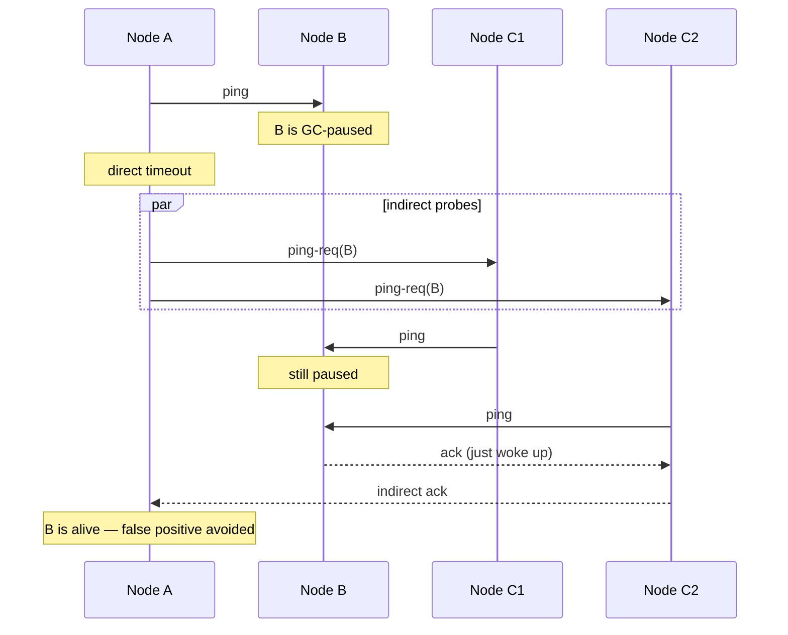
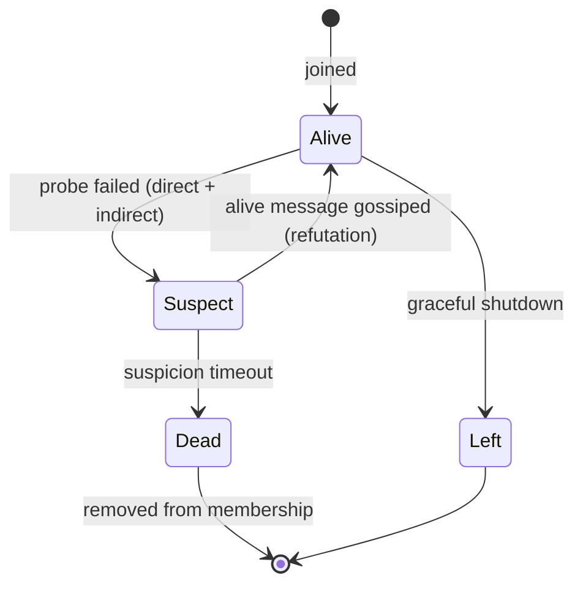

# Failure Detection — Heartbeats, Phi-Accrual, and Gossip (SWIM)

**Date:** 2026-04-25 | **Updated:** 2026-04-25
**Tags:** `system-design` `reliability` `failure-detection` `gossip` `swim` `heartbeats`

## Table of Contents

- [Summary](#summary)
- [Why Failure Detection Is Hard](#why-failure-detection-is-hard)
- [Heartbeat Basics](#heartbeat-basics)
- [Push vs Pull Heartbeats](#push-vs-pull-heartbeats)
- [Timeout Selection](#timeout-selection)
- [Phi-Accrual Failure Detector](#phi-accrual-failure-detector)
- [Gossip Protocols](#gossip-protocols)
- [SWIM — Scalable Weakly-consistent Infection-style Membership](#swim--scalable-weakly-consistent-infection-style-membership)
- [Membership vs Liveness](#membership-vs-liveness)
- [Quorum-Based Detection](#quorum-based-detection)
- [Process-Level Health (Kubernetes Liveness/Readiness)](#process-level-health-kubernetes-livenessreadiness)
- [The False Positive Problem](#the-false-positive-problem)
- [Coordinated Detection](#coordinated-detection)
- [Anti-Patterns](#anti-patterns)
- [Related](#related)
- [References](#references)

## Summary

Failure detection is the foundation of every distributed system that promises self-healing — replication, leader election, sharding, autoscaling, and circuit breaking all rely on someone, somewhere, deciding "that node is dead." That decision is fundamentally **unsound**: in an asynchronous network, you cannot tell a crashed process from a slow one. The whole field is engineering compromises around that impossibility — heartbeats with timeouts, adaptive suspicion (phi-accrual), gossip-based dissemination (SWIM), and fencing tokens to bound the damage when you're wrong.

This doc walks the spectrum: simple ping-and-timeout, phi-accrual's continuous suspicion, SWIM's elegant ping → ping-req → suspect → confirm state machine, and the operational realities — false positives, split brain, coordinated detection, and the gap between process-level health (Kubernetes probes) and network-level liveness.

## Why Failure Detection Is Hard

In a synchronous network with bounded delays, failure detection is trivial: you ping, you wait the bound, no reply means dead. Real networks are **asynchronous** — packets can be arbitrarily delayed, reordered, or dropped. Inside a process, GC pauses, page faults, and CPU starvation can stall execution for seconds.

The core ambiguity:

> A process that has not responded in T seconds is either **dead**, **slow**, or **partitioned**. You cannot distinguish these from outside.

The [FLP impossibility result (Fischer, Lynch, Paterson, 1985)](https://groups.csail.mit.edu/tds/papers/Lynch/jacm85.pdf) proves you cannot build a deterministic consensus protocol in a fully asynchronous network with even one faulty process. A perfect failure detector — never wrong, always eventually correct — is impossible. Real systems use **unreliable failure detectors** (Chandra & Toueg, 1996) that may falsely suspect live processes, then add layers (fencing, quorum, retries) to tolerate the false suspicions.

Practical implications:

- Every "dead" decision is probabilistic
- Detection latency vs accuracy is a tradeoff, not a setting you can dial to perfect
- The monitor itself can fail — the failure detector needs to be distributed too

## Heartbeat Basics

The simplest detector: A periodically pings B. If B fails to respond within timeout T, A marks B as dead.

```text
A                     B
|---ping (t=0)------>|
|<--ack-------------|   reset timer
|---ping (t=1s)---->|
|<--ack-------------|   reset timer
|---ping (t=2s)---->|
|     X (dropped)    |
|---ping (t=3s)---->|
|     X              |
|  timeout @ t=5s    |
|  → suspect B dead  |
```

Parameters:

| Parameter | Effect |
|-----------|--------|
| Heartbeat interval `Δ` | Lower = faster detection, more network load |
| Timeout `T` | Higher = fewer false positives, slower detection |
| Consecutive misses `k` | Higher `k` smooths over transient packet loss |

Typical defaults in production systems:

- Cassandra gossip: 1s interval
- etcd: 100ms heartbeat between leader and followers
- Kubernetes node-status-update-frequency: 10s, eviction after 5min unreachable
- Consul: 1s LAN gossip, 30s WAN gossip

The "is it dead or just slow?" problem never goes away — it gets pushed up into adaptive thresholds, suspicion, or quorum decisions.

## Push vs Pull Heartbeats

Two architectural patterns:

### Pull (Monitor → Target)

The monitor calls a health endpoint on the target on a schedule.

```text
LB / Monitor                     Service
    |---GET /health------------>|
    |<--200 OK-----------------|
```

- **Used by**: Kubernetes probes, AWS ELB target health, Consul HTTP checks
- **Pros**: Centralized config, easy to add per-service logic, target stays simple
- **Cons**: N-to-1 pressure on the monitor, scales poorly past ~1k targets per monitor

### Push (Target → Monitor)

The target sends liveness updates to the monitor (or to peers) on a schedule.

```text
Service                          Monitor
    |---heartbeat-------------->|
    |---heartbeat-------------->|
```

- **Used by**: Cassandra gossip, Akka cluster, Nomad agents, Consul anti-entropy
- **Pros**: Targets only know about themselves; scales to large clusters
- **Cons**: Targets must know monitor addresses; harder to add new health checks centrally

Hybrid is common — Kubernetes pulls liveness probes (HTTP/exec) but kubelets push node status to the apiserver. SWIM is fundamentally push-based but uses indirect probes that look like pull.

## Timeout Selection

Picking the right timeout is the central tuning knob, and the most common source of pain.

```text
Detection                False positives
latency                       ↑
   ↑                          |
   |                          |
   |←───── tradeoff curve ───→|
   |                          |
timeout too tight    timeout too loose
   |                          |
   ↓                          ↓
churn, flapping      slow real-failure detection
```

The shape of the **latency distribution** drives the choice. If P50 RTT is 5ms and P99 is 200ms, a 100ms timeout will produce ~1% false positives at steady state — multiplied across thousands of probes, that's a flapping disaster.

Heuristics:

- Set timeouts based on **P99 or P99.9** RTT under load, not P50
- Use **exponential moving averages** of recent RTTs to adapt
- Add **jitter** to heartbeat intervals to avoid thundering-herd retries
- Require **k consecutive misses** rather than a single timeout
- Treat the chosen number as a **service-level decision**, not a code constant

A common pattern:

```typescript
// Adaptive timeout based on observed RTT
class AdaptiveTimeout {
  private mean = 100;          // ms
  private variance = 50;
  private readonly alpha = 0.125; // EWMA factor

  observe(rtt: number): void {
    const delta = rtt - this.mean;
    this.mean += this.alpha * delta;
    this.variance += this.alpha * (Math.abs(delta) - this.variance);
  }

  // Jacobson/Karels-style RTO, similar to TCP
  timeout(): number {
    return this.mean + 4 * this.variance;
  }
}
```

This is the same logic TCP uses for retransmission timeouts (RFC 6298). It is a sensible starting point; phi-accrual generalizes it further.

## Phi-Accrual Failure Detector

[Hayashibara et al. (2004)](https://www.researchgate.net/publication/29682135_The_ph_accrual_failure_detector) observed that boolean alive/dead is the wrong abstraction for a building block. Different consumers want different sensitivities — a leader-election module wants conservative (high suspicion before acting); a load balancer wants aggressive (mild suspicion is enough to drain traffic). Force them all through a single timeout and you'll satisfy neither.

Phi-accrual returns a **continuous suspicion level** `φ` instead of a boolean. Each consumer applies its own threshold.

### How φ Is Computed

The detector records the inter-arrival time of recent heartbeats (a sliding window of, say, 1000 samples). It treats them as samples from a distribution (commonly exponential or normal). Given the time `t_now − t_last_heartbeat`, it computes:

```text
φ(t) = -log10( P_later(t_now − t_last) )
```

where `P_later(x)` is the probability, given the historical inter-arrival distribution, that a heartbeat arrives _at least_ `x` after the previous one. Intuitively: "how surprising is the silence we're seeing right now?"

Interpretation:

| φ value | Probability mass beyond | Meaning |
|---------|-------------------------|---------|
| 1 | 10% | mildly late |
| 2 | 1% | suspicious |
| 4 | 0.01% | likely dead |
| 8 | 10⁻⁸ | almost certainly dead |

Cassandra's default `phi_convict_threshold` is 8 (production-grade clusters often run at 10–12 to absorb cloud-network jitter). Akka uses `acceptable-heartbeat-pause` and a threshold around 8–12.

### Pseudocode

```python
class PhiAccrualDetector:
    def __init__(self, window_size=1000, min_std_deviation=0.1):
        self.arrival_intervals = []        # inter-arrival times (seconds)
        self.last_heartbeat = None
        self.window = window_size
        self.min_std = min_std_deviation

    def heartbeat(self, now: float) -> None:
        if self.last_heartbeat is not None:
            interval = now - self.last_heartbeat
            self.arrival_intervals.append(interval)
            if len(self.arrival_intervals) > self.window:
                self.arrival_intervals.pop(0)
        self.last_heartbeat = now

    def phi(self, now: float) -> float:
        if self.last_heartbeat is None or not self.arrival_intervals:
            return 0.0
        elapsed = now - self.last_heartbeat
        mean = statistics.mean(self.arrival_intervals)
        std = max(statistics.stdev(self.arrival_intervals), self.min_std)
        # Probability that a normal sample is at least `elapsed`
        p_later = 1.0 - normal_cdf(elapsed, mean, std)
        if p_later <= 0:
            return float("inf")
        return -math.log10(p_later)

    def is_available(self, now: float, threshold: float = 8.0) -> bool:
        return self.phi(now) < threshold
```

Properties:

- **Adaptive**: tracks actual network behavior — a noisy network grows the variance, raising the bar for "suspect"
- **Tunable per consumer**: each module picks a threshold matching its sensitivity
- **No magic timeout**: the threshold is in units of "log probability of false positive," which is a much more honest knob

Phi-accrual is the de-facto gold standard for failure detection inside long-lived clusters. Cassandra, Akka, and several ESB-style systems use it.

## Gossip Protocols

Once a node observes a state change ("B looks dead from here"), how does that knowledge propagate? Centralized broadcast doesn't scale. **Gossip** (a.k.a. epidemic protocols) borrows from epidemiology: each node periodically picks a random peer and exchanges state.

### Three Variants

| Variant | Behavior |
|---------|----------|
| **Push** | A picks random B and sends its state |
| **Pull** | A picks random B and asks for B's state |
| **Push-pull** | A and B exchange state in one round |

Push-pull is the dominant choice in production — it converges fastest. Theoretical results (Karp et al., 2000) show push-pull reaches all `N` nodes in `O(log N)` rounds with high probability.

```text
Round 0:    A (knows fact X)
Round 1:    A → B          (1 → 2 nodes know X)
Round 2:    A → C, B → D   (2 → 4 nodes know X)
Round 3:    each tells one  (4 → 8 nodes know X)
...
Round k:    ~min(2^k, N)
```

For `N = 10,000` nodes and a 1s gossip interval, a fact reaches everyone in ~14 seconds.

### Properties

- **Eventually consistent**: all live nodes converge on the same view, given enough time
- **Robust**: no central coordinator; tolerates partitions and node churn
- **Bandwidth-efficient**: each node sends `O(1)` messages per round regardless of cluster size
- **Used by**: Cassandra (membership + schema versioning), Consul/Serf, AWS DynamoDB (internal), Riak, Hyperledger Fabric

Gossip carries _more_ than failure detection — it is also how membership lists, schema versions, and configuration spread. Failure detection is one payload among several.

## SWIM — Scalable Weakly-consistent Infection-style Membership

[SWIM (Das, Gupta, Motivala, 2002)](https://www.cs.cornell.edu/projects/Quicksilver/public_pdfs/SWIM.pdf) is the most influential failure detection + membership protocol of the last 20 years. It is the basis for Hashicorp memberlist (Serf, Nomad, Consul), Uber Ringpop, ScyllaDB's gossiper, and many others.

SWIM's key insight: **separate failure detection from membership dissemination**. Traditional all-to-all heartbeating produces O(N²) traffic and forces every node to detect every other node. SWIM detects failures with a randomized probe, then disseminates the result via gossip.

### The Probe Cycle

Every protocol period (typically 1–2s), each node:

1. Picks a random member `B` and sends a direct **ping**
2. If `B` replies with **ack** within timeout, mark alive — done
3. If no ack, pick `k` random members `C₁…C_k` and send each a **ping-req(B)**
4. The `C_i` send their own ping to `B`; if B replies, they relay an indirect ack
5. If no indirect ack arrives by end of period, mark `B` as **suspect** and gossip it
6. After a suspicion timeout with no refutation, mark `B` as **confirmed dead** and remove from membership



Indirect probes distinguish "B is unreachable from A due to a network path issue" from "B is actually down" — a single network blip on the A↔B path no longer kills a healthy node.

### The State Machine



Three things make this work in production:

1. **Suspicion is reversible** — if `B` hears it has been suspected, it gossips an "alive" refutation with an incremented incarnation number, and the cluster un-suspects
2. **Incarnation numbers** — monotonically increasing per-node, used to break ties between conflicting state messages (similar to Lamport-clock semantics)
3. **Piggybacking** — membership updates ride on top of probe messages, so dissemination costs almost nothing extra

### Pseudocode (Probe Round)

```go
// One protocol period for node A
func protocolPeriod(self *Node, members []*Node) {
    target := pickRandomMember(members, self)
    if directPing(target, RTT) {
        return // alive
    }

    // Indirect ping via k random witnesses
    witnesses := pickK(members, self, target, k)
    if anyIndirectAck(witnesses, target, ProbeTimeout) {
        return // alive (false-positive avoided)
    }

    // Direct + indirect failed
    self.markSuspect(target, self.incarnation)
    self.gossip(SuspectMessage{Node: target, Incarnation: target.incarnation})
}

// Receiver of a Suspect about itself
func onSuspectAboutSelf(msg SuspectMessage) {
    if msg.Incarnation < self.incarnation {
        return // stale; ignore
    }
    self.incarnation++
    broadcast(AliveMessage{Node: self.id, Incarnation: self.incarnation})
}
```

### Lifeguard Extensions (Hashicorp memberlist)

Hashicorp's [memberlist](https://github.com/hashicorp/memberlist) adds **Lifeguard** improvements (Dadgar et al., 2018):

- **Awareness**: nodes that miss probes themselves slow down their own probes (they're probably the slow one, not their target)
- **Dogpile detection**: lengthen suspicion timeouts when many nodes report a target as suspect
- **Adaptive probe intervals**: nodes that detect they are unhealthy give peers more time before declaring them dead

These reduce false positives during network blips and CPU saturation events — common in cloud environments.

## Membership vs Liveness

These are often conflated; they are not the same.

| Concept | Question | Mechanism |
|---------|----------|-----------|
| **Membership** | Who is in the cluster right now? | SWIM, gossip, configuration store |
| **Liveness** | Is node X responding? | Heartbeats, probes, phi-accrual |
| **Health** | Is the application on X working correctly? | Application-level checks (HTTP /health, /ready) |

Liveness is the hard subproblem of membership. Adding a node to the cluster is a one-time cooperative action — the joining node tells someone, that fact gossips outward. Removing a dead node is a unilateral, irreversible decision made by other members based on liveness signals. Get it wrong and you've split brain.

A clean architecture separates them:

```text
[ Health checks ]    Application "ready to serve"
        ↓
[ Liveness  layer ]  SWIM + phi-accrual
        ↓
[ Membership view ]  Gossip-disseminated cluster roster
        ↓
[ Consumers ]        Routers, replicas, leaders, schedulers
```

## Quorum-Based Detection

For state machines that must agree on _exactly_ which nodes are alive (Raft, Paxos, etcd), gossip-based "weakly consistent" membership is not enough — you need everyone to make the same decision at the same logical time. The answer is **quorum**.

In Raft, the leader's view of follower liveness is what counts. Leader sends `AppendEntries` to all followers; if a follower doesn't respond within the election timeout (typically 150–300ms), the leader simply doesn't count it for commits. If the leader itself loses contact with a quorum, it steps down. Followers that don't hear from the leader trigger a new election.

The leader's heartbeat _is_ the failure detector for the consensus group. Quorum (majority) is the safety mechanism: only a single quorum can exist at any time, so even if half the cluster falsely thinks the other half is dead, only one side will get majority and the other cannot make progress.

See [consensus-raft-and-paxos.md](../data-consistency/consensus-raft-and-paxos.md) for the full mechanics.

## Process-Level Health (Kubernetes Liveness/Readiness)

At the application layer, Kubernetes probes are a different kind of failure detection — local, single-monitor (the kubelet on the node), pull-based.

| Probe | Question | What happens on failure |
|-------|----------|--------------------------|
| **startup** | Has the app finished starting? | Disable other probes during boot; restart on timeout |
| **liveness** | Is the app stuck (deadlocked, infinite loop)? | Restart the container |
| **readiness** | Should the app receive traffic right now? | Remove from Service endpoints (no restart) |

```yaml
livenessProbe:
  httpGet: { path: /healthz, port: 8080 }
  initialDelaySeconds: 30
  periodSeconds: 10
  timeoutSeconds: 2
  failureThreshold: 3
readinessProbe:
  httpGet: { path: /ready, port: 8080 }
  periodSeconds: 5
  failureThreshold: 2
```

Critical distinctions:

- **Liveness ≠ readiness**. A pod warming a cache should fail readiness (don't send traffic) but pass liveness (don't restart). Conflating them causes restart loops on slow startup.
- **Local check ≠ network detection**. The kubelet probing localhost catches in-process deadlocks. It does _not_ catch network partitions between this pod and its peers — that requires application-level health checks against dependencies.
- **Readiness gates traffic without killing the pod**. This is exactly the right semantic for "drain me from the LB while I deal with this," and it composes beautifully with rolling updates.

See [the Kubernetes path](../../kubernetes/core-concepts/cluster-architecture.md) for how the kubelet, apiserver, and node controller turn local probe results into cluster-wide membership decisions.

## The False Positive Problem

A monitor declares B dead. B is actually fine — there was a transient network blip, a long GC, or the monitor itself was overloaded. What goes wrong?

1. **Unnecessary failover** — leader election triggers, replicas are rebalanced, traffic reroutes. All for nothing, and not free.
2. **Split brain** — if B doesn't know it has been declared dead, it keeps serving. Now you have two "primaries." Writes diverge.
3. **Cascading load** — B's neighbors take its load; some of them get overloaded; they get marked dead too. The blast radius grows.

The defenses:

### Fencing tokens

Every leader/owner role carries a **monotonically increasing token** (epoch, term, generation). Downstream services validate the token on every operation and reject anything stale. So even if old-leader B is still alive and trying to write, its writes carry an old token and the storage layer refuses them.

```text
Time  Event                                Token
t=0   B is leader                          term=5
t=1   B GC pauses 30s
t=2   Cluster elects C as new leader       term=6
t=3   C writes to storage with term=6      ✓ accepted
t=4   B wakes, writes with term=5          ✗ rejected
t=5   B sees term=6 from storage, steps down
```

This is exactly what Raft, ZooKeeper, etcd, and Kafka KRaft do. Fencing tokens turn "false positive in failure detection" from a correctness disaster into a brief unavailability window.

### Lease-based ownership

Combine with leases — the leader's authority expires automatically after `T` seconds unless renewed. If B is partitioned long enough that the cluster picks a new leader, B's lease has also expired by definition, and B must stop serving before writing.

See [leader-election-and-coordination.md](../data-consistency/leader-election-and-coordination.md) for fencing tokens and leases in depth.

## Coordinated Detection

A single monitor's view is unreliable. Real systems require **multiple independent observers to agree** before declaring a node dead. SWIM's indirect probes are one example. Stronger forms:

| Pattern | How |
|---------|-----|
| **k-of-n agreement** | n monitors probe; need k to report dead |
| **Quorum suspicion** | majority of cluster members must report suspect |
| **External witness** | a third zone votes on partitioned-cluster questions |
| **Operator confirmation** | for high-impact failovers, require human ack |

Cassandra's gossip endpoint state includes per-peer "I think X is down" votes. AWS Aurora uses a quorum across availability zones. Cloud Spanner's TrueTime + Paxos requires a quorum for any write (and thus for any liveness-relevant decision).

Coordination dramatically reduces false positives. A network blip on a single monitor's path is filtered out — only a real failure produces consistent suspicion across many viewpoints.

## Anti-Patterns

These are the failure-detection bugs you will see most often in production:

### Single hard timeout for "dead"

```text
if (now - lastSeen > 30_000) markDead();
```

No margin for jitter, no consecutive-miss requirement, no adaptation. Every GC pause becomes a phantom outage. Either use phi-accrual, or at minimum require k consecutive misses with adaptive RTT.

### No jitter on heartbeats

If every node fires heartbeats at exact second boundaries, you get periodic spikes that look like "everyone is slow at once." A blip during the spike sweeps half the cluster into suspicion simultaneously. Add ±20% jitter.

### Ignoring P99 latency in timeout selection

Setting timeout = 2 × P50 means everything past P75 is a false positive. Always compute timeouts off P99 (or P99.9 for high-availability paths).

### Treating gossip-suspect as definitive

A SWIM "suspect" is a hypothesis, not a fact. Triggering immediate failover on suspect — instead of waiting for "confirmed dead" plus a quorum check — is the canonical way to flap.

### Missing fencing on auto-failover

If your failover writes to storage by URL alone — no epoch, no term, no lease — a flaky failure detector will eventually produce a split brain. **No exceptions, no "low-probability."** Add fencing tokens before turning on auto-failover.

### Liveness probe restarts a healthy-but-busy app

Liveness probe times out at 1s; the app is doing legit work and takes 1.2s to respond. Container is killed. Lather, rinse, panic. Either tune the probe to realistic latencies (4 × P99 + jitter) or move slow checks to readiness.

### Same probe for liveness and readiness

If the same `/health` returns 503 when a downstream is unavailable, Kubernetes will _restart_ the container. The downstream is the problem, not your container. Use a strict liveness probe (only fails on local deadlock) and a permissive readiness probe (fails on dependency outages).

### Dialing the timeout down to "detect failures faster"

Detection latency and false-positive rate are coupled. You cannot lower one without raising the other. If you need faster detection, fix the underlying RTT distribution (move closer, smaller GC, dedicated network) — not the timeout.

## Related

- [Failure Modes and Fault Tolerance](failure-modes-and-fault-tolerance.md) — taxonomy of failures (crash, omission, Byzantine) and what each detector can and cannot catch
- [Network Partitions and Split Brain](network-partitions-and-split-brain.md) — what happens after a false positive, and how to bound the damage
- [Leader Election and Coordination](../data-consistency/leader-election-and-coordination.md) — fencing tokens, leases, and the operational layer above failure detection
- [Consensus — Raft and Paxos](../data-consistency/consensus-raft-and-paxos.md) — quorum-based liveness inside a strongly consistent state machine
- [Kubernetes Cluster Architecture](../../kubernetes/core-concepts/cluster-architecture.md) — how kubelet probes, node controller eviction, and apiserver heartbeats compose at the cluster level

## References

- [Das, Gupta, Motivala — *SWIM: Scalable Weakly-consistent Infection-style Process Group Membership Protocol* (DSN 2002)](https://www.cs.cornell.edu/projects/Quicksilver/public_pdfs/SWIM.pdf) — the original SWIM paper
- [Hayashibara, Défago, Yared, Katayama — *The φ Accrual Failure Detector* (SRDS 2004)](https://www.researchgate.net/publication/29682135_The_ph_accrual_failure_detector) — the phi-accrual paper
- [Apache Cassandra — Failure Detection (gossip and phi)](https://cassandra.apache.org/doc/latest/cassandra/architecture/dynamo.html#failure-detection) — `phi_convict_threshold`, gossip semantics
- [HashiCorp `memberlist` (GitHub)](https://github.com/hashicorp/memberlist) — Go implementation of SWIM + Lifeguard, used by Serf, Nomad, Consul
- [HashiCorp Consul — Gossip Protocol](https://developer.hashicorp.com/consul/docs/architecture/gossip) — Serf and memberlist in production
- [Uber Engineering — Ringpop (open-source SWIM-based sharding)](https://www.uber.com/blog/ringpop-open-source-nodejs-library/) — application-layer SWIM for consistent hashing
- [Kubernetes — Liveness, Readiness, and Startup Probes](https://kubernetes.io/docs/tasks/configure-pod-container/configure-liveness-readiness-startup-probes/) — official probe documentation
- [Fischer, Lynch, Paterson — *Impossibility of Distributed Consensus with One Faulty Process* (1985)](https://groups.csail.mit.edu/tds/papers/Lynch/jacm85.pdf) — the FLP impossibility result
- [Dadgar et al. — *Lifeguard: SWIM-ing with Situational Awareness* (2018)](https://arxiv.org/abs/1707.00788) — Hashicorp's SWIM extensions for cloud environments
