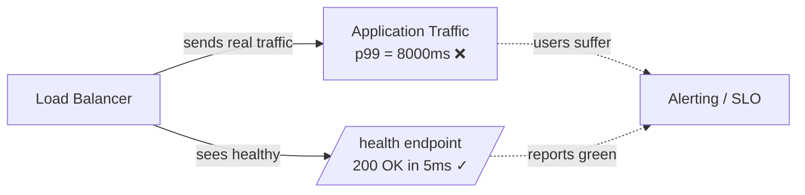
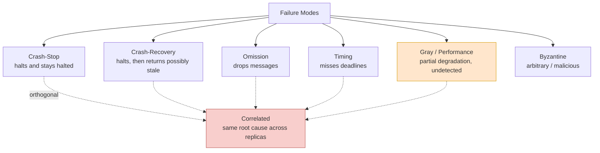
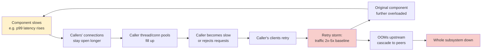

# Failure Modes and Fault Tolerance Taxonomy — Naming What Breaks Before You Design Around It

**Date:** 2026-04-25 | **Updated:** 2026-04-25
**Tags:** `system-design` `reliability` `failure-modes` `fault-tolerance` `distributed-systems`

## Table of Contents

- [Summary](#summary)
- [Why Taxonomy Matters](#why-taxonomy-matters)
- [Crash-Stop / Fail-Stop](#crash-stop--fail-stop)
- [Crash-Recovery](#crash-recovery)
- [Omission Failures](#omission-failures)
- [Timing Failures](#timing-failures)
- [Performance / Gray Failures](#performance--gray-failures)
- [Byzantine Failures](#byzantine-failures)
- [Correlated Failures](#correlated-failures)
- [Failure Mode Taxonomy at a Glance](#failure-mode-taxonomy-at-a-glance)
- [Failure Domains and Blast Radius](#failure-domains-and-blast-radius)
- [Fault Tolerance Patterns](#fault-tolerance-patterns)
  - [Redundancy: Hot, Warm, Cold](#redundancy-hot-warm-cold)
  - [Replication](#replication)
  - [Isolation and Bulkheads](#isolation-and-bulkheads)
  - [Timeouts, Retries, Circuit Breakers](#timeouts-retries-circuit-breakers)
- [The Pareto of Real Outages](#the-pareto-of-real-outages)
- [Cascading Failures](#cascading-failures)
- [Real-World Outage Patterns](#real-world-outage-patterns)
- [Anti-Patterns](#anti-patterns)
- [Designing Your Failure Model — A Checklist](#designing-your-failure-model--a-checklist)
- [Related](#related)
- [References](#references)

## Summary

A **failure mode** is the specific way in which a component misbehaves — halting, dropping messages, replying slowly, lying, or degrading silently. The fault tolerance you build is only as good as the failure model you assume; if your design only handles crash-stop, gray failures and correlated outages will eventually take you down. This doc is the vocabulary and decision frame: name the failure mode, understand its blast radius, then pick the redundancy, isolation, and circuit-breaking patterns that contain it.

## Why Taxonomy Matters

Senior engineers do not say "the service went down". They say:

- "The replica went into a **crash-loop**, but state was recovered from WAL on restart."
- "The database had a **gray failure** — p99 climbed to 8s while the health check kept returning 200."
- "An AZ-wide **correlated failure** took out two replicas of the same shard."

Each of these names a specific category with specific defenses. If you cannot name the failure, you cannot design for it.

The discipline of failure modeling goes back to Jim Gray's 1985 Tandem report _Why Do Computers Stop and What Can Be Done About It?_, which classified faults as **Bohrbugs** (deterministic, reproducible) versus **Heisenbugs** (transient, environment-dependent). Gray's empirical finding still holds today: most production failures are operational and software-induced, not random hardware. Werner Vogels' shorthand at AWS — **"everything fails all the time"** — is the operational consequence: design as if every component will fail, because at scale every component does.

The taxonomy below is the standard distributed-systems classification (Cristian, Schneider, Lamport et al.), pruned to what backend engineers actually encounter.

## Crash-Stop / Fail-Stop

**Definition.** A node halts. It stops sending messages, stops responding, and **stays halted** until a human or orchestrator intervenes. In the strict _fail-stop_ model, other nodes can reliably detect that it has failed.

**Why it's the friendliest failure.** Reasoning is simple: a node is either alive and correct, or dead. There is no middle ground, no lying, no slowness. Almost all introductory distributed-systems algorithms assume this model.

**How it shows up.**

- Process killed by OOM killer
- `kubectl delete pod` followed by no replacement
- Power loss to a non-replicated host
- `panic()` in a server with no supervisor restart

**Defenses.**

- Health checks + supervisor restart (systemd, Kubernetes liveness probes)
- Stateless replicas behind a load balancer
- Leader election to fail over a stateful primary

```text
Time ──►
Node A:  alive ─────── alive ── X (crash) ───── (silent forever) ──
Node B:  detects crash via missed heartbeat ──► takes over
```

**The trap.** Crash-stop is the _only_ failure mode many designs handle. Production failures rarely look this clean.

## Crash-Recovery

**Definition.** A node halts, then comes back later — possibly with **stale state**, possibly with **lost in-flight work**, possibly believing time has not passed.

**Why it's harder than crash-stop.** A recovered node may:

- Resume sending messages mid-protocol, confusing peers who already failed it over
- Have lost uncommitted writes (anything not in the WAL/fsync)
- Drift on its monotonic clock or believe leases are still valid

**How it shows up.**

- Pod restart after OOM, with an empty in-memory cache
- VM reboot after host hypervisor crash
- Database failover where the old primary returns and tries to accept writes ("split brain")

**Defenses.**

- **Write-ahead logging** for durable state across restarts
- **Fencing tokens** so a recovered-but-stale node cannot mutate shared state (Raft term numbers, ZooKeeper epoch IDs)
- **Lease expiry on recovery** — assume any lease held before the crash is gone
- Idempotent operations so retries after recovery are safe

> A crash-recovery node that does not realize it has been failed over is the textbook recipe for split-brain. See `network-partitions-and-split-brain.md`.

## Omission Failures

**Definition.** A node fails to send or receive a message. The operation never completes, but the node is otherwise alive.

**Variants.**

- **Send-omission** — request leaves the application but never reaches the wire (full TX queue, NIC drop)
- **Receive-omission** — packet arrives at the host but is dropped before the app reads it (full RX buffer, conntrack table full)
- **Channel-omission** — packet lost on the network (congested switch, MTU mismatch)

**How it shows up.**

- TCP retransmit storms in `ss -i`
- Sporadic 504s from a load balancer with no errors logged on the backend
- Kafka consumer that "missed" a message because it crashed between `poll` and `commit`

**Defenses.**

- Idempotent receivers + at-least-once delivery
- Explicit timeouts at every network boundary (no infinite waits)
- Sequence numbers + gap detection for ordered streams
- Retries — but bounded, with [jitter and backoff](https://aws.amazon.com/builders-library/timeouts-retries-and-backoff-with-jitter/)

## Timing Failures

**Definition.** A node responds, but **too slowly** — it misses a deadline that some other component depended on.

**Why this category exists.** Many distributed protocols (Raft elections, lease renewals, RPC deadlines) embed timing assumptions. A node that takes 200ms longer than expected is _semantically_ failed even though it is alive.

**How it shows up.**

- GC pause longer than a Raft election timeout → unnecessary leader election
- Disk fsync stalled on a noisy neighbor → replication lag
- Network RTT spike across an availability zone → false positive failure detection

**Defenses.**

- Generous, **adaptive** timeouts (not hardcoded `5000`)
- Hedged requests for read-heavy paths (issue duplicate to a second replica after p95)
- Phi-accrual or other adaptive failure detectors that distinguish "slow" from "dead"
- Decouple critical-path latency from background work (separate thread pools, separate disks)

## Performance / Gray Failures

**Definition.** The system is **partially degraded**, but its own health checks say it is fine. Different observers (the load balancer, the user, the operator) disagree about whether the system is up.

This is the **most dangerous failure mode in practice** because all the safety nets — alerts, dashboards, autoscaling — assume the health signal is truthful.

The 2017 Microsoft paper [_Gray Failure: The Achilles' Heel of Cloud-Scale Systems_](https://www.microsoft.com/en-us/research/wp-content/uploads/2017/06/paper-1.pdf) named this and characterized it by **differential observability**: the system's failure detector cannot see the problem the application is suffering from.

**Concrete examples.**

- A node returns 200 OK to `/health` but takes 30s for actual queries
- A storage device has a failing disk; reads succeed but at 1/100 the throughput
- A leaky abstraction: the connection pool is exhausted, so new requests hang, but `/health` reuses a long-lived pool connection
- A NIC silently dropping 5% of packets — connections still work, just slower with retransmits



**Defenses.**

- **End-to-end probes** — synthetic traffic that exercises the real path, not a `/health` shortcut
- **Multi-perspective health**: aggregate signals from clients, peers, and self
- **SLO-based alerting** on user-visible latency and error rate, not on liveness pings
- **Outlier detection** at the load balancer (Envoy outlier detection, AWS ALB anomaly detection)
- Circuit breakers that trigger on _slow_ responses, not just errors

## Byzantine Failures

**Definition.** A node behaves **arbitrarily** — sending malformed messages, lying about its state, or sending different answers to different peers. Named after the Byzantine Generals problem (Lamport, Shostak, Pease, 1982).

**Where it actually matters.**

- Public blockchains and decentralized consensus (PBFT, Tendermint, HotStuff)
- Multi-tenant systems where one tenant could attack the cluster
- Safety-critical systems (avionics, with intentional Byzantine fault tolerance)

**Where it does NOT matter (for most backend work).**

- Internal microservices in a trusted VPC
- Replicas of your own database in your own AZs

**Why most of us ignore it.** Byzantine fault tolerance has high overhead — typically 3f+1 replicas to tolerate f Byzantine faults, vs 2f+1 for crash faults. For trusted infrastructure the trade-off is rarely worth it. Use authentication, TLS, and input validation instead, and assume nodes you control are non-Byzantine.

## Correlated Failures

**Definition.** Multiple components fail **together**, not independently, because they share an underlying cause.

This is where naive reliability math breaks. If you assume independent 99.9% nodes and use three of them, you compute 99.9999999%. In reality, the failures correlate and you get something far worse.

**Common correlation sources.**

| Correlation | Example |
|-------------|---------|
| Same rack / power | TOR switch dies, losing all replicas in the rack |
| Same AZ | Cooling failure, fiber cut, control plane outage |
| Same region | Regional API outage |
| Same deployment | Bad config or binary rolled to all replicas at once |
| Same software bug | Identical poison-pill input crashes every replica |
| Same dependency | All services lose DB at once, cascade upstream |
| Same traffic pattern | Thundering herd at midnight cron, all caches expire together |

The AWS Builders' Library article [_Minimizing correlated failures in distributed systems_](https://aws.amazon.com/builders-library/minimizing-correlated-failures-in-distributed-systems/) is the canonical operator-side treatment.

**Defenses.**

- **Spread replicas across failure domains** (racks → AZs → regions)
- **Staggered deploys** (canary → wave 1 → wave 2 → … never globally simultaneous)
- **Bulkhead isolation** so one tenant or shard cannot exhaust shared capacity
- **Diversity** in critical paths — different DNS providers, different CDNs, different libraries when feasible
- **Cell-based architecture** — independent stacks each serving a slice of traffic

## Failure Mode Taxonomy at a Glance



Note: **correlation is orthogonal** to the mode. You can have correlated crash-stop (an AZ outage), correlated gray failure (a deployment that introduced p99 latency everywhere), or correlated Byzantine behavior (a bad config making every replica lie the same way).

## Failure Domains and Blast Radius

A **failure domain** is a set of components that can fail together because they share fate. A **blast radius** is the maximum scope of impact when something inside a domain breaks.

Typical hierarchy from smallest to largest:

```text
Process → Pod → Host → Rack → AZ → Region → Provider → Internet
                                ↑
                         designs typically stop caring above here
```

**Cross-cutting domains** (not in the geographic hierarchy):

- **Deployment unit** — everything rolled in the same release
- **Tenant** — everything serving customer X
- **Shard** — everything storing keys in range R
- **Dependency** — everything that calls service S

**The design question.** For each failure domain, decide:

1. What is the **largest blast radius** I am willing to accept?
2. What **isolation** prevents a failure here from spreading further?
3. What **redundancy** keeps the user-visible service alive when this domain fails?

A region-level blast radius for a checkout API is unacceptable; a tenant-level blast radius for a multi-tenant analytics workload may be fine. Pick deliberately.

## Fault Tolerance Patterns

### Redundancy: Hot, Warm, Cold

| Mode | Standby state | Failover time | Cost | Use when |
|------|---------------|---------------|------|----------|
| **Hot** | Fully running, serving traffic | Seconds (or zero) | High | User-facing, low RTO |
| **Warm** | Running, replicating, idle | Minutes | Medium | Batch/internal services |
| **Cold** | Powered off or not provisioned | Hours | Low | DR for non-critical |

Hot standby is the default for modern stateless services (just run N replicas behind a load balancer). Warm/cold show up in DR planning for stateful systems and entire region failover.

### Replication

Two axes:

- **Synchronous vs asynchronous** — wait for replicas before acking writes (durability) vs ack first and replicate later (latency)
- **Single-leader vs multi-leader vs leaderless** — see `replication-patterns.md` for the full treatment

The fault-tolerance trade: synchronous replication survives more failures (committed writes are guaranteed durable) but couples your latency to the slowest replica and to the network.

### Isolation and Bulkheads

The bulkhead pattern (named after ship compartments) **partitions resources** so a failure in one partition cannot exhaust the others.

```text
WITHOUT bulkheads:
  shared connection pool size = 100
  one slow downstream consumes all 100 → everything else starves

WITH bulkheads:
  pool A (downstream X) = 50
  pool B (downstream Y) = 50
  X going slow only starves callers of X
```

Forms of bulkheading:

- Separate thread pools / connection pools per downstream
- Separate fleets per tenant tier (free / paid / enterprise)
- Separate request queues per priority class
- Cell-based architecture at the deployment layer

See `../scalability/backpressure-bulkhead-circuit-breaker.md` for implementation patterns.

### Timeouts, Retries, Circuit Breakers

The three patterns are inseparable. Each one alone is dangerous; together they form the standard defense:

```text
Timeout    bounds the wait, freeing the caller
Retry      recovers from transient omission
Breaker    stops retrying when the dependency is genuinely down
```

Rules of thumb (from the AWS Builders' Library and Google SRE):

1. **Every network call has a timeout.** No exceptions.
2. **Retries use jittered exponential backoff.** Naive fixed retries synchronize clients into a thundering herd.
3. **Retries have a budget** (per-request and per-fleet). Token-bucket retry limiting prevents retry amplification.
4. **Retries are idempotent or use idempotency keys.** Repeated `POST /charge` is a bug.
5. **Circuit breakers open on error _rate_ and on slow responses**, not just errors.
6. **No retries inside retries.** Retry at one layer (typically the outermost), not at every layer.

```python
# illustrative: jittered exponential backoff
import random, time

def call_with_retry(fn, max_attempts=4, base=0.1, cap=2.0):
    for attempt in range(max_attempts):
        try:
            return fn()
        except TransientError:
            if attempt == max_attempts - 1:
                raise
            sleep = min(cap, base * (2 ** attempt))
            sleep = random.uniform(0, sleep)  # full jitter
            time.sleep(sleep)
```

## The Pareto of Real Outages

Empirically, production outages are **not** dominated by random hardware failure. From Jim Gray's 1985 Tandem study through modern post-mortem corpora, the breakdown is roughly:

| Cause | Share | Notes |
|-------|-------|-------|
| Operations / config change | 30-50% | Bad deploy, bad config push, manual mistake |
| Software bug | 20-30% | Often deterministic Bohrbugs in new releases |
| Dependency cascade | 15-25% | Upstream breaks, retry storm propagates |
| Gray / partial failure | 10-20% | Slow disk, packet loss, GC, noisy neighbor |
| Hardware | < 10% | Increasingly small; replication absorbs most |

Implications for design and on-call:

- **Spend your reliability budget on deploy safety, dependency containment, and gray-failure detection** — not on triple-redundant hardware.
- **Most outages are self-inflicted via the change pipeline.** Canaries, staged rollouts, automated rollback, and feature flags pay back disproportionately.
- **Gray failure is underweighted relative to its real frequency** because monitoring is biased toward what is easy to measure (process up, port open) rather than user-visible behavior.

## Cascading Failures

A **cascading failure** is a failure that grows over time through positive feedback. The Google SRE book devotes an entire chapter ([Chapter 22: Addressing Cascading Failures](https://sre.google/sre-book/addressing-cascading-failures/)) to this, and identifies overload as the dominant trigger.

Canonical chain:



The **positive feedback loop** is what makes this mode special: each step makes the next step worse. Without intervention, the system does not self-recover even after the initial trigger is gone — the retry traffic alone keeps it down.

**Breaking the chain.**

| Stage | Defense |
|-------|---------|
| Initial slowdown | Adaptive timeouts; load shedding when queues grow |
| Pool exhaustion | Bulkheads; bounded queues with explicit reject policies |
| Retry amplification | Token-bucket retry budgets; circuit breakers; backoff with jitter |
| Cross-service cascade | Per-dependency isolation; graceful degradation / fallback paths |
| Recovery | Slow-start: ramp traffic back gradually after a breaker closes |

**Specific danger: the retry storm.** When the dependency comes back, every backed-off client retries near-simultaneously, immediately overloading it again. The mitigation is **jitter** (randomize backoff) and **slow ramp** (the recovering service rate-limits incoming traffic until warm).

## Real-World Outage Patterns

Three high-profile outages, each illustrating a different mode in this taxonomy:

### AWS S3, Feb 2017 — Operator typo, correlated dependency cascade

A debugging command in the S3 billing subsystem was given an incorrect parameter, removing far more capacity than intended. The S3 index and placement subsystems went down. Because countless AWS services (and a large slice of the internet) had a hidden dependency on S3, the blast radius was enormous and recovery took hours because subsystems had not been restarted at scale in years.

**Lessons.** Operator commands are a top failure cause. Hidden dependencies amplify blast radius. Recovery procedures decay if they are never exercised.

### Cloudflare, July 2 2019 — Software bug, global correlated outage

A new WAF rule containing a regex with catastrophic backtracking was pushed globally and pinned every CPU on every machine to 100% across the entire Cloudflare network. Approximately 27 minutes of degraded service for ~10% of internet traffic. The regex was deployed to the entire fleet at once with no canary. See [Cloudflare's post-mortem](https://blog.cloudflare.com/details-of-the-cloudflare-outage-on-july-2-2019/).

**Lessons.** Even tiny config changes need staged rollout. Correlated failure: identical bad input crashed every node identically. CPU exhaustion is a gray-failure-adjacent mode — the process is up, just useless.

### Facebook, Oct 4 2021 — BGP withdrawal, self-locked recovery

A maintenance command withdrew Facebook's BGP routes, making facebook.com unreachable from the internet. Worse, internal tools, DNS, and even physical badge access systems depended on the same network, so engineers could not log in remotely _or_ get into the data center to fix it manually.

**Lessons.** Recovery paths must not depend on the failed system. Failure domains have to be drawn carefully — "the network" is not one domain.

## Anti-Patterns

Common designs that look reasonable and then fail in production:

- **Designing only for crash-stop.** Real failures are slow, partial, and correlated. If your model assumes nodes are either up or down, gray failure will surprise you.
- **No blast-radius limit.** A single shared cache, a single global config, or a single tenant DB means any local failure is a global incident.
- **Retries without backoff or budget.** Linear retries with no jitter create thundering herds. Retries layered at every network boundary create exponential amplification.
- **No circuit breakers.** Without a breaker, a slow dependency drags down every caller. Worse, retries keep the dependency overloaded after the trigger is gone.
- **Health checks that lie.** A `/health` endpoint that returns 200 because the process is up — while real traffic times out — is the gray-failure trap.
- **Deploys with no canary.** Pushing globally simultaneously turns any bug into a correlated, full-blast-radius outage.
- **Recovery dependencies on the failing system.** "We'll fix it from the admin tool" — which uses the same auth system that just failed.
- **Alerting on liveness, not SLO.** "Process up" is not a useful health signal. Alert on user-visible latency and error rate.
- **Hot/hot replicas in the same failure domain.** Three replicas in one AZ is one replica with extra steps.
- **Idempotency assumed but not enforced.** "Retries are safe because the API is idempotent" — until someone adds a side effect.

## Designing Your Failure Model — A Checklist

Before declaring a design "fault tolerant", answer:

- [ ] What failure modes do I assume? (Crash-stop only? Crash-recovery? Gray? Correlated?)
- [ ] For each external dependency: what happens when it is down? Slow? Lying?
- [ ] What is the blast radius of each failure domain? Is it acceptable?
- [ ] Do my health checks exercise the real path, or just the process?
- [ ] Do all my network calls have timeouts? Do all my retries have budgets and jitter?
- [ ] Are there circuit breakers between my service and each downstream?
- [ ] Are replicas spread across failure domains (rack/AZ/region)?
- [ ] Is the deploy pipeline staged (canary → wave → global)?
- [ ] Are recovery procedures exercised regularly?
- [ ] Does recovery depend on the system being recovered?

## Related

- [Failure Detection — Heartbeats, Phi-Accrual, and SWIM](failure-detection.md) _(planned)_ — how nodes decide a peer is dead, and the false-positive trade-off
- [Network Partitions and Split-Brain](network-partitions-and-split-brain.md) _(planned)_ — CAP-flavored partition handling and fencing
- [Single Point of Failure Analysis](single-point-of-failure-analysis.md) _(planned)_ — systematic SPOF discovery in real architectures
- [Retry Strategies — Backoff, Jitter, Budgets, Idempotency](retry-strategies.md) _(planned)_ — operational depth on retry mechanics
- [Backpressure, Bulkhead, and Circuit Breaker](../../scalability/backpressure-bulkhead-circuit-breaker.md) — the load-management patterns that contain cascading failures
- [Replication Patterns](../scalability/replication-patterns.md) — single-leader/multi-leader/leaderless replication, sync vs async trade-offs
- [Kubernetes Cluster Architecture](../../kubernetes/core-concepts/cluster-architecture.md) — control plane / worker fault domains in a real orchestrator

## References

- Jim Gray, [_Why Do Computers Stop and What Can Be Done About It?_ (Tandem TR 85.7, 1985)](https://www.hpl.hp.com/techreports/tandem/TR-85.7.pdf) — the seminal empirical taxonomy of system failures; Bohrbugs vs Heisenbugs; process pairs
- Werner Vogels, [_Everything Fails All the Time_ (Communications of the ACM, 2020)](https://cacm.acm.org/opinion/everything-fails-all-the-time/) — the design-for-failure mindset that defines modern cloud architecture
- Peng Huang et al., [_Gray Failure: The Achilles' Heel of Cloud-Scale Systems_ (HotOS '17)](https://www.microsoft.com/en-us/research/wp-content/uploads/2017/06/paper-1.pdf) — the canonical paper on differential observability and gray failure
- Google SRE Book, [Chapter 22: Addressing Cascading Failures](https://sre.google/sre-book/addressing-cascading-failures/) — overload, retry storms, breaking the feedback loop, and recovery
- AWS Builders' Library, [Minimizing correlated failures in distributed systems](https://aws.amazon.com/builders-library/minimizing-correlated-failures-in-distributed-systems/) — failure domains, cells, and shuffle sharding
- AWS Builders' Library, [Timeouts, retries, and backoff with jitter](https://aws.amazon.com/builders-library/timeouts-retries-and-backoff-with-jitter/) — the operational rules for the timeout/retry/breaker triad
- AWS Builders' Library, [Using dependency isolation to contain concurrency overload](https://aws.amazon.com/builders-library/dependency-isolation/) — bulkheading at scale
- Cloudflare, [Details of the Cloudflare outage on July 2, 2019](https://blog.cloudflare.com/details-of-the-cloudflare-outage-on-july-2-2019/) — global correlated outage from a single regex
- AWS, [Summary of the Amazon S3 Service Disruption (Feb 28, 2017)](https://aws.amazon.com/message/41926/) — operator command, hidden dependencies, recovery decay
- Lamport, Shostak, Pease, [_The Byzantine Generals Problem_ (1982)](https://lamport.azurewebsites.net/pubs/byz.pdf) — the foundational Byzantine fault paper
