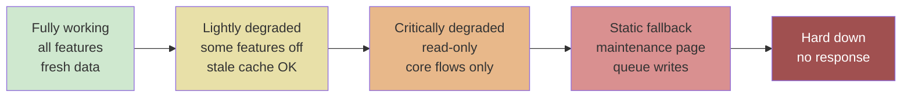
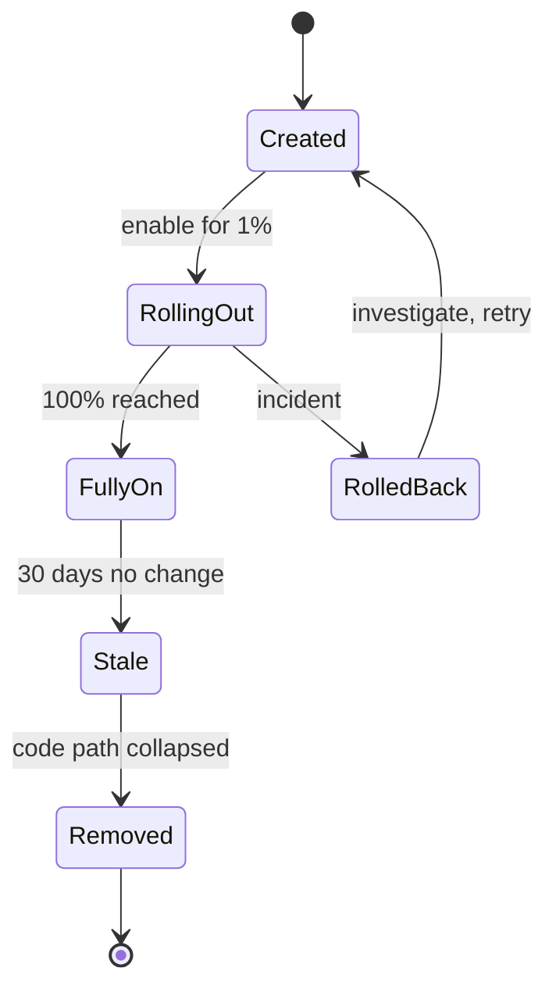
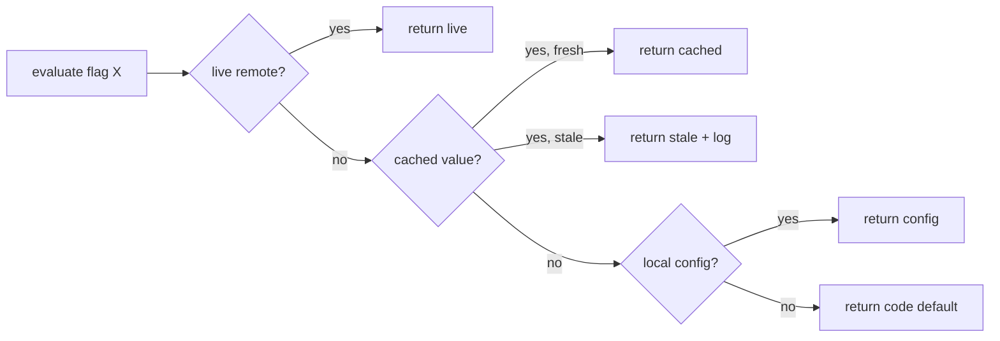

# Graceful Degradation and Feature Flags — Designing for the Middle of the Spectrum

**Date:** 2026-04-25 | **Updated:** 2026-04-25
**Tags:** `system-design` `reliability` `graceful-degradation` `feature-flags` `kill-switches`

## Table of Contents

- [Summary](#summary)
- [The Spectrum: Working → Degraded → Down](#the-spectrum-working--degraded--down)
- [Tiered Degradation](#tiered-degradation)
- [Examples by Domain](#examples-by-domain)
- [Designing Degradation per Dependency](#designing-degradation-per-dependency)
- [Kill Switches](#kill-switches)
- [Feature Flags vs Config Flags vs Experiments vs Ops Switches](#feature-flags-vs-config-flags-vs-experiments-vs-ops-switches)
- [Flag Types](#flag-types)
- [Flag Lifecycle and Flag Rot](#flag-lifecycle-and-flag-rot)
- [Implementation Options](#implementation-options)
- [Flag Evaluation Hierarchy](#flag-evaluation-hierarchy)
- [Rollback in Seconds](#rollback-in-seconds)
- [Circuit Breaker + Flag Integration](#circuit-breaker--flag-integration)
- [Observability for Degraded Mode](#observability-for-degraded-mode)
- [Capacity Planning for Degradation](#capacity-planning-for-degradation)
- [Anti-Patterns](#anti-patterns)
- [Related](#related)
- [References](#references)

## Summary

Most production outages are not binary. The interesting failure modes happen in the messy middle — a recommender is timing out, a payment gateway is flapping, a cache is cold, a region is partially partitioned. Systems that survive this middle are designed for **graceful degradation**: they shed non-essential features, fall back to simpler algorithms, serve stale data, and keep the critical path alive. **Feature flags** and **kill switches** are the runtime levers that make this possible without redeploying. Together they give you tiered availability, second-scale rollback, and safer launches — at the cost of a new failure surface (the flag system itself) and a real maintenance burden (flag rot). This doc covers the design model, the tooling, and the operational discipline.

## The Spectrum: Working → Degraded → Down

Reliability conversations often collapse into "up" vs "down". Real systems live on a spectrum:



The point is not "avoid the right side"; the point is to **design the middle states explicitly** instead of letting them emerge by accident. An emergent degraded mode tends to be a brownout — slow timeouts, half-broken pages, retries amplifying load. A designed degraded mode is intentional: it picks which features to drop, what to serve from cache, what error contract to honour, and when to flip back.

The contract a degraded service offers should be:

- Predictable latency (better to fail fast than hang).
- A documented feature set (callers know what to expect).
- A signal in responses (header, field, or log line) so callers and dashboards can detect "we are degraded right now".
- A path back to full mode that does not require a deploy.

## Tiered Degradation

Define explicit tiers per service, written down in the runbook, with named transitions:

| Tier | Name | What works | What is off | Trigger |
|------|------|-----------|-------------|---------|
| T0 | Full | Everything | Nothing | Normal |
| T1 | Lightly degraded | All endpoints, possibly stale data | Personalization, recommendations, analytics | Recommender SLO breached, cache hit rate dropping |
| T2 | Critical only | Login, read core, place order | Search ranking, related items, reviews | Upstream dependency at error budget cap |
| T3 | Read-only | Browse, read account | Writes, checkout, comments | DB primary unhealthy, write quorum lost |
| T4 | Static | Cached HTML / status page | All dynamic | Region failover, total dependency failure |

Tiers are not religion — they are a forcing function so the team has agreed in peacetime which features can be turned off in wartime, and so the kill switches actually exist before they are needed at 3am.

## Examples by Domain

- **Social feed** — recommender service is down. Tier 1: serve last-known-good ranked feed from cache; Tier 2: serve reverse-chronological feed from primary DB; Tier 3: show "Trending" static list. The user sees a feed in every case.
- **E-commerce checkout** — shipping rate API is flapping. Tier 1: use cached carrier rates by zone; Tier 2: use a flat-rate fallback table; Tier 3: show "shipping calculated at confirmation" and process async.
- **Chat / messaging** — avatar service is down. Tier 1: serve last-cached avatar; Tier 2: serve initials avatar; users still send and receive messages.
- **Search** — vector / ranking service unavailable. Tier 1: fall back to BM25 / keyword search; Tier 2: fall back to substring match against a whitelist of popular queries; Tier 3: redirect to category browse pages.
- **Streaming / video** — CDN edge is sick. Tier 1: lower bitrate; Tier 2: fall back to alternate CDN; Tier 3: audio-only.
- **Banking** — fraud-scoring service is down. Tier 1: cache scores for low-risk customers; Tier 2: hard-limit transaction size and require step-up auth; Tier 3: reject only high-risk corridors.

In every case the **critical path** stays alive and the system shrinks gracefully around its weakest dependency.

## Designing Degradation per Dependency

For every external or internal dependency, write down the answer to: **"If this is unavailable or slow, what do we do?"** Acceptable answers:

1. **Cache** — serve last-known-good (define max staleness).
2. **Default value** — serve a safe, conservative value (e.g., default shipping rate).
3. **Simplified algorithm** — fall back to BM25 instead of vector search; flat heuristic instead of ML model.
4. **Drop the feature** — hide it from the UI behind a flag (e.g., hide the "Recommended" rail).
5. **Queue and apply later** — accept the write into a durable queue; apply when the dependency returns.
6. **Refuse fast** — return a typed error quickly (better than hanging the whole request).

Unacceptable answers:

- "It will retry forever."
- "We will throw a 500 and the client will figure it out."
- "It can't fail." (Yes it can.)

A useful exercise is the **dependency degradation matrix**: rows are dependencies, columns are tiers, cells are the strategy. Walk it in design review.

## Kill Switches

A kill switch is a hard, fast-acting flag that **forces** a feature, dependency, or code path off, regardless of normal flow. Properties of a good kill switch:

- **Granular** — per feature, per dependency, per region, per customer tier. Not one giant red button.
- **Default-safe** — if the flag system itself is down, the switch defaults to the safe value (usually "feature on, but circuit breaker trips fast"). Do not tie the safety of the system to the availability of the flag service.
- **Fast to flip** — propagation in seconds, not minutes. Cache TTLs and fallback layers should respect this.
- **Audited** — who flipped it, when, why. Tied to incident tickets.
- **Exercised** — regularly flipped in chaos drills and game days, not just in real outages. A kill switch you have never tested is a kill switch that does not work.

Examples of switches worth having from day one:

- `feature.recommendations.enabled` — turn off the recommender path entirely.
- `dependency.shippingApi.enabled` — force fallback to cached/flat rates.
- `region.us-east-1.write.enabled` — drain writes from a region.
- `experiment.checkout-v2.enabled` — emergency rollback for a launch.

## Feature Flags vs Config Flags vs Experiments vs Ops Switches

These all look like booleans in code, but they have very different lifecycles, owners, and retention rules. Conflating them is one of the main causes of flag rot.

| Kind | Owner | Lifetime | Audience | Removal |
|------|-------|----------|----------|---------|
| Release flag | Dev team | Days–weeks | All / internal | Removed after 100% rollout |
| Experiment flag | Product / data | Weeks–months | Cohorts | Removed after experiment concludes |
| Ops kill switch | SRE / platform | Years (forever) | All | Kept indefinitely |
| Permission / entitlement | Product | Forever | Per user / plan | Migrates to a real authz system |
| Config flag | Platform | Forever | Environment | Lives in config, not the flag tool |

Rule of thumb: if it is "do this for paying users only", it is **entitlement**, not a feature flag — it should live in your authz system, not LaunchDarkly. If it is "use queue depth 200 instead of 100", it is **config**, not a feature flag — it belongs in a config file or config service.

## Flag Types

- **Release Toggles** — short-lived, dev-owned, used to ship code dark and turn it on gradually. Should be deleted as soon as the rollout finishes. Anything else is dead code in disguise.
- **Experiment Toggles** — A/B/n testing, owned by product/data. Tied to an analytics pipeline; their value comes from the measurement, not the toggle. Remove once the experiment ships or is killed.
- **Ops Toggles / Kill Switches** — long-lived, SRE/platform-owned. They are infrastructure. They have runbooks. They are exercised in game days.
- **Permission Toggles** — entitlement gates ("Pro feature"). Often misused as feature flags; usually belong in your billing/authz domain instead.

## Flag Lifecycle and Flag Rot

Every flag has a birth, a monitoring phase, an expiry, and a removal. If you skip the last step, the flag becomes technical debt:

- **Birth** — created with an owner, an expected lifetime, and a removal ticket already filed.
- **Monitoring** — telemetry on which path is being taken; alerts on long-tail "old path still active" cases.
- **Expiry** — flag tool flags it as stale; ownership review.
- **Removal** — code path collapsed, tests updated, flag deleted from the tool.



**Flag rot** is what happens when release flags become permanent. Symptoms: thousands of flags in the tool, no one knows who owns them, evaluation hot paths now branch on a stale flag that nobody dares delete. Mitigations:

- Default expiration date on every release flag (hard-coded in the tool or via lint).
- Quarterly flag clean-up day per team.
- CI lint rule that fails the build when a flag is older than X days and has no ticket.
- Distinct tooling/projects for release flags vs ops switches so the long-lived ones do not hide the rot.

## Implementation Options

**Hosted SaaS:**

- **LaunchDarkly** — mature, multi-language SDKs, percentage rollouts, targeting rules, audit log.
- **Optimizely** — strong on experimentation/stats; flags are a side effect.
- **Statsig** — experimentation-first, generous free tier, good for product teams.
- **Split.io** — feature delivery + experimentation.

**Open source / self-hosted:**

- **Unleash** — open source, well-documented, Node/Java SDKs, simple data model.
- **GrowthBook** — open source, experimentation-leaning.
- **Flagsmith** — open source, hosted option available.

**Spec / portability:**

- **OpenFeature** (CNCF) — vendor-neutral SDK and provider interface. Lets you swap providers without rewriting call sites. Strongly recommended as the abstraction in any non-trivial codebase.

**In-house:** for low-volume use cases, a YAML/JSON file in a config repo, or a Redis-backed flag store with a thin SDK, can be enough. The hard parts are not "store a boolean"; they are auditability, propagation, targeting, and offline behavior.

```ts
// LaunchDarkly TS — typical evaluation in a request handler
import * as LD from "launchdarkly-node-server-sdk";

const ld = LD.init(process.env.LD_SDK_KEY!, {
  // local default if LD is unreachable at SDK init
  offline: false,
});

await ld.waitForInitialization();

export async function getFeed(userId: string, locale: string) {
  const ctx = { kind: "user", key: userId, locale };
  const useNewRanker = await ld.variation(
    "feed.ranker.v2",
    ctx,
    /* default if eval fails */ false,
  );
  return useNewRanker ? rankWithV2(userId) : rankWithV1(userId);
}
```

```yaml
# Unleash strategy config — gradual rollout with a kill switch fallback
features:
  - name: checkout.shipping-v2
    enabled: true
    strategies:
      - name: gradualRolloutUserId
        parameters:
          percentage: "25"
          groupId: "checkout"
      - name: flexibleRollout
        parameters:
          stickiness: "userId"
          rollout: "25"
    variants: []
  - name: ops.shippingApi.killswitch
    description: "Force fallback to cached/flat shipping rates"
    enabled: false # default: not killed
    strategies:
      - name: default
```

```ts
// Fallback pseudocode — degrade per dependency
async function getShippingQuote(order: Order): Promise<Quote> {
  if (await flags.eval("ops.shippingApi.killswitch", false)) {
    return cachedOrFlatRate(order); // T2 fallback
  }
  try {
    return await withTimeout(shippingApi.quote(order), 250);
  } catch (err) {
    metrics.incr("shipping.fallback", { reason: errClass(err) });
    return cachedOrFlatRate(order); // T1 fallback (cache → flat)
  }
}
```

## Flag Evaluation Hierarchy

A robust client evaluates a flag through layers, falling back as each one fails:

1. **Local default** baked into the binary — last line of defense, used if everything else fails.
2. **Local config file** shipped with the deploy — survives even if the network is gone.
3. **Cached remote value** in memory or local disk — TTL and last-known-good rules.
4. **Live remote value** from the flag service — preferred when available.



Critical rule: **the system must boot, serve, and behave safely if the flag service is completely down**. If your service crashes when LaunchDarkly is unreachable, you have made the flag service a tier-1 dependency without meaning to.

## Rollback in Seconds

A flag flip is the fastest rollback you have. Compare:

| Mechanism | Typical time | Risk |
|-----------|--------------|------|
| Flag flip | seconds | low; immediate, audited, reversible |
| Config push | minutes | medium; depends on config rollout |
| Git revert + redeploy | 10–60+ min | higher; new build, new artifact |
| DNS / region failover | minutes–hours | high; broad blast radius |

This is why **every risky launch should ship behind a flag with a kill switch**. "We can revert in 5 minutes" is not a substitute. The on-call engineer at 3am wants one button, not a deploy pipeline.

## Circuit Breaker + Flag Integration

Flags and circuit breakers compose. The breaker detects local trouble; the flag is the global override.

- **Flag forces breaker open** — `ops.recommender.killswitch=true` short-circuits all calls and goes straight to fallback. Used when a known-bad dependency is having a wider incident than a single instance can detect.
- **Flag overrides retry budget** — under degraded mode, drop retries to 0 to protect the upstream from retry storms.
- **Flag tightens timeouts** — `degraded.shippingApi.timeoutMs=100` instead of 500, to fail fast.
- **Flag relaxes guardrails** — temporarily increase queue depth or rate limit during a planned event.

For the breaker / bulkhead / backpressure mechanics this composes with, see `../scalability/backpressure-bulkhead-circuit-breaker.md`.

## Observability for Degraded Mode

If you cannot tell from a dashboard that the system is currently degraded, you do not have graceful degradation — you have undefined behaviour. Required signals:

- **Path taken** — log/metric per request indicating which tier served it (`tier=T0` vs `tier=T1`).
- **Flag state telemetry** — every flag evaluation emits `(flag, variant, reason)` so you can correlate behaviour with toggles.
- **Degraded-mode SLO** — define a separate SLO for "we are in T1+" — both the duration we spent there and the success rate while there.
- **Alert on duration in degraded mode** — entering T1 is fine; staying there for 6 hours is an incident in itself.
- **Alert on stale-cache age** — if the cache fallback is feeding requests with 30-minute-old data, that should page someone.
- **User-visible signal** — sometimes a small "limited functionality" banner is more honest than pretending everything is fine; this also reduces support load.

For dashboard structure and on-call ergonomics, see `../performance-observability/dashboards-runbooks-on-call.md`.

## Capacity Planning for Degradation

Degraded mode is not free. Common surprises:

- **Cache stampede** — when a downstream dies and everyone falls back to the cache, the cache layer suddenly takes 10x its usual QPS.
- **Fallback service overload** — Tier 2 fallback DB query is heavier than the cached Tier 1 path; the fallback path must be capacity-tested at full upstream load.
- **Retry amplification** — if clients still retry while you are degraded, the offered load can be 3–5x normal even though the system is doing less.
- **Synchronous → asynchronous shift** — a queue-and-apply fallback shifts load to a background worker that may not be sized for it.

Mitigation: load-test the **degraded path** at expected (and worst-case) rates, not just the happy path. Game days are the cheap way to find these.

## Anti-Patterns

- **Boolean "feature on/off" without tiered design.** Real outages are not binary; neither should your toggles be. Have at least one "reduced functionality" tier per major feature.
- **Flags that never get cleaned up.** Release flags that have been at 100% for 18 months are dead code with extra steps. Set expiry dates and enforce them.
- **Hidden coupling via flag.** One flag silently controlling 10 unrelated features is a landmine — flipping it for one purpose breaks the others. Keep flags single-purpose; if you need a fleet move, use a typed group.
- **Flag evaluation in the hot path with a network call.** SDK should evaluate locally from a streamed/polled ruleset; never go over the network per request.
- **No telemetry on flag state.** If you can't answer "what did this user see?" from logs, the flag is invisible — and so is your incident.
- **Releasing without a kill switch.** "We can't fail" is not a strategy. Every meaningful launch ships with at least one ops switch behind it.
- **Treating the flag service as a hard dependency.** If it is down and your service stops, you have built a single point of failure. Local defaults and last-known-good values are non-negotiable.
- **Mixing experiment flags and ops flags in one project.** Different lifecycles, different owners, different SLAs. Keep them separated, ideally in different tools or projects.
- **Letting devs add flags freely with no review.** Each flag is a permanent branch in production; require an owner, an expiry, and a removal plan at creation time.
- **Skipping chaos drills on the kill switches.** A switch you have never flipped under load is not a switch — it is a hope.

## Related

- [chaos-engineering-and-game-days.md](./chaos-engineering-and-game-days.md) — exercise the kill switches and degraded paths under controlled conditions.
- [failure-modes-and-fault-tolerance.md](./failure-modes-and-fault-tolerance.md) — the failure taxonomy that informs which tiers and fallbacks you need.
- [../scalability/backpressure-bulkhead-circuit-breaker.md](../scalability/backpressure-bulkhead-circuit-breaker.md) — the runtime mechanisms that compose with flags and degradation tiers.
- [../performance-observability/dashboards-runbooks-on-call.md](../performance-observability/dashboards-runbooks-on-call.md) — how degraded-mode signals show up on dashboards and runbooks.

## References

- Martin Fowler — "Feature Toggles (aka Feature Flags)" by Pete Hodgson. <https://martinfowler.com/articles/feature-toggles.html>
- Pete Hodgson — original "Feature Toggles" essay (same canonical piece, hosted on martinfowler.com).
- LaunchDarkly Documentation — flag types, targeting, SDKs. <https://docs.launchdarkly.com/>
- Unleash Documentation — strategies, variants, self-hosting. <https://docs.getunleash.io/>
- GrowthBook Documentation — open source feature flags and experimentation. <https://docs.growthbook.io/>
- Atlassian — "Feature flags: best practices and tools". <https://www.atlassian.com/continuous-delivery/principles/feature-flags>
- OpenFeature Specification (CNCF) — vendor-neutral flag evaluation API. <https://openfeature.dev/specification/>
- Google SRE Book — "Handling Overload" and "Addressing Cascading Failures" (graceful degradation, load shedding). <https://sre.google/sre-book/handling-overload/> and <https://sre.google/sre-book/addressing-cascading-failures/>
