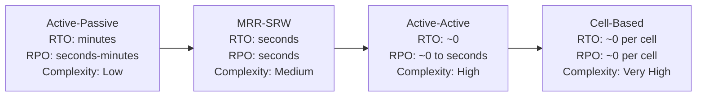
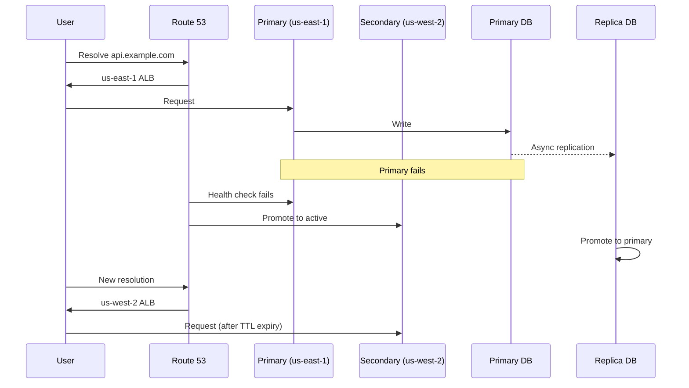
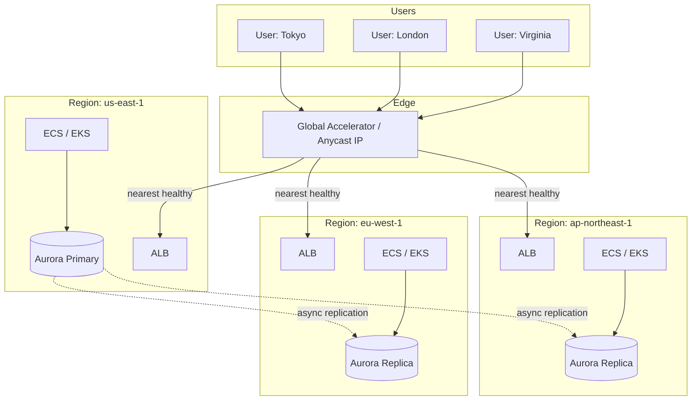

# Multi-Region Architectures — Active-Active, Active-Passive, Geo-Routing

**Date:** 2026-04-25 | **Updated:** 2026-04-25
**Tags:** `system-design` `reliability` `multi-region` `active-active` `geo-routing` `dr`

## Table of Contents

- [Summary](#summary)
- [Why Multi-Region](#why-multi-region)
- [The Cost of Multi-Region](#the-cost-of-multi-region)
- [Topologies](#topologies)
  - [Active-Passive (Failover)](#active-passive-failover)
  - [Active-Active (All Regions Serve)](#active-active-all-regions-serve)
  - [Multi-Region Read, Single-Region Write](#multi-region-read-single-region-write)
  - [Cell-Based / Sharded Multi-Region](#cell-based--sharded-multi-region)
- [Data Replication Strategies](#data-replication-strategies)
  - [Synchronous Multi-Region](#synchronous-multi-region)
  - [Asynchronous Multi-Region](#asynchronous-multi-region)
- [Conflict Resolution](#conflict-resolution)
- [Geo-Routing Mechanisms](#geo-routing-mechanisms)
- [Failover Mechanics](#failover-mechanics)
- [Stateful vs Stateless Components](#stateful-vs-stateless-components)
- [Data Residency](#data-residency)
- [Cost Optimization](#cost-optimization)
- [Real-World Patterns](#real-world-patterns)
- [Anti-Patterns](#anti-patterns)
- [Related](#related)
- [References](#references)

## Summary

Multi-region architecture is the most expensive reliability investment a backend team can make and the one most often justified by hand-waving. The promise is simple: survive the loss of an entire AWS region, serve users at edge latencies, and respect data residency laws. The cost is brutal: 2–5x operational complexity, 1.5–3x infrastructure spend, and a data layer that suddenly has to reckon with the speed of light. This doc walks through the four real topologies (active-passive, active-active, multi-region-read-single-write, cell-based), the replication models that underpin them, the geo-routing layer that distributes traffic, and the failover mechanics that determine whether your DR plan actually works in production. The honest answer for most companies is "you don't need this yet" — but if you do, the engineering investment is non-negotiable.

## Why Multi-Region

Three legitimate drivers — and only three:

1. **Region-scale failure tolerance.** Single-region outages happen. AWS us-east-1 has had multiple multi-hour incidents (Dec 2021, June 2023, July 2024). A single-region deployment is offline during those hours, full stop. Multi-region buys you the ability to fail over and keep serving.
2. **Latency for global users.** Round-trip from Sydney to us-east-1 is ~200ms. Round-trip to ap-southeast-2 is ~5ms. For interactive UIs, payment flows, or anything chatty, the latency budget evaporates fast on a single-region deployment.
3. **Data residency / regulatory.** GDPR, China's PIPL, India's DPDP, Russia's data localization law, Brazil's LGPD. Some jurisdictions legally require user data to stay within national borders. There is no software workaround.

If your driver is "we want 99.99% uptime" and you don't have one of the three above, fix your single-region reliability first (auto-scaling groups, multi-AZ, automated runbooks, chaos testing). You'll get more nines for less money.

## The Cost of Multi-Region

The bill comes due in four places:

| Cost dimension | Single region | Multi-region (2 regions) | Notes |
|---|---|---|---|
| Infrastructure | 1x | 1.5–2x (active-passive), 1.8–3x (active-active) | Standby capacity, replication transfer, cross-region egress |
| Operational complexity | 1x | 2–5x | Two of everything: deploys, runbooks, monitoring, on-call |
| Data layer complexity | 1x | High | Replication lag, conflict resolution, schema migration coordination |
| Team headcount | 1x | +30–50% | SRE, platform, DBA hours scale with region count |

Cross-region egress alone deserves attention: AWS charges ~$0.02/GB for inter-region transfer. A service replicating 100 TB/month between two regions burns ~$2K/month just on data transfer, before any compute.

Do it for the right reason. "Marketing wants to say multi-region" is not a reason.

## Topologies

The choice of topology is dictated by your **RTO** (Recovery Time Objective — how fast you can recover) and **RPO** (Recovery Point Objective — how much data you're willing to lose).



### Active-Passive (Failover)

The primary region serves all traffic. The secondary is a warm replica — running, replicating data, but not handling user requests.

- **Failover trigger:** primary region health check fails OR human operator presses the button.
- **RTO:** typically 5–30 minutes. DNS propagation and warm-up take real time.
- **RPO:** seconds to minutes, depending on async replication lag.
- **Strengths:** simpler than active-active, no conflict resolution, single source of truth.
- **Weaknesses:** secondary capacity is paid for but mostly idle; failover is risky if untested; data loss during the gap between last replicated write and failover.



### Active-Active (All Regions Serve)

Every region serves live production traffic. Users are routed to the nearest healthy region.

- **RTO:** effectively zero — losing a region just removes it from rotation.
- **RPO:** zero (synchronous) or seconds (asynchronous).
- **Strengths:** lowest user-facing impact during region failure; latency benefits for global users; full utilization of standby capacity.
- **Weaknesses:** the data layer is hard. Either you accept replication lag and conflict resolution, or you pay the latency penalty of synchronous quorums.

The hard part is never the stateless web tier. It's "how do two regions both accept writes for the same user account without corruption."

### Multi-Region Read, Single-Region Write

The pragmatic compromise. All regions serve reads from local replicas. Writes always route to a designated "home region" for the data.

- **RTO/RPO:** good for reads, worse for writes. Loss of the write region requires promotion.
- **Strengths:** no write conflicts (single writer per shard); read latency is great everywhere.
- **Weaknesses:** write latency is the worst-case round-trip from the user to the home region; failover for writes is non-trivial.

Common in: most "global" SaaS apps that say "active-active" but are really MRR-SRW. Aurora Global Database in default config, DynamoDB before Global Tables, most Postgres setups with read replicas.

### Cell-Based / Sharded Multi-Region

Each region owns a partition (cell) of the data. User A's data lives in `us-east-1`, user B's data lives in `eu-west-1`. No cross-region writes for any single shard's data.

- **RTO/RPO:** per-cell. A cell failure affects only that cell's users.
- **Strengths:** no global write coordination, no conflict resolution, blast radius contained to one cell.
- **Weaknesses:** cross-cell operations (a transfer from a US user to an EU user) require explicit two-phase coordination; routing layer must know which cell owns each entity.

This is what AWS itself uses internally (cell-based DynamoDB, S3) and what Stripe uses for its regional partitioning. It's the most operationally robust pattern but requires the data model to support clean partitioning by tenant or geography.

## Data Replication Strategies

Multi-region data is the choice between two evils:

- **Synchronous replication:** writes commit to multiple regions before returning success. RPO ≈ 0. Latency is bounded by inter-region round-trip — typically 50–200ms — multiplied by the number of round-trips your protocol takes (Paxos/Raft consensus is 1–2 RTTs).
- **Asynchronous replication:** writes commit locally and replicate in the background. Latency stays at single-region speeds. RPO is the replication lag — usually seconds, but can spike to minutes under load or network issues.

The spec dictates which fits. Money movement, identity, anything legally binding → sync, even at the latency cost. Product analytics, social timelines, most user content → async, optimize for write latency and accept eventual consistency.

### Synchronous Multi-Region

True multi-region sync requires a consensus protocol (Paxos, Raft) running across regions. Modern systems that do this:

- **Google Spanner:** TrueTime + Paxos across regions. Commit latency includes uncertainty interval (~7ms) plus quorum RTT.
- **CockroachDB:** Raft across regions. Configurable replica placement.
- **YugabyteDB:** Spanner-inspired, Raft per shard, multi-region quorums.

The latency cliff is real: a transaction touching a quorum across `us-east-1`, `us-west-2`, and `eu-west-1` pays at least ~70ms (US coast-to-coast RTT) on the commit path, every time.

Use cases that justify it: financial ledgers, compliance-critical state, anything where even a 5-second RPO is unacceptable. Most apps don't need it.

### Asynchronous Multi-Region

Far more common. Mechanisms:

- **Postgres logical replication / streaming replication:** primary streams WAL to replicas. Lag is observable via `pg_stat_replication`.
- **MySQL replication:** binlog-based, similar lag characteristics. GTID-based for clean failover.
- **DynamoDB Global Tables:** multi-master with last-write-wins conflict resolution. Replication lag typically <1 second within AWS.
- **Aurora Global Database:** cross-region storage-level replication, typical lag <1 second, designed for promotion on regional failure (RTO ~1 minute, RPO ~1 second).
- **Kafka MirrorMaker / Cluster Linking:** replicate topics across regions for event-driven architectures.

Operational job #1 with async: monitor replication lag religiously. The lag is your RPO. A replica that's 20 minutes behind is a 20-minute data loss waiting to happen.

```yaml
# Aurora Global Database — illustrative CloudFormation config
Resources:
  GlobalCluster:
    Type: AWS::RDS::GlobalCluster
    Properties:
      GlobalClusterIdentifier: app-global
      Engine: aurora-postgresql
      EngineVersion: "16.2"
      DeletionProtection: true

  PrimaryCluster:
    Type: AWS::RDS::DBCluster
    Properties:
      Engine: aurora-postgresql
      EngineVersion: "16.2"
      GlobalClusterIdentifier: !Ref GlobalCluster
      DBClusterIdentifier: app-primary-use1
      MasterUsername: !Ref DBUser
      MasterUserPassword: !Ref DBPassword
      BackupRetentionPeriod: 14
      StorageEncrypted: true

  SecondaryCluster:
    Type: AWS::RDS::DBCluster
    Properties:
      Engine: aurora-postgresql
      EngineVersion: "16.2"
      GlobalClusterIdentifier: !Ref GlobalCluster
      DBClusterIdentifier: app-secondary-usw2
      SourceRegion: us-east-1
      # Read-only until failover; promotion makes it primary
```

## Conflict Resolution

When two regions accept writes for the same record, you need a strategy for reconciliation:

- **Last-Write-Wins (LWW):** newest timestamp wins. Simple, lossy. Works for "user profile last updated" type data; catastrophic for monetary balances. DynamoDB Global Tables, Cassandra default.
- **CRDTs (Conflict-free Replicated Data Types):** mathematically commutative operations. Counters, sets, ordered lists. No data loss but expressive limits. Used by Redis Enterprise, Riak, Automerge.
- **App-layer reconciliation:** record both versions, surface the conflict to the application or user. Git-style merge for documents (Notion, Figma use variants of this with operational transforms or CRDTs).
- **Vector clocks / version vectors:** detect concurrent updates explicitly, then defer to one of the above.

The honest design question: for which entities can you tolerate LWW, and for which do you need stronger semantics? Money, inventory, anything with conservation laws → not LWW. Profile fields, settings, social-graph follows → LWW is usually fine.

## Geo-Routing Mechanisms

How traffic finds the right region:

| Mechanism | How it works | Failover speed | Caveats |
|---|---|---|---|
| GeoDNS (Route 53 geolocation/latency) | DNS resolves differently per resolver location | Bounded by TTL | Resolver caches outside your control |
| Anycast (BGP) | Same IP advertised from multiple regions; BGP picks shortest path | Sub-second | Requires network presence; not all clouds expose it directly |
| Global Load Balancer | Single virtual IP, cloud routes internally | Seconds | Vendor lock-in; AWS Global Accelerator, GCP Cloud LB, Cloudflare |
| Client-side region affinity | Client app picks region (e.g., from config or geo-IP lookup) | Instant on retry | Requires client logic; web vs mobile behave differently |

```json
{
  "Comment": "Latency + failover routing for api.example.com",
  "Changes": [
    {
      "Action": "UPSERT",
      "ResourceRecordSet": {
        "Name": "api.example.com",
        "Type": "A",
        "SetIdentifier": "us-east-1-primary",
        "Region": "us-east-1",
        "AliasTarget": {
          "HostedZoneId": "Z35SXDOTRQ7X7K",
          "DNSName": "alb-use1-1234567890.us-east-1.elb.amazonaws.com",
          "EvaluateTargetHealth": true
        },
        "HealthCheckId": "abcd-1234-use1"
      }
    },
    {
      "Action": "UPSERT",
      "ResourceRecordSet": {
        "Name": "api.example.com",
        "Type": "A",
        "SetIdentifier": "eu-west-1-primary",
        "Region": "eu-west-1",
        "AliasTarget": {
          "HostedZoneId": "Z32O12XQLNTSW2",
          "DNSName": "alb-euw1-9876543210.eu-west-1.elb.amazonaws.com",
          "EvaluateTargetHealth": true
        },
        "HealthCheckId": "wxyz-9876-euw1"
      }
    }
  ]
}
```

Anycast (used by Cloudflare, AWS Global Accelerator) is structurally superior to GeoDNS because failover is governed by BGP route withdrawal, not DNS TTL. A failed region just stops advertising; traffic shifts in seconds without any client-side cache to wait out.



## Failover Mechanics

The DR plan that's never been exercised is not a DR plan; it's a hypothesis.

**DNS TTL realities.** A 60-second TTL is not a 60-second failover. Many resolvers, ISPs, and corporate networks ignore short TTLs and cache for 5+ minutes. Expect a long tail of stale resolutions even after you cut over. This is why anycast/global-LB approaches outperform pure DNS failover.

**Health checks.** External health checks (Route 53 health checkers, Pingdom, etc.) probe your endpoints. Tune carefully:
- Probe interval: 10–30 seconds typical.
- Failure threshold: 3 consecutive failures before marking unhealthy is reasonable.
- Probe path: hit a deep health endpoint that exercises the database, not just `/healthz` returning 200.

**Automated vs human-in-loop failover.** Spectrum:
- Fully automated: health check fails → DNS / GA shifts traffic. Fast but risky. A flapping primary triggers oscillation.
- Human-in-loop: alert fires → on-call validates → presses the failover button. Slower (10–30 min added), much safer for stateful failover (you don't want auto-promotion of a replica that's 5 minutes behind during a write spike).

A common pragmatic middle: stateless tier auto-fails-over, stateful tier (DB promotion) is human-triggered.

**Split-brain.** Two regions both think they're primary. The horror scenario for active-passive: a network partition between regions causes the secondary to promote itself while the primary is still accepting writes. Now both regions accept writes; reconciliation is manual and painful. Mitigations:
- Fencing tokens (only one writer holds the lease).
- Quorum-based promotion (odd number of arbiters across regions/AZs).
- Manual confirmation for promotion (slower, less likely to corrupt).

**Failback.** Often harder than failover. Once you've cut to the secondary and accepted writes there, you have to replicate those writes back to the original primary before you can return. Plan and rehearse this.

## Stateful vs Stateless Components

Multi-region for stateless tiers is trivial: deploy the same image in N regions, put a load balancer in front. The web tier and most API services fall here.

The stateful tier is where the work actually happens:

- **Primary database.** Replication topology, conflict resolution, failover. The hardest part.
- **Caches.** Per-region Redis is normal — caches are reconstructible. Cross-region cache invalidation is messy; usually solved with TTLs and per-region cache fills.
- **Session stores.** If sessions live in a single region, users get bounced to the wrong region on failover and lose their session. Either replicate session store (DynamoDB Global Tables, Redis CRDTs) or use stateless tokens (JWT) with short rotation.
- **Search indexes.** Reindex from source of truth in each region; or replicate the index (Elasticsearch CCR — Cross-Cluster Replication).
- **Object storage.** S3 Cross-Region Replication, GCS multi-region buckets, Azure RA-GRS. Asynchronous, generally easy.
- **Queues / event streams.** Kafka MirrorMaker 2 / Cluster Linking; SQS does not replicate cross-region — you have to design around it.

## Data Residency

Data residency turns "should we go multi-region" into "we must, by law":

- **GDPR (EU):** EU citizen data should be processable in the EU; cross-border transfers require lawful basis (SCCs, adequacy decisions). The Schrems II ruling complicated US transfers.
- **China (PIPL + Cybersecurity Law):** strict data export controls; "important data" must remain in China. Operating in China typically means a separate, isolated deployment.
- **India (DPDP Act, 2023):** mostly permissive but the government can restrict transfers per-country.
- **Russia:** personal data of Russian citizens must be stored on servers in Russia.
- **Brazil (LGPD):** GDPR-like with extraterritorial reach.

Design implications:
- **Shard by jurisdiction.** EU users' data lives in EU regions; Chinese users in CN regions. Routing layer enforces this.
- **No cross-region replication for residency-controlled data.** This breaks active-active; cell-based per-jurisdiction is the natural fit.
- **Separate control planes for some markets.** China typically gets its own ops account, separate identity, separate keys.
- **Data classification.** Not all data needs the same treatment — distinguish PII, payment, telemetry, etc.

## Cost Optimization

Multi-region is expensive but the bill has knobs:

- **Cold standby:** secondary is data-only (storage replication), no compute running. Cheapest. RTO is hours (provision compute on demand).
- **Warm standby:** secondary runs minimal compute (auto-scaling group with min=1, idle), data replicating. Moderate cost. RTO is minutes.
- **Hot / pilot light:** secondary runs at 30–50% of primary capacity, ready to absorb traffic with rapid scale-up.
- **Hot active-active:** both regions at full capacity. Most expensive, lowest RTO.

**Scale-to-zero secondaries.** For predictable workloads, the secondary can scale to zero compute and rely on data-only replication, with autoscaling kicking in on failover. Saves 40–60% on standby compute spend.

**Tiered storage replication.** Not all data needs cross-region replication. S3 lifecycle rules + selective replication (only `tier=critical` prefixes) cut transfer costs significantly.

**Cross-region transfer minimization.** Compress before replicating; batch small writes; replicate only what's necessary; consider CDN-fronted assets to avoid origin replication.

**Reserved capacity / savings plans** apply per-region; commit appropriately.

## Real-World Patterns

**Netflix (active-active across AWS regions).** The canonical reference. Three AWS regions, each capable of serving 100% of global traffic. Cassandra (multi-region with eventual consistency) for state. Chaos engineering — they actively kill regions in production via Chaos Kong. The architecture works because Netflix's data model (viewing history, recommendations, video metadata) tolerates seconds of replication lag.

**Stripe (regional partitioning, cell-based).** Stripe Connect and core processing are partitioned by region. Each region is a self-contained "cell" with its own primary database. Cross-region operations (payouts that cross jurisdictions) explicitly use two-phase commit semantics at the application layer. This pattern reflects the financial domain — money movement across cells is rare and can pay the coordination cost; intra-cell operations are fast.

**Cloudflare (anycast everything).** Global anycast network; same IP advertised from 300+ data centers. BGP and the topology of the internet handle routing. State is mostly avoided at the edge — workers are stateless, durable storage (Workers KV, R2, D1) replicates from a small number of master regions. The result: failover is sub-second because BGP withdraws routes when a PoP fails.

**Spotify ("GIM" — Global Identity Management).** Spotify pioneered a pattern where user identity and account state are globally consistent (small data, can afford strong consistency), while music catalog and recommendations are per-region with eventual consistency (large data, can tolerate lag). The split is deliberate: pay the consistency cost only where it matters.

**AWS internal services (cell-based architecture).** S3, DynamoDB, Lambda are all cell-based internally — many small independent cells per region rather than one giant deployment. Failures contained to single cells. This is the pattern AWS recommends to its biggest customers and is documented in the "Static Stability" papers from the Builders' Library.

## Anti-Patterns

- **Multi-region without testing failover.** If you've never failed over to the secondary, you don't have a secondary — you have a config file. Run quarterly DR drills. Netflix-style chaos testing if you can stomach it.
- **Synchronous replication across continents.** Strong consistency across `us-east-1` and `ap-northeast-1` means every write pays ~150ms. The latency cliff makes the system unusable for interactive workloads. Use sync only within a region or between geographically close regions (e.g., `us-east-1` and `us-east-2`).
- **DNS failover with long TTLs.** A 24-hour TTL means 24-hour failover. If you're relying on DNS, set TTLs to 60s and accept the long tail; if you can't tolerate the long tail, use anycast or a global LB.
- **No cross-region disaster drills.** Untested failovers fail. Schedule them, run them, fix what breaks, repeat.
- **Multi-region for marketing without engineering.** "We're multi-region!" marketing while the data layer is single-region with broken failover is worse than honest single-region. It creates false expectations and hidden risk.
- **Ignoring data residency until legal asks.** Retrofitting GDPR/PIPL into an existing global database is a multi-quarter project. Bake residency into the data model from the start if you operate in regulated markets.
- **Treating active-active as a deployment concern.** Active-active is a data architecture problem first, deployment problem second. If your data layer can't handle concurrent multi-region writes, putting copies of the app in two regions doesn't make you active-active — it makes you broken.
- **Replicating everything.** Cross-region transfer is expensive. Audit what genuinely needs replication vs what can be reconstructed from source.

## Related

- [disaster-recovery.md](./disaster-recovery.md)
- [failure-modes-and-fault-tolerance.md](./failure-modes-and-fault-tolerance.md)
- [Replication Patterns](../scalability/replication-patterns.md)
- [Sharding Strategies](../scalability/sharding-strategies.md)
- [Load Balancers](../building-blocks/load-balancers.md)

## References

- AWS — *Multi-Region Application Architecture* whitepaper. <https://docs.aws.amazon.com/whitepapers/latest/aws-multi-region-fundamentals/>
- AWS — *AWS Global Accelerator Developer Guide*. <https://docs.aws.amazon.com/global-accelerator/latest/dg/what-is-global-accelerator.html>
- AWS Builders' Library — *Static stability using Availability Zones* and *Workload isolation using shuffle-sharding*. <https://aws.amazon.com/builders-library/>
- Google Cloud — *Patterns for scalable and resilient apps* (multi-region patterns). <https://cloud.google.com/architecture/scalable-and-resilient-apps>
- Cloudflare — *How Cloudflare's Anycast Network Works*. <https://blog.cloudflare.com/a-brief-anycast-primer/>
- Google — *Spanner: Google's Globally-Distributed Database* (OSDI 2012). <https://research.google/pubs/pub39966/>
- AWS — *Amazon Aurora Global Database* documentation. <https://docs.aws.amazon.com/AmazonRDS/latest/AuroraUserGuide/aurora-global-database.html>
- AWS — *Amazon DynamoDB Global Tables* documentation. <https://docs.aws.amazon.com/amazondynamodb/latest/developerguide/GlobalTables.html>
- Netflix Tech Blog — *Active-Active for Multi-Regional Resiliency*. <https://netflixtechblog.com/active-active-for-multi-regional-resiliency-c47719f6685b>
