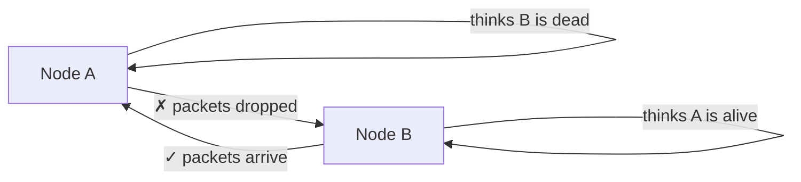
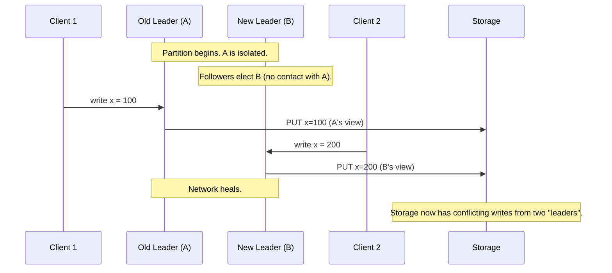
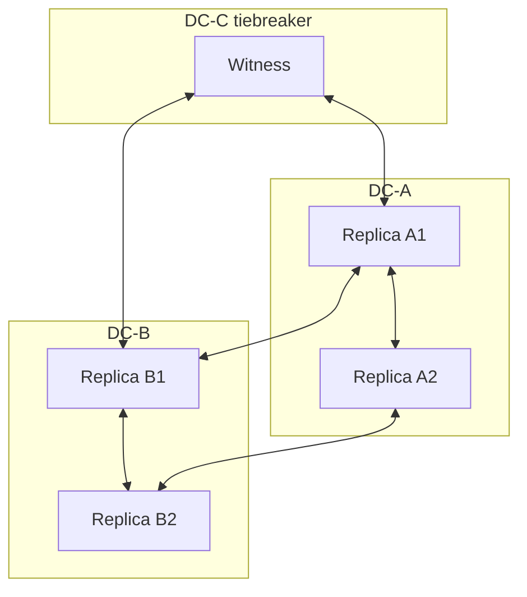
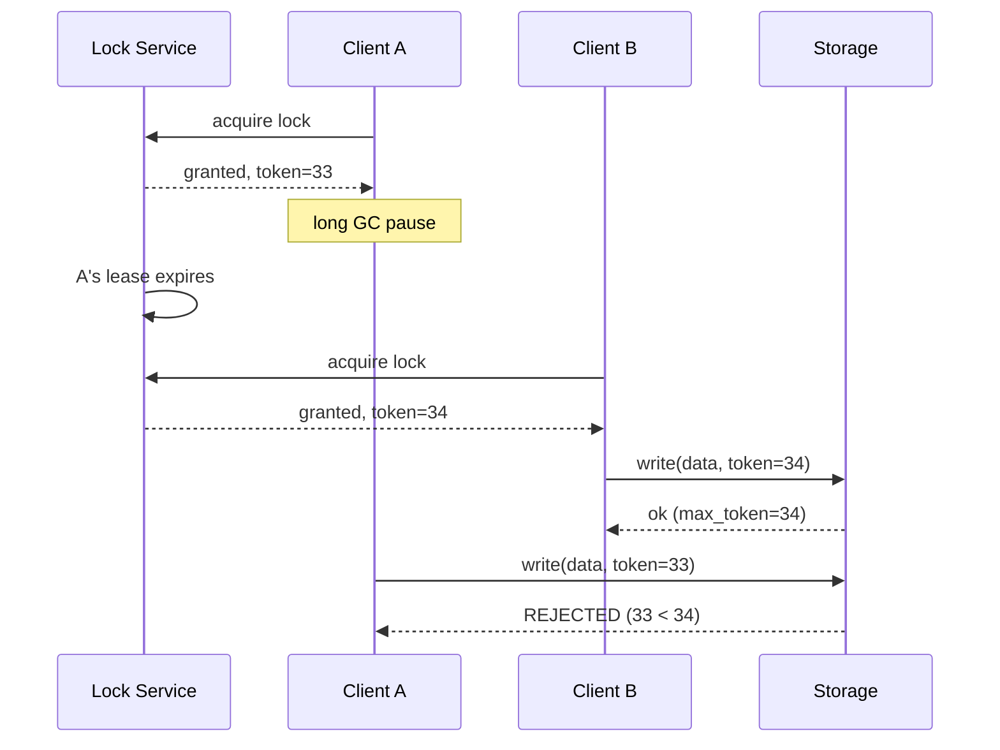

# Network Partitions and Split Brain — Why the Network Lies and How Quorums, Fencing, and STONITH Save You

**Date:** 2026-04-25 | **Updated:** 2026-04-25
**Tags:** `system-design` `reliability` `network-partitions` `split-brain` `fencing`

## Table of Contents

- [Summary](#summary)
- [Partitions Happen — The Network Is Not Reliable](#partitions-happen--the-network-is-not-reliable)
- [The Partition Forms in Many Shapes](#the-partition-forms-in-many-shapes)
  - [Symmetric vs Asymmetric](#symmetric-vs-asymmetric)
  - [Total vs Flaky / Partial](#total-vs-flaky--partial)
  - [Gray Partition](#gray-partition)
  - [Brown-Out](#brown-out)
- [The CAP Choice Is Forced During a Partition](#the-cap-choice-is-forced-during-a-partition)
- [Split Brain — Two Leaders, One Truth](#split-brain--two-leaders-one-truth)
- [How Split Brain Happens](#how-split-brain-happens)
- [Quorum as Partition Defense](#quorum-as-partition-defense)
- [Witness / Observer Nodes](#witness--observer-nodes)
- [Fencing Tokens](#fencing-tokens)
- [STONITH — Shoot The Other Node In The Head](#stonith--shoot-the-other-node-in-the-head)
- [Real Examples](#real-examples)
  - [etcd and Kafka KRaft — Minority Stops Cleanly](#etcd-and-kafka-kraft--minority-stops-cleanly)
  - [Postgres Synchronous Replication Failover](#postgres-synchronous-replication-failover)
  - [Redis Sentinel — A Cautionary Tale](#redis-sentinel--a-cautionary-tale)
- [Detection](#detection)
- [Recovery](#recovery)
- [Anti-Patterns](#anti-patterns)
- [Related](#related)
- [References](#references)

## Summary

Networks fail constantly, and they fail in messy, asymmetric, partial ways — not in the clean "node up / node down" model that distributed systems whiteboards assume. When a network partition happens, a system must choose between **availability** (keep accepting writes on both sides, risk divergence) and **consistency** (block one side, preserve correctness). Choosing availability without engineering against **split brain** — two halves both believing they are the leader — is how you lose data, corrupt invariants, and end up doing manual reconciliation at 3 a.m. The defenses are well-known: quorum-based leader election, witness nodes for symmetric setups, monotonic **fencing tokens** that the storage layer enforces, and in HA clusters, **STONITH** to physically isolate a suspected failed node.

## Partitions Happen — The Network Is Not Reliable

Production network failures are not exotic. The Bailis & Kingsbury survey [*The Network is Reliable*](https://queue.acm.org/detail.cfm?id=2655736) catalogs partitions in EC2, GCE, on-premise data centers, ToR switch failures, asymmetric BGP route flaps, kernel bugs in network drivers, garbage collection pauses that look indistinguishable from a partition to peers, and so on. The realistic baseline is not "a partition might happen once a year for a few seconds." It is closer to:

> Partitions of tens of seconds are routine. Partitions of minutes happen. The system you ship will see them.

Aphyr's [Jepsen](https://jepsen.io/) project has, over more than a decade, demonstrated that essentially every distributed database — including ones marketed as "CP" — exhibits anomalies under partition conditions that the documentation did not promise. The lesson is not "everything is broken." The lesson is: **design as if the network will partition, because it will**.

Common physical causes:

- ToR (top-of-rack) switch failure isolating a rack
- Misconfigured BGP route, or a route flap during a maintenance change
- Cross-AZ link saturation under unusual traffic
- Cloud provider control plane incident affecting one AZ's networking
- Kernel network stack bug under specific load patterns
- A long stop-the-world GC pause on a leader that, from the outside, looks identical to "leader is unreachable"

A long GC pause is the canonical example of why partitions are subtler than they appear: the leader is *running normal code locally*, but its peers have already concluded it is dead and elected a new one. From the leader's point of view, everything is fine. From the cluster's point of view, there are now two leaders.

## The Partition Forms in Many Shapes

The mental model "the cluster cleanly splits into two halves" is almost never what actually happens.

### Symmetric vs Asymmetric

A **symmetric** partition is the textbook case: A cannot reach B, and B cannot reach A. This is the partition every consensus paper assumes.

An **asymmetric** partition is far nastier: A can send packets to B, but B's responses to A are dropped. From A's perspective, B is unreachable. From B's perspective, A is reachable and is sending requests. This breaks heartbeat and timeout assumptions — B may keep "reporting healthy" up some path that does work, while every direct probe from A times out.



Asymmetric partitions are common with stateful firewalls, NAT misconfigurations, and one-directional route changes.

### Total vs Flaky / Partial

A **total** partition is a clean cut for some duration. Easy to reason about, rare in practice.

A **flaky** or **partial** partition drops a percentage of packets — say, 30% loss for ten minutes. TCP retransmits cover for some of it; application-level timeouts blow up; consensus protocols flap between leaders; client libraries retry storms hit the partially-up side. Many production "partitions" are actually 5–40% loss for a window, not zero connectivity.

### Gray Partition

A **gray partition** is a degradation where p99 latency rises from 5 ms to 8 seconds, but no packet is technically lost. Health checks that ping `/healthz` and expect a 200 succeed (the health check doesn't time out), but real RPCs do time out, or pile up in queues until the process OOMs. Monitoring shows everything green. Users see hard failures.

Gray partitions are particularly dangerous because automated failover often will not trigger — the failure detector sees the node as "up" — and yet the node cannot do useful work.

### Brown-Out

A **brown-out** is overload-induced partial unreachability. The node is alive, the network is fine, but the node is so saturated (CPU pinned, file descriptor exhaustion, GC thrash, queue full) that responses are dropped or arrive too late. From outside, this looks like a partial partition; from inside, the node *is* trying to serve traffic. Cascading failure usually follows: clients retry, retries amplify load, more nodes brown out, the brown-out spreads.

## The CAP Choice Is Forced During a Partition

[CAP](../foundations/cap-and-consistency-models.md) is often miscited as "pick two of three." The accurate version: **during a network partition**, a system must sacrifice either consistency or availability. There is no third option. You cannot serve linearizable reads on both sides of a partition.

The design question is not "do I want CP or AP" in the abstract. It is:

> When the partition occurs — and it will — which side, if any, should keep accepting writes? What invariants must I protect, and what can I afford to lose?

Examples:

- **Bank account balance**: must be CP. A double-spend across the partition is unacceptable. The minority side stops.
- **Shopping cart**: typically AP. Both sides keep accepting "add to cart"; on heal, merge with last-write-wins or set-union; the user notices nothing.
- **Configuration store / service discovery**: CP. You absolutely do not want two halves of your cluster believing they are routing to different versions of a service.
- **Metrics / log ingestion**: AP. Drop or merge later — keeping the firehose flowing matters more than perfect ordering.

The choice is not made at runtime. It is made at design time, by picking the storage primitive (etcd vs Cassandra, Postgres vs DynamoDB) and accepting its partition behavior.

## Split Brain — Two Leaders, One Truth

**Split brain** is the failure mode in which a partition causes two halves of a cluster to each elect their own leader. Both leaders accept writes. Both believe they are authoritative. The system's invariant — "there is exactly one leader" — has been violated, and divergent state accumulates on both sides.



What goes wrong:

- **Conflicting writes** — the same key updated by both leaders, with different values
- **Broken uniqueness invariants** — both halves issue invoice #4012 to different customers
- **Out-of-order causal chains** — a transaction commits on A, references a row that B has just deleted
- **Lost writes on heal** — many auto-recovery strategies discard one side's writes when reconciling

The most painful aspect of split brain is that *each side looks healthy from inside*. There are no errors to log. The problem only becomes visible later, often when a downstream consumer notices an inconsistency, or worse, a customer does.

## How Split Brain Happens

Split brain is rarely caused by a single mistake. It is the compound result of:

1. **Stale leader.** Leader L holds a lease, GC-pauses for 30 seconds, and during that pause the lease expires. A new leader L' is elected. L wakes up still believing it holds the lease. If the storage layer accepts L's writes, you have split brain.
2. **Overlapping leases.** Lease durations are bounded by clock skew. If clocks drift more than the lease duration assumes, two leaders can simultaneously hold valid leases by their own clocks.
3. **Network heals + recovery without reconciliation.** A partition heals, but neither side is rolled back. Both sides' writes coexist in the merged state, possibly silently overwriting each other on conflict.
4. **Automatic failover without fencing.** A monitoring process sees "old leader unreachable" and promotes a follower. The old leader is not actually dead — it is partitioned. There are now two leaders, and nothing prevents the old one from continuing to accept writes from clients still connected to it.
5. **Flapping leadership under flaky partition.** Leadership oscillates rapidly; mid-flip writes leak through.

The pattern: **failure detection is not the same as failure**. "Cannot reach node N" does not mean "N is dead." It means "I cannot reach N." Treating those two as equivalent is the foundational error.

## Quorum as Partition Defense

[Quorum-based consensus](../scalability/replication-patterns.md) — Raft, Paxos, ZAB — defends against split brain by requiring a **majority** of nodes to agree on every leadership change and every committed write. The math is simple and unforgiving: in a 5-node cluster, you need 3 votes. In any partition, **at most one side** can contain 3 nodes. The minority side cannot elect a leader and cannot commit writes. It blocks.

```text
5-node cluster, partitioned 3 | 2:

  [N1, N2, N3]    |    [N4, N5]
   majority side  |    minority side
   continues      |    blocks
```

Properties:

- **Liveness on the majority side**: the cluster keeps making progress as long as a majority is reachable
- **Safety always**: the minority side refuses to commit; no divergence is possible
- **Tolerance**: an `N`-node cluster with majority quorum tolerates `floor((N-1)/2)` failures. 3 nodes tolerate 1; 5 tolerate 2; 7 tolerate 3.
- **Odd is mandatory**: a 4-node cluster tolerates 1 failure (same as 3) but has more failure modes — it can split 2 | 2, in which case neither side has majority and the whole cluster blocks. Always run odd numbers.

This is why etcd, Consul, ZooKeeper, Kafka KRaft, and CockroachDB all default to 3 or 5 nodes. The number is not arbitrary. It is the smallest odd quorum that tolerates one (or two) simultaneous failures.

## Witness / Observer Nodes

A two-data-center deployment is a quorum trap. If you put 2 nodes in DC-A and 2 in DC-B, a partition between the DCs leaves neither side with a majority. The cluster blocks entirely.

The fix: a **witness** (also called observer, arbiter, or tiebreaker) — a lightweight node in a third location that participates in voting but holds no user data. Common patterns:

- 2 full replicas in DC-A, 2 full replicas in DC-B, 1 witness in DC-C → quorum 3 of 5
- 1 full replica per AZ across 3 AZs → quorum 2 of 3 (no separate witness needed)
- Cross-region: replicas in two regions plus a witness in a third region

The witness is small and cheap (often a tiny VM running just the consensus daemon), but architecturally it is critical: it is the deciding vote that prevents both DCs from believing they are the survivor.



If A and B partition, the witness's vote tips one side into majority. The other side blocks.

## Fencing Tokens

Quorum prevents a minority from electing a new leader, but it does not, by itself, prevent a *stale* leader from continuing to write to shared storage. The classic example, articulated by Martin Kleppmann in [*How to do distributed locking*](https://martin.kleppmann.com/2016/02/08/how-to-do-distributed-locking.html):

1. Client A acquires a lock on a resource, lease for 30s.
2. Client A pauses (GC, swap, container suspend) for 60s.
3. The lease expires. Client B acquires the lock.
4. Client A wakes up, still "believing" it holds the lock, and writes to storage.
5. Client B also writes. Two writers, no mutual exclusion.

The fix is a **fencing token** — a monotonically increasing number issued by the lock service every time the lock is granted. Every storage operation must present its token. The storage layer remembers the highest token it has seen and **rejects any operation whose token is lower**.



Pseudocode for the storage layer:

```python
class FencedStorage:
    def __init__(self):
        self._max_token_seen = 0
        self._data = {}

    def write(self, key: str, value: bytes, token: int) -> None:
        if token < self._max_token_seen:
            raise StaleTokenError(
                f"token {token} < max seen {self._max_token_seen}"
            )
        self._max_token_seen = max(self._max_token_seen, token)
        self._data[key] = value
```

Critical properties:

- **Enforced by the storage layer, not the client.** A client cannot be trusted to check its own token; a buggy or paused client is exactly the case we are guarding against.
- **Monotonic across all leases for the same resource.** The lock service must guarantee tokens never decrease, even across restarts.
- **Carried on every write.** Tokens are not a one-time check at lock acquisition; they accompany every storage operation.

Some systems use a generation number, fencing epoch, or term — terminology varies (Raft calls it a *term*, ZooKeeper a *zxid*, Kafka a *leader epoch*). The invariant is the same: the storage layer rejects writes from a leader whose epoch has been superseded.

A TypeScript-flavored sketch for a Node service guarding writes to an external store:

```ts
type FenceToken = bigint;

interface FencedClient {
  write(key: string, value: Uint8Array, token: FenceToken): Promise<void>;
}

class PostgresFencedClient implements FencedClient {
  async write(key: string, value: Uint8Array, token: FenceToken): Promise<void> {
    // Single SQL statement: atomic compare-and-swap on the fence column.
    const result = await this.pg.query(
      `UPDATE kv
         SET value = $1, fence = $2
       WHERE key = $3 AND fence <= $2`,
      [value, token, key],
    );
    if (result.rowCount === 0) {
      throw new Error("fenced: token superseded");
    }
  }
}
```

Note that the `fence` check is in the `WHERE` clause, executed atomically by Postgres. The client cannot bypass it.

## STONITH — Shoot The Other Node In The Head

In HA clusters that manage shared storage (SAN, shared filesystem, virtual IP), software fencing is not enough. If a node is suspected of being a stale leader, the cluster needs a way to **physically guarantee** that node cannot write anymore — not "promise not to write," but "incapable of writing."

This is **STONITH** — Shoot The Other Node In The Head. The mechanism is brutally direct:

- **IPMI / iDRAC / iLO power cycle** — issue a hard power-off via the out-of-band management interface
- **PDU port shutdown** — cut power at the rack PDU
- **SAN fabric zoning change** — remove the suspect node's WWN from the storage zone, so its FC adapter cannot talk to the SAN
- **Hypervisor kill** — call the cloud provider API to stop the VM

The point is that STONITH is **out-of-band**. It works even if the suspect node is hung, partitioned from the rest of the cluster, or running in a state where it cannot cooperate. By the time the new leader is promoted, the old node has been demonstrably executed.

This is the standard design in [Pacemaker/Corosync](https://clusterlabs.org/), DRBD, classic VMware HA, and shared-storage Postgres setups using `pg_failover_slots` with hardware fencing. It is overkill for cloud-native systems where each replica owns its own storage (etcd, Cassandra, Kafka with KRaft) — there, fencing tokens at the storage layer are sufficient. STONITH is the answer when "the storage layer" is a SAN that doesn't know about your tokens.

## Real Examples

### etcd and Kafka KRaft — Minority Stops Cleanly

[etcd](https://etcd.io/docs/v3.5/learning/why/) is the textbook implementation of "minority blocks." Built on Raft, with a 3- or 5-member cluster, a partition that isolates the minority causes those members to:

- Stop accepting writes (no quorum)
- Continue serving stale reads only if explicitly configured (default is to reject linearizable reads)
- Step down if the isolated node was the leader

There is no scenario where two etcd leaders both commit writes. Either there is one leader with majority, or there is no leader and writes block. This is the property that makes etcd safe to use as Kubernetes' source of truth.

[Kafka KRaft mode](https://kafka.apache.org/documentation/#kraft) (the post-ZooKeeper architecture) applies the same model to Kafka's metadata quorum. A controller without majority cannot perform metadata changes, so a minority partition cannot cause two controllers to issue conflicting partition leader assignments.

### Postgres Synchronous Replication Failover

Postgres synchronous replication (`synchronous_commit = on`, with synchronous standbys) does **not**, by itself, prevent split brain. The classic gotcha:

1. Primary P syncs to standby S. Both are healthy.
2. Network partitions P from S. P's writes start blocking (waiting for S's ack).
3. An external orchestrator (Patroni, repmgr, pg_auto_failover) detects "P is unhealthy" and promotes S.
4. The partition heals. P, which still has its WAL and still believes it is primary, has accepted writes that were never replicated to S. S has accepted writes since promotion that P knows nothing about.

You now have **two diverging timelines**. Neither contains the full history. Recovering this without losing data requires manual WAL surgery.

The defenses are:

- **Use a quorum-aware orchestrator** like [Patroni](https://patroni.readthedocs.io/) backed by etcd or Consul, so the promotion decision itself goes through quorum
- **Configure STONITH or a virtual IP** so the old primary cannot serve clients after the failover
- **Use a synchronous standby that blocks writes when isolated** (`synchronous_commit = remote_apply` plus appropriate timeout policy)
- **Prefer logical/physical replication topologies that explicitly handle WAL divergence** (`pg_rewind` for re-attaching the demoted primary)

The takeaway: synchronous replication gives you durability guarantees, not split-brain protection. Failover requires a separate mechanism.

### Redis Sentinel — A Cautionary Tale

Redis Sentinel uses gossip-based leader election to fail over a Redis primary. Aphyr's [Jepsen Redis analysis](https://aphyr.com/posts/283-jepsen-redis) and follow-ups documented multiple scenarios where Sentinel could lose acknowledged writes during partitions:

- A minority Sentinel quorum could declare a new primary while the old primary continues serving clients on the majority side, accepting writes that are subsequently discarded
- Asymmetric partitions where Sentinel's view of node health didn't match clients' view
- Lack of fencing — Redis itself does not check epochs against the data layer, so a stale primary can keep writing

The mitigations (Redis Cluster, Redis with `min-replicas-to-write`, careful Sentinel quorum sizing) help in specific scenarios but do not turn Redis into a CP store. The honest framing: **Redis Sentinel is an availability tool, not a consistency tool**. Use it where occasional lost writes are acceptable, and put a CP store (Postgres, etcd) behind anything where they are not.

## Detection

Detecting a partition is fundamentally the problem of distinguishing "slow" from "dead" — and in an asynchronous system, you cannot do this perfectly. The FLP impossibility result formalizes this: no deterministic protocol can reliably solve consensus in a fully asynchronous network with even one faulty node. In practice, we use timeouts and accept the trade-offs.

Common mechanisms:

- **Heartbeat timeouts.** Simple, but the timeout is a magic number. Too short → false positives during GC pauses. Too long → real failures take too long to detect.
- **Phi-Accrual Failure Detector** ([Hayashibara et al.](https://www.computer.org/csdl/proceedings-article/srds/2004/22390066/12OmNCihNUI)). Instead of a binary "alive/dead," outputs a continuous suspicion level based on the statistical distribution of heartbeat arrival times. Used in Akka, Cassandra, and others. Adapts to the network's actual variance instead of a hardcoded threshold.
- **Gossip-based health propagation.** Nodes share health views with peers (SWIM, Memberlist). A node is suspected only if multiple peers independently report it unreachable, reducing single-link false positives.
- **Leader leases with bounded clock skew.** A leader holds the lease for `T_lease`. Followers can promote a new leader only after `T_lease + T_clock_skew_bound` has passed since the last heartbeat. Used by Spanner (TrueTime), CockroachDB, and others.
- **Heartbeat agreement (multi-source).** Promotion requires multiple monitors to agree, not just one. Avoids the case where one monitor's flaky link triggers an unnecessary failover.

The deeper principle: **failure detection should never be a single observer's decision**. Either majority quorum, or independent multi-source agreement, or both.

## Recovery

Once a partition heals, what do you do with the divergent state?

- **CP systems**: nothing to recover. The minority side never committed, so there is nothing to merge. The minority simply catches up by replaying the leader's log.
- **AP systems**: now the work begins.

Reconciliation strategies:

- **Last-Write-Wins (LWW).** Keep the write with the highest timestamp. Simple, lossy. Loses any concurrent update on the discarded side. Sensitive to clock skew. Used by Cassandra and DynamoDB by default.
- **Conflict-Free Replicated Data Types (CRDTs).** Data types whose merge function is associative, commutative, and idempotent (G-Counter, OR-Set, RGA). Both sides' updates merge deterministically without losing data. Trade-off: not every data shape fits a CRDT, and some (text editing) require sophisticated implementations.
- **Vector clocks + application-level merge.** Detect concurrent updates, surface them to the application, and let business logic decide. Used by Riak (sibling values).
- **Human reconciliation.** For invariants that no algorithm can resolve — duplicate invoice numbers, double-charged accounts — the conflict is escalated to operators. This is unavoidable in any system that allowed both sides to write.
- **Data quarantine.** Mark suspect rows as "needs review" and exclude them from normal processing until reconciled. Common in financial and healthcare systems where silently merging is unacceptable.

Choose the strategy by data shape:

| Data | Recommended |
|------|-------------|
| Counter (likes, views) | CRDT (G-Counter, PN-Counter) |
| Set membership (cart, tags) | CRDT (OR-Set) |
| User profile fields | LWW per field, with careful clock handling |
| Money / inventory | CP from the start; never AP. If divergence happened, human reconciliation. |
| Document / text edit | Operational Transformation or CRDT (Yjs, Automerge) |

## Anti-Patterns

- **Automatic failover without fencing.** The most common production split-brain cause. If your failover script promotes a follower without using fencing tokens or STONITH against the old leader, you have built a split-brain generator.
- **Allowing minority to write.** "We made it AP for availability" — fine, but be explicit about which invariants you are abandoning. Default-AP for data that needs invariants is how you get duplicate primary keys and broken accounting.
- **Treating "node unreachable" as "node dead."** Unreachability is a property of the path between two observers. It does not imply the node has stopped. Designs that conflate the two are designs that produce split brain.
- **Ignoring asymmetric partitions.** Health checks that only test one direction (monitor → node) miss return-path failures. Always probe in both directions, ideally from multiple observers.
- **Two-AZ deployments without a third-AZ tiebreaker.** A 50/50 split is a quorum-block trap. Always use three failure domains for any quorum-based system, even if two of them are full replicas and the third is a tiny witness.
- **Trusting client-side fencing checks.** A paused or buggy client cannot reliably check its own token. The check must be enforced by the storage layer.
- **Even-numbered cluster sizes.** 4 nodes give you the same fault tolerance as 3 but with more split-vote scenarios. Always odd: 3, 5, 7.
- **Ignoring GC pauses in failure detector tuning.** A timeout shorter than your worst-case GC pause is a guarantee of false positives. Either tune timeouts above the GC P99, or use a runtime with bounded pause times.
- **Using TTL-based locks (Redis `SET NX EX`) for distributed mutual exclusion without fencing.** Kleppmann's article specifically calls this out: TTL alone does not protect against the "client paused past the TTL" scenario.

## Related

- [Failure Detection — Heartbeats, Phi-Accrual, and the Limits of "Is It Up?"](failure-detection.md) — sister doc on the detection layer
- [Failure Modes and Fault Tolerance Patterns](failure-modes-and-fault-tolerance.md) — the broader taxonomy of how distributed systems fail
- [Single Point of Failure Analysis](single-point-of-failure-analysis.md) — finding and removing SPOFs in your topology
- [CAP and Consistency Models](../foundations/cap-and-consistency-models.md) — the formal trade-off forced by partitions
- [Replication Patterns](../scalability/replication-patterns.md) — synchronous, asynchronous, quorum-based replication

## References

- Bailis, P. & Kingsbury, K. — [*The Network is Reliable*](https://queue.acm.org/detail.cfm?id=2655736), ACM Queue, 2014. The empirical foundation for "partitions are routine."
- Kyle Kingsbury (Aphyr) — [Jepsen analyses](https://jepsen.io/analyses), the canonical body of work on distributed-system partition behavior. Especially [Redis](https://aphyr.com/posts/283-jepsen-redis) and [etcd/Consul](https://aphyr.com/posts/316-jepsen-etcd-and-consul).
- Martin Kleppmann — [*How to do distributed locking*](https://martin.kleppmann.com/2016/02/08/how-to-do-distributed-locking.html), 2016. The canonical fencing-token explanation, written in response to the Redlock proposal.
- Eric Brewer — [*CAP Twelve Years Later: How the "Rules" Have Changed*](https://www.infoq.com/articles/cap-twelve-years-later-how-the-rules-have-changed/), 2012. Brewer's own clarification of what CAP does and does not say.
- [etcd Documentation — Why etcd / Failure tolerance](https://etcd.io/docs/v3.5/learning/why/) — the production-grade Raft implementation's split-brain behavior.
- [Raft Consensus Algorithm](https://raft.github.io/raft.pdf) — Ongaro & Ousterhout, 2014. The protocol used by etcd, Consul, CockroachDB, and Kafka KRaft.
- Hayashibara, Défago, Yared, Katayama — [*The φ Accrual Failure Detector*](https://www.computer.org/csdl/proceedings-article/srds/2004/22390066/12OmNCihNUI), 2004. The detector used in Akka and Cassandra.
- [Patroni Documentation](https://patroni.readthedocs.io/) — quorum-aware Postgres failover, illustrating split-brain defenses for a non-quorum database.
