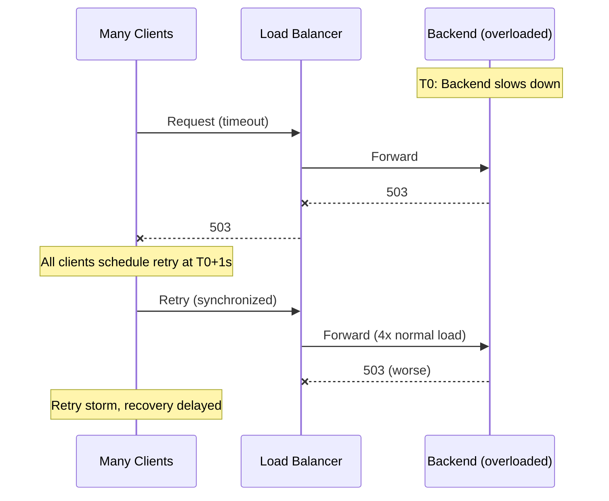
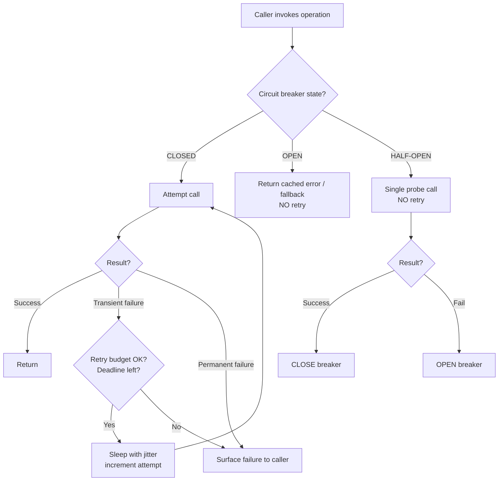

# Retry Strategies — Exponential Backoff, Jitter, and Retry Budgets

**Date:** 2026-04-25 | **Updated:** 2026-04-25
**Tags:** `system-design` `reliability` `retries` `backoff` `jitter` `retry-budget`

## Table of Contents

- [Summary](#summary)
- [Why Naive Retries Make Outages Worse](#why-naive-retries-make-outages-worse)
- [When to Retry](#when-to-retry)
- [When NOT to Retry](#when-not-to-retry)
- [Retry Strategies](#retry-strategies)
  - [Immediate Retry](#immediate-retry)
  - [Linear Backoff](#linear-backoff)
  - [Exponential Backoff](#exponential-backoff)
  - [Exponential Backoff with Jitter](#exponential-backoff-with-jitter)
- [The AWS Architecture Blog's Three Jitters](#the-aws-architecture-blogs-three-jitters)
  - [Full Jitter](#full-jitter)
  - [Equal Jitter](#equal-jitter)
  - [Decorrelated Jitter](#decorrelated-jitter)
  - [Which Jitter to Pick](#which-jitter-to-pick)
- [Retry Budgets](#retry-budgets)
  - [gRPC Retry Budget](#grpc-retry-budget)
  - [Envoy Retry Budgets](#envoy-retry-budgets)
- [Token Bucket Retries](#token-bucket-retries)
- [Deadline Propagation](#deadline-propagation)
- [Retry + Circuit Breaker Integration](#retry--circuit-breaker-integration)
- [Idempotency Requirement](#idempotency-requirement)
- [Library Support](#library-support)
- [Real-World Failure Modes](#real-world-failure-modes)
- [Anti-Patterns](#anti-patterns)
- [Operational Checklist](#operational-checklist)
- [Related](#related)
- [References](#references)

## Summary

Retries are the most common reliability primitive — and the most common cause of self-inflicted outages. A correctly tuned retry policy turns transient blips into invisible recoveries; a poorly tuned one converts a 5-second downstream hiccup into a 30-minute cascading failure. The non-negotiable building blocks are: retry only transient and idempotent operations, use **exponential backoff** so the system gets out of the way, add **jitter** so callers stop synchronizing, cap the rate of retries with a **retry budget** so retries cannot devour the system's capacity, propagate **deadlines** so retries don't outlive the original caller, and integrate retries with **circuit breakers** so you never retry through a known-bad path.

## Why Naive Retries Make Outages Worse

A retry loop without backoff or jitter does two terrible things at once:

1. It **amplifies load** on a downstream that is already failing. If the upstream calls `N` times per second and retries up to 3x on failure, the failing downstream sees up to `4N` requests per second — exactly when it can least afford it.
2. It **synchronizes the herd**. Every caller hit the failure at roughly the same time, so they all schedule their next attempt for the same instant. The downstream comes back, gets crushed by the synchronized retry storm, and dies again. This is the **thundering herd on recovery**, and it is how a transient blip becomes a sustained outage.

The mental model: a retry is not a reliability feature, it is **load amplification you have decided is acceptable**. Your job is to make sure the amplification is bounded, smeared in time, and cut off the moment it stops being useful.



## When to Retry

Retries are appropriate **only for transient failures** — failures where the next attempt has a meaningfully higher chance of succeeding than this one did. Concretely:

- **Network timeouts** and connection resets (`ECONNRESET`, `ETIMEDOUT`).
- **HTTP 503 Service Unavailable** and **HTTP 504 Gateway Timeout**.
- **HTTP 502 Bad Gateway** when the upstream is known to be flapping.
- **HTTP 429 Too Many Requests** — but **only after honoring** the `Retry-After` header.
- **gRPC `UNAVAILABLE`** (status code 14) and **`DEADLINE_EXCEEDED`** (only if the deadline budget allows).
- **Database serialization failures** (PostgreSQL `40001`) for transactions designed to be retried.
- **DNS resolution failures** during a known DNS flap.

## When NOT to Retry

Retrying in these situations either does nothing useful or makes the problem worse:

- **4xx logical errors** — `400 Bad Request`, `401 Unauthorized`, `403 Forbidden`, `404 Not Found`, `409 Conflict`, `422 Unprocessable Entity`. The server is telling you the request itself is wrong; sending it again will not help.
- **Authentication failures** — retrying with the same bad token only burns rate-limit budget and may trigger account lockout.
- **Programming errors** — `NullPointerException`, `TypeError`, `ClassCastException`. These are deterministic; the next call will fail the same way.
- **Non-idempotent operations without an idempotency key** — `POST /payments`, `POST /orders`, `INSERT` without uniqueness. Retrying may charge the customer twice or create duplicate orders.
- **Failures past your deadline budget** — if there is no time left to surface the result to the caller, retrying is wasted work.
- **Errors from a known-broken downstream** — when a circuit breaker is open, do not retry through it.

## Retry Strategies

### Immediate Retry

Retry exactly once, with **zero delay**, and **only when you have strong evidence** the next attempt will succeed. The classic example: a connection pool returned a stale connection; the next call will pick a fresh one. Immediate retries are dangerous as a default — they compound load instantly and offer no smoothing.

### Linear Backoff

`delay = base * attempt` (e.g., 1s, 2s, 3s, 4s, ...). Used rarely. Linear growth doesn't deconcentrate load fast enough during a real outage — by attempt 5 you're still hammering at 5-second intervals while the system needs minutes to drain. Acceptable only for niche cases where the failure mode is well-understood and short-lived.

### Exponential Backoff

`delay = base * 2 ^ attempt`, capped at some `maxDelay`. This is the **default** for almost every modern client library. Each attempt waits roughly twice as long as the previous one, so the load from a single client decays geometrically and the downstream gets a real chance to recover.

```ts
// Pure exponential backoff (NO jitter — still vulnerable to synchronization).
function exponentialDelay(attempt: number, base = 100, cap = 20_000): number {
  return Math.min(cap, base * 2 ** attempt);
}
// attempts: 0 -> 100ms, 1 -> 200ms, 2 -> 400ms, 3 -> 800ms, ... 7 -> 12.8s, capped at 20s
```

The problem: every client uses the same formula, so every client retries at the same instant. You still get a thundering herd — just delayed.

### Exponential Backoff with Jitter

Adding randomization to the delay **decorrelates clients** so retries arrive smeared across time rather than all at once. This is the single most important tuning step in any retry policy.

## The AWS Architecture Blog's Three Jitters

The canonical reference is Marc Brooker's 2015 AWS Architecture Blog post, *Exponential Backoff and Jitter*. It defines three formulas, all on top of an `exponential = min(cap, base * 2 ** attempt)` core.

### Full Jitter

```text
sleep = random_between(0, exponential)
```

Pick a uniformly random delay between 0 and the current exponential ceiling. This is the **most aggressive smoothing** — clients are scattered across the entire window, with no minimum wait. Brooker's simulations showed it minimized total work and completion time in the AWS scenarios tested.

```ts
function fullJitterDelay(attempt: number, base = 100, cap = 20_000): number {
  const exp = Math.min(cap, base * 2 ** attempt);
  return Math.random() * exp;
}
```

### Equal Jitter

```text
exp = min(cap, base * 2 ** attempt)
sleep = exp / 2 + random_between(0, exp / 2)
```

Half of the delay is fixed (the floor), half is random. Clients are guaranteed at least `exp/2` of waiting, so you get exponential's protective floor plus jitter's smoothing. Good when you want a minimum cooldown for the downstream and still avoid synchronization.

### Decorrelated Jitter

```text
sleep = min(cap, random_between(base, prev_sleep * 3))
```

The next delay is randomized **relative to the previous delay**, not the attempt number. This is **stateful** — each client's trajectory diverges over time, so even clients that started in lockstep drift apart with every attempt. Best when you have many clients with similar startup behavior (e.g., a fleet of workers all retrying after a redeploy).

```ts
function decorrelatedJitter(prevSleep: number, base = 100, cap = 20_000): number {
  const upper = Math.min(cap, prevSleep * 3);
  return base + Math.random() * (upper - base);
}
```

### Which Jitter to Pick

| Jitter type        | Best when                                                  | Trade-off                                          |
| ------------------ | ---------------------------------------------------------- | -------------------------------------------------- |
| Full jitter        | Default for most workloads. Many independent callers.       | No minimum delay; some retries fire near-instantly |
| Equal jitter       | Downstream needs a guaranteed cooldown.                     | Less smoothing than full jitter                    |
| Decorrelated jitter| Large fleets that started synchronized (deploys, restarts). | Requires per-client state                          |

Brooker's recommendation: **full jitter** is a solid default, **decorrelated jitter** wins in fleet-scale scenarios.

```mermaid
gantt
    title Retry distribution: no jitter vs full jitter (10 clients, attempt 3)
    dateFormat  X
    axisFormat  %Lms
    section No jitter
    All 10 clients :done, n1, 0, 800
    section Full jitter
    Client 1 :j1, 0, 120
    Client 2 :j2, 0, 240
    Client 3 :j3, 0, 310
    Client 4 :j4, 0, 410
    Client 5 :j5, 0, 480
    Client 6 :j6, 0, 540
    Client 7 :j7, 0, 610
    Client 8 :j8, 0, 670
    Client 9 :j9, 0, 740
    Client 10 :j10, 0, 800
```



## Retry Budgets

A per-call retry policy bounds how many times **one request** retries. A **retry budget** bounds how much of the **total traffic** is retries — system-wide. Without a budget, every caller's local retry policy is correct in isolation while the aggregate behavior collapses the downstream.

The standard rule: **retries must not exceed X% of base traffic**, typically 10–20%. If you breach the budget, new retries are dropped (or the original error is returned) until the rate decays back below threshold.

### gRPC Retry Budget

gRPC service config supports `retryThrottling`:

```yaml
methodConfig:
  - name: [{ service: "PaymentService" }]
    retryPolicy:
      maxAttempts: 4
      initialBackoff: 0.1s
      maxBackoff: 5s
      backoffMultiplier: 2
      retryableStatusCodes: [UNAVAILABLE]
retryThrottling:
  maxTokens: 100
  tokenRatio: 0.1   # +0.1 token per success, -1 token per retry
```

Each retry costs 1 token; each success refunds 0.1 tokens. When the bucket empties, gRPC stops retrying entirely until successes refill it. This bounds the **system-wide retry rate to ~10% of successful traffic** regardless of how many clients there are.

### Envoy Retry Budgets

Envoy enforces budgets at the cluster level via `circuit_breakers.thresholds.retry_budget`:

```yaml
circuit_breakers:
  thresholds:
    - priority: DEFAULT
      retry_budget:
        budget_percent: { value: 20.0 }      # retries capped at 20% of active requests
        min_retry_concurrency: 3             # always allow at least 3 concurrent retries
```

Envoy tracks active retries vs active requests per upstream cluster and refuses to start a new retry once the budget is full. This is enforced **at the proxy**, so it works even when individual application clients are misconfigured.

## Token Bucket Retries

An alternative formulation that some libraries (notably the AWS SDK v2/v3 with `adaptive` retry mode) use:

- A **token bucket** with capacity `C` and refill rate `R` per second.
- Every retry **costs tokens** (commonly 5).
- Every **success refunds** tokens (commonly 1).
- If the bucket is empty, retries are denied and the original error propagates.

The effect is similar to gRPC's retry throttling: during a sustained failure, the bucket drains and retries cease, preventing amplification. Token buckets are well-suited to per-process retry control where you don't have a service-mesh-level budget.

## Deadline Propagation

A retry policy is meaningless without a deadline. **Every request must carry a deadline**, and every retry must check whether there is **time left in the budget** before scheduling another attempt. Without a deadline, retries can outlive the user's patience by orders of magnitude — the user gave up at 2 seconds, but your service is still retrying at 30.

Two non-negotiable rules:

1. **Pass the deadline downstream.** When service A calls service B, A's remaining deadline becomes the upper bound of B's deadline. gRPC does this with `Deadline`; HTTP shops typically use a `X-Request-Deadline` header.
2. **Children must have a smaller budget than parents.** If A has 2s left and calls B, B must complete in **less than** 2s — otherwise A times out before B can return its answer, and B's work is wasted. A common pattern: B uses `parentDeadline - 100ms` as its own deadline.

```ts
async function callWithDeadline<T>(
  fn: (deadlineMs: number) => Promise<T>,
  parentDeadlineMs: number,
  childBufferMs = 100,
): Promise<T> {
  const childDeadline = parentDeadlineMs - childBufferMs;
  if (childDeadline <= Date.now()) {
    throw new Error("DEADLINE_EXCEEDED before call");
  }
  return fn(childDeadline);
}
```

Inside the retry loop, the rule becomes: `if (now + plannedDelay + minOperationTime > deadline) bail`.

## Retry + Circuit Breaker Integration

Circuit breakers and retries solve different problems:

- **Retries** assume the failure is transient — try again, it might work.
- **Circuit breakers** assume the failure is sustained — stop trying, you're making it worse.

The two compose only one way: **retries live inside a circuit breaker**, never the other way around. Concretely:

- When the breaker is **CLOSED**, retries are allowed within the configured policy and budget.
- When the breaker is **OPEN**, the call **fails fast** with no retries — retrying through an open breaker defeats the breaker's purpose.
- When the breaker is **HALF-OPEN**, allow a single probe request **without retries**. If it succeeds, close the breaker; if it fails, re-open and back off.



See [`../scalability/backpressure-bulkhead-circuit-breaker.md`](../scalability/backpressure-bulkhead-circuit-breaker.md) for the breaker state machine in depth.

## Idempotency Requirement

**A retry is a duplicate request, by construction.** If the original request reached the server and committed before the timeout fired, the retry will deliver the same operation a second time. For non-idempotent operations — payments, orders, sending emails, decrementing inventory — this is catastrophic.

The contract every retried operation must satisfy:

- **Idempotent by nature** (e.g., `PUT /resource/123` with the full state).
- **Idempotent by key** — the caller passes an `Idempotency-Key` and the server dedupes on it for some retention window. Stripe's API is the canonical example.
- **Idempotent by deduplication** — the consumer side stores processed message IDs and rejects duplicates (common in Kafka consumers using a transactional outbox).

If the operation is none of these, **do not retry it**. Surface the error and let the caller decide.

For the full treatment, see [`../communication/idempotency-and-exactly-once.md`](../communication/idempotency-and-exactly-once.md).

## Library Support

| Ecosystem | Library | Notes |
| --- | --- | --- |
| JVM (Java/Kotlin) | **Resilience4j Retry** | First-class retry primitive with exponential + jitter. Composable with CircuitBreaker, Bulkhead, RateLimiter, TimeLimiter |
| JVM (legacy) | Spring Retry | Annotation-based; widely deployed but predates the `Resilience4j` design |
| .NET | **Polly** | Pipeline-based; v8 supports full/equal/decorrelated jitter and budgets |
| Node.js | **opossum** (circuit breaker), **cockatiel** (retry + breaker + timeout) | cockatiel mirrors Polly's API in TS |
| Node.js | `p-retry`, `async-retry` | Lightweight retry-only |
| Python | **tenacity** | Decorator-based retry with backoff and jitter; community-standard |
| gRPC | Built-in `retryPolicy` and `retryThrottling` in service config | Works in all official gRPC clients |
| AWS SDK | `retryMode: "adaptive"` | Token-bucket retries with built-in jitter |
| Service mesh | **Envoy** retry policies and budgets | Enforced at the proxy regardless of client behavior |
| Service mesh | **Istio** `VirtualService.retries` | Wraps Envoy's retry policy |

A Resilience4j config showing exponential backoff with jitter, integrated with a circuit breaker:

```yaml
resilience4j:
  retry:
    instances:
      paymentClient:
        max-attempts: 4
        wait-duration: 100ms
        enable-exponential-backoff: true
        exponential-backoff-multiplier: 2.0
        enable-randomized-wait: true       # adds jitter
        randomized-wait-factor: 0.5        # +/- 50% of computed wait
        retry-exceptions:
          - java.io.IOException
          - org.springframework.web.client.HttpServerErrorException
        ignore-exceptions:
          - com.example.payment.NonRetryableException
  circuitbreaker:
    instances:
      paymentClient:
        failure-rate-threshold: 50
        slow-call-rate-threshold: 50
        slow-call-duration-threshold: 2s
        sliding-window-type: COUNT_BASED
        sliding-window-size: 20
        minimum-number-of-calls: 10
        wait-duration-in-open-state: 10s
        permitted-number-of-calls-in-half-open-state: 3
```

## Real-World Failure Modes

### Retry Storms

A downstream slows from 50ms to 800ms p99. Every caller's 500ms timeout fires; every caller retries. The downstream now sees 2x–4x its normal load while it is already CPU-bound, latency climbs further, and the system enters a stable failure state. The fix is the budget plus the breaker — retries must stop being issued long before the downstream collapses.

### Thundering Herd on Recovery

A downstream goes hard down, all callers' breakers open, and every caller schedules a half-open probe with the same `wait-duration-in-open-state`. All probes hit the freshly-recovered downstream at the same instant. The downstream falls over again. Mitigation: **jitter the breaker's open duration**, not just the retry delay.

### Saturation Amplification (Compounded Retries)

Service A retries 3x, calling Service B which retries 3x, calling Service C which retries 3x. A single user request becomes up to **27 calls to C**. The fix: **only the edge layer retries**, internal services either fail fast or have a strictly tighter budget. Pick one layer to own retries.

### Unbounded Retry Inflation During Deploys

A bad deploy causes 100% errors. Every retry policy in the fleet kicks in and the upstream load multiplies by `maxAttempts`. With a retry budget, the budget caps total retry traffic at e.g. 10% of base, so the rollback isn't fighting an additional 4x amplification.

### Long-Tail Latency from Retries on Slow-but-Successful Calls

Aggressive timeouts paired with retries can turn a 600ms successful call into a 1500ms call (timeout at 500ms, retry at 700ms backoff, retry succeeds at 800ms). Tune timeouts based on **measured p99**, not gut feel.

## Anti-Patterns

- **Fixed retry interval** — synchronizes all clients exactly. Always use exponential backoff plus jitter.
- **Retry without jitter** — same problem one level deeper; correctness depends on every client having different jitter seeds.
- **No `maxAttempts` cap** — retries forever, accumulates resource leaks, and never surfaces failure to the operator.
- **No `maxDelay` cap** — exponential backoff with no ceiling eventually waits hours, masking the failure.
- **Retrying through an open circuit breaker** — defeats the breaker; either remove the retry or wrap it inside the breaker.
- **Retrying non-idempotent operations without an idempotency key** — guarantees duplicate side effects.
- **Compounded retries up the call stack** — multiplies load exponentially. Pick one layer to own retries.
- **Retrying 4xx logical errors** — the request is wrong; retrying won't fix it and may trigger anti-abuse systems.
- **Ignoring `Retry-After`** on 429/503 — overrides what the server explicitly asked for.
- **Per-call budget without a global budget** — the aggregate amplification is uncapped.
- **No deadline propagation** — children retry past the parent's deadline; their successful response is thrown away.

## Operational Checklist

- [ ] Every external call has a deadline.
- [ ] Every retry checks remaining deadline before scheduling.
- [ ] Exponential backoff with jitter is the default; no fixed-interval retries.
- [ ] `maxAttempts` and `maxDelay` are both capped.
- [ ] A retry budget (gRPC, Envoy, or token bucket) bounds aggregate retry rate.
- [ ] Retries are wrapped in a circuit breaker; OPEN means no retries.
- [ ] Only idempotent operations (or operations with idempotency keys) are retried.
- [ ] One layer in the call stack owns retries; others fail fast.
- [ ] Retry rate, retry-budget exhaustion, and breaker state are exported as metrics.
- [ ] Honor server-issued `Retry-After` headers on 429/503.

## Related

- [`failure-modes-and-fault-tolerance.md`](./failure-modes-and-fault-tolerance.md) — the broader fault-tolerance model retries operate within
- [`chaos-engineering-and-game-days.md`](./chaos-engineering-and-game-days.md) — how to validate that retry + breaker config actually behaves under fault injection
- [`../scalability/backpressure-bulkhead-circuit-breaker.md`](../scalability/backpressure-bulkhead-circuit-breaker.md) — the circuit breaker state machine retries integrate with
- [`../communication/idempotency-and-exactly-once.md`](../communication/idempotency-and-exactly-once.md) — the prerequisite for any retry policy
- [`../communication/dead-letter-queues-and-retries.md`](../communication/dead-letter-queues-and-retries.md) — async retry semantics for message-driven systems

## References

- AWS Architecture Blog — [Exponential Backoff and Jitter](https://aws.amazon.com/blogs/architecture/exponential-backoff-and-jitter/) (Marc Brooker, 2015) — canonical source for full / equal / decorrelated jitter
- AWS Builders' Library — [Timeouts, retries, and backoff with jitter](https://aws.amazon.com/builders-library/timeouts-retries-and-backoff-with-jitter/) — production guidance from AWS service teams
- Google SRE Book — [Chapter 22: Addressing Cascading Failures](https://sre.google/sre-book/addressing-cascading-failures/) — overload, retry amplification, and graceful degradation
- gRPC — [Retry Design](https://github.com/grpc/proposal/blob/master/A6-client-retries.md) and [Service Config retry policy](https://grpc.io/docs/guides/retry/) — `retryPolicy` and `retryThrottling`
- Envoy — [Retry Policy](https://www.envoyproxy.io/docs/envoy/latest/configuration/http/http_filters/router_filter#config-http-filters-router-x-envoy-retry-on) and [Retry Budgets](https://www.envoyproxy.io/docs/envoy/latest/api-v3/config/cluster/v3/circuit_breaker.proto#envoy-v3-api-msg-config-cluster-v3-circuitbreakers-thresholds-retrybudget)
- Resilience4j — [Retry module documentation](https://resilience4j.readme.io/docs/retry) — backoff, jitter, exception classification, composition with CircuitBreaker
- Polly v8 — [Retry strategy with jitter](https://www.pollydocs.org/strategies/retry.html) — .NET reference implementation
- AWS SDK — [Retry behavior and adaptive mode](https://docs.aws.amazon.com/sdkref/latest/guide/feature-retry-behavior.html) — token-bucket retry semantics
