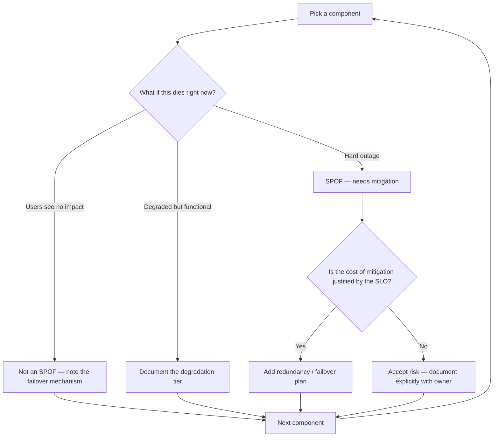
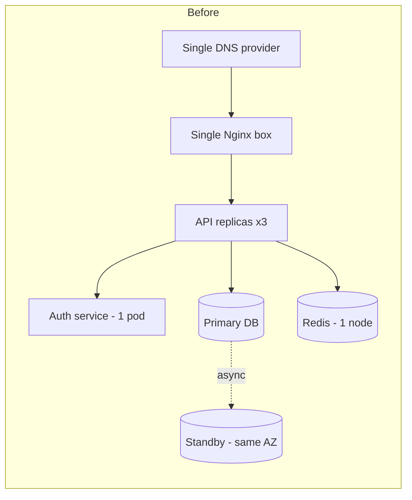
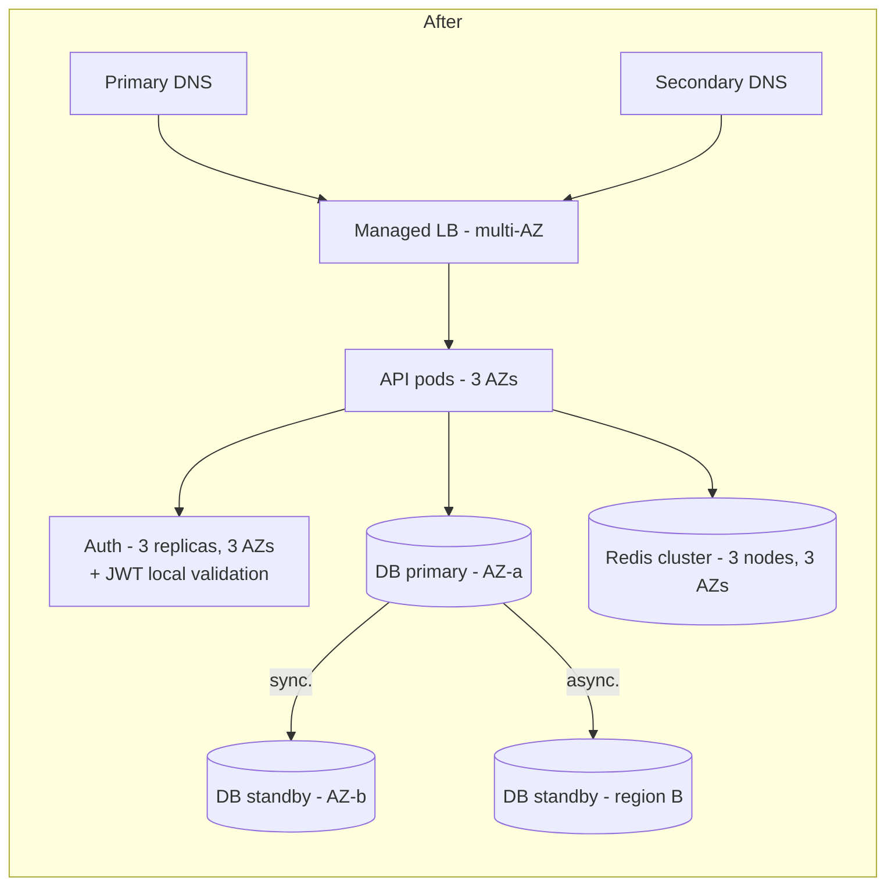

# Single Point of Failure Analysis — Finding, Auditing, and De-SPOFing a Design

**Date:** 2026-04-25 | **Updated:** 2026-04-25
**Tags:** `system-design` `reliability` `spof` `high-availability` `design-review`

## Table of Contents

- [Summary](#summary)
- [What an SPOF Is](#what-an-spof-is)
- [The "What If This Dies?" Drill](#the-what-if-this-dies-drill)
- [Common SPOFs](#common-spofs)
  - [The Primary Database (and Its Standby)](#the-primary-database-and-its-standby)
  - [The Auth Service](#the-auth-service)
  - [DNS and the External DNS Provider](#dns-and-the-external-dns-provider)
  - [Single CDN, Single Cloud Region](#single-cdn-single-cloud-region)
  - [The Build/Deploy Pipeline](#the-builddeploy-pipeline)
  - [Internal Kafka / Message Bus](#internal-kafka--message-bus)
  - [Cluster Control Plane (etcd)](#cluster-control-plane-etcd)
  - [The On-Call Human](#the-on-call-human)
  - [Centralized Rate Limiter / Authn Token Issuer](#centralized-rate-limiter--authn-token-issuer)
- [Hidden SPOFs](#hidden-spofs)
- [HA Patterns by Failure Class](#ha-patterns-by-failure-class)
  - [Process-Level Failures](#process-level-failures)
  - [Server / AZ Failures](#server--az-failures)
  - [Region Failures](#region-failures)
  - [Provider Failures](#provider-failures)
  - [Human Failures](#human-failures)
- [The Numerator/Denominator of Redundancy](#the-numeratordenominator-of-redundancy)
- [SPOF Audit Checklist](#spof-audit-checklist)
- [When SPOF Is OK](#when-spof-is-ok)
- [Cost-Aware De-SPOFing](#cost-aware-de-spofing)
- [Anti-Patterns](#anti-patterns)
- [Before / After De-SPOFing — A Worked Example](#before--after-de-spofing--a-worked-example)
- [Related](#related)
- [References](#references)

## Summary

A **single point of failure (SPOF)** is any component whose failure takes the whole system down. Finding them is a discipline: you walk every box in your architecture diagram and ask "what happens if this dies?" — including boxes you didn't draw, like DNS, the deploy pipeline, the on-call engineer, and the shared cache key both teams happen to use. Removing SPOFs is not free, so the work is **matching the level of redundancy to the SLO**: multi-AZ is cheap and almost always justified; multi-region is expensive and only justified when downtime cost exceeds it; multi-cloud is very expensive and rarely the right answer. This doc gives you the vocabulary, the audit drill, the catalog of usual suspects, the HA patterns mapped to failure classes, and the anti-patterns that look redundant on paper but aren't.

## What an SPOF Is

An SPOF is **any component whose failure causes a user-visible outage of the entire system or a critical user journey**. It can be:

- **Explicit** — a single database, a single load balancer, a single Redis instance. You can point at the box on the diagram.
- **Implicit** — a dependency you forgot to draw. DNS, the auth service, the certificate authority, the package registry your build pulls from, the one engineer who knows how the legacy billing job works.

The test is mechanical: **if this one thing is gone for 30 minutes, can users still do the things that matter?** If the answer is no, it's an SPOF — regardless of whether it's "supposed to be reliable."

> "Supposed to be reliable" is not redundancy. AWS RDS with a single node is supposed to be reliable. It is still an SPOF.

## The "What If This Dies?" Drill

This is the canonical question for design review. It is mechanical, exhaustive, and boring on purpose. Walk **every box** on the architecture diagram and write down what happens when that box dies. If you can't answer, the answer is "the system goes down."



Three rules that make the drill actually work:

1. **Walk the diagram literally.** Every box, every arrow, every label in the corner. Including "Cloudflare," "PagerDuty," "GitHub Actions," and "the laptop the deploy keys live on."
2. **Include things you didn't draw.** DNS. Certificate renewal. The artifact registry. The secrets manager. The on-call rotation.
3. **"It has a standby" is not the answer.** The answer is "we tested the failover last quarter and it took 90 seconds." If you've never failed it over, the standby is a hope, not a control.

## Common SPOFs

### The Primary Database (and Its Standby)

The database is almost always the highest-impact SPOF. Even with a hot standby:

- If primary and standby are in the **same AZ**, an AZ outage takes both down. Still an SPOF.
- If the failover is **manual**, the SPOF is now a human plus a runbook plus the time to execute under stress.
- If the application doesn't reconnect cleanly after failover, the standby is useless during the only minute it matters.

Mitigations: multi-AZ synchronous replication, automated failover, **rehearsed** failover drills, connection-pool reset on topology change.

### The Auth Service

If every request requires a token check against a central auth service, that service is on the critical path of 100% of traffic. A degraded auth service is a degraded everything.

Mitigations: short-lived JWTs validated locally with cached public keys (so auth-service downtime affects new logins, not in-flight requests), graceful degradation when the introspection endpoint is unreachable, regional auth replicas.

### DNS and the External DNS Provider

DNS feels invisible until your provider has an incident — at which point your perfectly redundant multi-region deployment is unreachable. Notable historical incidents include the 2016 Dyn outage and several Route 53 / Cloudflare DNS events.

Mitigations: secondary DNS provider with active-active or active-passive resolution, lower-than-default TTLs only when justified (low TTLs make DNS itself a hotter dependency), monitored zone health.

### Single CDN, Single Cloud Region

A single CDN provider is an SPOF for static delivery and (often) TLS termination. A single cloud region is an SPOF for everything you run there.

Mitigations: multi-CDN with health-based steering, multi-region active-active or active-passive — but see [cost-aware de-SPOFing](#cost-aware-de-spofing) before committing.

### The Build/Deploy Pipeline

This one is widely missed. When the pipeline is down, **you can't ship a fix**. That converts every other incident into a longer incident. If GitHub Actions, your container registry, or your artifact store is down, your MTTR doubles.

Mitigations: a documented manual deploy path (signed image + `kubectl apply`), a mirrored container registry, ability to rebuild and ship without GitHub if needed.

### Internal Kafka / Message Bus

A single Kafka cluster (or any shared bus) handling every async workflow becomes a critical dependency. A misbehaving topic, an undersized broker, or a consumer group rebalance storm can stall every async path at once.

Mitigations: cluster isolation by domain (don't put billing events and user-activity events on one cluster), DLQs and replay tooling, independent consumer-group monitoring, cross-AZ broker placement.

### Cluster Control Plane (etcd)

For Kubernetes, **etcd is the system of record**. Lose quorum and the API server can't accept writes — meaning no Deployments roll, no Services update endpoints, no autoscaler responds. Pods that are already running keep running, but anything new is frozen.

Mitigations: etcd quorum across 3 or 5 nodes spread across AZs, regular backups, tested restore procedure, separation of stacked vs external etcd topology decisions (see the [Kubernetes cluster architecture doc](../../kubernetes/core-concepts/cluster-architecture.md)).

### The On-Call Human

One engineer who knows how to recover the legacy billing job, or restart the bespoke ETL, or reset the partner integration. They go on vacation; the system goes down with them.

Mitigations: documented runbooks linked from the alert, **rotation enforced** (multiple people walk through the runbook), no production system has a single owner. "Bus factor 1" is an SPOF as real as any single server.

### Centralized Rate Limiter / Authn Token Issuer

A single Redis cluster used as the global rate limiter, or a single token issuer that every service calls — both sit on the critical path of every request. When they degrade, every request degrades.

Mitigations: rate-limit fallback to local in-process counters when the central store is unreachable (with documented imprecision), per-region issuers, JWTs preferred over reference tokens for high-volume paths.

## Hidden SPOFs

These are the ones that bite hardest because nobody put them on the diagram.

- **Code paths only exercised in failure.** The recovery script that nobody has run in production. The backup-restore code path that turns out to depend on a deprecated IAM role. If you don't exercise it, it's broken — you just haven't found out yet.
- **Shared library / SDK with no diversity.** Every service uses the same client library to talk to the auth service. A bug in v2.4.1 of that library takes down every service simultaneously. The redundancy across services is illusory because they share the failure mode.
- **Single Git provider.** Source control, CI configuration, deploy keys, IaC state pointers — all in one GitHub org. A GitHub outage stops new deploys everywhere.
- **Shared cache key.** Two unrelated teams happen to use the same Redis key for different purposes. One team deploys a change to TTL handling and breaks the other team's feature.
- **Shared connection pool.** A single PgBouncer or RDS Proxy in front of multiple applications. Saturation in one app starves all the others.
- **Single Terraform / Pulumi state file.** State corruption or lock contention blocks all infrastructure changes.
- **One observability backend.** Prometheus, Datadog, or Grafana Cloud goes down — and you lose the ability to debug the *next* outage.

## HA Patterns by Failure Class

The right pattern depends on what failure class you're defending against.

| Failure class | Typical scope | Pattern |
|---------------|--------------|---------|
| Process | Single container or JVM crashes | Restart policy + multiple replicas |
| Server / VM | Host hardware or kernel panic | Multi-instance behind LB, anti-affinity |
| AZ | Datacenter power, network, cooling | Multi-AZ deployment, synchronous replication where latency permits |
| Region | Regional outage, control-plane failure | Multi-region replication, geo-routing, RPO/RTO planning |
| Provider | Cloud-wide incident | Multi-cloud (rarely justified) |
| Human | On-call, vendor support, ops error | Runbooks, rotation, documented ownership |

### Process-Level Failures

The cheapest and most common redundancy. Run **N replicas** behind a load balancer; let the orchestrator restart any that crash.

- **Active-active** — every replica serves traffic. Simple, scales naturally, requires statelessness.
- **Active-passive** — one replica serves; the rest are hot standbys. Common for stateful systems (databases, leader-elected schedulers).

This level of redundancy is so cheap that **not having it is the SPOF** — there's no cost-benefit argument for running a single replica of a production stateless service.

### Server / AZ Failures

Spread replicas across at least two (preferably three) AZs and use **anti-affinity** to ensure the orchestrator doesn't co-schedule them onto the same physical host or rack.

In Kubernetes:

```yaml
spec:
  topologySpreadConstraints:
    - maxSkew: 1
      topologyKey: topology.kubernetes.io/zone
      whenUnsatisfiable: DoNotSchedule
      labelSelector:
        matchLabels:
          app: payments-api
```

For databases, this means synchronous replication across AZs (acceptable latency in most cloud regions: ~1–2 ms intra-region) so failover is sub-second.

### Region Failures

Now you're paying real money. Multi-region requires:

- **Replication topology** — async replication is cheaper but has nonzero RPO (you lose recent writes during failover). Sync cross-region replication is rarely viable due to latency.
- **Routing** — geo-DNS, anycast, or a global LB to send users to the healthy region.
- **Stateful systems** — pick conflict resolution (CRDTs, last-writer-wins, or single-writer per partition). See the planned [multi-region architectures doc](multi-region-architectures.md).
- **Failover testing** — untested cross-region failover is theatre. Rehearse quarterly.

### Provider Failures

Multi-cloud (active across AWS and GCP, for example) is **very expensive**. You give up managed services, you double your operational surface, and you usually still end up depending on a single DNS, a single Git host, and a single CDN. Reserve for the rare case where regulatory or contractual requirements demand it, or where cloud-wide outages would cost more than the operational tax.

A more pragmatic version: **multi-CDN** and **multi-DNS**, since those are genuinely independent and cheap-ish to set up.

### Human Failures

- Documented runbooks linked from every alert.
- On-call rotation enforced — every runbook is exercised by at least two people quarterly.
- No production system has a single owner. Ownership lives on a team, not a person.
- Vendor support contracts: know your escalation path before you need it.

## The Numerator/Denominator of Redundancy

There are two common redundancy targets, and they mean different things at peak:

- **N+1** — you have one more capacity unit than you need at peak. If one fails, the rest just barely handle the load.
- **2N** — you have twice the capacity. If one fails, the survivors are at 50% utilization. Used where degradation under failure is unacceptable (financial trading, life-safety systems).

Picking the wrong denominator is a common SPOF in disguise:

- N+1 with a slow autoscaler means you survive the failure but tip over five minutes later when traffic ramps.
- N+1 across two AZs means losing one AZ takes you to 100% capacity on the survivor — fine until the survivor's traffic spikes.
- "Multi-AZ" with three replicas in `us-east-1a` and one each in `1b` and `1c` looks redundant on the manifest but isn't — the headroom is in the wrong place.

The check: **at peak load, with the largest failure domain down, do I still meet SLO?** If no, you're under-provisioned regardless of how the diagram looks.

## SPOF Audit Checklist

Run this before sign-off on any new design or major change.

```markdown
## SPOF Audit — [System Name]

### Diagram coverage
- [ ] Every box on the diagram has a "what if this dies" answer
- [ ] Every arrow (dependency) has a fallback or documented failure mode
- [ ] Implicit dependencies named explicitly: DNS, CDN, auth, secrets, observability, deploy pipeline, package/artifact registry, certificate authority

### Stateful components
- [ ] Database: multi-AZ replication confirmed; failover tested in last 90 days
- [ ] Cache: failure mode documented (degraded performance vs hard fail); cache stampede protection in place
- [ ] Message bus: multi-broker, cross-AZ; DLQ and replay tooling exist
- [ ] Object storage: multi-AZ by default; cross-region replication if RPO requires it

### Stateless components
- [ ] Min replica count >= 2 (>= 3 for quorum-sensitive systems)
- [ ] Anti-affinity / topology spread configured
- [ ] Health checks distinguish liveness vs readiness
- [ ] Graceful shutdown verified (drain on SIGTERM)

### Network and edge
- [ ] LB itself is redundant (managed LB or HA pair, not a single Nginx box)
- [ ] DNS provider redundancy considered (secondary provider or accepted risk)
- [ ] CDN: single-provider risk acknowledged or mitigated

### Operations
- [ ] Deploy pipeline failure does not block emergency fixes
- [ ] Runbook exists for top-3 failure modes
- [ ] On-call rotation has at least 2 people who have executed each runbook
- [ ] Backups exist AND restore has been tested

### Hidden SPOFs
- [ ] Shared libraries: same SDK across all services? Diversity considered?
- [ ] Shared config: one secrets manager, one feature-flag service — failure modes understood?
- [ ] Shared infrastructure-as-code state: lock contention or corruption plan exists
- [ ] Observability: alerts still fire if monitoring backend is down

### Cost vs SLO
- [ ] The redundancy level matches the SLO; over-engineering is documented and justified
- [ ] Risks accepted (rather than mitigated) are explicitly written down with an owner
```

## When SPOF Is OK

Not every component needs N+1 redundancy. Accept SPOF when the cost of mitigation exceeds the cost of failure:

- **Internal admin tooling** — if the internal dashboard goes down for 30 minutes, on-call is mildly inconvenienced; the customer doesn't notice. Single instance is fine.
- **Dev-time-only services** — preview environments, staging databases, internal API mocks. Make it easy to recreate, not redundant.
- **Low-impact features behind feature flags** — a recommendation widget that fails gracefully behind a flag. The SPOF is bounded; the kill-switch is the redundancy.
- **Batch / async jobs with ample retry windows** — a nightly report job has 23 hours to recover.

The rule: **SPOF is OK when failure is bounded, recoverable, and below the SLO impact threshold**. Document the decision so the next engineer knows it was deliberate.

## Cost-Aware De-SPOFing

The cost gradient is steep. Match it to the SLO.

| Strategy | Relative cost | Latency impact | Typical SLO it supports |
|----------|---------------|----------------|--------------------------|
| Multi-instance, single AZ | ~1.0× | None | 99.9% best case |
| Multi-AZ within a region | ~1.2–1.5× | <2 ms | 99.95% — the standard |
| Multi-region active-passive | ~1.8–2.5× | Failover-time RTO | 99.99% |
| Multi-region active-active | ~2.5–4× | Replication / conflict tax | 99.99%+ for global users |
| Multi-cloud | ~3–6× and ops complexity | Significant | 99.999% — almost never justified |

> Multi-AZ is the default. Multi-region is a deliberate decision tied to a real SLO. Multi-cloud is almost always a worse use of money than improving operational maturity in a single cloud.

Run the math against your SLO. From the [SLA/SLO/SLI doc](../foundations/sla-slo-sli-and-availability.md): an extra "nine" of availability roughly costs an order of magnitude more to engineer and operate. Don't pay for nines you don't need.

## Anti-Patterns

These show up in design reviews constantly. Spot them and call them out.

- **Multi-AZ database, single LB.** The DB tier is gold-plated; the load balancer is a single Nginx VM. The LB dies and the multi-AZ database is unreachable.
- **Redundancy everywhere except the auth service.** Every microservice is multi-replica, multi-AZ. The auth service is one pod. Auth dies, every request fails closed, system is down.
- **Hidden coupling via shared cache key.** Two teams independently use Redis key `user:profile:{id}`. One team's bug evicts the other team's data. The "redundancy" is illusory.
- **"We have a runbook" but the runbook depends on the failed service.** The runbook for "the wiki is down" lives on the wiki. The runbook for "the deploy pipeline is broken" requires a deploy to fix.
- **Redundancy theatre — replicas in the same rack.** Three pods, all scheduled to the same node because nobody set anti-affinity. The diagram looks redundant; one machine reboot takes the service down.
- **Active-passive with cold standby.** The standby has never served traffic, the connection-pool config is stale, the autoscaler isn't warm. When you fail over, you discover this for the first time.
- **Failover that nobody has tested.** "We have multi-region" is a claim, not a control. Untested failover almost always fails the first time it's exercised.
- **Single owner for a critical system.** One engineer who "knows how billing works." They take a week of vacation; you discover the SPOF when something breaks.
- **The deploy pipeline as critical infrastructure with no backup path.** GitHub Actions outage during an incident means you can't ship the fix.

## Before / After De-SPOFing — A Worked Example

A small SaaS API with a "redundant" architecture that has three SPOFs:



The diagram **looks** redundant — three API pods, a standby DB, a Redis cache. But:

1. The LB is a single Nginx box.
2. The auth service is a single pod.
3. The DB primary and standby are in the same AZ.
4. Redis is a single node.
5. DNS has no secondary.



What changed:

- DNS: secondary provider added with active-active resolution.
- LB: managed multi-AZ LB replaces the Nginx box. The LB itself is no longer an SPOF.
- API pods: topology-spread across 3 AZs.
- Auth: 3 replicas across 3 AZs, plus client-side JWT validation so transient auth-service downtime doesn't hard-fail in-flight requests.
- DB: synchronous replica in a different AZ; async replica in a second region as a DR target.
- Redis: 3-node cluster with cross-AZ placement; clients fall back to in-process rate limiting if the cluster is unreachable.

Cost-wise, this is ~1.4–1.6× the "before" cost — multi-AZ scope, no multi-region active-active. That's the right tier for a 99.95% SLO.

## Related

- [Failure Modes and Fault Tolerance Taxonomy](failure-modes-and-fault-tolerance.md) — the failure-class vocabulary that SPOF analysis builds on
- [Multi-Region Architectures — Active-Active, Active-Passive, Geo-Routing](multi-region-architectures.md) — when SPOF analysis pushes past the AZ boundary
- [Disaster Recovery — RPO, RTO, Backup Strategies](disaster-recovery.md) — what happens after the SPOF actually fails
- [Network Partitions and Split Brain](network-partitions-and-split-brain.md) — partial failures that look like SPOFs but aren't
- [SLA, SLO, SLI, and the Math of Availability](../foundations/sla-slo-sli-and-availability.md) — picks the SLO target that drives how much SPOF removal you can afford
- [Load Balancers in System Design](../building-blocks/load-balancers.md) — the LB-as-SPOF section is essential reading for this drill
- [Kubernetes Cluster Architecture](../../kubernetes/core-concepts/cluster-architecture.md) — etcd and control-plane HA patterns

## References

- [AWS Well-Architected Framework — Reliability Pillar](https://docs.aws.amazon.com/wellarchitected/latest/reliability-pillar/welcome.html) — design principles for reliability, including failure isolation, automatic recovery, and change management
- [Google SRE Workbook — Implementing SLOs and Eliminating Toil](https://sre.google/workbook/implementing-slos/) — the SLO-driven framing that determines how much redundancy you can afford
- [Microsoft Azure — Failure Mode Analysis (FMA) for Cloud Applications](https://learn.microsoft.com/en-us/azure/architecture/resiliency/failure-mode-analysis) — structured walk-through for identifying failure modes during design
- [Heroku — The Twelve-Factor App: Backing Services](https://12factor.net/backing-services) — treating every dependency as an attached resource that can fail or be swapped
- [AWS — Building Multi-AZ and Multi-Region Architectures](https://docs.aws.amazon.com/whitepapers/latest/aws-fault-isolation-boundaries/aws-fault-isolation-boundaries.html) — the canonical fault-isolation boundaries on AWS
- [NIST SP 800-34 Rev. 1 — Contingency Planning Guide for Federal Information Systems](https://csrc.nist.gov/publications/detail/sp/800-34/rev-1/final) — formal contingency-planning vocabulary, RPO/RTO, and recovery strategies
- [Google SRE Book — Managing Critical State: Distributed Consensus for Reliability](https://sre.google/sre-book/managing-critical-state/) — why "two replicas" is rarely the right answer for stateful systems
- [Kubernetes Documentation — Running in Multiple Zones](https://kubernetes.io/docs/setup/best-practices/multiple-zones/) — topology spread and anti-affinity primitives referenced in this doc
