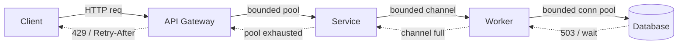
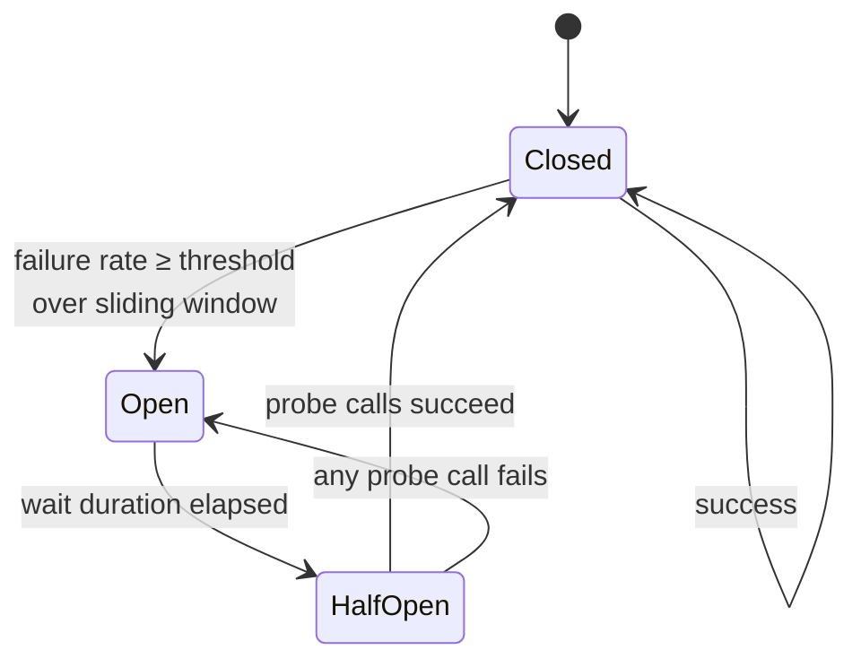
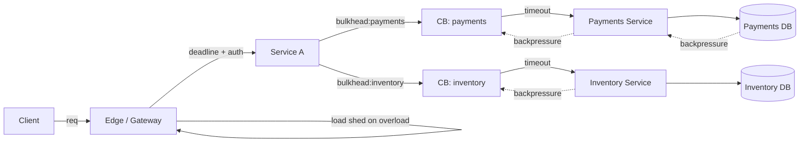

# Backpressure, Bulkhead, and Circuit Breakers — Failing Loudly Under Load

**Date:** 2026-04-24 | **Updated:** 2026-04-24
**Tags:** `system-design` `scalability` `resilience` `backpressure` `circuit-breaker` `bulkhead`

## Table of Contents

- [Summary](#summary)
- [Why These Patterns Exist](#why-these-patterns-exist)
- [Backpressure](#backpressure)
  - [Definition](#definition)
  - [Reactive Streams Spec — The Demand-Driven Model](#reactive-streams-spec--the-demand-driven-model)
  - [HTTP/2 and gRPC Flow Control](#http2-and-grpc-flow-control)
  - [Queue Sizing — Bounded Queues Are a Precondition](#queue-sizing--bounded-queues-are-a-precondition)
  - [End-to-End Propagation](#end-to-end-propagation)
- [Bulkhead](#bulkhead)
  - [Origin and Intuition](#origin-and-intuition)
  - [Thread-Pool Bulkheads](#thread-pool-bulkheads)
  - [Semaphore Bulkheads](#semaphore-bulkheads)
  - [Connection-Pool Bulkheads](#connection-pool-bulkheads)
  - [Tenant Bulkheads](#tenant-bulkheads)
- [Circuit Breaker](#circuit-breaker)
  - [Three-State Machine](#three-state-machine)
  - [Thresholds, Windows, and Half-Open Probes](#thresholds-windows-and-half-open-probes)
  - [Pros and Cons](#pros-and-cons)
  - [Integration with Retry and Timeout](#integration-with-retry-and-timeout)
- [Timeouts and Deadlines](#timeouts-and-deadlines)
- [Load Shedding](#load-shedding)
- [Concrete Libraries](#concrete-libraries)
- [Putting It Together](#putting-it-together)
- [Anti-Patterns](#anti-patterns)
- [Related](#related)
- [References](#references)

## Summary

**Backpressure**, **bulkhead**, and **circuit breaker** are the three resilience patterns that turn an overloaded system into one that **fails fast and loudly** instead of melting down slowly. They are not alternatives — they compose. Backpressure stops producers from overwhelming consumers. Bulkheads isolate blast radius so one slow dependency cannot eat the whole thread pool. Circuit breakers stop sending traffic to a known-broken downstream. Add timeouts, deadlines, and load shedding on top and you get a system that survives partial failure. Skip any one of them and you get retry storms, thread starvation, and cascading outages.

## Why These Patterns Exist

Distributed systems do not fail the way a single process fails. They fail **slowly and partially**: one dependency gets 10x slower, every caller holds a thread waiting, thread pools saturate, health checks time out, and before long an entirely unrelated service is 502'ing because its libraries were blocked on a shared executor. Jim Gray's 1985 paper "Why Do Computers Stop" already noted that most production failures are not crashes — they are _degradations_ where one component stops making progress and drags everything with it.

Three failure amplifiers dominate in practice:

1. **Unbounded queues.** A queue with no limit is an admission that your design has no plan for overload. It only moves the failure from "request rejected" to "out of memory 30 seconds later with every in-flight request lost."
2. **Infinite or naive retries.** Retrying a slow dependency during an overload multiplies load on exactly the thing that is struggling. "Retry storms" convert a 5-minute hiccup into a 2-hour outage.
3. **Shared resources with no isolation.** One shared thread pool, one shared connection pool, one shared event loop — the slowest consumer gets to decide the latency of every caller.

The goal of the patterns in this doc is the same: **fail fast, fail loud, contain blast radius**. Every pattern makes the system _less_ tolerant of slowness in the short term so that it is _more_ tolerant of real failure overall.

## Backpressure

### Definition

**Backpressure** is the signal a slow consumer sends upstream to say "I cannot accept more work right now." It is the transport-layer equivalent of "stop pushing." Without it, a fast producer fills the consumer's buffer, which fills the network buffer, which fills the producer's buffer, until something drops or crashes.

The simplest mental model: backpressure is the _inverse_ of buffering. Buffering absorbs short-term mismatch. Backpressure handles sustained mismatch by slowing the producer.

### Reactive Streams Spec — The Demand-Driven Model

The [Reactive Streams](https://www.reactive-streams.org/) spec (JDK 9+ `Flow`, adopted by Project Reactor, RxJava, Akka Streams, Mutiny) codifies backpressure as a **demand-driven protocol** between `Publisher` and `Subscriber`:

```text
1. Subscriber.onSubscribe(Subscription)  ← producer hands over a control handle
2. Subscription.request(n)               ← consumer asks for n items
3. Publisher emits up to n onNext() calls
4. Subscriber processes, then calls request(n) again
```

The key inversion: the **consumer pulls**, the producer never pushes more than requested. A slow consumer simply stops calling `request(n)` and the producer idles. No buffer grows unbounded.

```java
// Project Reactor — explicit backpressure via limitRate
Flux.fromStream(hugeFileLines())
    .limitRate(256)                        // request 256 at a time
    .flatMap(this::enrichAsync, 16)        // at most 16 in-flight upstream requests
    .onBackpressureBuffer(
        1024,                              // bounded buffer
        dropped -> metrics.dropped().increment(),
        BufferOverflowStrategy.DROP_OLDEST // explicit overflow policy
    )
    .subscribe(this::sink);
```

```typescript
// Node streams (v18+) — pipeline respects highWaterMark backpressure
import { pipeline } from "node:stream/promises";
import { createReadStream } from "node:fs";
import { Transform } from "node:stream";

await pipeline(
  createReadStream("in.ndjson", { highWaterMark: 64 * 1024 }),
  splitByNewline(),
  new Transform({
    objectMode: true,
    highWaterMark: 32,                     // bounded in-flight items
    async transform(line, _enc, cb) {
      await enrichAsync(line);             // slow step — upstream pauses when full
      cb(null, line);
    },
  }),
  writeToSink(),
);
```

- `highWaterMark` on a Node stream is the buffer ceiling, not a soft hint. When it is reached, `writable.write()` returns `false` and the producer **must** stop until `drain` fires.
- RxJS is famously _not_ Reactive Streams — it has no native `request(n)` protocol. You have to insert `throttle`, `buffer`, `sample`, or a `WebSocketSubject` bridge to fake it. This is a real trap when porting patterns from Reactor.

### HTTP/2 and gRPC Flow Control

Backpressure is not just an application-level concept. HTTP/2 has per-stream and per-connection **flow-control windows** (RFC 7540 §5.2): each endpoint advertises how many bytes it is willing to receive, and the sender must not exceed that window until a `WINDOW_UPDATE` frame arrives. gRPC inherits this and exposes it through stream-level pressure (on a bidi stream, if the client stops calling `Read()`, the server eventually blocks on `Write()`).

Practical implication: **keep bidi streams consuming**. If a gRPC client stops reading, the server's `stream.Send()` blocks, which blocks the server goroutine/thread, which eventually blocks the scheduler. This is a backpressure signal — handle it explicitly instead of letting it silently stall.

### Queue Sizing — Bounded Queues Are a Precondition

No pattern in this document works with an unbounded queue. An unbounded `LinkedBlockingQueue`, an unbounded Kafka producer buffer, an unbounded in-memory channel — all of them _defeat_ backpressure because the producer never observes resistance until it runs out of RAM.

Sizing rule of thumb, from Little's Law:

```text
queue_depth ≈ arrival_rate × target_latency_budget
```

If you want p99 latency of 200 ms on a service that can handle 500 req/s, the in-flight queue should hold at most ~100 items. Anything above that is buffering that will **violate the latency SLO** by the time it drains.

| Runtime | Bounded primitive | Unbounded trap |
|---|---|---|
| Java `java.util.concurrent` | `ArrayBlockingQueue`, `SynchronousQueue` | `LinkedBlockingQueue()` (default unbounded) |
| Kotlin/coroutines | `Channel(capacity = N)`, `Channel.RENDEZVOUS` | `Channel(UNLIMITED)` |
| Go | `make(chan T, N)` | unbuffered ≠ unbounded, but slices as queues are |
| Node | `highWaterMark` on streams, `p-queue` `{ concurrency }` | raw `Array.push`, EventEmitter with no limit |
| Kafka producer | `buffer.memory` + `max.block.ms` | default buffer is 32MB but blocks by default — good |

### End-to-End Propagation

Backpressure only works if it propagates **end to end**. A Reactive pipeline that respects demand is useless if it writes to a JDBC datasource with an unbounded work queue, because the pipeline pulls fast and the DB pool silently queues everything.



The weakest link becomes the bottleneck. If one stage has an unbounded buffer, the rest of your backpressure strategy just hides the failure there.

## Bulkhead

### Origin and Intuition

The name is from shipbuilding: a ship is divided into watertight compartments so that a breach in one does not sink the whole vessel. In software, a **bulkhead** partitions resources (threads, connections, memory, queue slots) so that one misbehaving dependency cannot consume everything.

The contrast is "shared thread pool": if every outbound HTTP call uses the same executor, one slow dependency fills the pool with waiters, and unrelated calls start queuing. Bulkheads give each dependency (or each tenant, or each criticality class) its own bounded slice.

### Thread-Pool Bulkheads

A **thread-pool bulkhead** gives each downstream dependency its own thread pool. Calls run on that pool, and if the pool saturates, new calls are rejected (not queued behind the slow dependency). This is how Netflix's Hystrix originally enforced isolation.

```java
// Resilience4j thread-pool bulkhead per dependency
ThreadPoolBulkheadConfig config = ThreadPoolBulkheadConfig.custom()
    .maxThreadPoolSize(10)
    .coreThreadPoolSize(5)
    .queueCapacity(20)              // bounded — no unbounded backlog
    .build();

ThreadPoolBulkhead paymentsBulkhead =
    ThreadPoolBulkhead.of("payments", config);

CompletionStage<Receipt> receipt = paymentsBulkhead.executeSupplier(
    () -> paymentsClient.charge(order)
);
```

Pros: true isolation — a blocked dependency cannot starve other pools. Cons: thread context switches, memory per thread (~1 MB stack), and the pool boundary makes sharing context (MDC, tracing) harder.

### Semaphore Bulkheads

A **semaphore bulkhead** does not own threads. It is a counter: increment on entry, decrement on exit, reject if over the limit. The call runs on the caller's thread.

```java
BulkheadConfig config = BulkheadConfig.custom()
    .maxConcurrentCalls(25)
    .maxWaitDuration(Duration.ZERO)  // fail fast, do not queue
    .build();

Bulkhead searchBulkhead = Bulkhead.of("search", config);

Supplier<Results> guarded = Bulkhead.decorateSupplier(
    searchBulkhead, () -> searchClient.query(q)
);
```

Pros: no context switch, cheap, works great in async/non-blocking runtimes (Node, Vert.x, WebFlux, Go). Cons: does not protect against a truly blocked call tying up the caller's thread — so pair with a timeout.

Rule of thumb: **semaphore bulkheads for non-blocking I/O, thread-pool bulkheads for blocking calls you cannot refactor.**

### Connection-Pool Bulkheads

A connection pool is already a kind of bulkhead — it bounds the number of simultaneous connections to a downstream. The mistake is using **one pool for all downstreams**. Instead:

- One HTTP client pool per upstream host (most clients default to this).
- One JDBC pool per database role (primary vs replica), maybe per tenant for hard isolation.
- Separate pools for critical (checkout) vs degradable (recommendations) paths if they share a downstream.

If a slow database replica fills its own pool, requests to the primary are unaffected. If they share, the whole DB layer stalls.

### Tenant Bulkheads

In multi-tenant systems, the noisy-neighbor problem is a bulkhead problem. Options from cheapest to strongest:

| Approach | Isolation | Cost |
|---|---|---|
| Per-tenant rate limit (token bucket with tenant-scoped key) | Weak — shared resources still contend | Low |
| Per-tenant queue or semaphore | Medium — one tenant cannot eat all capacity | Medium |
| Per-tenant thread pool / pod | Strong — OS-level isolation | High |
| Per-tenant cluster (cellular architecture) | Total — blast radius = one cell | Highest |

AWS's "cell-based architecture" is a bulkhead at the infrastructure level: partition customers into cells, route deterministically, and a cell outage hits only its members.

## Circuit Breaker

### Three-State Machine

A circuit breaker wraps a remote call and watches its success/failure ratio. When failures cross a threshold, the breaker **opens**: subsequent calls fail immediately without touching the dependency. After a cool-off window, it enters **half-open** and lets a small number of probe calls through. If they succeed, it closes; if they fail, it reopens.



In **Closed**, calls flow normally; failures are counted.
In **Open**, calls fail fast with a `CallNotPermittedException` (or equivalent).
In **Half-Open**, a limited number of calls are permitted to test whether the dependency has recovered.

### Thresholds, Windows, and Half-Open Probes

Tuning is what makes or breaks a circuit breaker. Bad thresholds cause **flapping** (rapid open/close cycles) which is worse than no breaker at all.

Typical configuration levers ([Resilience4j](https://resilience4j.readme.io/docs/circuitbreaker)):

- **Failure rate threshold** — percentage (e.g. 50%) or absolute count.
- **Slow call threshold** — treat calls slower than X as failures (catches the "not dead, just slow" case).
- **Sliding window** — count-based (last N calls) or time-based (last T seconds).
- **Minimum number of calls** — do not trip on 1 failure out of 1 call; wait for statistical mass (e.g. 20).
- **Wait duration in open state** — how long before half-open (e.g. 30s). Too short → flapping; too long → slow recovery.
- **Permitted calls in half-open** — how many probes (e.g. 5).

```java
CircuitBreakerConfig config = CircuitBreakerConfig.custom()
    .failureRateThreshold(50)
    .slowCallRateThreshold(50)
    .slowCallDurationThreshold(Duration.ofMillis(500))
    .slidingWindowType(SlidingWindowType.COUNT_BASED)
    .slidingWindowSize(50)
    .minimumNumberOfCalls(20)
    .waitDurationInOpenState(Duration.ofSeconds(30))
    .permittedNumberOfCallsInHalfOpenState(5)
    .recordExceptions(IOException.class, TimeoutException.class)
    .ignoreExceptions(BusinessValidationException.class)
    .build();

CircuitBreaker breaker = CircuitBreaker.of("inventory", config);

Supplier<Stock> guarded = CircuitBreaker.decorateSupplier(
    breaker, () -> inventoryClient.lookup(sku)
);
```

Note the `ignoreExceptions`: business errors (404, validation) must not trip the breaker. Only treat **transport/infrastructure failures** as breaker-worthy.

```typescript
// opossum (Node.js)
import CircuitBreaker from "opossum";

const breaker = new CircuitBreaker(inventoryLookup, {
  timeout: 500,                 // treat >500ms as failure
  errorThresholdPercentage: 50,
  resetTimeout: 30_000,         // half-open after 30s
  rollingCountTimeout: 10_000,
  rollingCountBuckets: 10,
  volumeThreshold: 20,          // minimum calls before tripping
});

breaker.fallback(() => cachedInventoryFallback());
breaker.on("open", () => log.warn("inventory circuit open"));
breaker.on("halfOpen", () => log.info("inventory circuit half-open"));

const stock = await breaker.fire(sku);
```

### Pros and Cons

**Pros**
- **Protects the dependency**: stops piling on while it recovers.
- **Surfaces failure clearly**: callers get `CircuitOpen` immediately instead of 30-second hangs.
- **Enables fallbacks**: the `fallback()` hook gives a natural place for cached/degraded responses.
- **Provides observability**: open/half-open transitions are first-class events you can alert on.

**Cons**
- **Wrong thresholds cause flapping**, which hammers the half-open probes in sync across replicas.
- **Hides partial failures**: a dependency that is 40% broken will not trip a 50% threshold — and you still have half your traffic failing.
- **Dangerous around non-idempotent operations**: if a write succeeded but the response was lost, opening the breaker can make the caller skip a retry that would otherwise converge. Always pair non-idempotent writes with explicit idempotency keys.
- **Per-instance vs cluster-wide**: most libraries track state per process, which means in a 100-pod deployment you have 100 independent breakers. This is usually _fine_ (each sees its own slice of traffic), but understand that the aggregate blast radius is "all 100 trip together during a real outage."

### Integration with Retry and Timeout

**Retry, timeout, and circuit breaker are three patterns that only work correctly when used together.** Use any two without the third and you have built a landmine:

- **Retry without timeout** → retries pile up on a hung call; each retry takes the original timeout again.
- **Retry without circuit breaker** → retry storm on an overloaded dependency; exponential backoff with jitter helps but is not enough.
- **Circuit breaker without timeout** → the breaker never trips because calls never complete (never return a failure).
- **Timeout without retry** → transient blips become user-visible failures.

The standard stacking order, outside-in:

```text
Timeout ──► Circuit Breaker ──► Bulkhead ──► Retry ──► actual call
```

Retry **inside** the breaker (each attempt counts as one call from the breaker's view — so a slow-but-succeeding retry loop does not mask failure). Timeout **outside** everything so a single attempt cannot run forever.

## Timeouts and Deadlines

Every remote call needs a timeout. No exceptions. Default socket timeouts on most HTTP clients are either infinite or multi-minute — both guarantee thread starvation during partial outages.

The stronger concept is a **deadline**: a wall-clock moment by which the entire operation must complete, propagated end to end. gRPC has this natively (`grpc.WithDeadline`, `context.WithDeadline`), Envoy supports `x-envoy-expected-rq-timeout-ms`, and HTTP-based systems often use `X-Request-Deadline` or `grpc-timeout` header conventions.

```go
// Go: deadline flows through the call chain via context
ctx, cancel := context.WithTimeout(parent, 800*time.Millisecond)
defer cancel()

inv, err := inventory.Lookup(ctx, sku)  // respects deadline
if err != nil { ... }

// Downstream gets ctx.Deadline() and can budget its own calls accordingly
```

**Timeout budgeting**: downstream timeouts must be **strictly less** than upstream timeouts, or the upstream will time out while the downstream is still retrying internally.

```text
Edge / gateway:   1000 ms
  Service A:       800 ms  (leaves 200 ms budget for network + overhead)
    Service B:     500 ms
      DB call:     300 ms
      retry 1:     +200 ms (total 500 — matches service B budget)
```

If Service B's timeout exceeds Service A's, cancellations from A arrive while B is still working, producing orphan work and wasted capacity. Deadline propagation solves this by letting each layer compute `remaining = deadline - now`.

## Load Shedding

**Load shedding** is admission control: when the system is overloaded, reject new work at the edge instead of trying and failing. The patterns above (backpressure, bulkhead, breaker) protect individual dependencies; shedding protects the system as a whole.

Approaches:

- **Static limits** — fixed concurrent-request cap (simple, but tuned for one workload).
- **Queue-time shedding (CoDel)** — if the request has been queued longer than a threshold (e.g. 5 ms), drop it. Implemented in Envoy (`admission_control`) and Finagle. Self-adjusts to capacity.
- **AIMD / adaptive concurrency** — additive increase, multiplicative decrease — let concurrency grow until latency rises, then shrink. Envoy's adaptive concurrency filter does this.
- **Priority-based shedding** — classify requests (checkout > browse > recommendations) and shed low-priority first. Requires work to propagate priority through the call graph.
- **Cost-based shedding** — expensive queries (large result sets, fan-out > N) get shed before cheap ones.

Always return a clear signal: HTTP `429 Too Many Requests` with `Retry-After`, gRPC `RESOURCE_EXHAUSTED`. Never return 500 for a shed request — it teaches clients (and your alerts) to treat overload as a bug.

> **Anti-pattern**: shedding based on CPU alone. CPU is a lagging indicator; by the time CPU is at 100%, queues are already deep. Prefer queue-time or p99 latency as the trigger signal.

## Concrete Libraries

| Ecosystem | Library | Covers |
|---|---|---|
| JVM | [Resilience4j](https://resilience4j.readme.io/) | circuit breaker, bulkhead, rate limiter, retry, time limiter — the de facto replacement for Hystrix |
| JVM (historical) | [Netflix Hystrix](https://github.com/Netflix/Hystrix) | retired in 2018; still influential but do not adopt for new work |
| JVM (reactive) | Project Reactor, RxJava, Mutiny | Reactive Streams backpressure built in |
| .NET | [Polly](https://www.thepollyproject.org/) | circuit breaker, retry, timeout, bulkhead, fallback, hedging |
| Node.js | [opossum](https://nodeshift.dev/opossum/), [cockatiel](https://github.com/connor4312/cockatiel) | circuit breaker, retry, timeout, bulkhead, fallback |
| Go | [sony/gobreaker](https://github.com/sony/gobreaker), [failsafe-go](https://failsafe-go.dev/) | circuit breaker, retry, bulkhead, rate limiting |
| Service mesh | [Envoy outlier detection](https://www.envoyproxy.io/docs/envoy/latest/intro/arch_overview/upstream/outlier), Istio `DestinationRule.trafficPolicy` | L4/L7 circuit breaking without app code |
| Testing | Istio fault injection, Toxiproxy, AWS FIS | inject delays/errors to validate patterns actually work |

Envoy's outlier detection deserves a callout: it is a **passive circuit breaker at the mesh layer**. It watches per-upstream-host 5xx rates, consecutive failures, and latency, and ejects unhealthy endpoints from the load-balancing pool. You get circuit-breaker behavior for free without touching application code — and it compounds with in-process breakers for defense in depth.

## Putting It Together



A full-stack composition of the patterns:

1. **Edge / gateway layer** — load shedding, global rate limiting, request deadlines attached (`X-Request-Deadline` or gRPC `grpc-timeout`).
2. **Service ingress** — per-endpoint semaphore bulkhead to cap concurrency.
3. **Outbound dependency layer** — per-downstream circuit breaker + bulkhead + timeout + retry (in that stacking order).
4. **Between services** — Envoy/Istio outlier detection as a second-line breaker.
5. **Downstream side** — bounded queues and Reactive Streams demand to propagate backpressure all the way to the DB / broker.
6. **Observability** — every rejection (shed, bulkhead full, breaker open, timeout) is a first-class metric with dimensions `{dependency, reason}` and an alert on sustained non-zero values.

The mental check when reviewing a design: **pick any edge in the call graph. Is there a timeout, a bulkhead, and some form of breaker or admission control? If not, it is a future outage's path.**

## Anti-Patterns

- **Retries without a circuit breaker.** Classic retry storm: a 1% error rate plus 3 retries = 4% load on a sick dependency. With exponential backoff + jitter you delay the storm; with a breaker you stop it.
- **Unbounded in-memory queues that "smooth bursts."** They do not smooth anything — they just delay the failure until the heap is full, then lose everything in-flight.
- **Circuit breakers on non-idempotent writes without idempotency keys.** The breaker opens after a successful write whose response was lost, the client falls back, and you just made the duplicate-write problem worse. Either (a) always attach an idempotency key so retries are safe, or (b) let the breaker fall back to an explicit "unknown" state that forces a reconciliation rather than a silent alternative path.
- **Timeouts longer than the upstream's timeout.** Downstream still working after the upstream gave up = orphan load. Budget downstream strictly under upstream.
- **Shedding based only on CPU.** CPU is lagging. Queue time, in-flight concurrency, or tail latency are leading signals. CPU shedding kicks in after you have already missed SLO.
- **One global circuit breaker for all dependencies.** Defeats isolation: one bad dependency trips the breaker that is supposed to protect an unrelated one. One breaker per downstream, at minimum.
- **Per-instance breaker semantics misunderstood.** In a 100-pod deployment, 100 breakers track state independently. This is _correct_ for most cases (each pod sees its own slice), but do not assume you have a cluster-wide consensus view of the dependency's health. Alerts should aggregate breaker-open events across pods.
- **"Reactive" pipelines that are not end-to-end.** A Flux that politely respects `request(n)` writes into a `LinkedBlockingQueue()` (unbounded) — the entire backpressure contract is violated at that boundary. Always check the weakest link.
- **Fallback that silently succeeds.** A fallback that returns empty or stale data without any signal to the caller masks a real outage from alerting. Emit a metric (`fallback_used_total`) and make dashboards and SLOs aware of it.

## Related

- [Rate Limiters — Token Bucket, Leaky Bucket, Sliding Window](../building-blocks/rate-limiters.md) — rate limiters and load shedding compose: rate limits are the _planned_ capacity, load shedding is the _unplanned_ overflow
- [Retry Strategies — Exponential Backoff, Jitter, Budgets](../reliability/retry-strategies.md) — _(planned)_ the retry half of the circuit-breaker/retry/timeout triad; why full jitter beats exponential backoff alone
- [Failure Modes and Fault Tolerance Taxonomy](../reliability/failure-modes-and-fault-tolerance.md) — _(planned)_ the vocabulary of what you are actually defending against (crash-stop, omission, gray failures)
- [Message Queues & Brokers — Kafka, RabbitMQ, SQS, NATS](../building-blocks/message-queues-and-brokers.md) — queues are where backpressure is implemented or defeated in async architectures
- [Load Balancers in System Design — L4 vs L7, Algorithms, and Health](../building-blocks/load-balancers.md) — outlier detection and health-based ejection are the LB-layer version of a circuit breaker

## References

- Michael Nygard, [*Release It! Design and Deploy Production-Ready Software*](https://pragprog.com/titles/mnee2/release-it-second-edition/) (2nd ed., 2018) — the modern source for the circuit-breaker pattern in software and the "stability patterns" chapter that names bulkhead, timeout, and fail fast
- Martin Fowler, [CircuitBreaker](https://martinfowler.com/bliki/CircuitBreaker.html) — the canonical short explanation of the three-state machine
- Netflix Tech Blog, [Making the Netflix API More Resilient](https://netflixtechblog.com/making-the-netflix-api-more-resilient-a8ec62159c2d) and the [Hystrix wiki](https://github.com/Netflix/Hystrix/wiki) — original production write-up of bulkheads and breakers at scale (project retired, but the design notes remain foundational)
- [Resilience4j User Guide](https://resilience4j.readme.io/docs/getting-started) — current state of the art for JVM circuit breakers, bulkheads, and retries
- Marc Brooker, [Timeouts, retries, and backoff with jitter](https://aws.amazon.com/builders-library/timeouts-retries-and-backoff-with-jitter/) — AWS Builders' Library; the definitive writeup on why jitter matters and how to budget timeouts
- Jim Gray, [Why Do Computers Stop and What Can Be Done About It?](https://www.hpl.hp.com/techreports/tandem/TR-85.7.pdf) (Tandem Technical Report 85.7, 1985) — the original taxonomy of production failures; required reading for resilience work
- [Envoy — Outlier Detection](https://www.envoyproxy.io/docs/envoy/latest/intro/arch_overview/upstream/outlier) — service-mesh circuit breaking via passive health checks
- [Reactive Streams Specification](https://www.reactive-streams.org/) — the demand-driven backpressure protocol adopted by Reactor, RxJava, Akka, and JDK `java.util.concurrent.Flow`
- RFC 7540, [HTTP/2 §5.2 Flow Control](https://datatracker.ietf.org/doc/html/rfc7540#section-5.2) — wire-level backpressure under every HTTP/2 and gRPC deployment
