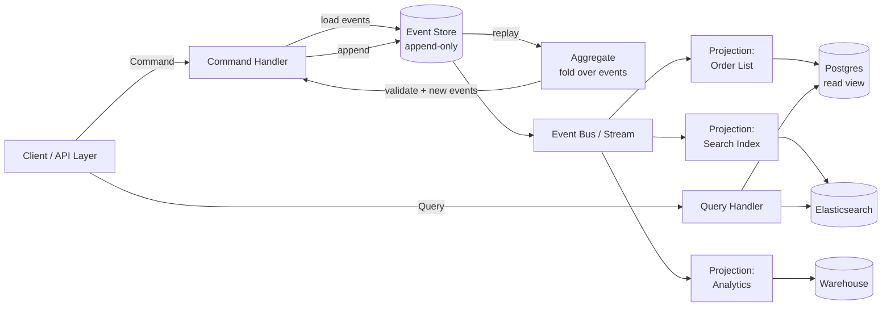

# CQRS and Event Sourcing — Commands, Queries, and the Event Log

**Date:** 2026-04-24 | **Updated:** 2026-04-24
**Tags:** `system-design` `scalability` `cqrs` `event-sourcing` `ddd`

## Table of Contents

- [Summary](#summary)
- [Starting Disclaimer — Two Patterns, Not One](#starting-disclaimer--two-patterns-not-one)
- [CQRS — Separating Intent from Inspection](#cqrs--separating-intent-from-inspection)
  - [Why Split Reads and Writes](#why-split-reads-and-writes)
  - [Levels of CQRS](#levels-of-cqrs)
- [Event Sourcing — The Log Is the Source of Truth](#event-sourcing--the-log-is-the-source-of-truth)
  - [Current State as a Fold](#current-state-as-a-fold)
  - [Rebuilding State and Snapshots](#rebuilding-state-and-snapshots)
- [Projections — Read Models on Demand](#projections--read-models-on-demand)
- [Why CQRS and ES Fit Together](#why-cqrs-and-es-fit-together)
- [End-to-End Flow](#end-to-end-flow)
- [Code — Command Handler, Event Append, Projection](#code--command-handler-event-append-projection)
- [Benefits](#benefits)
- [Costs and Trade-offs](#costs-and-trade-offs)
- [When to Use Each](#when-to-use-each)
- [When to AVOID](#when-to-avoid)
- [Snapshot Strategy](#snapshot-strategy)
- [Event Versioning — Never Break History](#event-versioning--never-break-history)
- [Tooling Landscape](#tooling-landscape)
- [Anti-Patterns](#anti-patterns)
- [Related](#related)
- [References](#references)

## Summary

**CQRS** (Command Query Responsibility Segregation) splits your model into two halves: a **command side** that accepts intent and mutates state, and a **query side** optimized for reading. **Event Sourcing** is a storage strategy where the write model is an **append-only log of events**, and current state is derived by folding that log. The two patterns are independent — you can use CQRS without ES, and (rarely) ES without CQRS — but they compose naturally: the command side appends events, and the query side maintains projections built from those events. The payoff is auditability, temporal queries, and independent scaling of reads. The price is eventual consistency, a hard schema-evolution problem, and real difficulty deleting data.

## Starting Disclaimer — Two Patterns, Not One

The first thing to get right is that **CQRS and Event Sourcing are separate patterns**. They are often discussed together because they compose well, but conflating them leads to bad decisions:

- You can do **CQRS without ES** — and you should, most of the time. A read replica serving `SELECT` queries while writes go to the primary is already CQRS in its mildest form.
- You can do **ES without CQRS** — rarer, but valid for append-only domains (audit logs, ledger systems) where there is no "write model vs read model" split, just an event log and queries against it.
- You can do **both**, which is what Greg Young, Vaughn Vernon, and most DDD literature assume when they say "CQRS/ES".

Treat the decision to use CQRS and the decision to use Event Sourcing as **two separate architectural choices**, each with its own cost/benefit profile. Don't adopt ES just because you wanted CQRS, and don't adopt CQRS just because someone on the team wants to try event sourcing.

## CQRS — Separating Intent from Inspection

The core idea is that **writing** and **reading** are different operations with different requirements:

- A **command** expresses intent: `PlaceOrder`, `CancelSubscription`, `TransferFunds`. It can be rejected. It changes state. It is about the *future*.
- A **query** inspects state: "list my orders", "show customer dashboard", "search products". It cannot be rejected on business grounds. It is about the *present* (or past).

CQRS asks: if these two concerns are so different, why are we forcing them to share a single object model?

### Why Split Reads and Writes

Four forces push you toward separation:

1. **Different scaling profiles** — Most systems are read-heavy by 10-100x. Reads can scale horizontally with replicas and caches; writes cannot without sharding or explicit coordination.
2. **Different optimization targets** — The write side wants a normalized model with invariants enforced at an aggregate boundary. The read side wants a denormalized model shaped for the UI (joins pre-computed, aggregates pre-aggregated).
3. **Different security postures** — A command goes through validation, authorization, and business-rule checks. A query only needs visibility filtering. Mixing them in a single endpoint blurs the security boundary.
4. **Different consistency requirements** — A command needs strong consistency within its aggregate. A query can often tolerate being a few hundred milliseconds stale ("you just ordered, your order list shows up in a moment").

### Levels of CQRS

CQRS is a spectrum, not a single architecture. Pick the level that actually pays for itself:

| Level | What it looks like | Complexity | When it fits |
|-------|--------------------|------------|--------------|
| **0 — Method separation** | Separate `commandHandler` and `queryHandler` classes against the same DB/ORM | Low | Almost always a win; costs nothing |
| **1 — Separate read models, same DB** | Dedicated read-optimized views, materialized views, or denormalized tables in the same database | Low-Medium | Read-heavy dashboards, reports |
| **2 — Read replicas** | Writes go to primary, reads go to replicas | Low | Standard OLTP scale-out |
| **3 — Fully separate read store** | Writes to Postgres, reads to Elasticsearch/Redis/MongoDB, synced async | High | Search, analytics, aggressively different access patterns |
| **4 — Full CQRS + ES** | Commands emit events, event store is write model, projections build read models async | Very High | Event-centric domains; strong auditability |

> The industry default should be Level 0 or 1. Levels 3 and 4 are expensive and should be chosen deliberately, not cargo-culted.

## Event Sourcing — The Log Is the Source of Truth

Event Sourcing flips the normal storage model. Instead of storing **current state** and losing history on each update, you store **every state change as an immutable event** and derive current state by replaying.

Traditional CRUD:

```text
orders table
┌────┬──────────┬──────────┬─────────┐
│ id │ customer │ total    │ status  │   ← only current state
├────┼──────────┼──────────┼─────────┤
│ 1  │ alice    │ 49.99    │ SHIPPED │
└────┴──────────┴──────────┴─────────┘
```

Event-sourced:

```text
events table (append-only)
┌─────┬──────────┬───────────────────┬────────────────────────────────────┐
│ seq │ agg_id   │ type              │ payload                            │
├─────┼──────────┼───────────────────┼────────────────────────────────────┤
│ 1   │ order-1  │ OrderPlaced       │ {customer: alice, items: [...]}    │
│ 2   │ order-1  │ PaymentCaptured   │ {amount: 49.99, method: card}      │
│ 3   │ order-1  │ OrderShipped      │ {carrier: ups, tracking: 1Z...}    │
└─────┴──────────┴───────────────────┴────────────────────────────────────┘
```

The current state is not stored — it is **computed from the events**.

### Current State as a Fold

Given an event stream for an aggregate, current state is a left-fold:

```text
state = events.reduce(apply, initialState)
```

Every event has a deterministic `apply(state, event) -> newState` function. This is how functional programmers have modeled state for decades, made durable.

### Rebuilding State and Snapshots

The naive read path for an aggregate is:

1. Load all events for the aggregate
2. Replay them through `apply()` to build current state
3. Handle the incoming command against that state
4. Append any new events

For a small aggregate (say, an order with 5-50 events), this is fast. For a long-lived one (a customer account that has existed for 10 years with 50,000 events), cold replay is unacceptably slow.

**Snapshots** solve this: periodically persist the folded state so replay only covers events after the snapshot.

```text
Snapshot @ seq 1000  ─────────────►  current state {...}
Events 1001..1037    ─────────────►  replayed on top
```

## Projections — Read Models on Demand

A **projection** is a read model built by subscribing to the event stream and maintaining some shape. Multiple projections can coexist from the same events:

- **List view projection** — flat denormalized table for the UI
- **Search projection** — Elasticsearch index
- **Analytics projection** — daily aggregates in a warehouse
- **Audit projection** — compliance-specific view

Key properties:

- **Eventually consistent** — a projection lags the event log by milliseconds to seconds
- **Rebuildable** — delete it and replay from event 0 to regenerate
- **Additive** — adding a new projection is a non-breaking change; you replay history into the new consumer
- **Independent failure** — a broken projection does not block commands; it catches up when fixed

This rebuildability is the real superpower. If you discover a reporting bug in 2026, you fix the projection code and replay — the canonical event history is untouched and the new view is *correct from the beginning of time*.

## Why CQRS and ES Fit Together

They compose naturally because:

- The write model (event store) is optimized purely for appends and per-aggregate reads
- The read models (projections) are optimized purely for their specific query shape
- The *interface* between the two sides is the event stream itself — a stable contract that is the source of truth

Neither side has to compromise for the other. That's the architectural claim.

## End-to-End Flow



Command path: synchronous, strongly consistent within the aggregate, atomic at the event-append step.
Query path: asynchronous relative to writes, eventually consistent, independently scalable per projection.

## Code — Command Handler, Event Append, Projection

TypeScript pseudocode; the same shape applies in Java/Spring with Axon or a hand-rolled event store.

```ts
// ---------- Events (immutable, versioned) ----------
type OrderPlaced = {
  type: "OrderPlaced"
  version: 1
  aggregateId: string
  customerId: string
  items: Array<{ sku: string; qty: number; price: number }>
  occurredAt: string // ISO 8601
}

type PaymentCaptured = {
  type: "PaymentCaptured"
  version: 1
  aggregateId: string
  amount: number
  method: "card" | "bank"
  occurredAt: string
}

type OrderEvent = OrderPlaced | PaymentCaptured // | ...

// ---------- Aggregate (fold) ----------
type OrderState = {
  id: string
  customerId: string | null
  status: "none" | "placed" | "paid" | "shipped" | "cancelled"
  total: number
  expectedVersion: number
}

const initialOrderState: OrderState = {
  id: "",
  customerId: null,
  status: "none",
  total: 0,
  expectedVersion: 0,
}

function applyOrderEvent(state: OrderState, event: OrderEvent): OrderState {
  switch (event.type) {
    case "OrderPlaced":
      return {
        ...state,
        id: event.aggregateId,
        customerId: event.customerId,
        status: "placed",
        total: event.items.reduce((s, i) => s + i.qty * i.price, 0),
        expectedVersion: state.expectedVersion + 1,
      }
    case "PaymentCaptured":
      return {
        ...state,
        status: "paid",
        expectedVersion: state.expectedVersion + 1,
      }
  }
}

function foldOrder(events: OrderEvent[]): OrderState {
  return events.reduce(applyOrderEvent, initialOrderState)
}

// ---------- Command handler ----------
type PlaceOrderCommand = {
  type: "PlaceOrder"
  aggregateId: string
  customerId: string
  items: Array<{ sku: string; qty: number; price: number }>
}

interface EventStore {
  loadStream(aggregateId: string): Promise<OrderEvent[]>
  append(
    aggregateId: string,
    expectedVersion: number,
    newEvents: OrderEvent[],
  ): Promise<void> // throws on optimistic-concurrency conflict
}

async function handlePlaceOrder(
  cmd: PlaceOrderCommand,
  store: EventStore,
): Promise<void> {
  const history = await store.loadStream(cmd.aggregateId)
  const state = foldOrder(history)

  if (state.status !== "none") {
    throw new Error(`Order ${cmd.aggregateId} already exists`)
  }
  if (cmd.items.length === 0) {
    throw new Error("Order must contain at least one item")
  }

  const event: OrderPlaced = {
    type: "OrderPlaced",
    version: 1,
    aggregateId: cmd.aggregateId,
    customerId: cmd.customerId,
    items: cmd.items,
    occurredAt: new Date().toISOString(),
  }

  await store.append(cmd.aggregateId, state.expectedVersion, [event])
  // event bus publication happens inside the store's transactional outbox
}

// ---------- Projection (read model builder) ----------
type OrderListRow = {
  orderId: string
  customerId: string
  total: number
  status: string
  placedAt: string
}

interface OrderListProjection {
  upsert(row: OrderListRow): Promise<void>
  updateStatus(orderId: string, status: string): Promise<void>
}

async function handleForListProjection(
  event: OrderEvent,
  projection: OrderListProjection,
): Promise<void> {
  switch (event.type) {
    case "OrderPlaced":
      await projection.upsert({
        orderId: event.aggregateId,
        customerId: event.customerId,
        total: event.items.reduce((s, i) => s + i.qty * i.price, 0),
        status: "placed",
        placedAt: event.occurredAt,
      })
      return
    case "PaymentCaptured":
      await projection.updateStatus(event.aggregateId, "paid")
      return
  }
}

// ---------- Rebuild a projection from scratch ----------
async function rebuildOrderListProjection(
  allEvents: AsyncIterable<OrderEvent>,
  projection: OrderListProjection,
): Promise<void> {
  for await (const event of allEvents) {
    await handleForListProjection(event, projection)
  }
}
```

A few things worth highlighting:

- The `expectedVersion` check in `append()` is how optimistic concurrency is enforced on the write side. Two concurrent commands on the same aggregate will collide and one must retry.
- The projection handler is **idempotent-shaped** (`upsert`) because at-least-once delivery is the norm on an event bus.
- Publication to the bus happens via a [transactional outbox](https://microservices.io/patterns/data/transactional-outbox.html) so you do not lose events between DB commit and broker publish.

## Benefits

- **Auditability by construction** — the event log is the audit log; nothing is lost
- **Temporal queries** — "what was the balance at T?" is a fold over events up to T
- **Flexible replay** — fix a projection bug, replay history, get correct read model with no migration script
- **Read scalability** — projections can live anywhere, in any store, shaped for their workload
- **Decoupled evolution** — new consumers can subscribe without touching the write side
- **Business-intent preservation** — events carry *why* something changed, not just *what* it is now

## Costs and Trade-offs

- **Eventual consistency** — the read side lags. UX must handle "I just did X, but the list does not show it yet".
- **Event schema evolution is HARD** — you cannot change a v1 event that happened 5 years ago. Upcasters, weak schemas, and versioning discipline are mandatory.
- **"You can never delete"** — this is great for audit, catastrophic for GDPR/right-to-erasure.
- **GDPR compliance** — the standard answer is **cryptographic deletion**: encrypt PII in the event payload with a per-subject key, and delete the key to make the data unrecoverable. Events remain; their sensitive contents become unreadable ciphertext.
- **Tooling maturity** — less mature than standard ORM stacks; debuggers, IDE support, migration tooling all weaker
- **Team learning curve** — CQRS/ES requires rewiring how engineers think about state; this takes months
- **More moving parts** — event store, projection builders, event bus, dead-letter queues, schema registry, replay tooling

## When to Use Each

Decision guide:

- **Plain CQRS (no ES)** — use when reads and writes have genuinely different shapes or scaling profiles. Read replicas, CQRS with materialized views, separate search index — all low-risk wins.
- **Event Sourcing** — use when the domain is **genuinely event-centric**: accounting ledgers, order lifecycles, claims processing, trading systems, medical records, anywhere an auditor would ask "prove what happened".
- **CQRS + ES together** — use when you need both high read scalability *and* an event-centric domain. This is the DDD tactical pattern most literature covers.

## When to AVOID

- **CRUD apps** where 90% of entities have no meaningful history ("user profile with name and avatar" does not need ES)
- **Teams unfamiliar with eventual consistency** — you will spend your first year re-discovering every lesson CQRS/ES veterans learned in 2012
- **Strong-consistency read UX** — if product requires "write then immediately read own write" on a complex projection, CQRS becomes painful
- **Small teams, tight deadlines** — operational burden of event stores, projections, replay tooling is nontrivial
- **Low-event-volume domains** — the overhead is not amortized; a boring Postgres schema wins
- **Regulatory environments with strict hard-delete** — deletion-via-key-destruction may or may not satisfy the regulator; get legal sign-off first

## Snapshot Strategy

For any aggregate that accumulates many events, snapshots are not optional. Two common triggers:

- **Every N events** — e.g., snapshot after every 100 events. Predictable; maps well to aggregate size.
- **Every T time** — e.g., snapshot daily. Simpler to reason about for slow-moving aggregates.

Rules:

- Snapshots are a **cache**, not a source of truth. Regenerating from events must always be possible.
- Store snapshot version alongside the payload so stale snapshots (after aggregate shape changes) can be invalidated.
- Snapshot generation is a **background job**, not in the command path.
- On load: fetch latest valid snapshot, then replay only events after its sequence number.

```ts
async function loadAggregate(
  aggregateId: string,
  store: EventStore,
  snapshots: SnapshotStore<OrderState>,
): Promise<OrderState> {
  const snap = await snapshots.latest(aggregateId)
  const baseState = snap?.state ?? initialOrderState
  const fromSeq = snap?.sequence ?? 0
  const tail = await store.loadStreamFrom(aggregateId, fromSeq)
  return tail.reduce(applyOrderEvent, baseState)
}
```

## Event Versioning — Never Break History

Once an event is committed, it is **immutable** — that is the central promise of event sourcing. This means normal schema migration tools do not help you. You have three primary options:

- **Upcasters** — on read, transform old-version events into the current shape before the aggregate sees them. Keeps fold logic clean.
- **Weak schema** — use flexible formats (JSON with optional fields, Avro with default values) so adding fields is non-breaking.
- **Multiple event types** — introduce `OrderPlacedV2` as a *new* event type alongside `OrderPlaced`. Never rewrite history.

Rules of engagement:

1. **Adding optional fields** is safe.
2. **Removing fields** requires upcasters that synthesize sensible defaults.
3. **Semantic changes** (meaning of a field changes) require a new event type, not a field rename.
4. **Never mutate historical events** — not even to "fix" them. Emit a compensating event instead (`OrderCorrected`, `BalanceAdjusted`).

This discipline is what people mean when they say ES has a steep learning curve.

## Tooling Landscape

| Tool | Category | Notes |
|------|----------|-------|
| [**EventStoreDB**](https://www.eventstore.com/) | Purpose-built event store | First-class streams, subscriptions, projections |
| [**Axon Framework**](https://www.axoniq.io/) | Java/Spring CQRS+ES framework | Command bus, aggregates, projection engine; strong DDD alignment |
| [**Marten**](https://martendb.io/) | .NET on Postgres | Event store + document DB over Postgres |
| [**Kafka as event store**](https://kafka.apache.org/documentation/#ep-event-sourcing) | Stream platform | Controversial — good for event distribution, questionable as the authoritative store (per-aggregate reads, compaction semantics) |
| **AWS EventBridge + DynamoDB Streams** | Managed building blocks | Cloud-native; you assemble the pieces yourself |
| **Postgres + outbox table** | DIY | Often the pragmatic starting point; Postgres handles events + outbox + snapshots |

The Kafka-as-event-store debate is real. Kafka is excellent for *distributing* events to projections; it is less well-suited as the authoritative per-aggregate store because loading one aggregate's stream is not its primary access pattern. Many practitioners use Postgres (or EventStoreDB) as the write authority and Kafka as the fan-out bus.

## Anti-Patterns

- **CQRS-for-CQRS's-sake** — separate command and query classes against the same DB, same model, same shape. All complexity, no benefit. If the read and write shapes are identical, you don't need CQRS.
- **Mutable events** — "let me just fix this one bad event" breaks the core invariant. Use compensating events instead.
- **Hiding eventual consistency from the UX** — the UI shows optimistic state but silently out of sync with reality. The user updates something, refreshes, and sees the old value. Either make the optimistic state obvious or wait for the projection.
- **Losing aggregate invariants** — ES makes it easy to have multiple subscribers reacting to events and creating hidden coupling that violates aggregate boundaries. Keep invariants in the aggregate; projections are *derived*, never authoritative.
- **Treating projections as sources of truth** — projections can be deleted and rebuilt; they are not primary data. Any code that writes to a projection table "just to fix something" is betraying the model.
- **Event payloads stuffed with state** — events should capture *what happened* (intent, decision, change), not serialize the entire entity. Fat events couple consumers to internal representation.
- **Confusing events with messages** — a command is a request ("please do X"); an event is a fact ("X happened"). Naming matters: `OrderPlaced`, not `PlaceOrder`, on the event bus.

## Related

- Event-Driven Architecture (Tier 5) — planned doc on broader EDA patterns, eventual consistency, and saga orchestration
- Replication Patterns (Tier 3) — sync vs async replication, leader-follower, multi-leader
- Read/Write Splitting and Cache Strategies (Tier 3) — the lightweight end of the CQRS spectrum
- [Postgres Internals](../../database/INDEX.md) — MVCC and WAL are conceptually close cousins of the event log
- [Kafka and Streaming](../../networking/INDEX.md) — transport layer commonly used for event distribution

## References

- [Martin Fowler — CQRS](https://martinfowler.com/bliki/CQRS.html) — the canonical short explainer; start here
- [Greg Young — CQRS Documents (PDF)](https://cqrs.wordpress.com/documents/cqrs-introduction/) — original Greg Young write-up covering the full pattern
- [Greg Young — A Decade of DDD, CQRS, Event Sourcing (talk)](https://www.youtube.com/watch?v=LDW0QWie21s) — retrospective on what the community got right and wrong
- [Microsoft — CQRS pattern](https://learn.microsoft.com/en-us/azure/architecture/patterns/cqrs) — Azure Architecture Center, practical cloud framing
- [Microsoft — Event Sourcing pattern](https://learn.microsoft.com/en-us/azure/architecture/patterns/event-sourcing) — paired Azure reference
- [Vaughn Vernon — Implementing Domain-Driven Design](https://www.informit.com/store/implementing-domain-driven-design-9780321834577) — Chapter 8 on Domain Events; core DDD tactical patterns
- [EventStoreDB Documentation](https://developers.eventstore.com/) — streams, subscriptions, projections, operations
- [Axon Framework Reference Guide](https://docs.axoniq.io/axon-framework-reference/) — JVM CQRS+ES framework; command bus, aggregates, query model
- [Martin Kleppmann — Designing Data-Intensive Applications, Ch. 11](https://dataintensive.net/) — event streams, change data capture, stream processing
- [Microservices.io — Transactional Outbox pattern](https://microservices.io/patterns/data/transactional-outbox.html) — reliable event publication alongside DB writes
- [Jonas Bonér — Reactive Manifesto](https://www.reactivemanifesto.org/) — broader context for event-driven, message-passing architectures
