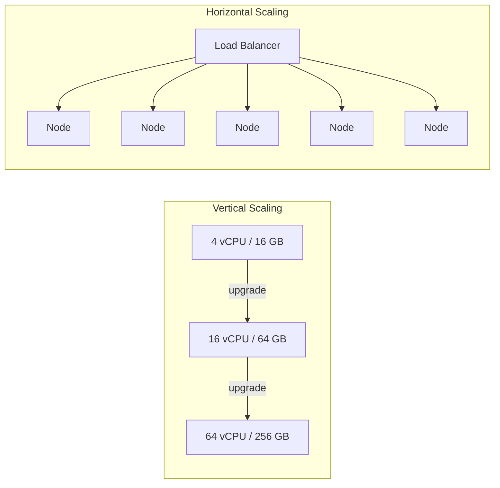
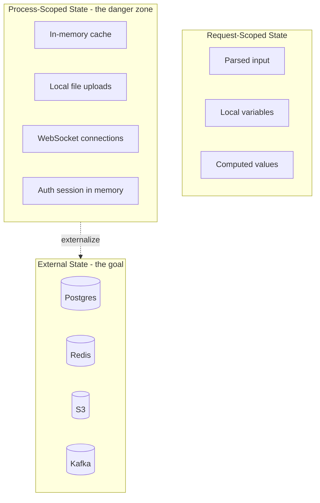

# Horizontal vs Vertical Scaling & Stateless Services — The Scale-Out Invariant

**Date:** 2026-04-24 | **Updated:** 2026-04-24
**Tags:** `system-design` `scalability` `horizontal-scaling` `stateless` `autoscaling`

## Table of Contents

- [Summary](#summary)
- [The Two Ways to Scale](#the-two-ways-to-scale)
  - [Vertical Scaling (Scale Up)](#vertical-scaling-scale-up)
  - [Horizontal Scaling (Scale Out)](#horizontal-scaling-scale-out)
  - [Cost and Ceiling Comparison](#cost-and-ceiling-comparison)
- [When Vertical Wins (Still)](#when-vertical-wins-still)
- [When You Must Go Horizontal](#when-you-must-go-horizontal)
- [The Stateless Invariant](#the-stateless-invariant)
  - [What "Stateless" Actually Means](#what-stateless-actually-means)
  - [Three Categories of State](#three-categories-of-state)
- [Session Externalization](#session-externalization)
  - [Sticky Sessions](#sticky-sessions)
  - [Redis-Backed Sessions](#redis-backed-sessions)
  - [Stateless Tokens (JWT)](#stateless-tokens-jwt)
- [The Hidden State Problems](#the-hidden-state-problems)
- [Making a Service Stateless — Checklist](#making-a-service-stateless--checklist)
- [Scaling Signals — The Right Metric per Workload](#scaling-signals--the-right-metric-per-workload)
- [Autoscaling Mechanisms](#autoscaling-mechanisms)
  - [Kubernetes HPA](#kubernetes-hpa)
  - [AWS Auto Scaling Groups](#aws-auto-scaling-groups)
  - [GCP Managed Instance Groups](#gcp-managed-instance-groups)
  - [Serverless Scaling](#serverless-scaling)
  - [Scale-Up vs Scale-Down Asymmetry](#scale-up-vs-scale-down-asymmetry)
- [Warm Pools and Pre-Warming](#warm-pools-and-pre-warming)
- [The Database Scales Differently](#the-database-scales-differently)
- [Anti-Patterns](#anti-patterns)
- [Related](#related)
- [References](#references)

## Summary

Scaling has exactly two axes: make the box bigger (**vertical**) or add more boxes (**horizontal**). Vertical is simpler but ceiling-bound and blast-radius-concentrated. Horizontal is unbounded but demands that a service be **stateless** — any request can land on any replica and produce a correct answer. Statelessness is not a label you slap on a service; it is an invariant you maintain by externalizing sessions, caches, and files, and by designing handlers that do not rely on sticky routing. Once that invariant holds, autoscalers (HPA, ASG, MIG, Lambda) can add and remove replicas based on the right signal — CPU, RPS, queue depth, or latency — and the app tier becomes elastic. The data tier scales differently, and conflating the two is the most common scalability mistake in a junior design.

## The Two Ways to Scale



### Vertical Scaling (Scale Up)

One bigger machine. Replace `m5.large` with `m5.24xlarge`. Add RAM. Upgrade to NVMe. Move from 1 Gbps to 25 Gbps networking. The process itself is unchanged — same binary, same config, same topology.

**Strengths:**

- No code changes required.
- No distributed-systems tax (no cache coherence, no coordination, no partial failure).
- Lower p99 latency for chatty workloads — everything is in-process.
- Simplest operational model: one host, one pager, one log stream.

**Weaknesses:**

- Ceiling: the biggest instance a cloud vendor sells. AWS tops out around 448 vCPU / 24 TiB RAM on high-memory instances; you cannot go beyond that by paying more.
- Cost curve is superlinear — a 64-core instance costs more than 16× a 4-core one because flagship SKUs command a premium.
- Single point of failure. Host dies, service dies.
- Deploy blast radius is the entire service.
- Downtime on resize (reboot, migration) unless the cloud supports live migration.

### Horizontal Scaling (Scale Out)

More identical machines behind a load balancer. Go from 1 replica to 10 to 100.

**Strengths:**

- Effectively unbounded — add nodes until your data tier or LB is the bottleneck.
- Failure tolerance built in: lose one of N, lose 1/N of capacity, not the service.
- Rolling deploys become safe — take 10% out, upgrade, rotate.
- Matches cloud pricing: linear cost per unit capacity.
- Enables regional distribution (replicas in multiple AZs/regions).

**Weaknesses:**

- Requires the service to be stateless (the rest of this doc).
- Adds distributed-systems cost: load balancer, health checks, shared cache, config sync.
- Observability is harder — one request can touch many replicas.
- Cold-start and warm-pool concerns.

### Cost and Ceiling Comparison

| Dimension             | Vertical                          | Horizontal                          |
| --------------------- | --------------------------------- | ----------------------------------- |
| Ceiling               | Biggest SKU the cloud sells       | Data tier / LB / coordination limit |
| Cost curve            | Superlinear past mid-tier         | Roughly linear                      |
| Blast radius          | 100%                              | 1/N                                 |
| Deploy strategy       | Restart = downtime               | Rolling, blue/green, canary         |
| Code complexity       | None                              | Stateless discipline required       |
| Ideal first response  | Traffic grew 2–3×                 | Traffic grew 10× or more            |

## When Vertical Wins (Still)

Horizontal is not always the right answer. Reach for bigger boxes when:

- **The database tier of a small-to-medium product.** A single well-tuned Postgres on a big box handles shockingly high load (tens of thousands of TPS). Sharding adds operational cost you should not pay until you must.
- **Single-writer workloads.** Anything with a strict single-writer invariant — ledgers, sequence generators, certain ML training loops — scales vertically before it scales horizontally.
- **Simple architectures with a strong simplicity budget.** A two-person startup with 5k MRR should not be running a service mesh. Big box, one replica, good backups.
- **Latency-sensitive in-process pipelines.** If the workload is "fan out across 20 microservices for one request," reducing that to one big monolith on a big box can be cheaper and faster.
- **Memory-bound workloads with large datasets.** Loading a 400 GB model or dataset into one machine beats sharding it across ten with a chatty protocol.
- **Legacy code you do not control.** Statefulness baked into the design is sometimes worth a year of vertical scaling while horizontal is planned properly.

The heuristic: **scale vertically until the box is no longer affordable or no longer exists, then scale horizontally**. Do not prematurely distribute.

## When You Must Go Horizontal

- **Traffic exceeds the biggest box.** The ceiling is real — if your production workload needs 200 cores dedicated per second, one machine is not enough.
- **Blast-radius reduction.** A financial product cannot have "the host is rebooting" as a 100%-of-users outage. You need N of them so that any one can fail invisibly.
- **Regional distribution.** Users in Singapore, Frankfurt, and São Paulo want local latency. One box in us-east-1 cannot do this.
- **Rolling deploys and canaries.** Shipping 10× per day with zero downtime requires replica pools to rotate through.
- **Elasticity.** Spiky traffic (campaigns, cron jobs, batch ingest) is cheaper on a fleet that scales down at night than on a big always-on box.

## The Stateless Invariant

Horizontal scale only works if **any request can be served by any replica**. That invariant is called statelessness, and it is what every load balancer round-robins against.

### What "Stateless" Actually Means

A service is stateless when **the next request does not depend on anything the previous request left in this specific process**. The service can still be functionally stateful — the user has a session, there is a shopping cart, there is a login — but that state lives **outside** the process, in a shared store every replica can read.

A common misunderstanding: "stateless" does not mean "has no state." It means "does not own state privately." Replicas are interchangeable.

### Three Categories of State



- **Request-scoped state** — exists only for the life of one request. Always safe. Local variables, parsed DTOs, per-request traces. This is fine and inherent.
- **Process-scoped state** — lives in the replica between requests. **This is the enemy of horizontal scale.** In-memory caches, uploaded files on local disk, long-lived WebSocket buffers, JVM-wide rate-limit counters.
- **External state** — lives in a shared store (Postgres, Redis, S3, Kafka). Every replica sees the same view. This is where all persistent state belongs.

The stateless invariant is: **move all process-scoped state to external state, or make it reconstructible from external state**.

## Session Externalization

Sessions are the canonical example. User logs in, gets a session ID, next request must recognize them. Where does the session live?

### Sticky Sessions

Load balancer pins a user to a specific replica (cookie-based or source-IP hash). Session lives in that replica's memory.

**Pros:** Zero infrastructure. Works with legacy apps. Lowest latency.

**Cons:** Replica death = user logged out. Uneven load distribution. Scale-down drops users mid-request. Breaks rolling deploys. This is a patch, not a solution. **Do not build new systems on sticky sessions unless you have a specific reason.**

### Redis-Backed Sessions

Session ID is a random token stored in a cookie. Session data lives in Redis, keyed by that ID. Any replica can fetch it.

```pseudocode
POST /login (username, password) ->
    verify credentials
    sessionId = randomToken()
    redis.SET("session:" + sessionId, { userId, roles, csrf }, TTL=1800)
    setCookie("sid", sessionId, HttpOnly, Secure, SameSite=Lax)

GET /profile (Cookie: sid=abc123) ->
    sessionData = redis.GET("session:abc123")
    if not sessionData: 401
    renderProfile(sessionData.userId)
```

**Pros:** Works with any fleet size. Revocable (delete the key). Rich session data. Standard pattern in Spring Session, express-session with RedisStore, etc.

**Cons:** Redis is now a dependency of every request. Requires HA Redis. Adds ~1ms round trip per request. Cost grows with concurrent users.

### Stateless Tokens (JWT)

The client holds the state. Server signs a JWT containing the user identity + claims; server only verifies the signature on each request. No server-side lookup.

**Pros:** Zero server-side session store. Any replica can validate independently. Works across services and domains.

**Cons:** **Revocation is hard** — a JWT is valid until it expires. You either live with that window, maintain a revocation list (which re-introduces a lookup, defeating the point), or keep tokens very short-lived and refresh aggressively. Claims are visible to the client. Tokens are bigger than session IDs. Signing key rotation requires discipline.

**Heuristic:**

| Scenario                                    | Use                   |
| ------------------------------------------- | --------------------- |
| Classic web app, needs logout revocation    | Redis-backed sessions |
| API for mobile/SPA, short-lived tokens OK   | JWT + refresh tokens  |
| Legacy app you cannot modify                | Sticky sessions       |
| Microservices passing identity peer-to-peer | JWT / signed tokens   |

## The Hidden State Problems

Even when sessions are externalized, services leak state in subtler ways.

1. **In-memory caches that drift.** You cache `getUser(id)` in a local `Map` for speed. Replica A sees `user.email = new@x.com`, replica B still has the old email. Any write invalidation scheme that is not cluster-wide is broken. Either use a distributed cache, attach a short TTL, or accept the staleness explicitly.

2. **Local file uploads.** User uploads an avatar, replica A writes it to `/tmp/avatars/`. Next request lands on replica B, avatar is missing. Fix: upload directly to S3 (presigned URL) or stream through the app to S3.

3. **CPU-pinned batch work.** A replica kicks off a 10-minute job, holds results in memory, tells the client "poll /jobs/123". If that request lands on another replica, it sees nothing. Fix: put the job in a queue, persist the result, poll via external store.

4. **Long-running WebSocket connections.** A client is subscribed to replica A. You want to push a notification from replica B. B has no idea A exists. Fix: a pub/sub bus (Redis pub/sub, Kafka, NATS) that every replica subscribes to and fans out to its local connections.

5. **Per-process rate limiters.** `if counter > 100 return 429`. With 10 replicas, the effective limit is 10× what you intended. Fix: centralized limiter (Redis with Lua script, dedicated rate limiter service).

6. **JVM warmup and JIT state.** Not incorrect state, but performance-relevant state. A fresh replica runs 5× slower until the JIT warms. Autoscaling in under the warmup window makes the scale-out event a latency spike, not a relief.

7. **Connection pools sized per replica.** `maxConnections = 20` × 50 replicas = 1000 connections into your Postgres. Postgres dies. Fix: a connection pooler (PgBouncer) or scale pool size with replica count awareness.

## Making a Service Stateless — Checklist

- [ ] Sessions live in Redis, a database, or the client (JWT). Never process memory.
- [ ] Uploads go directly to object storage, not local disk.
- [ ] In-memory caches either are safe-to-drift with a TTL or are replaced by a distributed cache.
- [ ] Background jobs are enqueued, not held in memory.
- [ ] WebSocket/SSE fan-out uses a pub/sub bus.
- [ ] Rate limiters are centralized.
- [ ] Connection pools are sized with horizontal fan-out in mind (use a pooler).
- [ ] Any route handler assumes it may be the first request this process has ever seen.
- [ ] Zero logic depends on "previous request on this replica set X."
- [ ] Health checks do not rely on warmed local state.
- [ ] Graceful shutdown drains connections and flushes in-flight work to external state.

If you can pull a replica's plug at any time and the user sees at most one retry, you are stateless.

## Scaling Signals — The Right Metric per Workload

Autoscaling on the wrong metric is worse than no autoscaling.

| Workload                          | Right signal                        | Wrong signal       | Why                                                          |
| --------------------------------- | ----------------------------------- | ------------------ | ------------------------------------------------------------ |
| CPU-bound (compute, image resize) | CPU utilization                     | RPS                | RPS does not capture work-per-request                         |
| Web API, IO-bound                 | RPS or in-flight requests           | CPU                | CPU stays low while threads block on DB; HPA never fires     |
| Queue worker (Kafka, SQS)         | Queue depth or consumer lag         | CPU                | Queue can back up with idle CPU; scale on backlog            |
| Latency-sensitive                 | p99 latency or saturation (PSI)     | Average latency    | Averages hide the tail that users actually notice            |
| Memory-bound                      | Memory utilization                  | CPU                | OOMs happen with low CPU                                     |
| Mixed                             | Custom composite + SLO-based caps   | Any single metric  | Real workloads need multi-signal                             |

**Rule of thumb:** scale on the metric that saturates first. If your service melts at CPU=80% long before RPS does anything interesting, use CPU. If it is the inverse (threads blocked, CPU bored), scale on queue depth or in-flight requests.

## Autoscaling Mechanisms

### Kubernetes HPA

The Horizontal Pod Autoscaler watches a metric, computes desired replicas as `current * (currentMetric / targetMetric)`, and updates the deployment's replica count. Evaluates every 15 s by default.

```yaml
apiVersion: autoscaling/v2
kind: HorizontalPodAutoscaler
metadata:
  name: api-hpa
  namespace: prod
spec:
  scaleTargetRef:
    apiVersion: apps/v1
    kind: Deployment
    name: api
  minReplicas: 3
  maxReplicas: 50
  metrics:
    - type: Resource
      resource:
        name: cpu
        target:
          type: Utilization
          averageUtilization: 70
    - type: Pods
      pods:
        metric:
          name: http_requests_per_second
        target:
          type: AverageValue
          averageValue: "200"
  behavior:
    scaleUp:
      stabilizationWindowSeconds: 30
      policies:
        - type: Percent
          value: 100
          periodSeconds: 30
        - type: Pods
          value: 4
          periodSeconds: 30
      selectPolicy: Max
    scaleDown:
      stabilizationWindowSeconds: 300
      policies:
        - type: Percent
          value: 10
          periodSeconds: 60
```

Key details:

- `minReplicas: 3` — keeps a quorum so one AZ failure does not knock you to zero.
- `stabilizationWindowSeconds` asymmetric — fast up (30 s), slow down (300 s) to prevent thrashing.
- Multi-metric: HPA picks the biggest desired-replica number across metrics.
- Custom metrics require the external metrics API (Prometheus Adapter, KEDA, CloudWatch adapter).

### AWS Auto Scaling Groups

ASGs scale EC2 fleets on CloudWatch alarms (target tracking, step scaling, or scheduled). Target tracking is the 80% case: "keep average CPU at 60%." ASG cooldowns prevent rapid oscillation. Lifecycle hooks let you run init scripts on scale-up and drain on scale-down.

### GCP Managed Instance Groups

MIGs autoscale on CPU, load balancing utilization, Cloud Monitoring metrics, or queue-based signals. Supports predictive autoscaling that learns from historical patterns and scales out **before** the forecasted spike — valuable for JVM workloads with slow warmup.

### Serverless Scaling

Lambda/Cloud Run/Functions scale to requests directly — one concurrent request = one sandbox. The platform owns the autoscaler. Constraints:

- Cold starts (100 ms – several seconds depending on runtime).
- Per-region concurrency limits (Lambda default 1,000).
- Billing per invocation + duration; cheap at low volume, expensive at sustained high RPS.
- Still requires statelessness — the sandbox may be reused or may not.

### Scale-Up vs Scale-Down Asymmetry

Always scale up faster than you scale down. The cost of being briefly over-provisioned is a few cents per minute. The cost of being under-provisioned is dropped requests, p99 spikes, and paged humans. Typical asymmetry:

- Scale-up stabilization: 30–60 s.
- Scale-down stabilization: 5–10 min.
- Scale-down step: small (10–25% of current fleet per minute) to avoid "removed the replica a retry would have landed on."

Without asymmetry, you get **thrashing** — up, down, up, down around a threshold — which amplifies cold-start pain.

## Warm Pools and Pre-Warming

Horizontal scale's dirty secret: new replicas are slow.

- **JVM:** 30 s–3 min to JIT-compile hot paths. A Spring Boot app at `T+0` serves requests at 5× the latency it will at `T+90s`.
- **Node.js:** seconds to start, but module loading + V8 optimization still takes a warmup period for JITed paths.
- **Containers:** image pull can take 10–60 s on first node schedule.
- **Lambdas:** cold start of 100 ms – 2 s depending on runtime and package size.

Mitigations:

1. **Warm pools / pre-warmed instances.** AWS ASG warm pools keep EC2 instances stopped-but-initialized, ready to boot in seconds. GCP has pre-warmed MIG instances.
2. **Over-provisioning headroom.** Run at 50–60% average utilization, not 85%. The slack absorbs the warmup window during scale-up.
3. **Predictive autoscaling.** Use forecasts to scale up **before** the traffic arrives — GCP predictive autoscaling, AWS predictive scaling, or custom cron-based pre-scaling for known traffic patterns.
4. **Readiness probes that gate traffic.** Kubernetes `readinessProbe` should not mark a pod Ready until it can actually serve at target latency. For JVM, run a warmup request loop in an init container or `lifecycle.postStart`.
5. **Snapshot start (where available).** Lambda SnapStart, CRaC for JVM — snapshot the process after warmup and resume from snapshot on cold start.
6. **Ahead-of-time compilation.** GraalVM native image eliminates most JVM warmup at the cost of peak throughput and build complexity.

## The Database Scales Differently

A repeatable mistake: "we'll just add HPA to the Postgres deployment." No.

Stateless horizontal scaling applies to the **app tier**. The data tier is stateful by definition — every row lives somewhere specific, and scaling it means deciding where new data goes and how replicas stay in sync.

- **Read scaling:** read replicas (async replication). Every read replica you add extends read capacity. Writes still go to the primary — see [Replication Patterns](replication-patterns.md).
- **Write scaling:** sharding. Splits the data across N primaries. Expensive operationally — see [Sharding Strategies](sharding-strategies.md).
- **Connection scaling:** a connection pooler (PgBouncer, RDS Proxy). 100 app replicas × 20 connections is not 2000 real Postgres connections — it's 2000 dead Postgres connections. Pool them.
- **Cache offload:** put Redis in front of the DB for hot reads — see the cache-strategies doc.

**The scaling story for a well-designed app tier is boring (add replicas). The scaling story for the data tier is a project with a roadmap.** Do not treat them as the same problem.

## Anti-Patterns

- **"Stateless" with a local in-memory cache.** The service claims to be horizontal-safe but quietly caches per-replica. Works at 2 replicas, misbehaves at 20. Either go distributed or attach a TTL and document the staleness budget.
- **HPA on CPU for an IO-bound workload.** The service blocks on DB round trips; CPU stays at 15% while p99 latency melts. HPA never fires. Scale on in-flight requests, RPS, or queue depth.
- **Scale-up without SLO-based caps.** Runaway autoscaler in response to a pathological request or a DDOS. Always set `maxReplicas` and alert on "at max for N minutes."
- **Autoscaling a DB under ambiguous load.** Aurora Serverless and similar can scale a DB, but on the wrong signal they thrash, and every scale event is a mini-failover. Be explicit about what triggers scaling and test it.
- **Sticky sessions as the scaling strategy.** Works, but prevents even load distribution, breaks rolling deploys, and drops users on scale-down. Fine as a bridge; not a destination.
- **Scaling on average latency.** Averages hide the tail. A p50 of 50 ms and a p99 of 3 s look the same on average as p50 250 ms / p99 300 ms. Users live in the tail.
- **No cooldown / no stabilization window.** The fleet oscillates. Each scale-down drops a warming replica; each scale-up takes 90 s to be useful. Net result: worse p99 than static provisioning.
- **Treating Lambda as free.** At sustained high RPS, Lambda is dramatically more expensive than containers. It is a great default; it is a bad default when you've outgrown it.
- **Autoscaling without backpressure.** If the app scales up but the DB cannot keep up, the autoscaler is amplifying the damage. Pair autoscaling with [backpressure and circuit breakers](backpressure-bulkhead-circuit-breaker.md).
- **Uniform replicas for heterogeneous workloads.** A single deployment serving both a CPU-bound image processor and a cheap JSON API scales inefficiently on either signal. Split into separate deployments.

## Related

- [Sharding Strategies — Range, Hash, Directory, Geo, Consistent Hashing](sharding-strategies.md) — scaling the data tier, where stateless scale-out stops working.
- [Replication Patterns — Primary-Replica, Multi-Primary, Quorum](replication-patterns.md) — read-scaling the data tier while the app tier scales horizontally.
- [Read/Write Splitting & Cache Strategies](read-write-splitting-and-cache-strategies.md) — the cache layer that makes externalized state fast.
- [Backpressure, Bulkhead, and Circuit Breakers](backpressure-bulkhead-circuit-breaker.md) — what autoscaling must be paired with to avoid amplifying failures.
- [Load Balancers in System Design](../building-blocks/load-balancers.md) — the thing in front of every horizontally scaled fleet.
- [Caching Layers](../building-blocks/caching-layers.md) — where process-scoped caches want to live instead.
- [Kubernetes Learning Path](../../kubernetes/INDEX.md) — HPA, VPA, Cluster Autoscaler, and pod lifecycle details that back the K8s side of this doc.
- [SLA, SLO, SLI and the Math of Availability](../foundations/sla-slo-sli-and-availability.md) — the SLO ceilings that should cap your `maxReplicas`.

## References

1. [AWS Auto Scaling — User Guide](https://docs.aws.amazon.com/autoscaling/) — target tracking, step scaling, predictive scaling, warm pools, lifecycle hooks.
2. [Kubernetes Horizontal Pod Autoscaler](https://kubernetes.io/docs/tasks/run-application/horizontal-pod-autoscale/) — v2 API, metric types, stabilization windows, scaling behaviors.
3. [Google SRE Book — Chapter 18: Software Engineering in SRE](https://sre.google/sre-book/software-engineering-in-sre/) and [Chapter 22: Handling Overload](https://sre.google/sre-book/handling-overload/) — capacity planning, load shedding, and graceful degradation.
4. [The Twelve-Factor App — VI. Processes](https://12factor.net/processes) — the canonical statement that processes must be stateless and share-nothing to scale out.
5. [Google Cloud — Autoscaling Groups of Instances](https://cloud.google.com/compute/docs/autoscaler) — MIG autoscaling signals, predictive autoscaling, scale-in controls.
6. [Netflix Tech Blog — Scryer: Netflix's Predictive Auto Scaling Engine](https://netflixtechblog.com/scryer-netflixs-predictive-auto-scaling-engine-a3f8fc922270) — why reactive autoscaling alone was insufficient for Netflix and how they built forecast-based scaling.
7. [AWS Lambda SnapStart](https://docs.aws.amazon.com/lambda/latest/dg/snapstart.html) — snapshot-based cold-start mitigation for JVM Lambdas.
8. [Martin Fowler — Event-Driven and Event Sourcing patterns](https://martinfowler.com/articles/201701-event-driven.html) — event-carried state transfer as a stateless integration pattern between services.
