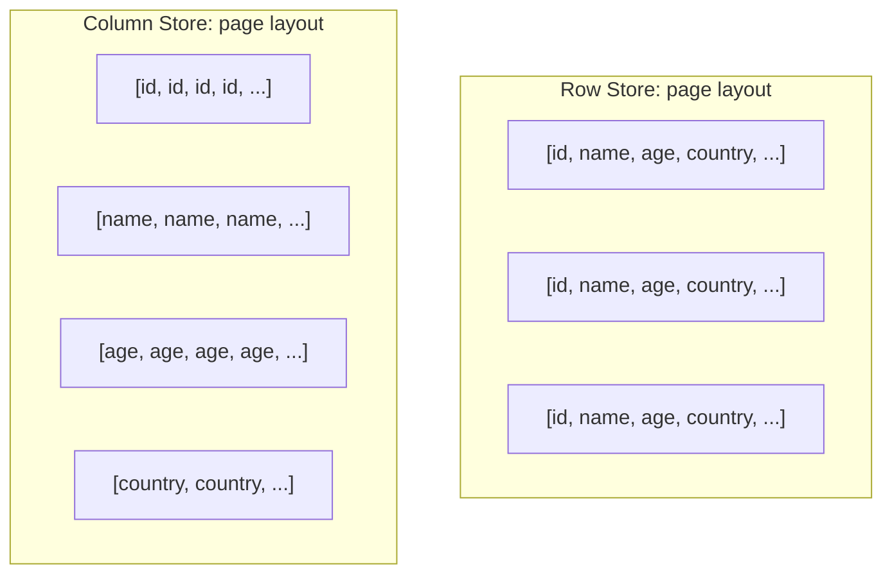

# Read-Path Optimizations — Denormalization, Materialized Views, Compression

**Date:** 2026-04-26 | **Updated:** 2026-04-26
**Tags:** `system-design` `scalability` `read-path` `denormalization` `indexes`

## Table of Contents

- [Summary](#summary)
- [Why This Matters](#why-this-matters)
- [Where Reads Bottleneck](#where-reads-bottleneck)
- [Key Concepts](#key-concepts)
  - [Denormalization — Copy Data to Where It's Read](#denormalization--copy-data-to-where-its-read)
  - [Materialized Views — Pre-Computed, Refreshed](#materialized-views--pre-computed-refreshed)
  - [Covering Indexes — Skip the Heap Fetch](#covering-indexes--skip-the-heap-fetch)
  - [Projection and Filtered Indexes](#projection-and-filtered-indexes)
  - [Row vs Column Storage](#row-vs-column-storage)
  - [Compression Algorithms — Zstd, LZ4, Snappy, Brotli](#compression-algorithms--zstd-lz4-snappy-brotli)
  - [Per-Column Compression in Column Stores](#per-column-compression-in-column-stores)
- [Trade-Offs](#trade-offs)
- [Code Examples](#code-examples)
  - [PostgreSQL Materialized View with REFRESH](#postgresql-materialized-view-with-refresh)
  - [Covering Index DDL (PostgreSQL INCLUDE)](#covering-index-ddl-postgresql-include)
  - [ClickHouse Projection](#clickhouse-projection)
  - [Parquet Per-Column Codec Selection](#parquet-per-column-codec-selection)
- [Real-World Uses](#real-world-uses)
- [Anti-Patterns](#anti-patterns)
- [Related](#related)
- [References](#references)

## Summary

Reads dominate most production workloads (often 100:1 vs writes), and the cheapest read is the one you precompute and stash close to the consumer. **Denormalization** copies data to where it's read so a join becomes a point lookup; **materialized views** pre-aggregate or pre-join and refresh on a cadence; **covering indexes** answer queries without touching the heap; **column stores** (Parquet, ClickHouse) read only the columns the query needs; and **compression** (Zstd, LZ4, Snappy, Brotli) trades CPU for IO and storage. Every one of these techniques pays for the read with **write amplification**, **storage cost**, and **freshness lag** — pick the smallest dose that meets your latency target.

## Why This Matters

In a design review someone will say "the dashboard is slow, let's add a cache." That's a Band-Aid that buys you 50ms but inherits cache-invalidation pain. The deeper move is to ask: _where on the read path is time being spent?_ The answer is almost always one of:

- **Joins** — joining at read time when the relationship is rarely changing.
- **Aggregations** — `SUM`/`COUNT`/`GROUP BY` over millions of rows on every dashboard refresh.
- **Heap fetches** — index scan returns matching rows but every row needs a separate page read for the columns the query actually wants.
- **Wide rows in row stores** — analytics scanning 5 columns out of 50 still pays IO for all 50.
- **Uncompressed network and disk traffic** — gigabytes of redundant text on the wire when Zstd would have made it 10× smaller.

This doc gives you the precise vocabulary to point at one of those bottlenecks and propose the right structural fix instead of reaching for "add Redis" reflexively. Caching is in [Read/Write Splitting and Cache Strategies](./read-write-splitting-and-cache-strategies.md); this doc is about what to do **before** caching so the source itself is fast.

## Where Reads Bottleneck

```mermaid
flowchart LR
    Q[Query] --> Plan[Planner]
    Plan --> A{Index hit?}
    A -->|No| Scan[Sequential scan<br/>O(rows)]
    A -->|Yes, but selects more cols| Heap[Heap fetch per row<br/>random IO]
    A -->|Yes, covering| Direct[Index-only scan]
    Plan --> J{Join needed?}
    J -->|Yes| Join[Hash/merge/nested-loop<br/>memory + CPU]
    J -->|No, denormalized| OneRead[Single read]
    Plan --> Agg{Aggregation?}
    Agg -->|At read time| Live[O(rows) on every query]
    Agg -->|Pre-computed| MV[O(1) materialized lookup]
```

Each branch on the right has a structural answer:

- Sequential scan → covering index, partition pruning, column store.
- Heap fetch → `INCLUDE` columns or projection index.
- Live join → denormalize the rarely-changing side.
- Live aggregation → materialized view or rolling counter.
- IO-bound scan → compression and column pruning.

## Key Concepts

### Denormalization — Copy Data to Where It's Read

Normalization (3NF) optimizes for write integrity: each fact lives in exactly one place. **Denormalization is the deliberate, audited duplication of data so reads don't pay for joins.** It is not "we forgot to normalize." It's a trade.

**When normalize-then-denormalize beats join:**

- The joined-in data changes much less often than the parent (e.g., user's `display_name` joined onto every order).
- The join is on the hot path of a UI (e.g., timeline, search results).
- The join would cross a shard boundary (a denormalized copy avoids cross-shard fan-out — see [Sharding Strategies](./sharding-strategies.md)).
- The downstream consumer is a different store (search index, OLAP warehouse, cache).

**The duplication contract:**

You now own keeping the duplicates in sync. Two patterns:

1. **Synchronous fan-out at write** — when the source updates, write to all duplicates in the same transaction (or a transactional outbox). Strong but couples writes.
2. **Asynchronous via CDC / event log** — source emits a change event; consumers update their copies. Eventually consistent but decouples.

Either way, **accept eventual consistency on duplicates**. A user who renames themselves may see their old name on yesterday's invoice for a few seconds. Spelling that out in the spec is the design discipline.

The general rule: **denormalize for read paths, then guard the duplicate with a CDC pipeline or a refresh job.** Do not denormalize "just because joins are slow" — measure first.

### Materialized Views — Pre-Computed, Refreshed

A regular SQL `VIEW` is a saved query. It has no storage; every read re-runs the underlying query. Useful for abstraction, useless for performance.

A **materialized view (MV)** is a saved query whose result is **stored** as a real table-like object. Reads hit the precomputed result. The cost is staleness — the MV reflects the source as of the last refresh.

**Two refresh strategies:**

| Strategy | How | Freshness | Cost |
|----------|-----|-----------|------|
| **Pull-based / scheduled** (e.g., Postgres `REFRESH MATERIALIZED VIEW`) | A job re-runs the query and replaces the MV contents | Bounded by cron cadence (1 min, 5 min, 1 hour) | Full or incremental recompute |
| **Push-based / incremental** (Oracle "fast refresh", Materialize, RisingWave, ClickHouse `MATERIALIZED VIEW` with insert triggers) | Source writes propagate as deltas into the MV | Near real-time (sub-second) | Continuous compute, more engine complexity |

Postgres native MVs are pull-only — `REFRESH MATERIALIZED VIEW [CONCURRENTLY] name`. `CONCURRENTLY` requires a unique index but lets readers query the old version while the refresh runs. Without it the MV takes an `ACCESS EXCLUSIVE` lock during refresh.

**Pre-aggregated rolling counters** are a degenerate but common MV: instead of `SELECT COUNT(*) FROM events WHERE user_id = ?` on every page load, maintain a `user_event_counts` table updated on every event insert. The "view" is one row per user. This is denormalization + materialization combined.

**MV vs view (no storage):**

- View: zero storage, recomputed on every query, always fresh, slow if underlying query is slow.
- Materialized view: storage = result size, query is fast lookup, freshness lags refresh.

Pick MV only when the precomputed result is much smaller than re-running the query, **and** the staleness is acceptable.

### Covering Indexes — Skip the Heap Fetch

A B-tree index normally stores the **key columns** plus a **row pointer** (TID / row ID). To answer `SELECT a, b FROM t WHERE a = ?` the planner walks the index for `a`, gets a row pointer, then **fetches the heap page** to read `b`. That heap fetch is random IO.

A **covering index** stores the extra columns the query needs **inside the index leaf**, so the planner never touches the heap — an "index-only scan."

**Postgres syntax:**

```sql
CREATE INDEX idx_orders_user_covering
  ON orders (user_id)
  INCLUDE (status, total_cents, created_at);
```

`INCLUDE` columns are not part of the B-tree key (no ordering, no uniqueness), they're just along for the ride. Postgres also requires the visibility map to be up-to-date for index-only scans (run `VACUUM` regularly or autovacuum will).

**SQL Server / MySQL InnoDB equivalents:**

- SQL Server: `CREATE INDEX ... INCLUDE (col1, col2)` since 2005.
- MySQL InnoDB: secondary indexes already include the primary key in the leaf, so a query that selects only the PK + indexed columns is naturally covering. For others you build a composite index `(a, b, c)` and select only those.

**Diagnostics:** look for `Index Only Scan` in `EXPLAIN` output. If you see `Index Scan` followed by a heap re-check, the index isn't covering for that query.

The deeper cost: **wider indexes = larger index = more pages to keep in cache = slower writes** (every insert/update has to write the wider leaf). Cover the hot queries, not all of them.

### Projection and Filtered Indexes

**Filtered (partial) indexes** index only rows matching a predicate. Smaller index = faster scans = less storage:

```sql
CREATE INDEX idx_active_orders ON orders (user_id)
  WHERE status = 'active';
```

Now `SELECT ... WHERE user_id = ? AND status = 'active'` uses an index that contains only active orders. If 90% of orders are completed, the active index is 10× smaller.

**Projection indexes** is ClickHouse and BigQuery terminology — a precomputed alternate sort/aggregation of a table that the query planner transparently uses when beneficial. Closer to a per-table materialized view that the engine maintains.

```sql
ALTER TABLE events ADD PROJECTION proj_by_user
  (SELECT * ORDER BY user_id, event_time);
```

Now queries filtering by `user_id` use the projection (which is sorted by user) instead of the main table (sorted by, say, event_time). Like a covering index but for column-store sort orders.

### Row vs Column Storage

**Row stores** (Postgres heap, MySQL InnoDB, most OLTP): each row's columns are stored contiguously on disk. Reading one whole row is one IO; reading one column from many rows pulls every column for each row.

**Column stores** (ClickHouse, DuckDB, Snowflake, Parquet, Apache Arrow, Vertica, Cassandra wide-column-ish): each column is stored separately. Reading one column from a billion rows touches only that column's pages.



**Column wins for analytics** because:

1. **Column pruning** — `SELECT SUM(amount) FROM events` reads only the `amount` column, ~50× less IO if the table has 50 columns.
2. **Compression ratio** — adjacent values in a column are highly similar (e.g., 1M timestamps clustered in a day, 1M `country = 'US'`). Column-level RLE, dictionary, and delta encoding can hit 10–50× compression.
3. **Vectorized execution** — operating on a contiguous array of one type fits SIMD (AVX-512) and CPU cache lines beautifully.

**Row wins for OLTP** because point reads and transactional writes touch a whole row, and updating a single column in a column store rewrites the whole column page.

Cross-reference: [OLTP vs OLAP and Lakehouses](../data-consistency/oltp-vs-olap-and-lakehouses.md) covers the workload split in detail.

### Compression Algorithms — Zstd, LZ4, Snappy, Brotli

Compression is a CPU-vs-IO trade. Disk and network are slow; CPU is cheap; therefore compress aggressively, **as long as decompression is fast enough not to stall the read**.

| Algo | Best at | Speed (compress / decompress) | Ratio | Where it lives |
|------|---------|-------------------------------|-------|----------------|
| **Zstd** (Facebook, 2016) | General purpose, highest dial-in flexibility | Fast / Very fast | Excellent (often 1.3–1.5× LZ4) | Postgres TOAST (PG14+), Kafka, ClickHouse default, Parquet, MongoDB, RocksDB |
| **LZ4** (Yann Collet) | Lowest decompression latency | Very fast / Fastest | Lower | Cassandra default, Kafka legacy, in-memory caches, ZFS |
| **Snappy** (Google) | Google ecosystem default, similar to LZ4 | Very fast / Fast | Lower | HBase, Bigtable, Parquet default (older), gRPC |
| **Brotli** (Google, 2015) | Static web content (HTML/CSS/JS) | Slow / Fast | Excellent on text | HTTP `Content-Encoding: br`, fonts (WOFF2) |
| **Gzip / DEFLATE** | Legacy ubiquity | Medium / Medium | Decent | HTTP, tar.gz, baseline everywhere |

**Picking the right one:**

- **Storage at rest, decompressed once at query time** → Zstd at level 3–9. Best ratio per CPU cycle.
- **Hot path that decompresses millions of times per query** (column store inner loop) → LZ4 or Snappy. Decompression speed dominates.
- **Web responses, cacheable static assets** → Brotli at level 11 precompiled, gzip fallback.
- **Network between services** → Zstd (newer) or Snappy (gRPC default). Don't ship uncompressed JSON across regions.

Zstd is the modern default if you can choose. The 2018 Zstd paper from Facebook documents 2–5× better compression than gzip at the same speed, or 5× faster at the same ratio.

### Per-Column Compression in Column Stores

Because a column store keeps each column physically separate, it can pick a **different codec per column** based on its data distribution. Parquet, ORC, ClickHouse, and Arrow all do this.

| Column type | Best codec | Why |
|-------------|-----------|-----|
| Low-cardinality string (`country`, `status`) | Dictionary + Zstd | 200 distinct values → 1-byte IDs |
| Sorted timestamps | Delta + Zstd | Adjacent diffs are tiny |
| Sequential integers (IDs) | Delta-of-delta or RLE | Long runs of `+1` |
| High-cardinality strings (URLs) | Zstd directly | Few patterns to dictionary |
| Floating point (metrics) | Gorilla / FPC + Zstd | Floats compress badly with general codecs |

ClickHouse syntax:

```sql
CREATE TABLE events (
  ts        DateTime64(3) CODEC(Delta, ZSTD(3)),
  user_id   UInt64        CODEC(Delta, LZ4),
  country   LowCardinality(String) CODEC(ZSTD(1)),
  payload   String        CODEC(ZSTD(9))
)
ENGINE = MergeTree
ORDER BY (user_id, ts);
```

The `LowCardinality` wrapper itself is a dictionary encoding. `Delta` makes monotonic columns compress to nearly nothing. The result: a table that's 10× smaller than its CSV form, with no query-side cost beyond decompression.

Parquet does the same per-column codec selection automatically based on column statistics, with codec choices `SNAPPY` (default in older readers), `GZIP`, `ZSTD`, `LZ4_RAW`, `BROTLI`. Modern stacks default to `ZSTD`.

## Trade-Offs

Every read-path optimization charges you on the write path or in storage. Be honest about which you're paying.

| Technique | Write amplification | Storage cost | Freshness lag | CPU on read |
|-----------|---------------------|--------------|---------------|-------------|
| Denormalization | High — every duplicate is a write | High — duplicated data | Bounded by sync mechanism (sync = none, CDC = ms–s) | Lower (no join) |
| Materialized view (incremental) | Medium — every source write triggers MV update | Medium — result size | Sub-second | Very low |
| Materialized view (scheduled refresh) | Low — refresh job only | Medium — result size | Cadence-bounded (minutes–hours) | Very low |
| Covering index (`INCLUDE`) | Medium — wider index leaves | Medium — index grows by INCLUDE columns | None | Very low (index-only scan) |
| Filtered/partial index | Low — only rows matching predicate | Low — smaller index | None | Very low |
| Projection (ClickHouse) | High — every insert writes both main table and projection | High — second copy of data | None | Very low |
| Row → Column store migration | Different store; ETL cost | Lower (compression) | Lag of CDC pipeline | Higher decompression CPU, lower IO |
| Zstd compression | CPU on write | Lower disk | None | CPU on read |
| LZ4 / Snappy compression | Cheap CPU on write | Higher disk than Zstd | None | Fastest read |

**The decision matrix:**

1. **What's the read latency target?** (p99 < 50ms forces in-memory or covered indexes; < 500ms allows materialized views; minutes is a cron job.)
2. **What freshness can the consumer tolerate?** (Real-time dashboard for ops vs daily exec summary.)
3. **What's the write rate?** (10 writes/s tolerates anything; 100k writes/s rules out per-write fan-out to many duplicates.)
4. **What's the storage budget?** (Materialized views and projections multiply storage. Compression mitigates but doesn't erase.)

If a single technique can't hit the target, **stack** them: denormalize the read shape into a separate column store, refresh a materialized view on top of that, and serve from a covered index in front. Each layer trades a different cost.

## Code Examples

### PostgreSQL Materialized View with REFRESH

```sql
-- Source table: high-write, narrow row
CREATE TABLE events (
  id          BIGSERIAL PRIMARY KEY,
  user_id     BIGINT NOT NULL,
  event_type  TEXT NOT NULL,
  amount      NUMERIC(12,2) NOT NULL,
  created_at  TIMESTAMPTZ NOT NULL DEFAULT now()
);

CREATE INDEX idx_events_user_time ON events (user_id, created_at);

-- Materialized view: per-user daily totals
CREATE MATERIALIZED VIEW user_daily_totals AS
SELECT
  user_id,
  date_trunc('day', created_at) AS day,
  COUNT(*) AS event_count,
  SUM(amount) AS total_amount
FROM events
GROUP BY user_id, date_trunc('day', created_at)
WITH DATA;

-- REQUIRED for CONCURRENTLY refresh
CREATE UNIQUE INDEX uniq_user_day ON user_daily_totals (user_id, day);

-- Refresh strategy: cron / pg_cron every 5 minutes
-- CONCURRENTLY = readers see stale data during refresh, no lock
REFRESH MATERIALIZED VIEW CONCURRENTLY user_daily_totals;
```

Pair this with `pg_cron`:

```sql
SELECT cron.schedule(
  'refresh-user-daily-totals',
  '*/5 * * * *',
  $$REFRESH MATERIALIZED VIEW CONCURRENTLY user_daily_totals$$
);
```

The dashboard queries `user_daily_totals` directly. Reads are O(rows in MV), not O(events). Cost: up to 5 minutes of staleness, plus the refresh job's CPU/IO every 5 minutes.

### Covering Index DDL (PostgreSQL INCLUDE)

```sql
-- Without covering: index scan + heap fetch per row
CREATE INDEX idx_orders_user ON orders (user_id);

-- Query plan for SELECT status, total_cents FROM orders WHERE user_id = ?:
--   Index Scan on idx_orders_user
--   ->  Heap Fetch (random IO per match)

-- Covering: status and total live in the index leaf
CREATE INDEX idx_orders_user_covering
  ON orders (user_id)
  INCLUDE (status, total_cents, created_at);

-- Now:
--   Index Only Scan on idx_orders_user_covering
--   ->  Heap Fetches: 0   (visibility map up-to-date)
```

Verify with `EXPLAIN (ANALYZE, BUFFERS)`. Look for `Index Only Scan` and `Heap Fetches: 0`. If you see non-zero heap fetches, run `VACUUM orders` to update the visibility map.

Caveat: every UPDATE that touches `status`, `total_cents`, or `created_at` now writes both the heap and the wider index. Measure write throughput before and after.

### ClickHouse Projection

```sql
CREATE TABLE events (
  ts         DateTime64(3),
  user_id    UInt64,
  event_type LowCardinality(String),
  country    LowCardinality(String),
  amount     Float64
)
ENGINE = MergeTree
ORDER BY (ts);     -- main sort: by time

-- Projection: same data sorted by user
ALTER TABLE events ADD PROJECTION proj_by_user (
  SELECT *
  ORDER BY (user_id, ts)
);

ALTER TABLE events MATERIALIZE PROJECTION proj_by_user;

-- Now:
--   SELECT ... WHERE ts BETWEEN ... AND ...        -> uses main table
--   SELECT ... WHERE user_id = 42                  -> uses projection (transparent)
```

Storage doubles. Inserts write to both sort orders. The query planner picks per query — you don't change app code.

### Parquet Per-Column Codec Selection

Using PyArrow:

```python
import pyarrow as pa
import pyarrow.parquet as pq

table = pa.table({
    "ts":      pa.array(timestamps, type=pa.timestamp("ms")),
    "user_id": pa.array(user_ids, type=pa.int64()),
    "country": pa.array(countries, type=pa.string()),  # low-cardinality
    "payload": pa.array(payloads, type=pa.string()),   # high-cardinality
})

pq.write_table(
    table,
    "events.parquet",
    compression={
        "ts":      "ZSTD",   # delta+zstd internally
        "user_id": "ZSTD",
        "country": "ZSTD",   # dictionary kicks in automatically
        "payload": "ZSTD",
    },
    compression_level=3,
    use_dictionary=["country", "user_id"],
    data_page_version="2.0",
)
```

A 10 GB CSV becomes a ~500 MB Parquet file with this layout — and analytical queries scanning only `country` and `amount` read a tiny fraction of that.

## Real-World Uses

- **Twitter "fanout-on-write" timelines** — instead of computing each user's home timeline by joining (`follows` ⋈ `tweets`) at read time, every new tweet is **fanned out** into a per-follower timeline list at write time. Reads become a single list-fetch. The trade: a celebrity tweeting fans out to millions of writes; Twitter mixes pull (for celebs) with push (for normal users) per the 2013 "Timelines at Scale" talk by Raffi Krikorian.
- **ClickHouse columnar at Cloudflare, Uber, eBay** — analytics on petabyte-scale event streams (HTTP logs, ride events, marketplace clicks). Per-column Zstd + Delta + LowCardinality compression turns 100 TB/day of raw events into single-digit TB queryable storage. Queries that scan one or two columns return in seconds.
- **Stripe materialized views for financial reporting** — Stripe's engineering blog has described using denormalized read tables and pre-aggregated balance views to power dashboards without re-aggregating across the ledger on every page load. The ledger remains the source of truth in a strongly consistent store; the read views are CDC-fed and eventually consistent.
- **Shopify daily sales materialized views** — store-level sales aggregated by SKU/day are materialized so merchant dashboards return instantly; the underlying order events live in Postgres / Vitess shards.
- **GitHub search and contribution graphs** — denormalized into Elasticsearch and a separate analytics store via CDC; the green-square activity grid is a precomputed daily aggregate, not a `COUNT` over commits at render time.
- **Pinterest "Pinball" home feed** — pre-ranked candidate lists per user, refreshed on a cadence; the request-time path picks from a small precomputed pool rather than scoring the full corpus.
- **Snowflake / BigQuery as architecture** — entire analytics warehouses are built on the column-store + per-column compression + materialized view stack described here. They're not exotic; they're the formalized version of these techniques.

## Anti-Patterns

- **Denormalize everything blindly.** Copying `user.display_name` onto every order row when 90% of pages don't show the name is pure write amplification. Denormalize after measuring the join's cost on the hot path, not before.
- **Materialized views without a refresh strategy.** A `CREATE MATERIALIZED VIEW` that's never refreshed is a fossil. Worse, a refresh that takes longer than the cadence creates a backlog and locks readers (without `CONCURRENTLY`). Always pair the MV with a pinned refresh schedule, monitor refresh duration, and alert when it approaches the cadence.
- **Materialized view on a non-aggregating query.** If your MV is `SELECT * FROM source` you've just doubled storage for zero benefit. MVs pay off when the result is **smaller** than the source (aggregation, projection, filter).
- **Indexes without covering for hot queries.** Adding an index on `(user_id)` and then doing `SELECT a, b, c FROM t WHERE user_id = ?` still pays heap fetches for `a, b, c`. Either INCLUDE them or accept the IO. Don't add the index, declare victory, and move on.
- **Adding more indexes to a write-heavy table to "make reads fast."** Each index multiplies write cost. The eighth index on a hot OLTP table is usually the wrong move; consider a read replica with different indexes or a separate read store.
- **Using a row store for analytics that scans 5 columns out of 50.** That's 10× IO waste. Either move analytics to a column store (ClickHouse, DuckDB, BigQuery) or use Postgres extensions like `cstore_fdw` / Citus columnar.
- **Picking compression by gut.** "We use gzip everywhere" is rarely optimal. Zstd dominates gzip on basically all axes; LZ4/Snappy beat both for hot decompression paths. Benchmark against your actual data.
- **Denormalizing across the consistency boundary without telling anyone.** If `user.email` is duplicated into 12 places and the spec doesn't say "this is eventually consistent, the canonical copy is in the users table," support engineers will chase ghosts. Document the canonical source and the lag SLO.

## Related

- [Read/Write Splitting and Cache Strategies](./read-write-splitting-and-cache-strategies.md) — the layer above this one; cache the result of an already-optimized read path.
- [Sharding Strategies](./sharding-strategies.md) — denormalization is often forced when joins would cross shard boundaries.
- [Replication Patterns — Primary-Replica, Multi-Primary, Quorum](./replication-patterns.md) — read replicas are a sibling read-path optimization with their own consistency characteristics.
- [CQRS and Event Sourcing](./cqrs-and-event-sourcing.md) — the formal pattern where the read model is structurally different from the write model; everything in this doc is the toolkit you build the read model with.
- [OLTP vs OLAP and Lakehouses](../data-consistency/oltp-vs-olap-and-lakehouses.md) — the workload split that motivates row-vs-column storage choices.
- [CAP, PACELC, and Consistency Models](../foundations/cap-and-consistency-models.md) — the freshness lag introduced by every technique here is an eventual-consistency trade you must spell out.

## References

- Martin Kleppmann, _Designing Data-Intensive Applications_, chapter 3 ("Storage and Retrieval") — the canonical treatment of row vs column, indexes, and materialized views.
- PostgreSQL documentation, ["Materialized Views"](https://www.postgresql.org/docs/current/rules-materializedviews.html) and ["CREATE INDEX"](https://www.postgresql.org/docs/current/sql-createindex.html) (covering `INCLUDE`, partial indexes, index-only scans).
- ClickHouse documentation, ["Projections"](https://clickhouse.com/docs/en/sql-reference/statements/alter/projection) and ["Column Compression Codecs"](https://clickhouse.com/docs/en/sql-reference/statements/create/table#column-compression-codecs).
- Apache Parquet specification, ["Parquet File Format"](https://parquet.apache.org/docs/file-format/) — encoding and compression per column group.
- Yann Collet et al., ["Zstandard Compression"](https://datatracker.ietf.org/doc/html/rfc8478) (RFC 8478) and the [Zstd reference implementation](https://github.com/facebook/zstd) — algorithm, benchmarks, and tuning.
- Raffi Krikorian, ["Timelines at Scale"](https://www.infoq.com/presentations/Twitter-Timeline-Scalability/) (Twitter, QCon 2013) — the canonical fanout-on-write talk.
- Daniel Abadi, Samuel Madden, Nabil Hachem, ["Column-Stores vs. Row-Stores: How Different Are They Really?"](https://cs-people.bu.edu/mathan/reading-groups/papers-classics/column-stores.pdf) (SIGMOD 2008) — the foundational comparison.
- Facebook Engineering, ["Smaller and faster data compression with Zstandard"](https://engineering.fb.com/2016/08/31/core-infra/smaller-and-faster-data-compression-with-zstandard/) (2016) — Zstd design notes and benchmarks vs zlib/LZ4.
- Markus Winand, _Use the Index, Luke!_ ([use-the-index-luke.com](https://use-the-index-luke.com/)) — practical guide to covering indexes, index-only scans, and query plans.
