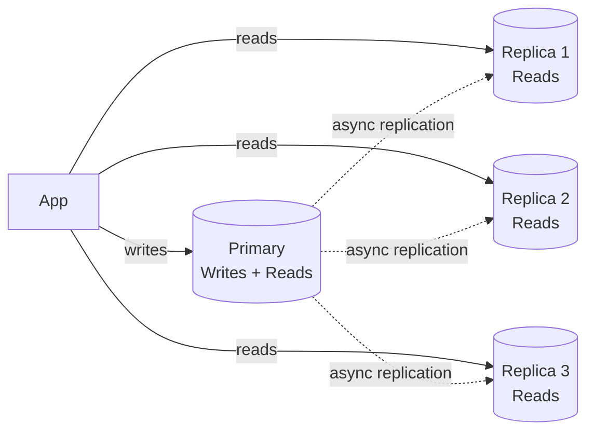
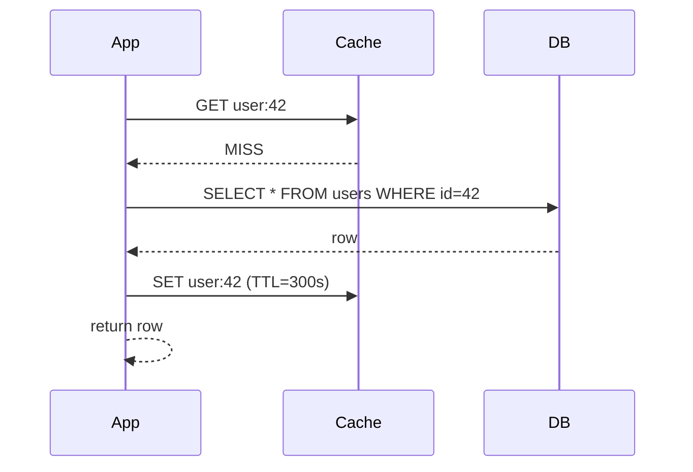
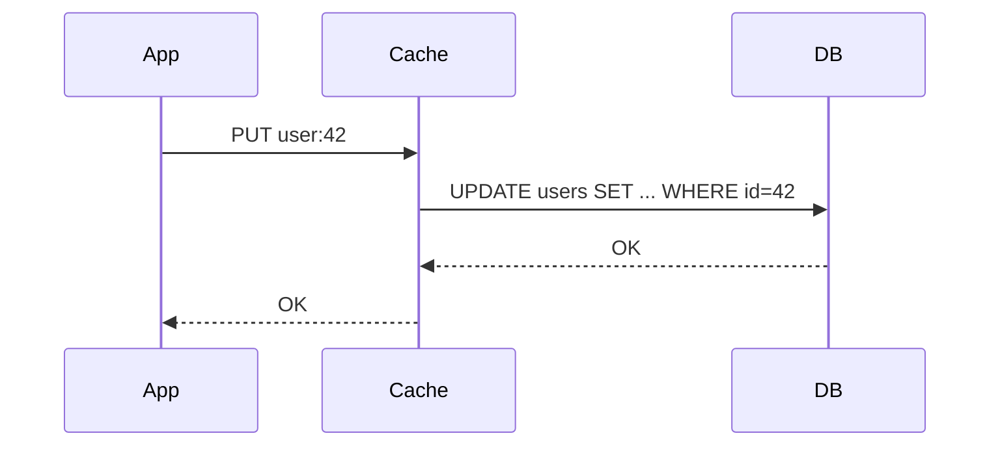
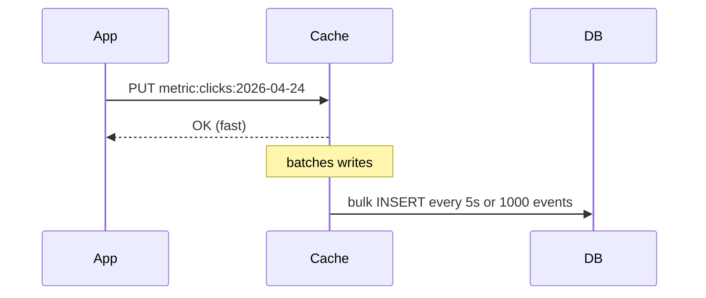
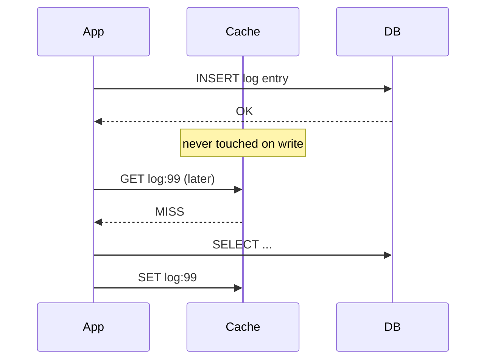
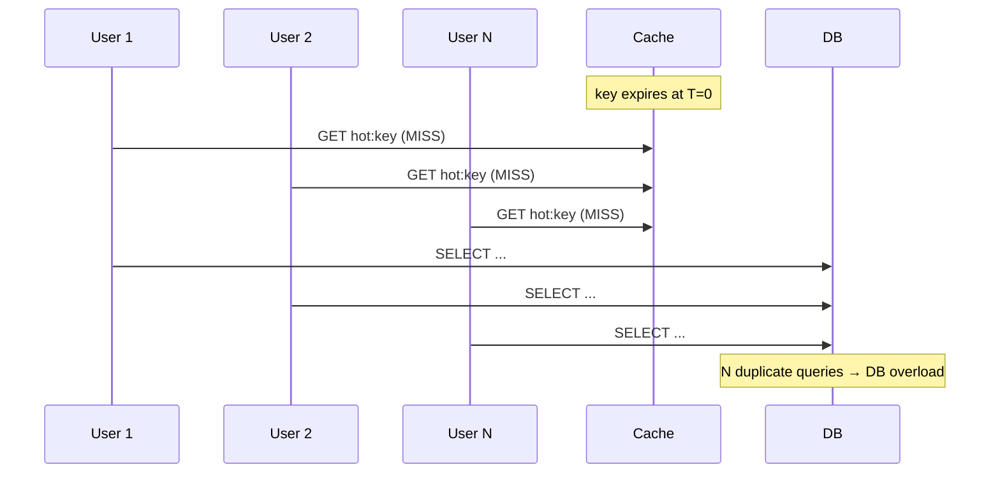
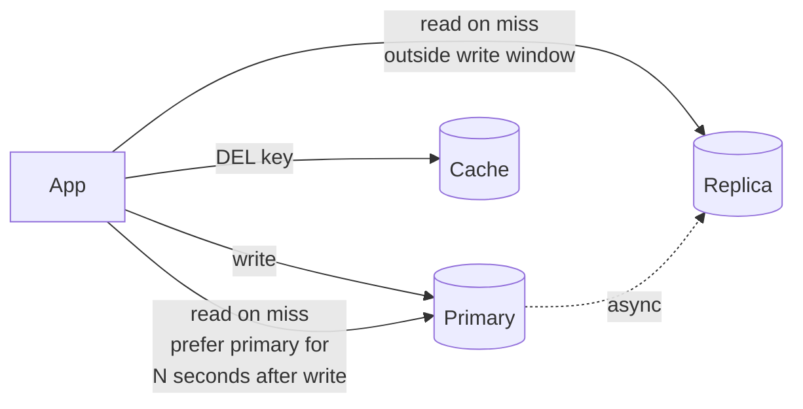

# Read/Write Splitting & Cache Strategies — Through, Back, Around, Aside

**Date:** 2026-04-24 | **Updated:** 2026-04-24
**Tags:** `system-design` `scalability` `caching` `read-replicas` `cache-invalidation`

## Table of Contents

- [Summary](#summary)
- [Read/Write Splitting 101](#readwrite-splitting-101)
  - [The Lag Trap — Read-Your-Writes Violation](#the-lag-trap--read-your-writes-violation)
  - [Routing by Operation vs by Session](#routing-by-operation-vs-by-session)
- [Routing Strategies](#routing-strategies)
  - [ORM-Level Routing](#orm-level-routing)
  - [Proxy-Level Routing](#proxy-level-routing)
  - [Application-Level Routing](#application-level-routing)
- [Cache Strategies — Full Coverage](#cache-strategies--full-coverage)
  - [Cache-Aside (Lazy Loading)](#cache-aside-lazy-loading)
  - [Read-Through](#read-through)
  - [Write-Through](#write-through)
  - [Write-Back (Write-Behind)](#write-back-write-behind)
  - [Write-Around](#write-around)
  - [Refresh-Ahead](#refresh-ahead)
  - [Strategy Comparison](#strategy-comparison)
- [Invalidation — The Hard Part](#invalidation--the-hard-part)
- [The Dual-Write Problem](#the-dual-write-problem)
- [Cache Stampede / Thundering Herd](#cache-stampede--thundering-herd)
- [Negative Caching](#negative-caching)
- [Hot Keys](#hot-keys)
- [Consistency Anti-Patterns](#consistency-anti-patterns)
- [Composing Read/Write Splitting with Caching](#composing-readwrite-splitting-with-caching)
- [Related](#related)
- [References](#references)

## Summary

Two independent ideas — **read/write splitting** (route reads to replicas, writes to the primary) and **caching** (put a faster store in front of the database) — are often deployed together because they solve the same pressure: too many reads hitting the primary. But they fail in different ways. Read/write splitting fails on **replication lag** (read-your-writes violations). Caching fails on **invalidation** (stale data, dual-write races, stampedes). This doc is the deep dive on the six canonical cache strategies (cache-aside, read-through, write-through, write-back, write-around, refresh-ahead), when each fits, and how they compose with read-replica routing without producing user-visible inconsistency.

See [`../building-blocks/caching-layers.md`](../building-blocks/caching-layers.md) for the hierarchy overview (CPU → browser → CDN → app → distributed → DB); this doc assumes you know where caches sit.

## Read/Write Splitting 101

The primary database is a bottleneck because every write must go to it, and in most workloads reads outnumber writes 10:1 to 100:1. **Read replicas** are secondary databases that stream changes from the primary (via WAL/binlog replication) and serve read queries.



Mechanics:

- **Writes** — `INSERT`, `UPDATE`, `DELETE`, DDL — go to the primary
- **Reads** — `SELECT` (and read-only transactions) — are distributed across replicas, typically by a load balancer or client-side routing
- **Replication** — async by default (MySQL, PostgreSQL streaming replication, Aurora); writes return once the primary has them, replicas catch up "soon"
- **Scale** — reads scale horizontally (add replicas); writes do not (a single primary). Sharding is the answer for write scale — see `sharding-strategies.md`.

### The Lag Trap — Read-Your-Writes Violation

Replicas are **eventually consistent** with the primary. Typical lag: low milliseconds on healthy systems, seconds under load, unbounded during incidents. This breaks the [read-your-writes](https://jepsen.io/consistency/models/read-your-writes) invariant:

```text
T=0ms   User POSTs new comment    → primary writes row ID 42
T=10ms  Response returns to UI
T=20ms  UI reloads comments list   → query hits replica
T=20ms  Replica hasn't replayed the write yet
        → comment is missing from the list
        → user thinks "did it not save?" and clicks Submit again
```

Mitigations, roughly in order of operational cost:

1. **Session stickiness to primary after a write** — for N seconds (or until replica catch-up is confirmed), route this session's reads to the primary
2. **Read-your-writes via the write result** — the POST response includes the created object; don't re-query at all
3. **Causal tokens / LSN passthrough** — client carries the log sequence number (LSN) of the last write; replica query blocks until it has replayed up to that LSN (PostgreSQL `pg_wait_for_wal_replay_lsn`, Aurora Global Database session consistency)
4. **Monotonic read consistency** — same user always hits the same replica (so they never "time travel backwards")

### Routing by Operation vs by Session

| Routing model | How it decides | Pros | Cons |
|---------------|---------------|------|------|
| **By SQL operation** | `SELECT` → replica, anything else → primary | Simple, stateless | Ignores read-your-writes; a `SELECT` inside a write transaction can go wrong |
| **By session / request** | After a write, "stick" this session to primary for N seconds | Fixes read-your-writes cheaply | Requires session state in the router |
| **By transaction** | An explicit read-only transaction → replica; otherwise primary | Correct, predictable | Requires the app to mark transactions as read-only |
| **By hint/annotation** | App code marks each call `@ReadOnly` / `@Primary` | Full control | Every call site must be correct |

Spring's `@Transactional(readOnly = true)` and Hibernate's `FlushMode.MANUAL` + routing data source is a well-trodden path. See `java/data-persistence/jpa-and-hibernate.md` for the Java angle.

## Routing Strategies

### ORM-Level Routing

The ORM (or data access layer) picks the connection based on transaction metadata.

```java
// Spring Boot: routing DataSource keyed by @Transactional(readOnly)
public class ReadWriteRoutingDataSource extends AbstractRoutingDataSource {
    @Override
    protected Object determineCurrentLookupKey() {
        return TransactionSynchronizationManager.isCurrentTransactionReadOnly()
            ? "REPLICA"
            : "PRIMARY";
    }
}

@Service
public class ProductService {
    @Transactional(readOnly = true)
    public Product findById(Long id) { /* → replica */ }

    @Transactional
    public Product create(ProductDto dto) { /* → primary */ }
}
```

```typescript
// Prisma: separate clients per role (Prisma has no built-in routing)
const primary = new PrismaClient({ datasources: { db: { url: PRIMARY_URL } } });
const replica = new PrismaClient({ datasources: { db: { url: REPLICA_URL } } });

export const db = {
  read: replica,
  write: primary,
};

// Sequelize has first-class replica config:
// new Sequelize({ replication: { read: [...], write: {...} } })
```

Pros: lives in code, visible in reviews. Cons: every service must opt in correctly; easy to leak writes into read-only paths or vice versa.

### Proxy-Level Routing

A connection-pooling proxy sits between the app and the DB cluster and inspects queries.

| Proxy | DB | Notes |
|-------|-----|------|
| **[ProxySQL](https://proxysql.com/)** | MySQL | Regex-based routing, connection multiplexing, query caching, query mirroring |
| **[PgBouncer](https://www.pgbouncer.org/)** + custom routing | PostgreSQL | Pooling only; routing needs an extra layer (HAProxy, Pgpool-II) |
| **[Pgpool-II](https://www.pgpool.net/)** | PostgreSQL | Statement-level routing, load balancing, streaming replication awareness |
| **[AWS RDS Proxy](https://docs.aws.amazon.com/AmazonRDS/latest/UserGuide/rds-proxy.html)** | MySQL/Postgres | Connection pooling at the managed-service edge, failover pinning |
| **[Vitess](https://vitess.io/)** | MySQL (sharded) | Routes by shard key, handles resharding; used at YouTube, Slack |

Pros: language-agnostic; changes to routing rules don't require redeploys. Cons: extra network hop; routing bugs happen far from your code; stickiness and transaction awareness are subtle.

### Application-Level Routing

The app itself picks the pool. This is common in microservices where each service owns its DB decisions.

```typescript
// Express middleware: sticky-primary after a mutation
app.post('/comments', async (req, res, next) => {
  const comment = await db.write.comment.create({ data: req.body });
  // Mark this session as "recently wrote" for 5s
  req.session.stickPrimaryUntil = Date.now() + 5_000;
  res.json(comment);
});

app.get('/comments', async (req, res) => {
  const useReplica = !req.session.stickPrimaryUntil
    || Date.now() > req.session.stickPrimaryUntil;
  const client = useReplica ? db.read : db.write;
  res.json(await client.comment.findMany());
});
```

## Cache Strategies — Full Coverage

Six canonical patterns, differing on (1) who reads, (2) who writes, (3) who invalidates. Mix them per call path — your user profile cache might be cache-aside while your feed cache is refresh-ahead.

### Cache-Aside (Lazy Loading)

The app orchestrates: check cache → on miss, read DB → populate cache → return.



```typescript
async function getUser(id: string): Promise<User | null> {
  const cached = await redis.get(`user:${id}`);
  if (cached) return JSON.parse(cached);

  const user = await db.user.findUnique({ where: { id } });
  if (user) {
    await redis.set(`user:${id}`, JSON.stringify(user), 'EX', 300);
  }
  return user;
}

async function updateUser(id: string, patch: Partial<User>): Promise<User> {
  const user = await db.user.update({ where: { id }, data: patch });
  await redis.del(`user:${id}`); // invalidate, do NOT set — avoids race with concurrent readers
  return user;
}
```

**When to use:** default choice for read-heavy OLTP; works with any cache and any DB.
**Failure mode:** stale data until TTL expires if a write path forgets to invalidate; thundering herd on popular misses (see stampede section).
**Example system:** most Redis-as-cache deployments; [AWS ElastiCache docs](https://docs.aws.amazon.com/AmazonElastiCache/latest/mem-ug/Strategies.html) treat this as the canonical pattern.

> **Invalidate, don't update.** `SET` after a write looks safe but races with a concurrent reader that already fetched the old row from DB and is about to `SET` it. `DEL` is idempotent and always safe.

### Read-Through

The cache itself knows how to load from the DB. App only talks to the cache.

```java
// Caffeine LoadingCache — read-through in-process
LoadingCache<Long, Product> cache = Caffeine.newBuilder()
    .maximumSize(10_000)
    .expireAfterWrite(Duration.ofMinutes(5))
    .build(id -> productRepository.findById(id).orElse(null));

Product p = cache.get(42L); // miss → loader runs → caches result
```

**When to use:** in-process caches with a natural loader (Caffeine, Guava); distributed caches that support a loader SPI (EhCache, Hazelcast).
**Failure mode:** loader is coupled to cache; invalidation is still the app's problem; less flexible than cache-aside for multi-source reads.
**Example system:** [Caffeine](https://github.com/ben-manes/caffeine) `LoadingCache`, Hibernate second-level cache regions.

### Write-Through

Write goes to the cache, which synchronously forwards to the DB. Both are updated before returning.



```java
// Pseudocode — write-through wrapper
void updateUser(User u) {
    db.update(u);                 // persist
    cache.put("user:" + u.id, u); // refresh cache in same call
}
```

**When to use:** when the cache must never be out of sync (e.g. session stores, shopping carts); when reads immediately after a write are the common case.
**Failure mode:** every write pays both latencies (cache + DB); if DB commits but cache write fails, you have the opposite staleness — "cache missing what DB has", fixed on next read.
**Example system:** Hazelcast MapStore with write-through; application sessions in Redis mirrored to a persistent store.

### Write-Back (Write-Behind)

App writes to cache only. Cache acknowledges immediately, flushes to DB asynchronously (batched).



**When to use:** write-heavy workloads where durability lag is tolerable — metrics, counters, event ingestion, write amplification smoothing.
**Failure mode:** **data loss on cache crash** before flush; DB may lag cache by seconds to minutes; read-your-writes only holds against the cache, not the DB.
**Example system:** [Netflix EVCache](https://netflixtechblog.com/caching-for-a-global-netflix-1f847462a75f) for certain hot counters; Facebook TAO's write path uses asynchronous propagation to followers.

### Write-Around

Writes bypass the cache entirely and go straight to the DB. Cache only fills on reads (cache-aside-style).



**When to use:** write-heavy, read-rare data — log entries, audit trails, telemetry; avoids polluting cache with data that may never be read again.
**Failure mode:** first read after write is always a miss (by design).
**Example system:** any OLTP log table fronted by a cache used only for hot aggregates.

### Refresh-Ahead

Cache proactively reloads entries **before** they expire, typically on access when the entry is within a refresh window.

```java
// Caffeine refreshAfterWrite — the canonical refresh-ahead primitive
LoadingCache<Long, Product> cache = Caffeine.newBuilder()
    .maximumSize(10_000)
    .refreshAfterWrite(Duration.ofMinutes(1))   // trigger refresh after 1min
    .expireAfterWrite(Duration.ofMinutes(5))    // hard expiry at 5min
    .build(id -> productRepository.findById(id).orElse(null));
// On access between 1min and 5min, Caffeine returns the stale value immediately
// and asynchronously reloads. Readers never wait for the refresh.
```

**When to use:** predictably hot keys with known TTLs where you'd rather eat a few refreshes than let users hit a miss storm on expiry.
**Failure mode:** wastes work on entries that would not have been read again; can amplify load on DB if refresh window overlaps for many keys (use jitter).
**Example system:** [Caffeine `refreshAfterWrite`](https://github.com/ben-manes/caffeine/wiki/Refresh); Guava `CacheBuilder.refreshAfterWrite`; CDN edge refresh.

### Strategy Comparison

| Strategy | Read path | Write path | Consistency | Best for |
|----------|-----------|-----------|-------------|----------|
| Cache-aside | App checks cache, falls through to DB | App writes DB, invalidates cache | Eventual, app-controlled | General-purpose OLTP reads |
| Read-through | App talks to cache; cache loads on miss | (Paired with write-through or aside) | Eventual | Loader abstractions, in-process caches |
| Write-through | From cache after load | App/cache writes both sync | Strong cache↔DB (on cache hit) | Session stores, hot state |
| Write-back | From cache | App writes cache; async flush to DB | Weak; cache ahead of DB | Metrics, counters, ingestion |
| Write-around | Cache-aside on read | App writes DB only; cache untouched | Eventual | Write-heavy, read-rare |
| Refresh-ahead | From cache | (Any) | Eventual, smoother | Predictably hot keys |

## Invalidation — The Hard Part

> *"There are only two hard things in Computer Science: cache invalidation and naming things."* — **Phil Karlton**, quoted in [Martin Fowler's TwoHardThings](https://martinfowler.com/bliki/TwoHardThings.html)

The aphorism is stuck in everyone's head for a reason. Invalidation approaches:

| Approach | How | When it fits |
|----------|-----|-------------|
| **TTL only** | Every entry has a time-to-live; stale data tolerated until expiry | Data that changes rarely or where small staleness is fine (catalogs, config) |
| **Event-driven** | Writes fire invalidation messages (Kafka, Redis pub/sub, CDC) | Multi-service systems where several consumers care |
| **Write-path invalidation** | The write handler `DEL`s the cache key | Cache-aside in a monolith |
| **Version / generation tag** | Key includes a version (`user:42:v17`); bump version on write | When listing + item caches share state |
| **TTL + event** (recommended) | Fast path on events, TTL as backstop for missed events | Production systems where event delivery is best-effort |

**TTL jitter** — randomize TTL by ±10–20% so you don't get synchronized expirations across keys populated in the same deploy/warmup.

```typescript
const baseTtl = 300; // 5 minutes
const jitter = Math.floor(Math.random() * 60); // ±60s
await redis.set(key, value, 'EX', baseTtl + jitter);
```

## The Dual-Write Problem

Any code path that writes to two systems (DB + cache, DB + message queue, DB + search index) has a consistency hazard: what if the second write fails or the process crashes between them?

```typescript
// BROKEN: if the process dies between lines 1 and 2, cache is stale forever
await db.product.update({ where: { id }, data: patch });
await redis.del(`product:${id}`); // ← may never run
```

Mitigations, in increasing order of robustness:

1. **Short TTL backstop** — so the inconsistency window is bounded
2. **Retry with dead-letter** — push the invalidation onto a reliable queue
3. **Transactional Outbox** — write the DB row and the "invalidate" event in the same DB transaction; a relay publishes to the queue. See `../../java/spring-boot/outbox-pattern.md` *(planned Tier 4)*
4. **Change Data Capture (CDC)** — Debezium / Postgres logical replication / MongoDB change streams tail the DB's commit log and emit events; the cache invalidator subscribes. No dual write at all. See `../../database/polyglot/cdc.md` *(planned Tier 5)*

Facebook's TAO paper (below) is an entire system designed around never letting the cache and DB diverge on the write path.

## Cache Stampede / Thundering Herd

A popular key expires. The next request finds a miss and goes to the DB. So does the next. And the next. Thousands of concurrent requests hammer the DB for the same key.



Mitigations:

- **Request coalescing / single-flight** — in-process dedup: first miss acquires a future; concurrent callers for the same key await it. Go has [`singleflight`](https://pkg.go.dev/golang.org/x/sync/singleflight); Node has [`p-memoize`](https://github.com/sindresorhus/p-memoize); Caffeine does this natively.
- **Mutex / distributed lock** — only one worker may refill; others read-stale or wait. Redis `SET NX PX` or Redlock.
- **Stale-while-revalidate (SWR)** — serve the stale value, kick off an async refresh. HTTP's `Cache-Control: stale-while-revalidate`, SWR on the browser ([Vercel SWR](https://swr.vercel.app/)), refresh-ahead at the server.
- **Probabilistic early expiration (XFetch)** — each read has a small probability of "deciding" the key has expired a moment early, so one lucky reader rebuilds while the rest hit cache. See [Redis Labs on cache stampede](https://redis.com/blog/three-ways-to-maintain-cache-consistency/) and [A. Vattani et al., "Optimal Probabilistic Cache Stampede Prevention" (VLDB 2015)](https://cseweb.ucsd.edu/~avattani/papers/cache_stampede.pdf).

```typescript
// XFetch — probabilistic early expiration
async function xFetch<T>(
  key: string,
  ttl: number,
  beta: number,
  load: () => Promise<T>,
): Promise<T> {
  const entry = await redis.get(key);
  if (entry) {
    const { value, delta, expireAt } = JSON.parse(entry);
    const now = Date.now() / 1000;
    // Probabilistically refresh a bit early
    if (now - delta * beta * Math.log(Math.random()) >= expireAt) {
      const fresh = await load();
      const newDelta = (Date.now() / 1000) - now;
      await redis.set(key, JSON.stringify({
        value: fresh, delta: newDelta, expireAt: now + ttl,
      }), 'EX', ttl);
      return fresh;
    }
    return value;
  }
  // Full miss
  const fresh = await load();
  await redis.set(key, JSON.stringify({
    value: fresh, delta: 0, expireAt: (Date.now() / 1000) + ttl,
  }), 'EX', ttl);
  return fresh;
}
```

```java
// Mutex-based single-flight with Redis
public <T> T getOrLoad(String key, Duration ttl, Supplier<T> loader) {
    T cached = cache.get(key);
    if (cached != null) return cached;

    String lockKey = "lock:" + key;
    // SET NX with short TTL — only one caller refills
    if (redis.setIfAbsent(lockKey, "1", Duration.ofSeconds(5))) {
        try {
            T fresh = loader.get();
            cache.put(key, fresh, ttl);
            return fresh;
        } finally {
            redis.delete(lockKey);
        }
    }
    // Another caller is loading — briefly wait then retry cache
    Thread.sleep(50);
    return getOrLoad(key, ttl, loader);
}
```

## Negative Caching

Caching "not found" results so repeated requests for nonexistent or unauthorized keys don't hammer the DB.

```typescript
async function getUserOrNull(id: string): Promise<User | null> {
  const cached = await redis.get(`user:${id}`);
  if (cached === 'NULL') return null;           // negative hit
  if (cached) return JSON.parse(cached);

  const user = await db.user.findUnique({ where: { id } });
  if (user) {
    await redis.set(`user:${id}`, JSON.stringify(user), 'EX', 300);
  } else {
    await redis.set(`user:${id}`, 'NULL', 'EX', 30); // shorter TTL for negatives
  }
  return user;
}
```

Pitfalls:

- **Use a shorter TTL** for negatives — a record may be created moments later, and users will be stuck with "not found"
- **Invalidate on creation** — the insert path must also `DEL` the negative entry
- **Scan-attack protection** — negative caching + rate limiting is the cheap defense against attackers iterating sequential IDs

## Hot Keys

A small number of keys receive a wildly disproportionate share of traffic — a celebrity user's profile, a trending product, the homepage feed. Even the fastest Redis hits a single-node CPU ceiling.

**Detection:**
- Redis `MONITOR` (development only, expensive)
- [Redis `--hotkeys`](https://redis.io/docs/latest/commands/cluster-countkeysinslot/) (LFU sampling)
- Application-side sampling + count-min sketch
- Per-key hit counters exported to metrics (watch for keys with >10× p99)

**Mitigations:**

| Technique | How | Cost |
|-----------|-----|------|
| **Local (in-process) cache with short TTL** | Caffeine in front of Redis; per-pod copy | Staleness up to local TTL |
| **Key splitting / sharding** | `counter:likes:post42` → `counter:likes:post42:{0..15}`, sum on read | Read fan-out |
| **Replicas / read-only copies** | Redis replica reads, client-side read balancing | Replication lag |
| **Edge caching / CDN** | Cache the rendered response at the CDN | Coarser invalidation |

## Consistency Anti-Patterns

These look innocent and produce production incidents.

1. **Read-your-writes via a replica immediately after write** — covered above; replication lag bites. Stick to primary for a short window or use an LSN token.
2. **Caching auth state without invalidation on role change** — you revoke a user's admin role; their session token is still cached as "admin" for 15 minutes. Auth/authorization cache TTLs should be short (seconds) and revocation events should invalidate explicitly.
3. **Cache with no size cap / no eviction policy** — memory growth until OOM. Always set `maxmemory` + `maxmemory-policy` (Redis: `allkeys-lru` or `allkeys-lfu`).
4. **Setting cache after DB read, not after write** — race: reader A reads old DB value, writer commits new value + invalidates cache, reader A then `SET`s old value. Prefer `DEL` on write; if you must `SET`, gate it with a version check.
5. **Same TTL everywhere** — synchronized expirations; see TTL jitter.
6. **Caching mutable lists by a single key** — `top_products` as one blob means any product change invalidates the whole list. Cache by ID and compose, or version the list.
7. **Trusting the cache for correctness-critical flows** — inventory decrements, payment authorization, quota enforcement. The DB (with a row lock or atomic counter) is the source of truth; cache is for display only.

## Composing Read/Write Splitting with Caching

The two interact. A naive combination is wrong:

```text
1. User POSTs a new order    → primary DB
2. App invalidates cache     → cache DEL
3. User GETs order list      → cache MISS
4. App queries REPLICA       → replica hasn't replayed yet
5. App fills cache with STALE data
6. Everyone for the next TTL sees stale data
```

Fixes:

- **After a write, read-fill from the primary** — route the post-write fill through the primary, not the replica
- **Do not refill on write** — just `DEL`; let the next real read (by which time the replica has caught up) refill
- **Use LSN/causality tokens** — the refill query waits for the replica to catch up



## Related

- [`../building-blocks/caching-layers.md`](../building-blocks/caching-layers.md) — the cache hierarchy overview (browser, CDN, app, distributed, DB); read this first for where caches sit
- [`replication-patterns.md`](replication-patterns.md) *(planned)* — sync vs async replication, multi-leader, leaderless, consistency models
- [`sharding-strategies.md`](sharding-strategies.md) *(planned)* — horizontal partitioning when even replicas can't save you on the write side
- [`../../database/polyglot/cdc.md`](../../database/polyglot/cdc.md) *(planned Tier 5)* — change data capture for invalidation without dual writes
- [`../../java/spring-boot/caching.md`](../../java/spring-boot/caching.md) — Spring Cache abstraction, Caffeine, Redis integration
- [`../../typescript/production/caching-in-node.md`](../../typescript/production/caching-in-node.md) — Redis clients, in-process LRU, SWR patterns

## References

- [AWS ElastiCache — Caching Strategies](https://docs.aws.amazon.com/AmazonElastiCache/latest/mem-ug/Strategies.html) — lazy loading, write-through, TTL, and when to pick each, with Memcached/Redis framing
- [Martin Fowler — TwoHardThings](https://martinfowler.com/bliki/TwoHardThings.html) — the origin and context of Phil Karlton's "cache invalidation and naming things" quote
- [Redis — Three Ways to Maintain Cache Consistency](https://redis.com/blog/three-ways-to-maintain-cache-consistency/) — cache-aside vs write-through vs write-behind, plus stampede mitigation
- [A. Vattani, F. Chierichetti, K. Lowenstein — "Optimal Probabilistic Cache Stampede Prevention" (VLDB 2015)](https://cseweb.ucsd.edu/~avattani/papers/cache_stampede.pdf) — the XFetch algorithm paper
- [Netflix Tech Blog — Caching for a Global Netflix (EVCache)](https://netflixtechblog.com/caching-for-a-global-netflix-1f847462a75f) — cross-region cache replication, write propagation, hot-key strategies at Netflix scale
- [Bronson et al. — "TAO: Facebook's Distributed Data Store for the Social Graph" (USENIX ATC 2013)](https://www.usenix.org/system/files/conference/atc13/atc13-bronson.pdf) — how Facebook's graph cache maintains consistency with the underlying MySQL layer
- [Caffeine Wiki — Refresh](https://github.com/ben-manes/caffeine/wiki/Refresh) — `refreshAfterWrite` semantics, the reference for refresh-ahead in Java
- [Guava — CachesExplained](https://github.com/google/guava/wiki/CachesExplained) — refreshAfterWrite vs expireAfterWrite, load semantics, asyncReloading
- [AWS — Amazon RDS Proxy](https://docs.aws.amazon.com/AmazonRDS/latest/UserGuide/rds-proxy.html) — managed connection pooling and failover for MySQL/PostgreSQL read/write topologies
