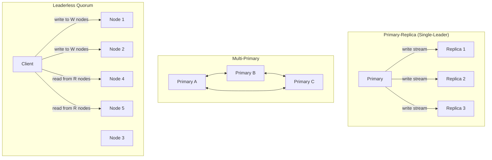

# Replication Patterns — Primary-Replica, Multi-Primary, and Quorum

**Date:** 2026-04-24 | **Updated:** 2026-04-24
**Tags:** `system-design` `scalability` `replication` `high-availability` `failover`

## Table of Contents

- [Summary](#summary)
- [Why Replicate](#why-replicate)
- [Replication Topologies](#replication-topologies)
  - [Primary-Replica (Single-Leader)](#primary-replica-single-leader)
  - [Multi-Primary (Multi-Leader)](#multi-primary-multi-leader)
  - [Leaderless / Quorum-Based (Dynamo-Style)](#leaderless--quorum-based-dynamo-style)
- [Replication Mechanisms](#replication-mechanisms)
- [Synchronous, Semi-Synchronous, and Asynchronous](#synchronous-semi-synchronous-and-asynchronous)
- [Replication Lag](#replication-lag)
- [Failover](#failover)
- [Split-Brain and Fencing Tokens](#split-brain-and-fencing-tokens)
- [Multi-Primary Conflict Resolution](#multi-primary-conflict-resolution)
- [Quorum Math Preview](#quorum-math-preview)
- [Geo-Replication Trade-offs](#geo-replication-trade-offs)
- [Real-World Setups](#real-world-setups)
- [Failure Modes](#failure-modes)
- [Anti-Patterns](#anti-patterns)
- [Related](#related)
- [References](#references)

## Summary

Replication is the practice of keeping copies of the same data on multiple machines. It is how distributed systems get high availability, read scale, geographic locality, and durability against node loss. There are three broad topologies: **primary-replica** (one writer, many readers), **multi-primary** (multiple writers, conflict resolution required), and **leaderless quorum** (Dynamo-style — anyone writes, anyone reads, with NWR math). Each choice is a trade-off between write latency, consistency, failure behavior, and operational complexity. This Tier 3 document gives you the mental model and the trade-offs; Tier 4 goes deeper on quorum math and consensus algorithms (Raft, Paxos).

## Why Replicate

Replication solves four related-but-distinct problems. Confusing them is a common source of bad architecture.

| Goal | What it means | What replication buys |
|------|---------------|-----------------------|
| **High availability (HA)** | Service survives machine, disk, or AZ failure | A replica can take over when the primary fails |
| **Read scaling** | More read traffic than a single node can serve | Route reads to N replicas, partition the load |
| **Geo-locality** | Users in Singapore should not round-trip to us-east-1 | Place replicas near readers; serve local reads |
| **Durability** | No single disk failure loses committed data | Writes are persisted on ≥2 machines before acknowledged |

Things replication does _not_ automatically give you:

- **Backups**: a replica that faithfully copies `DROP TABLE users` is not a backup. You still need point-in-time recovery (PITR) via WAL archives or snapshots.
- **Horizontal write scale**: single-leader replication scales reads, not writes. For write scale you need [sharding](./sharding-strategies.md).
- **Zero data loss**: asynchronous replication can lose the last few transactions on failover.

> A good rule: before you pick a replication pattern, state which of HA, read scale, locality, and durability you are optimizing for. If you can't name the primary goal, you'll pick the wrong topology.

## Replication Topologies



### Primary-Replica (Single-Leader)

The default for most OLTP systems. One node is designated **primary** (or leader); all writes go through it. Other nodes are **replicas** (or followers) that receive the write stream and apply it.

Characteristics:

- **One writer**, N readers — the primary is the serialization point for writes
- **Linearizable writes** are easy: the primary orders everything
- **Reads from replicas** are eventually consistent (unless you use synchronous replication and read-your-writes routing)
- **Failover** requires promoting a replica to primary, which is where the interesting failure modes live

When to reach for it:

- You need strong consistency for writes (most transactional apps)
- Read traffic is much higher than write traffic (typical web apps — 10:1 read:write or more)
- You are operating within one region or can tolerate async cross-region replicas

Operational cost: moderate. Modern databases (Postgres, MySQL, MongoDB replica sets) have mature tooling.

### Multi-Primary (Multi-Leader)

Multiple nodes accept writes. Each primary replicates its writes to the others. The famous example is active-active geo-deployment: one primary in us-east, one in eu-west, each serving its local region.

Characteristics:

- **Low write latency** — users write to their nearest primary
- **Region-survivable** — each region keeps working if the link drops
- **Conflicts are inevitable** — two regions can write the same row concurrently; you must define a resolution strategy
- **Causality is hard** — "happens-before" across regions without a shared clock requires vector clocks or HLCs

When to reach for it:

- True multi-region writes are a product requirement (not just a wish)
- You accept eventual consistency and have thought through conflict semantics
- The schema is amenable to conflict-free merges (CRDTs, append-only logs, per-region partitions)

Operational cost: high. Conflict handling is a cross-cutting concern that bleeds into application code. Most teams that think they need multi-primary actually need primary-replica with read replicas in other regions.

### Leaderless / Quorum-Based (Dynamo-Style)

Popularized by Amazon's Dynamo paper (2007) and implemented in [DynamoDB](https://docs.aws.amazon.com/amazondynamodb/latest/developerguide/Introduction.html), [Cassandra](https://cassandra.apache.org/), [Riak](https://docs.riak.com/), and [ScyllaDB](https://www.scylladb.com/). There is no designated leader. A client writes to W nodes and reads from R nodes; if W + R > N (where N is the replication factor), you get quorum overlap.

Characteristics:

- **No failover** in the traditional sense — any node going down just means fewer acks, which you tune against
- **Tunable consistency** per operation (read-one vs read-quorum vs read-all)
- **Anti-entropy mechanisms** — read repair, hinted handoff, Merkle tree sync — reconcile divergent replicas
- **Sloppy quorums** relax the "must be the right N nodes" rule during partitions in exchange for availability

When to reach for it:

- Workload is write-heavy and partitioned by key (time-series, event logs, session stores)
- You want operational simplicity of "nodes are interchangeable"
- Application tolerates eventual consistency per-key and can handle conflict resolution (usually LWW)

Operational cost: moderate once you've internalized NWR. Debugging consistency anomalies ("why is this read stale?") is the main pain point.

## Replication Mechanisms

How does data actually travel from primary to replica? There are four common mechanisms, each with different trade-offs.

| Mechanism | How it works | Pros | Cons |
|-----------|--------------|------|------|
| **Statement-based** | Ship the SQL statement to the replica, replay it | Compact, human-readable | Nondeterministic functions (`NOW()`, `RAND()`) diverge; triggers must match; autoincrement races |
| **Row-based** (MySQL binlog `ROW`) | Ship the before/after row images | Deterministic, handles triggers | Larger payload; schema must match byte-for-byte |
| **Logical decoding** (Postgres) | Decode WAL into logical change stream (INSERTs/UPDATEs/DELETEs) | Cross-version replication; selective; pluggable via [`pgoutput`](https://www.postgresql.org/docs/current/logical-replication.html) | Extra CPU on primary; DDL not automatically replicated |
| **Physical / WAL streaming** (Postgres streaming replication) | Byte-for-byte WAL shipping | Lowest overhead, exact binary copy | Identical major version required; all-or-nothing (no filtering) |

Most production Postgres setups use **streaming (physical) replication** for HA replicas within a region and **logical replication** for cross-version upgrades, ETL, and selective subscription. See [Postgres streaming replication](https://www.postgresql.org/docs/current/warm-standby.html#STREAMING-REPLICATION) for details.

MySQL uses a [binary log](https://dev.mysql.com/doc/refman/8.0/en/binary-log.html) (binlog) with three formats: `STATEMENT`, `ROW`, and `MIXED`. `ROW` is the modern default for correctness.

MongoDB's replica set uses an **oplog** — a capped collection of idempotent operations that followers tail and replay. See [MongoDB replication](https://www.mongodb.com/docs/manual/replication/).

## Synchronous, Semi-Synchronous, and Asynchronous

The replication mode determines what "the write succeeded" means in terms of durability and latency.

| Mode | Write path | Durability | Latency | On primary loss |
|------|-----------|------------|---------|-----------------|
| **Asynchronous** | Primary acks client, replicates in background | Best-effort | Lowest (1 disk fsync) | Recent writes may be lost |
| **Semi-synchronous** | Primary acks client only after ≥1 replica acknowledges receipt | Strong if ≥1 replica survives | Moderate | Recent writes preserved on ≥1 replica |
| **Synchronous** | Primary acks client only after all (or a quorum) of replicas commit | Strongest | Highest; one slow replica blocks every write | Any surviving quorum member has the data |

Postgres supports [`synchronous_commit`](https://www.postgresql.org/docs/current/runtime-config-wal.html#GUC-SYNCHRONOUS-COMMIT) with options `on`, `remote_write`, `remote_apply`, `off`. MySQL has [semi-sync replication](https://dev.mysql.com/doc/refman/8.0/en/replication-semisync.html). Aurora replaces all of this with a shared storage layer and 4-of-6 quorum writes at the page level.

Trade-off heuristic:

- **High-throughput OLTP, can tolerate small data loss on failover** → async
- **Financial, regulatory, or auditable systems** → semi-sync or sync with ≥1 remote ack
- **Multi-region strong consistency** → synchronous quorum (Spanner, CockroachDB) or accept cross-region latency

## Replication Lag

With async or semi-sync replication, replicas are always somewhat behind the primary. This is **replication lag**, measured in either time (seconds behind) or position (bytes/log positions behind).

Causes:

- **Write spike on primary** — followers can't apply as fast as primary generates
- **Long transactions on replica** — a slow query or a blocked cursor holds back apply
- **Single-threaded apply** — many databases (historically) apply the write stream serially
- **Network hiccup** — WAN link jitter, packet loss, retransmits
- **Replica under-provisioned** — smaller CPU/disk than primary can't keep up

How to measure:

```sql
-- Postgres: lag in bytes and time on primary
SELECT
    client_addr,
    pg_wal_lsn_diff(pg_current_wal_lsn(), sent_lsn)   AS sent_lag_bytes,
    pg_wal_lsn_diff(pg_current_wal_lsn(), replay_lsn) AS replay_lag_bytes,
    replay_lag
FROM pg_stat_replication;

-- Postgres: lag in time on replica
SELECT now() - pg_last_xact_replay_timestamp() AS replication_lag;
```

```sql
-- MySQL
SHOW REPLICA STATUS\G
-- look at Seconds_Behind_Source
```

Lag matters for **read-your-writes consistency**. If a user POSTs a comment and is immediately redirected to a page that reads from a replica, they may not see their own comment. Mitigations:

1. **Route post-write reads to primary for a window** (e.g. 5 seconds) via session affinity
2. **Wait for LSN**: after a write, capture the primary LSN; on subsequent read, wait until the replica has applied that LSN
3. **Use sync replication** for the specific user's writes (niche)
4. **Design the UX** to not depend on read-your-writes (optimistic local render)

Monitor lag with Prometheus exporters: [`postgres_exporter`](https://github.com/prometheus-community/postgres_exporter), [`mysqld_exporter`](https://github.com/prometheus/mysqld_exporter). Page on sustained lag > SLO threshold.

## Failover

When the primary dies, something has to promote a replica to take over. The question is **who decides** and **how carefully**.

| Approach | How it works | Pros | Cons |
|----------|--------------|------|------|
| **Manual** | Operator runs promotion command | Safe, deliberate | Slow; requires 24/7 on-call |
| **Automatic (orchestrator)** | External service watches health, promotes on failure | Fast recovery | Risk of false positives, split-brain |
| **Cloud-managed** | RDS, Aurora, Cloud SQL handle it for you | Least operational burden | Opaque behavior; trust the vendor |

### Orchestrators

- **[Patroni](https://patroni.readthedocs.io/)** — Python-based Postgres HA using etcd/Consul/ZooKeeper as the consensus store for leader election. De-facto standard for self-hosted Postgres HA.
- **[Orchestrator](https://github.com/openark/orchestrator)** — MySQL topology manager, originally from GitHub. Visualizes and heals replication topologies.
- **[MHA (Master High Availability)](https://github.com/yoshinorim/mha4mysql-manager)** — older MySQL failover tool; largely superseded by Orchestrator and cloud solutions.
- **[RDS / Aurora / Cloud SQL / AlloyDB]()** — managed services handle failover internally, typically 30–120 seconds.

### Example: Patroni DCS-driven failover

```yaml
# patroni.yml — minimal HA topology
scope: prod-cluster
name: pg-node-1

restapi:
  listen: 0.0.0.0:8008
  connect_address: 10.0.1.10:8008

etcd3:
  hosts: 10.0.1.20:2379,10.0.1.21:2379,10.0.1.22:2379

bootstrap:
  dcs:
    ttl: 30
    loop_wait: 10
    retry_timeout: 10
    maximum_lag_on_failover: 1048576   # bytes; reject promotion if too far behind
    synchronous_mode: true              # ≥1 sync replica required
    postgresql:
      use_pg_rewind: true
      parameters:
        wal_level: replica
        max_wal_senders: 10
        max_replication_slots: 10
        synchronous_commit: remote_apply

postgresql:
  listen: 0.0.0.0:5432
  connect_address: 10.0.1.10:5432
  data_dir: /var/lib/postgresql/data
  authentication:
    replication:
      username: replicator
      password: "${REPLICATOR_PASSWORD}"  # from env
    superuser:
      username: postgres
      password: "${SUPERUSER_PASSWORD}"
```

The DCS (distributed configuration store — etcd in this case) holds the leader key with a TTL. The primary renews the lease; if it fails to renew (process crashed, network cut, node dead), a qualifying replica takes the lease and promotes. `maximum_lag_on_failover` is the guardrail against promoting a replica that's too far behind.

### The dangers

Automatic failover makes two dangerous assumptions:

1. **"The primary is dead"** — often it's just unreachable from the orchestrator. The primary is still accepting writes on another network path. Congratulations, you now have two primaries.
2. **"The new primary is caught up"** — with async replication, the promoted replica may be seconds behind. Those seconds of writes are gone. Applications must handle this (idempotent writes, retries, reconciliation).

The mitigations are **fencing** (next section) and **write quorums at the app or proxy layer** (only accept writes if you're still in the DCS majority).

## Split-Brain and Fencing Tokens

**Split-brain** is the classic failure mode: two nodes both believe they are primary, both accept writes, and the data diverges. You cannot merge a split-brain Postgres database deterministically — somebody's writes will be thrown away.

Causes:

- Network partition that isolates the old primary from the orchestrator but leaves it reachable to clients
- Clock skew causing a stale leader to believe its lease is still valid
- Orchestrator bugs or misconfiguration

Defenses:

### STONITH — Shoot The Other Node In The Head

When promoting a new primary, forcibly kill the old one so it cannot possibly accept writes. Techniques:

- **Power fencing**: IPMI / iDRAC / iLO to cut power to the old node
- **Network fencing**: flip a switch port or security-group rule to isolate the old node
- **Storage fencing**: revoke the old node's access to the shared volume (SAN LUN masking, cloud EBS detach)

### Fencing Tokens

Used by the Raft/Zab/Paxos world. Each leader election produces a monotonically increasing **epoch** or **term** number. Every write carries this token. Storage or downstream consumers reject writes whose token is less than the latest one they've seen.

```text
Primary A (epoch=7) ────► writes tagged (epoch=7, lsn=1234)
                                │
                        network partition
                                │
Primary A (epoch=7, stale) ──► writes tagged (epoch=7, lsn=1235)  ◄── REJECTED
Primary B (epoch=8, new)   ──► writes tagged (epoch=8, lsn=1230)  ◄── ACCEPTED
```

Even if the old primary keeps writing, its writes are stamped with the stale epoch and refused. See Martin Kleppmann's [How to do distributed locking](https://martin.kleppmann.com/2016/02/08/how-to-do-distributed-locking.html) for the canonical explainer.

### Why "just pick one" is harder than it sounds

Suppose orchestrator loses contact with the primary. Options:

- **Promote a replica immediately** → fast recovery, but risk split-brain if primary is alive
- **Wait** → if primary is truly dead, you're down for the duration of the wait
- **Require a quorum of observers to confirm death** → safer, needs 3+ observers, assumes the observers agree

This is exactly the problem Raft and Paxos solve: agreement on "who is leader" under partial failure. Tier 4 goes deeper.

## Multi-Primary Conflict Resolution

When two primaries accept concurrent writes to the same key, you have a conflict. "Concurrent" here means **neither write saw the other** — the causal DAG has a fork. Strategies:

### Last-Writer-Wins (LWW)

Each write gets a timestamp; the one with the latest timestamp wins. Simple, but:

- **Wall-clock LWW** is dangerous: clock skew between nodes means you can silently drop writes. NTP drift of 100ms can mean every write from a fast-clocked node wins.
- **Hybrid Logical Clocks (HLC)** combine wall clock + logical counter, giving causally consistent timestamps with bounded skew. Used by [CockroachDB](https://www.cockroachlabs.com/docs/stable/architecture/transaction-layer.html) and [MongoDB cluster time](https://www.mongodb.com/docs/manual/core/read-isolation-consistency-recency/#cluster-time-and-causal-consistency).

### Vector Clocks

Each node maintains a per-node counter, and every write carries the vector of counters it saw. You can then detect whether `A` happens-before `B`, `B` happens-before `A`, or they are concurrent. Concurrent writes surface as **siblings** that the application must merge.

Used by Riak, Dynamo (original). Powerful but puts the merge burden on the application.

### CRDTs (Conflict-Free Replicated Data Types)

Data types whose merge operation is commutative, associative, and idempotent — so concurrent updates always converge without a coordinator. Examples:

- **G-Counter** (grow-only counter): merge = element-wise max
- **OR-Set** (observed-remove set): add and remove with unique tags
- **LWW-Register** with HLC
- **Sequence CRDTs** (Yjs, Automerge) for collaborative text

Great fit for: collaborative editors (Figma, Notion), shopping carts, counters, presence, offline-first mobile. Real-world reading: [Automerge](https://automerge.org/), [Yjs](https://docs.yjs.dev/).

### Application-Level Merge

When nothing above fits, surface conflicts to the application. Git is the archetype — concurrent commits become a merge with human resolution. Common pattern: store conflicting versions as an array, let business logic (or a user) pick.

### Avoid conflicts by design

The best conflict resolution is no conflict:

- **Partition by user / tenant** — each user's data has one logical primary; no cross-user concurrent writes on the same key
- **Append-only logs** — no updates, only inserts; conflicts don't exist
- **Region-sticky writes** — a user's writes always go to one region's primary until they migrate

## Quorum Math Preview

In leaderless systems with replication factor **N**, a write is acknowledged after **W** nodes confirm, and a read queries **R** nodes. If **W + R > N**, any read quorum overlaps any write quorum by at least one node that has the latest value.

| N | W | R | Overlap? | Meaning |
|---|---|---|----------|---------|
| 3 | 1 | 1 | No | Fast; can read stale |
| 3 | 2 | 2 | Yes (W+R=4>3) | Balanced, tolerates 1 failure |
| 3 | 3 | 1 | Yes | Fast reads, writes block on any failure |
| 3 | 1 | 3 | Yes | Fast writes, reads block on any failure |
| 5 | 3 | 3 | Yes (W+R=6>5) | Tolerates 2 failures |

```text
N = 5 replicas, W = 3, R = 3
  nodes:  [A] [B] [C] [D] [E]
  write:   ✓   ✓   ✓         ← wrote to A, B, C
  read:            ✓   ✓   ✓ ← read from C, D, E
  overlap: C — sees latest value
```

Caveats this preview glosses over (Tier 4 goes deep):

- **Sloppy quorums** relax N-node membership during partitions — you might get W acks from "wrong" nodes, so W+R>N no longer guarantees overlap
- **Read repair** and **anti-entropy** asynchronously fix divergent replicas
- **Linearizability** requires more than W+R>N — you need a consensus protocol for strong consistency under concurrent writes

Further reading: Kleppmann's [Designing Data-Intensive Applications, Chapter 5 (Replication) and Chapter 9 (Consistency and Consensus)](https://dataintensive.net/).

## Geo-Replication Trade-offs

Crossing regions is expensive. US-east ↔ EU-west is ~80ms one-way — 160ms RTT. A synchronous commit across that link makes every write take 160ms+.

| Pattern | Write latency | Read latency | Consistency | Complexity |
|---------|---------------|--------------|-------------|------------|
| **Single-region primary, async replicas elsewhere** | Low (local) | Local, stale | Eventual cross-region | Low |
| **Single-region primary, sync replicas elsewhere** | High (WAN RTT) | Local, fresh | Strong | Medium |
| **Multi-primary, async cross-region** | Low (local primary) | Local | Eventual, conflicts possible | High |
| **Synchronous consensus quorum (Spanner, CockroachDB)** | ~1 WAN RTT | Local for follower reads | Strong (serializable) | Very high, or managed |

Additional constraints:

- **Data residency**: GDPR, India's DPDP Act, China's CSL require certain data to physically reside in specific regions. This often forces multi-primary with strict per-region partitioning.
- **Blast radius**: a bug in sync cross-region replication can take down all regions. Async geo-replicas give you failure isolation.
- **Cost**: cross-region egress is expensive (AWS: $0.02–$0.09/GB). A chatty replication stream can be a line-item surprise.

## Real-World Setups

| System | Mechanism | Default mode | Notes |
|--------|-----------|--------------|-------|
| **Postgres streaming replication** | Physical WAL shipping | Async | `synchronous_commit = on` for semi-sync; Patroni for orchestration |
| **Postgres logical replication** | Logical decoding via `pgoutput` | Async | Cross-version, selective tables; good for CDC pipelines |
| **MySQL async + GTID** | Row-based binlog | Async | [GTID](https://dev.mysql.com/doc/refman/8.0/en/replication-gtids.html) simplifies failover/reparenting |
| **MySQL Group Replication** | Multi-primary with certification | Sync-ish | Optimistic certification protocol, Paxos-based |
| **MongoDB replica set** | Oplog tailing | Async | Automatic election via Raft-like protocol; [w: "majority"](https://www.mongodb.com/docs/manual/reference/write-concern/) for durability |
| **DynamoDB** | Leaderless, 3-replica per region | Sync within region | [Global Tables](https://docs.aws.amazon.com/amazondynamodb/latest/developerguide/GlobalTables.html) = multi-primary LWW across regions |
| **Cassandra / Scylla** | Leaderless NWR | Tunable | `QUORUM`, `LOCAL_QUORUM`, `EACH_QUORUM` knobs |
| **Aurora** | Storage-level quorum (4-of-6 across 3 AZs) | Sync (at storage) | Compute layer is single-writer; replicas share storage |
| **CockroachDB / Spanner** | Raft per range, synchronous | Sync | Strong serializable across regions; latency = RTT to quorum |
| **Kafka** | Partition-leader with ISR | Sync (min.insync.replicas) | `acks=all` + ISR > min.insync.replicas = durability guarantee |

A typical stack evolution:

1. **Stage 1**: one Postgres, daily backup. No replication.
2. **Stage 2**: Postgres primary + async replica in same AZ. Manual failover.
3. **Stage 3**: Patroni-managed cluster across 3 AZs with sync replica. Automatic failover.
4. **Stage 4**: Add cross-region async replica for DR. Route regional reads to local replica.
5. **Stage 5**: Real multi-region writes → move to CockroachDB, Spanner, or DynamoDB Global Tables. Or shard + region-pin users.

## Failure Modes

Things that _will_ happen to you.

**Replica promoted mid-transaction.** The primary crashes while a client has an in-flight transaction. The client sees a connection error and retries. The retry lands on the newly-promoted replica, which did not see the original write. If your writes are not idempotent, you just duplicated or lost an operation.

**Lagging follower serves stale data.** Replica is 10 seconds behind. User creates a resource (POST to primary), client redirects to GET, load balancer picks the lagging replica, user sees 404, user gets angry. Mitigation: post-write affinity or LSN waits.

**Network partition causes dual primaries.** Orchestrator on one side of the partition promotes a replica. Old primary on the other side keeps accepting writes because it can still reach some clients. When the partition heals: divergent data.

**Cascade collapse after primary loss.** Primary dies, all reads shift to replicas, a replica also dies under load, remaining replicas can't keep up with apply because they're now serving reads too, lag explodes, failover target is too far behind to promote, you're down hard.

**Silent corruption propagated downstream.** Physical replication faithfully copies a corrupted block from a failing primary disk to all replicas. Checksums help (Postgres [`data_checksums`](https://www.postgresql.org/docs/current/app-initdb.html#APP-INITDB-DATA-CHECKSUMS)) but aren't universal.

**Replication slot fills primary disk.** Postgres logical replication slot held by a disconnected subscriber. Primary retains WAL indefinitely. Disk fills. Primary refuses writes. Outage. Set `max_slot_wal_keep_size`.

**Auto-failover flaps.** Primary is slow but alive. Orchestrator promotes. Old primary comes back, fights for leadership. Repeat every 30s. Set cooldown timers and require stable state before re-promotion.

## Anti-Patterns

**Reading from replicas without understanding lag.** Don't casually route reads to replicas. Classify each read: tolerates-lag or requires-fresh. Requires-fresh goes to primary (or uses LSN wait).

**Using multi-primary casually.** Multi-primary is a big commitment. If your answer to "what happens on conflict?" is "I dunno, last one wins I guess", do not use multi-primary. Use primary-replica with regional read replicas.

**No fencing on failover.** Auto-failover without fencing is a split-brain waiting to happen. Either use a mature orchestrator (Patroni with DCS) or accept manual failover.

**Treating replicas as backups.** Replicas are not backups. A replica faithfully replicates `TRUNCATE users`. You need:

- Point-in-time recovery via WAL archives (Postgres: [`pg_basebackup` + `archive_command`](https://www.postgresql.org/docs/current/continuous-archiving.html))
- Snapshots stored on different infrastructure
- Regular restore drills (untested backups are not backups)

**Sync replication across a high-latency link.** Setting `synchronous_commit = remote_apply` with a replica in another continent makes every write pay the WAN RTT. Either use async cross-region or accept the latency cost deliberately.

**Assuming `SELECT` on the replica is free.** Long analytical queries on a streaming replica can [cancel the query](https://www.postgresql.org/docs/current/hot-standby.html#HOT-STANDBY-CONFLICT) when the primary's WAL conflicts with the query's snapshot. Tune `max_standby_streaming_delay` or use `hot_standby_feedback` (with care — it can bloat primary).

**Relying on the timestamp column for ordering.** Wall clocks on different nodes are not monotonically ordered with each other. Use HLCs, sequences, or an explicit causal structure.

**Shipping credentials in the replication connection string.** Rotate replication passwords; use certificate authentication where possible; never commit them to the repo.

## Related

- [Sharding Strategies — Horizontal Partitioning, Hash vs Range, Rebalancing](./sharding-strategies.md) — replication scales reads and gives HA; sharding scales writes
- [Database INDEX (Tier 2–5)](../../database/INDEX.md) — Postgres streaming replication, logical decoding, MVCC, WAL internals
- [Networking INDEX](../../networking/INDEX.md) — TCP, partitions, congestion; the wire-level realities that shape replication
- [Kubernetes Cluster Architecture](../../kubernetes/core-concepts/cluster-architecture.md) — etcd uses Raft, same consensus family as managed replication
- _Tier 4: Consensus Algorithms — Raft, Paxos, and Quorum Deep Dive_ (planned) — the math and protocols underneath auto-failover and leaderless quorum

## References

- [PostgreSQL: Streaming Replication](https://www.postgresql.org/docs/current/warm-standby.html#STREAMING-REPLICATION) — official docs for physical replication, hot standby, and replication slots
- [PostgreSQL: Logical Replication](https://www.postgresql.org/docs/current/logical-replication.html) — logical decoding, publications, subscriptions
- [MySQL: Replication](https://dev.mysql.com/doc/refman/8.0/en/replication.html) — binary log, GTID, semi-synchronous, Group Replication
- [MongoDB: Replica Sets](https://www.mongodb.com/docs/manual/replication/) — oplog, elections, read concern, write concern
- [Amazon Aurora Storage Architecture](https://aws.amazon.com/blogs/database/amazon-aurora-under-the-hood-quorum-and-correlated-failure/) — 4-of-6 quorum across 3 AZs
- [Patroni Documentation](https://patroni.readthedocs.io/) — Postgres HA with DCS-based leader election
- [Martin Kleppmann — How to do distributed locking](https://martin.kleppmann.com/2016/02/08/how-to-do-distributed-locking.html) — fencing tokens explained
- [Designing Data-Intensive Applications (Kleppmann)](https://dataintensive.net/) — Chapter 5 (Replication), Chapter 9 (Consistency and Consensus)
- [Jepsen Analyses](https://jepsen.io/analyses) — adversarial testing of real databases' replication and consistency claims
- [Dynamo: Amazon's Highly Available Key-value Store (2007)](https://www.allthingsdistributed.com/files/amazon-dynamo-sosp2007.pdf) — the original leaderless/quorum paper
