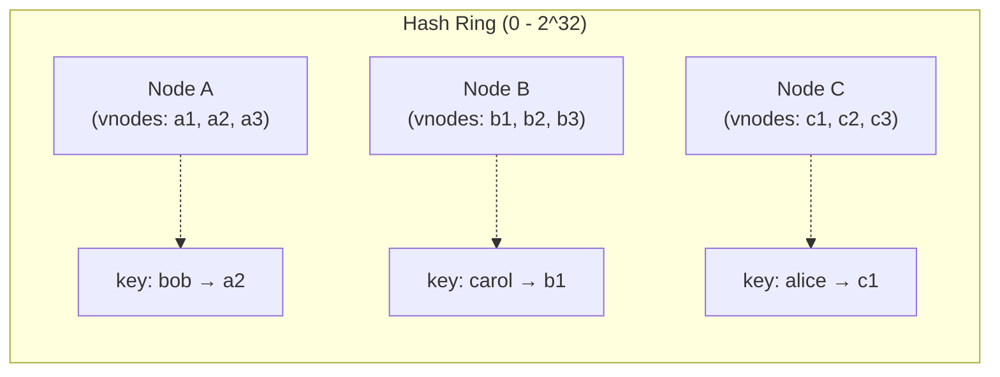

# Sharding Strategies — Range, Hash, Directory, Geo, Consistent Hashing

**Date:** 2026-04-24 | **Updated:** 2026-04-24
**Tags:** `system-design` `scalability` `sharding` `partitioning` `consistent-hashing`

## Table of Contents

- [Summary](#summary)
- [Why Shard](#why-shard)
- [Sharding vs Partitioning vs Replication](#sharding-vs-partitioning-vs-replication)
- [Sharding Strategies](#sharding-strategies)
  - [Range-Based Sharding](#range-based-sharding)
  - [Hash-Based Sharding](#hash-based-sharding)
  - [Directory / Lookup-Based Sharding](#directory--lookup-based-sharding)
  - [Geo-Based Sharding](#geo-based-sharding)
  - [Consistent Hashing](#consistent-hashing)
- [Shard Key Selection](#shard-key-selection)
- [Hot Shards](#hot-shards)
- [Cross-Shard Queries](#cross-shard-queries)
- [Resharding — The Zero-Downtime Playbook](#resharding--the-zero-downtime-playbook)
- [Consistent Hashing In Depth](#consistent-hashing-in-depth)
- [Specific Systems](#specific-systems)
- [The Rule of Avoiding Sharding](#the-rule-of-avoiding-sharding)
- [Anti-Patterns](#anti-patterns)
- [Related](#related)
- [References](#references)

## Summary

Sharding splits a single logical dataset across multiple physical nodes so that throughput, storage, and blast radius scale horizontally. It is powerful and expensive: every query path, every transaction boundary, every operational runbook has to account for the shard topology. This document covers the five dominant strategies (range, hash, directory, geo, consistent hashing), how to pick a shard key, how to survive hot shards and cross-shard queries, how real systems (MongoDB, Cassandra, Vitess, Citus, DynamoDB, Redis Cluster) implement these ideas, and the resharding playbook you will eventually need. The most important lesson: **do not shard until read replicas, caching, and vertical scaling have been genuinely exhausted.**

## Why Shard

A single database instance hits ceilings that no amount of tuning will move past:

- **Throughput** — a primary can only accept so many writes per second before the WAL, fsync latency, or replication lag pins the CPU and the disk.
- **Storage** — at some point the working set no longer fits in RAM, indexes stop being useful, and vacuum/compaction cycles dominate.
- **Blast radius** — one machine = one failure domain = every tenant affected.
- **Geography** — users in Frankfurt want their data close to Frankfurt, both for latency and for legal reasons (GDPR, India's DPDP, China's PIPL, Russia's data localization laws).
- **Multi-tenant isolation** — noisy neighbours destroy shared primaries; per-tenant shards cap the damage.

Sharding is the answer when the workload is bigger than one box can handle and read replicas, caching, and vertical scaling are no longer enough. It is not the answer for "our queries are slow" — that is an indexing or query-plan problem.

## Sharding vs Partitioning vs Replication

The terminology is abused almost everywhere. Be precise:

| Concept | Definition | Purpose |
|---|---|---|
| **Partitioning** | Splitting one logical table/collection by key. Usually a storage-layer concept. | Query performance, manageability. |
| **Sharding** | Partitioning _across independent nodes_. | Horizontal scale of throughput and storage. |
| **Replication** | Copying the _same_ data to multiple nodes. | Availability, read scaling, durability. |

Key distinctions:

- **Partitioning is often the local flavour of sharding**. Postgres declarative partitions (`PARTITION BY RANGE/LIST/HASH`) split one table into many; Citus takes those partitions and distributes them across nodes — that last step is what turns partitioning into sharding.
- **Replication is not sharding**. Three replicas of the same 2 TB dataset is still 2 TB of storage per node and still bounded by one primary's write throughput. You need both: shard for write scale, replicate each shard for availability.
- **Production systems combine all three**: partition within a node, shard across nodes, replicate each shard for HA.

```text
  One Logical Dataset
        │
   ┌────┴────┐
   │ Shard 1 │────► Primary ──► Replica ──► Replica
   │ Shard 2 │────► Primary ──► Replica ──► Replica
   │ Shard 3 │────► Primary ──► Replica ──► Replica
   └─────────┘
```

## Sharding Strategies

### Range-Based Sharding

Rows are assigned to shards based on contiguous ranges of the shard key.

```text
Shard A: user_id   A–H
Shard B: user_id   I–P
Shard C: user_id   Q–Z
```

**Pros:**

- **Range scans stay efficient** — `WHERE created_at BETWEEN '2026-04-01' AND '2026-04-30'` touches one shard, not all.
- **Human-intuitive** — easy to reason about, easy to route a single customer's data.
- **Good for time-series** when combined with partition pruning and retention.

**Cons:**

- **Hotspots on the tail** — lexicographic or monotonic keys (timestamps, auto-increment IDs, ULIDs sorted by time) send _all_ recent writes to the last shard.
- **Uneven distribution** — if 40% of user IDs start with `M`, shard B melts.
- **Requires periodic rebalancing** — ranges that were balanced at design time drift over months.

**When to use:** when range queries dominate and you can control key distribution (e.g. deliberately hash-prefixing the key while preserving ordering within the prefix).

### Hash-Based Sharding

Compute `shard = hash(key) mod N`. Every key lands in a deterministic, uniformly distributed shard.

```text
hash("alice") mod 4 = 2 → Shard 2
hash("bob")   mod 4 = 0 → Shard 0
hash("carol") mod 4 = 3 → Shard 3
```

**Pros:**

- **Even distribution** — assuming a decent hash function, load is uniform.
- **No coordination** — clients can compute the shard themselves from the key.
- **Trivial to implement** at the application layer.

**Cons:**

- **Kills range scans** — adjacent keys land on different shards; `BETWEEN` queries become scatter-gather.
- **`mod N` rebalancing is brutal** — adding a shard changes the mapping for _almost every key_. This is the single biggest reason people switch to consistent hashing.
- **Joins across keys** that do not share the shard key become cross-shard.

**When to use:** point lookups by primary key dominate and you rarely need range queries on the shard key. This is the default for key-value and document stores.

### Directory / Lookup-Based Sharding

A separate service — the **shard directory** — records, for every key or key range, which shard owns it.

```text
Directory:
  tenant_acme  → shard_01
  tenant_globo → shard_07
  tenant_initech → shard_03
```

**Pros:**

- **Maximum flexibility** — you can move any tenant, any range, any key to any shard at any time, with just a directory update.
- **Per-tenant placement** — big customers get dedicated shards, small customers share.
- **Enables live migrations** — the directory can point to a "migrating" shard during cutover.

**Cons:**

- **Lookup on every request** — adds a hop and caching complexity.
- **Directory is a SPOF** — must be replicated, cached, and kept consistent. Directory outage = application outage.
- **Cache invalidation is hard** when tenants move.
- **More moving parts** to monitor, back up, and reason about.

**When to use:** multi-tenant SaaS where tenant sizes vary by orders of magnitude, and operationally you need to shuffle tenants between shards without application changes. Figma, Slack, and Notion have all described variations of this pattern.

### Geo-Based Sharding

Shard by region: EU users on EU shards, US users on US shards, APAC on APAC shards.

**Pros:**

- **Latency** — reads and writes stay within the region, typically 20–60 ms instead of 150–300 ms transatlantic.
- **Data sovereignty** — GDPR, DPDP, PIPL, and similar regulations often require that certain data _physically remain_ in a jurisdiction. Geo-sharding is the clean way to enforce this.
- **Blast radius** — a regional outage is a regional outage, not a global one.

**Cons:**

- **Global queries are expensive** — "show me all users who bought X" now has to fan out to every region.
- **Users move** — residency changes and travel complicate "which shard owns this user."
- **Replication topology is non-trivial** — do you replicate EU data into US for DR? Legal may forbid it.
- **Latency for global features** (followers-of-followers, global leaderboards) is worse, not better.

**When to use:** user-facing products with regulatory requirements or strong latency sensitivity (financial services, healthcare, consumer apps serving multiple continents).

### Consistent Hashing

A hash-based scheme where adding or removing shards moves only `1/N` of the keys instead of nearly all of them. Covered in depth below.

## Shard Key Selection

The shard key is the single most consequential decision. It is effectively immutable — changing it means resharding the entire dataset.

**The four properties a good shard key has:**

1. **High cardinality** — enough distinct values that you can split finely. `country_code` (~250 values) is a bad shard key if you need 1000 shards; `user_id` (millions) is fine.
2. **Uniform distribution** — no value should be dramatically more frequent than others. `status` is a catastrophically bad shard key because 95% of rows might be `active`.
3. **Query alignment** — the most common queries should be satisfiable with the shard key, so they hit one shard instead of fanning out. Pick the key that matches your dominant access pattern.
4. **Immutability** — the shard key should rarely or never change for a given row. Changing it means moving the row between shards.

**Heuristics:**

- `user_id` / `tenant_id` / `account_id` is a good default for user-facing SaaS. It aligns with the "get me everything for user X" query and is naturally high-cardinality.
- `(tenant_id, entity_id)` composite keys work well for multi-tenant systems — tenant stays together on one shard, entities within a tenant are locally addressable.
- **Avoid monotonic keys** (auto-increment, timestamps, time-sorted UUIDs) as sole shard keys — they cause tail-shard hotspots.
- **Avoid low-cardinality keys** (`country`, `region`, `plan_tier`) — always think about the worst-case hot shard.

**The worst-case thought experiment:** imagine your single biggest customer, or your most viral piece of content. Does the shard containing it survive? If your #1 customer is 30% of your traffic, a per-customer shard key puts 30% of traffic on one shard. That is your hot shard by design.

## Hot Shards

A hot shard is a shard receiving a disproportionate share of traffic. Symptoms:

- **Uneven CPU or IOPS** — one shard pinned at 95% while others sit at 20%.
- **Replication lag** — the hot primary cannot drain its WAL fast enough.
- **Timeout clusters** — requests touching the hot shard time out while others succeed.
- **Hot rows within a shard** — even deeper: a single row (celebrity user) gets hammered.

**Common causes:**

- **Celebrity user** — one tenant or user who generates 1000x the average load (the "Beyoncé problem" at Instagram, the big-enterprise-customer problem at any B2B SaaS).
- **Monotonic shard key** — range-based sharding with time or auto-increment ID.
- **Cardinality mismatch** — the chosen key has a skewed value distribution.
- **Write amplification** — one tenant runs a job that dumps millions of events into their shard.

**Mitigations:**

- **Key salting** — append a small random or hashed suffix to the shard key (`user_id:{bucket}` where `bucket = hash(request_id) % 16`) to split a hot user's writes across 16 logical sub-shards. Reads then fan out across the buckets.
- **Secondary / two-level sharding** — inside the hot shard, further partition the hot key's rows.
- **Request coalescing** — for read-heavy hot rows, a short-TTL cache or single-flight in front of the shard absorbs most of the load.
- **Promote the hot tenant to a dedicated shard** — common in directory-based systems. Enterprise customers get their own shard; small customers share.
- **Rate-limit the offender** — sometimes the answer is "this one customer is abusing us; back-pressure them."

## Cross-Shard Queries

Any query that cannot be answered from a single shard is a cross-shard query. These are the tax you pay for sharding.

**Fan-out (scatter-gather):**

```text
Client
  │
  ├──► Shard 1 ──► partial result
  ├──► Shard 2 ──► partial result
  ├──► Shard 3 ──► partial result
  └──► Shard N ──► partial result
         │
         ▼
    Merge / sort / aggregate
```

Tail latency dominates: the query is as slow as the slowest shard. With N=64 shards, the probability of at least one slow shard is uncomfortably high.

**Patterns:**

- **Scatter-gather with limits** — push `LIMIT`, `ORDER BY`, and predicates to each shard; merge with a top-K algorithm. Vitess and Citus do this automatically.
- **Materialized cross-shard indexes** — maintain a secondary sharded-by-different-key index. Searching by email, when you shard by user_id, requires an `email → user_id` index sharded by email. This is essentially a secondary-index service.
- **Denormalization** — accept the storage duplication and keep the data you need locally on each shard.
- **Event-driven read models** — write events once, fan them into per-query read models (CQRS territory — see [cqrs-and-event-sourcing.md](cqrs-and-event-sourcing.md)).
- **Global secondary indexes** — DynamoDB GSIs, Cassandra materialized views. These are themselves sharded, often by a different key.

**Cross-shard transactions** are the true swamp. Two-phase commit across shards is available (XA, Percolator-style, Spanner) but expensive and operationally painful. In practice, most systems:

1. Design the shard key so transactions are single-shard (all of tenant X's data on one shard).
2. Use sagas / compensating transactions for the rare cross-shard flow.
3. Avoid cross-shard ACID transactions as a design goal, not as an afterthought.

## Resharding — The Zero-Downtime Playbook

You will eventually need to add shards, split a hot shard, or change the shard key. The naive `mod N` scheme guarantees pain; even with consistent hashing, moving data is non-trivial.

**The canonical zero-downtime split playbook:**

1. **Preparation**
   - Add the new shard(s), empty.
   - Ensure the routing layer (application, proxy, Vitess vtgate, Citus coordinator) knows about the new shards but still routes all writes to the old shard.
2. **Dual-write**
   - Start writing every new write to _both_ the old shard and the destination shard it would live on under the new scheme.
   - Reads still come from the old shard.
3. **Backfill**
   - Stream historical rows from old to new, respecting ordering constraints. This is where tools like Vitess `VReplication`, MySQL `gh-ost`, and `pt-online-schema-change` earn their keep.
   - Monitor lag; keep dual-write active.
4. **Verify**
   - Run row counts, checksums, and sample diffs. Fix any drift.
5. **Cutover reads**
   - Flip reads to the new shard(s). Keep dual-write on briefly so you can flip back on trouble.
6. **Stop dual-write**
   - After a confidence window, writes go only to the new shard(s).
7. **Drop old data**
   - Only after a long cool-down period (days to weeks). Until then, keep the old shard as a rollback target.

**Tools that actually do this:**

- **[Vitess VReplication](https://vitess.io/docs/user-guides/migration/vreplication/)** — purpose-built for MySQL resharding. Handles splits, merges, and online schema changes with shadow workflows.
- **[gh-ost](https://github.com/github/gh-ost)** — GitHub's online MySQL schema change tool. Uses binlog replay instead of triggers, which makes it safer under heavy load.
- **[pt-online-schema-change](https://docs.percona.com/percona-toolkit/pt-online-schema-change.html)** — Percona's trigger-based online schema change. Predates gh-ost.
- **[Citus shard rebalancer](https://docs.citusdata.com/en/stable/admin_guide/cluster_management.html#shard-rebalancer)** — moves Postgres shards across Citus worker nodes.
- **[MongoDB balancer](https://www.mongodb.com/docs/manual/core/sharding-balancer-administration/)** — automatic chunk migration between shards.

**Discord's story** (their move to trillions of messages on Cassandra → ScyllaDB → on-demand migration) is a reference case study: dual-write, long verification, careful cutover, and a willingness to run both clusters in parallel for weeks.

## Consistent Hashing In Depth

Consistent hashing, introduced by Karger et al. in 1997, solves the `mod N` rebalancing problem. The core idea: map both keys _and_ nodes onto the same hash ring, and each key is owned by the next node clockwise. Adding or removing a node only reshuffles the keys between it and its neighbours — roughly `1/N` of the total.



ASCII version of the same idea:

```text
                  0 / 2^32
                   ┌──────┐
              a1 ──┤      ├── b1
                   │      │
          c3 ──────┤ RING ├────── a2
                   │      │
              b3 ──┤      ├── c1
                   └──────┘
                  2^32 / 2

Lookup(key):
  h = hash(key)
  walk clockwise from h
  first vnode encountered = owner
```

**Virtual nodes (vnodes):** without vnodes, three physical nodes produce only three arcs on the ring, which are never uniformly sized. Each physical node instead registers 100–256 _virtual_ positions, smoothing the distribution.

**The math:**

- With `N` physical nodes and `V` virtual nodes per physical node, the load standard deviation scales roughly as `1 / sqrt(N * V)`.
- `V = 128` is a common default (Cassandra's default is 16 on newer versions, 256 on older).
- Adding one physical node moves approximately `1/N` of the keys — _only_ the keys that land on vnodes now closer clockwise to the new node.

**Pseudocode lookup:**

```python
# pseudocode: consistent-hashing lookup
def build_ring(nodes, vnodes_per_node=128):
    ring = []  # sorted list of (hash, node_id)
    for node in nodes:
        for i in range(vnodes_per_node):
            h = hash_fn(f"{node.id}#{i}")
            ring.append((h, node.id))
    ring.sort(key=lambda x: x[0])
    return ring

def lookup(ring, key):
    h = hash_fn(key)
    # binary search: first ring entry with hash >= h; wrap if none
    idx = lower_bound(ring, h)
    if idx == len(ring):
        idx = 0
    return ring[idx][1]

def replicas(ring, key, replication_factor=3):
    # walk clockwise, skipping duplicates on the same physical node
    start = lower_bound(ring, hash_fn(key)) % len(ring)
    owners = []
    i = start
    while len(owners) < replication_factor:
        node = ring[i % len(ring)][1]
        if node not in owners:
            owners.append(node)
        i += 1
    return owners
```

**Dynamo-style rings:** Amazon Dynamo (2007) combined consistent hashing with virtual nodes, quorum reads/writes (`N`, `R`, `W`), vector clocks for conflict resolution, and gossip-based membership. Cassandra is the most widely-used open-source descendant; Riak was another.

**Cassandra tokens:** each node owns one or more tokens on a 64-bit or 128-bit ring. A partition key is hashed (Murmur3 by default) and routed to the node whose token range covers the hash. Replication factor `RF=3` places replicas on the next two distinct nodes clockwise, respecting rack awareness.

## Specific Systems

Different systems make different trade-offs. Mapping the strategy to the tool:

| System | Shard key concept | Strategy | Notes |
|---|---|---|---|
| **[MongoDB](https://www.mongodb.com/docs/manual/sharding/)** | `shardKey` per collection | Range or hashed | Chunks split and migrate automatically. Pick range for range queries, hashed for even distribution. |
| **[Cassandra](https://cassandra.apache.org/doc/latest/cassandra/architecture/overview.html)** | Partition key (first part of primary key) | Consistent hashing (Murmur3 ring with vnodes) | Clustering columns sort within a partition. Wide partitions are an anti-pattern; keep them bounded. |
| **[Vitess](https://vitess.io/docs/overview/concepts/sharding/)** | `keyspace_id` (often `hash(user_id)`) | Hash-based with vindex abstraction | Used by YouTube, Slack, HubSpot. Handles resharding, online schema changes, and cross-shard queries. |
| **[Citus](https://docs.citusdata.com/)** | Distribution column | Hash (default) or range on Postgres | Extends Postgres. Co-locates tables that share a distribution column for single-shard joins. |
| **[Postgres native partitioning](https://www.postgresql.org/docs/current/ddl-partitioning.html)** | Partition key | Range, list, or hash | Partitioning _within_ one node, not across nodes — use Citus for cross-node. |
| **[DynamoDB](https://docs.aws.amazon.com/amazondynamodb/latest/developerguide/bp-partition-key-design.html)** | Partition key + optional sort key | Hash on partition key; sort within | Adaptive capacity helps smooth mild hot keys; extreme skew still bites. |
| **[Redis Cluster](https://redis.io/docs/latest/operate/oss_and_stack/management/scaling/)** | Hash slot (0–16383) | `CRC16(key) mod 16384` → slot → node | Hash tags `{user123}` let you force multiple keys into the same slot for multi-key operations. |
| **[Elasticsearch](https://www.elastic.co/guide/en/elasticsearch/reference/current/scalability.html)** | `_routing` (default: `_id`) | Hash-based into primary shards, fixed at index creation | Reshard by reindexing. The shard count is famously hard to change. |

## The Rule of Avoiding Sharding

The single most useful piece of advice: **do not shard until you have to.** Sharded systems are operationally harder than single-node systems by a very wide margin. Backups, restores, transactions, migrations, debugging, observability — every one of them becomes more complex.

Before sharding, exhaust:

1. **Vertical scaling** — modern cloud instances go to hundreds of vCPUs and terabytes of RAM. A 32-core instance is cheap compared to an engineering team rewriting the data layer. Run out of instance sizes before you run out of design options.
2. **Read replicas** — if reads dominate writes (they usually do), replicas are the cheapest form of scale.
3. **Connection pooling** — PgBouncer, RDS Proxy, HikariCP tuning. Many "database is slow" problems are actually "we opened 10 000 connections."
4. **Indexing and query tuning** — `EXPLAIN ANALYZE` on your slow queries before assuming you need more hardware.
5. **Caching** — Redis / Memcached in front of hot reads. Write-through, cache-aside, stampede protection (see [read-write-splitting-and-cache-strategies.md](read-write-splitting-and-cache-strategies.md)).
6. **Archival and tiering** — moving cold data to cheaper storage often restores working-set fit.
7. **Table partitioning within one node** — Postgres declarative partitioning, MySQL partitions. Buys time without distributing state.

Only after all of those have been tried and measured does sharding become the right answer. When it does, commit fully: pick the shard key deliberately, invest in tooling, build the resharding muscle early.

## Anti-Patterns

Common and expensive mistakes:

- **Premature sharding** — building a sharded architecture for 10 000 users because "we might have 100 million one day." You will spend the next two years paying the tax for a scale you do not yet have.
- **Monotonic shard key** — using `created_at`, auto-increment ID, or time-sorted UUID (ULID, UUIDv7) as the sole shard key. The last shard is always on fire.
- **Low-cardinality shard key** — `country`, `status`, `plan_tier`. Ten values, N shards, nine shards idle.
- **Cross-shard transactions at scale** — designing a system that routinely needs ACID transactions across shards. You will discover the hard way why Spanner is expensive.
- **No rebalancing plan** — "we'll figure it out when we need it." You need it on the worst possible day, usually at 3 AM.
- **Ignoring the worst-case tenant** — if your biggest customer is 30% of load, your shard key must account for them (dedicated shard, salted sub-shards).
- **Sharding without observability** — you cannot fix hot shards you cannot see. Per-shard QPS, latency, CPU, and replication lag are non-negotiable dashboards.
- **Treating sharding as a library problem** — it is an architecture problem. The shard topology affects APIs, transactions, background jobs, analytics, and every SRE runbook.
- **Mixing shard keys across services** — if Service A shards by `user_id` and Service B shards by `order_id`, the natural join between them is now cross-shard forever.

## Related

- [Replication Patterns — Primary-Replica, Multi-Primary, Quorum](replication-patterns.md) — sync vs async replication, failover, and how each shard becomes highly available.
- [Horizontal vs Vertical Scaling & Stateless Services](horizontal-vs-vertical-and-stateless.md) — the layer above: keep compute stateless so data-layer sharding is the only hard piece.
- [Read/Write Splitting & Cache Strategies](read-write-splitting-and-cache-strategies.md) — the first things to try before sharding.
- [CQRS and Event Sourcing](cqrs-and-event-sourcing.md) — when cross-shard queries push you toward separate read models.
- [Database Path INDEX](../../database/INDEX.md) — engine-specific guidance on Postgres partitioning, MongoDB sharding, Cassandra modelling, and polyglot persistence.

## References

- [Karger et al., "Consistent Hashing and Random Trees" (1997)](https://www.cs.princeton.edu/courses/archive/fall09/cos518/papers/chash.pdf) — the original paper.
- [DeCandia et al., "Dynamo: Amazon's Highly Available Key-value Store" (SOSP 2007)](https://www.allthingsdistributed.com/files/amazon-dynamo-sosp2007.pdf) — vnodes, quorum, and the architectural template for Cassandra/Riak.
- [MongoDB — Sharding documentation](https://www.mongodb.com/docs/manual/sharding/) — shard keys, zones, chunk migration.
- [Apache Cassandra — Architecture overview](https://cassandra.apache.org/doc/latest/cassandra/architecture/overview.html) — partition keys, token ring, replication strategies.
- [Vitess — Sharding concepts](https://vitess.io/docs/overview/concepts/sharding/) and [VReplication](https://vitess.io/docs/user-guides/migration/vreplication/) — production resharding on MySQL.
- [Citus — Distributed Postgres documentation](https://docs.citusdata.com/) — co-located tables, shard rebalancer, reference tables.
- [AWS — DynamoDB partition key design](https://docs.aws.amazon.com/amazondynamodb/latest/developerguide/bp-partition-key-design.html) — adaptive capacity, hot key mitigation.
- [Redis — Scaling with Redis Cluster](https://redis.io/docs/latest/operate/oss_and_stack/management/scaling/) — 16 384 hash slots, hash tags, resharding.
- [Discord — "How Discord Stores Trillions of Messages"](https://discord.com/blog/how-discord-stores-trillions-of-messages) — Cassandra → ScyllaDB migration, a real-world resharding case study.
- [Figma Engineering — "How Figma's databases team lived to tell the scale"](https://www.figma.com/blog/how-figmas-databases-team-lived-to-tell-the-scale/) — directory-based sharding on Postgres.
- [GitHub — gh-ost](https://github.com/github/gh-ost) — binlog-based online schema change for MySQL.
- [Percona — pt-online-schema-change](https://docs.percona.com/percona-toolkit/pt-online-schema-change.html) — the trigger-based counterpart.
