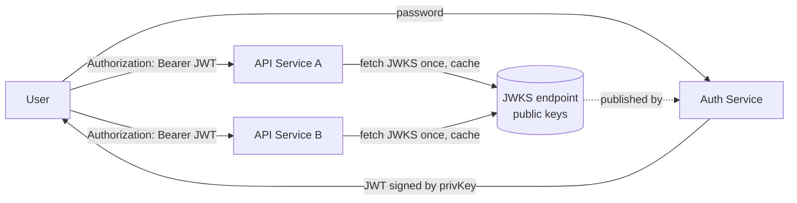
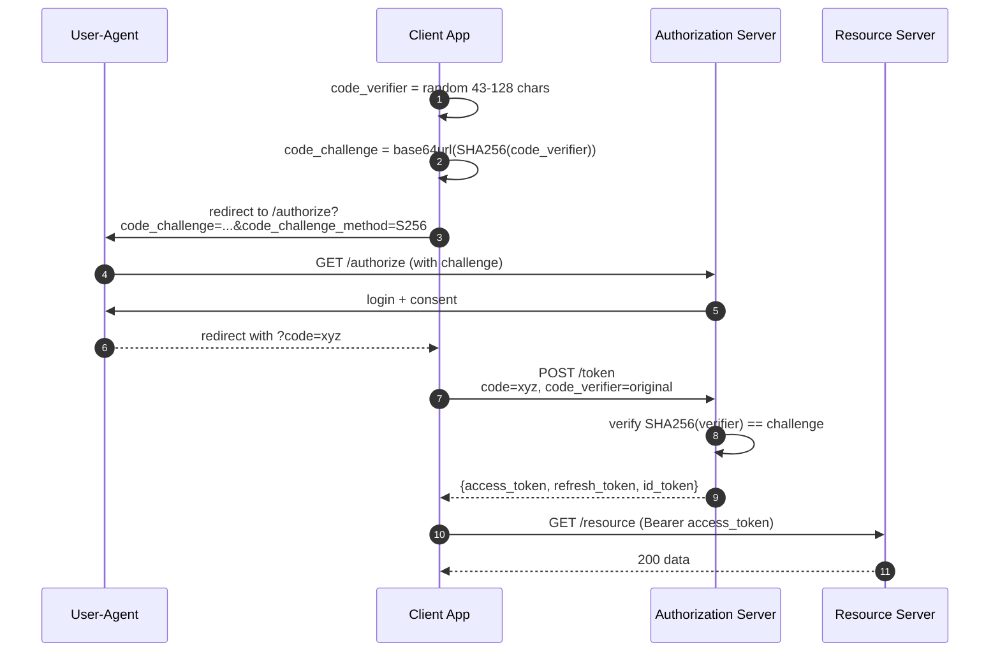

# Authentication — Sessions, Tokens, JWT, and Refresh Flows

**Date:** 2026-04-26 | **Updated:** 2026-04-26
**Tags:** `system-design` `security` `authentication` `jwt` `oauth`

## Table of Contents

- [Summary](#summary)
- [Overview](#overview)
- [Key Concepts](#key-concepts)
  - [Session-Based Authentication](#session-based-authentication)
  - [Token-Based Authentication and JWT Internals](#token-based-authentication-and-jwt-internals)
  - [Refresh Tokens and Rotation](#refresh-tokens-and-rotation)
  - [Sliding Sessions and Multi-Device Sign-In](#sliding-sessions-and-multi-device-sign-in)
  - [OAuth 2.0 / 2.1 Grant Types](#oauth-20--21-grant-types)
  - [Passkeys and WebAuthn — A Brief Intro](#passkeys-and-webauthn--a-brief-intro)
- [Trade-offs — Session vs Token, When Each Wins](#trade-offs--session-vs-token-when-each-wins)
- [Code Examples](#code-examples)
  - [JWT Verification in Node.js with `jose`](#jwt-verification-in-nodejs-with-jose)
  - [Refresh-Token Rotation Pseudocode](#refresh-token-rotation-pseudocode)
- [Real-World Uses](#real-world-uses)
- [Anti-Patterns](#anti-patterns)
- [Related](#related)
- [References](#references)

## Summary

Authentication answers _who is making this request?_ Two families dominate: **server-side sessions** (random opaque ID in a cookie, lookup against a server-side store) and **stateless tokens** (signed JWT or similar, verified by the resource server without a lookup). Sessions are simpler, easy to revoke, and fine for most monoliths; tokens scale across services without a shared session store but trade revocation for verification cost. Real systems usually blend the two: short-lived **access tokens** (JWT, ~5–15 min) carry identity to APIs, **long-lived refresh tokens** (opaque, stored server-side, rotated on each use) re-mint them, and **OAuth 2.0** (with PKCE for public clients) standardizes how third parties obtain those tokens. Passkeys / WebAuthn replace the password underneath all of this with a phishing-resistant public-key credential.

## Overview

Authentication failures are responsible for an outsized share of real-world breaches — credential stuffing, stolen tokens, broken session handling, and naive JWT implementations recur across post-mortems. The OWASP Top 10 has carried "Identification and Authentication Failures" (A07:2021) since the list began under various names, and most of the recurring root causes are architectural rather than cryptographic: people store the wrong artifact in the wrong place, never plan for revocation, or pick a stateless mechanism then layer back a stateful denylist that defeats the original choice.

This doc treats authentication as a system-design decision, not a library choice. It separates the question _what artifact proves identity?_ (cookie, JWT, opaque token, passkey assertion) from the orthogonal questions _where is it stored?_, _how long does it live?_, _how is it revoked?_, and _who issues it?_ Get those four right and the library is a 30-minute decision.

A scope note: this doc covers **authentication** (proving who you are). [Authorization](./authorization.md) — what you're allowed to do once authenticated — is a separate concern. Don't conflate `iat`/`exp` claims with role-based or attribute-based access control, and don't ship "JWT for authn" thinking you got authz for free.

## Key Concepts

### Session-Based Authentication

The classic pattern, unchanged in spirit since the 1990s. The server generates a high-entropy random session ID on login, stores `{sessionId → {userId, expiresAt, metadata}}` in a session store, and sends the ID back to the browser as a cookie. Every subsequent request carries the cookie; the server looks up the session on each request.

**The server-side store** is whatever you already operate: Postgres, Redis, Memcached, DynamoDB. Redis is the common choice because session lookups are on the hot path of every request and you want sub-millisecond reads. The store needs an eviction policy that respects `expiresAt` (Redis `EXPIRE`, Memcached TTL, or a periodic sweep on SQL).

**The cookie itself** is where most session bugs live. A correctly configured session cookie sets:

| Attribute | Value | Why |
|-----------|-------|-----|
| `HttpOnly` | required | JavaScript cannot read it; XSS cannot steal it. |
| `Secure` | required | Browser only sends it over HTTPS. |
| `SameSite` | `Lax` (default) or `Strict` | Mitigates CSRF on cross-site navigations. `None` only with `Secure` and only when you actually need cross-site (third-party widget). |
| `Path` | `/` typically | Limits which paths receive the cookie. |
| `Domain` | omit (host-only) by default | Setting `Domain=.example.com` shares it with subdomains; wider scope = more places it can leak. |
| `Max-Age` / `Expires` | absolute lifetime | Without one, it's a "session cookie" that dies with the browser session — fine for short flows, surprising for "remember me." |
| `__Host-` prefix | strongly recommended | Forces `Secure`, `Path=/`, no `Domain`; binds the cookie to the exact origin. |

CSRF protection is required even with `SameSite=Lax` for state-changing requests that aren't top-level navigations: keep the synchronizer-token or double-submit-cookie pattern. See OWASP's CSRF and Session Management cheat sheets for the canonical guidance.

```mermaid
sequenceDiagram
    autonumber
    participant B as Browser
    participant S as App Server
    participant R as Session Store (Redis)

    B->>S: POST /login (username, password)
    S->>S: verify password (argon2id)
    S->>R: SETEX sess:abc123 1800 {userId, ...}
    S-->>B: Set-Cookie: sid=abc123; HttpOnly; Secure; SameSite=Lax
    B->>S: GET /profile (cookie)
    S->>R: GET sess:abc123
    R-->>S: {userId: 42, ...}
    S-->>B: 200 profile data
    B->>S: POST /logout
    S->>R: DEL sess:abc123
    S-->>B: 204; Set-Cookie: sid=; Max-Age=0
```

**Strengths:** Revocation is one `DEL`. The cookie itself is opaque — no information leaks if someone reads the network. Library support is universal.

**Limits:** Every request hits the session store. In a microservices world each downstream service either re-validates by calling an auth service (latency) or trusts a header set by the gateway (gateway becomes the trust boundary). For a single monolith with a Redis nearby, this is fine and probably the simplest correct choice.

### Token-Based Authentication and JWT Internals

A **JWT** (JSON Web Token, RFC 7519) is a compact, signed (and optionally encrypted) bearer token. The server signs a JSON payload of claims and hands it back; the client sends it on every request (typically `Authorization: Bearer <jwt>`). Any service holding the verification key can validate the token without calling the auth server — that's the design point.

The on-the-wire format is three **base64url** segments joined by dots:

```
eyJhbGciOiJSUzI1NiIsImtpZCI6IjEifQ.eyJzdWIiOiI0MiIsImV4cCI6MTcxNzE2MDAwMH0.<signature>
└─────── header ───────────────────┘ └────── payload ────────────────────┘ └─signature─┘
```

**Header** — JSON with `alg` (signature algorithm) and `typ` (`"JWT"`); usually `kid` (key ID) for key rotation.

**Payload (claims)** — RFC 7519 reserves seven standard claims, all optional but most universally used:

| Claim | Meaning |
|-------|---------|
| `iss` | Issuer — who minted the token. |
| `sub` | Subject — typically the user ID. |
| `aud` | Audience — who is allowed to consume it. |
| `exp` | Expiration time (NumericDate, seconds since epoch). |
| `nbf` | Not before — token invalid until this time. |
| `iat` | Issued at. |
| `jti` | JWT ID — unique identifier, useful for denylists. |

You can add custom claims (`role`, `tenant_id`, etc.). Keep the payload small: every API request carries it, in headers, on every hop.

**Signature** — RFC 7515 (JWS) defines the algorithm registry. The three meaningful choices in 2026:

| Algorithm | Family | When to use |
|-----------|--------|-------------|
| **HS256** (HMAC-SHA-256) | Symmetric | Single trust domain — issuer and verifier are the same service or share a secret. Simple, fast. The shared secret is the weakness: anyone who can verify can also forge. |
| **RS256** (RSA-SHA-256, 2048-bit+) | Asymmetric | Multiple verifiers (microservices, third-party APIs). Issuer holds the private key, verifiers fetch the public key from a JWKS endpoint. Mature, ubiquitous, but signatures are large (~256 bytes) and signing is slow. |
| **EdDSA** (Ed25519) | Asymmetric | Same use case as RS256 but with smaller keys (32 bytes), smaller signatures (64 bytes), and faster signing/verification. Defined for JOSE in RFC 8037. The modern default if your stack supports it. |

`ES256` (ECDSA P-256) is the other common asymmetric choice and is fine; it sits between RS256 and EdDSA on most metrics. **Do not** use `alg: none`. **Do not** use `HS256` for tokens issued by one service and verified by another unless they genuinely share a secret — see the key-confusion anti-pattern below.

**JWT pitfalls** (covered as anti-patterns below in detail): `alg=none` confusion, the RS256↔HS256 key-confusion attack, no built-in revocation, payload bloat, clock-skew on `exp`, and putting JWTs in `localStorage` where XSS can read them.



### Refresh Tokens and Rotation

Stateless JWTs solve "verify cheaply across services" but inherit a problem: **you cannot revoke them** before `exp`. The standard answer is to make `exp` short (5–15 minutes) and pair it with a **refresh token** that re-mints access tokens.

A refresh token is:

- **Long-lived** (days to months) — that's the whole point.
- **Opaque** — typically a high-entropy random string (16–32 bytes from a CSPRNG), not a JWT. There is no value in having the refresh token be self-describing.
- **Server-side stored** — the auth service keeps `{tokenHash → {userId, deviceId, issuedAt, expiresAt, replacedBy}}`. Stored hashed (argon2id or HMAC), never plaintext, same as a password.
- **Single-use, rotated on every refresh** — when the client redeems it, you mint a new access token AND a new refresh token, and mark the old refresh token as `replacedBy = newId`.
- **Sender-constrained where possible** — bind it to a TLS client cert, a DPoP key (RFC 9449), or at minimum a device fingerprint, so a stolen refresh token alone is useless.

**Refresh-token reuse detection** is the security feature that makes rotation worth the complexity. If a refresh token that has already been redeemed is presented again, that means either:

1. The client kept a stale copy and is buggy, or
2. An attacker stole the token, the legitimate client already redeemed it, and the attacker is now trying to use it (or vice versa — the attacker redeemed, now the legit client retries).

Either way, the auth service should treat the entire refresh-token chain as compromised: revoke the chain, force re-login on all devices. This is the OAuth 2.0 Security BCP recommendation (RFC 9700, formerly draft-ietf-oauth-security-topics).

```mermaid
sequenceDiagram
    autonumber
    participant C as Client
    participant AS as Auth Service
    participant DB as Refresh Store

    C->>AS: POST /token (refresh_token=rt-A)
    AS->>DB: lookup hash(rt-A)
    DB-->>AS: {userId, replacedBy: null}
    AS->>AS: mint access JWT (exp 10m), generate rt-B
    AS->>DB: mark rt-A.replacedBy=rt-B; store rt-B
    AS-->>C: {access_token, refresh_token: rt-B}

    Note over C,AS: ...later, attacker replays rt-A...
    C->>AS: POST /token (refresh_token=rt-A) [reuse!]
    AS->>DB: lookup hash(rt-A)
    DB-->>AS: {replacedBy: rt-B}  -- already used
    AS->>DB: revoke entire chain for userId
    AS-->>C: 401 invalid_grant; force re-login
```

### Sliding Sessions and Multi-Device Sign-In

A **sliding session** extends its expiry on each successful use, up to an absolute cap. Two clocks: `idle_timeout` (e.g. 30 min, reset on each request) and `absolute_timeout` (e.g. 12 hours or 30 days, never extended). This applies equally to opaque sessions and to refresh-token lifetimes.

**Multi-device sign-in** means tracking sessions and refresh tokens per device, not per user. Schema:

```
sessions(id, user_id, device_id, device_name, ip, ua, created_at, last_seen_at, expires_at)
```

Surface a "Devices" page where the user can revoke individual sessions. Most consumer products (Google, Apple, Slack, Discord) have one — it both deters attackers and is required-ish under the EU's NIS2 / similar regulations for sensitive accounts. Revoking a row from this table should immediately invalidate the corresponding refresh-token chain; if you're using JWT access tokens, the user keeps access only until the current ~10-minute access token expires, which is the implicit revocation budget you signed up for when you chose stateless tokens.

### OAuth 2.0 / 2.1 Grant Types

OAuth 2.0 (RFC 6749, 2012) is _delegated authorization_, not authentication — it lets a user grant a third-party app limited access to their data without sharing their password. It's adjacent to authentication because the token a third party receives is the same kind of bearer artifact you'd use for your own authn, and OpenID Connect (OIDC) layers identity on top.

The OAuth 2.1 effort (in the IETF process for years; expected to consolidate the security best practices from RFC 9700 into a refreshed core spec) has dropped the implicit grant and password grant. The grants that matter today:

| Grant | Use case | Public client? |
|-------|----------|----------------|
| **Authorization Code + PKCE** | Web apps, mobile apps, SPAs — anything where a human user is present. | Yes (PKCE makes it safe). |
| **Client Credentials** | Service-to-service, no user involved. The client itself is the principal. | No — confidential client only. |
| **Device Authorization Grant** | TVs, CLIs, anything without a usable browser. User authorizes on a separate device. | Yes. |
| **Refresh Token** | Re-mint access tokens (covered above). | Yes, with rotation. |
| ~~Implicit~~ | Deprecated in OAuth 2.1. Replaced by Auth Code + PKCE for SPAs. | — |
| ~~Resource Owner Password Credentials~~ | Deprecated in OAuth 2.1. Made the third-party app handle the password — the exact thing OAuth was meant to avoid. | — |

**Authorization Code with PKCE** (RFC 7636) is the workhorse. PKCE — Proof Key for Code Exchange — closes the authorization-code-interception attack on public clients (mobile apps, SPAs) where the client can't keep a secret. The flow:



The `code_verifier` is generated fresh per request and never leaves the client; the `code_challenge` (its SHA-256 hash) goes through the front channel. An attacker who intercepts the authorization code on the redirect cannot exchange it without the verifier, which they don't have. As of OAuth 2.1, PKCE is **required** for all clients using the authorization code grant — confidential as well as public.

**Client credentials** is for B2B APIs and internal service meshes. The client authenticates with a secret (or, better, a private-key-JWT or mTLS) and gets back an access token whose `sub` is the client itself. There is no user.

**Device authorization grant** (RFC 8628) is what powers "go to https://example.com/activate and enter code ABCD-1234" flows on TVs and CLIs. The device polls the authorization server until the user completes the browser side.

**OpenID Connect (OIDC)** sits on top of OAuth 2.0 and adds the **ID token** — a JWT that asserts who the user is (`sub`, `email`, `name`, `iss`, `aud`, `nonce`). The access token is for calling APIs; the ID token is for the client to know who logged in. If you're doing "Sign in with Google" you're using OIDC, not raw OAuth.

### Passkeys and WebAuthn — A Brief Intro

Passkeys are the deployment of WebAuthn (W3C standard) and FIDO2 / CTAP2 — a public-key credential bound to an origin. Instead of a password:

1. On registration, the device generates a keypair scoped to `(origin, userHandle)`. The public key is sent to the server; the private key never leaves the authenticator (TPM, Secure Enclave, hardware key).
2. On login, the server sends a random challenge. The authenticator signs `(challenge, origin, ...)`. The server verifies with the stored public key.

**Why it matters architecturally:**

- **Phishing-resistant.** The signed assertion includes the origin; the browser refuses to use a passkey from `evil.example` on `legit.example`. There's no shared secret to type into the wrong site.
- **No server-side secret.** Public keys aren't useful to attackers; the password-database breach has no analog.
- **Synced across devices** (Apple iCloud Keychain, Google Password Manager, 1Password, Dashlane) so usability doesn't fall off a cliff like hardware-only U2F did.

You add WebAuthn alongside your existing auth — the user logs in with a passkey, you mint your normal session or JWT, the rest of the system is unchanged. NIST SP 800-63B recognizes WebAuthn as a multi-factor cryptographic authenticator at AAL3 when used with a hardware authenticator.

This is a brief intro. For a real implementation, the [WebAuthn Level 3 spec](https://www.w3.org/TR/webauthn-3/) and Yubico's WebAuthn guide are the right next reads, plus a vetted server library (SimpleWebAuthn for Node, `webauthn4j` for Java, Apple's AuthenticationServices for iOS).

## Trade-offs — Session vs Token, When Each Wins

A single comparison table, then the decision rules.

| Concern | Server-side Session | Stateless JWT |
|---------|---------------------|----------------|
| **Storage location** | Redis / DB on server | Client (cookie or storage) |
| **Per-request cost** | Network call to session store | CPU verify (cheap with EdDSA, ~10µs) |
| **Revocation** | Trivial (`DEL key`) | Hard — requires denylist or short `exp` |
| **Horizontal scale across services** | Need shared session store or sticky sessions | Free — any service with the public key verifies |
| **Token size on wire** | ~20-byte cookie | 300–1500 bytes |
| **Logout-everywhere** | Trivial (delete all sessions for user) | Need denylist by `jti` or rotate signing key |
| **Works without cookies** (mobile, CLI) | Awkward (need bearer token anyway) | Native fit |
| **Auditable on auth server** | Yes (see active sessions) | No (issued tokens are gone) |

**Use sessions when:**
- It's a monolith or a small set of services sharing infrastructure.
- You need instant, reliable revocation (banking, healthcare, anything where "log out now" must mean now).
- The client is a browser and you can use cookies cleanly.

**Use stateless JWTs when:**
- You have many independent services that need to verify identity without calling an auth service.
- You serve non-browser clients (mobile, CLI, IoT) where bearer tokens are the natural fit.
- You're integrating with third parties via OAuth / OIDC — the ecosystem expects JWTs.

**Use both (the hybrid the industry actually settled on) when:** the answer to "should this be a session or a JWT?" is _yes_. Short-lived JWT access tokens (10 min) so resource servers verify without calling auth, plus opaque server-side refresh tokens with rotation so you keep revocation. This is what Auth0, Okta, Cognito, Keycloak, Firebase, and roughly every modern IdP ship by default.

## Code Examples

### JWT Verification in Node.js with `jose`

`jose` is the modern, audited JOSE library for Node — actively maintained, supports all the algorithms above, and refuses dangerous defaults (no `alg: none`, no key-type confusion). Avoid older libraries with a record of the vulnerabilities described in the anti-patterns section.

```ts
// pnpm add jose
import { jwtVerify, createRemoteJWKSet } from 'jose'

// JWKS = JSON Web Key Set, RFC 7517. The auth service publishes its public
// keys at a well-known URL; we cache them locally and refresh periodically.
const JWKS = createRemoteJWKSet(
  new URL('https://auth.example.com/.well-known/jwks.json'),
  { cacheMaxAge: 10 * 60_000, cooldownDuration: 30_000 },
)

interface Claims {
  sub: string
  email?: string
  role?: 'user' | 'admin'
}

export async function verifyAccessToken(token: string): Promise<Claims> {
  const { payload } = await jwtVerify(token, JWKS, {
    // Pin the algorithms we accept. NEVER read `alg` from the header
    // and trust it — that's the alg-confusion attack.
    algorithms: ['EdDSA', 'RS256'],
    issuer: 'https://auth.example.com',
    audience: 'api.example.com',
    // jose enforces `exp` and `nbf` automatically; we add a small clock
    // tolerance for distributed-clock skew.
    clockTolerance: '30s',
  })

  if (typeof payload.sub !== 'string') {
    throw new Error('token missing sub claim')
  }

  return {
    sub: payload.sub,
    email: payload.email as string | undefined,
    role: payload.role as Claims['role'],
  }
}

// Express middleware
export async function requireAuth(req, res, next) {
  const header = req.headers.authorization
  if (!header?.startsWith('Bearer ')) {
    return res.status(401).json({ error: 'missing bearer token' })
  }
  try {
    req.user = await verifyAccessToken(header.slice(7))
    next()
  } catch (err) {
    // Don't leak whether it's expired vs malformed vs wrong audience —
    // attackers use those distinctions to probe.
    return res.status(401).json({ error: 'invalid token' })
  }
}
```

Three things to notice. **First**, the `algorithms` allow-list is mandatory — without it, an attacker who controls the `alg` header can downgrade verification (see the key-confusion anti-pattern). **Second**, `jwtVerify` enforces `exp`, `nbf`, `iss`, and `aud` — if you skip the issuer/audience check, you accept tokens minted for a different service. **Third**, JWKS is fetched once and cached; if you fetched on every request you've reintroduced the network call you went stateless to avoid.

### Refresh-Token Rotation Pseudocode

This is language-agnostic intentionally — the schema and the state machine are what matter. The store can be Postgres, Redis, DynamoDB, whatever.

```
TABLE refresh_tokens:
  id              uuid primary key
  user_id         uuid
  device_id       text             -- so we can revoke per device
  token_hash      bytea            -- argon2id or HMAC-SHA-256 of the token
  parent_id       uuid nullable    -- previous token in the rotation chain
  replaced_by     uuid nullable    -- next token; set when this one is redeemed
  issued_at       timestamptz
  expires_at      timestamptz
  revoked_at      timestamptz nullable
  revoked_reason  text nullable    -- 'rotated', 'reuse_detected', 'logout', 'admin'

INDEX on (user_id, device_id) for "revoke this device"
INDEX on token_hash for lookup

FUNCTION refresh(presented_token, device_id):
  hash = HMAC_SHA256(SECRET, presented_token)
  row  = SELECT * FROM refresh_tokens WHERE token_hash = hash

  IF row is null:
    // Either never issued, or already deleted in chain revoke.
    RETURN 401 invalid_grant

  IF row.revoked_at is not null:
    // Reuse of a token we already invalidated.
    revoke_chain(row.user_id, row.device_id, reason='reuse_detected')
    log_security_event(row.user_id, 'refresh_token_reuse')
    RETURN 401 invalid_grant

  IF row.replaced_by is not null:
    // This token was already rotated forward. Reuse attempt.
    revoke_chain(row.user_id, row.device_id, reason='reuse_detected')
    log_security_event(row.user_id, 'refresh_token_reuse')
    RETURN 401 invalid_grant

  IF row.expires_at < now() OR row.device_id != device_id:
    RETURN 401 invalid_grant

  // Happy path. Mint new pair atomically.
  BEGIN TRANSACTION
    new_refresh        = random_url_safe(32 bytes)
    new_id             = uuid()
    INSERT refresh_tokens(
      id=new_id, user_id=row.user_id, device_id=row.device_id,
      token_hash=HMAC_SHA256(SECRET, new_refresh),
      parent_id=row.id,
      issued_at=now(),
      expires_at=now() + REFRESH_TTL,         // sliding, capped at ABSOLUTE_TTL
    )
    UPDATE refresh_tokens
       SET replaced_by=new_id, revoked_at=now(), revoked_reason='rotated'
     WHERE id=row.id
  COMMIT

  access = sign_jwt({sub: row.user_id, exp: now()+10*60})
  RETURN { access_token: access, refresh_token: new_refresh }


FUNCTION revoke_chain(user_id, device_id, reason):
  UPDATE refresh_tokens
     SET revoked_at=now(), revoked_reason=reason
   WHERE user_id=user_id
     AND device_id=device_id
     AND revoked_at is null
```

Two non-obvious bits. **The hash check is HMAC, not bare SHA-256 or argon2id** for the refresh-token store specifically: HMAC with a server-side secret is fast (this is on the hot path) and prevents an attacker who steals the database from doing offline lookups. Passwords use argon2id because they're attacked offline; refresh tokens are 32 random bytes from a CSPRNG so brute force isn't the worry. **The reuse detection revokes the entire device chain, not just the leaked token** — if a token leaked, you don't know what else the attacker has, so blow up the whole device's refresh chain and force re-login.

## Real-World Uses

- **Auth0 / Okta / Cognito / Firebase Auth / Clerk / Supabase Auth.** All ship the hybrid model: short-lived JWT access tokens (RS256 or ES256), opaque refresh tokens with rotation, JWKS endpoints for verification, OAuth 2.0 / OIDC for third-party integrations. The differences are operational (multi-tenant, hosted UI, branding) more than architectural.
- **GitHub.** Personal access tokens (long-lived bearer, opaque), OAuth apps and GitHub Apps (auth code + JWT-as-client-credential for Apps using RS256 with the App's private key), fine-grained PATs with scopes. SSH keys for git, separately. Different artifacts for different threat models.
- **Google.** OAuth 2.0 + OIDC for the entire surface. Access tokens (~1 hour), refresh tokens, ID tokens. Service accounts use JWT-bearer client assertions (RFC 7521 / RFC 7523) — sign a JWT with the service account's private key, exchange it for a bearer access token. Inside Google, the BeyondCorp model layers context (device posture, location) on top.
- **AWS.** SigV4 request signing — neither sessions nor JWTs but a per-request HMAC over the canonicalized request. Cognito sits on top for end-user auth and issues OIDC-compatible JWTs.
- **Spring Security (Java) and Django Auth (Python).** Both default to server-side sessions with cookies. Spring Security adds OAuth 2.0 client + resource server modules; Django adds DRF SimpleJWT or Authlib for JWT-based APIs.
- **Slack and Discord.** "Sessions" page in account settings showing every device, with per-device revocation. Mobile apps refresh tokens; web uses cookies. WebAuthn / passkey support for 2FA.
- **Apple.** Sign in with Apple is OIDC. iCloud Keychain syncs passkeys across the user's Apple devices. The Keychain itself is the local secret store backing all of it.

## Anti-Patterns

**`alg: none` accepted.** The original sin. RFC 7519 lists `none` as a registered algorithm meaning "unsecured." A naive verifier reads `alg` from the header, dispatches to the matching verify function, and `none` returns "valid" for anything. The 2015 Auth0 advisory and the original Tim McLean writeup made this famous; modern libraries refuse `none` by default, but home-rolled middleware still ships this bug. **Fix:** pin an `algorithms` allow-list at the verifier; never read `alg` from the header to decide what to verify with.

**Algorithm / key confusion (RS256 → HS256).** The verifier accepts both RS256 and HS256. The legitimate flow signs with the RSA private key and verifies with the public key. An attacker takes the published RSA **public key** (PEM bytes), changes `alg` to `HS256`, and signs the token using those PEM bytes as the HMAC secret. The verifier sees `alg: HS256`, looks up "the key" (which is the RSA public key, treated as raw bytes), and… verifies it. **Fix:** the algorithms allow-list above. If you must accept multiple, dispatch verification by key type, not by header.

**JWT in `localStorage`.** A JWT in `localStorage` is readable by any JavaScript running on the origin. One stored XSS — including from a third-party script you embedded — exfiltrates every user's token. `HttpOnly` cookies don't have this problem. The "but cookies have CSRF!" rebuttal is true but solved (SameSite, CSRF tokens); XSS-stealing-tokens is harder to mitigate. **Fix:** use `HttpOnly; Secure; SameSite=Lax` cookies for browser-issued tokens. If you must use `Authorization: Bearer` from JS, accept that one XSS is one full account takeover, and harden your CSP accordingly.

**No expiry, or "forever" expiry.** A JWT without `exp`, or with `exp` a year out, is permanent leak material. You can't revoke it. A laptop stolen on Tuesday is logged into your service for the next 12 months. **Fix:** access tokens 5–15 minutes, refresh tokens days to weeks (sliding, with absolute cap), and have a revocation story for both.

**No revocation strategy at all.** "We use JWT, it's stateless" — said by people who have never had to fire an employee. If your only answer to "revoke this token immediately" is "wait for `exp`," your auth design has a runtime gap measured in your access-token lifetime. **Fix:** combine short access TTL with server-stored refresh tokens; for higher-assurance scenarios, add a `jti` denylist or a per-user `tokens_valid_after` timestamp checked on each verify.

**Refresh tokens not rotated.** If the same refresh token works forever, theft is undetectable — both the legit client and the attacker keep refreshing, neither side breaks. **Fix:** rotate on every use, detect reuse, revoke the chain on reuse. The 30 lines of code in the example above.

**Putting PII or secrets in the JWT payload.** JWTs are signed, not encrypted (unless you use JWE). Anyone with the token can base64-decode the payload — that's literally the on-the-wire format. Email, full name, role IDs, internal user IDs — fine, that's why claims exist. SSN, internal database queries, API keys, tokens for other services — never. **Fix:** treat the JWT payload as public. If it must be confidential, use JWE (RFC 7516) or store the data server-side and reference it by `sub`.

**Bloated JWT carrying every permission.** JWTs grow, and they ride on every request. A 4 KB JWT in the `Authorization` header, plus cookies, can blow past nginx's default 8 KB header limit and cause weird intermittent 4xx errors. Roles and group memberships often inflate the worst. **Fix:** put identity in the JWT (`sub`, `tenant_id`, maybe a small `role`) and resolve fine-grained permissions server-side from the user ID.

**Cookies without `HttpOnly`, `Secure`, or `SameSite`.** A session cookie without `HttpOnly` is XSS-stealable. Without `Secure`, it leaks over plaintext HTTP (still happens via mixed-content, internal networks). Without `SameSite`, you're relying entirely on CSRF tokens. **Fix:** the table in the sessions section. Use the `__Host-` prefix where you can.

**OAuth implicit flow in 2026.** Deprecated for years; OAuth 2.1 removes it. Returning the access token directly in the URL fragment was always vulnerable to leakage via referrers, browser history, and the fragment-redirect chain. **Fix:** authorization code with PKCE for SPAs and mobile.

**Implementing OAuth or OIDC by hand.** Don't. The spec interactions are subtle and the security BCP (RFC 9700) is long for a reason. **Fix:** a vetted library (`oidc-client-ts`, `passport`, `Authlib`, `Spring Security OAuth Client`) or an IdP (Auth0, Okta, Keycloak, AWS Cognito).

## Related

- [Authorization](./authorization.md) — once you know who, what they're allowed to do (RBAC, ABAC, ReBAC, policy engines).
- [Single Sign-On](./single-sign-on.md) — SAML, OIDC, federation patterns built on top of the OAuth 2.0 + OIDC primitives here.
- [Designing an API Gateway](../case-studies/distributed-infra/design-api-gateway.md) — where token validation, JWT verification, and session-bridging usually live in a microservices topology.
- [CAP, PACELC, and Consistency Models](../foundations/cap-and-consistency-models.md) — the session-store consistency questions ("is this token revoked yet?") are the same questions in miniature.

## References

- [RFC 7519 — JSON Web Token (JWT)](https://datatracker.ietf.org/doc/html/rfc7519) — the claim set, registered claim names, and basic processing rules.
- [RFC 7515 — JSON Web Signature (JWS)](https://datatracker.ietf.org/doc/html/rfc7515) — the compact serialization and signature algorithms behind every JWT.
- [RFC 6749 — The OAuth 2.0 Authorization Framework](https://datatracker.ietf.org/doc/html/rfc6749) — the original grant-type definitions; read alongside the BCP below for current guidance.
- [RFC 7636 — Proof Key for Code Exchange (PKCE)](https://datatracker.ietf.org/doc/html/rfc7636) — required for all auth-code clients in OAuth 2.1.
- [RFC 8628 — OAuth 2.0 Device Authorization Grant](https://datatracker.ietf.org/doc/html/rfc8628) — the "enter this code on your TV" flow.
- [RFC 9700 — Best Current Practice for OAuth 2.0 Security](https://datatracker.ietf.org/doc/html/rfc9700) — the consolidated security BCP, including refresh-token rotation and reuse detection.
- [OWASP JWT for Java Cheat Sheet](https://cheatsheetseries.owasp.org/cheatsheets/JSON_Web_Token_for_Java_Cheat_Sheet.html) and [OWASP Session Management Cheat Sheet](https://cheatsheetseries.owasp.org/cheatsheets/Session_Management_Cheat_Sheet.html) — practical hardening checklists.
- [NIST SP 800-63B — Digital Identity Guidelines: Authentication and Lifecycle Management](https://pages.nist.gov/800-63-3/sp800-63b.html) — authoritative reference for assurance levels (AAL1/2/3), session management, and authenticator types including WebAuthn.
- [W3C WebAuthn Level 3](https://www.w3.org/TR/webauthn-3/) — the passkey / public-key-credential standard.
