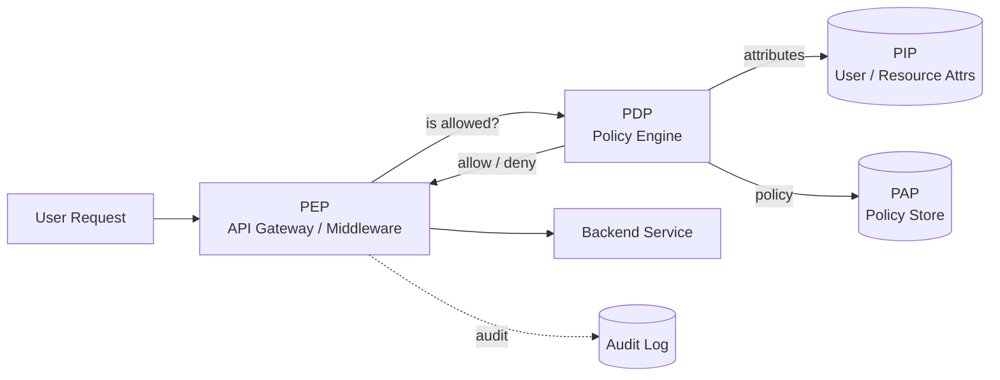
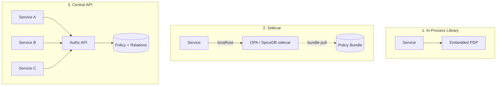

# Authorization — RBAC, ABAC, ReBAC

**Date:** 2026-04-26 | **Updated:** 2026-04-26
**Tags:** `system-design` `security` `authorization` `rbac` `abac` `zanzibar`

## Table of Contents

- [Summary](#summary)
- [Overview — Authorization Is Not Authentication](#overview--authorization-is-not-authentication)
- [Key Concepts](#key-concepts)
  - [RBAC — Role-Based Access Control](#rbac--role-based-access-control)
  - [ABAC — Attribute-Based Access Control](#abac--attribute-based-access-control)
  - [ReBAC — Relationship-Based Access Control and Zanzibar](#rebac--relationship-based-access-control-and-zanzibar)
  - [Open Policy Agent (OPA) and Rego](#open-policy-agent-opa-and-rego)
  - [Cedar — AWS's Policy Language](#cedar--awss-policy-language)
- [Centralized vs Distributed Authorization](#centralized-vs-distributed-authorization)
  - [Policy Distribution Patterns](#policy-distribution-patterns)
  - [Audit Logging](#audit-logging)
- [Trade-offs](#trade-offs)
- [Code Examples](#code-examples)
  - [Rego Policy](#rego-policy)
  - [Cedar Policy](#cedar-policy)
  - [Zanzibar Tuples and Userset Rewrite](#zanzibar-tuples-and-userset-rewrite)
- [Real-World Uses](#real-world-uses)
- [Anti-Patterns](#anti-patterns)
- [Related](#related)
- [References](#references)

## Summary

Authorization answers _"is this principal allowed to perform this action on this resource?"_ The three dominant models are **RBAC** (you have a role, the role has permissions), **ABAC** (a policy evaluates attributes of subject + resource + action + environment), and **ReBAC** (permission is derived from a graph of relationships, in the style of Google Zanzibar). Modern systems usually layer them: coarse-grained RBAC for the top-level role, ABAC for context-sensitive rules, and ReBAC when sharing models like "members of this folder" or "owners of this document" require traversing a graph. **Policy engines** — OPA/Rego, AWS Cedar, Spicedb, OpenFGA — externalize the decision so application code does not hard-code checks. The architectural axis underneath is _where_ the check runs: in-process library, sidecar, or central API.

## Overview — Authorization Is Not Authentication

The two are routinely conflated and shouldn't be.

| | Authentication | Authorization |
|---|---|---|
| Question | _Who are you?_ | _What can you do?_ |
| Output | Identity + claims | Allow / Deny + obligations |
| Failure mode | 401 Unauthorized | 403 Forbidden |
| Lifetime | Session / token | Per-request decision |
| Storage | Identity provider, JWTs, sessions | Policy store, relation store |

Authentication is solved-ish: OIDC, SAML, WebAuthn. Authorization is where most production bugs live, because it is application-specific, deeply interleaved with data, and historically baked into business logic in `if user.role == "admin"` checks scattered across the codebase.

The right mental model: a **Policy Decision Point (PDP)** evaluates a policy and returns allow/deny. A **Policy Enforcement Point (PEP)** intercepts the request and asks the PDP. A **Policy Information Point (PIP)** supplies attributes the PDP needs (user attributes, resource attributes, environmental attributes). A **Policy Administration Point (PAP)** is where humans author policy. This XACML vocabulary (PDP/PEP/PIP/PAP) is worth knowing even if you never touch XACML XML.



## Key Concepts

### RBAC — Role-Based Access Control

The 1992 Sandhu / NIST formalization. Permissions are assigned to **roles**, users are assigned to **roles**, and authorization decisions consult the user's role set.

The NIST RBAC standard (INCITS 359-2004) defines four cumulative levels:

| Level | Name | Adds |
|-------|------|------|
| 0 | Flat RBAC | Users → Roles → Permissions; many-to-many |
| 1 | Hierarchical RBAC | Role inheritance (`admin` inherits `editor` inherits `viewer`) |
| 2 | Constrained RBAC | Static and Dynamic Separation of Duties (e.g., a user cannot hold both `auditor` and `accountant`) |
| 3 | Symmetric RBAC | Permission-role review — query "who has permission X?" symmetrically with "what permissions does role Y have?" |

**Role hierarchy** is what people usually mean by "RBAC" in practice — a partial order of roles where senior roles inherit junior roles' permissions. It collapses redundant permission grants and matches how organizations actually think.

**The role explosion problem.** RBAC is fine when the access pattern is _function-of-role_. It breaks when you need to express things like "any user can edit documents they own" or "managers can view their direct reports' time-off but not peers'." To shoehorn these into RBAC, teams invent roles like `editor_of_doc_123`, `manager_of_user_456` — and the role count explodes to roughly _O(users × resources)_. At that point you have ReBAC pretending to be RBAC, badly.

When RBAC is the right answer:
- Coarse-grained, organization-wide capabilities (`admin`, `billing-manager`, `support-agent`).
- Static permissions that change rarely.
- Compliance requires "list everyone with access to X" — RBAC reports cleanly.

When RBAC stops being the right answer:
- Per-resource sharing (Drive-style "share with this person").
- Per-tenant or per-customer policies.
- Conditional rules involving time, IP, or resource state.

### ABAC — Attribute-Based Access Control

Generalizes RBAC by replacing _the role_ with _arbitrary attributes_. The decision is a function of four attribute bags:

- **Subject attributes**: user id, role, department, security clearance, MFA-recently-asserted.
- **Resource attributes**: resource type, owner, classification, region.
- **Action attributes**: read, write, delete, approve.
- **Environment attributes**: time of day, IP, request origin, risk score.

The OASIS XACML 3.0 standard codifies this with an XML policy language and the PDP/PEP/PIP/PAP architecture. XACML XML is verbose enough that almost nobody writes it by hand any more; the **architectural ideas** survived (in OPA, Cedar, AWS IAM conditions), the **syntax** mostly didn't.

ABAC's strength is fine-grained, conditional rules:

> "A doctor may read a patient record if the doctor is in the patient's care team and the request originates from a hospital network and it is not currently 02:00–05:00 unless emergency=true."

Try expressing that in roles. You can't, cleanly. ABAC handles it as a single policy with five attribute checks.

The cost is that policies become a small programming language and need their own testing, version control, and review process.

### ReBAC — Relationship-Based Access Control and Zanzibar

Authorization decisions are derived from a **graph of relationships** between subjects and objects. This is what Google Drive, Docs, YouTube, Calendar, and Cloud all run on internally — described in the **Google Zanzibar paper** (USENIX ATC 2019).

Core data model: a **relation tuple**

```
⟨object⟩ # ⟨relation⟩ @ ⟨user_or_userset⟩
```

Examples:

```
doc:readme#owner@user:alice
doc:readme#viewer@user:bob
folder:engineering#editor@group:platform-team#member
doc:readme#parent@folder:engineering
```

Every permission check becomes a graph reachability question: "is `user:bob` in the `viewer` userset of `doc:readme`?"

**Userset rewrite** is the core trick. Permissions are not stored directly — they are _computed_ from relations via a schema. A namespace config might say:

```
relation viewer = self | editor | parent->viewer
relation editor = self | owner
relation owner  = self
```

This means: a viewer of a doc is anyone directly granted viewer, OR an editor (which transitively means owner), OR a viewer of the parent folder. The rewrite engine evaluates this expression and walks the graph as needed.

Zanzibar's contributions worth remembering:

- **Zookies** — opaque consistency tokens passed with each ACL check. They let the system give read-after-write semantics for permission changes ("after revoking access, the next read must reflect the revoke") without paying for global linearizability on every read.
- **Leopard caching** — derived membership is materialized and updated incrementally so the deep graph traversals don't dominate latency.
- **Globally consistent ACLs** — Zanzibar's claim is _external consistency_ (Spanner-grade), critical for "I just removed sharing, please don't leak the doc."

**Production ReBAC engines** (open-source, all Zanzibar-inspired):

| System | Maintainer | Notes |
|--------|------------|-------|
| **SpiceDB** | Authzed | Closest-to-Zanzibar OSS implementation, schema language, Zookie-style consistency tokens (`ZedToken`). |
| **OpenFGA** | Auth0 / now CNCF | Modeling DSL, hosted by Auth0 FGA. Friendly for "share with users / groups" cases. |
| **Permify** | Permify | Similar shape, schema-driven, gRPC-first. |
| **Warrant** | acquired by WorkOS | Productised Zanzibar-style API. |
| **Ory Keto** | Ory | Earlier-generation Zanzibar implementation; less feature-rich today. |

When ReBAC is the right answer:
- Document/file-sharing semantics ("share this with that team and inherit access from the parent folder").
- Multi-tenant SaaS where each tenant has its own org chart.
- Anything where you'd otherwise generate `editor_of_x` roles per resource.

### Open Policy Agent (OPA) and Rego

OPA is a CNCF graduated, general-purpose policy engine. You write policies in **Rego** (a Datalog-flavored declarative language), feed it the request as JSON input, and it returns a decision. OPA does not care whether you are doing RBAC, ABAC, or admission control on Kubernetes manifests — the policy decides.

Deployment models:

- **Library** — embed OPA Go module in your service.
- **Sidecar** — OPA runs as `localhost` HTTP/gRPC, your service queries it.
- **Central daemon** — one OPA cluster, services hit it over the network.
- **Bundle service** — OPA pulls signed policy bundles from S3/HTTP on a schedule, so policy distribution is decoupled from policy authoring.

OPA shines for **infrastructure policy** (Kubernetes admission via Gatekeeper, Terraform plan validation via Conftest, service-mesh authz via Istio + OPA, CI policy). It is increasingly used for app-level authz too, but ReBAC engines are usually a better fit when the question is shape-of-graph rather than shape-of-attributes.

### Cedar — AWS's Policy Language

Open-sourced by AWS in 2023, Cedar is the language that Amazon Verified Permissions and (parts of) IAM use. Cedar is purpose-built for authorization, unlike OPA which is general-purpose.

Cedar's bets:

- **Strongly typed schema** — entities and attributes have declared types, validated at policy-write time.
- **Designed for analyzability** — Cedar's authors (the team behind AWS IAM) cared deeply about being able to prove properties of policies (no over-grant, no shadowing). Rego is Turing-incomplete-ish but harder to reason about; Cedar deliberately constrains expressiveness.
- **Templates and policy stores** — first-class concept of policy templates instantiated per-resource.
- **Integrates RBAC + ABAC + ReBAC primitives** — entities can have parents (group membership), conditions reference attributes, and the decision combines both.

Practical reality: Cedar is excellent if you're on AWS or want a policy language with a real type system. OPA wins on ubiquity and ecosystem (k8s, Envoy, Terraform).

## Centralized vs Distributed Authorization

Three architectural choices, each with a different latency / consistency / blast-radius trade-off.



| Pattern | Latency | Consistency | Failure blast radius | When to pick |
|---------|---------|-------------|----------------------|--------------|
| **In-process library** | < 1ms (no network) | Eventual via bundle pulls | Single service | Single-team monolith; policy is mostly RBAC/ABAC; OK with bundle freshness lag. |
| **Sidecar** | 1–5ms (loopback) | Same as central via bundle pulls | Pod-local | Microservices on k8s; want isolation but no network hop. |
| **Central API** | 5–30ms (network) | Strong (single source of truth) | Whole platform if it's down | ReBAC with shared relation graph (Zanzibar shape); compliance demanding "one place to audit". |

Zanzibar-style ReBAC is **almost always centralized** because the relation graph is global state — fanning it into every service would re-create the data-locality problem you used the graph to solve. OPA/ABAC is the opposite: policy and attributes can be distributed because each policy decision is a pure function of inputs.

### Policy Distribution Patterns

How does updated policy reach decision points?

1. **Bundle pull** — PDP polls a CDN/S3 bucket for signed policy bundles every N seconds (OPA's default). Trade-off: simple, scales infinitely, but staleness window equals poll interval.
2. **Push / streaming** — control plane streams updates to PDPs (gRPC streams, NATS, etc.). Trade-off: lower staleness, more moving parts.
3. **GitOps** — policies live in Git; CI publishes bundles. Trade-off: review and audit are free; rollback is `git revert`.
4. **Database-backed** — central API reads from the source of truth on each request (Zanzibar shape). Trade-off: zero staleness for relations, full latency cost.

### Audit Logging

A non-negotiable in any production authorization system. Every PDP decision should emit a structured audit record:

```json
{
  "timestamp": "2026-04-26T14:22:11.382Z",
  "request_id": "req_01HW...",
  "principal": "user:alice@corp.com",
  "action": "document.delete",
  "resource": "doc:readme",
  "decision": "deny",
  "policy_id": "doc-policy-v17",
  "reason": "alice is viewer, not owner",
  "context": { "ip": "10.0.0.1", "mfa_age_s": 9000 }
}
```

Why every decision, not just denies:

- **Allows are evidence too.** "Who accessed the patient record yesterday?" needs the allow log.
- **Compliance** (SOC 2, HIPAA, PCI-DSS) requires authorization audit trails.
- **Anomaly detection** runs on allow patterns (impossible-travel, role mass-grant).

Sink the audit stream into a write-optimized append-only store (Kafka → S3 / data lake, or a tamper-evident log) separate from the PDP itself, so a compromised PDP cannot rewrite history.

## Trade-offs

| Concern | RBAC | ABAC | ReBAC |
|---------|------|------|-------|
| Model coarse-grained orgs | Excellent | Awkward | Awkward |
| Conditional rules (time, IP, MFA) | Poor | Excellent | Poor |
| Per-resource sharing (Drive-like) | Pathological (role explosion) | Verbose | Native |
| "Who can access X?" query | Easy | Hard (must enumerate attrs) | Easy (graph reverse traversal) |
| Policy author audience | Admins | Security engineers | Schema authors + product engineers |
| Decision latency budget | Microseconds | Single-digit ms | Single-digit to tens of ms |
| Consistency on revoke | Trivial | Trivial | Hard (the Zanzibar problem) |

Real systems are rarely pure. A typical SaaS combines:

- **RBAC** for the org-chart layer (`workspace-admin`, `member`, `guest`).
- **ReBAC** for sharing semantics (folder/document hierarchy, group membership).
- **ABAC** for cross-cutting rules (time, IP allowlist, MFA freshness, data classification).

The art is keeping the layering legible. Pick a primary engine and let it call out to the others.

## Code Examples

### Rego Policy

A Rego policy that combines RBAC with an ABAC condition (only owners can delete, and only within working hours unless they have an `oncall` role):

```rego
package app.authz

default allow := false

# Roles → permissions (RBAC layer)
role_perms := {
  "viewer": {"read"},
  "editor": {"read", "write"},
  "owner":  {"read", "write", "delete"},
}

# RBAC: principal has the role's permission
allow if {
  some role in input.principal.roles
  input.action in role_perms[role]
  not delete_outside_hours
}

# ABAC: deletes outside working hours need oncall
delete_outside_hours if {
  input.action == "delete"
  not within_working_hours
  not "oncall" in input.principal.roles
}

within_working_hours if {
  hour := time.clock([time.now_ns(), "UTC"])[0]
  hour >= 9
  hour < 18
}
```

Input shape:

```json
{
  "principal": { "id": "alice", "roles": ["owner"] },
  "action": "delete",
  "resource": { "type": "doc", "id": "readme" }
}
```

### Cedar Policy

Same idea in Cedar — note the typed entities and the `when` clause:

```cedar
permit (
  principal in Role::"owner",
  action in [Action::"read", Action::"write", Action::"delete"],
  resource is Document
)
when {
  action != Action::"delete" ||
  context.hour >= 9 && context.hour < 18 ||
  principal in Role::"oncall"
};
```

Cedar's schema (separate file) declares that `Document` has an `owner` attribute, that `Role` is a group entity, and that `context.hour` is a long. The validator catches typos before deploy — a class of bug Rego cannot prevent.

### Zanzibar Tuples and Userset Rewrite

A document-sharing model in SpiceDB / OpenFGA-style schema language:

```
definition user {}

definition group {
  relation member: user | group#member
}

definition folder {
  relation owner:  user
  relation editor: user | group#member
  relation viewer: user | group#member
  relation parent: folder

  permission view = viewer + edit + parent->view
  permission edit = editor + owner + parent->edit
  permission delete = owner + parent->delete
}

definition document {
  relation owner:  user
  relation editor: user | group#member
  relation viewer: user | group#member
  relation parent: folder

  permission view = viewer + edit + parent->view
  permission edit = editor + owner + parent->edit
  permission delete = owner
}
```

Sample tuples written into the relation store:

```
group:platform#member@user:alice
folder:engineering#editor@group:platform#member
document:readme#parent@folder:engineering
document:readme#owner@user:bob
```

A check `document:readme#view@user:alice` returns true via this chain:

1. Alice is a member of `group:platform`.
2. `group:platform#member` is an editor of `folder:engineering`.
3. `document:readme`'s parent is `folder:engineering`.
4. The `view` permission rewrite includes `parent->view`, which includes `parent->edit`, which Alice satisfies through (1)–(3).

That graph traversal is what would otherwise become `editor_of_readme` and `editor_of_engineering` roles in a naive RBAC implementation.

## Real-World Uses

- **Google Drive / Docs / YouTube / Calendar** — Zanzibar in production. The ACL system handles billions of objects, billions of relations, billions of checks per second, with single-digit-millisecond p99 and external consistency.
- **GitHub** — internal authorization for repos, orgs, teams uses a Zanzibar-shaped service after migrating from a roles-and-membership SQL model.
- **Airbnb, Carta, Headway** — public engineering blog posts describe ReBAC migrations to OpenFGA / SpiceDB for marketplace and document-style permissions.
- **Kubernetes** — RBAC for cluster operations (verbs × resources × namespaces), with **Open Policy Agent / Gatekeeper** layered on top for ABAC-style admission policies (e.g., "no privileged containers in `prod` namespace").
- **AWS IAM** — primarily ABAC under the hood (Cedar-adjacent policy language), with conditions on tags, regions, MFA, source IP. SCP and resource policies extend this. **Amazon Verified Permissions** is Cedar exposed as a managed PDP.
- **Auth0 FGA** — hosted OpenFGA, used by SaaS products to outsource the ReBAC layer.
- **Netflix** — internal service-to-service authz used OPA broadly before custom in-house tooling.

## Anti-Patterns

- **Hard-coded `if user.role == 'admin'` checks scattered through the codebase.** The single largest source of authorization bugs. You cannot audit "what does it take to delete an invoice?" because the answer is split across 40 files. Centralize the check; the model behind it can still be RBAC, but the call site must be one function.
- **Role explosion.** Inventing a role per resource (`editor_of_doc_123`, `viewer_of_folder_456`) means you've reinvented ReBAC inside RBAC, badly. Move to a relation model.
- **Authorization decisions made client-side.** Hiding the delete button is UX; it is not security. Every action the API exposes must enforce on the server.
- **Allow-by-default policies.** Default-deny is non-negotiable. A missing rule must fail closed.
- **No audit log, or only failures logged.** Allows must be auditable. Compliance and incident response both depend on it.
- **PDP downtime takes the platform down.** A central authz API is a critical dependency; treat it like a database — replicas, regional fallbacks, request hedging, cached decisions for read-mostly resources.
- **Confusing identity propagation with authorization.** A JWT claiming `role=admin` is only as trustworthy as the issuer and verification. Re-check authorization at the resource layer, even when the gateway "already checked." Defense in depth.
- **Mixing PDP and PEP responsibilities in the same code path.** The decision logic and the enforcement logic should be separable; otherwise you cannot reuse the policy engine across services or test the decision in isolation.
- **Ignoring revocation latency.** If your design caches "alice is editor" for 5 minutes, then alice can edit for 5 minutes after you revoke. For sensitive systems use Zookie-style read-after-write tokens or cache-bust on relation change.
- **Treating ABAC as "we'll just write code in policy."** Rego and Cedar are programming languages; policies need testing (`opa test`), version control, and code review. Skipping these reproduces the same scattered-checks bug at one remove.

## Related

- [Authentication — OAuth 2.0, OIDC, and Token Security](./authentication.md) — answers "who" before authorization answers "what they can do".
- [Single Sign-On — SAML, OIDC, and Identity Federation](./single-sign-on.md) — federated identity feeds the principal-and-claims that RBAC/ABAC consume.
- [Designing an API Gateway](../case-studies/distributed-infra/design-api-gateway.md) — the API gateway is the most common Policy Enforcement Point in microservice deployments.
- [Spring Security patterns](../../java/security/spring-security-architecture.md) — JVM-side enforcement of RBAC/ABAC at the framework level.

## References

- David F. Ferraiolo and D. Richard Kuhn, ["Role-Based Access Controls"](https://csrc.nist.gov/CSRC/media/Publications/conference-paper/1992/10/13/proceedings-of-the-15th-national-computer-security-conference-1992/documents/1992-15th-NCSC-proceedings-vol-2.pdf) (NIST, 1992) — the original RBAC paper.
- ANSI INCITS 359-2004 / NIST RBAC Standard — [csrc.nist.gov/projects/role-based-access-control](https://csrc.nist.gov/projects/role-based-access-control) — formal definition of RBAC levels 0–3.
- OASIS, ["eXtensible Access Control Markup Language (XACML) Version 3.0"](https://docs.oasis-open.org/xacml/3.0/xacml-3.0-core-spec-os-en.html) (2013) — the canonical ABAC standard, source of the PDP/PEP/PIP/PAP vocabulary.
- Ruoming Pang et al., ["Zanzibar: Google's Consistent, Global Authorization System"](https://research.google/pubs/zanzibar-googles-consistent-global-authorization-system/) (USENIX ATC 2019) — the ReBAC paper.
- ["Open Policy Agent Documentation"](https://www.openpolicyagent.org/docs/latest/) — Rego language, deployment models, bundle service.
- AWS, ["Cedar Policy Language Reference"](https://docs.cedarpolicy.com/) and the [cedar-policy/cedar](https://github.com/cedar-policy/cedar) repository.
- Authzed SpiceDB documentation — [authzed.com/docs](https://authzed.com/docs) — production Zanzibar implementation, schema language, ZedTokens.
- OpenFGA documentation — [openfga.dev/docs](https://openfga.dev/docs) — modeling guide, CNCF project, hosted as Auth0 FGA.
- Sam Scott, ["Why Authorization Is Hard"](https://www.osohq.com/post/why-authorization-is-hard) (Oso, 2021) — clean tour of the design space.
- Aserto / Authzed engineering blogs — practical migration stories from RBAC-in-SQL to ReBAC.
