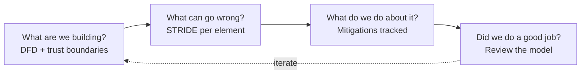
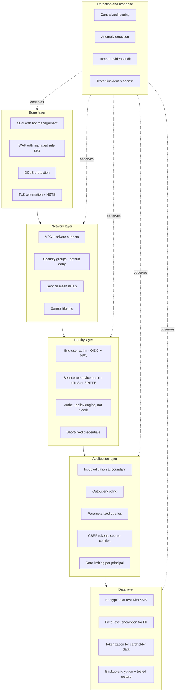
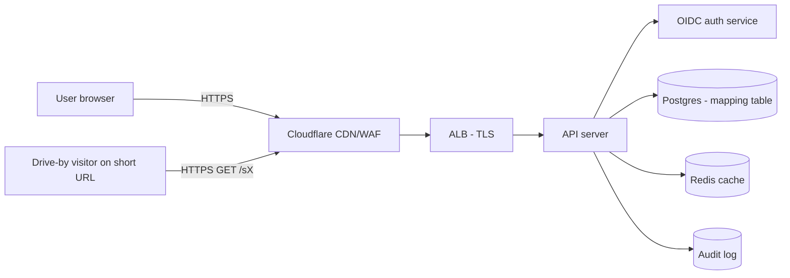
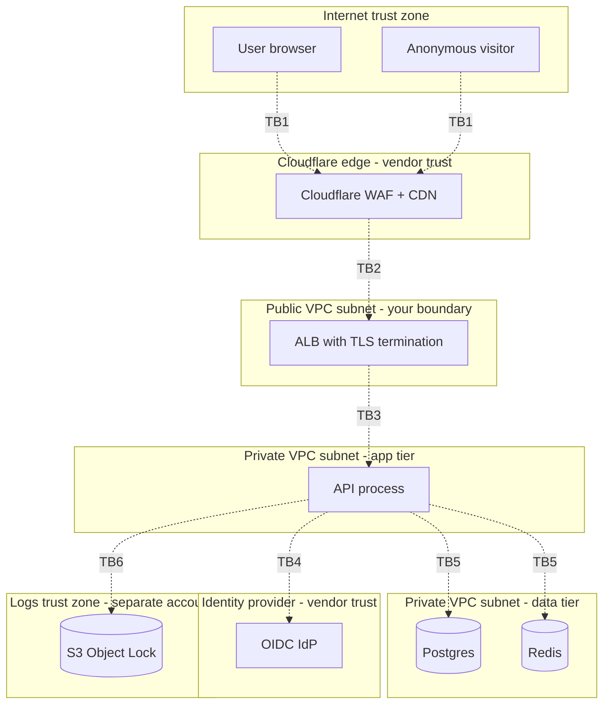

# Defense in Depth and Threat Modeling

**Date:** 2026-04-26 | **Updated:** 2026-04-26
**Tags:** `system-design` `security` `threat-modeling` `stride`

## Table of Contents

- [Summary](#summary)
- [Why This Matters](#why-this-matters)
- [Overview](#overview)
- [Defense in Depth — Multiple Independent Layers](#defense-in-depth--multiple-independent-layers)
  - [The Castle Was a Bad Metaphor](#the-castle-was-a-bad-metaphor)
  - [Fail-Safe Defaults](#fail-safe-defaults)
  - [Layer Inventory](#layer-inventory)
- [STRIDE — A Vocabulary for "What Could Go Wrong"](#stride--a-vocabulary-for-what-could-go-wrong)
  - [The Six Categories](#the-six-categories)
  - [STRIDE-per-Element vs STRIDE-per-Interaction](#stride-per-element-vs-stride-per-interaction)
- [Data-Flow Diagrams With Trust Boundaries](#data-flow-diagrams-with-trust-boundaries)
  - [The Four Symbols](#the-four-symbols)
  - [Where Trust Boundaries Actually Live](#where-trust-boundaries-actually-live)
- [Attack Surface Minimization](#attack-surface-minimization)
- [Mitigation Tracking](#mitigation-tracking)
- [PASTA and DREAD as Alternatives](#pasta-and-dread-as-alternatives)
- [Integrating Threat Modeling Into the Design Review](#integrating-threat-modeling-into-the-design-review)
- [Trade-offs](#trade-offs)
- [Worked Example — STRIDE Table for a URL Shortener](#worked-example--stride-table-for-a-url-shortener)
- [Worked Example — DFD With Trust Boundaries](#worked-example--dfd-with-trust-boundaries)
- [Real-World Uses](#real-world-uses)
- [Anti-Patterns](#anti-patterns)
- [Related](#related)
- [References](#references)

## Summary

**Defense in depth** is the principle that no single control should be a single point of compromise: layer independent controls (network, identity, application, data, monitoring) so that bypassing one still leaves attackers facing the next. **Threat modeling** is the structured exercise that decides _which_ layers a given design needs, by walking the architecture diagram and asking, for each component and each data flow, "what could go wrong?" The dominant taxonomy is Microsoft's **STRIDE** (Spoofing, Tampering, Repudiation, Information disclosure, Denial of service, Elevation of privilege), applied per-element or per-interaction over a **data-flow diagram with trust boundaries**. Threat models belong in the design review at proposal time — not after launch, because the cheapest threat to fix is one that never gets built.

## Why This Matters

Every catastrophic breach you have read about — Equifax, SolarWinds, Capital One, Target, MOVEit — has the same shape in the post-mortem. There was a single control that, when bypassed, gave the attacker the keys: an unpatched library, a forgotten S3 bucket, a flat network, an over-scoped IAM role, an SSRF that reached the metadata service. The lesson is not "patch faster." The lesson is **assume any one control will fail and design so that failure is survivable.**

Threat modeling is the engineering discipline that turns that assumption into specific decisions on a diagram:

- This trust boundary needs an authenticated mTLS hop, not just a security group.
- This S3 bucket has to be private + KMS-encrypted + with bucket policy + with VPC endpoint + logged to CloudTrail, because each layer protects against a different failure mode.
- This admin endpoint needs a separate authentication path from end-user traffic so that an end-user token compromise cannot pivot to admin.

If you cannot stand up at a whiteboard and walk a STRIDE table over a data-flow diagram with trust boundaries drawn on it, you are doing security by vibes. This doc gives you the vocabulary.

## Overview

Threat modeling sits in the Shostack four-question frame:

1. **What are we building?** (the data-flow diagram)
2. **What can go wrong?** (STRIDE / PASTA / attack trees)
3. **What are we going to do about it?** (mitigations, tracked)
4. **Did we do a good job?** (review the model itself)

Defense in depth is the answer pattern that question 3 keeps producing. STRIDE is the most common tool for question 2. The DFD with trust boundaries is the artifact behind question 1. Mitigation tracking is what keeps question 3 honest after the design review ends. PASTA and DREAD are alternative framings for risk-driven and quantitative shops. The integration story — _when_ in the SDLC the model gets done — is what determines whether any of this produces value or theater.

## Defense in Depth — Multiple Independent Layers

### The Castle Was a Bad Metaphor

The medieval castle imagery — moat, wall, keep — sells the right idea but the wrong scope. A real castle had _one_ perimeter. A real production system has dozens of perimeters, most of them inside what you would have called the castle. The Jericho Forum, NIST SP 800-207, and Google's BeyondCorp all formalized the same realization: there is no inside. Every component is on a hostile network, including the one running your own service.

Defense in depth is not "perimeter plus internal." It is **assume any individual control will fail, and lay out controls so that the failure of any one does not give the attacker the goal.** The math is the same as redundancy in availability: independent failures multiply.

- If your WAF catches 90% of injection attacks, and your parameterized queries catch 99%, then a real injection attempt has roughly a 0.1% chance of working (`0.10 * 0.01`). Each layer alone is not enough; together they are.
- The independence is what matters. Two WAFs from the same vendor with the same rule set are one layer, not two. A WAF and parameterized queries are two genuinely independent layers.

### Fail-Safe Defaults

From Saltzer and Schroeder's 1975 paper, _The Protection of Information in Computer Systems_, which is still the canonical list of design principles. The relevant ones for defense in depth:

| Principle | Meaning | Concrete |
|-----------|---------|----------|
| **Fail-safe defaults** | Access decisions default to deny | `default deny` security groups, `403` if auth check throws |
| **Least privilege** | Each component gets the minimum access it needs | scoped IAM roles, per-service DB users |
| **Separation of privilege** | Multiple conditions required for sensitive ops | MFA on admin actions, dual-control deploy approvals |
| **Complete mediation** | Every access checked, not cached | check authz on every request, not at session start |
| **Open design** | Security does not depend on attacker ignorance | publish algorithms, keep keys secret |
| **Economy of mechanism** | Keep security mechanism small and simple | small audited auth library, not a custom one |
| **Least common mechanism** | Minimize shared state across users | separate tenants, scrub temp dirs |
| **Psychological acceptability** | The right thing has to also be the easy thing | SSO with MFA, not a 17-character password rule |

These are not platitudes — they are the lenses you walk through a design with.

### Layer Inventory

For a typical web service, the independent layers are:

The point is not that every service needs all of this. The point is that the threat model decides which layers a given service _can skip_, with that decision recorded.

## STRIDE — A Vocabulary for "What Could Go Wrong"

STRIDE is a mnemonic Loren Kohnfelder and Praerit Garg invented at Microsoft in 1999. Six threat categories that map roughly to violations of the six security properties they negate.

### The Six Categories

| Letter | Threat | Property Violated | Mental Model |
|--------|--------|-------------------|--------------|
| **S** | Spoofing | Authentication | "Pretending to be someone you are not" |
| **T** | Tampering | Integrity | "Changing data you should not be able to change" |
| **R** | Repudiation | Non-repudiation | "Denying you did something, with no proof either way" |
| **I** | Information disclosure | Confidentiality | "Reading data you should not see" |
| **D** | Denial of service | Availability | "Stopping legitimate users from accessing the system" |
| **E** | Elevation of privilege | Authorization | "Doing things you should not be allowed to do" |

For each one, you ask yourself, on a per-element basis, "can this happen to this element of the system?" and "what mitigation is in place?" The classic mitigation table:

| Threat | Standard mitigations |
|--------|----------------------|
| Spoofing | Authentication: passwords + MFA, OIDC, mTLS, signed tokens (JWT/PASETO), API key with HMAC |
| Tampering | Integrity: digital signatures, MACs, TLS, write-once storage, content-addressable storage, audit logs |
| Repudiation | Audit log with append-only/immutable backing, signed receipts, tamper-evident transparency log |
| Information disclosure | Encryption (TLS in transit, KMS at rest), access control, field-level encryption, tokenization |
| Denial of service | Rate limiting, autoscaling with circuit breakers, quotas, anti-amplification, costed APIs |
| Elevation of privilege | Authorization checks at every boundary, least privilege, sandboxing, capability tokens |

### STRIDE-per-Element vs STRIDE-per-Interaction

There are two ways to apply STRIDE on a DFD. Both are taught by Microsoft; pick one and be consistent.

| Variant | Granularity | Pros | Cons |
|---------|-------------|------|------|
| **STRIDE-per-element** | Each DFD element (process, data store, external entity, data flow) is checked against the subset of STRIDE that applies to it | Tractable on large diagrams; easy to scope | Misses threats that emerge from the _interaction_ between two elements |
| **STRIDE-per-interaction** | Each pair of (source, destination, data flow) is checked against all six | More thorough; catches cross-element threats | Quadratic in elements; needs filtering to stay sane |

Which categories apply to which DFD element types in the per-element variant:

| Element type | S | T | R | I | D | E |
|--------------|---|---|---|---|---|---|
| External entity | Y |   | Y |   |   |   |
| Process | Y | Y | Y | Y | Y | Y |
| Data store |   | Y | Y* | Y | Y |   |
| Data flow |   | Y |   | Y | Y |   |

(* Data stores get repudiation only if they are the audit log itself.)

The single most useful prompt during a STRIDE walkthrough is: _"Who is the attacker for this element? Outside attacker on the internet, malicious end user with a valid account, malicious insider, supply-chain attacker, or compromised peer service?"_ The same element has different STRIDE results for different attackers.

## Data-Flow Diagrams With Trust Boundaries

A DFD is the artifact threat modeling actually runs on. The architecture diagrams that go in slide decks are usually not enough — they hide trust boundaries, conflate processes with hosts, and skip data stores. You need a DFD specifically.

### The Four Symbols

| Symbol | Element | Example |
|--------|---------|---------|
| Rectangle | External entity | User browser, third-party API, payment processor |
| Circle | Process | API server, worker, cron job, function |
| Two parallel lines | Data store | Postgres, S3 bucket, Redis cache, in-memory map |
| Arrow | Data flow | HTTPS request, SQL query, queue message |
| Dashed line | Trust boundary | The line you cross when you stop trusting the other side |

### Where Trust Boundaries Actually Live

This is the part most diagrams get wrong. A trust boundary is not "where the network changes." It is **anywhere data crosses from one trust principal to another**. The principal might be:

- A different user (your data vs another tenant's)
- A different service (your service vs the auth service)
- A different host (process boundary)
- A different network zone (DMZ vs private subnet)
- A different team (your code vs vendor SDK)
- A different process privilege level (worker vs root daemon)

Every trust boundary on a DFD demands an answer to:

- **Authentication:** how does each side know who the other is?
- **Authorization:** how does the receiving side decide whether to honor the request?
- **Validation:** what does the receiver assume about the data crossing? (Hint: nothing.)
- **Logging:** is the crossing recorded with enough context to investigate?

If a trust boundary on the diagram does not have answers to those four, you have a finding.

## Attack Surface Minimization

Attack surface is the set of input points an attacker can reach. Smaller is better. Ways to shrink it:

- **Close ports.** Bind to `127.0.0.1` for sidecars; use Unix sockets where possible.
- **Remove endpoints.** Every public endpoint is a target. Internal admin endpoints belong on a separate authenticated path or a private subnet, not behind "security through obscurity."
- **Remove features.** A debug endpoint shipped to prod is an own-goal. A dev seed route is the same.
- **Minimize image content.** Distroless or minimal base images remove `bash`, `curl`, `apt`, etc., that attackers chain.
- **Constrain inputs.** A regex on the URL is a smaller attack surface than free-form parsing.
- **Drop privileges.** Run as non-root. Drop Linux capabilities. Use seccomp.
- **Remove unused dependencies.** Every transitive dep is more code in your blast radius.

The metric to internalize: _every line of code you do not run cannot be exploited._ Defense in depth is about layering controls; surface minimization is about not signing up to defend the things you don't need.

## Mitigation Tracking

A threat model that ends as a doc nobody opens is worthless. The output of a threat model is a **list of threats with assigned mitigations and an owner per mitigation.** Treat them like any other engineering work:

- Each threat has an ID, a description, the STRIDE category, the affected element, and an attacker-of-interest.
- Each mitigation has an owner, a status (planned / in-flight / done / accepted), and a link to the PR or runbook that implements it.
- "Accepted risk" is a valid status. It needs a name attached, an expiry, and a written rationale. Otherwise it is just a forgotten threat.
- Mitigations are revisited when the design changes. New flow → re-run STRIDE on the new flow.

A simple JIRA epic or a checked-in markdown table works. The form is less important than the discipline of keeping it alive.

## PASTA and DREAD as Alternatives

STRIDE is the default but not the only game in town.

**PASTA** (Process for Attack Simulation and Threat Analysis, Tony UcedaVelez) is a seven-stage, risk-centric methodology:

1. Define business objectives
2. Define technical scope
3. Decompose the application
4. Analyze threats (against the business assets)
5. Analyze vulnerabilities
6. Analyze attacks (build attack trees)
7. Risk and impact analysis

PASTA is heavier than STRIDE but ties threats to business impact, which makes it land better with execs and auditors. Use it when the cost of a security decision needs to be argued in dollars to a non-technical sponsor.

**DREAD** (Damage, Reproducibility, Exploitability, Affected users, Discoverability) is a scoring rubric for ranking threats once you have them. Each dimension scored 0–10, summed for a 0–50 composite. Microsoft deprecated DREAD internally in 2008 because the scores were too subjective and people gamed them. CVSS v3 has largely replaced DREAD as the industry-standard severity score for individual vulnerabilities. Mention DREAD if the team brings it up; do not propose it as the primary method on a green-field model.

**Attack trees** (Bruce Schneier, 1999) are a complementary technique: pick a goal ("read another tenant's data") and decompose it into AND/OR sub-goals until the leaves are concrete steps. They pair well with STRIDE — STRIDE finds threats per-element, attack trees explore one threat in depth.

## Integrating Threat Modeling Into the Design Review

The single most important thing in this doc:

> **The threat model belongs at design review time, when the design is still a diagram.**

Not after the code is written. Not at the security review before launch. Not after the pen test. At design time. The reasons:

- **Cost.** Removing an admin endpoint at the whiteboard costs an hour. Removing it after it has clients costs a quarter.
- **Independence.** At design time, layers can still be added; after launch, every new control fights existing assumptions.
- **Influence.** A finding before code is a design change. A finding after code is a bug ticket that competes with feature work and usually loses.

Concretely, integrate by:

1. **Make a DFD a required artifact** in the design template, alongside the API surface and data model. No DFD, no review.
2. **Walk STRIDE per element** during the review meeting. 30 minutes is enough for a small service. Larger systems get a dedicated session.
3. **Capture mitigations as tickets** on the way out. Owner and date or it didn't happen.
4. **Re-trigger on diagram changes.** A new data flow or new external integration is a delta threat model, not a brand-new exercise.
5. **Use tooling that fits the team.** OWASP Threat Dragon (open-source, web), Microsoft Threat Modeling Tool (Windows-only, free, well-maintained), IriusRisk (commercial), or just a markdown table in the design doc. The tool matters less than the cadence.
6. **Have a security-aware reviewer present.** Not necessarily a full-time security engineer — a senior engineer with security training is enough for most reviews.

The maturity ladder:

| Level | What you do |
|-------|-------------|
| 0 | No threat model |
| 1 | Pen-test before launch, hope |
| 2 | Security review before launch (too late) |
| 3 | STRIDE on the design doc at proposal time |
| 4 | STRIDE + DFD as a required artifact, mitigations tracked, re-run on changes |
| 5 | Continuous threat modeling tied to architecture diagrams in source control |

Most production teams should target level 4. Level 5 needs investment in tooling but is where leading orgs are heading.

## Trade-offs

| Pull | Push back |
|------|-----------|
| More layers reduce risk | Each layer adds latency, cost, and operational complexity |
| Detailed STRIDE on every element | Diminishing returns past the high-value flows; you will run out of attention |
| Document everything | Static docs go stale; prefer diagrams in source control with reviewers |
| Threat-model everything | Triage by blast radius; payment flow gets more attention than internal cron |
| Quantitative scoring (DREAD, FAIR) | Inputs are noisy, scores look more authoritative than they are |
| Use a fancy tool | The fanciest tool nobody opens has zero value vs the markdown table they update |
| Annual threat-modeling exercise | Annual is too slow; tie to design review cadence instead |

The recurring tension: **completeness vs throughput.** A perfect threat model on every PR will block all PRs. No threat model anywhere will breach you. The middle is "structured, lightweight, at the right moment."

## Worked Example — STRIDE Table for a URL Shortener

A simple service: users sign in, submit a long URL, get a short URL, and follow short URLs back. Architecture: web/API behind ALB, Postgres for the mapping, Redis for hot lookups, Cloudflare in front.

STRIDE-per-element walkthrough (abbreviated):

| Element | Threat (STRIDE) | Description | Attacker | Mitigation |
|---------|-----------------|-------------|----------|------------|
| User browser → API | S | Attacker forges a session cookie | Outside attacker | OIDC + signed cookies + Secure/HttpOnly/SameSite |
| User browser → API | T | Attacker tampers with `POST /shorten` body | Outside | TLS to ALB, JSON schema validation server-side |
| User browser → API | R | User claims they didn't shorten an abusive URL | Malicious user | Append-only audit log with user id, IP, UA, timestamp |
| API process | I | Server logs leak full URL with secrets in query string | Insider with log access | Strip query strings before logging; redact known secret formats |
| API process | D | Bot floods `POST /shorten` to exhaust DB | Outside | WAF rate limit + per-account quota + Postgres `statement_timeout` |
| API process | E | Path traversal in admin endpoint exposes filesystem | Outside | No filesystem reads; admin on separate host with mTLS |
| Postgres data store | T | Attacker with API SQLi modifies mapping to malicious URL | Outside via API | Parameterized queries + least-privilege DB user (no DDL, no DROP) |
| Postgres data store | I | Backup tape stolen exposes all mappings | Physical/insider | KMS-managed encryption at rest, encrypted backups, key rotation |
| Postgres data store | D | Massive shorten campaign fills disk | Outside via API | Disk quotas + alert at 80% + per-user row count limit |
| Redis cache | T | Cache poisoning via race in `set-if-not-exists` | Outside | Treat cache as untrusted; revalidate on miss; TTL bound |
| Redis cache | I | Snapshot dump on shared host leaks short→long mappings | Insider | Encrypted EBS, no shared hosts, ACL between cache and other services |
| Data flow API → Postgres | I | Sniffing inside VPC reveals queries | Compromised peer host | TLS to Postgres + IAM auth + private subnet |
| External entity (Bot) | S | Bot pretends to be Googlebot for redirect cloaking | Outside | Reverse-DNS check, treat all unauth visitors equally |
| Audit log | T | Attacker after RCE rewrites log to hide tracks | Outside post-RCE | Ship logs out of process to immutable store (CloudWatch Logs + log group MFA delete, or S3 with Object Lock) |

Findings on the way out of the design review:

- Admin endpoint must move to separate host with mTLS — owner: backend lead, due: before launch.
- Audit log must ship to S3 with Object Lock — owner: SRE, due: before launch.
- Per-account shorten quota — owner: API team, due: launch+30.
- Accepted risk: short URLs are guessable by enumeration if randomness is low — mitigation is 64-bit random, not sequential — accepted by product.

## Worked Example — DFD With Trust Boundaries

Same service, now with trust boundaries drawn in. Each dashed boundary corresponds to a question set that must have answers.

| Boundary | Crossing | authn | authz | validation | logging |
|----------|----------|-------|-------|------------|---------|
| TB1 | Internet → CF | none (anon) or session cookie | rate limit per IP | WAF rules | edge logs |
| TB2 | CF → ALB | shared secret header (Cloudflare → origin) | ALB security group | TLS, HSTS | ALB access logs |
| TB3 | ALB → API | OIDC session cookie | request middleware | JSON schema | request logs |
| TB4 | API → OIDC | client cert + client secret | OIDC client scopes | OIDC spec validation | API audit log |
| TB5 | API → DB/cache | DB IAM auth or password from secrets manager | DB user with least privilege | parameterized queries | slow query log |
| TB6 | API → log store | IAM role with `PutObject` only | bucket policy + Object Lock | structured JSON | meta-log of writes |

Each row of that table is something the design review can verify exists. Missing rows are findings.

## Real-World Uses

- **AWS Well-Architected Security Pillar** explicitly calls for threat modeling at design time and references STRIDE.
- **Microsoft SDL** (Security Development Lifecycle) made STRIDE + DFD the default since the early 2000s; the public Threat Modeling Tool is the same workflow surfaced for everyone.
- **Google BeyondCorp / BeyondProd** are the industrial-scale realization of "no inside" — every service-to-service hop is mTLS-authenticated, every request authorized, every action logged.
- **PCI DSS v4** mandates threat modeling for systems handling cardholder data and explicitly lists STRIDE as an acceptable methodology.
- **Shopify, Stripe, GitHub** all publish that they run STRIDE or PASTA on new services as part of design review.
- **NIST SSDF (SP 800-218)** lists threat modeling under PW.1 (Design Software to Meet Security Requirements and Mitigate Security Risks) — i.e., during design.
- **OWASP SAMM** and **BSIMM** both use threat modeling coverage as a maturity indicator.

## Anti-Patterns

- **Single-layer security.** "We have a WAF, we're fine." A WAF is one layer. The DB user with `DROP TABLE`, the ALB open to the world, the unencrypted backup, and the production token in a Slack DM are not addressed by your WAF.
- **Threat model after launch.** Pen tests at the end find the bugs you cannot fix without a quarter of rework. Threat modeling at the start finds the design changes you can make in an hour.
- **Diagrams without trust boundaries.** An architecture diagram that does not draw trust boundaries hides the entire question STRIDE is trying to answer. If the diagram cannot tell you where authn/authz is required, the diagram is failing its job.
- **STRIDE on every element with no triage.** A complete STRIDE on a 200-element microservice graph is a doc nobody reads. Triage by blast radius first.
- **Mitigations without owners.** A list of risks with no names attached is a future post-mortem.
- **Treating "accepted risk" as a free pass.** Accepted risk needs a name, an expiry, and a written justification. Otherwise it is just deferred work.
- **Confusing the architecture diagram with the DFD.** The slide-deck diagram hides the data store, the cron, the queue, and the trust boundaries. Make a real DFD.
- **Trusting the perimeter.** "It's behind the VPN" is not a control. The only assumption that ages well is _every_ network is hostile.
- **Annual exercises.** Threat models that get refreshed once a year are wrong all year. Tie them to design changes, not the calendar.
- **Tools as substitute for thinking.** Threat Dragon, MS TM Tool, IriusRisk are scaffolding. They cannot tell you which threats matter for _your_ business; you have to.
- **Defense in depth as excuse for weak layers.** Layers must each be meaningful. Three weak layers stacked are still weak — controls have to be _independent_ to multiply.
- **Skipping repudiation because "we have logs".** Logs are necessary; tamper-evident, append-only, off-host logs are what actually prevent repudiation.

## Related

- [Zero Trust Architecture](./zero-trust-architecture.md) — the network/identity discipline that operationalizes "no inside" once your threat model has named the boundaries.
- [Encryption at Rest and in Transit](./encryption-at-rest-and-in-transit.md) — the data-layer mitigations the I (Information disclosure) and T (Tampering) columns of STRIDE keep producing.
- [Authentication](./authentication.md) — the canonical mitigation for S (Spoofing), and the prerequisite for the authorization mitigations against E (Elevation of privilege).
- [CAP, PACELC, and Consistency Models](../foundations/cap-and-consistency-models.md) — availability is a security property too; D (Denial of service) and C(AP) intersect when partitions are weaponized.

## References

- Adam Shostack, _Threat Modeling: Designing for Security_ (Wiley, 2014) — the canonical modern textbook; defines the four-question framework and STRIDE-per-element/per-interaction.
- Michael Howard and David LeBlanc, _Writing Secure Code, 2nd Edition_ (Microsoft Press, 2003) — the original STRIDE practitioner reference, still useful for the threat-mitigation pairings.
- Loren Kohnfelder and Praerit Garg, ["The Threats to Our Products"](https://adam.shostack.org/microsoft/The-Threats-To-Our-Products.docx) (Microsoft, 1999) — the internal memo that introduced STRIDE.
- Microsoft Learn, ["Threat Modeling Process"](https://learn.microsoft.com/en-us/azure/security/develop/threat-modeling-tool-threats) and ["Microsoft Threat Modeling Tool"](https://learn.microsoft.com/en-us/azure/security/develop/threat-modeling-tool) — current Microsoft documentation including the Threat Modeling Tool.
- OWASP, ["Threat Modeling Process"](https://owasp.org/www-community/Threat_Modeling_Process) and ["Threat Modeling Cheat Sheet"](https://cheatsheetseries.owasp.org/cheatsheets/Threat_Modeling_Cheat_Sheet.html).
- OWASP Threat Dragon — [owasp.org/www-project-threat-dragon](https://owasp.org/www-project-threat-dragon/) — open-source threat modeling tool.
- Tony UcedaVelez and Marco M. Morana, _Risk Centric Threat Modeling: Process for Attack Simulation and Threat Analysis_ (Wiley, 2015) — the PASTA reference.
- Bruce Schneier, ["Attack Trees"](https://www.schneier.com/academic/archives/1999/12/attack_trees.html) (Dr. Dobb's Journal, 1999) — the original attack-tree paper.
- Jerome Saltzer and Michael Schroeder, ["The Protection of Information in Computer Systems"](https://www.cs.virginia.edu/~evans/cs551/saltzer/) (Proceedings of the IEEE, 1975) — the eight design principles, including fail-safe defaults and least privilege.
- NIST SP 800-154, ["Guide to Data-Centric System Threat Modeling"](https://csrc.nist.gov/pubs/sp/800/154/ipd) — government-flavored threat modeling guidance.
- NIST SP 800-207, ["Zero Trust Architecture"](https://csrc.nist.gov/pubs/sp/800/207/final) — the formal zero-trust definition that complements defense-in-depth thinking.
