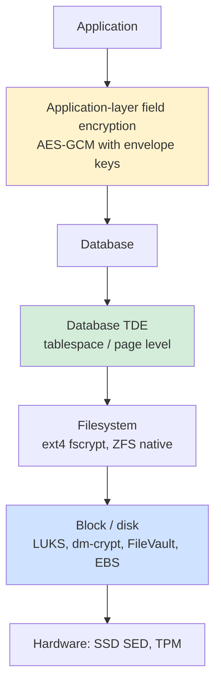
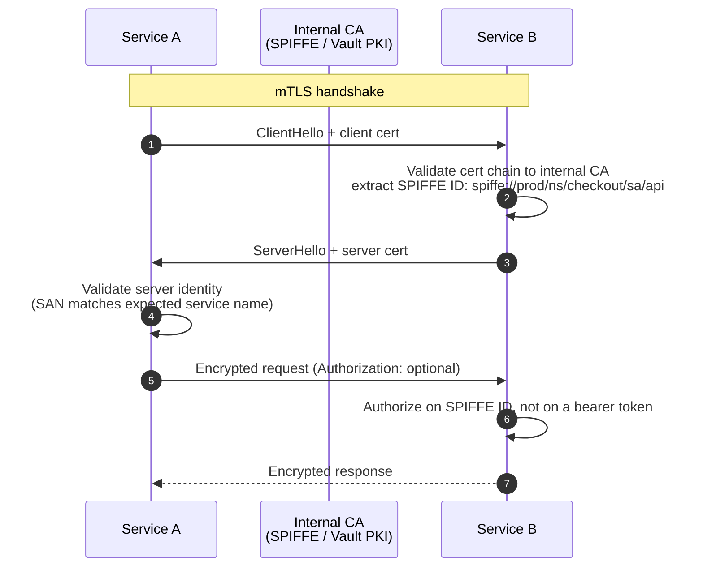
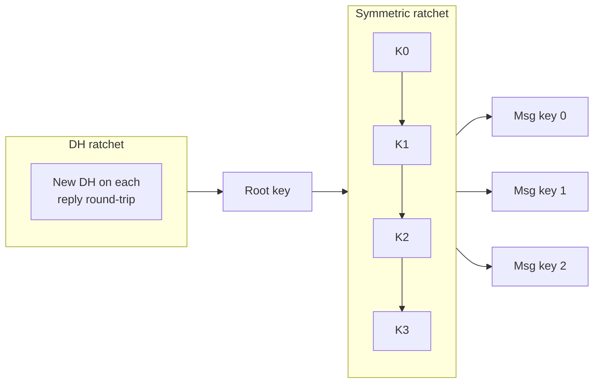
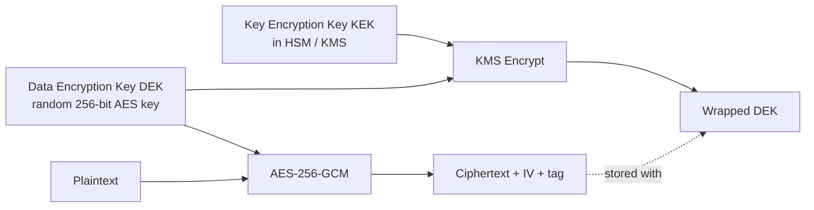
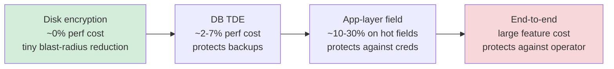
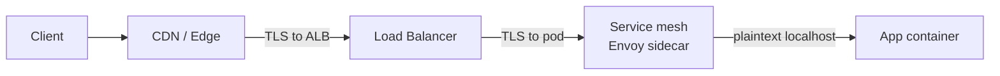

# Encryption at Rest and in Transit

**Date:** 2026-04-26 | **Updated:** 2026-04-26
**Tags:** `system-design` `security` `encryption` `tls` `kms`

## Table of Contents

- [Summary](#summary)
- [Overview](#overview)
- [Key Concepts](#key-concepts)
  - [At-Rest Encryption Layers](#at-rest-encryption-layers)
  - [In-Transit Encryption — TLS 1.2 / 1.3](#in-transit-encryption--tls-12--13)
  - [mTLS for Service-to-Service](#mtls-for-service-to-service)
  - [End-to-End Encryption and the Signal Double Ratchet](#end-to-end-encryption-and-the-signal-double-ratchet)
  - [KMS-Backed Envelope Encryption](#kms-backed-envelope-encryption)
  - [BYOK and HYOK](#byok-and-hyok)
  - [Deterministic vs Randomized Encryption](#deterministic-vs-randomized-encryption)
  - [Client-Side vs Server-Side Encryption](#client-side-vs-server-side-encryption)
- [Trade-offs](#trade-offs)
  - [Performance vs Blast Radius](#performance-vs-blast-radius)
  - [Where to Encrypt](#where-to-encrypt)
  - [TLS Termination Strategy](#tls-termination-strategy)
  - [Certificate Rotation](#certificate-rotation)
- [Code Examples](#code-examples)
  - [Node.js TLS Server with mTLS](#nodejs-tls-server-with-mtls)
  - [AWS S3 SSE-KMS with Envelope Encryption](#aws-s3-sse-kms-with-envelope-encryption)
  - [Application-Layer AES-GCM Field Encryption](#application-layer-aes-gcm-field-encryption)
- [Real-World Uses](#real-world-uses)
- [Anti-Patterns](#anti-patterns)
- [Related](#related)
- [References](#references)

## Summary

Encryption is layered. **At rest** spans disk-level (LUKS, FileVault, EBS), filesystem, database TDE, and application-layer field encryption — each with a different blast radius and performance cost. **In transit** is overwhelmingly TLS 1.2/1.3 today, with **mTLS** for service-to-service authentication inside the mesh and **end-to-end** protocols (Signal's double ratchet) for the strongest property: even the operator cannot read the plaintext. The lever that ties it all together in production is **envelope encryption** under a KMS — a hierarchy of data keys wrapped by a key-encryption key — which is what gives you scalable rotation, per-tenant isolation, and audit trails. Most "homegrown crypto" disasters come from picking the wrong layer (or all of them) and from using primitives like ECB or CBC without authentication. The right answer is almost always: TLS 1.3 in transit, AES-256-GCM at rest under a KMS-managed envelope, and resist the urge to re-encrypt at every layer.

## Overview

In a design review someone will say "we'll encrypt the database" or "we have TLS so we're safe." Both are true and neither is sufficient. Encryption is a defense-in-depth posture, not a checkbox. The questions that matter:

- **What threat are we defending against?** A stolen laptop (disk encryption suffices), a stolen backup tape (TDE suffices), a compromised app server with DB credentials (TDE does *not* help — you need application-layer encryption), or a malicious cloud operator (only client-side encryption with externally-held keys helps).
- **Where do keys live and who can read them?** Encryption is a key-management problem. The actual ciphertext primitives are the easy part.
- **How do we rotate keys without rewriting petabytes?** Envelope encryption — rotate the master key, leave data keys alone.
- **What does the data need to be searchable on?** Randomized encryption breaks indexing; deterministic encryption preserves it but leaks frequency. There's no free lunch.
- **Is end-to-end actually required, and what does it cost in features?** E2EE means you cannot search, server-side rank, or do offline processing on the data. Most products that "go E2EE" without thinking discover this at the worst time.

The goal here is to give you the precise vocabulary to make those calls and to flag the anti-patterns (homegrown XOR, ECB-mode penguins, certs that never rotate, encrypting everything six times) that show up in real systems.

## Key Concepts

### At-Rest Encryption Layers

There are at least four distinct places you can encrypt data at rest. Each defends a different threat and costs differently.



| Layer | Example | Defends against | Does NOT defend against |
|-------|---------|-----------------|--------------------------|
| **Disk / block** | LUKS, dm-crypt, BitLocker, FileVault, AWS EBS encryption, GCP persistent-disk encryption | Stolen physical disk, decommissioned drive, lost laptop | A live OS — the disk is unlocked while the system is running |
| **Filesystem** | ext4 fscrypt, ZFS native encryption, APFS | Per-user key separation on shared host; offline forensics | Same: the FS layer is open for any process running as the right user |
| **Database TDE** | SQL Server TDE, Oracle TDE, AWS RDS encryption (uses KMS), PostgreSQL pgcrypto-on-tablespace patterns | Stolen DB files, stolen backup, stolen storage snapshot | A SQL injection, a leaked DB credential, a malicious DBA — TDE keys are loaded into the running DB |
| **Application field-level** | AES-GCM with KMS-wrapped data keys, encrypting `pii.ssn` before INSERT | Stolen DB, leaked DB credential, malicious DBA, accidental log dump, dev with prod read access | A compromised app server holding the data key in memory |

The first rule: **TDE protects against a stolen backup, not a stolen credential.** If your threat model is "an attacker steals a credential and runs `SELECT * FROM users`", TDE does nothing — the database happily decrypts on the way out. Application-layer encryption is the only thing that helps.

The second rule: **disk encryption is table-stakes**. AWS, GCP, and Azure all enable it by default in 2026. There is no scenario where you should ship without it.

### In-Transit Encryption — TLS 1.2 / 1.3

TLS is the boring, universal answer. The interesting question is which version and how.

**TLS 1.3** (RFC 8446, August 2018) is the current default. Key wins over 1.2:

- **One round-trip handshake** (1-RTT) instead of two; **0-RTT resumption** for repeat connections (with replay caveats).
- **AEAD-only ciphers**. The legacy cipher suites that caused most TLS attacks (RC4, 3DES, CBC-mode, RSA key exchange, static DH) are gone from the spec.
- **Forward secrecy by default** — every session uses ephemeral (EC)DHE keys.
- **Encrypted handshake** from the ServerHello onward; only the ClientHello and a few extensions are visible.
- **No renegotiation, no compression** — both were attack surfaces (CRIME, Logjam, etc.).

**TLS 1.2** (RFC 5246, August 2008) is still widely supported and required by some compliance regimes that name specific cipher suites. If you must support it, restrict to AEAD suites: `ECDHE-ECDSA-AES128-GCM-SHA256`, `ECDHE-RSA-AES128-GCM-SHA256`, `ECDHE-ECDSA-CHACHA20-POLY1305`, etc. Disable everything CBC, RC4, 3DES, export, and anonymous.

**TLS 1.0 / 1.1** are deprecated by RFC 8996 (March 2021). Turn them off. PCI-DSS has required this since 2018.

**Operational defaults that should not be controversial in 2026:**

- TLS 1.3 preferred, TLS 1.2 only with AEAD suites as fallback.
- HSTS with `max-age` ≥ 6 months and `includeSubDomains`; consider preload.
- OCSP stapling enabled.
- Certificates from a public ACME-compatible CA (Let's Encrypt, ZeroSSL, Google Trust Services), automated rotation.
- Internal services on a private CA (Vault PKI, AWS Private CA, smallstep), short-lived certs (24h–7d).

### mTLS for Service-to-Service

Mutual TLS — both sides present and validate certificates — is the standard service-to-service authentication primitive in service meshes (Istio, Linkerd, Consul Connect, AWS App Mesh) and in zero-trust architectures.



Why mTLS instead of (or in addition to) bearer tokens:

- **Mutual authentication at the connection layer.** No "did you remember to validate the JWT" footgun in every service.
- **Identity bound to a workload, not a secret in a config map.** SPIFFE/SPIRE issues short-lived (typically 1h) SVIDs; rotation is automatic and continuous.
- **Cleaner authorization story** — Envoy/Istio policies can match on `principal: spiffe://...` rather than parsing tokens in app code.
- **Defense against credential theft in the cluster** — even if an attacker gets a service's cert, it expires in an hour and cannot be exfiltrated for long-term abuse.

Caveats:

- Cert distribution and rotation must be automated. A homegrown internal-CA-with-yearly-rotation is worse than no mTLS.
- Most service meshes implement mTLS as a sidecar; understand the perf overhead (~1–5% latency, modest CPU) and the failure modes (sidecar crash = no traffic).
- mTLS is **authentication**, not **authorization**. You still need policy.

### End-to-End Encryption and the Signal Double Ratchet

End-to-end encryption is the property that **only the endpoints can read plaintext** — the server can route, store, and replicate ciphertext but never decrypt it. Used in Signal, WhatsApp, iMessage (Apple), Matrix, modern Zoom E2EE mode, 1Password, etc.

The Signal Protocol (Open Whisper Systems, 2013, evolved from OTR and SCIMP) is the reference design and the building block under WhatsApp and Signal. Two pieces:

1. **X3DH (Extended Triple Diffie-Hellman)** — initial key agreement using identity keys + signed prekeys + one-time prekeys, allowing async messaging (recipient is offline).
2. **Double Ratchet** — per-message key derivation that combines a Diffie-Hellman ratchet (every reply rotates DH keys) with a symmetric KDF chain ratchet (every message advances a chain).



Properties this gives you:

- **Forward secrecy** — compromise of current keys does not let you decrypt past messages.
- **Post-compromise security (self-healing)** — once both parties communicate again, future messages are safe even after a temporary compromise.
- **Async-friendly** — first message can be sent to an offline recipient using their published prekey bundle.

When E2EE is the right tool: any time the server operator should not be able to read user content (messaging, password managers, secure docs, health records in some regimes). When it is the wrong tool: anything that requires server-side search, ranking, or content moderation. Apple, Meta, and others have spent years on workarounds (client-side search indexes, encrypted similarity hashes, homomorphic computation) — all expensive.

### KMS-Backed Envelope Encryption

Envelope encryption is the production pattern for at-rest encryption at scale. The idea: **encrypt data with a data key, encrypt the data key with a master key, store the wrapped data key alongside the ciphertext**.



Why this pattern wins everywhere (AWS KMS, GCP KMS, Azure Key Vault, HashiCorp Vault Transit, Tink):

- **The KEK never leaves the HSM.** All KEK operations happen inside FIPS 140-2/3 hardware. You only call `Encrypt` / `Decrypt` on small (≤4 KB) data keys.
- **Rotation is cheap.** Rotate the KEK and either re-wrap data keys lazily on next access or in a background job. You do not re-encrypt the underlying data.
- **Per-tenant / per-row keys are practical.** You can mint a fresh DEK per user, per file, per row, because wrapping is fast.
- **Audit + access control move to the KMS.** Every decrypt is logged; IAM policy controls which roles can call `Decrypt`.
- **Throughput.** Bulk symmetric AES-GCM happens locally; only the tiny wrap/unwrap round-trips KMS.

The decryption path:

1. Read ciphertext blob and the wrapped DEK from storage.
2. Call KMS `Decrypt(wrappedDEK)` → get plaintext DEK.
3. AES-GCM decrypt locally with that DEK.
4. Zero out the DEK in memory.

KMS caching: cache decrypted DEKs in memory for a bounded time (seconds to minutes) to avoid hammering KMS. AWS Encryption SDK ships a cache with explicit safety bounds (max age, max bytes encrypted, max messages encrypted per DEK).

### BYOK and HYOK

| Model | Who generates the key | Where the key lives | Who can use the key |
|-------|------------------------|---------------------|----------------------|
| **CSP-managed** | Cloud provider | Provider HSM | Provider services on your behalf |
| **CMK** (customer master key) | You, in provider HSM | Provider HSM | You + provider services you grant |
| **BYOK** (bring your own key) | You, externally | Imported into provider HSM | Provider services on your behalf |
| **HYOK** (hold your own key) | You | Your HSM, never leaves | Only your services that can reach your HSM |

The trade is **operational control vs feature completeness**:

- **CSP-managed / CMK:** all cloud features (e.g., RDS encryption, S3 SSE-KMS, EBS encryption, Snowflake auto-encryption) work. The cloud provider has access in the sense that they run the HSM.
- **BYOK:** appeals to compliance ("we generated the key in our HSM and imported it") but does not actually change who can call `Decrypt`. The CSP can still use it on your behalf — that is the point.
- **HYOK:** the cloud literally cannot decrypt without round-tripping to your HSM. Many cloud features stop working — anything that needs the cloud service itself to read the data (server-side encryption with cloud-readable keys, search indexing, replication) breaks. Used by orgs with hard regulatory constraints (some EU public-sector workloads, certain financial regulators).

In practice, most companies choose **CMK with strict IAM** rather than BYOK or HYOK, because the operational cost of HYOK is enormous and BYOK gives an audit story without changing the security posture meaningfully.

### Deterministic vs Randomized Encryption

For a given key, **randomized encryption** produces a different ciphertext for the same plaintext (because of a random IV/nonce). **Deterministic encryption** produces the same ciphertext for the same plaintext.

| Property | Randomized (e.g., AES-GCM with random IV) | Deterministic (e.g., AES-SIV, AES-GCM-SIV with fixed nonce, FPE) |
|----------|--------------------------------------------|------------------------------------------------------------------|
| Equality search on ciphertext | No | Yes |
| Index / unique constraint on ciphertext | No | Yes |
| Range search | No | No (need OPE/ORE, which leak more) |
| Frequency leakage | None | **Yes — same plaintext = same ciphertext** |
| Use case | Default for blob/file/field encryption | Email lookup, tokenization, deterministic joins |

The frequency leakage is real: if you deterministically encrypt a `country` column, the attacker who steals the DB sees that one ciphertext appears 60% of the time and can guess "United States." For low-cardinality fields, deterministic encryption is **not safe** even though the bytes are encrypted.

Modern best practice:

- **Default: AES-256-GCM with a random 96-bit nonce** (RFC 5116). Treat it as "encrypted blob."
- **Need equality search:** AES-GCM-SIV (RFC 8452) or AES-SIV (RFC 5297) with a per-column key. Tokenize, do not deterministically encrypt high-frequency fields.
- **Need range search:** consider not encrypting at all and relying on TDE plus access control, or use a vetted searchable-encryption library — and accept the leakage.

### Client-Side vs Server-Side Encryption

Concretely with S3:

| Mode | Who holds the key | Who encrypts | Notes |
|------|--------------------|---------------|-------|
| **SSE-S3** | AWS, fully managed | S3 service, transparent | Default-on for new buckets since 2023. Zero config. |
| **SSE-KMS** | AWS KMS (your CMK) | S3 service, calls KMS | Per-object IAM via KMS; auditable; per-bucket key option amortizes KMS calls. |
| **DSSE-KMS** | AWS KMS | S3 service, double layer | Dual-layer for compliance regimes that require it. |
| **SSE-C** | You (provided per request) | S3 service, you ship the key in the request | You manage keys; AWS sees the key in transit briefly. |
| **CSE** (client-side) | You | Your client, before upload | S3 sees only ciphertext. AWS Encryption SDK or KMS-backed envelope. |

The decision tree:

- **No threat model beyond "stolen disk":** SSE-S3 is fine.
- **Need per-tenant key separation, audit trail, IAM control:** SSE-KMS with a per-tenant CMK or per-tenant data key under one CMK.
- **Server must not see plaintext at all:** CSE (client-side encryption). You also lose S3 features that need to read the object — Athena/Select on the ciphertext, server-side replication of plaintext, etc.

## Trade-offs

### Performance vs Blast Radius



The right answer scales with the data's sensitivity:

- **Logs, telemetry, analytics tables:** disk + TDE. App-layer encryption here is overhead with no threat-model justification.
- **PII (email, name, address):** disk + TDE + per-row randomized AES-GCM on the actual PII columns under a KMS envelope.
- **Secrets (API tokens, OAuth refresh tokens, payment cards):** application-layer encryption in a Vault Transit / KMS-backed envelope, **never** stored decrypted on disk. PCI-DSS and similar regimes require this regardless of TDE.
- **Health records, private messages:** consider E2EE; if not E2EE, application-layer encryption with strict IAM and per-record audit.

### Where to Encrypt

The opposite anti-pattern of "do nothing" is "encrypt at every layer." Fully encrypted data still needs to be readable by the application; six layers of encryption mean six places to leak a key and six places where rotation can break.

A defensible design has at most:

1. **Disk encryption** (table-stakes, near-free).
2. **TLS in transit** (always).
3. **One application-layer encryption pass** for explicitly sensitive fields, under a KMS envelope.

Application-layer encryption when the database already has TDE makes sense **only** for columns where the threat model says the DB credential or DBA is in scope. Encrypting `users.created_at` at the app layer is theatre.

### TLS Termination Strategy

Where TLS terminates determines who sees plaintext on the wire.



Common patterns:

- **Edge termination at CDN/LB, plaintext internal.** Simplest. Acceptable if the internal network is trusted. Increasingly out of fashion under zero-trust.
- **Edge termination + re-encryption to backend.** TLS to LB, fresh TLS LB→app. Defends against passive sniffing inside the VPC. Most common pattern in 2026.
- **Pass-through TLS to backend (TLS terminated only at app).** Required when app must see the client cert (mTLS to end users) or when edge is untrusted. LB does TCP-mode load balancing only.
- **Service mesh mTLS (Istio/Linkerd).** Sidecar terminates and re-originates TLS. App sees plaintext on localhost. Standard pattern for modern Kubernetes.

Pick based on:
- Compliance ("encryption in transit at all hops" is common in finance/healthcare → re-encrypt or mesh).
- Whether the app needs the client cert (pass-through or pass the cert via header from the LB).
- Operational tolerance for cert sprawl (mesh handles this automatically).

### Certificate Rotation

Manual cert rotation is a major operational hazard — **every major outage list includes a "we forgot to rotate the cert" incident**. The 2025 baseline:

**Public certs (user-facing):**
- ACME via Let's Encrypt, ZeroSSL, or Google Trust Services. 90-day certs, auto-renewed at ~60 days.
- Validation via DNS-01 (preferred for wildcards and multi-region) or HTTP-01.
- Tooling: cert-manager on Kubernetes, certbot on bare metal/VMs, AWS ACM (free, auto-rotated, AWS-only services), Caddy (auto-TLS by default).
- Monitoring: alert at 30 days remaining; alert at 7 days as a hard pager.

**Internal certs (service-to-service):**
- Internal CA: HashiCorp Vault PKI, AWS Private CA, smallstep CA, SPIRE.
- Short-lived (24h–7d), auto-rotated continuously by sidecar/agent. With SPIFFE/SPIRE, typical SVID lifetime is 1 hour.
- Hierarchy: offline root CA → online intermediate CA → workload-issuing CA. Compromise of the issuing CA does not destroy the root.
- Pin on SPIFFE ID, not on the cert itself, so rotation is invisible to the consumer.

Common mistakes:
- Long-lived (1y+) internal certs that never rotate, with private keys mounted into every pod via a config map.
- Cert pinning in mobile apps with no rotation strategy → the day the cert expires, every installed app breaks.
- Manual ACME renewal scripts not running because cron silently failed.
- Rotating the cert but not the private key.

## Code Examples

### Node.js TLS Server with mTLS

A minimal TLS 1.2/1.3 server requiring client certs, validating them against an internal CA. Production code would also pin on SAN/SPIFFE ID, log connection attempts, and use proper key storage.

```typescript
import https from 'node:https';
import fs from 'node:fs';

const server = https.createServer(
  {
    key: fs.readFileSync('/etc/ssl/private/server.key'),
    cert: fs.readFileSync('/etc/ssl/certs/server.crt'),
    ca: fs.readFileSync('/etc/ssl/certs/internal-ca.crt'),
    requestCert: true,
    rejectUnauthorized: true,
    minVersion: 'TLSv1.2',
    // TLS 1.3 cipher suites are not configurable by name in Node;
    // they are negotiated automatically. Only set ciphers for TLS 1.2.
    ciphers: [
      'ECDHE-ECDSA-AES256-GCM-SHA384',
      'ECDHE-RSA-AES256-GCM-SHA384',
      'ECDHE-ECDSA-CHACHA20-POLY1305',
      'ECDHE-RSA-CHACHA20-POLY1305',
    ].join(':'),
    honorCipherOrder: true,
  },
  (req, res) => {
    const cert = (req.socket as import('node:tls').TLSSocket).getPeerCertificate();
    if (!cert || !cert.subject) {
      res.writeHead(401);
      res.end('client cert required');
      return;
    }
    // SPIFFE ID is in the URI SAN: spiffe://prod/ns/checkout/sa/api
    const spiffeId = cert.subjectaltname
      ?.split(', ')
      .find((s) => s.startsWith('URI:spiffe://'))
      ?.slice(4);
    if (!spiffeId?.startsWith('spiffe://prod/ns/checkout/')) {
      res.writeHead(403);
      res.end('not authorized');
      return;
    }
    res.writeHead(200, { 'content-type': 'application/json' });
    res.end(JSON.stringify({ caller: spiffeId }));
  }
);

server.listen(8443);
```

Notes:
- `requestCert: true` + `rejectUnauthorized: true` is what makes this *mutual* TLS. Drop the second flag and you have one-way TLS that just happens to ask for a cert.
- TLS 1.3 cipher suites in Node use `tls.DEFAULT_CIPHERS` and are not selected by the legacy `ciphers` option; that option only affects 1.2.
- Do not load private keys from disk in real deployments. Use a secrets manager or a sidecar that mounts ephemeral material (SPIRE agent, cert-manager).

### AWS S3 SSE-KMS with Envelope Encryption

S3 SSE-KMS is the right default for sensitive S3 buckets. Per-bucket keys (`BucketKeyEnabled: true`) reduce KMS API calls dramatically.

```typescript
import {
  S3Client,
  PutObjectCommand,
  GetObjectCommand,
  PutBucketEncryptionCommand,
} from '@aws-sdk/client-s3';

const s3 = new S3Client({ region: 'us-east-1' });

// One-time bucket-level config: SSE-KMS with bucket key.
await s3.send(
  new PutBucketEncryptionCommand({
    Bucket: 'sensitive-uploads',
    ServerSideEncryptionConfiguration: {
      Rules: [
        {
          ApplyServerSideEncryptionByDefault: {
            SSEAlgorithm: 'aws:kms',
            KMSMasterKeyID: 'arn:aws:kms:us-east-1:111122223333:key/abcd-1234',
          },
          BucketKeyEnabled: true, // amortizes KMS calls per object
        },
      ],
    },
  })
);

// Per-object override (e.g., per-tenant key)
await s3.send(
  new PutObjectCommand({
    Bucket: 'sensitive-uploads',
    Key: `tenants/${tenantId}/upload.bin`,
    Body: payload,
    ServerSideEncryption: 'aws:kms',
    SSEKMSKeyId: tenantCmkArn,
    SSEKMSEncryptionContext: Buffer.from(
      JSON.stringify({ tenantId, purpose: 'upload' })
    ).toString('base64'),
  })
);

// Read — S3 unwraps with KMS automatically; IAM must allow kms:Decrypt.
const obj = await s3.send(
  new GetObjectCommand({
    Bucket: 'sensitive-uploads',
    Key: `tenants/${tenantId}/upload.bin`,
  })
);
```

The encryption context is the killer feature: it is bound into the KMS authorization decision and shows up in CloudTrail, so a stolen wrapped key cannot be unwrapped without claiming the right tenant.

### Application-Layer AES-GCM Field Encryption

For field-level encryption with a KMS-backed envelope, using Node's built-in crypto. The DEK comes from KMS `GenerateDataKey`; only the wrapped form is stored.

```typescript
import { createCipheriv, createDecipheriv, randomBytes } from 'node:crypto';
import { KMSClient, GenerateDataKeyCommand, DecryptCommand } from '@aws-sdk/client-kms';

const kms = new KMSClient({});
const KEY_ID = 'arn:aws:kms:us-east-1:111122223333:key/abcd-1234';

interface SealedField {
  ciphertext: Buffer; // AES-GCM ciphertext
  iv: Buffer;         // 96-bit nonce
  tag: Buffer;        // 128-bit auth tag
  wrappedDek: Buffer; // KMS-wrapped data key
  keyId: string;      // KMS CMK that wrapped the DEK
}

export async function seal(plaintext: string, ctx: Record<string, string>): Promise<SealedField> {
  const { Plaintext: dek, CiphertextBlob: wrappedDek } = await kms.send(
    new GenerateDataKeyCommand({
      KeyId: KEY_ID,
      KeySpec: 'AES_256',
      EncryptionContext: ctx,
    })
  );
  if (!dek || !wrappedDek) throw new Error('KMS did not return a key');

  const iv = randomBytes(12);
  const cipher = createCipheriv('aes-256-gcm', Buffer.from(dek), iv);
  const ciphertext = Buffer.concat([cipher.update(plaintext, 'utf8'), cipher.final()]);
  const tag = cipher.getAuthTag();

  // Best-effort zeroization of the DEK we held briefly.
  Buffer.from(dek).fill(0);

  return { ciphertext, iv, tag, wrappedDek: Buffer.from(wrappedDek), keyId: KEY_ID };
}

export async function open(sealed: SealedField, ctx: Record<string, string>): Promise<string> {
  const { Plaintext: dek } = await kms.send(
    new DecryptCommand({
      CiphertextBlob: sealed.wrappedDek,
      EncryptionContext: ctx,
      KeyId: sealed.keyId,
    })
  );
  if (!dek) throw new Error('KMS unwrap failed');

  const decipher = createDecipheriv('aes-256-gcm', Buffer.from(dek), sealed.iv);
  decipher.setAuthTag(sealed.tag);
  const plaintext = Buffer.concat([decipher.update(sealed.ciphertext), decipher.final()]).toString('utf8');

  Buffer.from(dek).fill(0);
  return plaintext;
}
```

Critical details:
- AES-256-GCM. Never CBC without HMAC. Never ECB.
- 96-bit random nonce per encryption — a repeated nonce under the same key destroys GCM. With a 96-bit random nonce, you can encrypt ~2^32 messages under one key before nonce-reuse risk becomes meaningful (NIST SP 800-38D).
- Encryption context (`ctx`) is part of GCM additional authenticated data via KMS and binds the ciphertext to a tenant/record — replay protection at the field level.
- For very high-volume fields, cache decrypted DEKs (not plaintexts) under bounded TTL using the AWS Encryption SDK's caching CMM rather than rolling your own.

## Real-World Uses

- **AWS service-side encryption.** S3, EBS, RDS, DynamoDB, Lambda envvars, Secrets Manager — all use KMS envelope encryption under the hood. CloudTrail logs every `kms:Decrypt` call. Default-on for most services since 2023.
- **Signal, WhatsApp, iMessage.** Double Ratchet + X3DH for messaging E2EE. WhatsApp has run this at billions-of-users scale since 2016.
- **1Password, Bitwarden.** Client-side derived keys (PBKDF2/Argon2 from master password) wrap per-vault data keys; server stores only ciphertext. The "secret key" in 1Password is a second factor mixed into the KDF specifically so a server breach plus a weak password is not enough.
- **Stripe.** Application-layer encryption of card data with HSM-backed keys per PCI-DSS requirement 3.5; TDE alone would not satisfy the standard.
- **Apple iCloud Advanced Data Protection (2022+).** Optional E2EE for iCloud Backup, Photos, Notes. Trade-off: cannot recover via Apple if you lose your devices and recovery key.
- **Google Cloud External Key Manager (EKM).** HYOK pattern for BigQuery, GCE, GCS. Used by some banks where the regulator forbids cloud-held keys.
- **Cloudflare, Fastly.** Edge TLS termination at hundreds of POPs with auto-rotated certs; backend re-encryption to origin via configurable keep-alive TLS.
- **HashiCorp Vault Transit.** "Encryption-as-a-service" pattern: app calls `transit/encrypt/<key>` rather than holding any key material. Powers many fintech / health app field-encryption layers.
- **Service meshes (Istio, Linkerd, Consul).** Automatic mTLS with SPIFFE IDs for service identity, certificate rotation handled by the control plane.

## Anti-Patterns

- **Homegrown crypto.** "We XOR'd the data with a key" or "we built our own block cipher." If you are not Bruce Schneier, you are wrong. Use a vetted library (Tink, libsodium, AWS Encryption SDK, Vault Transit). Never `Math.random()` for keys.
- **ECB mode.** AES-ECB encrypts identical blocks identically — the famous "ECB Penguin" image leaks structure through ciphertext. Default to AES-GCM (or ChaCha20-Poly1305).
- **Unauthenticated CBC.** AES-CBC without HMAC is malleable and vulnerable to padding-oracle attacks. If you must use CBC, encrypt-then-MAC. Better: use AEAD (GCM or ChaCha20-Poly1305) and stop thinking about it.
- **Reused nonces / IVs.** Hardcoded IV, sequential counter without per-key partitioning, or `IV = 0`. Under GCM this leaks the authentication key. Always 96 random bits per message, or a properly partitioned counter.
- **Encrypting passwords.** Passwords are *hashed* with a memory-hard KDF (Argon2id, scrypt, bcrypt). Encrypted passwords mean reversible passwords mean a database leak is a credential leak.
- **No key rotation.** "We picked a 256-bit AES key in 2018 and we still use it." Rotation policy should be: KEK every 1y, DEK auto-rotated on every encryption (envelope), TLS certs ≤90d public / ≤7d internal.
- **Encrypting at every layer redundantly.** Disk + TDE + filesystem + app-layer for `users.created_at` is theatre, not security. Pick the layer(s) the threat model justifies.
- **App-layer encryption when the threat is a stolen disk.** TDE + disk encryption is enough; app-layer adds operational risk without commensurate gain.
- **TDE when the threat is a stolen credential.** TDE does not protect against `SELECT * FROM users` from a compromised app. App-layer field encryption does.
- **Long-lived static client certs in mobile apps with cert pinning.** When the cert expires or rotates, every installed app breaks. Pin on the public-key SPKI of an intermediate, or on multiple keys including a backup.
- **Storing DEKs in the same row as ciphertext, unwrapped.** Wrapped DEK is fine. Unwrapped DEK is just plaintext.
- **Deterministic encryption on low-cardinality columns.** Encrypting `gender` or `country` deterministically reveals the distribution and lets an attacker label every row by frequency.
- **Forgetting `--http2` / TLS resumption / OCSP stapling.** Performance footguns that get blamed on "TLS is slow." TLS 1.3 + 0-RTT is faster than plaintext HTTP/1.1 in many real workloads.
- **Trusting the LB's TLS metadata without validation.** If the load balancer adds an `X-Client-Cert` header, the app must verify the LB stripped any client-supplied version of that header at the edge. Otherwise users can spoof identities.
- **No incident plan for KMS key compromise.** If a KEK is destroyed or compromised, what happens? Is data recoverable? Document it before the incident.

## Related

- [Secrets Management and Key Rotation](./secrets-management-and-key-rotation.md) — how DEKs/KEKs and other secrets are stored, rotated, and revoked across services.
- [Design a Payment System (Case Study)](../case-studies/payment/design-payment-system.md) — PCI-DSS scope reduction via tokenization and HSM-backed app-layer encryption.
- [Design an Object Storage System (Case Study)](../case-studies/distributed-infra/design-object-storage.md) — SSE-KMS, DSSE, and bucket-key amortization in an S3-class system.
- [CAP, PACELC, and Consistency Models](../foundations/cap-and-consistency-models.md) — sibling foundations doc; replication consistency interacts with rotation (a slow replica may still hold an old wrapped DEK).

## References

- E. Rescorla, ["The Transport Layer Security (TLS) Protocol Version 1.3"](https://www.rfc-editor.org/rfc/rfc8446) — RFC 8446 (August 2018). The canonical TLS 1.3 spec.
- T. Dierks, E. Rescorla, ["The Transport Layer Security (TLS) Protocol Version 1.2"](https://www.rfc-editor.org/rfc/rfc5246) — RFC 5246 (August 2008). TLS 1.2 baseline still relevant for fallback.
- K. Moriarty, S. Farrell, ["Deprecating TLS 1.0 and TLS 1.1"](https://www.rfc-editor.org/rfc/rfc8996) — RFC 8996 (March 2021). Why those versions must be off.
- NIST, ["Guideline for Using Cryptographic Standards in the Federal Government: Cryptographic Mechanisms"](https://csrc.nist.gov/pubs/sp/800/175/b/r1/final) — NIST SP 800-175B Rev. 1. Algorithm and key-management guidance.
- NIST, ["Recommendation for Block Cipher Modes of Operation: Galois/Counter Mode (GCM) and GMAC"](https://csrc.nist.gov/pubs/sp/800/38/d/final) — NIST SP 800-38D. AES-GCM nonce and key-lifetime constraints.
- AWS, ["AWS Key Management Service Cryptographic Details"](https://docs.aws.amazon.com/kms/latest/cryptographic-details/intro.html) — envelope encryption, encryption context, HSM design.
- Open Whisper Systems / Signal Foundation, ["The Double Ratchet Algorithm"](https://signal.org/docs/specifications/doubleratchet/) and ["The X3DH Key Agreement Protocol"](https://signal.org/docs/specifications/x3dh/) — the canonical specs underpinning Signal/WhatsApp E2EE.
- OWASP, ["Cryptographic Storage Cheat Sheet"](https://cheatsheetseries.owasp.org/cheatsheets/Cryptographic_Storage_Cheat_Sheet.html) — practical, regularly updated guidance on what to use and what to avoid at the application layer.
- D. McGrew, ["An Interface and Algorithms for Authenticated Encryption"](https://www.rfc-editor.org/rfc/rfc5116) — RFC 5116. AEAD interface that AES-GCM and ChaCha20-Poly1305 implement.
- S. Gueron, A. Langley, Y. Lindell, ["AES-GCM-SIV: Nonce Misuse-Resistant Authenticated Encryption"](https://www.rfc-editor.org/rfc/rfc8452) — RFC 8452. Use when nonce uniqueness is hard to guarantee.
