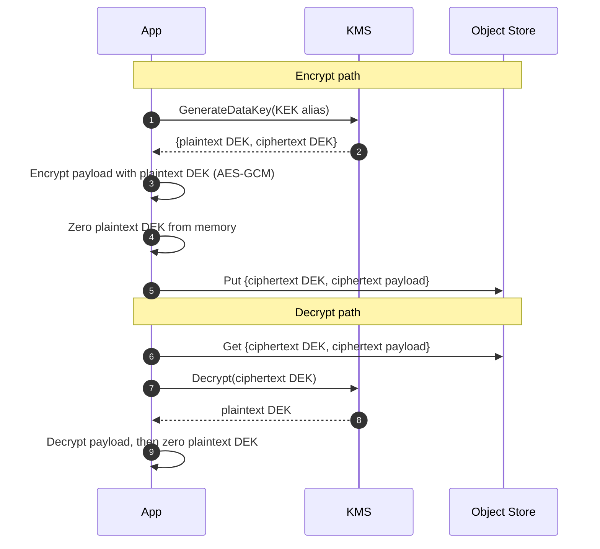
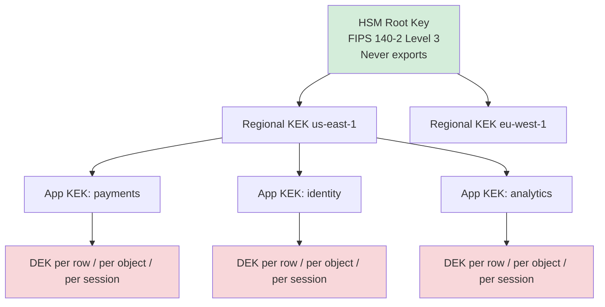
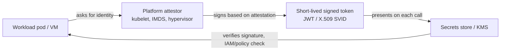
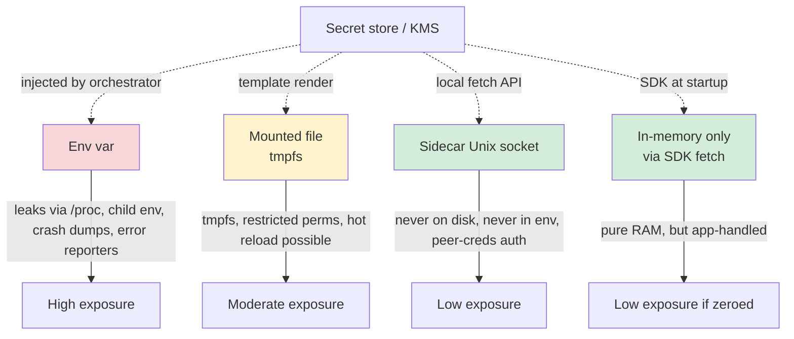

# Secrets Management and Key Rotation

**Date:** 2026-04-26 | **Updated:** 2026-04-26
**Tags:** `system-design` `security` `secrets` `kms` `rotation`

## Table of Contents

- [Summary](#summary)
- [Overview — Why Secrets Management Is Different From Encryption](#overview--why-secrets-management-is-different-from-encryption)
- [Key Concepts](#key-concepts)
  - [Storage Backends — Vault, AWS, GCP, Azure](#storage-backends--vault-aws-gcp-azure)
  - [Envelope Encryption — DEK + KEK](#envelope-encryption--dek--kek)
  - [KMS Hierarchies and Root of Trust](#kms-hierarchies-and-root-of-trust)
  - [Rotation Strategies — Automatic vs Manual](#rotation-strategies--automatic-vs-manual)
  - [Rotation Challenges in Distributed Systems](#rotation-challenges-in-distributed-systems)
  - [Workload Identity — Killing the Bootstrap Secret](#workload-identity--killing-the-bootstrap-secret)
  - [SPIFFE / SPIRE — Identity Across Clouds](#spiffe--spire--identity-across-clouds)
  - [Secret Delivery — Files, Sidecars, Why Not Env Vars](#secret-delivery--files-sidecars-why-not-env-vars)
  - [Audit Logging and Just-In-Time Access](#audit-logging-and-just-in-time-access)
  - [Break-Glass Accounts](#break-glass-accounts)
- [Trade-offs](#trade-offs)
- [Code Examples](#code-examples)
  - [Vault Read with AppRole](#vault-read-with-approle)
  - [AWS KMS Envelope Encryption](#aws-kms-envelope-encryption)
  - [SPIFFE SVID Fetch in Go](#spiffe-svid-fetch-in-go)
- [Real-World Uses](#real-world-uses)
- [Anti-Patterns](#anti-patterns)
- [Related](#related)
- [References](#references)

## Summary

Secrets management is the operational discipline of provisioning, distributing, rotating, and auditing the credentials and keys that systems use to talk to each other. The hard parts are not "where do I store the password" but **how does a workload prove its identity without a bootstrap secret**, **how do I rotate without a stop-the-world deploy**, and **how do I prove after the fact who read what**. The dominant pattern is **envelope encryption** (data keys protected by key-encryption keys living in a KMS) combined with **workload identity** (IAM roles, GCP Workload Identity Federation, or SPIFFE SVIDs) to eliminate static credentials, plus **automatic rotation** with versioned secrets so callers can hold and validate multiple generations during the cutover window.

## Overview — Why Secrets Management Is Different From Encryption

It is tempting to treat secrets as "just encrypted blobs in a config file." That conflates three independent problems:

1. **Encryption**: turning plaintext into ciphertext. Solved by AES-GCM, ChaCha20-Poly1305, and the algorithms in [Encryption at Rest and in Transit](./encryption-at-rest-and-in-transit.md).
2. **Key management**: protecting the encryption keys themselves, with a clear root of trust, hardware-backed where it matters, and a rotation story.
3. **Secret distribution**: getting the right credential to the right workload at the right time, with revocation and audit.

A system can do (1) flawlessly and still fail catastrophically because (2) put the master key in the same Git repo as the ciphertext, or (3) shipped a long-lived database password baked into a container image. In real incidents — Capital One 2019, Codecov 2021, Uber 2022, the LastPass 2022 breaches — the failures clustered around (2) and (3), not the cipher choice.

The job of a secrets management subsystem is to provide:

- **A single source of truth** for "what is the current password for X" so rotation is one write, not a coordinated deploy.
- **Identity-bound access**: workloads authenticate with something they _are_ (signed identity document) rather than something they _know_ (static API key).
- **A short blast radius**: any one credential leaking compromises one scope and one rotation window.
- **An audit trail** good enough to answer "who read this secret in the last 90 days" within minutes.

## Key Concepts

### Storage Backends — Vault, AWS, GCP, Azure

The four secrets stores you will actually pick between in 2026:

| Backend | Identity model | Strengths | Watch out for |
|---------|----------------|-----------|---------------|
| **HashiCorp Vault** | AppRole, JWT/OIDC, K8s service accounts, AWS IAM, cloud auth methods | Cloud-agnostic, dynamic secrets (DB creds minted on demand), strong PKI engine, transit encryption-as-a-service | Operational burden (HA, unsealing, Raft storage); easy to misconfigure auth methods |
| **AWS Secrets Manager** | IAM (no separate auth) | Native rotation Lambdas for RDS/Redshift/DocumentDB, integrated CloudTrail, replication across regions | Per-secret pricing adds up at scale; rotation Lambda code is yours to maintain |
| **AWS Systems Manager Parameter Store** | IAM | Free for standard parameters, hierarchical paths, KMS encryption | Lower throughput than Secrets Manager; no native rotation; fewer integrations |
| **GCP Secret Manager** | IAM + Workload Identity | Versioned by default, regional or automatic replication, integrates with Workload Identity Federation | No first-party rotation hooks — you write the rotator; per-version pricing |
| **Azure Key Vault** | Microsoft Entra ID (managed identities) | HSM-backed keys, certificate management, integrates with Azure Managed Identity | Throttling on hot paths; soft-delete semantics surprise people during cleanup |

The decision rule is usually: **single cloud → managed**, **multi-cloud or strong dynamic-secret needs → Vault**. Running Vault is non-trivial; do not pick it because it shows up in conference talks if your footprint is one cloud.

A combined deployment is common: Vault as the cross-cloud broker for dynamic database credentials and PKI, while each cloud's native KMS holds the **root key** that protects Vault's storage. That keeps the root of trust hardware-backed in each region without coupling all secrets to a single Vault cluster.

### Envelope Encryption — DEK + KEK

The single most important pattern in this whole topic. Two-key hierarchy:

- **DEK (Data Encryption Key)**: a symmetric key (typically 256-bit AES-GCM) that actually encrypts the plaintext data — a row, a file, an S3 object, a backup.
- **KEK (Key Encryption Key)**: a master key in a KMS that **only ever encrypts other keys**, never user data. The KEK never leaves the KMS in plaintext.

The flow:



Why this is non-negotiable at scale:

- **KMS is a low-throughput, high-cost service.** A direct encrypt-everything-via-KMS approach hits API limits and bills (AWS KMS charges per request). With envelope encryption, KMS is called once per object (or once per session), not once per byte.
- **Rotating the KEK does not require re-encrypting data.** The DEK stays valid; you only re-wrap the DEK ciphertext under the new KEK version. AWS, GCP, and Azure all do this transparently for you when you rotate a managed CMK.
- **Compromise scope is bounded.** Stealing one DEK means decrypting one object. Stealing the KEK means decrypting every wrapped DEK — and the KEK lives in an HSM that does not export it.

This pattern shows up under different names everywhere: AWS S3 SSE-KMS, GCP CMEK, Azure customer-managed keys, Vault Transit, ChaCha20-Poly1305 encrypted backups in Postgres pg_basebackup, Kafka tiered storage, every database TDE implementation.

### KMS Hierarchies and Root of Trust

For organizations of any complexity, a single KEK is insufficient. The hierarchy:



Properties to design for:

- **Root of trust is hardware**: an HSM, AWS CloudHSM / KMS-with-FIPS-140-3, GCP Cloud HSM, Azure Dedicated HSM. The root never exports plaintext.
- **Per-application KEKs** so you can revoke one application's access without affecting others.
- **Per-region KEKs** so a region failover does not cross-decrypt data inappropriately and so you can satisfy data residency rules (EU-only KEKs unwrap EU-only DEKs).
- **Key aliases** (e.g. `alias/payments-prod`) so rotation and replacement are address-stable for callers.

NIST SP 800-57 Part 1 covers cryptoperiods and recommends KEKs have longer cryptoperiods than DEKs (years vs months). That maps directly to "rotate the DEK on every write, rotate the KEK annually."

### Rotation Strategies — Automatic vs Manual

Three rotation modes you will encounter:

1. **Automatic, fully managed**: KMS rotates the KEK on a schedule (AWS KMS auto-rotation: yearly; GCP supports custom periods). The CMK retains all prior versions; previous DEK ciphertexts can still be unwrapped because KMS knows which version wrapped them. **Zero application work.** This is the right default for KEKs.

2. **Automatic with application coordination**: a rotator (Lambda, scheduled job, Vault rotation engine) generates the new secret in the target system (database `ALTER USER`, IAM access key rotation, OAuth client secret regeneration), updates the secret store, and invalidates the old version after a grace window. AWS Secrets Manager rotation Lambdas, Vault DB secret engine, and Doppler all implement this.

3. **Manual (calendar reminder + ticket)**: someone rotates a vendor API key once a quarter. This always degrades into "we rotated it once two years ago." Do not pretend this is rotation.

A rotation flow with a grace window:

```mermaid
sequenceDiagram
    autonumber
    participant Rot as Rotator
    participant DB as Database
    participant Store as Secrets Store
    participant App as Application

    Note over Rot,App: T0: only v1 exists
    Rot->>DB: CREATE USER app_v2 WITH PASSWORD '...'
    Rot->>DB: GRANT ... TO app_v2
    Rot->>Store: Put secret v2 (mark "pending")
    Note over Store,App: Apps still read v1 (current)
    Rot->>Store: Promote v2 -> current; v1 -> previous
    Note over App: Apps refresh and pick up v2
    Rot->>App: Wait for all clients to confirm v2 (TTL drain)
    Rot->>DB: DROP USER app_v1
    Rot->>Store: Delete v1
```

The crucial design choice is **versioned secrets with overlap**, not "swap in place." During the overlap window, both v1 and v2 are valid in the target system. Old replicas still authenticate with v1 until they refresh; new ones use v2. The window must be at least the cache TTL of the slowest consumer — a system with 10-minute cache TTL needs a 10-minute overlap minimum, plus margin.

### Rotation Challenges in Distributed Systems

What rotation tutorials skip:

- **Multi-region propagation.** A secret rotated in `us-east-1` does not appear in `ap-southeast-1` instantly. AWS Secrets Manager replication, GCP Secret Manager automatic replication, and Vault performance replication all have non-zero lag. Plan for **eventually consistent secret availability** and design the grace window around the slowest replica, not the fastest.
- **In-flight requests holding old credentials.** A long-running background job that started with v1 and lasts 10 minutes must be allowed to finish on v1. If you delete v1 immediately after promoting v2, the job dies mid-transaction. Either build idempotent retry into the job, or extend the grace window past the longest expected job duration.
- **Connection pools that cached the credential.** Most database drivers cache the password used to open a connection. Rotation that does not also recycle the pool is rotation in name only. The fix is either (a) a pool-aware driver that re-auths on each checkout, or (b) explicit pool drain on secret refresh.
- **Sidecars and agents that fetch on startup.** A sidecar that reads the secret once at boot is invisible to subsequent rotations. Either it polls (with jittered interval), it subscribes (Vault Agent template), or it has its own short-lived token and re-fetches when the token expires.
- **Webhook receivers and validators.** Rotating an HMAC signing key for incoming webhooks must publish v2 to the sender, accept both v1 and v2 on the receiver during the overlap, then retire v1. Senders that don't support overlap force a flag-day cutover and a brief outage.
- **TLS certificate rotation has the same shape** but with public-key crypto and CA chain validation. ACME (Let's Encrypt) plus cert-manager handles this for HTTPS; mTLS internal CAs need the same overlap discipline.

### Workload Identity — Killing the Bootstrap Secret

The deepest question in secrets management: **how does the workload authenticate to the secret store in the first place?** If the answer is "with an API key in an environment variable," you have not removed the bootstrap secret — you have just renamed it.

The modern answer is workload identity, which gives every workload a signed, short-lived identity document derived from its runtime environment, not from a stored secret.

| Platform | Workload identity mechanism |
|----------|------------------------------|
| **AWS** | IAM Roles for EC2 / ECS task roles / EKS IAM Roles for Service Accounts (IRSA) — the IMDS or projected token gives short-lived STS credentials |
| **GCP** | Workload Identity Federation: Kubernetes SA token → STS → GCP service account; no JSON keys |
| **Azure** | Managed Identity (system-assigned or user-assigned) — IMDS endpoint returns OAuth tokens |
| **Kubernetes (any cloud)** | Projected service account tokens (audience-bound JWTs) consumed by Vault's K8s auth, IRSA, GCP WIF |
| **Cross-cloud / on-prem / bare metal** | SPIFFE SVID via SPIRE |

The shape of every one of these:



There are no static credentials on disk. The token expires in minutes. Compromise of one workload does not yield a credential that works elsewhere or after the workload dies. This is the model to design toward.

### SPIFFE / SPIRE — Identity Across Clouds

SPIFFE (Secure Production Identity Framework for Everyone) is the CNCF spec; SPIRE is the reference implementation. The point of SPIFFE is to make workload identity **portable across clouds, on-prem, and Kubernetes** with one identity model.

Key concepts:

- **SPIFFE ID**: a URI like `spiffe://example.org/payments/api`. It is the workload's name, not a secret.
- **SVID (SPIFFE Verifiable Identity Document)**: signed proof of that name, in two flavors — X.509-SVID (TLS cert) for mTLS, or JWT-SVID for HTTP APIs. Lifetimes are typically minutes.
- **Trust bundle**: the set of CA certs trusted to sign SVIDs in this trust domain. Distributed to every workload so they can verify peers.
- **SPIRE Server**: issues SVIDs based on registration entries that map attestation properties (k8s SA, EC2 instance ID, host UUID) to SPIFFE IDs.
- **SPIRE Agent**: per-node daemon that performs the attestation and exposes a Workload API socket for local processes to fetch SVIDs.

The Workload API is a Unix domain socket — no shared secret, no token, no env var. Authorization is by Unix peer credentials (uid/gid/process attestation). This is as close to "no bootstrap secret" as you can get.

When to choose SPIFFE: multi-cloud, multi-cluster, on-prem + cloud, or service mesh (Istio uses SPIFFE-shaped IDs internally) where you need one identity across heterogeneous environments and want explicit trust domains.

### Secret Delivery — Files, Sidecars, Why Not Env Vars

Where the secret lands inside the workload matters as much as how it got there.



Why env vars are a poor default for secrets:

- **Process listing leakage.** `/proc/<pid>/environ` is readable by the same UID and visible to many tools. Container runtimes log env on startup. Crash reporters (Sentry, Bugsnag) often serialize env into traces.
- **Child process inheritance.** Every shelled-out subprocess inherits the env unless explicitly cleared. Build tools, debuggers, and shell scripts grab them by accident.
- **No live rotation.** Env vars are set at process start; rotating requires restart.
- **Audit-hostile.** You cannot tell when a secret was read; the kernel handed it over once at exec time.

File-mounted via tmpfs (Kubernetes Secret volume, Vault Agent template, AWS App Config / Secrets Manager CSI driver) is the realistic baseline: file is on a memory-backed filesystem, mode 0400, owned by the app user, never persisted to disk, can be hot-reloaded by signaling the app. This is the dominant pattern in 2026.

Sidecar injection (Vault Agent, Akeyless gateway, the Secrets Store CSI Driver in Kubernetes, Linkerd's identity service) is the highest-assurance practical option: the secret is fetched by a co-located process and exposed only via a local socket the app talks to. The app does not even know the upstream secret store.

### Audit Logging and Just-In-Time Access

Two complementary controls.

**Audit logging.** Every secret read, write, and policy change must be logged with: principal, source IP / workload identity, timestamp, secret name and version, operation, result. The log stream must be append-only, tamper-evident, and stored in a different blast radius from the secret store itself (different account, different cloud, different region — at minimum off-host). AWS sends KMS and Secrets Manager events to CloudTrail; GCP to Cloud Audit Logs; Azure Key Vault to Monitor Diagnostic Settings; Vault to its own audit devices (file, syslog, socket — typically with at least two enabled so one failure does not stop writes).

The non-negotiable is **integrity of the audit log**: if attackers can edit it, the log is theater. Use append-only S3 with object lock, Cloud Logging with locked retention, immutable storage, or external SIEM ingestion within seconds.

**Just-in-time (JIT) access.** Long-lived "SRE has admin to all of prod" is the breach amplifier. Replace it with:

- Engineer requests elevation with a justification ticket.
- An approver (peer or on-call) grants for a bounded window (e.g. 30 min).
- The grant binds to a specific scope (one cluster, one secret path).
- The credential issued is short-lived and tied to the grant ID for audit linkage.
- Auto-revoke at window expiry; auto-notify on any out-of-window use.

Tools: AWS IAM Identity Center session policies, Teleport, StrongDM, ConductorOne, HashiCorp Boundary, GCP Privileged Access Manager. The goal is **standing privilege near zero, ephemeral privilege auditable**.

### Break-Glass Accounts

Reality check: every JIT system can fail — auth provider outage, network partition isolating the approver, a SaaS vendor down. You need a documented escape hatch.

A break-glass account is:

- **Stored offline.** The credentials live in a sealed envelope, a physical safe, or split across two YubiKeys held by different officers — not in the very system that's broken.
- **Heavily monitored.** Use of the account fires page-everyone alerts that bypass the broken paths.
- **Time-limited where possible.** AWS root-account behavior, the master ops account; the credential resets the moment the incident closes.
- **Rotated on every use.** Even if it was used legitimately, treat the artifact as burned and rotate to a new sealed envelope.
- **Tested quarterly.** An untested break-glass is a breached break-glass waiting to happen — paths rot, MFA tokens drift, the safe combination is forgotten.

The point is to minimize the chance of needing it and to maximize visibility when it is used.

## Trade-offs

| Decision | Cheap option | Expensive option | When the expensive one pays off |
|----------|--------------|------------------|---------------------------------|
| Storage backend | Cloud-native (Secrets Manager, Secret Manager, Key Vault) | Self-hosted Vault | Multi-cloud, dynamic DB credentials, custom secret engines, strict data residency |
| Identity | Static API keys in env | Workload identity (IRSA / WIF / Managed Identity / SPIFFE) | Always — the question is migration cost, not whether |
| Rotation | Manual quarterly ticket | Automatic with rotator + grace window | Anything customer-facing, anything regulated, anything with > 1 consumer |
| Delivery mechanism | Env vars at deploy time | Sidecar with hot reload | Long-running services where restart-to-rotate is unacceptable |
| Audit | App logs + best effort | Append-only immutable audit stream | Compliance (PCI, HIPAA, SOC 2), incident forensics |
| JIT access | Standing IAM groups | JIT broker with approval flow | Reducing breach blast radius; passing audit evidence |
| Break-glass | Shared admin password in 1Password | Offline split-knowledge with paged alerts on use | The day your IdP is down and prod is on fire |

The recurring pattern: **operational discipline costs more than the tools**. Buying Vault and never rotating is worse than calendar-driven rotation on a Postgres password if the operations team is one person and stretched.

## Code Examples

### Vault Read with AppRole

AppRole is Vault's machine-auth flow: a `role_id` (public-ish identifier) plus a `secret_id` (short-lived, delivered via a trusted broker). For Kubernetes-native deploys prefer the K8s auth method; AppRole is the right shape for VMs and bare metal.

```python
# pip install hvac
import hvac
import os

VAULT_ADDR = os.environ["VAULT_ADDR"]
ROLE_ID = os.environ["VAULT_ROLE_ID"]            # ok to ship in config
SECRET_ID = os.environ["VAULT_SECRET_ID"]        # delivered just-in-time, single-use

client = hvac.Client(url=VAULT_ADDR)

# 1. Authenticate -> short-lived client token
auth = client.auth.approle.login(role_id=ROLE_ID, secret_id=SECRET_ID)
client.token = auth["auth"]["client_token"]
lease_seconds = auth["auth"]["lease_duration"]

# 2. Read a KV v2 secret, current version
resp = client.secrets.kv.v2.read_secret_version(
    mount_point="secret",
    path="payments/stripe",
)
api_key = resp["data"]["data"]["api_key"]
version = resp["data"]["metadata"]["version"]

# 3. Schedule renewal at ~50% of lease so we never hit expiry mid-request
# In real code: a background task that calls auth.token.renew_self()
print(f"got api_key v{version}, token good for {lease_seconds}s")
```

Production notes:
- Never log `client.token` or `secret_id`.
- Use response wrapping (`-wrap-ttl`) when delivering `secret_id` to the workload so a leaked CI log cannot replay.
- For DB credentials prefer the Vault DB secret engine which mints unique, short-lived users on demand — see [Encryption at Rest and in Transit](./encryption-at-rest-and-in-transit.md) for how this composes with TLS.

### AWS KMS Envelope Encryption

End-to-end envelope encrypt/decrypt of a payload using a KMS CMK. The CMK never leaves AWS; we get a 256-bit DEK, encrypt locally, and store both the wrapped DEK and the ciphertext.

```python
# pip install boto3 cryptography
import os
import boto3
from cryptography.hazmat.primitives.ciphers.aead import AESGCM

kms = boto3.client("kms")
KEK_ALIAS = "alias/payments-prod"

def encrypt(plaintext: bytes, aad: bytes = b"") -> dict:
    # 1. Ask KMS for a fresh 256-bit DEK; we get it both wrapped and in the clear.
    resp = kms.generate_data_key(KeyId=KEK_ALIAS, KeySpec="AES_256")
    dek_plaintext = resp["Plaintext"]
    dek_ciphertext = resp["CiphertextBlob"]

    # 2. Encrypt locally with AES-GCM, binding aad so ciphertext only decrypts in-context.
    nonce = os.urandom(12)
    ct = AESGCM(dek_plaintext).encrypt(nonce, plaintext, aad)

    # 3. Wipe the plaintext DEK reference. Python lacks true zeroization,
    #    so minimize lifetime and avoid copies.
    del dek_plaintext

    return {"wrapped_dek": dek_ciphertext, "nonce": nonce, "ct": ct, "aad": aad}

def decrypt(blob: dict) -> bytes:
    resp = kms.decrypt(CiphertextBlob=blob["wrapped_dek"])
    dek_plaintext = resp["Plaintext"]
    pt = AESGCM(dek_plaintext).decrypt(blob["nonce"], blob["ct"], blob["aad"])
    del dek_plaintext
    return pt

if __name__ == "__main__":
    blob = encrypt(b"4111111111111111", aad=b"customer:42")
    assert decrypt(blob) == b"4111111111111111"
```

What this gives you:
- Per-payload DEK rotation: every encrypt mints a new DEK.
- KEK rotation is silent: AWS keeps prior CMK versions and unwraps any past DEK transparently.
- AAD binding means a stolen ciphertext+wrapped-DEK pair cannot be replayed against another customer's context.

### SPIFFE SVID Fetch in Go

Fetching an X.509-SVID from a SPIRE agent over the Workload API and using it for outbound mTLS. No env var, no token, no shared secret — only the local Unix socket.

```go
package main

import (
    "context"
    "crypto/tls"
    "log"
    "net/http"
    "time"

    "github.com/spiffe/go-spiffe/v2/spiffeid"
    "github.com/spiffe/go-spiffe/v2/spiffetls/tlsconfig"
    "github.com/spiffe/go-spiffe/v2/workloadapi"
)

func main() {
    ctx, cancel := context.WithTimeout(context.Background(), 30*time.Second)
    defer cancel()

    // Workload API socket — typically /tmp/spire-agent/public/api.sock
    src, err := workloadapi.NewX509Source(ctx,
        workloadapi.WithClientOptions(
            workloadapi.WithAddr("unix:///tmp/spire-agent/public/api.sock"),
        ),
    )
    if err != nil {
        log.Fatalf("fetch SVID: %v", err)
    }
    defer src.Close()

    // Authorize the upstream by SPIFFE ID, not by hostname or IP.
    serverID := spiffeid.RequireFromString("spiffe://example.org/payments/api")
    tlsCfg := tlsconfig.MTLSClientConfig(src, src, tlsconfig.AuthorizeID(serverID))

    client := &http.Client{
        Transport: &http.Transport{TLSClientConfig: tlsCfg},
        Timeout:   5 * time.Second,
    }

    resp, err := client.Get("https://payments.internal/health")
    if err != nil {
        log.Fatalf("call: %v", err)
    }
    defer resp.Body.Close()
    log.Printf("status=%s tls_peer=%v", resp.Status, resp.TLS.PeerCertificates[0].URIs)
}
```

Properties this gives you:

- The SVID auto-rotates inside `X509Source` long before expiry; no app-side rotation logic.
- `AuthorizeID` enforces who the peer must be by SPIFFE ID; DNS spoofing alone does not get an attacker through.
- Replace `AuthorizeID` with `AuthorizeMemberOf(td)` for any-workload-in-trust-domain, or a custom matcher for richer policy.

## Real-World Uses

- **Netflix Lemur + BLESS**: SSH and TLS cert issuance with short TTLs, signed by an internal CA backed by AWS KMS. Every SSH session uses a one-shot cert, not a long-lived key.
- **Uber's USecret / pyflame postmortems**: motivated their move from env-var secrets to in-memory fetch + sidecar after several incidents involved env-leak through child processes.
- **HashiCorp Vault dynamic database credentials**: Vault holds a privileged DB user, and on each app request mints a unique short-lived (e.g. 1h) database user just for that workload. There are no shared DB passwords; rotation is automatic by expiry.
- **Google internal ALTS** and **Istio mTLS**: every service-to-service hop is mutually authenticated using SPIFFE-shaped identities; secrets are hardware-rooted at machine boot.
- **AWS S3 SSE-KMS at scale**: S3 uses envelope encryption per object, with a bucket-key optimization that caches the wrapped DEK to reduce KMS calls by orders of magnitude on hot prefixes.
- **GitHub Actions OIDC → cloud**: CI jobs no longer hold cloud access keys; they exchange a per-job OIDC token with AWS STS / GCP WIF / Azure for short-lived credentials. This eliminated a large class of leaked-CI-key incidents.
- **Cloudflare's Geo Key Manager**: regional KEKs enforce that EU-customer TLS private keys can only be unwrapped in EU data centers.

## Anti-Patterns

- **Long-lived secrets in environment variables.** Visible to child processes, crash dumps, container runtime logs, and error reporters. Rotation requires restart.
- **Secrets committed to Git.** Even after `git filter-repo`, every fork, mirror, and CI cache still has them. Treat as compromised the moment they hit the index, not the moment someone notices. Use `git-secrets`, `gitleaks`, or `trufflehog` as pre-commit and pre-receive hooks.
- **No rotation, ever.** A "rotated once two years ago" credential is functionally a permanent credential. Auto-rotate or accept that the credential is part of your permanent attack surface.
- **Manual rotation forever.** Even with discipline, manual rotation drifts during reorgs, on-call handoffs, and vendor changes. Anything you do quarterly that you could automate, automate.
- **Static cloud access keys handed to CI.** Use OIDC federation. A leaked GitHub Actions log with `AWS_SECRET_ACCESS_KEY` has been one of the dominant breach vectors of 2023–2026.
- **Plaintext secrets in CI logs.** Mark variables as masked, but also assume mask-bypass exists. Prefer fetch-at-step over expose-as-env.
- **One root key for everything.** Single CMK protecting prod, staging, every team. One IAM mistake compromises everything. Per-application, per-region KEKs are cheap.
- **Audit log in the same blast radius as the secret store.** If the attacker who compromises the vault also owns the audit log, you have no incident response.
- **"Encrypted in our database" without rotation or HSM.** The encryption key sits in `application.yml`. The threat model this defends against is "attacker with read on database backups but not application config" — narrow at best.
- **Confusing secret rotation with token expiry.** A 1h JWT does not rotate the underlying signing key. Both must rotate, on different cadences.
- **Skipping the grace window.** Rotating in place breaks every in-flight request that was holding v1.
- **Break-glass account stored in the system it's meant to rescue.** When the IdP is down, your IdP-protected break-glass is also down.
- **Trusting hostname or IP for service identity.** DNS lies, IPs get reused, side-cars share network namespaces. Use cryptographic identity (SPIFFE, mTLS with a shared CA, signed JWTs) and authorize by identity, not address.

## Related

- [Encryption at Rest and in Transit](./encryption-at-rest-and-in-transit.md) — the cipher and TLS layer that envelope encryption and SVID-bound mTLS sit on top of.
- [Designing a CI/CD Pipeline](../case-studies/async/design-cicd-pipeline.md) — where OIDC-to-cloud federation, signed artifacts, and pipeline-scoped secrets get exercised end-to-end.
- [CAP, PACELC, and Consistency Models](../foundations/cap-and-consistency-models.md) — the framing that explains why multi-region secret propagation lag is a feature of the system, not a bug to engineer away.

## References

- HashiCorp, ["Vault Documentation"](https://developer.hashicorp.com/vault/docs) — auth methods, secret engines, replication, audit devices.
- AWS, ["AWS Key Management Service Developer Guide"](https://docs.aws.amazon.com/kms/latest/developerguide/) — envelope encryption, key rotation, grants, multi-region keys, KMS pricing model.
- AWS, ["AWS Secrets Manager User Guide"](https://docs.aws.amazon.com/secretsmanager/latest/userguide/) — rotation Lambdas, replication, IAM integration.
- Google Cloud, ["Secret Manager documentation"](https://cloud.google.com/secret-manager/docs) and ["Workload Identity Federation"](https://cloud.google.com/iam/docs/workload-identity-federation) — keyless cloud auth from external identity providers.
- Microsoft, ["Azure Key Vault documentation"](https://learn.microsoft.com/en-us/azure/key-vault/) and ["Managed Identities for Azure Resources"](https://learn.microsoft.com/en-us/entra/identity/managed-identities-azure-resources/overview).
- NIST, ["SP 800-57 Part 1 Rev. 5: Recommendation for Key Management"](https://nvlpubs.nist.gov/nistpubs/SpecialPublications/NIST.SP.800-57pt1r5.pdf) — cryptoperiods, key hierarchies, rotation guidance.
- SPIFFE, ["SPIFFE Specifications"](https://github.com/spiffe/spiffe/blob/main/standards/SPIFFE.md) and SPIRE, ["SPIRE documentation"](https://spiffe.io/docs/latest/spire-about/) — workload identity, X.509-SVID and JWT-SVID, Workload API.
- OWASP, ["Secrets Management Cheat Sheet"](https://cheatsheetseries.owasp.org/cheatsheets/Secrets_Management_Cheat_Sheet.html) — practical anti-pattern catalog and mitigations.
- CNCF, ["Secrets Store CSI Driver"](https://secrets-store-csi-driver.sigs.k8s.io/) — file-mounted secrets in Kubernetes from Vault, AWS, GCP, Azure providers.
