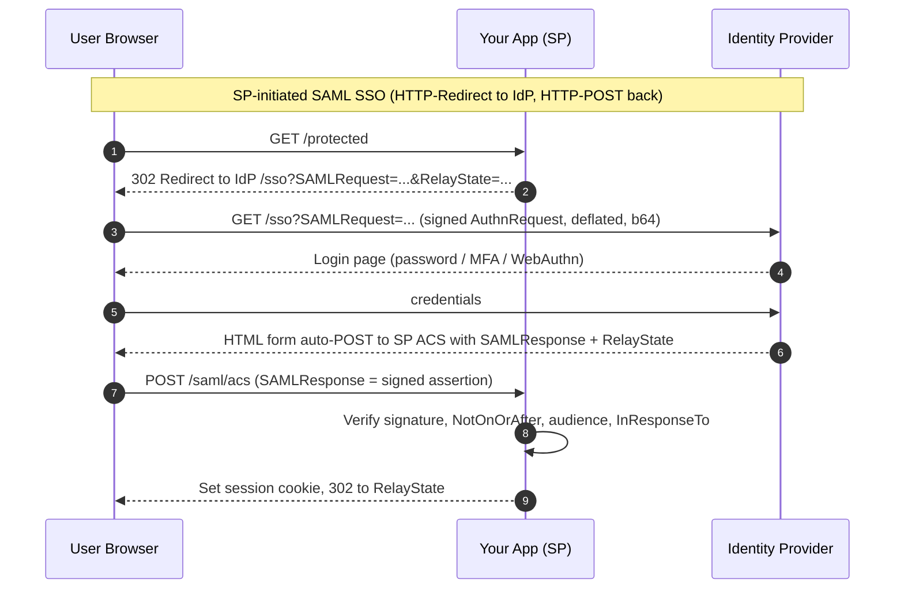
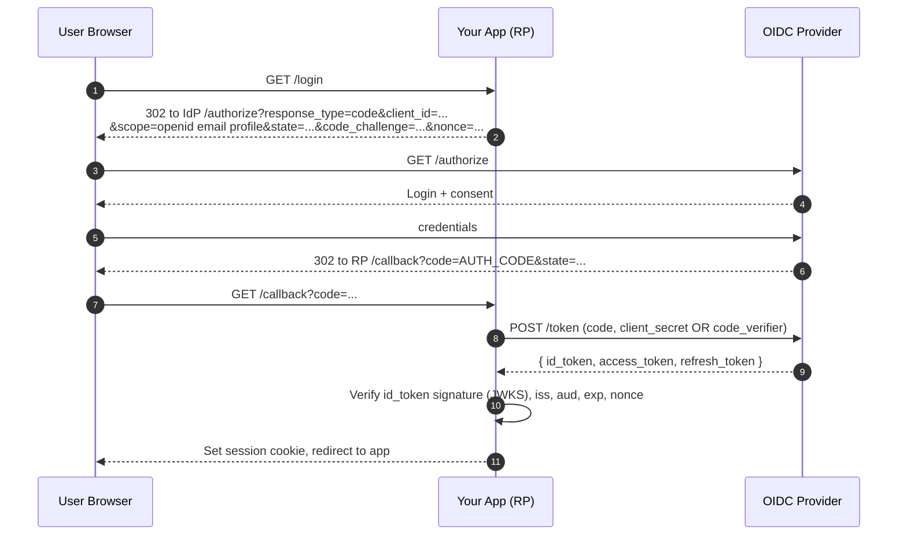
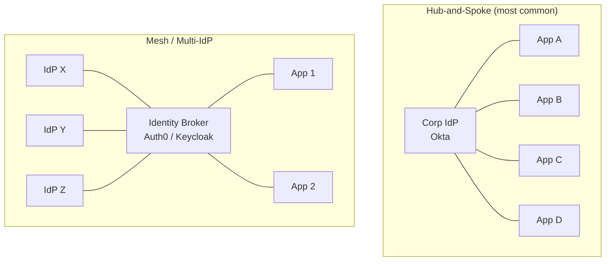
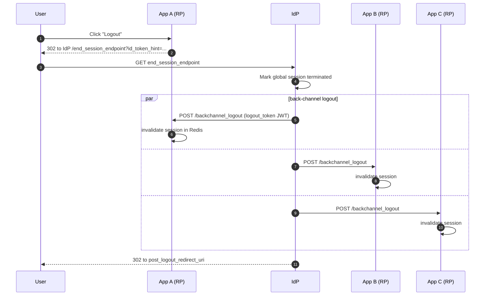

# Single Sign-On — SAML, OIDC, Federation

**Date:** 2026-04-26 | **Updated:** 2026-04-26
**Tags:** `system-design` `security` `sso` `saml` `oidc` `scim`

## Table of Contents

- [Summary](#summary)
- [Why This Matters](#why-this-matters)
- [Vocabulary — Get These Right or Nothing Else Lands](#vocabulary--get-these-right-or-nothing-else-lands)
- [SAML 2.0 — The Enterprise Default](#saml-20--the-enterprise-default)
  - [SP-Initiated vs IdP-Initiated](#sp-initiated-vs-idp-initiated)
  - [The Assertion, the Signature, and the Bindings](#the-assertion-the-signature-and-the-bindings)
- [OIDC — OAuth2 With an Identity Layer Bolted On](#oidc--oauth2-with-an-identity-layer-bolted-on)
  - [The Authorization Code Flow](#the-authorization-code-flow)
  - [The ID Token vs the Access Token](#the-id-token-vs-the-access-token)
  - [Discovery and JWKS](#discovery-and-jwks)
- [OAuth2 vs OIDC — The Authn/Authz Distinction](#oauth2-vs-oidc--the-authnauthz-distinction)
- [Federation Topologies](#federation-topologies)
- [SCIM 2.0 — Provisioning Without the Helpdesk Ticket](#scim-20--provisioning-without-the-helpdesk-ticket)
- [JIT Provisioning and Claim Mapping](#jit-provisioning-and-claim-mapping)
- [Session Management — Front-Channel vs Back-Channel Logout](#session-management--front-channel-vs-back-channel-logout)
- [Trade-offs — SAML vs OIDC, When to Pick Which](#trade-offs--saml-vs-oidc-when-to-pick-which)
- [Code Examples](#code-examples)
- [Real-World Uses](#real-world-uses)
- [Anti-Patterns](#anti-patterns)
- [Related](#related)
- [References](#references)

## Summary

Single Sign-On is the contract that one identity provider (IdP) authenticates a user and a relying service provider (SP) trusts the resulting assertion. **SAML 2.0** dominates B2B and enterprise: XML assertions, signed via XML-DSig, delivered through the browser via HTTP-POST or HTTP-Redirect bindings. **OIDC** dominates consumer and modern B2B: a thin identity layer on OAuth2 with a signed JWT ID token and a `/.well-known/openid-configuration` discovery document. **OAuth2 alone is authorization, not authentication** — confusing the two is the most common SSO design mistake. Federation lets multiple IdPs and SPs trust each other in hub-and-spoke or mesh topologies. **SCIM 2.0** is the missing half — automated provisioning and deprovisioning so users don't linger after offboarding. Logout is its own hard problem: front-channel logout breaks under modern browsers' third-party cookie restrictions, back-channel logout is the boring answer that actually works.

## Why This Matters

Authentication is solved — but the way it's solved depends entirely on which buyer you sell to. A consumer product that ignores OIDC is rebuilding Google Sign-In from scratch. A B2B product that ignores SAML loses every enterprise deal where IT says "we use Okta and you need to be on our SSO." A product that ships SSO but skips SCIM ends up with a security audit finding because terminated employees still have access three months after offboarding.

This doc gives you the vocabulary to:

- Explain to a security review the difference between SP-initiated SAML and OIDC's authorization code flow without hand-waving.
- Reject "let's use OAuth2 to log users in" — that's authentication-via-authorization and it's been a known anti-pattern since 2014.
- Choose the right binding (POST vs Redirect) and the right flow (auth code + PKCE vs implicit) without copy-pasting from a vendor's quickstart.
- Design the offboarding story so HR firing someone in Workday actually removes their access in your app within minutes, not months.
- Pick a federation topology that matches the reality of B2B partner sprawl instead of building N-squared bilateral trust relationships.

## Vocabulary — Get These Right or Nothing Else Lands

| Term | Meaning |
|------|---------|
| **IdP** (Identity Provider) | The system that authenticates users and issues assertions/tokens. Okta, Azure AD/Entra ID, Auth0, Google Workspace, Ping. |
| **SP** (Service Provider) / **RP** (Relying Party) | Your app — the thing that trusts the IdP. "SP" is SAML vocabulary; "RP" is OIDC vocabulary. Same role. |
| **Assertion** (SAML) | XML document, signed by the IdP, asserting "user X authenticated at time T with method M and these attributes." |
| **ID Token** (OIDC) | A JWT, signed by the IdP, asserting roughly the same thing. Three base64 parts: header, claims, signature. |
| **Access Token** (OAuth2) | An opaque-or-JWT bearer token granting access to APIs. Says nothing about who the user is — that's the ID token's job. |
| **Federation** | Two or more identity domains agreeing to trust each other's assertions. Cross-company B2B login is federation. |
| **JIT** (Just-In-Time) provisioning | Create the user account on first login, populated from assertion claims. No prior provisioning step. |
| **SCIM** (System for Cross-domain Identity Management) | A REST API standard the IdP calls to push user lifecycle events (create/update/disable) into the SP. |
| **Claim** | A name-value attribute about the user — `email`, `groups`, `department`. Lives in the assertion or token. |
| **Binding** (SAML) | Transport mechanism for SAML messages. HTTP-POST and HTTP-Redirect are the two browser-based ones that matter. |

## SAML 2.0 — The Enterprise Default

SAML 2.0 was ratified by OASIS in 2005 and predates the modern token-and-JSON era. It is XML, it is verbose, and it is still what every Fortune 500 IT department buys. If you sell to enterprise, you ship SAML or you don't ship.

### SP-Initiated vs IdP-Initiated

There are two ways the dance can start:

- **SP-initiated**: user clicks "Log in" on your app, your app generates a `<samlp:AuthnRequest>` and redirects to the IdP. This is the modern default and what every spec recommends.
- **IdP-initiated**: user starts in the IdP's app launcher (the Okta dashboard with all the tile icons) and clicks your tile. The IdP generates an unsolicited `<saml:Response>` and POSTs it to your ACS endpoint with no prior `AuthnRequest`. Required for "the dashboard tile UX," widely used, and a well-known security footgun — without an `InResponseTo` to match, you cannot defend against assertion replay as cleanly. RFCs and security guidance recommend disabling unsolicited responses unless you specifically need them.



### The Assertion, the Signature, and the Bindings

The actual security guarantee is in the **XML signature** over the `<saml:Assertion>`. The SP holds the IdP's public certificate (provisioned out-of-band, typically via a metadata XML file or URL) and verifies that the assertion was signed by the IdP's private key.

What the SP must validate on every assertion (skipping any of these is how SAML CVEs get filed):

1. Signature is valid against the IdP's pinned cert.
2. `NotBefore` / `NotOnOrAfter` window is current — typical 5-minute clock skew.
3. `Audience` matches your SP entity ID — prevents cross-app replay.
4. `InResponseTo` matches an `AuthnRequest` you actually sent (SP-initiated only).
5. `Destination` matches your ACS URL.
6. The assertion has not been seen before — replay protection via assertion ID cache.

**Bindings** are how the messages physically move:

- **HTTP-Redirect**: small message, deflated and base64-encoded into a query parameter. Used for the `AuthnRequest` from SP to IdP.
- **HTTP-POST**: larger payload, base64-encoded in a hidden form field that auto-submits via JavaScript. Used for the `SAMLResponse` (assertion) from IdP back to SP because assertions are typically too large for a URL.
- **HTTP-Artifact** and SOAP back-channel exist; almost no one uses them in browser SSO.

## OIDC — OAuth2 With an Identity Layer Bolted On

OIDC (OpenID Connect Core 1.0, finalized 2014) is what happens when you take OAuth2 (RFC 6749, 2012) and admit that everyone was already misusing it for login. Instead of fighting that, OIDC formalizes the identity claims and adds the missing pieces: a standardized ID token (JWT), a `userinfo` endpoint, and a discovery document.

### The Authorization Code Flow

The only flow you should be using in 2026 for any user-facing app. Mobile and SPA add **PKCE** (RFC 7636) on top to prevent code-interception attacks; backend web apps use a client secret.



Implicit flow (`response_type=token id_token`, tokens delivered in the URL fragment) is **deprecated** as of OAuth 2.1 and the OAuth 2.0 Browser-Based Apps BCP. Don't use it; auth code + PKCE replaces it cleanly.

### The ID Token vs the Access Token

This trips up everyone. They are different tokens, with different audiences, for different purposes:

| | ID Token | Access Token |
|---|----------|--------------|
| **Format** | JWT, always | Opaque or JWT — provider's choice |
| **Audience (`aud`)** | Your client (RP) | The API/resource server |
| **Says** | "This user authenticated; here are their identity claims" | "Bearer of this token may call these scopes on this API" |
| **Used by** | Your RP, to log the user in and populate session | Your API, to authorize resource access |
| **Lifetime** | Short, usually minutes | Short (minutes), refreshed via refresh token |

**Rule:** never send an ID token to an API. Never use an access token to identify the user. Both mistakes are common; both lead to confused-deputy and audience-confusion vulnerabilities.

### Discovery and JWKS

OIDC's killer feature versus SAML: zero out-of-band cert exchange. The IdP publishes:

- **`/.well-known/openid-configuration`** — JSON document listing every endpoint (`authorization_endpoint`, `token_endpoint`, `jwks_uri`, `userinfo_endpoint`, `end_session_endpoint`), supported scopes, supported response types, supported algorithms.
- **`jwks_uri`** — the IdP's public keys as a JWK Set, fetched and cached by RPs. Key rotation becomes "publish new key in JWKS, sign with new key, retire old key" — no manual cert swap.

Compare to SAML where rotating a cert means a coordinated email-the-IT-team-and-update-metadata-XML dance. OIDC discovery is why OIDC eats the consumer and modern B2B world.

## OAuth2 vs OIDC — The Authn/Authz Distinction

This is the single most important conceptual distinction in identity, and it is constantly conflated.

| | OAuth 2.0 | OIDC |
|---|-----------|------|
| **Purpose** | Authorization — "this client may call this API on this user's behalf" | Authentication — "this user is who they say they are" |
| **Output** | Access token, optional refresh token | ID token (JWT) + access token + refresh token |
| **The question it answers** | What can this app do? | Who is this user? |
| **Typical use** | "Let this app post to your Twitter / read your Drive" | "Sign in with Google" / enterprise SSO |

The classic 2014-era anti-pattern: use OAuth2's access token to identify the user (treating "you have a valid access token for this Google account" as proof of who they are). This breaks because:

- Access tokens have no required `aud` for your client — a malicious app's access token could be replayed at your endpoint.
- Access tokens contain no required identity claims.
- Access tokens are not always JWTs and not always verifiable client-side.

OIDC fixed this by adding the ID token, which has a `nonce` you bind to the auth request, an `aud` that must match your client ID, and an `iss` you must validate. **If you are doing login, you want OIDC.** If you are calling APIs on a user's behalf, you want OAuth2 (and OIDC gives you both for free).

## Federation Topologies

Once you have more than two parties, you need a topology.



**Hub-and-spoke**: one IdP, many SPs. Every employee app trusts the corporate IdP. Simplest model; the IdP is a single point of compromise but also a single point of policy enforcement (MFA, conditional access, session length).

**Mesh / brokered federation**: many IdPs, many SPs, with a broker (Auth0, Keycloak, Cognito, Azure AD B2C) collapsing N×M trust relationships to N+M. The broker translates between protocols (SAML in, OIDC out) and centralizes claim mapping. This is how a B2B SaaS supports hundreds of customer IdPs without writing N integrations.

**Direct mesh** (no broker): every SP integrates with every IdP it cares about. Quadratic trust pairs. Avoid — only used inside very tight ecosystems (a few partner companies) where the broker overhead isn't worth it.

## SCIM 2.0 — Provisioning Without the Helpdesk Ticket

SSO solves login. **SCIM solves the rest of the lifecycle.** Defined in RFC 7642/7643/7644 (2015), SCIM is a small REST + JSON API that the IdP calls to keep your SP's user directory in sync.

The four operations every SP must implement:

| Method | Endpoint | Purpose |
|--------|----------|---------|
| `POST` | `/Users` | Create user (provisioning) |
| `GET` | `/Users/{id}` or `/Users?filter=...` | Read / search |
| `PUT` or `PATCH` | `/Users/{id}` | Update attributes (name change, group change) |
| `DELETE` or `PATCH active=false` | `/Users/{id}` | Deprovision (offboarding) |

Same for `/Groups`. The IdP holds the source of truth for group membership; your app receives push updates within seconds of HR clicking a button in Workday.

**Why this matters in production:** without SCIM, offboarding is a manual ticket. Audit findings stack up. SOC 2 and ISO 27001 will flag the gap. Compliance-bought enterprise deals require SCIM, full stop.

## JIT Provisioning and Claim Mapping

If SCIM is unavailable (smaller IdPs, certain Google Workspace plans, custom OIDC providers), **JIT provisioning** is the fallback. On the user's first SSO login:

1. Verify the assertion / ID token.
2. Look up local user by `sub` (OIDC) or `NameID` (SAML).
3. If not found, create it from the assertion claims.
4. On every subsequent login, refresh attributes (name, groups) from the assertion.

The cost: **deprovisioning is broken**. JIT can create users but cannot delete them — the user just stops logging in, but their row sits forever. You need a sweeper job that reads the IdP's directory periodically, or you accept the audit finding.

**Claim mapping** is the glue between IdP attribute names and your app's user model:

```text
IdP claim                   →  App field
─────────────────────────────────────────
sub                         →  external_id  (immutable, never email)
email                       →  email
given_name + family_name    →  display_name
groups (or memberOf)        →  roles  (after a mapping table)
custom:department           →  department
```

**Two rules of claim mapping:**

1. Use the immutable `sub` (or SAML `NameID` with format `persistent`) as the foreign key. Email changes; the subject identifier does not.
2. Map IdP groups to app roles via an explicit table, not by string-matching. `cn=engineering,ou=groups` does not naturally map to your `engineer` role without intent.

## Session Management — Front-Channel vs Back-Channel Logout

Logout is harder than login. There are three competing standards, and only one works reliably in 2026 browsers.

| Mechanism | How it works | Status |
|-----------|--------------|--------|
| **Front-Channel Logout** | IdP serves a logout page that loads `<iframe>` with each RP's logout URL; iframes clear local sessions. | **Broken by default** in modern browsers due to third-party cookie restrictions (Safari ITP, Chrome Privacy Sandbox, Firefox Total Cookie Protection). Iframes have no access to the RP's first-party session cookie. |
| **Back-Channel Logout** | IdP calls each RP's logout endpoint server-to-server with a signed Logout Token (JWT). RP invalidates the user's session in its own session store. | **The reliable answer.** Requires server-side session storage (Redis, DB) so a server-side call can invalidate the cookie. |
| **RP-Initiated Logout** | User clicks "Logout" in the app; RP redirects to IdP's `end_session_endpoint`; IdP logs out globally. | Works for the user-initiated case, but doesn't propagate to other RPs unless combined with back-channel. |

**Production design:** use back-channel logout for cross-app propagation, RP-initiated logout for the user-initiated path, and assume front-channel logout will silently fail. This requires that your session is **not** a stateless JWT cookie — you need a server-side session row keyed by session ID so an out-of-band call can invalidate it.



## Trade-offs — SAML vs OIDC, When to Pick Which

| Factor | SAML 2.0 | OIDC |
|--------|----------|------|
| **Format** | XML, verbose, signed via XML-DSig | JSON / JWT, compact, signed via JWS |
| **Mobile / SPA fit** | Poor — XML and form-POST don't play nicely with native apps | Native — auth code + PKCE designed for it |
| **Server-to-server clarity** | Awkward — assertion is meant for browser delivery | Clean — separate access tokens for API calls |
| **Discovery** | Metadata XML, often manually exchanged | `/.well-known/openid-configuration` + JWKS, fully automated |
| **Cert rotation** | Manual; coordinate with every SP | Automatic via JWKS rotation |
| **Enterprise IT comfort** | Universal — every IdP supports it as default | Universal in modern IdPs; some legacy still SAML-only |
| **Library quality** | Mature but every implementation has had CVEs (XML canonicalization, signature wrapping) | Mature; smaller attack surface but `alg=none` and JWT confusion attacks exist |
| **Spec complexity** | High — bindings, profiles, name ID formats, encryption | Lower core, but combined with OAuth2 + extensions it grows |

**When to pick SAML:**
- You are selling to enterprise and the procurement checklist says "SAML 2.0 SSO".
- The customer's IdP is on-prem ADFS or older Ping/Shibboleth that speaks SAML better than OIDC.
- You only need browser-based web SSO, not API access on the user's behalf.

**When to pick OIDC:**
- Consumer login ("Sign in with Google/Apple/GitHub").
- Mobile or SPA front-ends.
- You also need API access tokens for first-party or third-party API calls.
- You want zero-touch cert rotation via JWKS.

**The reality:** ship both. Most B2B SaaS exposes a single SSO setup screen where the customer admin picks SAML or OIDC, and your app supports either. Hand off the protocol layer to a library or broker (auth0, WorkOS, Keycloak, Ory, Clerk) — do not roll either protocol from scratch unless you have a security team.

## Code Examples

### OIDC Authorization Code + PKCE (pseudocode)

```typescript
// Step 1: build the authorize URL
const codeVerifier = randomString(64);
const codeChallenge = base64UrlEncode(sha256(codeVerifier));
const state = randomString(32);
const nonce = randomString(32);

storeInSession({ codeVerifier, state, nonce });

const authorizeUrl = new URL(idpConfig.authorization_endpoint);
authorizeUrl.searchParams.set("response_type", "code");
authorizeUrl.searchParams.set("client_id", CLIENT_ID);
authorizeUrl.searchParams.set("redirect_uri", REDIRECT_URI);
authorizeUrl.searchParams.set("scope", "openid email profile");
authorizeUrl.searchParams.set("state", state);
authorizeUrl.searchParams.set("nonce", nonce);
authorizeUrl.searchParams.set("code_challenge", codeChallenge);
authorizeUrl.searchParams.set("code_challenge_method", "S256");

return redirect(authorizeUrl.toString());

// Step 2: callback — exchange code for tokens
async function callback(req) {
  const { code, state } = req.query;
  const stored = getFromSession();

  if (state !== stored.state) throw new Error("state mismatch — CSRF");

  const tokenResponse = await fetch(idpConfig.token_endpoint, {
    method: "POST",
    headers: { "Content-Type": "application/x-www-form-urlencoded" },
    body: new URLSearchParams({
      grant_type: "authorization_code",
      code,
      redirect_uri: REDIRECT_URI,
      client_id: CLIENT_ID,
      code_verifier: stored.codeVerifier, // PKCE
    }),
  }).then((r) => r.json());

  // Step 3: validate the ID token
  const idToken = await verifyJwt(tokenResponse.id_token, {
    issuer: idpConfig.issuer,
    audience: CLIENT_ID,
    jwksUri: idpConfig.jwks_uri,
  });

  if (idToken.nonce !== stored.nonce) throw new Error("nonce mismatch — replay");

  // Step 4: provision or look up the user
  const user = await upsertUser({
    externalId: idToken.sub,
    email: idToken.email,
    displayName: idToken.name,
  });

  await createSession(user.id, tokenResponse.access_token, tokenResponse.refresh_token);
  return redirect("/app");
}
```

### SAML AuthnRequest (SP-initiated, signed, deflated)

```xml
<samlp:AuthnRequest
    xmlns:samlp="urn:oasis:names:tc:SAML:2.0:protocol"
    xmlns:saml="urn:oasis:names:tc:SAML:2.0:assertion"
    ID="_a1b2c3d4e5f6"
    Version="2.0"
    IssueInstant="2026-04-26T10:00:00Z"
    Destination="https://idp.example.com/sso/saml"
    AssertionConsumerServiceURL="https://app.example.com/saml/acs"
    ProtocolBinding="urn:oasis:names:tc:SAML:2.0:bindings:HTTP-POST">
  <saml:Issuer>https://app.example.com</saml:Issuer>
  <samlp:NameIDPolicy
      Format="urn:oasis:names:tc:SAML:2.0:nameid-format:persistent"
      AllowCreate="true"/>
  <samlp:RequestedAuthnContext Comparison="exact">
    <saml:AuthnContextClassRef>
      urn:oasis:names:tc:SAML:2.0:ac:classes:PasswordProtectedTransport
    </saml:AuthnContextClassRef>
  </samlp:RequestedAuthnContext>
</samlp:AuthnRequest>
```

The full transmission deflates the XML, base64-encodes it, and places it in the `SAMLRequest` query parameter alongside a `RelayState` (your app's intended landing URL) and a `Signature` if signed. Use `passport-saml`, `python3-saml`, `spring-security-saml`, or equivalent — the security boundaries here (canonicalization, signature wrapping) are too easy to misimplement.

### SCIM `/Users` PATCH for deprovisioning

```http
PATCH /scim/v2/Users/2819c223-7f76-453a-919d-413861904646 HTTP/1.1
Host: api.example.com
Authorization: Bearer eyJhbGc...
Content-Type: application/scim+json
Accept: application/scim+json

{
  "schemas": ["urn:ietf:params:scim:api:messages:2.0:PatchOp"],
  "Operations": [
    {
      "op": "replace",
      "path": "active",
      "value": false
    }
  ]
}
```

Response 200 with the updated User resource. Your handler should:

1. Authenticate the bearer token (typically a long-lived secret issued to the IdP).
2. Find the user by SCIM ID.
3. Set `active = false`, terminate all server-side sessions, revoke all refresh tokens, optionally remove from groups.
4. Return the updated representation per RFC 7644.

A `DELETE` is also valid; most production SPs prefer `active = false` to preserve audit trail and historical references (orders, comments, etc.) instead of hard-deleting.

## Real-World Uses

- **Okta / Microsoft Entra ID (Azure AD)**: hub-and-spoke IdPs for the corporate world. Speak both SAML and OIDC; provision via SCIM.
- **Auth0 / WorkOS / Clerk / Stytch**: identity brokers — your B2B app integrates with one, they translate to whatever IdP each customer brings.
- **Google Identity Platform / Apple Sign-In / GitHub OAuth**: consumer OIDC providers; what every modern SPA uses for "Sign in with..."
- **Keycloak / Ory Kratos / Authentik**: open-source IdPs you self-host when you don't want a vendor in the auth path.
- **Shibboleth**: SAML federation built for higher-education's InCommon — proves SAML can scale to thousands of IdPs in a real federation.
- **AWS IAM Identity Center** (formerly SSO): consumes SAML or OIDC from your corporate IdP, federates into AWS account access.

## Anti-Patterns

- **Using OAuth2 access tokens to authenticate users.** That's what OIDC's ID token is for. Access tokens have the wrong audience and weren't designed to be identity claims.
- **Trusting the SAML assertion without validating signature, audience, NotOnOrAfter, and InResponseTo.** Every one of those skipped checks is a documented CVE pattern (XML signature wrapping, audience confusion, replay).
- **JIT-only provisioning with no deprovisioning sweep.** Users hang around forever after offboarding. Audit fail.
- **Using stateless JWT session cookies and then needing back-channel logout.** Stateless tokens cannot be invalidated server-side. Either accept short-lived JWTs (~5min) with refresh, or use server-side sessions.
- **Putting the email address in the SAML `NameID` and using it as the foreign key.** Emails change. Use a `persistent` NameID format or the OIDC `sub`.
- **Implicit flow in 2026.** Deprecated. Use auth code + PKCE.
- **Implementing your own SAML or JWT verification.** Use a vetted library. The security-critical edge cases (XML canonicalization, `alg=none`, key confusion) have eaten engineers wiser than us.
- **One bilateral trust per customer with no broker.** Linear in customers in the best case; quadratic if you also expose to multiple internal apps. Use a broker.
- **Front-channel logout as the only logout mechanism.** Silently broken in modern browsers. Layer back-channel.
- **Treating SCIM as optional.** For B2B, it's the difference between passing and failing the security review.

## Related

- [Authentication — Sessions, Tokens, MFA, WebAuthn](./authentication.md) — the single-app authentication primitives that SSO composes on top of.
- [Authorization — RBAC, ABAC, ReBAC, Policy Engines](./authorization.md) — what you do with the identity once SSO has confirmed it.
- [API Gateway and Edge Concerns](../building-blocks/api-gateway.md) (planned) — where token validation typically lives in a distributed system.
- [Caching Strategies](../scalability/caching-strategies.md) (planned) — JWKS caching and session-state caching are the two most common SSO performance hotspots.
- [TCP and TLS Deep Dive](../../networking/transport/tcp-deep-dive.md) — the transport guarantees that SSO assumes underneath every redirect and POST.

## References

- OASIS, ["Security Assertion Markup Language (SAML) V2.0 Technical Overview"](http://docs.oasis-open.org/security/saml/Post2.0/sstc-saml-tech-overview-2.0.html) and ["SAML 2.0 Core"](http://docs.oasis-open.org/security/saml/v2.0/saml-core-2.0-os.pdf) — the canonical SAML specs.
- OpenID Foundation, ["OpenID Connect Core 1.0"](https://openid.net/specs/openid-connect-core-1_0.html) — the OIDC spec, including ID token validation rules.
- OpenID Foundation, ["OpenID Connect Discovery 1.0"](https://openid.net/specs/openid-connect-discovery-1_0.html) and ["Back-Channel Logout 1.0"](https://openid.net/specs/openid-connect-backchannel-1_0.html) — discovery and the only logout that works.
- IETF RFC 6749, ["The OAuth 2.0 Authorization Framework"](https://datatracker.ietf.org/doc/html/rfc6749) — OAuth2 itself.
- IETF RFC 7636, ["Proof Key for Code Exchange (PKCE)"](https://datatracker.ietf.org/doc/html/rfc7636) — required for any non-confidential client.
- IETF RFC 7644, ["System for Cross-domain Identity Management: Protocol"](https://datatracker.ietf.org/doc/html/rfc7644) — SCIM 2.0 protocol; companion RFC 7643 covers the schema.
- IETF, ["OAuth 2.0 for Browser-Based Apps" (BCP draft)](https://datatracker.ietf.org/doc/html/draft-ietf-oauth-browser-based-apps) — current best practice for SPAs; deprecates implicit flow.
- Okta, ["SAML vs OIDC"](https://developer.okta.com/docs/concepts/saml/) and Auth0, ["SSO Concepts"](https://auth0.com/docs/authenticate/single-sign-on) — vendor docs that explain the day-to-day mechanics most cleanly.
- Eric Lawrence et al., ["XML Signature Wrapping Attacks"](https://www.usenix.org/legacy/event/sec11/tech/full_papers/Somorovsky.pdf) (USENIX Security 2011) — why you must use a hardened SAML library.
