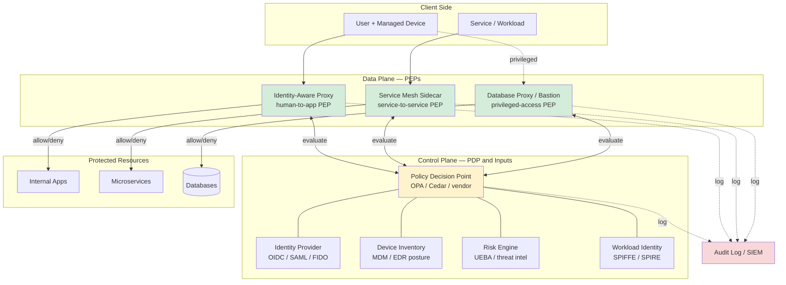
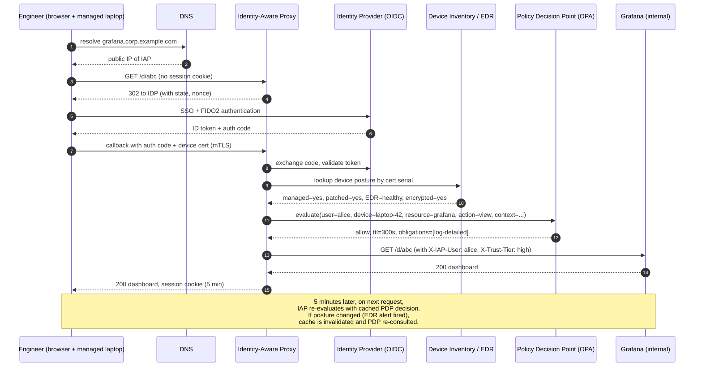

# Zero Trust Architecture — BeyondCorp, Identity-Aware Proxies, Continuous Verification

**Date:** 2026-04-26 | **Updated:** 2026-04-26
**Tags:** `system-design` `security` `zero-trust` `beyondcorp`

## Table of Contents

- [Summary](#summary)
- [Why This Matters](#why-this-matters)
- [The Principle — "Never Trust, Always Verify"](#the-principle--never-trust-always-verify)
  - [What Zero Trust Replaces](#what-zero-trust-replaces)
  - [What Zero Trust Does NOT Mean](#what-zero-trust-does-not-mean)
- [Key Concepts](#key-concepts)
  - [BeyondCorp — Google's Production Model](#beyondcorp--googles-production-model)
  - [NIST SP 800-207 — The Reference Framework](#nist-sp-800-207--the-reference-framework)
  - [Identity-Aware Proxy (IAP)](#identity-aware-proxy-iap)
  - [Microsegmentation](#microsegmentation)
  - [Policy Decision Point vs Policy Enforcement Point](#policy-decision-point-vs-policy-enforcement-point)
  - [Continuous Verification](#continuous-verification)
- [Architecture Diagram](#architecture-diagram)
- [Trade-offs vs Perimeter Security](#trade-offs-vs-perimeter-security)
- [A Concrete Request, End to End](#a-concrete-request-end-to-end)
- [Policy as Code — What a Real Policy Looks Like](#policy-as-code--what-a-real-policy-looks-like)
- [Service Mesh and ZTA — Where They Overlap](#service-mesh-and-zta--where-they-overlap)
- [Real-World Uses](#real-world-uses)
- [Anti-Patterns](#anti-patterns)
- [Adoption Path — Realistic Increments](#adoption-path--realistic-increments)
- [Related](#related)
- [References](#references)

## Summary

Zero Trust Architecture (ZTA) discards the assumption that being on a "trusted network" implies authorization. Every request — from a user, device, or service — must present verifiable identity, satisfy device posture and contextual checks, and be authorized for the specific resource at the moment of access. There is no perimeter that grants implicit trust; the VPN-shaped network has been replaced by a per-request authentication and authorization fabric. Google **BeyondCorp** is the canonical production case study, **NIST SP 800-207** is the vendor-neutral reference framework, and **Identity-Aware Proxies** (Google IAP, Cloudflare Access, Tailscale) are the most common enforcement pattern. Zero Trust is **not** a product, **not** a synonym for mTLS, and **not** "we threw away the firewall."

## Why This Matters

Most breaches in the last decade did not involve breaking the perimeter — they involved an attacker who already lived inside it. Phished credentials, a contractor's laptop, a compromised CI runner, a stolen VPN token: all turn the "trusted network" into an attacker's playground because the perimeter model treats network location as proof of intent. Zero Trust collapses that assumption. If an attacker steals a session, lands on the Wi-Fi, or pivots from one workload to another, they still face the same per-request authentication, authorization, and device-posture checks every legitimate caller does.

In design reviews, ZTA is the right vocabulary when:

- You are migrating off a flat corporate VPN and the question is "what replaces it?"
- You have east-west traffic between services and someone proposes "we don't need auth between services because they're inside the cluster."
- A vendor is selling you "zero trust" that turns out to be a rebadged firewall.
- You need to articulate why mTLS alone, without identity-aware authorization, is not zero trust.
- You are explaining the difference between **authentication** (proving who you are), **authorization** (deciding what you can do), and **trust** (a runtime, contextual verdict that ZTA refuses to grant statically).

## The Principle — "Never Trust, Always Verify"

The phrase comes from John Kindervag's 2010 Forrester report. The expanded form that survives in NIST SP 800-207 is:

> No user, device, or workload is implicitly trusted because of where it is, what network it is on, or what it was trusted as five minutes ago. Every request is authenticated, authorized, and verified against current context before access to a resource is granted. Trust is computed per request, not per session or per network segment.

Three load-bearing words:

- **Per request.** Not per session, not per VPN connection, not per "I scanned my badge this morning." Each access decision uses the freshest signals available.
- **Resource.** The unit of authorization is a specific resource (an HTTP route, an API method, a database table, an SSH host) — not a network segment that contains many resources.
- **Context.** Identity alone is insufficient. Device posture, location, time, behavioral baseline, and risk signals all feed the decision.

### What Zero Trust Replaces

The classical perimeter ("castle-and-moat") model:

| Perimeter Model | Zero Trust |
|-----------------|------------|
| Trust = inside the firewall / VPN | Trust = computed per request |
| Network segment is the security boundary | Identity + device + resource is the boundary |
| Authn at session start, then implicit | Authn + authz on every request |
| Internal services trust each other on a flat network | Internal services authenticate each other (workload identity) |
| VPN provides "access to the network" | IAP provides access to **a specific app**, not the network |
| Firewall rules over IPs and ports | Policy over identity, device, resource, context |

The perimeter model fails predictably: phishing, supply-chain compromise, lateral movement after initial access, and BYOD all bypass the moat. Zero trust treats the inside of the network as if it were already compromised — because in any organization above some size, statistically it is.

### What Zero Trust Does NOT Mean

This is where most "zero trust" projects go wrong. Zero trust is **not**:

- **"We turned off the firewall."** Defense in depth still applies. ZTA is additive over network controls, not a replacement for them. You still want firewalls, WAFs, DDoS protection, and segmentation as redundant layers.
- **"We installed mTLS, so we're zero trust."** mTLS proves _identity_ between two endpoints. It does not by itself decide _authorization_ for a specific resource based on _context_. mTLS is a primitive ZTA uses; it is not ZTA.
- **"We bought Vendor X's Zero Trust product."** Zero trust is an architectural posture, not a SKU. Any vendor whose pitch reduces to "buy our box and you're zero trust" is selling a perimeter relabeled.
- **"No network segmentation needed."** Microsegmentation is a core ZTA technique; what changes is that segments are defined by identity and policy, not by static IP blocks.
- **"VPN replacement."** It often _is_ a VPN replacement, but the architecture's value is broader — internal east-west traffic, service-to-service auth, database access, and CI/CD all benefit even if you keep a VPN for legacy gear.
- **"Removes the need for endpoint security."** Device posture (EDR signal, OS patch level, disk encryption, MDM enrollment) is an _input_ to ZTA decisions. You need more endpoint security, not less.
- **"Achievable in one project."** BeyondCorp at Google took years and remains an ongoing program. Treat ZTA as a multi-year migration, not a quarter's deliverable.

## Key Concepts

### BeyondCorp — Google's Production Model

After Operation Aurora (2009), Google concluded that the corporate network was not a meaningful security boundary. The BeyondCorp program (papers published 2014–2018 in `;login:`) reorganized access around three pillars:

1. **Authenticate the user with strong identity.** SSO with hardware-backed second factors (originally TOTP, eventually U2F / FIDO security keys). No bare passwords for sensitive resources.
2. **Authenticate the device.** Every corporate device has a managed certificate and continuously reports posture (OS, patch level, disk encryption, EDR status) into a centralized inventory.
3. **Make access decisions per request, mediated by a proxy.** The **Access Proxy** sits in front of every internal application. It evaluates identity, device, and policy at each request and forwards only authorized traffic. There is no separate "internal network" — corporate apps are reached over the public internet through the Access Proxy.

The result for an employee: open a laptop anywhere in the world, hit `internal-tool.corp.google.com`, get redirected through SSO + device check, then through the Access Proxy. There is no VPN. The same model whether the employee is on the office Wi-Fi or in a hotel.

The BeyondCorp papers (six in total, on `login.usenix.org`) are the practical playbook: device inventory, trust tiers, migration strategy, and what broke along the way. They predate the NIST framework and remain the most concrete production reference.

### NIST SP 800-207 — The Reference Framework

Published August 2020. Vendor-neutral, technology-agnostic, defines tenets and a logical architecture rather than products. The document is short (~50 pages) and worth reading end to end. The seven tenets:

1. All data sources and computing services are considered resources.
2. All communication is secured regardless of network location.
3. Access to individual enterprise resources is granted **on a per-session basis** with the **least privilege** required.
4. Access is determined by **dynamic policy** — including identity, application/service, requesting asset, and possibly other behavioral and environmental attributes.
5. The enterprise monitors and measures the integrity and security posture of all owned and associated assets.
6. All resource authentication and authorization are dynamic and strictly enforced before access is allowed.
7. The enterprise collects as much information as possible about the current state of assets, network infrastructure, and communications and uses it to improve its security posture.

Logical components defined by NIST:

- **Policy Engine (PE)** — decides whether to grant access. The brain.
- **Policy Administrator (PA)** — establishes and tears down the communication path between subject and resource based on the PE's decision.
- **Policy Enforcement Point (PEP)** — the data-plane gate that actually allows or blocks the traffic.
- **Policy Decision Point (PDP)** — the PE plus PA together (the control plane).

NIST also distinguishes three deployment variants — **enhanced identity governance**, **microsegmentation**, and **network infrastructure / SDN-based** — recognizing that real organizations adopt ZTA along whichever axis their existing tools support best.

### Identity-Aware Proxy (IAP)

The most common practical PEP. An identity-aware proxy sits in front of an application and enforces:

1. The caller is authenticated (typically via OIDC / SAML SSO).
2. The caller's device meets posture requirements (managed, patched, encrypted).
3. The caller is authorized for _this specific app or path_ based on policy (group membership, risk score, time, location).
4. The session is continuously evaluated; tokens are short-lived and re-checked.

Production examples:

- **Google Cloud IAP** — sits in front of GCE backends and App Engine, enforces IAM policy per request, requires Google identity. Replaces the VPN for accessing internal Google Cloud apps.
- **Cloudflare Access** (part of Cloudflare One / Zero Trust) — sits at Cloudflare's edge, integrates with any IdP, can front public or private apps via Cloudflare Tunnels (no inbound firewall holes).
- **Tailscale** (with WireGuard) — overlay network where every node is mutually authenticated by identity, ACLs are per identity not per IP, and the "perimeter" is the identity graph.
- **AWS Verified Access** — IAP sitting in front of HTTP/HTTPS apps in AWS, integrated with IAM Identity Center and third-party trust providers (Jamf, CrowdStrike) for device posture.
- **Pomerium**, **Teleport**, **StrongDM** — open-source / commercial alternatives, often used for SSH, RDP, Kubernetes, and database access.

The IAP pattern works for human-to-app traffic. For service-to-service traffic, the corresponding pattern is a service mesh sidecar (Istio / Linkerd) acting as PEP.

### Microsegmentation

Network segmentation where the segment boundary is **per workload or per identity**, not per VLAN. Implementation options:

- **Identity-aware firewalls** (Illumio, Cisco Tetration, Akamai Guardicore) — agents on hosts enforce policy based on workload identity, not source IP.
- **Service mesh authorization policies** — Istio `AuthorizationPolicy`, Linkerd Server / ServerAuthorization, where allow/deny is by SPIFFE identity.
- **Cloud-native** — AWS security groups referencing other security groups (rather than CIDR ranges), GCP Service Connect, Azure Application Security Groups.
- **Kubernetes NetworkPolicy** with Cilium (eBPF-based, identity-aware) gives identity-based pod-to-pod policy.

The benefit: a compromised workload cannot freely talk to others on the same subnet. Lateral movement requires re-authenticating to each next hop and being authorized for it — usually a much harder ask than a flat-network ARP scan.

### Policy Decision Point vs Policy Enforcement Point

Confusing these is one of the most common ZTA mistakes. They are separate components for good reason.

| Component | Role | Lives where | Latency budget |
|-----------|------|-------------|----------------|
| **PDP (Policy Decision Point)** | Evaluates policy. "Should this request be allowed?" Reads identity, device posture, resource, context, returns allow/deny + obligations. | Centralized control-plane service (or per-region replica). May call out to OPA, IAM, device inventory, risk engine. | Tens to low hundreds of ms acceptable; cacheable. |
| **PEP (Policy Enforcement Point)** | Enforces the decision. Sits on the request path; either lets the request through or rejects it. Cannot make decisions itself — only enforces. | At the edge in front of every protected resource: API gateway, sidecar, IAP, service mesh proxy, database proxy. | Sub-millisecond on the hot path; cached decisions or short-lived tokens. |

Why split them:

- **PDP centralization** lets you express, audit, and update policy in one place across heterogeneous PEPs. Otherwise every gateway has its own bespoke ACLs and the policy diverges.
- **PEP distribution** keeps enforcement close to the resource, so the data plane stays fast and a PDP outage degrades but does not kill the system (PEPs cache last-known decisions with a TTL and a fail-closed mode).

A typical request flow:

1. Client hits PEP (e.g., IAP) with a request.
2. PEP collects context (identity claim, device cert, resource path) and calls PDP — usually OPA, AuthZed/SpiceDB, or a vendor PDP.
3. PDP evaluates policy as code (Rego, Cedar, custom) using inputs from IAM, device inventory, risk signals.
4. PDP returns allow/deny + obligations (e.g., "allow but step-up MFA," "allow for 5 minutes").
5. PEP enforces the decision; logs full context for audit.

The PDP/PEP split mirrors the XACML pattern from the early 2000s (PEP/PDP/PIP/PAP); ZTA is XACML's surviving practical descendant.

### Continuous Verification

The "always verify" half. Concretely this means:

- **Short-lived credentials.** Sessions, tokens, certificates expire in minutes to hours, not days. Refresh requires re-evaluation by the PDP.
- **Device posture re-checks.** A device that was healthy 30 minutes ago may now be running an out-of-date OS or have its EDR disabled. Posture is a stream of signals, not a one-time check at login.
- **Risk-adaptive authentication.** Anomalous behavior (impossible travel, new device, off-hours sensitive action) triggers step-up MFA or denies the request. Provided by IdPs (Okta, Entra ID) or risk engines.
- **Mid-session revocation.** When an employee leaves or a device is reported lost, every active session and token must die quickly — minutes, not the next-token-refresh window. Requires a token-revocation channel or short-enough TTLs.
- **Behavioral baselines.** UEBA (user and entity behavior analytics) feeds the PDP with anomaly signals; "Alice never queries the prod DB at 3 AM from a new IP" becomes a data point that can downgrade authorization.

The key idea is that the verification result has a **TTL**, and that TTL is short enough that a credential stolen now becomes useless soon after.

## Architecture Diagram



Key things the diagram makes concrete:

- Every protected resource sits **behind a PEP**. There is no path that bypasses one.
- The PDP is **not on the request path**; it is consulted by PEPs, and PEPs cache decisions with short TTLs.
- The PDP fuses **multiple inputs** — identity, device posture, workload identity, risk. None alone is sufficient.
- Audit logging is **first-class**: every decision and every request is centrally logged for forensics and policy iteration.
- Service-to-service and human-to-app share the same control plane but use different PEP shapes (sidecar vs proxy).

## Trade-offs vs Perimeter Security

ZTA is not free. The trades are real and worth naming.

| Dimension | Perimeter | Zero Trust |
|-----------|-----------|------------|
| **Initial complexity** | Low — a firewall and a VPN | High — IdP, device inventory, PDP, PEPs, policy as code |
| **Operational toil** | Per-segment firewall rules drift | Policy as code, but more components to operate |
| **Latency on the hot path** | Effectively zero once inside | A few ms per request for PEP + cached PDP decision |
| **Attacker effort to lateral-move** | Low after initial breach | High — every hop requires fresh authn/authz |
| **Insider threat** | Not addressed | Significantly mitigated |
| **Remote / hybrid work fit** | Awkward (VPN scaling, split tunneling) | Native — no perimeter to extend |
| **BYOD and contractors** | Hard — usually separate VLAN | Native — device posture decides access per request |
| **Mergers / acquisitions** | Painful network integration | Federate identity, plug acquired apps behind same PEP |
| **Audit and compliance evidence** | Network-flow logs | Per-request access logs with full identity + device context |
| **Failure mode** | Big — breach of perimeter = full inside access | Smaller — each compromised credential is bounded by per-request policy |
| **Cost to roll back a bad policy** | High — firewall rule changes ripple | Low — policy as code, versioned, reversible |
| **Startup cost** | Cheap firewall license | IdP licenses, IAP, MDM, EDR, PDP — real money |
| **Mature talent pool** | Network engineers everywhere | ZTA practitioners scarcer; growing |

The bottom line: the larger and more distributed the organization, the more ZTA pays back. For a five-person startup with one office and one cloud account, a well-configured perimeter plus SSO can be sufficient. Above some scale — say, a few hundred employees, multi-cloud, contractors, BYOD — the perimeter model collapses under its own complexity and ZTA wins.

## A Concrete Request, End to End

To make the abstract pieces tangible, here is what happens when an engineer at a BeyondCorp-style company opens an internal Grafana dashboard from a coffee shop.



Things to notice:

- The **engineer never connected to a VPN**. The IAP is reachable on the public internet; access is gated by per-request policy, not by network reachability.
- **Three independent inputs** combine: identity (FIDO2 via IDP), device (mTLS cert + posture lookup), and policy (PDP). Compromise of any one alone does not grant access.
- The **decision has a TTL** (5 minutes here). After that, the IAP re-evaluates. If during that window the device's EDR raised an alert, the decision cache for that device is purged and the next request gets re-evaluated.
- **The application sees a verified identity header** injected by the IAP. The app does not handle SSO itself; it trusts the IAP for authentication and applies its own resource-level authorization on top.
- **Every step is logged.** A SIEM ingests the full path: DNS, IAP request, IDP issuance, posture lookup, PDP decision, app response. Forensics on a compromised account walk this trail backwards.

## Policy as Code — What a Real Policy Looks Like

ZTA policies are best expressed as code in a dedicated policy language: Rego (OPA), Cedar (AWS / Cedar-policy.org), or a vendor DSL. A simplified Rego policy for the Grafana scenario above:

```rego
package corp.iap.grafana

default allow := false

# Allow if the caller is a member of the right group, on a healthy
# managed device, and not flagged by the risk engine.
allow if {
    input.user.groups[_] == "engineering"
    input.device.managed == true
    input.device.os_patch_age_days < 30
    input.device.disk_encrypted == true
    input.device.edr_status == "healthy"
    input.risk.score < 50
}

# Step-up MFA required if the engineer is on a new device or
# accessing from a new country in the last 7 days.
require_step_up if {
    input.device.first_seen_days < 1
}

require_step_up if {
    input.context.country != input.user.country_history[_]
}
```

What this captures concretely:

- **Default-deny.** The policy starts at `false` and only grants `allow` when every condition holds. Adding a new attribute can never accidentally widen access.
- **Multiple inputs combined.** Identity (`groups`), device (`managed`, `os_patch_age_days`, `disk_encrypted`, `edr_status`), and risk (`risk.score`) all matter. No single input is sufficient.
- **Obligations and step-up.** The PDP can return more than allow/deny: "allow but require step-up" is a common output that the PEP knows how to enforce.
- **Reviewable and testable.** Policy in code can be unit-tested, code-reviewed, version-controlled, and rolled back. Compare to a click-trail of firewall rule changes that nobody remembers.

The same pattern in Cedar:

```cedar
permit (
    principal in Group::"engineering",
    action == Action::"view",
    resource == Application::"grafana"
)
when {
    principal.device.managed &&
    principal.device.os_patch_age_days < 30 &&
    principal.device.disk_encrypted &&
    principal.device.edr_status == "healthy" &&
    context.risk_score < 50
};
```

The choice between Rego and Cedar is mostly ergonomic. Rego is more general (logic programming, can express almost anything); Cedar is narrower and analyzable (you can statically prove properties like "no policy lets external users reach prod"). For ZTA, the analyzability of Cedar is increasingly attractive.

## Service Mesh and ZTA — Where They Overlap

A common design-review question: "Isn't our Istio service mesh already zero trust?" Partially. They overlap heavily but are not the same.

**What a service mesh provides that maps to ZTA:**

- **Workload identity** (SPIFFE/SPIRE-style certificates issued per workload).
- **mTLS everywhere** — every pod-to-pod call is mutually authenticated and encrypted.
- **Authorization policies** scoped to identity, not IP.
- **Sidecar PEPs** — every workload's outbound and inbound traffic passes through a proxy that can enforce policy.
- **Telemetry** — uniform request logs feed the audit trail.

**What a service mesh alone does NOT give you:**

- **Human identity.** A mesh authenticates _services_; it does not know who Alice is. You still need an IdP and an IAP for human-to-app traffic.
- **Device posture.** The mesh knows the workload identity, not which laptop or phone the human is calling from.
- **Cross-trust-domain federation.** Meshes are typically scoped to one cluster or federation; ZTA spans clusters, clouds, SaaS, on-prem, and contractors.
- **Risk-adaptive evaluation.** The mesh evaluates static policy. UEBA and step-up MFA happen elsewhere.
- **Resource-level granularity beyond HTTP.** Database row-level access, file-level access in object stores, SSH session policy — these need their own PEPs.

The honest answer: **a service mesh is the east-west PEP layer of a ZTA.** It is necessary for service-to-service ZTA at scale, and not sufficient for the whole thing.

## Real-World Uses

- **Google internal access** — BeyondCorp; every internal tool accessed via Access Proxy from any network. No corporate VPN.
- **Cloudflare** — runs its own corp on Cloudflare Access + WARP; published the playbook.
- **Netflix** — moved off VPN to LISA (their internal ZTA) and BLESS-style ephemeral SSH credentials.
- **Capital One** — public ZTA program after the 2019 breach; identity- and posture-based access to AWS resources.
- **US Federal Government** — OMB Memorandum M-22-09 (Jan 2022) mandates federal agencies move to a zero-trust architecture by end of FY2024, citing NIST 800-207 as the reference. CISA's Zero Trust Maturity Model operationalizes this for agencies.
- **Tailscale** — productizes the BeyondCorp idea for small/mid orgs: WireGuard overlay + identity-based ACLs + device posture, no VPN concentrator.
- **GitHub** — uses identity-aware access for production (no VPN to prod; SSO + device + just-in-time access via okta-aws-cli–style flows).
- **Microsoft** — Entra Conditional Access is a ZTA PDP that fronts both M365 and arbitrary apps; a major commercial implementation of the pattern.

## Anti-Patterns

These are the most common ways "zero trust" projects fail or get sold short.

- **"We have mTLS everywhere, so we are zero trust."** mTLS is mutual authentication. It does not by itself authorize a specific call against a specific resource based on identity, device, and context. It is one PEP primitive, not the architecture.
- **"We bought Vendor X's Zero Trust Suite."** Buying products is fine, but ZTA requires _design and policy_, not just licenses. Any pitch that conflates the two is a perimeter relabel.
- **"We turned the firewall off."** Defense in depth still applies. ZTA is additive over network controls, not a replacement. If your PEP is bypassable from a flat network, network controls are still a meaningful redundancy.
- **"Trust the corporate Wi-Fi."** A common compromise during migration: "we'll require ZTA from the internet but trust the office network for now." This recreates the perimeter you tried to leave. Either trust nothing, or be explicit that "office Wi-Fi" is a posture _signal_ that downgrades step-up requirements rather than an _exemption_ from authn/authz.
- **"Per-session, not per-request."** If the PDP is consulted only at login and the resulting session lasts eight hours, you have re-invented the VPN. Continuous verification means short-lived tokens and frequent re-evaluation.
- **"Allow once granted."** PEPs that cache "allow" decisions for hours give attackers long-lived bypasses after a compromised credential briefly satisfied policy. Decision TTLs should be minutes, with a revocation channel.
- **"Identity is enough."** Identity without device posture lets stolen credentials walk through the front door. Device posture without identity lets a managed device used by anyone access everything. Both required.
- **"PDP on the data path."** Inserting a synchronous PDP call on every request without caching turns the PDP into a hot single point of failure. PDP outage should degrade gracefully (fail-closed for sensitive resources, cached-allow for low-sensitivity), not stop the business.
- **"Centralized policy, divergent enforcement."** Different PEPs interpret policy differently because each gateway has its own DSL. Use a shared policy engine (OPA, Cedar) with a single policy source so the same intent is enforced everywhere.
- **"ZTA replaces threat modeling."** It does not. You still need to enumerate assets, threats, and trust boundaries. ZTA changes _which_ trust boundaries exist; it does not eliminate the modeling exercise.
- **"All-or-nothing migration."** Trying to flip the entire estate at once fails. BeyondCorp was incremental over years: classify resources by sensitivity, add IAP for the easy ones, migrate harder ones (legacy apps, databases, SSH) progressively.

## Adoption Path — Realistic Increments

A pragmatic order most successful programs use:

1. **Identity foundation.** Single IdP, SSO for everything, FIDO2 / passkey MFA, JIT provisioning, leaver workflow under 30 minutes. Without this, nothing else works.
2. **Device inventory and posture.** MDM enrollment for managed devices, EDR everywhere, posture telemetry into a central store. Decide on trust tiers.
3. **IAP in front of one easy internal app.** Pick a well-bounded HTTP app, put it behind an IAP, retire its VPN access. Learn the operational rough edges.
4. **Expand IAP to all internal HTTP apps.** Old-school apps may need header injection or SAML adapters; budget for the long tail.
5. **Privileged access (SSH, DB, kube).** Replace bastion + shared keys with identity-aware brokers (Teleport, AWS SSM, BLESS-style ephemeral certs). Just-in-time access with approval workflows for production.
6. **East-west, service-to-service.** Service mesh with mTLS and identity-based authorization. Start with audit-only mode, then enforce.
7. **Microsegmentation in cloud.** Security groups by identity, NetworkPolicy with Cilium, or identity-aware host firewalls. Replace flat subnets.
8. **Continuous evaluation and risk signals.** Conditional Access policies, UEBA, step-up MFA. Plug risk into the PDP.
9. **Retire the VPN.** Only after almost everything has a non-VPN path. The VPN often survives for legacy gear that cannot be IAP-fronted; that's acceptable as long as it's a known, scoped exception.

Expect this to take 18–36 months for a mid-sized org. The BeyondCorp papers are explicit that Google's own migration was multi-year.

## Related

- [Defense in Depth and Threat Modeling](./defense-in-depth-and-threat-modeling.md) — ZTA is one layer of a defense-in-depth strategy and is informed by threat modeling, not a substitute for either.
- [Authentication](./authentication.md) — the identity primitives (OIDC, SAML, FIDO2, mTLS, SPIFFE) that ZTA's PDPs consume.
- [Authorization](./authorization.md) — RBAC, ABAC, ReBAC, and the policy engines (OPA, Cedar, SpiceDB) that implement the PDP.
- [API Gateway and BFF Patterns](../building-blocks/api-gateway-and-bff.md) — gateways are common PEPs in human-to-API ZTA flows.
- [Service Mesh — Istio, Linkerd, and Where They Pay Off](../building-blocks/service-mesh.md) — the east-west PEP layer.
- [TLS and mTLS in Practice](../../networking/security/tls-and-mtls.md) — the cryptographic primitive ZTA leans on for workload identity.
- [Secrets Management](./secrets-management.md) — short-lived credentials are how continuous verification is operationalized.

## References

- Rory Ward and Betsy Beyer, ["BeyondCorp: A New Approach to Enterprise Security"](https://research.google/pubs/pub43231/) (`;login:`, December 2014) — the original BeyondCorp paper. Companion papers in the series, all on `login.usenix.org`: ["Design to Deployment at Google"](https://research.google/pubs/beyondcorp-design-to-deployment-at-google/) (2016), ["The Access Proxy"](https://research.google/pubs/beyondcorp-the-access-proxy/) (2016), ["Migrating to BeyondCorp"](https://research.google/pubs/migrating-to-beyondcorp-maintaining-productivity-while-improving-security/) (2017), ["The User Experience"](https://research.google/pubs/beyondcorp-6-the-user-experience/) (2018), ["Building a Healthy Fleet"](https://research.google/pubs/beyondcorp-building-a-healthy-fleet/) (2018).
- Scott Rose, Oliver Borchert, Stu Mitchell, Sean Connelly, ["NIST Special Publication 800-207: Zero Trust Architecture"](https://nvlpubs.nist.gov/nistpubs/SpecialPublications/NIST.SP.800-207.pdf) (NIST, August 2020) — the vendor-neutral reference framework. Read end to end; it is the source most other ZTA vocabulary derives from.
- Evan Gilman and Doug Barth, _Zero Trust Networks: Building Secure Systems in Untrusted Networks_ (O'Reilly, 2017) — the practical book-length treatment, with implementation patterns and case studies.
- Google Cloud, ["Identity-Aware Proxy overview"](https://cloud.google.com/iap/docs/concepts-overview) — the concrete IAP product docs, useful for understanding how a production IAP integrates with IAM, OAuth, and load balancers.
- Cloudflare, ["What is Zero Trust security?"](https://www.cloudflare.com/learning/security/glossary/what-is-zero-trust/) and Cloudflare One / Access docs — a clear explainer plus a production IAP+overlay implementation.
- John Kindervag, ["No More Chewy Centers: Introducing The Zero Trust Model Of Information Security"](https://www.forrester.com/report/No-More-Chewy-Centers-Introducing-The-Zero-Trust-Model-Of-Information-Security/RES56682) (Forrester, 2010) — the paper that coined the term. Paywalled, but widely summarized.
- CISA, ["Zero Trust Maturity Model v2.0"](https://www.cisa.gov/zero-trust-maturity-model) (April 2023) — pragmatic maturity ladder across five pillars (Identity, Devices, Networks, Applications & Workloads, Data) used by US federal agencies.
- Office of Management and Budget, ["Memorandum M-22-09: Moving the U.S. Government Toward Zero Trust Cybersecurity Principles"](https://www.whitehouse.gov/wp-content/uploads/2022/01/M-22-09.pdf) (January 2022) — the federal mandate, useful as an example of an enterprise-wide ZTA program scope.
- Open Policy Agent, ["OPA Documentation"](https://www.openpolicyagent.org/docs/latest/) — the de facto open-source PDP for cloud-native ZTA, with Rego as the policy language.
